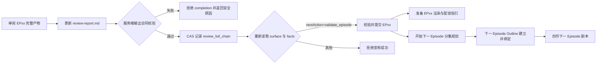

# Story Workspace 完整链路审阅完成门禁返工记录

日期：2026-08-07

范围：`review_full_chain` Agent 指令、规范报告校验、workflow completion 门禁与真实 run 只读复核

结论：采用“精确 Prompt 合同 + 服务端完成前校验 + 完成后状态复核”的唯一方案；不把 Agent 自述或别名文件作为完成事实。

## 1. 问题与真实证据

问题

→ 用户多次执行“审阅 EP01 完整产物”，后续“校验并提交 EP01”“准备 EP01 渲染与配音指引”和下一 Episode 入口仍未开放。

现状证据

→ 真实 run `run_b81d3731b56b4703868b66af76e7b656` 的 Episode UID 为 `432d16772fea4c5489d3a65d8ff3a152`。只读服务投影结果为 `facts_revision=6`、`next_action=review_full_chain`、`can_dispatch=true`。

→ 规范 `review-report.md` 的 scope 仍为 `script`，verdict 为 `APPROVED`，只包含 `script.md`，没有 `source_revisions`。

→ 工作空间另有 `full-chain-review-report.md`，但 adapter 只解析规范 `review-report.md`；别名不能拥有审阅状态。

→ 当前实际 Prompt 投影为 66 条，Shot 覆盖为 22/22，`orphan_prompts=[]`，因此阻塞不来自 Prompt 或分镜缺失，而来自完整审阅输出合同未成立。

根因

→ 旧私有指令只写“full-chain review-report.md”，未明确唯一文件名、必需 frontmatter、逐文件 revisions 和失败后禁止 completion。

→ completion MCP 只验证身份、action input 和 CAS，没有验证完整审阅产物的后置条件；Agent 写错文件后仍可留下技术完成事实。

→ `review-report.md` 同时承载 script scope 与 full-chain scope；覆盖报告后，旧 action hash 会把上游资产/分镜 completion 判陈旧，造成流程回退。

最终决策

→ `review-report.md` 是唯一审阅文件；用 `scope` 区分剧本审阅与完整链路审阅，不新增第二种报告状态。

→ 完整审阅必须显式引用当前 outline、script、storyboard 和全部 Prompt 文件及其 revisions，并满足完整 Shot/Prompt 覆盖。

→ completion 写入前由服务端复核；失败返回稳定 reason 与中文安全说明，facts revision 不增长。

→ 当前 full-chain 报告完整引用所有规范上游时，可作为旧上游 completion 仍对应当前产物的证据，避免同一报告文件升级 scope 后错误回退。

→ 完成后服务端重新读取 surface；只有下一动作确认为 `validate_episode` 才返回成功。

## 2. 业务状态机



“审阅完整产物”不会直接开放下一 Episode 剧本；必须先经过当前 Episode 校验，再规划并绑定下一 Episode Outline。

## 3. 输出合同

Dream Agent 私有指令现在明确：

- 唯一规范输出为 `review-report.md`；禁止 `full-chain-review-report.md`、`review-final.md` 等别名；
- 必须声明 `scope: full-chain` 与 `overall_verdict: APPROVED`；
- `reviewed_files` 必须且只能包含当前 `episode-outline.md`、`script.md`、`storyboard.yaml` 和全部 `prompts/*.yaml|*.yml`；
- 不得把 `review-report.md` 自身作为被审阅输入；
- `source_revisions` 必须逐项等于当前 canonical file sha256；
- 必须从实际 Shot 与 Prompt 条目重新计算数量，不采信 `total_shots` 等摘要；
- 任一校验失败时禁止记录 completion、禁止继续 validation/render/下一 Episode。

## 4. 服务端门禁

服务端在 `review_full_chain` completion 前检查：

1. `review-report.md` 可解析且 availability 为 available；
2. scope 为 full-chain，verdict 为 APPROVED；
3. reviewed artifacts 与当前四类规范输入精确一致；
4. outline、script、storyboard 与每个 Prompt 文件 revision 精确一致；
5. Prompt 页完整、每个 Shot 至少被关联、无 orphan Prompt；
6. 当前 workflow 仍处于可派发的 review_full_chain；
7. CAS completion 后重新读取并确认下一动作是 validate_episode；
8. 同 message/input/manifest 的重复调用返回同一个 completion，不新增 revision。

拒绝响应继续使用 `DREAM_WRITE_REJECTED`，并只增加受控的 `reason` 与中文 `message`；不返回绝对路径、actor、Deck、run binding、隐藏 thread 或原始工具参数。

## 5. TDD 记录

Red：新增四个聚焦用例首次运行结果为 `4 failed`：

- 私有指令没有规范输出合同；
- 别名完整报告被错误接受；
- 缺失 source revisions 的报告被错误接受；
- 合法报告完成后因报告 revision 覆盖而回退到 storyboard。

Green：实现后新增和受影响聚焦用例为 `4 passed`，随后相关 Episode workflow、multi-Episode、recovery、MCP 和 context builder 套件为：

```text
205 passed, 21 subtests passed
```

后端全量：

```text
1550 passed, 1 skipped, 19 warnings, 632 subtests passed in 59.51s
```

前端静态检查：

```text
npx tsc -b
exit 0
```

全仓 `npx eslint .` 被 68 个既有错误和 21 个既有 warning 阻断，诊断全部位于本轮未修改的旧前端文件；本轮没有前端文件变更，也没有为通过检查而修改其他工作线。

## 6. 真实 run 只读验收

本轮没有派发真实动作，也没有修改真实 artifact。读取结果：

| 事实 | 值 |
|---|---|
| run | `run_b81d3731b56b4703868b66af76e7b656` |
| Episode UID | `432d16772fea4c5489d3a65d8ff3a152` |
| manifest revision | `sha256:3e96262f64b145f73605e395d60ff44e6fab68019ead5f90fece62a83267106a` |
| workflow facts revision | `6` |
| next action | `review_full_chain` |
| canonical review scope | `script` |
| canonical review verdict | `APPROVED` |
| reviewed artifacts | `script.md` |
| Prompt 条目 | `66` |
| Shot/Prompt 覆盖 | `22/22` |
| orphan Prompt | `0` |
| renders | `not_generated` |

这证明当前 run 仍需要再次执行受控完整审阅，由新指令更新规范报告；不能根据既有错误 completion 推断已经通过。

## 7. 工作区与运行边界

- 未修改 `backend/database.py`；
- 未修改任何前端文件；
- 未改写真实 run、Episode 或 artifact；
- 未重启或关闭用户已有的 5173、8765 服务；
- 当前 8765 是用户通过 debugpy 启动的既有进程，本轮源代码将在该进程下次由用户重启后加载；
- 未执行归档操作；
- 未执行提交、推送或 PR 操作。
