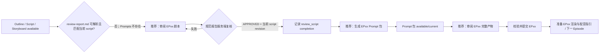

# Story Workspace 无推荐动作与旧审阅报告恢复实施记录

> 日期：2026-08-07  
> 目标 Run：`run_fdd7012110c74d1db96c1ff396dd6491`  
> 结论：修复“审阅报告来源无效导致 Dream Agent 没有推荐按钮”；未派发真实动作，未修改真实 Episode 文件，未执行归档。

## 本轮 Optimized Prompt

调查并修复目标 Run 在 `episode-outline.md`、`script.md` 与 `storyboard.yaml` 已存在、`prompts/` 尚未生成且 `review-report.md` 为旧格式无效来源时，Dream Agent 不显示推荐动作的问题。以真实 Episode binding、artifact manifest、workflow facts 和服务端 action projection 为真相源；不得让前端根据产物进度 DOM 推导按钮。采用 TDD：先证明旧报告错误地投影为不可派发的完整链路审阅，再使它投影为可派发的当前剧本审阅修复动作；同时约束 Agent 必须写出带准确 scope、reviewed files 与当前 script revision 的规范报告，服务端复核通过才记录 completion，并证明后续推荐自动进入 Prompt 生成。

## Optional Enhancers

- 旧报告可修复，但普通损坏产物继续禁止派发，避免扩大可写边界。
- 剧本审阅和完整链路审阅分别使用严格、互不混淆的输出合同。
- writer event 不作为状态真相；完成事实写入后仍由 REST surface/facts 重投影。
- 真实 Run 只做只读读取和临时副本模拟，不覆盖现有 artifact，不触发模型或付费调用。

## 执行计划与验收标准

1. 读取真实 Run 的 Episode binding、manifest、artifact availability/revisions 与 workflow facts。
2. Red：锁定 invalid report 必须产生可派发的 `review_script` 推荐动作；非规范报告不得写 completion。
3. Green：修复 resolver，增加 script-reviewer private prompt contract 和 server completion validator。
4. 证明规范报告完成后 next action 为 `generate_prompts`，并验证幂等重放。
5. 跑聚焦、全量后端、TypeScript、ESLint 与 Playwright Node seam。

验收标准：当前真实状态投影为 `review_script + canDispatch=true`；报告未满足规范时 completion 被拒绝；报告使用当前 `script.md` revision 且 APPROVED 时，completion 可幂等写入并投影为 `generate_prompts + canDispatch=true`；前端不新增 workflow 推导；其他 invalid artifact 继续 blocked。

## 问题判定

### P1：为什么没有推荐按钮

问题  
→ 真实页面显示 Outline、剧本、分镜已生成，Prompts 尚未生成，审阅报告来源无效，但 Dream Agent 没有可执行的推荐按钮。

现状证据  
→ 真实 surface：facts revision `2`，manifest revision `sha256:cacdb95d67f2a8e43c4dfbb995e282445ca6c4b1fc9350618088c56a89c92795`；Outline、script、storyboard available；prompts/renders not generated；review report invalid。  
→ `script.md` revision 为 `sha256:25ad69f4d945c8fcdcaa63ba7756ad58a7a7a453b49815ad43998f22483b478f`；真实 `review-report.md` 没有 YAML frontmatter、scope、reviewed files 或 source revisions。  
→ 修复前 resolver 在无法解析 review scope 时把 invalid report 归到 `review_full_chain`，随后对所有 invalid artifact 统一设置 `canDispatch=false`。

根因  
→ resolver 把“无法解析 scope 的旧报告”错误地当成完整链路报告损坏；它没有结合 Prompt 是否已经存在来判断这是剧本审阅阶段还是完整链路阶段。  
→ invalid artifact 的阻断规则没有区分“可由受控 reviewer 原位修复的规范报告”和“不可安全自动修复的普通产物”。  
→ `review_script` 的 Agent 指令和完成握手此前没有像 `review_full_chain` 一样强制检查规范输出，因此重复点击可能记录 completion，却仍留下不可解析报告。

可选方案  
1. 前端看到“来源无效”就自行显示“生成 Prompt”：拒绝。会绕过剧本审阅依赖并制造第二个 workflow owner。  
2. 把 invalid report 永久 blocked：拒绝。用户没有受控恢复路径。  
3. 服务端按 Prompt 产物阶段选择 reviewer 修复动作，并只允许两类审阅动作修复 invalid report：采用。

最终决策  
→ `prompts/` 尚未生成时，invalid canonical report 投影为 `review_script`；Prompt 包已存在时投影为 `review_full_chain`。  
→ 两个 reviewer 修复动作可以派发；Outline、script、storyboard、prompts 或 renders 等其他 invalid artifact 仍 blocked。  
→ UI 继续只消费服务端 action options；无需也禁止解析“第一集产物进度”来拼按钮。

影响范围  
→ Episode next-action resolver、Dream Agent trusted instruction、MCP completion validator、current/multi-Episode action projection tests。

风险  
→ 旧报告被 reviewer 覆盖。控制：仍需用户确认；只允许受控 action ID；后端要求 actor/run/story/Episode authority 与 launch provenance 已通过既有校验。  
→ Agent 再次写出纯 Markdown。控制：private prompt 明确唯一文件和 frontmatter；服务端在 CAS completion 前独立复核。

验收方式  
→ resolver 单测、projection 单测、MCP 拒绝/接受/幂等测试，以及真实 Run 临时副本状态迁移。

### P2：审阅按钮应携带哪些完整校验 Rule

问题  
→ 用户已经多次点击审阅，但后续的 Prompt、渲染与下一 Episode 状态仍未打开。

最终决策  
→ `review_script` 的私有指令必须要求唯一规范输出 `review-report.md`，frontmatter 包含：

```yaml
scope: script
overall_verdict: APPROVED
reviewed_files:
  - script.md
source_revisions:
  script.md: <current server canonical sha256>
```

→ `reviewed_files` 只能包含 `script.md`；`source_revisions` 必须且只能等于当前 server canonical script revision。写入后 Agent 必须重读核验，任何失败都不得记录完成，不得继续资产、分镜、Prompt、渲染或下一 Episode。  
→ 这些 Rule 不只存在于 Prompt：后端 completion validator 使用相同合同复核，避免 Agent 自报成功拥有 workflow truth。

## 状态转换



Truth ownership 未改变：artifact manifest 拥有 availability/revision；canonical files 拥有正文；workflow facts 拥有完成事实和可执行动作；Episode binding 拥有 EP 身份；Dream Agent message 仅展示过程；前端本地状态仅拥有展开、选中与草稿。

## TDD 证据

### Red

- resolver/projection/instruction：`3 failed`；实际错误为 `review_full_chain + canDispatch=false`，且 `review_script` 指令缺少规范报告合同。
- MCP completion：非规范纯 Markdown 报告仍被接受，测试因返回值没有 `error` 而失败。

### Green

- 聚焦状态转换与完成合同：`6 passed in 3.33s`。
- 四个相关后端文件：`143 passed, 21 subtests passed in 7.38s`。
- 正式后端测试集 `pytest -q tests`：`1555 passed, 1 skipped, 19 warnings, 632 subtests passed in 58.63s`。
- 误执行不带 `tests` 范围的 pytest 曾扫描 `backend/data/agent-workspace/**`，因外部 skill 缺少 pandas 在收集期产生 565 errors；收窄到正式测试集后全部通过，此项不计为产品失败或通过证据。
- `npx tsc -b`：exit 0。
- 改动工作区中的前端 TS/TSX ESLint：0 errors；CSS 不在 ESLint 配置内，报告 1 个 ignored warning。
- Playwright Node seam：`1 passed (1.3s)`，覆盖两个直接操作、更多操作、窄屏与焦点行为。

## 真实 Run 只读与临时副本证据

真实 Run 当前未被修改：

| 事实 | 值 |
|---|---|
| Run | `run_fdd7012110c74d1db96c1ff396dd6491` |
| Episode UID | `93c0656c179b483b885a51e3bf64ea1b` |
| Episode | `EP01` |
| Facts revision | `2` |
| Outline revision | `sha256:1664b7ceef097284571a484ba8b6440c7f21c9b7dff9c74ff8f926d6bde190a2` |
| Script revision | `sha256:25ad69f4d945c8fcdcaa63ba7756ad58a7a7a453b49815ad43998f22483b478f` |
| Storyboard revision | `sha256:4588102170cfc0a3abbf5b7b51ea245b6c78b08a50ff8e7893b6b6af171d3ddd` |
| Prompts / Renders | `not_generated / not_generated` |
| Review report | `invalid` |
| 修复后当前投影 | `review_script`, `canDispatch=true` |

将同一 workspace 复制到系统临时目录，只把副本报告改成绑定当前 script revision 的规范 script report，并在内存中追加同一 completion 后，投影为 `generate_prompts`, `canDispatch=true`；副本报告 revision 为 `sha256:108a5086d488fa8fd9988914572f4e2d8250e4a83a1fafea87eada01528c6af5`。临时目录结束后自动删除；真实 Run 文件与 facts revision 保持不变。

## 服务与工作区安全

- 5173（PID 48097）与 8765（PID 44201）均为用户本轮开始前已有服务；未停止、未重启。
- 运行中的 8765 是无 hot reload 的 debugpy Python 进程，因此不会在未重启前加载本次源码。为遵守“不关闭用户原有服务”，未替用户重启；源码、测试与临时副本证据均已完成。
- 本轮未触发真实 reviewer、模型、Prompt 生成、渲染或付费调用。
- 未修改 `backend/database.py`，未使用 localStorage 作为 workflow truth，未暴露 slash command 参数、绝对路径或凭证。
- 工作区另有 Dream Agent Dialog/CSS/Playwright 布局改动，属于其他工作线；本轮不覆盖、不格式化、不纳入本修复提交。
- 未执行归档操作。
