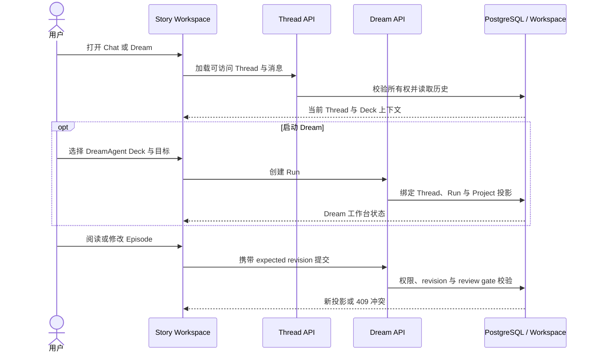

# Story Workspace 业务设计索引

本目录只保存当前有效的产品与交互设计，并按功能模块组织。执行日志、任务过程、测试清单、
评审过程和变更流水不放在这里。

## 核心概念定义

| 概念 | 定义 |
|---|---|
| Story Workspace | Chat、Dream、Project/Episode 与设置共享的产品外壳 |
| Project | 一组可持续编辑和索引的故事资产容器 |
| Episode | Project 下独立阅读、编辑和审阅的分集单元 |
| Dream Run | 从 DreamAgent 入口启动、绑定一个共享 Thread 的创作执行 |
| Artifact | Agent 在工作台生成、经投影后供页面读取的业务产物 |
| Revision | Project、Episode 或 Artifact 投影的并发版本 |
| Review gate | 未满足审阅要求时阻止受保护后续动作的服务端规则 |
| Work settings | Deck、资源链接和插件的集中管理分类 |

## 核心业务时序图

## 模块

| 文档 | 业务范围 |
|---|---|
| [产品范围与导航](./product-scope-and-navigation.md) | 角色、信息架构、路由与响应式外壳 |
| [Dream 工作空间与重入](./dream-workspace-and-reentry.md) | Run 发现、选择、同一 Thread 恢复与 Agent 工作台 |
| [Project 与 Episode 工作台](./project-and-episode-workbench.md) | Episode、故事线、场景、镜头的阅读与编辑 |
| [Artifact 阅读与降级](./artifact-reading-and-degradation.md) | 文件投影、revision、缺失、无效与降级显示 |
| [Skill 指令与工作台自动同步](./skill-commands-and-workbench-sync.md) | 已安装 Skill 的自由调用、Chat Slash 菜单和主 Agent Hook 自动同步 |
| [设置](./settings.md) | Story Workspace 设置导航与无障碍 |

Agent 对话与 Project/Episode 跨系统合同由以下文档定义：

- [Dream Agent 设计索引](../dream-agent/README.md)
- [Deck 管理、创建弹窗与版本设计索引](../deck/README.md)
- [Project / Episode Artifact 合同](../dream-agent/project-episode-artifact-contract.md)
- [Dream 工具与自动同步边界](../dream-agent/dreamflow-tool-boundaries.md)

## 权威规则

1. Chat history、streaming、运行时工具确认、Stop 和重连使用标准 Thread runtime，
   本目录不重新定义。
2. Workflow Run 只保留启动、权限、审阅和取消等真实业务事实；不得再为 Skill 建立阶段
   流转、推荐动作或 completion-fact 状态机。
3. 每个业务写操作在服务端重新校验用户身份、Thread 所有权、Workflow 权限、expected
   revision 和数据完整性。
4. 同一设计事实只归属于一个模块；其它文档通过链接引用，不复制竞争性生命周期或协议。
