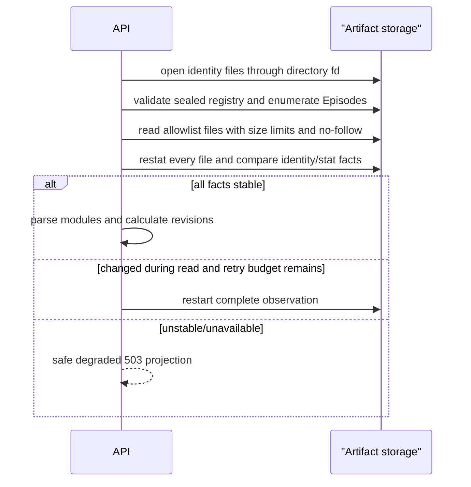

<!-- [Input] Authorized Episode artifact observations and per-module availability facts. -->
<!-- [Output] Safe reader ownership, revision refresh, degradation, and recovery rules. -->
<!-- [Pos] Story Workspace canonical Artifact reading contract. -->
<!-- [Sync] 2026-08-31: keep one reader in the matching draft EP and none in sync. -->

# Artifact reading and degradation

## Projection contract

The backend resolves an authorized Run/Story to a server-only Artifact locator,
parses only registered allowlist files and returns bounded DTOs. It never sends
paths or raw parser exceptions to the browser.

Each module has an independent availability:

```text
generating | available | missing | invalid | unavailable
```

`unavailable` means the storage observation could not be made safely (for
example unstable multi-file reads or service outage); it is not equivalent to
missing.

The file reader belongs to the matching Episode focus in the default Dream
draft. A direct EP selection opens it in place; a read action from the sync
coordination view returns to the same EP focus and selects the requested file
tab. The sync view may expose availability and navigation facts, but it does not
host a second reader.

## Isolation rules

- Invalid storyboard does not suppress a valid script/outline.
- Missing review does not make the Episode invalid.
- Invalid identity/registry blocks materialization because it invalidates the
  Project/Episode binding.
- Missing auxiliary files disable only their dependent actions.
- The last good module may remain visible with an explicit stale/degraded badge,
  never as if it were the current revision.

## Stable observation



## Revision refresh

The page polls or explicitly refreshes the business REST projection only while
the current business/Agent operation can produce new Artifacts. It sends
conditional revision headers, merges modules by stable source key and ignores
late responses older than the current observation. Polling is not an Agent
runtime and cannot change lifecycle.

## Error presentation

| Condition | Presentation | Allowed recovery |
|---|---|---|
| generating | pending module skeleton | wait/refresh |
| missing | module not produced | available Dreamflow action |
| invalid | contract error with safe code | regenerate/reconcile if authorized |
| unavailable | storage temporarily degraded | retry later; preserve safe last good |
| index stale/missing | separate index warning | controlled reconcile |

Focus remains on the selected valid item. If it disappears, selection moves to
the nearest valid parent and announces the change. Errors do not trigger an
automatic Agent message.
