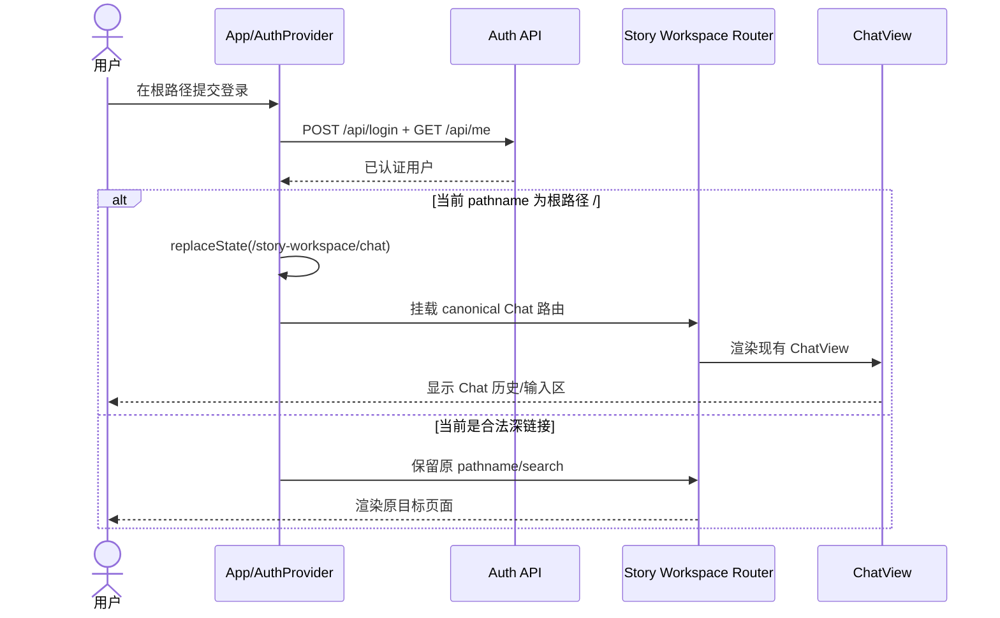
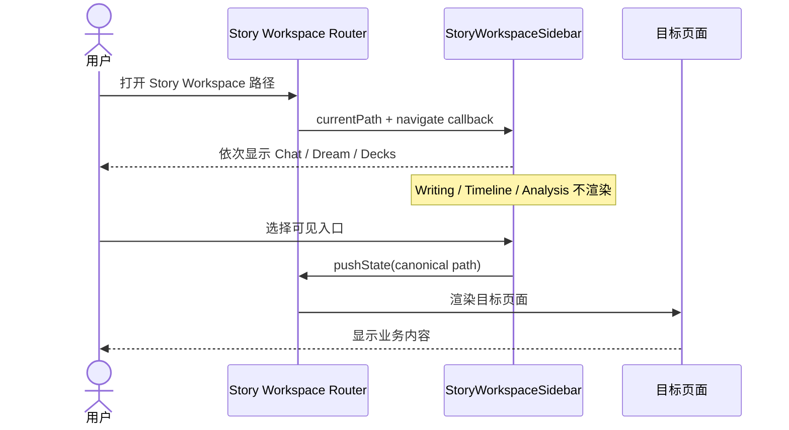
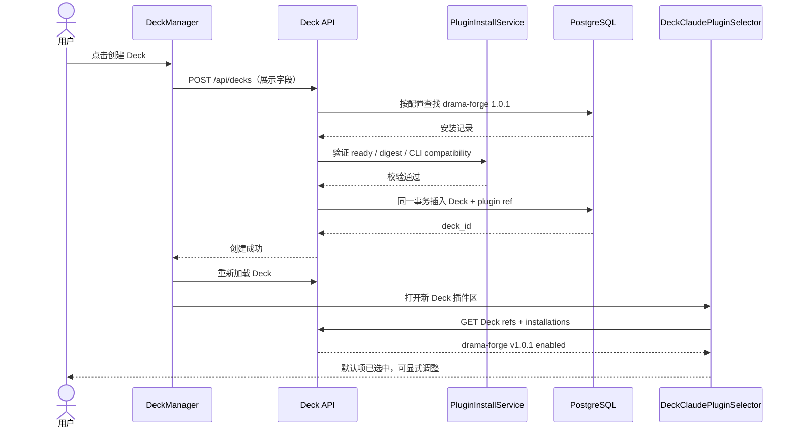
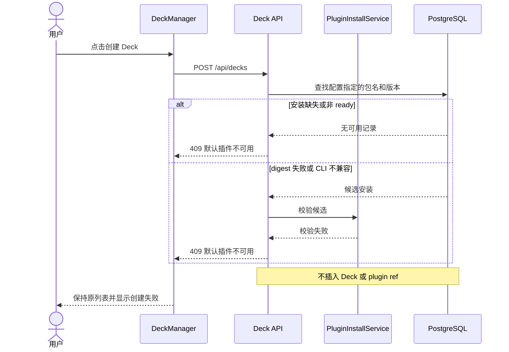
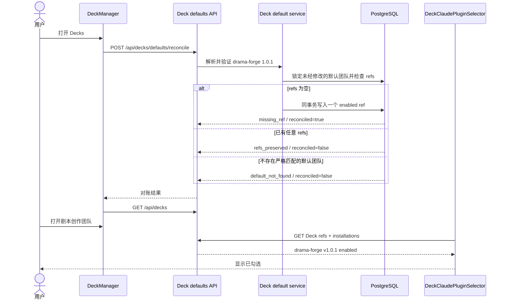

# Chat-first 与剧本创作 Deck 默认交互设计

## 1. 背景与目标

当前 Story Workspace 同时暴露旧 Writing、Timeline、Analysis 入口，认证后的根路径仍进入旧
Writing；新用户会 fork 多个与剧本生产无关的系统 Deck，新建 Deck 也不会自动绑定可执行的
Drama Forge 插件。本次调整只收敛入口和默认值，不删除旧功能实现、不建立第二套路由或插件
状态机。

目标：

1. Story Workspace 侧栏只保留 Chat、Dream、Decks 三个主入口，Writing、Timeline、Analysis
   暂时隐藏。
2. 登录或已登录用户访问应用根路径时进入 `/story-workspace/chat`；合法深链接保持原目标。
3. 默认系统 Deck 聚焦剧本创作角色，新用户不再获得旧内省、学者、哲学模板。
4. 用户从 Deck Manager 新建 Deck 时，后端默认绑定 ready 且校验通过的
   `drama-forge` `1.0.1` 安装；不可用时创建失败，不产生半成品 Deck。
5. 既有账号中未经修改且插件 refs 为空的“剧本创作团队”，首次进入 Decks 时自动补齐同一
   `drama-forge` `1.0.1` 引用；已有任意插件选择时保持用户事实不变。
6. 页面默认 UI 字体使用微软雅黑及跨平台回退，明确的标题衬线字体和等宽代码字体不受影响。

## 2. 当前实现与影响评估

| 范围 | 当前事实 | 最小修改点 | 风险与保留项 |
|---|---|---|---|
| Story Workspace 导航 | `StoryWorkspaceSidebar.tsx` 内联六个主入口；路由在 `storyWorkspacePath.ts` 与 `story-workspace.tsx` 中仍有合法实现 | 只收敛侧栏导航清单 | 保留旧路由和页面，便于深链接及未来恢复；不删除业务代码 |
| 登录默认入口 | `App.tsx` 在非 Story Workspace 路径默认选择 Writing；认证上下文只负责身份，不负责业务路由 | 在认证完成且 pathname 为 `/` 时，以 `replaceState` 进入 `/story-workspace/chat` | 仅根路径使用默认入口；OAuth/设备验证和明确深链接不改写；避免 back 栈污染 |
| 系统 Deck | `backend/database.py` 保存历史系统模板与注册时 auto-fork 逻辑；运行时启动不 seed/migrate | 用集中默认策略定义唯一剧本创作模板；注册只 fork 当前模板；列表排除未修改的退休系统副本 | 不运行启动时清理；用户自建、发布或有本地内容变化的 Deck 必须保留 |
| 新建 Deck 插件 | `POST /api/decks` 只创建 Deck；`DeckClaudePluginSelector` 后续独立加载/保存 refs | 后端创建流程解析配置指定的包名和版本，验证 ready、digest、CLI 兼容后与 Deck/ref 同事务写入 | 插件缺失或校验失败返回冲突错误并 fail closed；浏览器不提交安装 ID |
| 既有默认 Deck 插件 | 已生成的 fallback 默认团队没有 parent，且 `deck_claude_plugin_refs` 为空；选择器忠实显示为未勾选 | Decks 首次加载前显式 `POST /api/decks/defaults/reconcile`；后端用配置模板指纹定位未经修改的默认团队，仅在 refs 完全为空时写入已验证引用 | 不在 GET 或选择器里伪造状态；不覆盖已有 refs、禁用状态或用户修改过的 Deck |
| 字体 | `index.css` 只重置 margin；部分组件显式使用 system-ui、衬线或 monospace | 全局 UI 字体变量应用到 body 和表单控件；Story Workspace UI 继承该变量 | 保留创作正文专用字体、品牌衬线标题和代码等宽字体 |
| 测试 | 已有 Story Workspace 默认入口和 Deck/Dream E2E，但默认入口断言仍指向 Dream | 更新为 Chat-first，并增加隐藏入口、根路径刷新、合法深链接、Deck 默认插件与字体断言 | 业务旅程必须注册/登录、导航、创建、保存、刷新；API 只用于准备隔离事实或验证持久化 |

### 数据边界

- `decks`、`voices`、`deck_claude_plugin_refs` 和 `claude_plugin_installations` 都是已发布的
  PostgreSQL capability；本需求不新增表、字段、索引或运行时 DDL。
- Dream 运行时不会删除现有数据库行。旧系统模板的数据退役若需要物理删除，应由 Admin
  Drizzle 的前向数据迁移单独完成；本次产品路径只停止新 fork，并隐藏未修改的退休副本。
- `has_local_changes` 以及子 Voice 的同名事实用于保护用户修改；用户自建 Deck（无退休系统
  `parent_id`）始终保留。

## 3. 信息架构与交互方案

### 3.1 Story Workspace 导航

主导航顺序固定为：

1. Chat：默认对话与历史入口。
2. Dream：发起或恢复剧本生产。
3. Decks：管理创作团队和角色。

Writing、Timeline、Analysis 不渲染按钮，不参与 Tab 顺序，也不提供折叠态 tooltip。其路由
解析和内容渲染继续存在；用户通过既有合法深链接进入时不被强制重定向，侧栏没有伪造的
选中项。

### 3.2 Chat-first 登录入口

- 未认证用户访问 `/`：显示登录页。
- 登录/注册成功后：认证状态完成，根路径在首次业务绘制前替换为
  `/story-workspace/chat`，Chat 按正常页面流程加载。
- 已登录用户重新访问或刷新 `/`：同样替换到 Chat。
- 访问 `/story-workspace/dream`、`/story-workspace/decks`、Settings、Run、Episode 或其它
  合法深链接：保持原路径。
- 退出登录：清除身份并显示登录页；下一次从根路径登录仍进入 Chat。

### 3.3 剧本创作默认 Deck

唯一活跃系统模板展示为“剧本创作团队”，包含五个互补且不重叠的创作角色：

| 角色 | 职责 |
|---|---|
| 编剧 | 将创作目标发展为可拍摄的剧情、场景与行动 |
| 戏剧结构师 | 检查冲突、节拍、转折、铺垫与回收 |
| 人物塑造师 | 维护人物欲望、阻力、弧光和关系一致性 |
| 对白编辑 | 改善潜台词、人物声线、节奏与可表演性 |
| 连续性审校 | 检查时间、空间、道具、人物状态和前后因果 |

新用户只自动获得该模板的用户副本。旧内省、学者、哲学系统模板不再自动 fork；其未修改
副本不进入 Deck 列表或 Voice 加载。用户自建或修改过的历史 Deck 保留，避免把产品默认值
变化变成用户数据删除。

既有 fallback 副本没有共享 `parent_id`，因此对账只接受集中模板导出的严格指纹：Deck 本身
未修改，中英文名称匹配，Voice 数量和角色名称集合完整且 Voice 均未修改。找到后还必须确认
refs 完全为空才写入；只要已经存在任意 ref，就返回 `refs_preserved`，不把“产品默认值”变成
每次进入页面都覆盖用户选择的策略。

### 3.4 新建 Deck 与默认 Claude 插件

1. 用户点击“创建 Deck”。
2. 浏览器只提交 Deck 展示字段，不提交插件安装 ID、路径或 digest。
3. 后端读取集中配置的默认包名与版本，解析一个匹配的安装记录。
4. 后端验证安装状态为 ready、Artifact digest 可复验、当前 Claude CLI 兼容。
5. Deck 与 `deck_claude_plugin_refs` 在同一事务写入。
6. Deck Manager 重新加载并打开新 Deck；插件选择器从 refs 显示
   `drama-forge v1.0.1` 已选中。

如果步骤 3 或 4 失败，返回可识别的冲突错误，页面保持原列表并显示创建失败；不得创建空
Deck、静默选择其它版本或退回无插件模式。创建完成后，用户仍可在编辑器中选择其它合法
ready 插件并显式保存。

### 3.5 字体

默认 UI 字体栈：

```css
"Microsoft YaHei", "微软雅黑", system-ui, -apple-system,
BlinkMacSystemFont, "Segoe UI", sans-serif
```

`body`、button、input、select、textarea 默认继承该栈。代码、终端、prompt 编辑器保留
monospace；现有品牌或内容标题显式使用 Georgia 的场景保留，避免把“默认字体”扩大成全面
视觉重做。

## 4. 状态与边界

| 状态 | 页面行为 |
|---|---|
| Chat 加载 | 保持现有 Chat skeleton/runtime，不新增入口级 loading 状态 |
| Deck 加载 | 保持 Deck Manager 当前 loading；创建按钮 disabled 防重复提交 |
| 默认插件缺失 | 创建请求失败并显示错误；列表不新增 Deck |
| 默认插件不 ready、digest 错误或不兼容 | 与缺失相同地 fail closed，不自动降级 |
| 滚动部署中新前端先于新后端 | 对账请求记录 warning，继续只读已有 Deck 列表；不在客户端伪造 ref，后端就绪后的下一次页面挂载重试 |
| Deck 列表为空 | 显示现有空列表和创建入口；不伪造客户端 Deck |
| 历史 Deck 有用户修改 | 继续显示并可编辑；不因默认模板退役而删除 |
| 直接访问隐藏路由 | 路由继续工作，侧栏不出现隐藏按钮 |
| 浏览器前进/后退 | 根路径默认跳转使用 replace；用户主动导航继续使用既有 pushState |

## 5. 业务时序

### 5.1 登录后默认进入 Chat



### 5.2 Story Workspace 导航



### 5.3 新建 Deck 并默认绑定 Drama Forge



### 5.4 默认插件不可用



### 5.5 既有默认团队补齐缺失引用



## 6. 设计审查

| 审查项 | 结论 |
|---|---|
| 是否覆盖全部目标 | 是；导航、默认入口、Deck 模板、默认插件、字体均有唯一修改边界 |
| 是否保护用户数据 | 是；不运行时删除，退休模板只影响未修改的系统副本；用户 Deck 保留 |
| 是否保持深链接 | 是；只把已认证根路径替换为 Chat |
| 是否遵守数据库协议 | 是；不新增 schema/DDL，不把安装路径或 ID写死在浏览器 |
| 是否引入第二套路由或插件状态机 | 否；复用 App、Story Workspace router、PluginInstallService 和 Deck refs |
| 是否保护显式插件选择 | 是；对账只处理 refs 为空的严格默认模板，已有任意选择立即保留 |
| 是否过度设计 | 否；只增加一个幂等业务动作与一个共享默认策略服务，不新增 feature flag、迁移框架、字体主题系统或客户端伪状态 |

## 7. 验收标准

- 登录、注册及已认证根路径刷新后 URL 为 `/story-workspace/chat`，Chat 主界面可用。
- 合法 `/story-workspace/dream` 深链接登录后仍停留 Dream。
- Story Workspace 桌面/折叠导航都不存在 Writing、Timeline、Analysis 按钮，Chat、Dream、Decks
  可键盘访问。
- 新用户默认 Deck 只包含剧本创作团队；退休系统副本不出现在列表，用户自建/修改 Deck 保留。
- 既有默认账号打开 Decks 后，严格匹配且 refs 为空的剧本创作团队只补一个 enabled
  `drama-forge v1.0.1`；再次对账幂等，已有任意 refs 不改变。
- 新建 Deck 后 API refs 和插件选择器均显示 `drama-forge v1.0.1` enabled；刷新后不丢失。
- 默认插件缺失、非 ready、digest 失败或不兼容时创建失败，数据库不存在半成品 Deck。
- `body` 和标准表单控件计算字体包含 Microsoft YaHei/微软雅黑；monospace 编辑器不被覆盖。
- 聚焦单元/集成测试、TypeScript、ESLint、构建及 Playwright 完整业务旅程全部通过。
