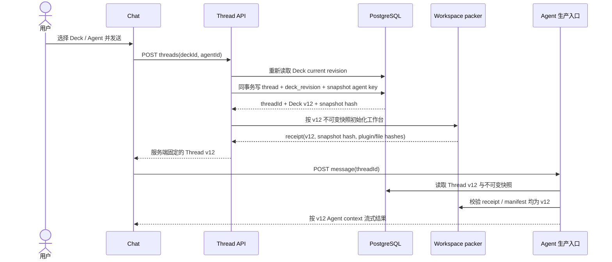
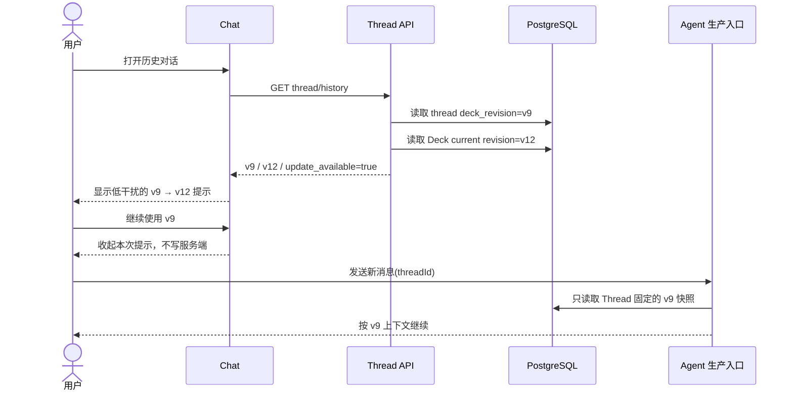
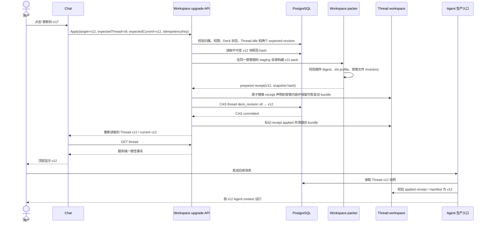

# Deck 版本与 Chat 工作台升级设计

## 1. 背景、问题与现状结论

Deck 是 Chat/Dream 的聚合运行配置，不只是展示卡片。它同时决定 Deck 文案、Agent 列表与
Prompt、Memory 配置、Claude 插件引用以及 Chat/Dream Agent 类型。当前实现只能固定
`chat_thread.deck_id` 和 `voice_id`，不能证明线程实际使用过哪一版聚合配置。

更严重的是，当前两个运行边界的冻结语义不同：

- `DeckChatContextService.resolve()` 在每次普通 Chat send、以及每次 Dream turn 时，都会重新读取
  当前 `decks`、已启用 `voices` 和 `deck_claude_plugin_refs` 来组装 Prompt。
- `pack_workspace_plugins()` 在工作台已有 launch manifest 后会保持 frozen，只校验或修复已打包
  插件，不会随 Deck refs 静默换版。

因此，Deck 更新后历史线程可能同时运行“当前 Prompt + 首次打包的旧插件”，UI、Thread、工作台
receipt 和 Agent context 无法证明一致。根因不是前端缺少一个 `vN` 标签，而是缺少服务端聚合
revision、不可变快照和线程固定 revision。

本设计不使用 `updated_at`、前端计数器、插件版本、`agent_contract_version` 或
`agent_type_revision` 冒充 Deck 版本。

## 2. 调查结果

### 2.1 当前写入入口

| 写入面 | 生产入口 | 当前持久化行为 | 是否影响 Deck 运行版本 |
|---|---|---|---|
| Deck 创建/默认初始化/默认修复 | `POST /api/decks`、注册 provisioning、`POST /api/decks/defaults/reconcile` | 插入 Deck、默认插件 ref，部分路径同时插入 Voices | 新 Deck 生成初始 revision；既有 Deck 的 ref 修复仅在有效变化时升版 |
| Deck 元数据、启停、排序 | `PUT /api/decks/{deck_id}` | 直接更新允许字段，无 expected revision | 名称、说明、运行启停升版；纯列表 `order_index` 不升版 |
| Deck fork / parent sync | `POST /fork`、`POST /sync` | 复制或覆盖 Deck/Voices/refs | 新 fork 生成初始 revision；sync 有有效运行差异时升版 |
| Deck 发布/取消发布/安装计数 | `POST /publish`、fork 后计数 | 更新 `published`、`author_name`、`install_count` | 不升运行版本 |
| Agent 新增、编辑、启停、删除、fork | `/api/voices*` | 直接写 `voices`，无 Deck CAS | 新增/删除/启停/排序/名称/Prompt/Memory 有效变化均升版 |
| Claude 插件 refs | `PUT /api/decks/{deck_id}/claude-plugins` | 校验后整组 delete + insert | refs 的增删、启停、顺序或固定 provenance 变化升版；等价写入不升版 |
| 插件卸载 | `POST /api/claude-plugins/installations/{id}/uninstall` | 安装置为 uninstalled，并批量禁用关联 refs | 每个受影响 Deck 需要各自原子升版并生成快照 |
| Chat/Dream Agent 类型 | `PUT /api/deck-plugin-bindings/{deck_id}/agent-type` | 创建/clear binding，使用 `expected_binding_revision` | 有效类型或 binding provenance 变化升 Deck revision |
| Memory 初始化/修复 | voice 写入与显式 Memory 配置保存路径 | 更新 `voices.memory_workspace_config` | 有效 Memory 配置变化升版；无变化回写不升版 |
| Deck 删除 | `DELETE /api/decks/{deck_id}` | 当前会硬删 Deck、级联 Voice，并将 Thread 外键置空 | capability 发布后不得破坏已引用快照；见 8.4 |

Deck 编辑 UI 当前通过 `DeckManager`、`DeckEditorModal`、`DeckClaudePluginSelector` 分别调用上述
接口。刷新列表只是读取，不产生版本。

### 2.2 直接影响实际 Agent 内容的字段

- Deck：名称、多语言名称、说明、多语言说明、运行启停及未来明确标记为 runtime 的配置。
- Agent/Voice：成员集合、启停、Deck 内执行顺序、名称、`system_prompt`、
  `memory_workspace_config`。
- Claude refs：安装 ID、package provenance、resolved version、artifact digest、启停、顺序。
- Agent 类型：Chat/Dream 类型、产生该类型的有效 binding/release provenance。
- workspace init profile 和 launch manifest 使用的固定插件制品及其受管文件 inventory。

图标、颜色只影响展示，不进入运行快照；发布状态、作者展示、收藏/安装计数和 Deck 列表排序也不
升运行版本。Deck 名称与说明虽然主要用于识别，但当前会被写入 `<deck_context>`，因此属于运行内容。

### 2.3 `agent_type_revision` 的真实语义

`agent_type_revision` 来自 `deck_plugin_bindings` 的最大 `binding_revision`，是 Chat/Dream binding
写入的乐观锁和 provenance 序号。它只覆盖 binding 变化，不覆盖 Deck 文案、Voice Prompt、Memory
或 Claude refs，不能作为 Deck 聚合版本。

### 2.4 Thread 绑定与历史 send 行为

- `POST /api/claude-agent/threads` 只写 `deck_id`、`voice_id`；未写任何 Deck revision。
- 首次 send 也可通过一次性 CAS 补绑空的 `deck_id` / `voice_id`，之后二者不可由客户端切换。
- 普通 Chat 每次 send 都按 Thread 的 ID 重新读取当前 Deck/Voice/refs 组装 Prompt。
- Dream 每 turn 也会按可信 Run/Thread binding 重新读取当前 Deck Prompt。
- 工作台插件首次 pack 后冻结，所以当前实现并不是完整快照，也不是完整跟随最新版，而是可能混合。

### 2.5 可复用 receipt 与不可复用部分

现有 workspace packer、`.ink/launch-manifest.json`、`.ink/plugin-pack-receipt.json`、插件 artifact
digest 校验、init profile 和 CLI launch manifest 校验可以复用。它们已能证明某次工作台装入了哪些
插件字节，并能在 frozen 工作台中修复派生缓存。

但现有 receipt 只有 `deck_id`、插件 version/digest、受管 surface 与时间，没有 Deck revision、
聚合 snapshot hash、选中 Agent 身份或完整受管内容 hash；现有 `deck_runtime_snapshots` 则只覆盖
Dream Plugin binding/profile 的 runtime config。二者都不能单独证明完整 Deck 版本。

### 2.6 当前 Schema capability 结论

Admin Drizzle 当前 catalog、migration head 和本机真实 PostgreSQL 均显示：

| 能力 | 当前状态 |
|---|---|
| `decks.revision` | 缺失 |
| Admin-owned 不可变 Deck 聚合快照 | 缺失 |
| `chat_thread.deck_revision` | 缺失 |
| Thread 的快照 Agent 身份 | 缺失；现有 `voice_id` 会在 Voice 删除时被置空 |
| 工作台已应用 Deck revision/hash receipt | 缺失 |
| 可复用的插件 pack/launch receipt | 已有，但只覆盖插件制品与受管 surface |
| `agent_type_revision` | 已有，但只覆盖 binding 乐观锁 |

因此需要新的 Admin Drizzle capability。Dream 仓库不得新增 migration、runtime DDL、自动建表、
SQLite fallback，也不得借用无关字段保存 revision。

### 2.7 CozeLoop 评估器参考审计

本方案参考了 `/Users/dmeck/project/cozeloop` 的评估器列表、详情、版本侧栏、提交弹层、IDL、领域服务、
Repo 事务和 MySQL 表合同，而不是只按截图复刻布局。

可复用的产品结构：

- 列表用“修改未提交”区分当前草稿和最近一次已提交版本；详情把当前草稿与历史只读版本明确分开。
- 草稿编辑与“提交新版本”是两个动作；版本记录使用侧栏浏览，不把历史版本混进可编辑表单。
- 提交前要求版本说明，重复提交使用幂等键拦截；草稿状态、最新版本和版本内容由服务端返回。

不能复制到 Deck 的部分：

- CozeLoop 版本是用户输入的 SemVer；Deck 需要服务端单调整数 revision，不能让用户决定 `vN`。
- CozeLoop 的 `evaluator_version(evaluator_id, version)` 只有普通索引，服务层先查再写，没有 Deck 所需的
  数据库唯一约束和 expected revision CAS；其 10 秒幂等键也不能替代持久化并发协议。
- CozeLoop 草稿通过 800ms debounce 自动保存；Deck 的有效运行变化横跨 Deck、Agent、Memory、插件 ref
  和 binding，不能在 Admin 聚合事务 capability 缺失时照搬逐字段自动保存并宣称已经产生版本。
- 固定宽度版本侧栏可作为桌面端信息结构参考，但窄屏必须使用现有响应式容器，不能制造横向滚动。

因此当前落地只采用“使用者 / 创作者”任务分离、明确未提交状态和未来版本记录入口的信息架构；版本
事实、提交按钮和 `vN` 必须等待 Admin capability 后再开放。

### 2.8 测试前完整影响范围

本矩阵是本轮重新测试的冻结范围。自动化必须覆盖一条连续的可见业务旅程，不能只断言某个按钮：

| 业务链路 | 预期影响 | 本轮验证方式 | 不能宣称的证据 |
|---|---|---|---|
| 登录 → Chat → Decks | 默认仍进入 Chat，并可正常导航到 Decks | 浏览器公开路由与可见控件 | 不代表真实账号或真实 PostgreSQL |
| 使用者模式 | 只显示启用 Deck/Agent，可切换 Agent 并把选择交给新 Chat | 宽屏、窄屏、键盘焦点、URL 和新对话选择器 | 不代表 Thread 已固定 revision |
| 历史 Chat | 顶部持续显示 Agent 与 Deck；输入框不出现锁定选择器 | 历史 Thread 水合后的可见 UI 和源码合同 | capability 缺失时不显示版本 |
| 创作者模式 | 查看、编辑元数据、切换 Agent 类型、增改/启停 Agent、选择插件、启停 Deck、发布/取消发布 | 连续浏览器旅程，逐个核对公开 API 请求与刷新结果 | provider-free fixture 不证明数据库事务 |
| 默认 Deck 对账与新建 Deck | 继续复用既有默认插件解析和写入入口 | 浏览器可见结果 + 后端隔离合同测试 | 不把 mock 或 isolated DB 称为真实业务验收 |
| Deck revision / snapshot | 不新增、不显示、不伪造 | capability inventory 和负向 UI 断言 | 不执行不存在的升级成功路径 |
| Thread / workspace / Agent send | 现有运行路径不因 UI 重构被复制或改写 | 相关后端回归与 Chat/Dream source/browser suite | 无法证明旧快照一致性；这是 Schema 阻塞项 |
| Project / Episode / canonical / `.dream` /真实模型/账本 | 不应被本轮 provider-free 旅程读写 | 严格 unexpected-request 审计 | 不描述为完整真实模型验收 |

测试分层：浏览器层走生产前端路由、组件和 API DTO，但用确定性 provider-free 路由 fixture；后端层走公开
Python 业务函数/路由的隔离合同测试。只有未来按本机真实业务协议使用指定账号、现有实体、正常 Dream、
Admin、Gateway 和真实 PostgreSQL 完成的链路，才能标记为真实业务验收。

## 3. 用户目标

1. 在 Chat 顶部明确看到当前对话使用的 Agent、Deck 和服务端固定的 `vN`。
2. 新对话在创建时固定当时的聚合 revision，之后不静默跟随最新版。
3. 历史对话落后时显示低干扰提示，用户可继续旧版或显式更新。
4. 更新后 Thread、工作台受管内容、插件 receipt 和实际 Agent context 使用同一快照。
5. 历史输入框不显示不可操作的锁定选择器；新对话仍可选择 Deck → Agent。

## 4. 最小版本模型

### 4.1 聚合 revision

`decks.revision` 是正整数、从 1 开始、服务端事务内单调递增。写请求携带
`expected_revision`；只有规范化运行快照 hash 发生变化时，事务才执行 `revision + 1` 并插入新快照。
等价重试返回同一 revision，不因刷新、列表读取或时间流逝变化。

### 4.2 不可变聚合快照

建议 Admin-owned `deck_revisions`（最终命名由 Admin schema owner 决定）至少包含：

- `deck_id`、`revision`，且 `(deck_id, revision)` 唯一；
- 规范化 `snapshot_json`、`snapshot_hash`、`created_by`、`created_at`；
- Deck 运行字段；
- 按有效顺序排列的 Agent/Voice 配置及 Memory 配置；
- Claude refs 的安装、package、version、artifact digest、启停与顺序 provenance；
- Agent 类型及 binding/release provenance；
- snapshot contract version。

快照只追加，不更新、不删除。hash 使用稳定 key/数组顺序和统一空值规则；不包含 `updated_at`、计数、
展示颜色或纯列表排序。

### 4.3 Thread 固定 revision 与 Agent 身份

`chat_thread.deck_revision` 可空，以兼容无法证明过去版本的旧线程。新线程在一个数据库事务中重新
读取 Deck 当前 revision，并写入 `(deck_id, deck_revision)`。

现有 `chat_thread.voice_id → voices ON DELETE SET NULL` 不能保留已从当前 Deck 删除的旧 Agent
身份。capability 必须额外提供一个不依赖 mutable `voices` 行的快照 Agent key，或等价的 revision
Agent 引用，使 Thread 能在旧快照中继续找到原 Agent。不能把当前 Deck 的同名 Agent猜作旧 Agent。

### 4.4 工作台已应用 revision

扩展既有 pack receipt，而不是建立第二套 packer。receipt 至少增加：

- `deck_revision`、`deck_snapshot_hash`、`deck_agent_key`；
- plugin set hash 和每个 artifact digest；
- 受管文件 inventory/hash；
- apply operation/idempotency key 与 `prepared | applied` 状态。

Agent 生产入口在每次启动前核对 Thread revision、snapshot hash、receipt revision/hash 和 launch
manifest。任何缺失或不一致均 fail closed，不能混合运行。

## 5. 产生版本的变更范围

| 变化 | 是否升版 | 判断依据 |
|---|---:|---|
| Deck 名称、说明、运行启停/配置 | 是 | 进入实际 `<deck_context>` 或运行策略 |
| Agent 增删、启停、运行顺序 | 是 | 改变可用指令集合或选择结果 |
| Agent 名称、Prompt、Memory | 是 | 直接改变上下文或 Memory 工作台 |
| Claude refs 增删、启停、顺序、provenance | 是 | 改变可加载插件和命令优先级 |
| Chat/Dream 类型或有效 binding provenance | 是 | 改变生产入口及工作台语义 |
| 图标、颜色 | 否 | 只影响展示 |
| 发布/取消发布、作者展示 | 否 | 不改变已拥有 Deck 的运行内容 |
| 收藏/安装计数 | 否 | 统计事实 |
| Deck 列表 `order_index` | 否 | 只影响 Deck 列表展示 |
| 等价写入/幂等重试 | 否 | 规范化 snapshot hash 未变化 |

## 6. 信息架构与交互设计

### 6.0 Deck 页面：使用者任务与创作者任务

`DeckManager` 不再把选用、编辑、启停、发布和删除堆叠在同一张卡片上。页面提供两个任务模式；它们
不是权限角色开关，所有写权限仍由服务端逐请求校验：

- **使用 Deck**（默认）：只列出已启用 Deck，展示其 Chat/Dream Agent 类型，用户选择一个已启用
  Agent 后进入新 Chat。该模式不显示编辑、启停、同步、发布或删除动作。
- **创作 Deck**：创建 Deck，并管理当前 actor 可见 Deck 的编辑、启停、父模板同步、发布和删除。
  系统模板只提供查看与创建副本，不在客户端假装拥有编辑权限。

切换模式只改变页面任务视图，不修改 Deck、Thread 或版本事实，也不写 localStorage。窄屏下两个模式
按钮等宽排列，所有主要动作保持至少 44px 触控高度。Admin capability 发布前，两个模式都不展示
`vN`；版本信息只能来自未来服务端 revision 字段。

### 6.1 新对话

输入框保留可操作的 Deck → Agent 选择器。点击发送时先由服务端创建并固定 Thread；成功后顶部
上下文显示服务端回执，例如：

```text
编剧 · 剧本创作团队  v12
```

浏览器不能在创建成功前预显示 `v12`，也不能在字段缺失时伪造 `v1`。

### 6.2 历史对话，无更新

- 输入框工具栏不渲染 `DeckChatSelector locked`。
- 顶部是历史对话唯一可见的 Deck/Agent/版本来源。
- 只显示固定版本，不显示升级提示。

### 6.3 历史对话，有更新

顶部上下文下方显示无模态、低干扰提示：

```text
编剧 · 剧本创作团队  v9

此对话使用 Deck v9，当前为 v12。
更新后，新消息将使用新版工作台。

[继续使用 v9]  [更新到 v12]
```

- “继续使用 v9”只收起当前页面提示，不修改服务端 revision；新消息仍按 v9 快照运行。
- 再次进入或刷新时，可再次显示版本差异，避免把浏览器偏好冒充业务事实。
- “更新到 v12”携带用户看到的 thread revision 与 current revision，服务端 CAS 成功后才更新 UI。
- 未选择时发送新消息也继续 v9，不用模态框打断阅读。

### 6.4 更新状态

| 状态 | 呈现与行为 |
|---|---|
| 更新中 | 两个动作禁用，按钮文本“正在更新到 v12…”，保留历史阅读与焦点位置 |
| 成功 | 重新 GET 服务端 Thread；顶部变为 `v12`，提示消失，并用 `aria-live=polite` 宣告 |
| 失败 | 保持 `v9`，显示简短可重试原因；不清空输入、不关闭历史 |
| 并发冲突 | 显示“Deck 已更新，请重新确认 v9 → v13”，不自动改到 v13 |
| 运行中/待工具确认 | 禁用更新并说明需先结束当前运行或完成确认 |
| capability 不可用 | 不显示版本和升级动作；若直接调用升级 API，返回明确 capability 错误 |

### 6.5 视觉、响应式与无障碍

- 沿用现有 Ink & Memory theme token、字体和顶部上下文，不新增全局设计系统。
- 以留白和轻微背景差形成层级，不增加不必要边框、渐变或循环动画。
- 文本明确写出 `v旧 → v新`，不能只靠颜色。
- 两个动作使用原生 button；更新后焦点回到顶部上下文或发送框，错误文本与控件通过
  `aria-describedby` 关联。
- 窄屏时提示正文与动作纵向排列，按钮保持至少 44px 触控高度，不造成横向滚动。

## 7. 业务时序

### 7.1 新对话固定 Deck 版本



### 7.2 历史对话检测新版



### 7.3 更新历史对话工作台



## 8. 失败、并发与边界行为

### 8.1 重复点击与并发 Deck 更新

- 前端更新中禁用重复点击；服务端以 thread + idempotency key 去重，并以 Thread revision CAS 兜底。
- 第一个请求已成功且 receipt 匹配目标时，等价重试返回当前服务端事实。
- 用户看到 v12 后 Deck 又变为 v13，`expectedCurrent=v12` 冲突；服务端不把“最新版”解释为任意
  后来版本，返回 409 并要求用户重新确认 v9 → v13。

### 8.2 页面中断和跨介质恢复

文件系统与 PostgreSQL 不能假装成一个原子事务。升级使用 prepared/applied receipt 和可恢复旧 bundle：

- staging 或校验失败：不替换 live，不更新 Thread。
- live 替换成功但 DB CAS 失败：恢复旧受管 bundle；Thread 保持旧 revision。
- 进程在替换后中断：下一次 GET/send 先读取 Thread + receipt；DB 仍是旧版则恢复旧 bundle，DB 已是
  新版则完成 applied 标记。恢复前 Agent send fail closed。
- 任何无法自动证明的状态返回“工作台版本不一致”，不得启动 Agent。

### 8.3 Thread 正在运行或等待确认

运行中、Stop 未收敛、待工具确认或已有 workspace mutation 时拒绝升级。用户先完成/取消当前动作，
服务端重新确认 idle 后再更新，避免运行中的 CLI 持有旧文件句柄。

### 8.4 Deck 删除、禁用或权限丢失

- 已被 revision/Thread 引用的 Deck 不允许物理级联删除快照；产品删除应先变成 Admin-owned 的逻辑
  删除/归档，或由 FK `RESTRICT` 明确拒绝。不能让现有 `ON DELETE SET NULL` 抹掉历史 provenance。
- 删除或权限丢失：用不可变快照显示历史 Agent/Deck 名称，隐藏升级动作；历史可读，后续 send 按
  明确产品策略 fail closed。
- Deck 禁用：历史可读；升级拒绝，send 延续现有禁用策略并返回明确错误。

### 8.5 旧线程 revision 为空

旧线程无法证明过去版本时保持 `deck_revision=null`，顶部显示“版本未记录”。它不得读取当前 revision
后伪装为旧历史。只有用户点击“将工作台更新到当前 vN”且服务端完成完整 apply 后，才绑定当前快照。

## 9. API 投影与滚动发布

capability 可用后，Thread 列表、搜索结果与详情统一返回：

```json
{
  "deck_id": "deck-id",
  "deck_revision": 9,
  "current_deck_revision": 12,
  "deck_update_available": true
}
```

创建 Thread 返回固定 revision 和 snapshot hash；升级请求携带
`expected_deck_revision`、`expected_current_deck_revision`、`target_deck_revision` 与 idempotency key。

发布顺序：

1. Admin Drizzle expand：新增 revision、不可变快照、Thread nullable revision/Agent key、约束和
   capability；对既有 Deck 生成明确初始快照，但旧 Thread 仍为 null。
2. Dream 双版本读：旧字段缺失时不渲染 `vN` 或升级动作；升级 API 在 capability 缺失时返回
   `503 DECK_REVISION_CAPABILITY_MISSING`。
3. Dream 写路径切换：所有运行内容写入统一走 snapshot/CAS；新 Thread 固定 revision；send 只读快照。
4. 验证/backfill：核对 snapshot hash、约束、旧 Thread null 数量及 receipt 一致性。
5. contract：删除旧的“send 时读取当前 Deck”路径；最后再收紧非空或删除兼容代码。

## 10. 当前 capability 阻塞与 fail-closed 边界

当前 Admin Drizzle 尚未发布上述 capability，也没有可供 Dream 依赖的 capability key/version。故本轮：

- 已完成不依赖 Schema 的交互收敛：历史对话移除不可操作的 locked 选择器，新对话保留选择器；
- 已完成设计、现状审计和最小数据合同；
- 不显示任何 `v1`/`vN`，不显示无后端依据的升级成功，不新增前端权威状态；
- 不实现 Thread revision、快照 send、workspace upgrade API 或版本提示，因为其中任一部分单独上线都会
  延续或放大混合上下文风险；
- 现阶段没有升级 API，因此不存在表面成功；未来端点必须先检查 capability 并明确 fail closed。

## 11. 编码前设计复核

| 复核问题 | 判断 |
|---|---|
| 用户是否知道当前对话的 Deck/Agent | 是；历史 Chat 的顶部始终保留 Agent 与 Deck 名，插件 receipt 只进入详情，不再替换 Deck 名 |
| 是否避免历史对话静默换配置 | 当前 Schema 无法保证，故不实现/不展示版本成功；未来 send 必须只读 Thread revision 快照 |
| UI、Thread、workspace、Agent context 是否一致 | capability 发布前不能证明，因此升级动作保持关闭 |
| 历史输入框是否隐藏不可操作选择器 | 是；仅新对话渲染可操作 Deck → Agent 选择器 |
| 是否误用 binding revision/时间戳/插件版本 | 否；三者均明确排除 |
| 是否遵守 Admin Drizzle 所有权 | 是；Dream 不新增 migration 或临时字段 |
| 是否引入分支、回滚、diff 编辑器或通用版本平台 | 否 |
| 是否保留最小抽象 | 是；本轮只拆出 use/create 展示面、修复路由同步和顶部上下文，不建立无后端事实的草稿状态机 |

参考 CozeLoop 后缩小过一次方案：不复制 SemVer 输入、自动保存草稿、固定版本侧栏和提交弹窗；这些都依赖
尚未发布的 Deck aggregate capability。复核还删除了编辑器里把 `description` 重复标成“Deck Prompt”的
错误控件，避免用户以为存在第二个运行字段。

## 12. 明确不做什么

- 不建立通用版本平台、分支/合并、版本比较器、差异编辑器或任意回滚市场。
- 不把 `updated_at`、plugin version、binding revision 或前端 localStorage 当 Deck version。
- 不复制 SSE parser、Thread 状态机、reducer、workspace packer、plugin resolver 或 launch verifier。
- 不在 Dream 仓库新增 migration、runtime DDL、自动建表或 SQLite runtime fallback。
- 不用部署环境名称解锁版本功能；唯一门槛是 Admin-published schema capability。
- 不引入新的全局设计系统或无关功能开关。

## 13. 可验证验收标准

| 验收项 | capability 发布前结果 | capability 发布后目标 |
|---|---|---|
| 历史输入框隐藏锁定选择器 | 可完成并验证 | 保持 |
| 新对话保留 Deck → Agent 选择 | 可完成并验证 | 保持 |
| Deck 使用/创作任务分离 | 可完成并验证 | 使用模式只读，创作模式承载写操作 |
| 使用模式选择 Agent 并进入 Chat | 可完成并验证 | 服务端创建 Thread 时固定 revision |
| 顶部显示服务端固定 `vN` | 阻塞；不得伪造 | 创建/详情/刷新均一致 |
| Deck 有效运行变化单调升版 | 阻塞 | 每个写面具备 hash + CAS 测试 |
| 新 Thread 固定 revision | 阻塞 | 创建事务与 FK/约束测试通过 |
| 历史 send 继续旧快照 | 阻塞 | Prompt、Memory、插件均来自同一快照 |
| `v旧 → v新` 提示与继续旧版 | 阻塞 | 桌面/窄屏组件与 E2E 通过 |
| 接受升级后一致 | 阻塞 | Thread、receipt、manifest、Agent context hash 一致 |
| 更新失败保留旧版 | 阻塞 | CAS、故障注入和恢复测试通过 |
| 刷新恢复 | 阻塞 | 只依赖服务端/receipt 事实 |
| 旧 Thread、删除、禁用、无权限 | 设计完成 | 全部明确 fail closed |
