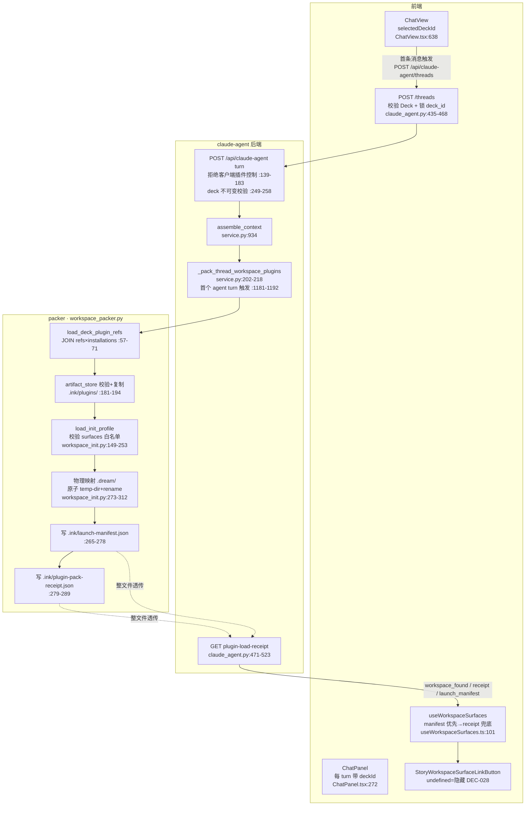
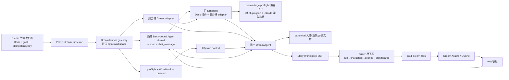
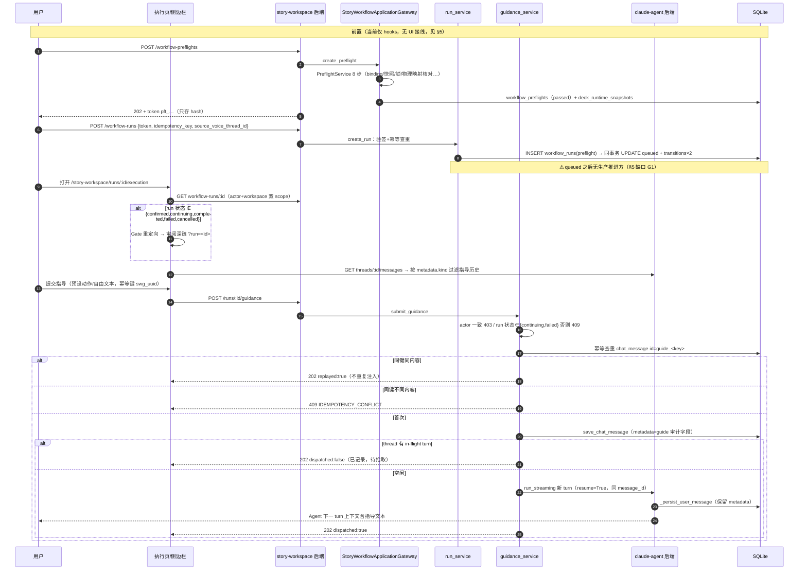
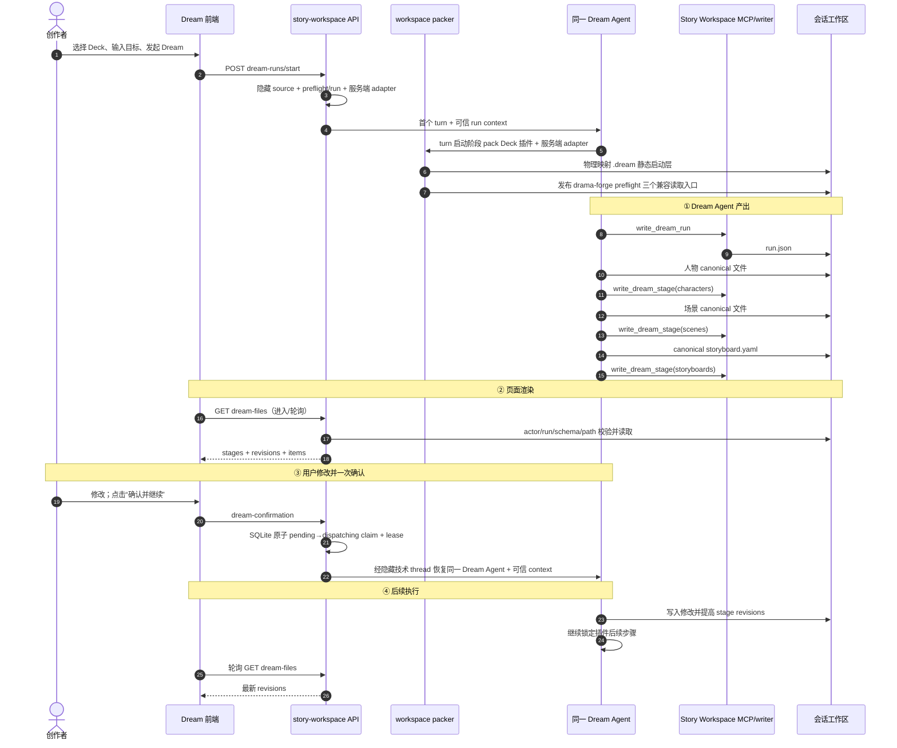

# design_005：Dream 业务模块数据流图与业务时序图（基线 + 任务三修订）

> 本文保留 2026-08-04 任务三前代码基线（commits `99075d0`/`bd450ff`/`57eab52`/`d0e8af9`/`f7b3ca0`/`8510ddc`/`dec5a92`）的数据流图、时序图与证据，并在 §2.3、§3.3、§5 追加任务三生产链修订。
> 所有数据流事实均带 `文件:行号` 证据；术语以 `docs/architecture/术语表.md` 为准（「物理映射」= pack 时刻把 `.dream/` 协议目录写入会话工作区，代码标识 `materialize_dream_surface()`）。
> §5 如实标注了代码现状中的「端点空洞」——阅读图表时请对照，勿把设计语义误认为已接线行为。
> **2026-08-04 任务三修订注记**：业务主体统一为 Dream Agent。Dream 专用发起页、服务端 Dream adapter、可信 run context、run → characters → scenes → storyboards writer 链和单次确认 continuation 已接通（`bb1b0eb`/`2da2b41`/`d09f43c`/`530f1ac`/`62e21d7`/`4c85b96`；发起 terminal metadata 修复 `e292467`；drama-forge preflight 兼容发布与最终安全加固 `9831e41`/`c7fcbcd`/`7087036`；Dream Agent 可见文案 `b091695`；单次确认 SQLite 原子 claim `a0cb5d6`、续租保护 `bea9dbe`、数据库权威行守卫 `5497a25` 与事务内 lease 时间戳 `2200d28`；测试与评审证据见专项实施记录）。技术上复用隐藏 Deck-bound Agent thread / `chat_message` 作为连续性载体，但 Dream 前端不挂载 `ChatView`，该载体不是 Chat 页面或 Chat 业务合同。G3/G5 已关闭；G1 仅余旧 `WorkflowRun.status` 仍停 `queued` 的技术遗留，不能再解释为缺少生产 Dream Agent；G6 与 writer 主动 SSE 仍为遗留。

---

## 1. 模块边界与参与者

| 参与者 | 代码实体 |
|--------|----------|
| Dream 页（前端） | `frontend/src/router/story-workspace.tsx` + `pages/story-workspace/`；无 run 时渲染 `StoryWorkspaceDreamLaunch`，不挂载 `ChatView`（`StoryWorkspaceDreamPage.tsx:274`） |
| Chat 视图 | `components/chat/ChatView.tsx` / `ChatPanel.tsx` |
| claude-agent 后端 | `backend/routers/claude_agent.py` + `backend/claude_agent/service.py`（非独立服务，端口 8765） |
| packer | `backend/services/claude_plugin/workspace_packer.py` / `workspace_init.py` / `artifact_store.py` |
| story-workspace 后端 | `backend/routers/story_workspace.py`（`/api/story-workspace`）+ `services/story_workspace/` + `services/deck/story_workflow_gateway.py` |
| workflow 执行域 | `backend/services/workflow/preflight_service.py` / `run_service.py` |
| 存储 | SQLite 表（`backend/database.py`）+ 会话工作区文件树（`.ink/`、`.dream/`） |
| Dream Agent | Dream 四阶段唯一业务执行主体；服务端注入可信 run context 与 Dream adapter；隐藏 Agent thread 仅是技术连续性载体 |

---

## 2. 数据流图

### 2.1 会话与 pack 域（thread → pack → surfaces 透出）

> 本节图保留任务三前由 ChatView 首 turn 触发 pack 的兼容基线；当前 Dream 专用
> 发起不挂载 ChatView，改由 §2.3 的 Dream Agent 首 turn 触发同一 packer。



**数据形态要点**：

- `POST /threads` 只锁 `deck_id`（`database.create_chat_thread`，`database.py:4061`）；**真正的锁在首个 turn**：`bind_chat_thread_deck` 原子绑定（`database.py:4095`，冲突 409），`DeckChatContextService.resolve` 校验插件 ready（`chat_context.py:61-128`）。
- pack 失败 = turn 失败（raise 于 `service.py:1181-1192`）；冻结分支（已有 manifest）只重校验不重建，`.dream/workspace.json` 缺失报 `CLAUDE_PLUGIN_INIT_PROFILE_INVALID`（`workspace_packer.py:143-155`）。
- `.dream/workspace.json` = `{schema_version:"dream-surface/v1", deck_id, plugins[], entry_route}`，不含 `workflow_run_id` 与时间戳。
- pack receipt **不回传前端**；surfaces 对前端唯一透出通道 = `GET plugin-load-receipt`（pre-pack 时 `workspace_found:false` → 前端按无 surface 隐藏入口）。

### 2.2 run / 审阅 / 执行域

> 本节保留任务三前的旧 story review / workflow run 基线；该链仍在代码中，但不再是
> Dream 主业务链。当前 Dream 生产链见 §2.3。

```mermaid
flowchart TD
    subgraph AGENT[Agent 产出]
        SSE[story-workspace-output SSE 帧<br/>service.py:1322-1324<br/>turn 成功+落库后发出]
        PARSE[parse_agent_story_output<br/>agent_integration.py:29-58]
        UPSERT[store_agent_story_output<br/>story/characters/scenes<br/>幂等 upsert+reconcile<br/>agent_integration.py:97-364]
    end

    subgraph FEE[前端 story-workspace]
        EVT[浏览器事件 ink:story-workspace-output<br/>story-workspace-events.ts:17-24]
        PANEL[审阅面板 StoryWorkspaceReviewDetail<br/>GET /api/story-workspace/stories/:id]
        CONF[confirm / reject / batch<br/>storyWorkspaceReviewApi.ts:104-140]
        EXEC[执行页 StoryWorkspaceExecutionPage<br/>GET workflow-runs/:id<br/>+ 指导历史反查]
        SIDE[指导侧边栏<br/>POST runs/:id/guidance<br/>幂等键 swg_uuid]
    end

    subgraph BEE[story-workspace / workflow 后端]
        REV[_transition_pending_review<br/>story_workspace.py:401-501<br/>confirm 级联 scenes+characters]
        PF[PreflightService 8 步<br/>preflight_service.py:166-319<br/>token pft_… 只存 hash]
        RUN[WorkflowRunService.create_run<br/>run_service.py:380-589<br/>preflight→queued 同事务]
        SM[RunStatus 状态机<br/>_ALLOWED_TRANSITIONS<br/>run_service.py:98-125]
        GS[StoryWorkspaceGuidanceService<br/>guidance_service.py:188-281]
    end

    subgraph STORE[(存储)]
        CM[(chat_message<br/>guidance=metadata.kind)]
        WR[(workflow_runs<br/>source_voice_thread_id)]
        SW[(story_workspace_stories<br/>characters/scenes)]
    end

    SSE --> PARSE --> UPSERT --> SW
    SSE --> EVT --> PANEL
    PANEL --> CONF --> REV --> SW
    PF --> RUN --> WR
    WR --> SM
    EXEC -->|actor-scoped GET| WR
    SIDE --> GS
    GS -->|幂等查重+落库| CM
    GS -.同 thread 新 turn resume.-> SSE
```

**数据形态要点**：

- 审阅面板数据 = `GET /api/story-workspace/{stories|characters|scenes}/{id}`；**没有独立的 episodes/projection 端点**。
- confirm story 时同一事务**级联确认**关联 scenes + characters（bundle gate，`story_workspace.py:419-455`），story 置 `status='published'`；审计仅 `logger.info`，**无审计表、无 Gate 聚合记录**。
- preflight 8 步：identity → binding_release → manifest_schema → compatibility → capability_policy → deck_runtime_snapshot（写 `deck_runtime_snapshots`）→ runtime_materialization → token_issuance（HMAC token `pft_…`，只存 hash）。
- run ↔ thread 关联字段 = `workflow_runs.source_voice_thread_id`。
- 执行页数据 = `GET workflow-runs/{id}`（actor+workspace 双 scope）+ 指导历史（`GET threads/{id}/messages` 按 `metadata.kind` 过滤）；projection 恒 null → 进度/资产 tab 为显式空态。
- Gate 重定向：`EXECUTION_PAGE_STATUSES = {confirmed, continuing, completed, failed, cancelled}`（`executionState.ts:23-29`），不在集合内 → 重定向审阅深链（`/story-workspace/dream?run=` 或 `/episodes/:id/review?run=`）。

### 2.3 任务三生产链：专用发起 → Dream Agent → `.dream/runtime` → 页面



当前证据：前端发起与 canonical `?run=` 导航在
`useStoryWorkspaceDreamLaunch.ts:37-72`、`StoryWorkspaceDreamPage.tsx:274`；服务端
source/preflight/run/context 编排在 `dream_launch_service.py:139-275`；Dream adapter
只经服务端 pack seam 注入（`workspace_packer.py:458-467`，
`service.py:226-237`）；可信 writer 顺序在 `context_builder.py:435-459`，MCP run/thread
核对在 `story_workspace_tool.py:170-255`。strict wire、atomic claim 与冻结 binding 重放
在 `contracts.py:190-216`、`dream_launch_gateway.py:723-860,898-1030`。drama-forge
消费方 preflight 三个读取入口的发布与冻结校验在
`workspace_packer.py:45-53,187-367,423-441,538-544`；它们不属于 `.dream/runtime`，
不改变静态启动层冻结。浏览器不提供 thread/run/来源字段。

---

## 3. 业务时序图

### 3.1 主链路：选 Deck 发 Chat → pack → Agent 产出 → 审阅确认

> 本节是任务三前历史主链，不再是当前 Dream 业务时序；当前时序见 §3.3。


### 3.2 执行链路：preflight → run → 执行页 → guidance 闭环

> 本节是任务三前旧 execution/guidance 基线，继续作为兼容代码存在；Dream 当前的
> 一次确认与后续执行时序见 §3.3。



### 3.3 任务三四阶段业务时序



---

## 4. 数据存储 × 读写方矩阵（Dream 链路核心子集）

| 存储 | 写方 | 读方 |
|------|------|------|
| `chat_thread` | `create_chat_thread`（db:4061）、`bind_chat_thread_deck`（db:4095） | threads 路由、pack 触发（service.py:1177）、guidance 归属校验 |
| `chat_message` | `save_chat_message`（db:4249，INSERT OR REPLACE）：user/assistant turn、**guidance 落库** | 消息列表（前端 + 指导历史反查）、guidance 幂等查重 |
| `deck_claude_plugin_refs` × `claude_plugin_installations` | Deck 插件管理（install/refs 服务） | pack `load_deck_plugin_refs`、DeckChatContext |
| artifact store（`<runtime_root>/artifacts/`） | `import_tree`（安装/迁移脚本） | pack/frozen 修复 `get_artifact` |
| 会话工作区 `.ink/plugins/`、`.ink/launch-manifest.json`、`.ink/plugin-pack-receipt.json` | pack（非冻结写、冻结只校验） | GET plugin-load-receipt；CLI launcher |
| `.dream/`（README + workspace.json） | `materialize_dream_surface`（pack 时刻一次性、原子） | pack 冻结校验；Agent 只读约定；**无 REST 读方** |
| `.dream/runtime/runs/<run_id>/**` | 仅 Story Workspace MCP → `StoryWorkspaceDreamFileWriter` | actor-scoped `dream-files` REST；Dream 页面轮询 |
| 隐藏 launch / confirmation `chat_message.metadata` | Dream launch gateway / confirmation service | 首 turn 持久调度、同一 Dream Agent continuation、刷新后确认事实 |
| `story_workspace_stories` / `characters` / `scenes`（+ 关系表） | `store_agent_story_output`（upsert/reconcile）、PATCH、confirm/reject 级联 | 审阅面板 GET、confirm 守卫 |
| `deck_runtime_snapshots` | preflight 第 6 步（hash 去重） | preflight/run 比对 |
| `workflow_preflights` | PreflightService（checking→passed/failed）、消费于 run 创建 | run 创建载入上下文 |
| `workflow_runs`（+ `transitions`、`token_consumptions`） | `create_run`（preflight→queued 同事务）、`transition_run` | 执行页/深链 GET、幂等查询 |
| `agent_sessions` / `runtime_load_receipts` | transition_run 激活、runtime 协调服务 | RUNNING 迁移校验 |

完整矩阵见本文件附录来源：数据流事实清单（2026-08-04 代码梳理，文件:行号版）。

---

## 5. 基线「端点空洞」与任务三状态（阅读图表必读）

| # | 基线空洞 | 任务三状态 | 当前影响 |
|---|---|---|---|
| G1 | run 状态机 `queued` 后无生产 transition 调用方 | **技术遗留**：旧 `WorkflowRun.status` 聚合仍停 `queued`；但隐藏 source message 已调度首个生产 Dream Agent | 旧 status 不能代表 Dream 文件生产进度；不得再写“无生产 Agent” |
| G2 | 旧 story review confirm 不驱动 run | **Dream 主链已替换**：Dream 单次确认恢复同一 Dream Agent；旧 confirm 仍不驱动 run，但已退出主链 | 不把旧 `review_status` 当 Dream gate |
| G3 | preflight/run 无 Dream UI 链路 | **已关闭**：专用发起页 → `dream-runs/start` → preflight/run → 首 turn 已接通 | 无 run 页面可发起并进入 `?run=` |
| G4 | run events / writer 主动 SSE 不存在 | **遗留**：真实浏览器验收中 writer events 请求返回 404 | `dream-files` REST 轮询已保证人物/场景/分镜 revision 渐进显示；兼容帧只加速 |
| G5 | projection 端点不存在 | **已关闭**：actor-scoped `dream-files` REST 已实现 | Dream 页面可读取 run/stage projection |
| G6 | 六态按钮聚合端点缺位 | **遗留** | 入口按钮继续默认隐藏 |
| G7 | 旧 guidance `dispatched:false` 无自动拾取 | **旧能力遗留，不属 Dream 主链** | Dream 采用独立单次确认协调器，不接 guidance 侧栏 |

> 当前生产结论：G3/G5 已关闭；G1 只表示旧状态聚合没有跟上 Dream Agent
> 生产事实。G4/G6 仍按降级合同保留。

---

## 6. 变更记录

| 日期 | 内容 |
|------|------|
| 2026-08-04 | 初版：基于代码现状（六 Task 实现完成后）的数据流图 ×2、业务时序图 ×2、存储矩阵、端点空洞清单 G1–G7 |
| 2026-08-04 | 任务三修订：保留原基线图与证据，追加 Dream 专用发起、Dream Agent、服务端 adapter、可信 run context、writer 链和单次确认 continuation；更新 G1–G7 状态 |
| 2026-08-04 | 生产验收校准：补发起 terminal metadata 修复、drama-forge preflight 三个消费方读取入口及安全发布边界、Dream Agent 可见文案、单次确认 SQLite 原子 claim；G4 明确保留 writer events 404 与 REST 轮询降级事实 |
