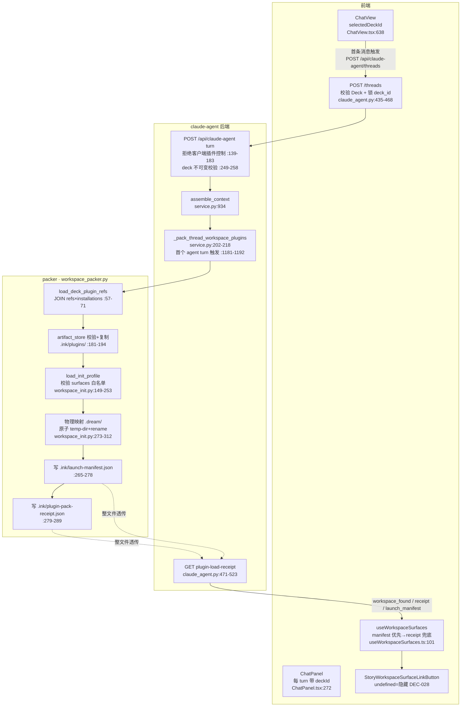
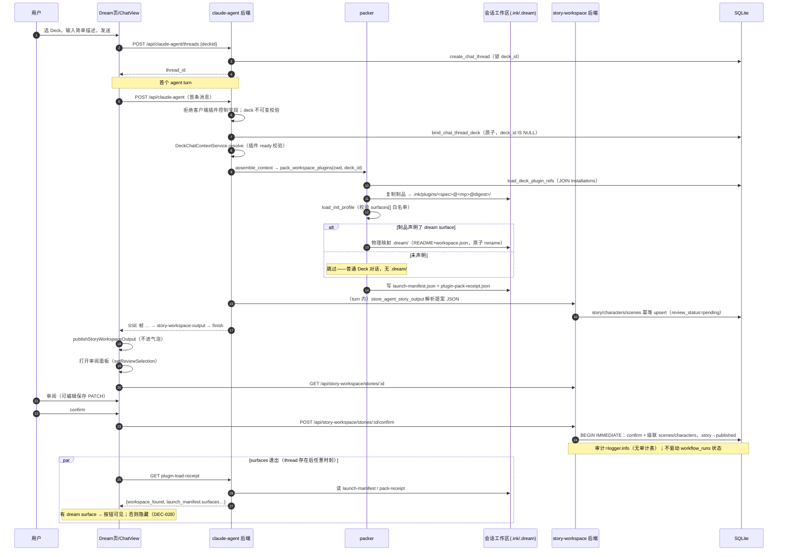
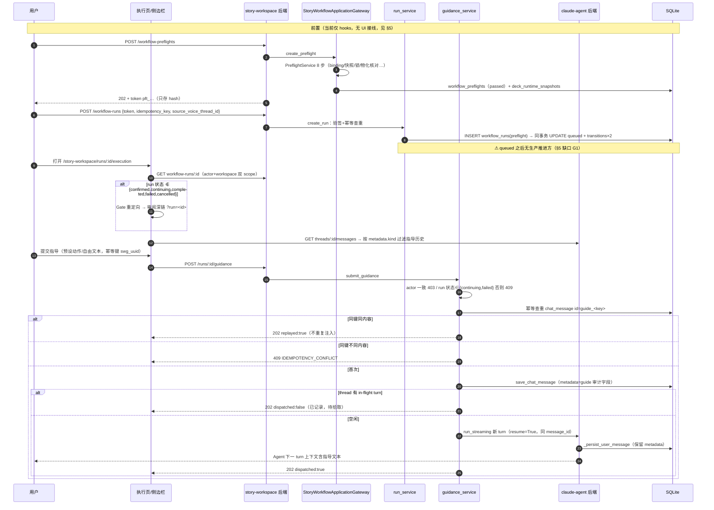

# design_005：Dream 业务模块数据流图与业务时序图（代码现状版）

> 本文基于**代码现状**（2026-08-04，commits `99075d0`/`bd450ff`/`57eab52`/`d0e8af9`/`f7b3ca0`/`8510ddc`/`dec5a92`）绘制 Dream 业务模块的数据流图与业务时序图。
> 所有数据流事实均带 `文件:行号` 证据；术语以 `docs/architecture/术语表.md` 为准（「物理映射」= pack 时刻把 `.dream/` 协议目录写入会话工作区，代码标识 `materialize_dream_surface()`）。
> §5 如实标注了代码现状中的「端点空洞」——阅读图表时请对照，勿把设计语义误认为已接线行为。

---

## 1. 模块边界与参与者

| 参与者 | 代码实体 |
|--------|----------|
| Dream 页（前端） | `frontend/src/router/story-workspace.tsx`（Dream 内容即 `ChatView`）+ `pages/story-workspace/` |
| Chat 视图 | `components/chat/ChatView.tsx` / `ChatPanel.tsx` |
| claude-agent 后端 | `backend/routers/claude_agent.py` + `backend/claude_agent/service.py`（非独立服务，端口 8765） |
| packer | `backend/services/claude_plugin/workspace_packer.py` / `workspace_init.py` / `artifact_store.py` |
| story-workspace 后端 | `backend/routers/story_workspace.py`（`/api/story-workspace`）+ `services/story_workspace/` + `services/deck/story_workflow_gateway.py` |
| workflow 执行域 | `backend/services/workflow/preflight_service.py` / `run_service.py` |
| 存储 | SQLite 表（`backend/database.py`）+ 会话工作区文件树（`.ink/`、`.dream/`） |

---

## 2. 数据流图

### 2.1 会话与 pack 域（thread → pack → surfaces 透出）



**数据形态要点**：

- `POST /threads` 只锁 `deck_id`（`database.create_chat_thread`，`database.py:4061`）；**真正的锁在首个 turn**：`bind_chat_thread_deck` 原子绑定（`database.py:4095`，冲突 409），`DeckChatContextService.resolve` 校验插件 ready（`chat_context.py:61-128`）。
- pack 失败 = turn 失败（raise 于 `service.py:1181-1192`）；冻结分支（已有 manifest）只重校验不重建，`.dream/workspace.json` 缺失报 `CLAUDE_PLUGIN_INIT_PROFILE_INVALID`（`workspace_packer.py:143-155`）。
- `.dream/workspace.json` = `{schema_version:"dream-surface/v1", deck_id, plugins[], entry_route}`，不含 `workflow_run_id` 与时间戳。
- pack receipt **不回传前端**；surfaces 对前端唯一透出通道 = `GET plugin-load-receipt`（pre-pack 时 `workspace_found:false` → 前端按无 surface 隐藏入口）。

### 2.2 run / 审阅 / 执行域

```mermaid
flowchart TD
    subgraph AGENT[Agent 产出]
        SSE[story-workspace-output SSE 帧<br/>service.py:1322-1324<br/>turn 成功+落库后发出]
        PARSE[parse_agent_story_output<br/>agent_integration.py:29-58]
        UPSERT[store_agent_story_output<br/>story/characters/scenes<br/>幂等 upsert+reconcile<br/>agent_integration.py:97-364]
    end

    subgraph FEE[前端 story-workspace]
        EVT[浏览器事件 ink:story-workspace-output<br/>story-workspace-events.ts:17-24]
        PANEL[审阅面板 StoryWorkspaceReviewDetail<br/>GET /api/story-workspace/stories/:id]
        CONF[confirm / reject / batch<br/>storyWorkspaceReviewApi.ts:104-140]
        EXEC[执行页 StoryWorkspaceExecutionPage<br/>GET workflow-runs/:id<br/>+ 指导历史反查]
        SIDE[指导侧边栏<br/>POST runs/:id/guidance<br/>幂等键 swg_uuid]
    end

    subgraph BEE[story-workspace / workflow 后端]
        REV[_transition_pending_review<br/>story_workspace.py:401-501<br/>confirm 级联 scenes+characters]
        PF[PreflightService 8 步<br/>preflight_service.py:166-319<br/>token pft_… 只存 hash]
        RUN[WorkflowRunService.create_run<br/>run_service.py:380-589<br/>preflight→queued 同事务]
        SM[RunStatus 状态机<br/>_ALLOWED_TRANSITIONS<br/>run_service.py:98-125]
        GS[StoryWorkspaceGuidanceService<br/>guidance_service.py:188-281]
    end

    subgraph STORE[(存储)]
        CM[(chat_message<br/>guidance=metadata.kind)]
        WR[(workflow_runs<br/>source_voice_thread_id)]
        SW[(story_workspace_stories<br/>characters/scenes)]
    end

    SSE --> PARSE --> UPSERT --> SW
    SSE --> EVT --> PANEL
    PANEL --> CONF --> REV --> SW
    PF --> RUN --> WR
    WR --> SM
    EXEC -->|actor-scoped GET| WR
    SIDE --> GS
    GS -->|幂等查重+落库| CM
    GS -.同 thread 新 turn resume.-> SSE
```

**数据形态要点**：

- 审阅面板数据 = `GET /api/story-workspace/{stories|characters|scenes}/{id}`；**没有独立的 episodes/projection 端点**。
- confirm story 时同一事务**级联确认**关联 scenes + characters（bundle gate，`story_workspace.py:419-455`），story 置 `status='published'`；审计仅 `logger.info`，**无审计表、无 Gate 聚合记录**。
- preflight 8 步：identity → binding_release → manifest_schema → compatibility → capability_policy → deck_runtime_snapshot（写 `deck_runtime_snapshots`）→ runtime_materialization → token_issuance（HMAC token `pft_…`，只存 hash）。
- run ↔ thread 关联字段 = `workflow_runs.source_voice_thread_id`。
- 执行页数据 = `GET workflow-runs/{id}`（actor+workspace 双 scope）+ 指导历史（`GET threads/{id}/messages` 按 `metadata.kind` 过滤）；projection 恒 null → 进度/资产 tab 为显式空态。
- Gate 重定向：`EXECUTION_PAGE_STATUSES = {confirmed, continuing, completed, failed, cancelled}`（`executionState.ts:23-29`），不在集合内 → 重定向审阅深链（`/story-workspace/dream?run=` 或 `/episodes/:id/review?run=`）。

---

## 3. 业务时序图

### 3.1 主链路：选 Deck 发 Chat → pack → Agent 产出 → 审阅确认



### 3.2 执行链路：preflight → run → 执行页 → guidance 闭环



---

## 4. 数据存储 × 读写方矩阵（Dream 链路核心子集）

| 存储 | 写方 | 读方 |
|------|------|------|
| `chat_thread` | `create_chat_thread`（db:4061）、`bind_chat_thread_deck`（db:4095） | threads 路由、pack 触发（service.py:1177）、guidance 归属校验 |
| `chat_message` | `save_chat_message`（db:4249，INSERT OR REPLACE）：user/assistant turn、**guidance 落库** | 消息列表（前端 + 指导历史反查）、guidance 幂等查重 |
| `deck_claude_plugin_refs` × `claude_plugin_installations` | Deck 插件管理（install/refs 服务） | pack `load_deck_plugin_refs`、DeckChatContext |
| artifact store（`<runtime_root>/artifacts/`） | `import_tree`（安装/迁移脚本） | pack/frozen 修复 `get_artifact` |
| 会话工作区 `.ink/plugins/`、`.ink/launch-manifest.json`、`.ink/plugin-pack-receipt.json` | pack（非冻结写、冻结只校验） | GET plugin-load-receipt；CLI launcher |
| `.dream/`（README + workspace.json） | `materialize_dream_surface`（pack 时刻一次性、原子） | pack 冻结校验；Agent 只读约定；**无 REST 读方** |
| `story_workspace_stories` / `characters` / `scenes`（+ 关系表） | `store_agent_story_output`（upsert/reconcile）、PATCH、confirm/reject 级联 | 审阅面板 GET、confirm 守卫 |
| `deck_runtime_snapshots` | preflight 第 6 步（hash 去重） | preflight/run 比对 |
| `workflow_preflights` | PreflightService（checking→passed/failed）、消费于 run 创建 | run 创建载入上下文 |
| `workflow_runs`（+ `transitions`、`token_consumptions`） | `create_run`（preflight→queued 同事务）、`transition_run` | 执行页/深链 GET、幂等查询 |
| `agent_sessions` / `runtime_load_receipts` | transition_run 激活、runtime 协调服务 | RUNNING 迁移校验 |

完整矩阵见本文件附录来源：数据流事实清单（2026-08-04 代码梳理，文件:行号版）。

---

## 5. 代码现状的「端点空洞」（阅读图表必读）

| # | 空洞 | 现状与证据 | 影响 |
|---|------|-----------|------|
| G1 | **run 状态机 queued 之后无生产推进方** | `transition_run` 的生产调用方仅 cancel 与 `SessionManager`，而后者在全仓仅被测试 import（`session_manager.py` 无生产引用） | run 创建后实际停在 `queued`；`output_validating→pending_review→confirmed→continuing` 迁移暂无生产触发路径；guidance 要求 `{continuing,failed}` 状态，闭环当前主要由测试覆盖 |
| G2 | **审阅 confirm 不驱动 run 状态** | confirm 仅级联内容表 + `logger.info` 审计；`transition_run` 的 CONFIRMED 分支（需 `review_items_approved`，run_service.py:768-770）无生产调用方 | 内容审阅状态机与 run 状态机是手工/未来接线关系 |
| G3 | **preflight→run 创建无 UI 链路** | `useWorkflowPreflight`/`useWorkflowRun`（含 startPreflight/startRun）无任何组件消费 | Dream 页与 run 的接触面只有 `?run=` 深链读取、执行页读取、guidance 提交 |
| G4 | **run events SSE 端点不存在** | 前端 `workflowRunEventsUrl` 指向 `GET …/workflow-runs/{id}/events`，后端无此路由；前端降级 5s 轮询 | 执行页实时性靠轮询 |
| G5 | **projection 端点不存在** | 执行页 projection 恒 null | 任务进度/资产 tab 为显式空态；`awaiting-guidance` 投影态不可达 |
| G6 | **六态按钮聚合端点缺位** | `StoryWorkspaceSurfaceLinkButton` 挂载点已留注入缝，聚合 state 无服务端来源 | 按钮线上默认隐藏（既定降级，Task 4 实施记录） |
| G7 | **dispatched:false 无自动拾取** | in-flight 时指导只落库，依赖下一 turn 上下文带出；用户不再发消息则指导永不送达 runner | 侧边栏已呈现「已记录，待拾取」态 |

> G1–G3 指向同一个结论：**「Agent 产出 → 审阅确认 → 后续执行」链路中，审阅（内容域）与执行（run 域）目前由 `source_voice_thread_id` 和 `?run=` 深链关联，状态机尚未合流**。这是后续接线的核心工作面。

---

## 6. 变更记录

| 日期 | 内容 |
|------|------|
| 2026-08-04 | 初版：基于代码现状（六 Task 实现完成后）的数据流图 ×2、业务时序图 ×2、存储矩阵、端点空洞清单 G1–G7 |
