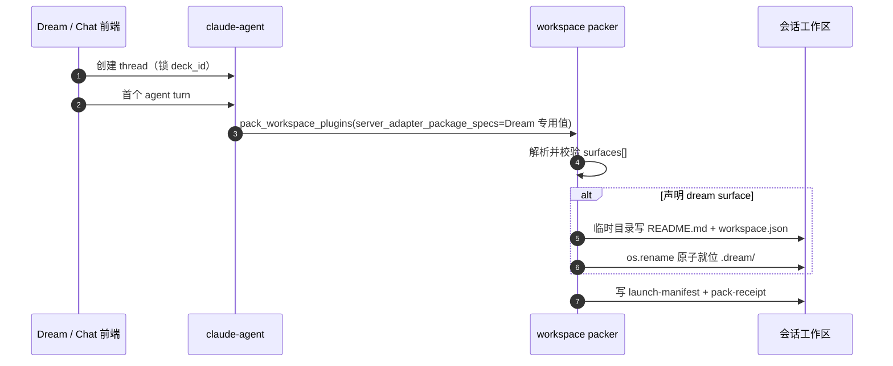
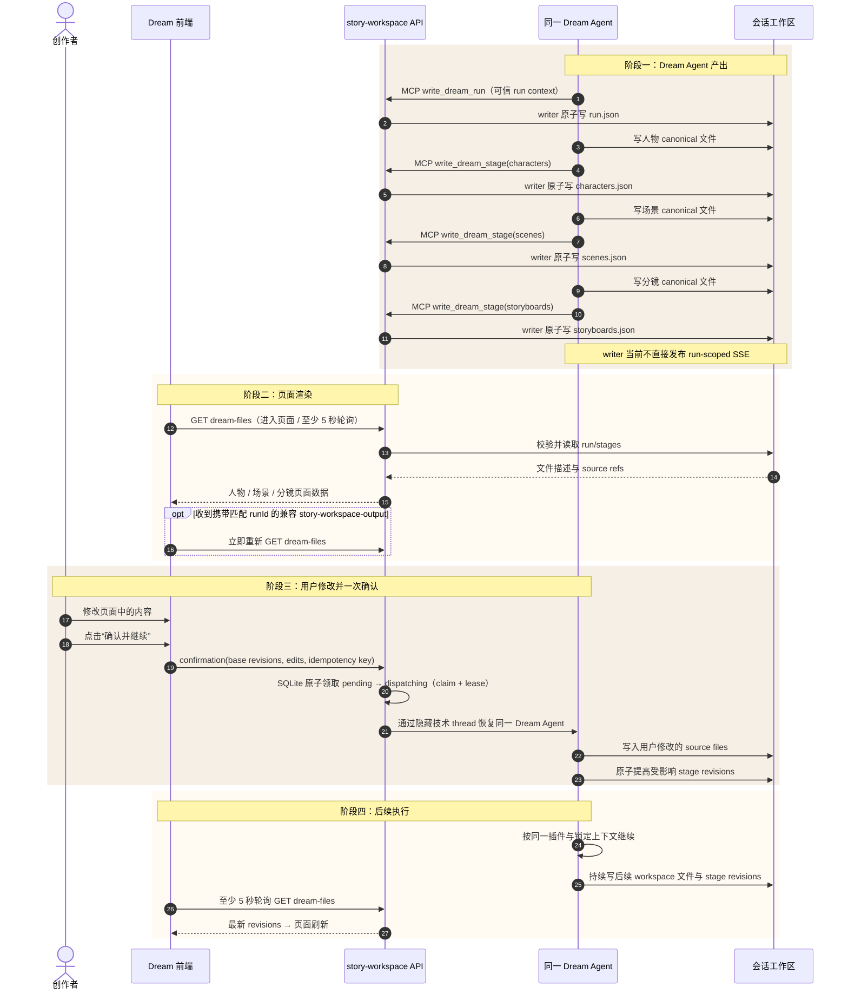

# design_006：`.dream` 静态启动层与 Dream Agent 运行内容层合同

> **Design ID**：`design_006_dream-protocol-dir-mapping`
> **状态**：生产主链已实现；旧 `WorkflowRun.status` 推进、入口六态聚合与 writer 主动 SSE 仍为遗留
> **更新日期**：2026-08-04
> **术语 canonical**：[术语表](../../architecture/术语表.md)
> **业务交互 owner**：[design_007](./design_007_dream-business-module-interaction.md)
> **决策历史**：[design_004](./design_004_story-workspace-dream-surface-execution-page.md) §9
> **代码现状与缺口**：[design_005](./design_005_dream-module-dataflow-and-sequence.md)
> **任务三实施证据**：[Dream 发起与 writer 生产链接通实施记录](./2026-08-04-dream-launch-writer-integration-implementation-record.md)

## 0. 文档职责

本文是 `.dream` 文件协议唯一 owner，定义：

- packer 如何物理映射静态启动层；
- 同一 Dream Agent 在人物、场景、分镜阶段何时更新 `.dream`；
- 运行目录、run/stage schema、revision 与原子写规则；
- 前端如何经后端读取文件并显示对应页面；
- 用户修改内容并一次“确认并继续”时，如何回到同一 Dream Agent；
- 静态层冻结边界、Dream Agent 写入边界和旧会话兼容。

本文不设计逐项审阅、驳回、失败、重试或归档业务状态。业务动作和时序只认 `design_007`。

## 1. 最终裁决

### 1.1 两层目录

`.dream` 分为：

1. **静态启动层**：`README.md + workspace.json`。由 packer 在首个 agent turn 物理映射，随插件 digest 冻结。
2. **Dream Agent 运行内容层**：`runtime/runs/<workflow_run_id>/`。由同一 Dream Agent 按插件步骤更新；`.dream/**` 的实际写入必须经过 Story Workspace MCP 与 writer。

`workspace.json` 保持 `dream-surface/v1`，不加入 run 级字段。`workflow_run_id`、来源五字段与 `projection_entry` 写入运行层 `run.json`。

### 1.2 “插件更新 `.dream`”的准确含义

插件在本项目中是 Dream Agent 执行的工作流与 skill。Dream 专用发起时，服务端额外选择内建 `ink-dream-story@platform-builtin` adapter；浏览器和普通 Chat turn 都不能选择该 adapter。实际内容生产者是 Dream Agent：

- Dream Agent 先按插件约定写人物、场景、分镜 canonical 文件；
- Dream Agent 先调用 `mcp__story_workspace__write_dream_run` 建立 run 文件，再按 `characters → scenes → storyboards` 调用 `mcp__story_workspace__write_dream_stage`；MCP 内部委托 `StoryWorkspaceDreamFileWriter` 原子更新 `.dream/runtime/**`；
- 普通 `Write`/`Edit`/`MultiEdit` 与 Bash 对 `.dream/**` 始终 fail-closed；Dream Agent 不能绕开受控 writer；
- 前端不直接读取工作区，通过 actor-scoped 后端接口取得已校验的 run/stage 描述；
- 用户在页面修改内容后只执行一次“确认并继续”，同一 Dream Agent 收到结构化修改和确认命令，写回工作区后继续后续执行。

不再引入 host event journal、projection 聚合器、逐项 Review Gate 或 stage failed 状态机。

> **2026-08-04 任务三实现注记**：Dream 专用发起页、服务端发起端点、隐藏
> Deck-bound thread、服务端专用 adapter、可信 run context、run/stage writer 链、
> actor-scoped REST 与单次确认 continuation 已接通。writer 尚不直接发送 SSE；前端在
> waiting/editing/continuing 使用至少 5 秒轮询保证更新。G3 已关闭；G1 仅保留为旧
> `WorkflowRun.status` 仍停在 `queued` 的技术遗留，不再表示生产 Dream Agent 缺位。

Dream 发起 wire 只接受 `deckId + goal + idempotencyKey` 三个 camelCase 字段，不接受
snake_case、额外 provenance 或首尾空白。幂等重放使用 run 冻结 binding；首次 turn
投递使用持久 claim，避免并发重放启动两个 Dream Agent turn。

### 1.3 与上游事实的关系

drama-forge 上游当前不写 `.dream`。它把人物/场景写入 `assets/`，把分镜唯一源写入 `stories/<project>/episodes/EP??/storyboard.yaml`；内部运行及报告位于 `.dramaforge/runs/<internal_run_id>/{artifacts,reports}/`。首期兼容方式是在 Ink-Dream 插件说明/adapter 中要求 Dream Agent 在 canonical 分镜 YAML 完成后补写对应 Dream stage 文件；报告路径只能作为可选 `source_files`，不得替代 storyboard 唯一源，也不得声称 vendor 已原生支持 `.dream`。

上游 `/drama-forge:drama-init` 的 preflight 还会从消费方工作区根目录读取
`plugin.json`、`.claude/docs/templates/project-init.md` 与
`.claude/hooks/hooks.json`，而不是只从隔离插件目录读取。Dream pack 因此在同时存在
dream surface 与 `drama-forge@drama-studio` 时，从已校验的隔离制品发布这三个供
preflight 读取的兼容入口；这只是消费方路径适配，不表示 drama-forge 原生支持
`.dream`，也不改变人物、场景、分镜的 canonical owner。

## 2. 参与者与文件 owner

| 参与者 | 写入 | 读取 |
|---|---|---|
| packer | `.dream/README.md`、`.dream/workspace.json`；Dream + drama-forge 组合下发布三个 preflight 兼容入口 | 冻结时校验静态文件与兼容入口 |
| Dream Agent | canonical 人物/场景/分镜文件；通过 Story Workspace MCP 请求更新运行内容层 | adapter 指令、可信 run context、用户确认修改 |
| Story Workspace MCP + `StoryWorkspaceDreamFileWriter` | 唯一的 `.dream/runtime/**` 写通道；完成 run 绑定、路径校验、revision 和原子替换 | 当前可信 run context 与 run/stage 文件 |
| story-workspace 后端 | 不改内容文件；接收“确认并继续”并恢复同一 Dream Agent continuation | 安全读取 run/stage 文件并返回 REST |
| Dream 前端 | 用户本地编辑草稿；不直接写工作区 | REST 轮询；匹配 run 的兼容事件可提前触发读取 |

静态启动层只有 packer 可写。Dream Agent 的普通文件工具不能写任何 `.dream/**` 路径；仅服务端注入可信 run context 后，Story Workspace MCP 可代表当前 Dream Agent 调用 writer 更新该 run 的 `.dream/runtime/**`，不能修改 `README.md` 或 `workspace.json`。

> **技术载体边界**：为复用既有 Agent runtime、工作区与消息持久化，服务端为每次
> Dream 发起创建隐藏的 Deck-bound Agent thread，并以隐藏 `chat_message` 承载发起与
> 确认。该 thread 仅是 Dream Agent 的连续性载体；Dream 前端不挂载 `ChatView`，它不
> 属于 Chat 页面或 Chat 业务合同。

## 3. 静态启动层

### 3.1 surface 声明

```json
{
  "schema_version": "workspace-init/v1",
  "surfaces": [
    {
      "name": "dream",
      "protocol_dir": ".dream",
      "entry_route": "/story-workspace/dream"
    }
  ]
}
```

校验与现状不变：`name` 当前只允许 dream，`protocol_dir` 是安全单级点目录，`entry_route` 位于 `/story-workspace/`；非法声明 fail-closed，多插件同名时 pack 顺序前者胜出并记录 warning。

实现证据：`backend/services/claude_plugin/workspace_init.py:59-115`、`:241-253`，`backend/services/claude_plugin/workspace_packer.py:177-218`。

### 3.2 物理映射时机

只有 thread 已锁定 Deck、首个 agent turn 开始 pack、ready Deck 插件或服务端 Dream adapter 声明 dream surface 且尚无 launch manifest 时，packer 才物理映射静态层。thread 创建本身不写 `.dream`。Dream 专用发起在首个 turn 由服务端传入 adapter package spec；普通 Chat pack 默认不注入。



### 3.3 `workspace.json`

```json
{
  "schema_version": "dream-surface/v1",
  "deck_id": "<locked deck id>",
  "plugins": [
    {
      "package_spec": "<package@marketplace>",
      "artifact_digest": "<sha256>",
      "resolved_version": "<version>"
    }
  ],
  "entry_route": "/story-workspace/dream"
}
```

静态文件不含 `workflow_run_id`、来源五字段、`projection_entry`、时间戳或内容元信息；同 digest 重 pack 字节一致，冻结只校验不重建。

README 必须说明：静态文件禁止 Dream Agent 修改；运行内容只可通过 Story Workspace MCP / `StoryWorkspaceDreamFileWriter` 写 `runtime/**`；页面数据从后端接口读取。

### 3.4 drama-forge preflight 兼容入口

仅当本次 pack 同时满足以下条件时发布：

1. 合并后的 `surfaces[]` 包含 `name="dream"`；
2. 已打包 `drama-forge@drama-studio`。

路径映射固定为：

| 隔离插件制品来源 | 消费方工作区入口 |
|---|---|
| `.claude-plugin/plugin.json` | `plugin.json` |
| `.claude/docs/templates/project-init.md` | `.claude/docs/templates/project-init.md` |
| `.claude/hooks/hooks.json` | `.claude/hooks/hooks.json` |

这些入口在合同上只供 drama-forge preflight 按上游约定读取，唯一发布者是 packer。
发布合同为：

- 目标必须是工作区内的固定相对路径；工作区根目录以目录句柄锚定，逐级父目录均以
  `O_DIRECTORY | O_NOFOLLOW` 相对打开，拒绝父目录 symlink 逃逸和检查后替换；
- 新文件先在目标父目录写唯一临时文件、`fsync`，再以不覆盖的 hard link 发布；既有
  文件只有字节与隔离制品完全一致才复用，冲突内容不覆盖；
- 每个已发布文件本身是完整、可幂等复用的结果。后续文件未发布时不按路径删除已经
  发布的文件，避免误删并发参与者替换后的内容；下一次 fresh pack 复用正确的部分进度
  并补齐缺项；
- launch manifest 已存在时只校验三个入口，不发布缺项、不替换内容；这与静态
  `.dream/workspace.json` 的冻结只校验语义一致；
- 三个入口不位于 `.dream/`，不承载 run/stage 元信息，也不放宽 Dream Agent 对
  `.dream/**` 的写入边界。

实现证据：`backend/services/claude_plugin/workspace_packer.py:45-53,187-367,423-441,538-544`；并发、symlink、部分进度与 frozen 校验测试见
`backend/tests/test_workspace_init_surfaces.py`。

## 4. Dream Agent 运行内容层

### 4.1 目录

```text
.dream/
├── README.md
├── workspace.json
└── runtime/
    └── runs/
        └── <workflow_run_id>/
            ├── run.json
            └── stages/
                ├── characters.json
                ├── scenes.json
                └── storyboards.json
```

运行层不创建 events、projection、review、reject、failure、retry 或 archive 子目录。

### 4.2 `run.json`

```json
{
  "schema_version": "dream-run/v1",
  "workflow_run_id": "run_<32hex>",
  "thread_id": "<chat thread id>",
  "source": {
    "deck_plugin_binding_id": "<id>",
    "binding_revision": 3,
    "deck_plugin_version": "<version>",
    "deck_runtime_snapshot_id": "<id>",
    "runtime_plugin_lock_id": "<id>"
  },
  "projection_entry": "/api/story-workspace/workflow-runs/run_<32hex>/dream-files",
  "required_stages": ["characters", "scenes", "storyboards"],
  "revision": 1
}
```

规则：

- Dream Agent 从 host 提供的受控运行上下文复制字段，不猜测 run/source ID；MCP 还会把请求 run ID 与该上下文精确比对；
- `projection_entry` 使用固定后端模板，插件不得提供外部 URL；
- `required_stages` 由插件合同声明；本专项固定人物、场景、分镜三类；
- `revision` 每次 run 描述变更单调增加；
- `.dramaforge` internal run ID 只能作为可选 opaque 字段，不能替代 host run ID。

### 4.3 stage 文件

三个文件都使用 `dream-stage/v1`：

```json
{
  "schema_version": "dream-stage/v1",
  "workflow_run_id": "run_<32hex>",
  "stage": "characters",
  "revision": 2,
  "source_files": ["assets/characters/lead.md"],
  "page": {
    "title": "人物",
    "entry_route": "/story-workspace/characters?run=run_<32hex>"
  },
  "items": [
    {
      "entity_id": "character_lead",
      "display_name": "主角",
      "summary": "页面摘要",
      "source_file": "assets/characters/lead.md",
      "relations": []
    }
  ]
}
```

字段规则：

| 字段 | 规则 |
|---|---|
| `stage` | 只允许 `characters` / `scenes` / `storyboards`，并与文件名一致 |
| `revision` | 单调递增；页面修改与 Agent 重写都必须基于当前 revision |
| `source_files` | 当前会话工作区内的相对路径，必须通过 realpath containment |
| `page.entry_route` | 由 stage 固定映射，插件不能自定义域外路由 |
| `items` | 页面展示所需元信息；不复制 secret、提示词、二进制或全文 |

固定路由：

| stage | 页面 |
|---|---|
| `characters` | `/story-workspace/characters?run=<run_id>` |
| `scenes` | `/story-workspace/scenes?run=<run_id>` |
| `storyboards` | `/story-workspace/runs/<run_id>/execution` 的 Outline/叙事点入口 |

stage 文件不存在表示该模块尚未由 Dream Agent 写完；文件存在且 schema、run ID、revision 和 source paths 有效，表示对应页面可以渲染。不增加 generating/validating/failed 等业务状态。

## 5. 插件阶段何时更新 `.dream`

| Dream Agent 执行步骤 | canonical 文件 | `.dream` 更新时点 | 页面结果 |
|---|---|---|---|
| 建立 Dream run | 无内容文件 | 首个 Dream Agent turn 取得可信 run context 后先调用 `write_dream_run` 原子写 `run.json` | Dream 显示本次运行与三个等待中的模块 |
| 生成人物 | `assets/characters/*.md` 与 frontmatter | 所需人物文件全部写完后写/替换 `stages/characters.json` | 人物页面出现并可编辑 |
| 生成场景 | `assets/scenes/*.md` 与 frontmatter | 所需场景文件全部写完后写/替换 `stages/scenes.json` | 场景页面出现并可编辑 |
| 生成分镜 | `stories/<project>/episodes/EP??/storyboard.yaml`；可选关联 `.dramaforge/runs/<internal_run_id>/{artifacts,reports}/` | canonical `storyboard.yaml` 写完后写/替换 `stages/storyboards.json`；报告若已生成可作为附加 source refs，不阻塞页面出现 | Outline、叙事点和镜头摘要出现 |
| 用户确认 | 用户在页面积累本地修改 | “确认并继续”命令交回同一 Dream Agent；该 Agent 先写 source files，再更新受影响 stage revision | 页面刷新为确认时版本，Dream Agent 继续后续执行 |
| 后续执行 | 插件定义的后续 workspace 文件 | Dream Agent 若更新人物/场景/分镜，就同步提高对应 stage revision | 页面持续显示最新工作区内容 |

人物、场景可以按插件工作流并行写；每个 stage 文件只有在该阶段页面所需文件完整后才原子出现。用户不对每个 item 分别确认。

## 6. 四阶段文件交互时序



## 7. 用户修改与“确认并继续”合同

### 7.1 页面编辑

- 页面从 `dream-files` REST 取得 stage revision 与可编辑字段。
- 用户修改先保存在前端本地草稿；未确认离开时提示存在未提交修改。
- 页面不直接写工作区，也不逐项发送 confirm/reject。
- 只有一个主操作：“确认并继续”。

### 7.2 确认命令

已实现端点：

```text
POST /api/story-workspace/workflow-runs/{run_id}/dream-confirmation
```

已实现合同 `StoryWorkspaceDreamConfirmationCommand`：

```json
{
  "storyWorkspaceRunId": "run_<32hex>",
  "threadId": "<thread id>",
  "baseRevisions": {
    "characters": 2,
    "scenes": 1,
    "storyboards": 3
  },
  "edits": [
    {
      "stage": "characters",
      "entityId": "character_lead",
      "fields": {"summary": "用户修改后的摘要"}
    }
  ],
  "idempotencyKey": "swc_<uuid>"
}
```

服务端行为：

1. 校验 actor、thread、run 与 required stage revisions；
2. 把命令保存为 `metadata.kind="story-workspace-dream-confirmation"`、`dispatch_status="pending"` 的隐藏 user 消息；
3. 同 actor+run 只允许这一条确认；同幂等键同内容返回同一结果，换键或同键不同内容均冲突；
4. 后台确认协调器在提交后与服务启动后周期扫描可领取消息；调用 Agent 前以 SQLite
   `BEGIN IMMEDIATE` 原子执行 `pending → dispatching`，写入随机 claim ID 与租约。只有
   claim owner 可以通过本次 Dream 的隐藏技术 thread 恢复同一 Dream Agent turn；
5. fresh `dispatching` claim 不进入其他协调器的扫描；claim owner 在 Agent turn 期间
   周期续租；续租 deadline 必须在取得 SQLite 写事务后按当时 wall clock 计算，不能在
   进入 executor/事务前预先计算并提交一个已经过期的 lease。只有提交后仍 fresh 的
   lease 可阻止接管，租约真正过期后才允许一个协调器原子接管。相同幂等键在 claim
   期间只返回既有 accepted fact，不安排第二个 turn；
6. dispatcher 携带领取后的 metadata；Agent runtime 必须按 message ID 查询数据库
   canonical row 来判定它是否为服务端预持久化 confirmation，不得用请求携带的
   `metadata.kind` 分流。若 canonical row 是 confirmation，只校验不可变 envelope、parts
   与 claim identity，不用旧 metadata snapshot 覆写；请求改/删 kind、缺行或 identity
   不符均 fail-closed；
7. 只有同一 claim owner 观察到该 turn 依次产生 `message-final` 与非 error `finish`，才可
   执行 `dispatching → dispatched`；单独出现 `finishReason="stop"` 不能证明成功；
8. 未成功消费的 message ID 按 2 秒起、最大 60 秒的指数退避自动协调；进程退出后由
   持久 claim 租约控制恢复时点，服务重启不会在 fresh lease 内重复交付；
9. Dream Agent 先把 edits 写入 canonical 文件并更新 stage revisions，再继续插件后续步骤。

不建立逐项 review_status，不提供驳回、失败、重试或归档命令。

SQLite claim 实现证据：原子领取
`backend/services/story_workspace/dream_confirmation_service.py:623-721`；fresh/过期租约扫描
`:791-829`；协调器领取、续租与 ack 编排 `:1007-1289`；claim owner ack
`:328-408`；Agent 对服务端预持久化 confirmation 只校验、不用旧 metadata 覆写
`:519-621` 与 `backend/claude_agent/service.py:1452-1516`；claim 期间幂等重放不重复派发
`dream_confirmation_service.py:1592-1663`（`a0cb5d6` + `bea9dbe` + `5497a25` +
`2200d28`）。

## 8. 前端读取与页面显示

### 8.1 surface 与内容读取分工

| 问题 | 接口 |
|---|---|
| 会话是否支持 Dream？ | `plugin-load-receipt` 的 `surfaces[]` |
| 本次 run 有哪些 Dream 页面内容？ | `GET /api/story-workspace/workflow-runs/{run_id}/dream-files` |

`useWorkspaceSurfaces()` 继续使用 manifest 优先、receipt 兜底；无 surface 时隐藏入口。stage 文件是否存在只影响页面内容，不改变 surface 能力。

### 8.2 `dream-files` 响应

后端读取前必须校验 thread owner、run ID、schema、revision 与 source path containment。响应至少包含：

- `storyWorkspaceRunId`、`threadId`、来源五字段；
- required stages；
- 每个已存在 stage 的 revision、entry route、items 与可编辑字段；
- `canConfirm`：全部 required stage 文件存在且 base revisions 一致；
- `confirmationLabel`：固定“确认并继续”。

后端合同只归 `backend/story_workspace/contracts.py`，前端局部合同只归 `frontend/src/hooks/story-workspace/contracts.ts`；`backend/database.py` 只读、零 DDL。

### 8.3 revision 发现与兼容事件

REST `dream-files` 是页面真相源。页面在 waiting、editing、continuing 阶段至少每 5 秒重新 GET；writer 当前不直接发布 run-scoped SSE。若既有链路发出携带匹配 `runId` 的 `story-workspace-output`，前端可以把它作为加速信号立即重新 GET，但事件 payload 不承载全文、没有 `runId` 的旧事件也不得刷新当前 Dream run。writer 主动 run-scoped SSE 保留为遗留，不作为首期正确性的前提。

## 9. 写入一致性与并发边界

- Story Workspace MCP 必须持有服务端注入的可信 run context，并且只接受其中的精确 run ID；`StoryWorkspaceDreamFileWriter` 只接受当前 run 目录与固定 stage 文件名。
- 每次写入先校验 expected revision，再写同目录临时文件、flush/fsync、`os.replace`。
- 同一 Dream 技术 thread 同时只允许一个会修改当前 run 的 Dream Agent turn；同 actor+run
  只有一条隐藏确认。多协调器/多进程的唯一互斥与正确性边界是 SQLite 原子 claim。
- 隐藏确认是零 DDL 的 durable work item：`pending → dispatching` claim 与 lease 保存在
  既有 message metadata；owner 在 turn 期间续租，fresh claim 不扫描，过期 claim 才可
  被一个协调器原子接管。续租 deadline 在 SQLite 写事务内按当前 wall clock 计算，避免
  executor/DB 延迟把已经过期的 deadline 刚写回数据库，
  只有 claim owner 可在观察到 `message-final` 与非 error 终止帧后确认 dispatched。
  未成功消费按 message ID 指数退避。若 Dream Agent 已完成、SQLite ack 前进程退出，
  租约过期后同一 message ID 仍可能再次交付，因此提供 at-least-once 而非 exactly-once；
  Dream Agent 的 canonical 写入与 stage CAS 必须吸收该崩溃窗口的重复交付。
- 不同 stage 可并行准备 canonical 文件，最终替换各自独立 JSON；同一 stage revision 必须串行。
- 不允许 append JSON，不允许绝对路径、`..`、symlink 逃逸或跨 run 写入。
- 临时写未完成时保留上一有效 revision；页面继续显示上一版或等待该 stage 文件出现，不新增业务失败页面。
- 冻结分支仍只校验静态 `workspace.json`，不得删除或重建 Dream Agent 运行内容层。
- drama-forge preflight 兼容入口与 `.dream` 静态启动层使用同一 pack 冻结边界：fresh pack
  可发布，launch manifest 出现后只校验；兼容入口的存在不允许运行期回写静态启动层。

## 10. 上游兼容

| 上游文件 | Dream Agent 补写的 Dream 文件 |
|---|---|
| `assets/characters/*.md` | `stages/characters.json` |
| `assets/scenes/*.md` | `stages/scenes.json` |
| `stories/<project>/episodes/EP??/storyboard.yaml`（可选关联 `.dramaforge/runs/<internal_run_id>/{artifacts,reports}/`） | `stages/storyboards.json` |

内建 Dream adapter 已补充 run → characters → scenes → storyboards 的 writer 指令；vendor 原目录与文件格式保持不变。该 adapter 只由 Dream 服务端发起链选择，不改变普通 Chat turn 的插件包。上游 preflight 所需的三个消费方路径由 packer 按 §3.4 发布，不由 Dream Agent 在运行期创建。

旧会话只有静态层时仍可显示 Dream 入口；没有 `run.json` 时页面显示等待 Dream Agent 写入，不自动改写旧工作区。

## 11. 本期不做

- 逐项确认、批量确认、Review Gate 聚合；
- 驳回、失败、重试、归档业务状态或操作；
- event journal、host projection 聚合器、stage 状态机；
- 浏览器直接读写工作区；
- 用户手动新建人物、场景或分镜；
- 视频、上传、播放器、外部模型选择和复杂画布；
- 移动端、平板端、触控适配；
- 修改 `backend/database.py` 或新增 DDL；
- 把旧 `WorkflowRun.status` 的 G1 技术遗留或 G6 入口聚合端点写成已实现。

## 12. 验收清单

- [x] 静态 `workspace.json` 保持 `dream-surface/v1` 与冻结语义。
- [x] Dream Agent 只可经受控工具写 `.dream/runtime/**`，不能修改静态启动层；通用文件工具和 Bash 写入均 fail-closed。
- [x] `run.json` 包含 run/source 字段、`projection_entry` 与 required stages。
- [x] 人物、场景、分镜 canonical 文件完成后才出现对应 stage 文件。
- [x] stage 文件存在即页面可渲染，不设计驳回或失败状态机。
- [x] 页面允许用户修改内容，并且只有一次“确认并继续”；刷新后由持久确认事实恢复只读继续态。
- [x] Dream 专用发起建立隐藏 Deck-bound Agent thread 作为技术连续性载体；Dream 前端不挂载 `ChatView`，首个 turn 与确认 continuation 复用该载体和同一可信 run context。
- [x] 服务端专用 adapter 指示 Dream Agent 按 run → characters → scenes → storyboards 调用受控 writer，普通 Chat 不注入该 adapter。
- [x] Dream + drama-forge pack 发布三个上游 preflight 兼容入口；目录句柄锚定、幂等复用、并发冲突、部分进度和 frozen 只校验边界有测试覆盖。
- [x] 确认命令恢复同一 Dream Agent；该 Agent 写入修改后继续后续执行。
- [x] 单次确认由 SQLite 原子 claim + lease 跨协调器互斥；fresh claim 不扫描、过期租约原子接管、只有 claim owner 可 ack。
- [x] 后续执行只描述持续写工作区与页面刷新，不包含驳回、失败、重试或归档。
- [x] 前端经 actor-scoped REST 读取，并以至少 5 秒轮询保证刷新；匹配 run 的兼容事件只用于提前读取。
- [x] revision、幂等、原子替换、路径 containment 与静态冻结边界明确。
- [x] G3、G5 已实现；G1 仅作为旧状态聚合仍停 `queued` 的技术遗留；G6 仍为遗留。
- [x] 文中只使用“物理映射”，不使用禁用同义词。

## 13. 变更记录

| 日期 | 内容 |
|---|---|
| 2026-08-04 | 初版：只设计静态 `.dream` |
| 2026-08-04 | 首轮审阅修订：形成分层方案中间稿，后按用户反馈废止 |
| 2026-08-04 | 最终用户修订：改为同一 Dream Agent 通过工作空间写 run/stage 文件；用户只修改并一次确认，确认后 Dream Agent 继续；删除驳回、失败、重试和归档设计 |
| 2026-08-04 | 任务三实现校准：REST 轮询成为 revision 发现保证；匹配 run 的兼容事件仅作加速；补持久确认/派发恢复与通用 Bash 写保护 |
| 2026-08-04 | Dream 发起与 writer 集成校准：补隐藏 Deck-bound thread、服务端专用 adapter、可信 run context、run → characters → scenes → storyboards writer 链；G3 关闭，G1 收窄为旧状态聚合技术遗留 |
| 2026-08-04 | 上游 preflight 兼容校准：Dream + drama-forge pack 发布三个消费方工作区读取入口；补目录句柄锚定、幂等/并发/部分进度与 frozen 只校验合同，不改变 `.dream` 静态启动层冻结 |
| 2026-08-04 | 单次确认并发校准：引入 SQLite `pending → dispatching` claim + lease；fresh claim 不扫描、过期租约原子接管、claim owner 才可 ack，保留 ack 前崩溃的 at-least-once 语义 |
