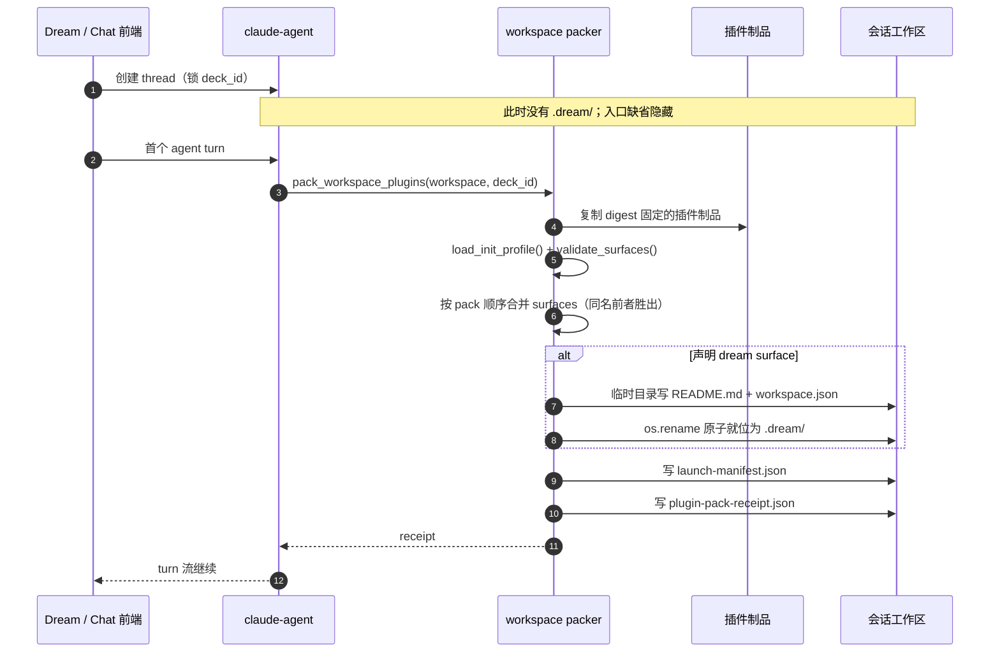

# design_006：`.dream` 协议目录物理映射与前端发现合同

> **Design ID**：`design_006_dream-protocol-dir-mapping`
> **状态**：设计完成；当前实现已覆盖静态映射与 surface 发现，运行期写入明确禁止
> **更新日期**：2026-08-04
> **术语 canonical**：[术语表](../../architecture/术语表.md)
> **决策历史**：[design_004](./design_004_story-workspace-dream-surface-execution-page.md) §9（DEC-027～032，保留原文与修订注记）
> **代码现状与缺口**：[design_005](./design_005_dream-module-dataflow-and-sequence.md)（数据流、时序、G1～G7）
> **任务一裁决**：[2026-08-04 任务一实施记录](./2026-08-04-dream-protocol-task1-problem-decision-implementation-record.md)

## 0. 文档职责与适用规则

本文是 `.dream` 协议目录交互合同的**唯一设计 owner**，完整定义：

- 插件如何声明 dream surface；
- packer 在何时、以什么输入物理映射 `.dream/`；
- 目录结构、schema、冻结、原子性与多插件规则；
- 人物、场景、分镜等生成阶段是否可以写入 `.dream/`；
- Agent 读写边界；
- 前端如何判断“要不要显示打开渲染页面的入口”；
- `.dream/` 与 launch-manifest、pack-receipt、plugin-load-receipt 的关系；
- 异常、兼容与本期边界。

其他文档的职责：

| 文档 | 职责 | 不承担 |
|---|---|---|
| `docs/architecture/术语表.md` | 术语、技术命名、状态与本文件索引 | schema、时序和异常规则 |
| `design_004` | 跳转链、执行页、guidance 以及 DEC-027～032 历史 | `.dream` 合同的第二份规范 owner |
| `design_005` | 2026-08-04 代码现状、数据流和 G1～G7 | 目标合同 |
| 本文 | `.dream` 协议目录完整合同 | run 状态机步骤语义、执行页详细视觉稿 |

若上述文档中的 `.dream` 细节与本文冲突，以本文为准；DEC 原文仍以 `design_004` §9 为决策历史依据。

## 1. 背景与裁决

### 1.1 要解决的问题

dream surface 需要一个会话级、可冻结、可被服务端安全发现的启动标识，以回答：

1. 这个会话是否由声明了 Dream 页面能力的插件驱动；
2. 允许打开哪个 `story-workspace` 入口；
3. pack 时实际锁定了哪个 Deck 和哪些插件制品。

它不回答某次 run 的状态、审阅进度或产物位置。运行期事实由 story-workspace REST API 负责。

### 1.2 2026-08-04 核心裁决

维持 DEC-029 的静态冻结语义：

- `.dream/` 只保存 pack 期 launch 事实；
- `workspace.json` 保持 `dream-surface/v1`，不加入 `workflow_run_id`、运行来源五字段、`projection_entry` 或时间戳；
- 人物、场景、分镜生成期元信息不写 `.dream/`；
- Agent 不得写、改、删 `.dream/**`；
- run、Gate、审阅、执行投影与来源字段只认 actor-scoped REST API。

依据：

- 当前物理映射 payload 只有四类字段，且代码注释明确不含 run 与时间戳（`backend/services/claude_plugin/workspace_init.py:273-305`）。
- 冻结分支只校验 surface 文件存在，不重建（`backend/services/claude_plugin/workspace_packer.py:129-170`）。
- drama-forge 上游把 `stories/`、`assets/`、`exports/` 与 `.dramaforge/` 作为用户项目运行区；具体分镜 skill 另声明 storyboard 与 `.drama/checks/` 产物路径。上游没有 `.dream`、`workflow_run_id` 或 `projection_entry` 合同（证据汇总见任务一记录 §1.3）。
- G1～G3 是状态推进与 UI 接线缺口（`design_005:256-268`）；增加文件副本不能修复它们。

## 2. 参与者与事实 owner

| 事实 | 唯一写方 / owner | 消费方 |
|---|---|---|
| `surfaces[]` 声明 | 插件制品内 `.ink/workspace-init.json`，随 artifact digest 固定 | `load_init_profile()`、packer |
| `.dream/README.md`、`.dream/workspace.json` | packer 的 `materialize_dream_surface()` | packer 冻结校验；Agent 只读参考 |
| `.ink/launch-manifest.json` | packer | CLI launcher、`plugin-load-receipt` |
| `.ink/plugin-pack-receipt.json` | packer | 审计、`plugin-load-receipt` 兜底 |
| surface 发现响应 | claude-agent `plugin-load-receipt` 端点整文件透传 | `useWorkspaceSurfaces()` |
| 人物、场景、分镜源文件 | 插件按自身 canonical 工作区合同写入 | Agent、host 解析器 |
| story-workspace 内容与审阅状态 | story-workspace 数据库与 REST API | Dream 审阅页面 |
| run 状态、来源字段、执行投影 | workflow/story-workspace 服务与 actor-scoped REST API | 执行协作工作台 |

禁止把任何一行事实复制到 `.dream/` 后再作为另一真相源。

## 3. 声明合同：workspace-init `surfaces[]`

### 3.1 schema

插件制品可以在 `.ink/workspace-init.json` 的 `workspace-init/v1` 中声明：

```json
{
  "schema_version": "workspace-init/v1",
  "surfaces": [
    {
      "name": "dream",
      "protocol_dir": ".dream",
      "entry_route": "/story-workspace/dream"
    }
  ]
}
```

`surfaces` 是可选字段；缺省或空数组表示该插件不声明页面 surface，不改变 profile 版本。

### 3.2 校验

当前实现规则（`backend/services/claude_plugin/workspace_init.py:59-115`、`:241-253`）：

| 字段 | 规则 |
|---|---|
| `name` | 白名单，当前只允许 `dream` |
| `protocol_dir` | 单级、点号开头、小写字母开头，只含小写字母/数字/连字符；不得为 `.ink`、`.editor`、`.notion` |
| `entry_route` | 必须以 `/story-workspace/` 开头 |
| 唯一性 | 单 profile 内 `name` 和 `protocol_dir` 均不可重复 |
| 错误 | 任一非法声明 fail-closed：`CLAUDE_PLUGIN_INIT_PROFILE_INVALID`，整个 pack 失败 |

多插件声明同名 surface 时按 pack 顺序前者胜出，后者进入 receipt `warnings[]`；不合并两个同名 surface 的字段（`backend/services/claude_plugin/workspace_packer.py:177-218`）。

## 4. 触发链路与物理映射时序

### 4.1 触发条件

只有以下条件同时成立才物理映射 `.dream/`：

1. thread 已锁定 `deck_id`；
2. 会话首个 agent turn 进入 `pack_workspace_plugins()`；
3. 至少一个 ready 插件制品 profile 合法声明 `name="dream"`；
4. 工作区不存在 launch manifest，即本次不是冻结分支。

thread 创建本身不生成 `.dream/`。surface 首次可见时机是首个 agent turn pack 成功、manifest 与 receipt 落盘之后。

### 4.2 时序



实现顺序为：复制全部制品 → 执行 profile 初始化 → 汇总全部插件清单 → 物理映射 surface → 写 manifest/receipt（`backend/services/claude_plugin/workspace_packer.py:180-288`）。这样 `workspace.json.plugins[]` 能包含本次 pack 的完整插件清单。

## 5. `.dream/` 目录与 schema

### 5.1 目录

```text
.dream/
├── README.md
└── workspace.json
```

不得在本 schema 下新增 `runs/`、`projections/`、`metadata/` 或阶段文件。新增子树属于协议升级，必须先修订本文、DEC-029 和 schema_version。

### 5.2 `workspace.json`

```json
{
  "schema_version": "dream-surface/v1",
  "deck_id": "<locked deck id>",
  "plugins": [
    {
      "package_spec": "<package@marketplace>",
      "artifact_digest": "<sha256>",
      "resolved_version": "<version>"
    }
  ],
  "entry_route": "/story-workspace/dream"
}
```

字段规则：

| 字段 | 来源 | 语义 |
|---|---|---|
| `schema_version` | packer 常量 | 固定 `dream-surface/v1` |
| `deck_id` | thread 锁定的 Deck | 会话级 launch 事实 |
| `plugins[]` | 本次 manifest 全量插件条目投影 | 只含 `package_spec`、`artifact_digest`、`resolved_version` |
| `entry_route` | 胜出的 surface 声明 | 允许前端进入的 story-workspace 路由 |

明确禁止的字段：

- `workflow_run_id`；
- `deck_plugin_binding_id`、`binding_revision`、`deck_plugin_version`、`deck_runtime_snapshot_id`、`runtime_plugin_lock_id`；
- `projection_entry`；
- `created_at`、`updated_at`、`packed_at` 等时间戳；
- review、Gate、run status、attempt、supersede、人物、场景、分镜或执行步骤状态。

### 5.3 `README.md`

README 必须告诉 Agent 与人工排障者：

1. 本目录由 packer 在首个 agent turn 的 pack 时物理映射；
2. `workspace.json` 是静态 launch 事实；
3. 运行期事实只认会话 / story-workspace REST API；
4. Agent 不得写、改、删本目录；
5. Dream 提案仍走 Agent 输出解析与 `story-workspace-output` 生命周期帧，不经本目录落盘。

当前模板实现位于 `backend/services/claude_plugin/workspace_init.py:258-270`。

## 6. 各阶段元信息写入规则

### 6.1 总规则

所有阶段对 `.dream/**` 都是 **0 次写入**。阶段元信息写入其已有 canonical owner，host 需要展示时通过解析、数据库和 REST 投影取得。

| 阶段 | 插件实际写区 | host 侧承载 | `.dream/` |
|---|---|---|---|
| 故事人物 | `assets/characters/*.md` 及索引/锁；YAML frontmatter | `story_workspace_characters` + 审阅 REST | 禁止写入 |
| 故事场景 | `assets/scenes/*.md` 及索引/锁；YAML frontmatter | `story_workspace_scenes` + 审阅 REST | 禁止写入 |
| 故事镜头 / 分镜 | skill 声明的 storyboard 文件与 `.drama/checks/` 校验报告；审批 frontmatter | 后续 episodes/projection 合同与 REST；当前缺口 G5 | 禁止写入 |
| 插件内部生产 run | `.dramaforge/runs/{internal-run-id}/` | 插件内部运行审计；当前无 host run ID 映射 | 禁止写入 |
| Ink-Dream workflow run | 不由插件文件定义 | `workflow_runs`、transitions、actor-scoped REST | 禁止写入 |
| 用户审阅确认 | 不回写 `.dream` | story-workspace 内容表、review REST | 禁止写入 |
| guidance | `chat_message.metadata.kind="story-workspace-guidance"` | guidance REST + 历史反查 | 禁止写入 |

### 6.2 `projection_entry` 的处理

当前执行页 projection 端点不存在，projection 恒为空（`design_005:113-118`、G5 `:264`）。因此：

- 不允许在 `workspace.json` 中写一个尚不可兑现的 `projection_entry`；
- 任务三若实现 G5，应在 `backend/story_workspace/contracts.py` 定义 actor-scoped REST 响应，由前端局部合同 `frontend/src/hooks/story-workspace/contracts.ts` 消费；
- 若未来确需静态路由模板，须明确它不包含 run ID、不代表数据存在，并通过新的 schema 评审；不能就地扩写 `dream-surface/v1`。

### 6.3 上游 run ID 与 host run ID

drama-forge 的 `.dramaforge/runs/{internal-run-id}` 与 Ink-Dream 的 `workflow_run_id` 是两个现有 owner。未建立显式、持久化且可审计的绑定前，不得在任一侧推断等价关系，也不得把二者同时复制进 `.dream/`。

## 7. 冻结、幂等、原子与失败语义

### 7.1 首次物理映射

- packer 在 `.dream.tmp-<pid>/` 中写完两个文件；
- 全部成功后以 `os.rename` 原子就位；
- 写入失败清理临时目录，抛出 `CLAUDE_PLUGIN_INIT_PROFILE_INVALID`，整个 pack 失败；
- 已有半写目录仅允许首次非冻结 pack 在原子就位前清理并重建。

实现证据：`backend/services/claude_plugin/workspace_init.py:273-312`、`backend/services/claude_plugin/workspace_packer.py:240-264`。

### 7.2 同 digest 幂等

完整 `.dream/README.md` 与 `workspace.json` 已存在时，`materialize_dream_surface()` 保持文件不变；相同输入重 pack 字节一致。不得以更新时间戳破坏幂等。

### 7.3 冻结工作区

一旦存在 launch manifest：

- 插件版本不交换；
- profile init steps 不重跑；
- `.dream/` 只校验 `workspace.json` 存在，不重建；
- 缺失则 pack 失败，不从当前插件引用推断并补写；
- pack-receipt 可反映 `frozen: true`，但这不修改 `.dream/`。

### 7.4 并发边界

当前 `.dream` 合同只有 packer 单 writer，且只在首次 pack 写一次。维持静态冻结后没有 Agent 与 runner 并发追加场景，因此不引入文件锁、append journal 或 last-write-wins。若未来开放运行期写入，必须先另立单 writer、锁、回滚、清理、重放与可重建合同，不能复用 v1。

## 8. manifest、receipt 与前端发现

### 8.1 三份载体的关系

| 载体 | 位置 | 用途 | 是否由前端直接读文件 |
|---|---|---|---|
| `.dream/workspace.json` | 会话工作区 | Agent/排障者只读的静态 launch 说明 | 否 |
| `.ink/launch-manifest.json` | 会话工作区 | launch 唯一事实源，含 `surfaces[]` | 否；由端点透传 |
| `.ink/plugin-pack-receipt.json` | 会话工作区 | pack 审计与 manifest 缺位时的 surface 兜底 | 否；由端点透传 |

manifest 和 receipt 的 `surfaces[]` 保存 `{name, protocol_dir, entry_route}`；它们不嵌入 `workspace.json` 全文。

### 8.2 透出端点

前端只调用：

```text
GET /api/claude-agent/threads/{thread_id}/plugin-load-receipt
```

端点先校验 thread owner，再安全解析会话工作区，整文件透传 `launch_manifest` 与 `receipt`；pre-pack 或工作区缺位返回 `workspace_found:false`（`backend/routers/claude_agent.py:471-523`）。前端不得发起文件系统探测 API。

### 8.3 “要不要打开渲染页面”的判定

`useWorkspaceSurfaces(threadId)` 的算法（`frontend/src/hooks/story-workspace/useWorkspaceSurfaces.ts:18-122`）：

1. `threadId` 缺失 → `undefined`；
2. 请求失败、HTTP 非 2xx、JSON 非法或 `workspace_found !== true` → `undefined`；
3. 优先取 `launch_manifest.surfaces`；
4. manifest 不含有效数组时才回退 `receipt.surfaces`；
5. 只保留同时具有字符串 `name`、`protocol_dir`、`entry_route` 的条目；
6. 空数组、旧会话无键或无有效 dream surface → `undefined`；
7. 只有 `name="dream"` 的 surface 才允许 Dream 审阅面板侧渲染跳转入口；目标使用服务端聚合阶段决定，`entry_route` 只作为 surface 入口，不替代 run 深链。

`undefined` 的 UI 语义是“隐藏入口”，不是错误空态。前端不能根据 `.dream/` 路径字符串、URL query 或本地文件存在性猜测 surface。

### 8.4 六态按钮与 G6

surface 只解决“该会话是否声明 Dream 页面能力”。按钮的六态文案和目标还需要服务端聚合 review/run 阶段；该聚合端点当前缺位（`design_005:265`），所以线上默认隐藏。不得用 `workspace.json` 或前端拼接状态绕过 G6。

## 9. 异常与兼容矩阵

| 场景 | 结果 | 用户可见行为 |
|---|---|---|
| 插件无 profile 或无 `surfaces` | 正常 pack，无 `.dream/` 和 manifest surface | 隐藏入口 |
| profile `surfaces` 非数组或字段非法 | pack fail-closed，`CLAUDE_PLUGIN_INIT_PROFILE_INVALID` | 首个 turn 失败，展示既有错误 |
| 多插件声明 `dream` | 首个声明胜出，后续冲突写 receipt warning | 使用胜出入口；不合并 |
| thread 已创建但首个 turn 未 pack | `workspace_found:false` | 隐藏入口 |
| 旧会话 manifest 无 `surfaces` | 正常兼容 | 隐藏入口，不补探测 |
| manifest 有 surface、receipt 无 | manifest 优先 | 显示入口所需 surface 可用 |
| manifest 无有效 surface、receipt 有 | receipt 兜底 | surface 可用 |
| 两者 JSON 损坏或请求失败 | 前端降级 `undefined` | 隐藏入口，不抛 surface 专属错误 |
| 冻结工作区 `.dream/workspace.json` 缺失 | pack 失败，不重建 | 保持冻结不变量，人工排障 |
| Agent 尝试写 `.dream/**` | 合同违规 | 不把写入视作有效事实；强制写拒绝钩子不在本期 |
| run 不存在、无权或已 supersede | 由 actor-scoped run API 与深链策略处理 | 404/403 提示或回退；与 surface 发现无关 |

## 10. 安全与隐私

- `.dream/` 不包含提示词、secret-ref 值、令牌、用户输入全文或内容产物。
- `plugins[]` 只暴露已锁定制品的非敏感标识和 digest。
- run REST 必须按 actor/workspace scope 校验；不得因为知道 `entry_route` 或 `workflow_run_id` 获得数据访问权。
- `protocol_dir` 和 `entry_route` 在 pack 期校验，阻止路径穿越与 story-workspace 域外路由。
- 前端只信服务端端点返回，不把会话工作区暴露为通用文件浏览接口。

## 11. 本期不做与后续入口

本期不做：

- `.dream/runs/` 或任意运行期子区；
- Agent/插件向 `.dream` 追加人物、场景、分镜元信息；
- `workspace.json` v2；
- `workflow_run_id` 与 drama-forge internal run ID 的文件级映射；
- projection REST 端点（G5）与六态按钮聚合端点（G6）的实现；
- G1～G3 状态机生产接线；
- 强制拒绝 Agent 写 `.dream` 的文件系统钩子；
- 视频、上传、播放器、复杂画布和移动端。

后续如要改变任一项，必须：

1. 先更新术语表；
2. 修订本文与 DEC-029 注记；
3. 明确事实 owner、单 writer、并发、失败回滚、冻结升级和清理；
4. 为 host run ↔ 插件 internal run 建立显式合同；
5. 后端合同只归 `backend/story_workspace/contracts.py`，前端局部合同只归 `frontend/src/hooks/story-workspace/contracts.ts`；
6. 补 Red/Green 测试，覆盖冻结、并发、失败与旧会话兼容。

## 12. 验收清单

- [ ] 术语表只做索引，并指向本文作为 `.dream` 唯一设计 owner。
- [ ] 插件声明、物理映射、目录/schema、冻结与失败语义均可在本文唯一定位。
- [ ] `workspace.json` 明确排除 run、来源字段、`projection_entry` 与时间戳。
- [ ] 人物、场景、分镜阶段的 canonical 写区与 `.dream` 0 写入规则明确。
- [ ] Agent 只读边界与 REST 唯一运行事实源明确。
- [ ] manifest 优先、receipt 兜底、旧会话/错误缺省隐藏规则明确。
- [ ] G1～G3、G5、G6 没有被文件合同伪装成已实现。
- [ ] 文中使用“物理映射”，不使用禁用同义词。

## 13. 变更记录

| 日期 | 内容 |
|---|---|
| 2026-08-04 | 初版：从 `design_004` 分离 `.dream` 完整合同；按任务一裁决维持 DEC-029 静态冻结；补上游真实写区、阶段写入规则、前端发现算法与 G1～G6 边界 |
