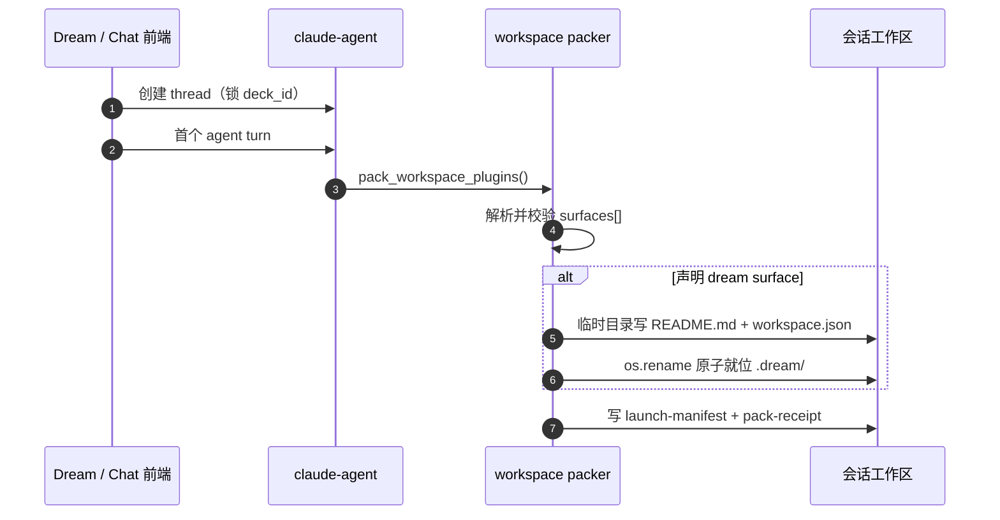
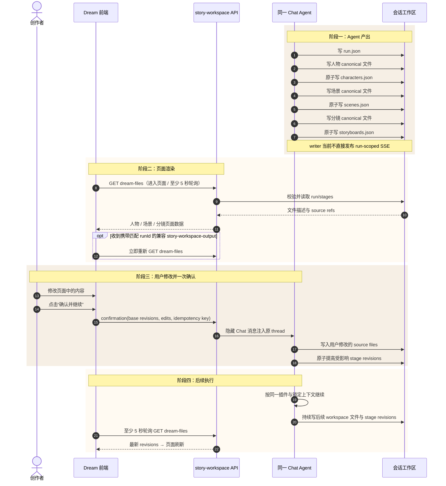

# design_006：`.dream` 静态启动层与 Agent 运行内容层合同

> **Design ID**：`design_006_dream-protocol-dir-mapping`
> **状态**：主体已实现；初始 run 生产推进（G1/G3）与 writer 主动 SSE 仍为遗留
> **更新日期**：2026-08-04
> **术语 canonical**：[术语表](../../architecture/术语表.md)
> **业务交互 owner**：[design_007](./design_007_dream-business-module-interaction.md)
> **决策历史**：[design_004](./design_004_story-workspace-dream-surface-execution-page.md) §9
> **代码现状与缺口**：[design_005](./design_005_dream-module-dataflow-and-sequence.md)

## 0. 文档职责

本文是 `.dream` 文件协议唯一 owner，定义：

- packer 如何物理映射静态启动层；
- 同一 Chat Agent 在人物、场景、分镜阶段何时写 `.dream`；
- 运行目录、run/stage schema、revision 与原子写规则；
- 前端如何经后端读取文件并显示对应页面；
- 用户修改内容并一次“确认并继续”时，如何回到同一 Chat Agent；
- 静态层冻结边界、Agent 可写边界和旧会话兼容。

本文不设计逐项审阅、驳回、失败、重试或归档业务状态。业务动作和时序只认 `design_007`。

## 1. 最终裁决

### 1.1 两层目录

`.dream` 分为：

1. **静态启动层**：`README.md + workspace.json`。由 packer 在首个 agent turn 物理映射，随插件 digest 冻结。
2. **Agent 运行内容层**：`runtime/runs/<workflow_run_id>/`。由同一 Chat Agent 按插件步骤通过会话工作空间写入和更新。

`workspace.json` 保持 `dream-surface/v1`，不加入 run 级字段。`workflow_run_id`、来源五字段与 `projection_entry` 写入运行层 `run.json`。

### 1.2 “插件更新 `.dream`”的准确含义

插件在本项目中是 Agent 执行的工作流与 skill。实际写文件者是当前 Chat Agent：

- Agent 先按插件约定写人物、场景、分镜 canonical 文件；
- 对应阶段可供页面显示时，Agent 再调用 `StoryWorkspaceDreamFileWriter` 原子更新 `.dream/runtime/**`；
- 前端不直接读取工作区，通过 actor-scoped 后端接口取得已校验的 run/stage 描述；
- 用户在页面修改内容后只执行一次“确认并继续”，同一 Chat Agent 收到结构化修改和确认命令，写回工作区后继续后续执行。

不再引入 host event journal、projection 聚合器、逐项 Review Gate 或 stage failed 状态机。

> **2026-08-04 任务三实现注记**：`StoryWorkspaceDreamFileWriter`、run/stage
> 合同、actor-scoped REST、受控 MCP 与单次确认已实现。writer 尚不直接发送
> SSE；前端在 waiting/editing/continuing 使用至少 5 秒轮询保证更新。初始 queued run
> 的生产推进方和 Dream 发起 UI 接线仍按 G1/G3 记录为遗留，见任务三实施记录。

### 1.3 与上游事实的关系

drama-forge 上游当前不写 `.dream`。它把人物/场景写入 `assets/`，把分镜唯一源写入 `stories/<project>/episodes/EP??/storyboard.yaml`；内部运行及报告位于 `.dramaforge/runs/<internal_run_id>/{artifacts,reports}/`。首期兼容方式是在 Ink-Dream 插件说明/adapter 中要求 Agent 在 canonical 分镜 YAML 完成后补写对应 Dream stage 文件；报告路径只能作为可选 `source_files`，不得替代 storyboard 唯一源，也不得声称 vendor 已原生支持 `.dream`。

## 2. 参与者与文件 owner

| 参与者 | 写入 | 读取 |
|---|---|---|
| packer | `.dream/README.md`、`.dream/workspace.json` | 冻结时校验静态文件 |
| 当前 Chat Agent | canonical 人物/场景/分镜文件；`.dream/runtime/**` | 插件说明、run context、用户确认修改 |
| `StoryWorkspaceDreamFileWriter` | 作为 Agent 调用的受控 helper，完成 runtime 路径校验、revision 和原子替换 | 当前 run/stage 文件 |
| story-workspace 后端 | 不改内容文件；接收“确认并继续”并注入原 Chat thread | 安全读取 run/stage 文件并返回 REST |
| Dream 前端 | 用户本地编辑草稿；不直接写工作区 | REST 轮询；匹配 run 的兼容事件可提前触发读取 |

静态启动层只有 packer 可写；Agent 的可写范围严格限定为 `.dream/runtime/**`，不能修改 `README.md` 或 `workspace.json`。

## 3. 静态启动层

### 3.1 surface 声明

```json
{
  "schema_version": "workspace-init/v1",
  "surfaces": [
    {
      "name": "dream",
      "protocol_dir": ".dream",
      "entry_route": "/story-workspace/dream"
    }
  ]
}
```

校验与现状不变：`name` 当前只允许 dream，`protocol_dir` 是安全单级点目录，`entry_route` 位于 `/story-workspace/`；非法声明 fail-closed，多插件同名时 pack 顺序前者胜出并记录 warning。

实现证据：`backend/services/claude_plugin/workspace_init.py:59-115`、`:241-253`，`backend/services/claude_plugin/workspace_packer.py:177-218`。

### 3.2 物理映射时机

只有 thread 已锁定 Deck、首个 agent turn 开始 pack、ready 插件声明 dream surface 且尚无 launch manifest 时，packer 才物理映射静态层。thread 创建本身不写 `.dream`。



### 3.3 `workspace.json`

```json
{
  "schema_version": "dream-surface/v1",
  "deck_id": "<locked deck id>",
  "plugins": [
    {
      "package_spec": "<package@marketplace>",
      "artifact_digest": "<sha256>",
      "resolved_version": "<version>"
    }
  ],
  "entry_route": "/story-workspace/dream"
}
```

静态文件不含 `workflow_run_id`、来源五字段、`projection_entry`、时间戳或内容元信息；同 digest 重 pack 字节一致，冻结只校验不重建。

README 必须说明：静态文件禁止 Agent 修改；Agent 只可通过 `StoryWorkspaceDreamFileWriter` 写 `runtime/**`；页面数据从后端接口读取。

## 4. Agent 运行内容层

### 4.1 目录

```text
.dream/
├── README.md
├── workspace.json
└── runtime/
    └── runs/
        └── <workflow_run_id>/
            ├── run.json
            └── stages/
                ├── characters.json
                ├── scenes.json
                └── storyboards.json
```

运行层不创建 events、projection、review、reject、failure、retry 或 archive 子目录。

### 4.2 `run.json`

```json
{
  "schema_version": "dream-run/v1",
  "workflow_run_id": "run_<32hex>",
  "thread_id": "<chat thread id>",
  "source": {
    "deck_plugin_binding_id": "<id>",
    "binding_revision": 3,
    "deck_plugin_version": "<version>",
    "deck_runtime_snapshot_id": "<id>",
    "runtime_plugin_lock_id": "<id>"
  },
  "projection_entry": "/api/story-workspace/workflow-runs/run_<32hex>/dream-files",
  "required_stages": ["characters", "scenes", "storyboards"],
  "revision": 1
}
```

规则：

- Agent 从 host 提供的受控运行上下文复制字段，不猜测 run/source ID；
- `projection_entry` 使用固定后端模板，插件不得提供外部 URL；
- `required_stages` 由插件合同声明；本专项固定人物、场景、分镜三类；
- `revision` 每次 run 描述变更单调增加；
- `.dramaforge` internal run ID 只能作为可选 opaque 字段，不能替代 host run ID。

### 4.3 stage 文件

三个文件都使用 `dream-stage/v1`：

```json
{
  "schema_version": "dream-stage/v1",
  "workflow_run_id": "run_<32hex>",
  "stage": "characters",
  "revision": 2,
  "source_files": ["assets/characters/lead.md"],
  "page": {
    "title": "人物",
    "entry_route": "/story-workspace/characters?run=run_<32hex>"
  },
  "items": [
    {
      "entity_id": "character_lead",
      "display_name": "主角",
      "summary": "页面摘要",
      "source_file": "assets/characters/lead.md",
      "relations": []
    }
  ]
}
```

字段规则：

| 字段 | 规则 |
|---|---|
| `stage` | 只允许 `characters` / `scenes` / `storyboards`，并与文件名一致 |
| `revision` | 单调递增；页面修改与 Agent 重写都必须基于当前 revision |
| `source_files` | 当前会话工作区内的相对路径，必须通过 realpath containment |
| `page.entry_route` | 由 stage 固定映射，插件不能自定义域外路由 |
| `items` | 页面展示所需元信息；不复制 secret、提示词、二进制或全文 |

固定路由：

| stage | 页面 |
|---|---|
| `characters` | `/story-workspace/characters?run=<run_id>` |
| `scenes` | `/story-workspace/scenes?run=<run_id>` |
| `storyboards` | `/story-workspace/runs/<run_id>/execution` 的 Outline/叙事点入口 |

stage 文件不存在表示该模块尚未由 Agent 写完；文件存在且 schema、run ID、revision 和 source paths 有效，表示对应页面可以渲染。不增加 generating/validating/failed 等业务状态。

## 5. 插件阶段何时更新 `.dream`

| Agent 执行步骤 | canonical 文件 | `.dream` 更新时点 | 页面结果 |
|---|---|---|---|
| 建立 Dream run | 无内容文件 | Agent 取得 host run context 后先原子写 `run.json` | Dream 显示本次运行与三个等待中的模块 |
| 生成人物 | `assets/characters/*.md` 与 frontmatter | 所需人物文件全部写完后写/替换 `stages/characters.json` | 人物页面出现并可编辑 |
| 生成场景 | `assets/scenes/*.md` 与 frontmatter | 所需场景文件全部写完后写/替换 `stages/scenes.json` | 场景页面出现并可编辑 |
| 生成分镜 | `stories/<project>/episodes/EP??/storyboard.yaml`；可选关联 `.dramaforge/runs/<internal_run_id>/{artifacts,reports}/` | canonical `storyboard.yaml` 写完后写/替换 `stages/storyboards.json`；报告若已生成可作为附加 source refs，不阻塞页面出现 | Outline、叙事点和镜头摘要出现 |
| 用户确认 | 用户在页面积累本地修改 | “确认并继续”命令交回同一 Chat Agent；Agent 先写 source files，再更新受影响 stage revision | 页面刷新为确认时版本，Agent 继续后续执行 |
| 后续执行 | 插件定义的后续 workspace 文件 | Agent 若更新人物/场景/分镜，就同步提高对应 stage revision | 页面持续显示最新工作区内容 |

人物、场景可以按插件工作流并行写；每个 stage 文件只有在该阶段页面所需文件完整后才原子出现。用户不对每个 item 分别确认。

## 6. 四阶段文件交互时序



## 7. 用户修改与“确认并继续”合同

### 7.1 页面编辑

- 页面从 `dream-files` REST 取得 stage revision 与可编辑字段。
- 用户修改先保存在前端本地草稿；未确认离开时提示存在未提交修改。
- 页面不直接写工作区，也不逐项发送 confirm/reject。
- 只有一个主操作：“确认并继续”。

### 7.2 确认命令

目标端点：

```text
POST /api/story-workspace/workflow-runs/{run_id}/dream-confirmation
```

目标合同 `StoryWorkspaceDreamConfirmationCommand`：

```json
{
  "storyWorkspaceRunId": "run_<32hex>",
  "threadId": "<thread id>",
  "baseRevisions": {
    "characters": 2,
    "scenes": 1,
    "storyboards": 3
  },
  "edits": [
    {
      "stage": "characters",
      "entityId": "character_lead",
      "fields": {"summary": "用户修改后的摘要"}
    }
  ],
  "idempotencyKey": "swc_<uuid>"
}
```

服务端行为：

1. 校验 actor、thread、run 与 required stage revisions；
2. 把命令保存为 `metadata.kind="story-workspace-dream-confirmation"`、`dispatch_status="pending"` 的隐藏 user 消息；
3. 同 actor+run 只允许这一条确认；同幂等键同内容返回同一结果，换键或同键不同内容均冲突；
4. 后台确认协调器在提交后与服务启动后周期扫描 pending，按 message ID 进程内去重并把命令交给原 thread 的同一 Chat Agent turn；页面不提供人工恢复入口；
5. 只有该 turn 依次产生 `message-final` 与非 error `finish`，才把隐藏消息更新为 `dispatch_status="dispatched"`；单独出现 `finishReason="stop"` 不能证明成功，取消、截断、异常或进程退出前未完成确认时继续保持 pending；
6. 未成功消费的 message ID 按 2 秒起、最大 60 秒的指数退避自动协调；成功后清除退避状态，服务重启仍从持久 pending 恢复；
7. Agent 先把 edits 写入 canonical 文件并更新 stage revisions，再继续插件后续步骤。

不建立逐项 review_status，不提供驳回、失败、重试或归档命令。

## 8. 前端读取与页面显示

### 8.1 surface 与内容读取分工

| 问题 | 接口 |
|---|---|
| 会话是否支持 Dream？ | `plugin-load-receipt` 的 `surfaces[]` |
| 本次 run 有哪些 Dream 页面内容？ | `GET /api/story-workspace/workflow-runs/{run_id}/dream-files` |

`useWorkspaceSurfaces()` 继续使用 manifest 优先、receipt 兜底；无 surface 时隐藏入口。stage 文件是否存在只影响页面内容，不改变 surface 能力。

### 8.2 `dream-files` 响应

后端读取前必须校验 thread owner、run ID、schema、revision 与 source path containment。响应至少包含：

- `storyWorkspaceRunId`、`threadId`、来源五字段；
- required stages；
- 每个已存在 stage 的 revision、entry route、items 与可编辑字段；
- `canConfirm`：全部 required stage 文件存在且 base revisions 一致；
- `confirmationLabel`：固定“确认并继续”。

后端合同只归 `backend/story_workspace/contracts.py`，前端局部合同只归 `frontend/src/hooks/story-workspace/contracts.ts`；`backend/database.py` 只读、零 DDL。

### 8.3 revision 发现与兼容事件

REST `dream-files` 是页面真相源。页面在 waiting、editing、continuing 阶段至少每 5 秒重新 GET；writer 当前不直接发布 run-scoped SSE。若既有链路发出携带匹配 `runId` 的 `story-workspace-output`，前端可以把它作为加速信号立即重新 GET，但事件 payload 不承载全文、没有 `runId` 的旧事件也不得刷新当前 Dream run。writer 主动 run-scoped SSE 保留为遗留，不作为首期正确性的前提。

## 9. 写入一致性与并发边界

- `StoryWorkspaceDreamFileWriter` 只接受当前 run 目录与固定 stage 文件名。
- 每次写入先校验 expected revision，再写同目录临时文件、flush/fsync、`os.replace`。
- 同一 Chat thread 同时只允许一个会修改当前 Dream run 的 Agent turn；同 actor+run 只有一条隐藏确认，协调器对同 message ID 进程内去重。
- 隐藏确认是零 DDL 的 durable work item：观察到 `message-final` 与非 error 终止帧后才确认 dispatched；未成功消费按 message ID 指数退避。若 Agent 已完成、SQLite 确认前进程退出，同一 message ID 可能再次交付，因此提供 at-least-once 而非 exactly-once。Agent 的 canonical 写入与 stage CAS 必须吸收重复交付。
- 不同 stage 可并行准备 canonical 文件，最终替换各自独立 JSON；同一 stage revision 必须串行。
- 不允许 append JSON，不允许绝对路径、`..`、symlink 逃逸或跨 run 写入。
- 临时写未完成时保留上一有效 revision；页面继续显示上一版或等待该 stage 文件出现，不新增业务失败页面。
- 冻结分支仍只校验静态 `workspace.json`，不得删除或重建 Agent 运行内容层。

## 10. 上游兼容

| 上游文件 | Agent 补写的 Dream 文件 |
|---|---|
| `assets/characters/*.md` | `stages/characters.json` |
| `assets/scenes/*.md` | `stages/scenes.json` |
| `stories/<project>/episodes/EP??/storyboard.yaml`（可选关联 `.dramaforge/runs/<internal_run_id>/{artifacts,reports}/`） | `stages/storyboards.json` |

现有 drama-forge skill 需要在任务三由插件制品说明或 adapter 增加这些补写步骤；vendor 原目录与文件格式保持不变。

旧会话只有静态层时仍可显示 Dream 入口；没有 `run.json` 时页面显示等待 Agent 写入，不自动改写旧工作区。

## 11. 本期不做

- 逐项确认、批量确认、Review Gate 聚合；
- 驳回、失败、重试、归档业务状态或操作；
- event journal、host projection 聚合器、stage 状态机；
- 浏览器直接读写工作区；
- 用户手动新建人物、场景或分镜；
- 视频、上传、播放器、外部模型选择和复杂画布；
- 移动端、平板端、触控适配；
- 修改 `backend/database.py` 或新增 DDL；
- 把 G1/G3/G6 写成已实现。

## 12. 验收清单

- [x] 静态 `workspace.json` 保持 `dream-surface/v1` 与冻结语义。
- [x] Agent 只可经受控工具写 `.dream/runtime/**`，不能修改静态启动层；通用文件工具和 Bash 写入均 fail-closed。
- [x] `run.json` 包含 run/source 字段、`projection_entry` 与 required stages。
- [x] 人物、场景、分镜 canonical 文件完成后才出现对应 stage 文件。
- [x] stage 文件存在即页面可渲染，不设计驳回或失败状态机。
- [x] 页面允许用户修改内容，并且只有一次“确认并继续”；刷新后由持久确认事实恢复只读继续态。
- [x] 确认命令注入原 Chat thread；同一 Chat Agent 写入修改后继续后续执行。
- [x] 后续执行只描述持续写工作区与页面刷新，不包含驳回、失败、重试或归档。
- [x] 前端经 actor-scoped REST 读取，并以至少 5 秒轮询保证刷新；匹配 run 的兼容事件只用于提前读取。
- [x] revision、幂等、原子替换、路径 containment 与静态冻结边界明确。
- [x] G5 已实现；G1/G3/G6 仍标为遗留。
- [x] 文中只使用“物理映射”，不使用禁用同义词。

## 13. 变更记录

| 日期 | 内容 |
|---|---|
| 2026-08-04 | 初版：只设计静态 `.dream` |
| 2026-08-04 | 首轮审阅修订：形成分层方案中间稿，后按用户反馈废止 |
| 2026-08-04 | 最终用户修订：改为同一 Chat Agent 通过工作空间写 run/stage 文件；用户只修改并一次确认，确认后 Agent 继续；删除驳回、失败、重试和归档设计 |
| 2026-08-04 | 任务三实现校准：REST 轮询成为 revision 发现保证；匹配 run 的兼容事件仅作加速；补持久确认/派发恢复与通用 Bash 写保护 |
