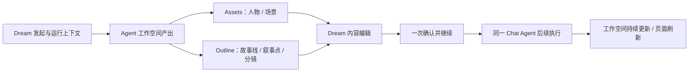
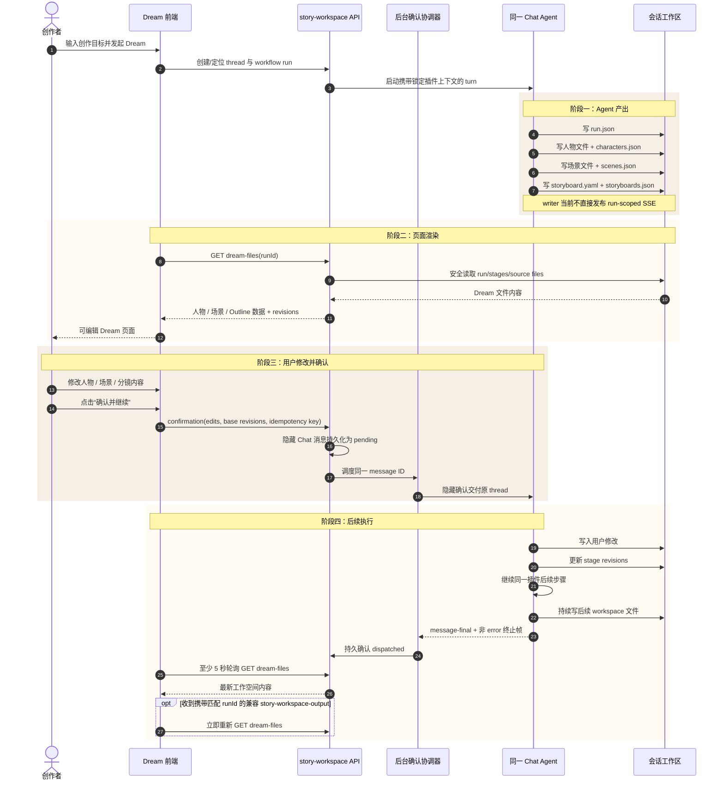
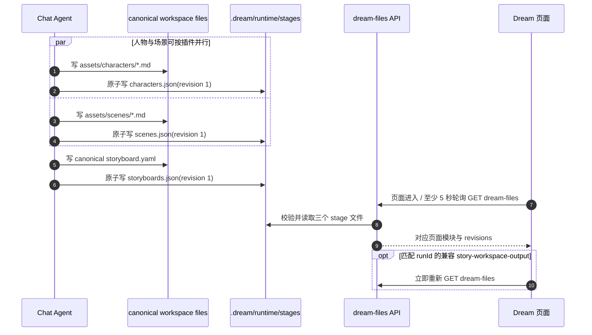
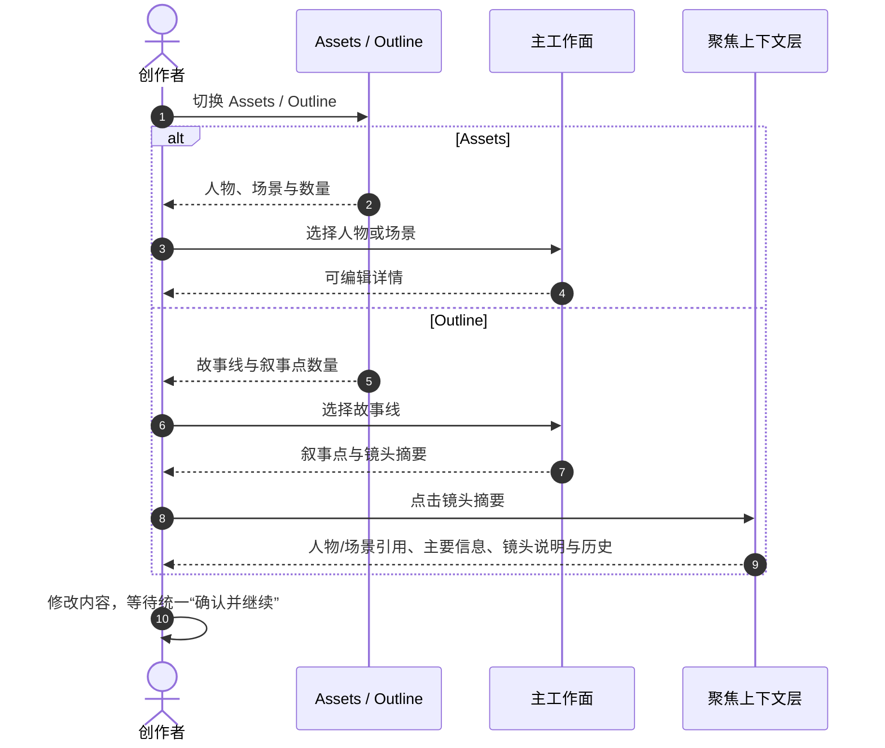

# design_007：Dream 业务功能模块与四阶段交互设计

> **Design ID**：`design_007_dream-business-module-interaction`
> **状态**：主体已实现；初始发起接线与丰富 Outline 结构字段仍按任务三记录为遗留
> **更新日期**：2026-08-04
> **唯一调研来源**：[调研Dreem_app平台.pdf](./调研Dreem_app平台.pdf) 第 3～8 页
> **视觉约束**：[Ink & Memory UI Design v2.pdf](../../prd/Ink%20%26%20Memory%20UI%20Design%20v2.pdf) 第 4～5 页
> **文件协议 owner**：[design_006](./design_006_dream-protocol-dir-mapping.md)
> **代码现状与缺口**：[design_005](./design_005_dream-module-dataflow-and-sequence.md)

## 0. 业务模型

Dream 只有一条主生命周期：

```text
Agent 产出 → 页面渲染 → 用户修改并确认 → 同一 Chat Agent 后续执行
```

“用户审阅确认”不是逐项审批：

- 用户在 Dream 页面查看 Agent 写入工作空间的人物、场景和分镜内容；
- 用户只修改需要调整的内容；
- 页面只提供一次主操作“确认并继续”；
- 确认后把修改和确认命令交回发起该 Dream 的同一 Chat thread；
- 同一 Chat Agent 写入修改，然后按插件流程继续后续执行。

本文不设计驳回、失败、重试或归档分支，也不设计后续执行后的第二次确认。

## 1. 调研证据与适配

### 1.1 PDF 第 3～8 页

| 页码 | 调研事实 | Ink-Dream 采用 | 排除 |
|---|---|---|---|
| 第 3 页 | Script Review 页面允许用户检查/修改；底部 `Confirm & Generate World` 只确认一次，随后后台 Agent 启动自动化创作 | “修改 → 确认并继续 → 同一 Agent 后续执行”主链 | 逐项审批和多次 Gate |
| 第 3 页 | 创作者协作页面由数据/任务进度层与 Agent 指导组成 | Dream 显示 workspace 文件进度和 Agent 后续执行状态 | 复制截图视觉 |
| 第 4 页 | Assets / Outline；人物、地点和完整剧本入口 | 人物、场景、分镜/Outline 模块索引 | World Builder、三视图编辑 |
| 第 5 页 | 用户确认后 Agent 按剧本继续扩展 | 确认后 Chat Agent 继续插件步骤 | 上传、自建资产 |
| 第 6 页 | 左侧故事线定位叙事点；点击镜头文稿进入协作窗口 | Outline → 故事线 → 叙事点 → 镜头摘要的定位动线 | 黑色无限画布、外部模型 |
| 第 7 页 | 协作窗口展示人物、主要信息、镜头说明与历史 | 后续执行页显示结构化上下文和工作空间更新 | 视频预览、上传、播放器 |
| 第 8 页 | 特殊镜头包含决策控件 | 只读显示插件写入的结构化决策元信息 | 可编辑控件画布、计费积分 |

### 1.2 两层交互深度

PDF 的“两层”不是固定两列布局：

1. **数据与任务层**：Assets / Outline、人物/场景/故事线、Agent 工作空间写入进度；
2. **聚焦上下文层**：从叙事点或镜头摘要进入，查看当前项人物、场景、说明和历史。

审阅阶段可以保留三栏骨架；后续执行不能强制为常驻三栏，也不能把“两层”误画成静态双栏。

## 2. 参与者

| 参与者 | 业务职责 |
|---|---|
| 创作者 | 查看、修改 Dream 内容；一次确认并继续 |
| Dream 前端 | 读取 Agent 写入的 Dream 文件、保存本地编辑草稿、提交确认命令 |
| story-workspace API | 安全读取工作空间文件；把确认命令作为隐藏消息注入原 thread |
| 同一 Chat Agent | 按插件步骤写人物/场景/分镜文件和 `.dream` 描述；确认后写入用户修改并继续 |
| Deck 插件 | 定义 Agent 的文件路径、阶段顺序和后续执行步骤 |

## 3. 业务功能模块



| 模块 | 输入 | 用户动作 | 输出 |
|---|---|---|---|
| Dream 发起 | Deck 插件、thread、run context | 输入创作目标并发起 | Chat Agent 开始写 workspace |
| Agent 工作空间产出 | canonical 文件 + `.dream/runtime` stage 文件 | 查看已出现模块 | 人物/场景/分镜页面逐步出现 |
| Assets | characters/scenes stage 描述与 source files | 查看和修改人物、场景 | 前端本地编辑草稿 |
| Outline | storyboards stage 描述与 source files | 选择故事线、叙事点和镜头摘要并修改 | 前端本地编辑草稿 |
| 一次确认 | 所有 required stages + base revisions + 用户修改 | 点击“确认并继续” | 隐藏 Chat 确认消息 |
| 后续执行 | 原 thread、锁定插件上下文、确认修改 | 查看 Agent 持续写入结果 | stage revision 更新与页面刷新 |

## 4. 四阶段生命周期

### 4.1 Agent 产出

**进入**：Dream 已发起，Chat Agent 获得 thread、`workflow_run_id` 与锁定插件上下文。

**Agent 文件动作**：

1. 写 `.dream/runtime/runs/<run_id>/run.json`；
2. 写人物 canonical 文件，完成后原子写 `stages/characters.json`；
3. 写场景 canonical 文件，完成后原子写 `stages/scenes.json`；
4. 写 canonical `stories/<project>/episodes/EP??/storyboard.yaml`，完成后原子写 `stages/storyboards.json`；
5. writer 不直接发布 run-scoped SSE；页面以至少 5 秒 REST 轮询发现 revisions。若既有链路恰好发出携带匹配 `runId` 的 `story-workspace-output`，页面可提前重新读取。

stage 文件不存在表示该模块还在等待 Agent；stage 文件存在且有效表示页面可渲染。不设计额外的 generating/validating/failed 状态。

### 4.2 页面渲染

**触发**：页面进入 Dream、至少 5 秒 REST 轮询、收到携带匹配 `runId` 的兼容 `story-workspace-output`，或用户主动刷新。

**页面动作**：

1. GET 当前 run 的 `dream-files`；
2. 显示 run 已声明但尚无 stage 文件的模块为“等待 Agent 写入”；
3. 对已存在 stage 加载人物、场景或 Outline/分镜内容；
4. 记录各 stage revision，作为用户确认时的 base revisions；
5. 允许用户修改可编辑字段，修改暂存在页面本地草稿。

页面不直接读写 workspace，不使用 review_status。

### 4.3 用户修改并确认

**用户动作**：查看整份 Dream，修改人物、场景、叙事点或镜头说明，最后点击一次“确认并继续”。

**页面门槛**：

- required stage 文件全部存在；
- base revisions 仍与服务端最新版本一致；
- 本地字段通过基础格式校验；
- 确认命令具有幂等键。

**确认结果**：story-workspace 把修改和确认作为唯一隐藏 Chat 消息持久化到原 thread；后台确认协调器透明交付给同一 Agent，页面刷新后也不会要求用户再次提交。没有逐项确认、批量确认、驳回或再次审批。

### 4.4 同一 Chat Agent 后续执行

Chat Agent 收到确认命令后：

1. 将用户修改写入对应 canonical workspace 文件；
2. 原子提高受影响的 `.dream` stage revisions；
3. 按同一 Deck 插件、runtime snapshot 和 plugin lock 继续后续步骤；
4. 后续写入仍通过 workspace 文件 + stage revision 通知页面刷新。

后续执行不再进入驳回、失败或第二次确认设计；页面只展示 Agent 持续写入的工作空间结果。

## 5. 端到端业务交互时序图

### 5.1 四阶段主时序



### 5.2 Agent 文件写入与页面出现时序



### 5.3 Assets / Outline 业务导航时序



该导航时序对应 PDF 第 4 页 Assets/Outline、第 6 页故事线定位和镜头点击、第 7 页聚焦协作；不复制视频、上传和播放器。

## 6. 页面交互规格

### 6.1 Dream 发起页

| 状态 | 页面内容 | 主操作 |
|---|---|---|
| 无 run | Deck 工作流与创作目标 | 发起 Dream |
| 有 run、stage 未齐 | Agent 工作空间写入进度；已存在模块可先查看 | 等待 Agent |
| required stages 已齐 | 完整 Dream 草稿、可编辑内容、base revisions | 确认并继续 |
| 已确认 | 后续执行进度与最新工作空间内容 | 查看执行内容 |

### 6.2 人物与场景

- 人物：名称、摘要、关系和插件提供的结构化字段；用户可修改允许字段。
- 场景：名称、描述、关联人物和故事引用；不提供场景布局画布。
- 页面修改只保存在本地草稿，统一确认时交给 Chat Agent 写入。

### 6.3 Outline / 分镜

- Outline 索引显示故事线与叙事点数量。
- 主工作面显示叙事点分组、镜头摘要和人物/场景引用。
- 点击镜头摘要进入聚焦上下文层，显示主要信息、结构化镜头说明和历史。
- 决策控件只读显示；不提供拖放编辑、模型选择或视频预览。

### 6.4 确认条

确认条固定展示：

- 已加载的 required stages；
- 当前 stage revisions；
- 用户修改数量；
- 唯一主操作“确认并继续”。

点击后按钮进入提交中并防止重复；幂等成功后页面切换到“Agent 正在继续”。不显示“确认此项”“驳回”“重试”或“归档”。

### 6.5 后续执行

- 第一层为 Assets / Outline 索引和当前叙事点/步骤主工作面。
- 第二层为选中项聚焦上下文层，不是常驻审阅右栏。
- 页面只展示 Chat Agent 继续写入的 workspace 内容和 revision 更新。
- 本设计到此结束，不定义后续执行后的审批或异常分支。

> **2026-08-04 任务三实现注记**：Assets / Outline、叙事主工作面与聚焦层已落地；
> 当前 `dream-stage/v1.items` 只提供名称、摘要、关系与来源文件，因此故事线分组、
> 多镜头结构说明和带时间历史仍是字段级占位，不得把现有通用摘要渲染描述为完整实现。

## 7. 页面状态

| UI 状态 | 来源 | 页面表现 |
|---|---|---|
| `story-workspace-dream-waiting-files` | required stage 文件未齐 | 等待 Agent；已存在模块可查看 |
| `story-workspace-dream-editing` | stage 文件已齐，尚未确认 | 可编辑 Dream 内容；显示确认条 |
| `story-workspace-dream-confirming` | 确认命令提交中 | 禁止重复点击 |
| `story-workspace-dream-continuing` | 确认已持久化，协调器交付或 Agent 继续 | 锁定确认动作并刷新 revisions |
| `story-workspace-dream-completed` | 插件后续步骤结束 | 只读展示最终工作空间结果 |

不定义 rejected、failed、retrying 或 archived 页面状态。

Dream 路由顶部上下文固定显示“Dream 协作中”，不直接显示底层 `WorkflowRun.status`。协调器未观察到 `message-final` 与非 error 终止帧时，隐藏确认继续保持 pending，并在基础设施内部按 message ID 指数退避自动协调；这不是页面的失败、重试或驳回业务分支。

## 8. 视觉规范

调研 PDF 只提供业务动线；视觉服从 UI Design v2 第 4～5 页：

- Warm Canvas `#F6EFE5` 页面背景、Paper Cream `#FFFAF2` 轻纸面；
- Charcoal Brown 标题、Body Brown 正文、Action Brown 主操作；
- 少面板、多留白，依靠字号、字重和行分隔建立层级；
- 页面级最多一条 Border Paper 虚线边界；普通条目静止时无阴影、外框卡片或深色底；
- 不复制 Dreem 黑底画布、橙色按钮、视频画面和卡片堆叠。

## 9. 本期不做

- 逐项确认、批量确认或 Review Gate 聚合；
- 驳回、失败、重试或归档流程；
- 后续执行后的第二次确认；
- 用户手动新建人物、场景、故事或分镜；
- 视频、上传、播放器和外部模型选择；
- 可编辑故事板/时间线/交互控件画布；
- World Builder、人物三视图、计费积分；
- 移动端、平板端和触控布局；
- 浏览器直接读写工作区；
- 把 G1/G3/G6、writer 主动 run-scoped SSE 或丰富 Outline 字段描述为当前已实现。

## 10. 验收清单

- [x] PDF 第 3 页的“修改 → 一次确认 → Agent 后续执行”成为唯一主链。
- [x] PDF 第 4～7 页的 Assets/Outline、故事线定位、镜头点击和聚焦上下文有对应模块时序。
- [x] 四阶段分别写明参与者、文件动作、页面动作和退出条件。
- [x] 人物、场景、分镜 canonical 文件完成后，Agent 更新对应 `.dream` stage 文件并使页面出现。
- [x] 页面允许用户修改内容，但只有一个“确认并继续”；刷新后不再出现第二次确认。
- [x] 确认命令回到原 Chat thread，由同一 Agent 写入修改并继续。
- [x] 后续执行只描述 workspace 持续写入和页面刷新。
- [x] 文档没有驳回、失败、重试、归档或第二次确认业务分支。
- [x] 执行两层是交互深度，不是固定第三栏或静态双栏。
- [x] UI 服从暖纸、轻纸面和无卡片约束。
- [x] G5 已实现；G1/G3/G6、writer 主动 SSE 与丰富 Outline 字段仍明确为遗留/占位。

## 11. 变更记录

| 日期 | 内容 |
|---|---|
| 2026-08-04 | 最终用户修订：建立 Agent workspace 文件驱动的 Dream 四阶段；用户修改后一次确认，同一 Chat Agent 继续；补主时序、文件写入时序和 Assets/Outline 导航时序；不设计驳回、失败、重试或归档 |
| 2026-08-04 | 任务三实现校准：持久确认事实恢复单次生命周期；REST 轮询保证更新，匹配 run 的兼容事件仅作加速；Dream 路由与旧审阅面板隔离 |
