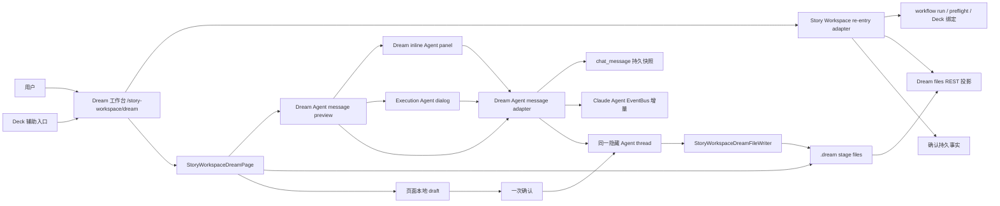
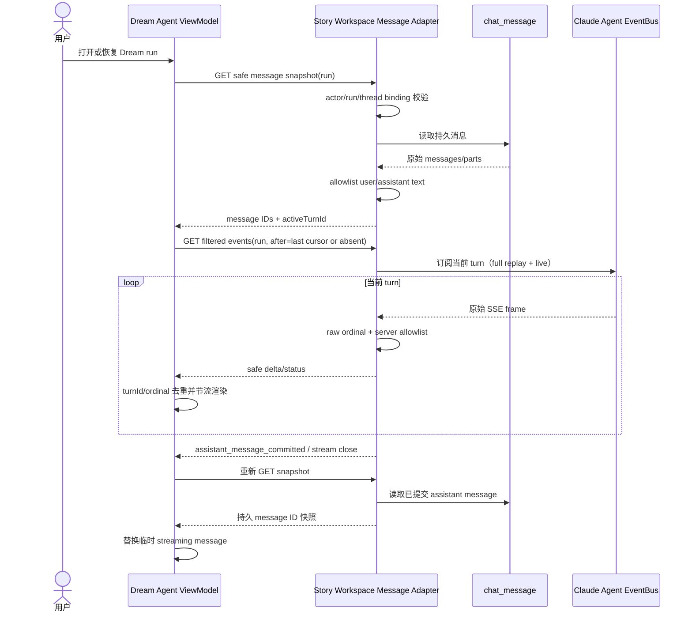
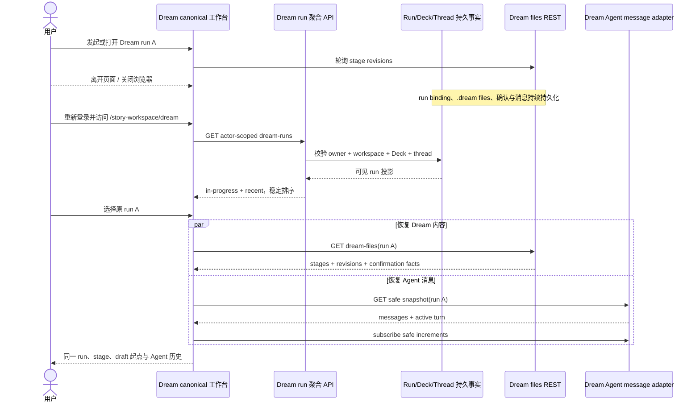
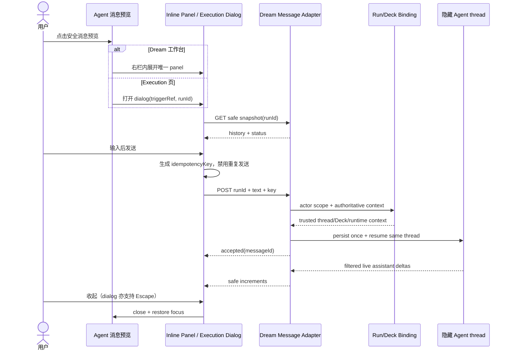
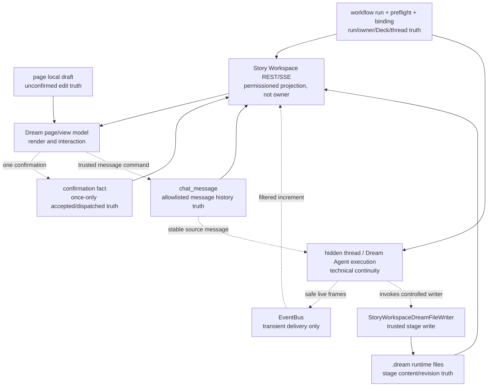

# Dream 可恢复入口与 Dream Agent 工作台交互设计

> Design ID：`design_008`  
> 日期：2026-08-05  
> 状态：2026-08-05 交互返工复审通过
> 前置裁决：`2026-08-05-dream-reentry-agent-workbench-task1-problem-decision-record.md`  
> 关系：本设计增量修订 `story-workspace-layout-design.md` 中 Dream route 顶部 Workflow Context 的归属，不改变 `design_006` 的 `.dream` 文件合同，也不改变 `design_007` 的四阶段与一次确认业务合同。

## 1. 背景、目标和非目标

### 1.1 背景

Dream 已能通过独立 adapter 发起同一个 Dream Agent，依次写入 run、人物、场景和分镜文件；页面根据 `.dream` stage revisions 渐进渲染，用户修改后只确认一次，再由同一 Dream Agent 继续。现有缺口不是内容生成，而是三个连续性问题：

1. 用户不知道 run ID 时，无法从后端持久事实重新发现正在生成或等待确认的 Dream；
2. Deck/workflow/run/status 仍由顶部通用 WorkflowContextBar 持有，Dream 页面右侧只有一句活动文案；
3. 通用 Claude Agent 快照与 SSE 含完整消息 parts，不能直接作为 Dream 用户可见的实时消息合同。

现状证据：

- Dream launch 当前只列 Deck 并发起新 run，成功后跳转 `?run=`（`frontend/src/components/story-workspace/dream/StoryWorkspaceDreamLaunch.tsx:30-69`）。
- Dream canonical route 和 query deep link 已存在（`frontend/src/router/storyWorkspacePath.ts:20-25,142-157`）。
- layout 顶部当前直接挂载 WorkflowContextBar（`frontend/src/components/story-workspace/StoryWorkspaceLayout.tsx:71-75`）。
- Dream 页面右上活动区默认仅显示“读取 Agent 工作空间”（`frontend/src/pages/story-workspace/StoryWorkspaceDreamPage.tsx:131,290-299`）。
- 通用消息持久化含 reasoning 和工具输入/输出（`backend/claude_agent/service.py:2035-2100`），Dream 不能在浏览器侧才过滤。
- `.dream` stage 目前由 REST polling 保证更新（`frontend/src/hooks/story-workspace/useStoryWorkspaceDreamFiles.ts:192-240,297-350`）。

### 1.2 目标

- 建立 `/story-workspace/dream` 唯一可恢复入口；覆盖离开、刷新、关闭浏览器、重新登录和多 run。
- 把 Dream route 的 workflow 上下文迁入右侧 Dream Agent 区域，与消息预览形成一个 owner。
- 建立 Dream 专属安全消息 adapter，实现持久快照、实时增量、重连去重和终态对账。
- 建立像 Dream 工作台延伸的交互层：Dream 编辑工作台在右栏内展开，execution 详情页使用悬浮 dialog；两者都在同一 run 绑定的隐藏 Agent thread 上继续对话。
- 保持 `.dream` stage、Agent message、隐藏 thread 和页面 local draft 的职责分离。

### 1.3 非目标

- 不把 Dream 改造成 Chat 页面，不挂载 `ChatView`；
- 不展示模型隐藏推理、凭证、敏感工具参数或原始调试事件；
- 不新增业务驳回、失败、人工重试或归档状态；
- 不引入画布式编辑器、视频制作或通用聊天中心；
- 不使用 localStorage 恢复 run/thread；
- 不用 Agent message 替代 `.dream` stage truth。

## 2. canonical re-entry 信息架构

### 2.1 唯一入口

`/story-workspace/dream` 是 Dream 的唯一 canonical re-entry。它是 Dream 工作台首页，不再等同于“新建 Dream”。

```text
/story-workspace/dream
├── 进行中的 Dream
│   ├── Dream Agent 正在创作
│   ├── 等待你修改并确认
│   └── Dream Agent 正在继续
├── 最近的 Dream
└── 发起新的 Dream
```

页面只消费 actor-scoped 后端聚合。localStorage 只可继续保存纯视觉偏好，例如侧栏折叠，不参与 run/thread 发现；现有 router 的 localStorage 也仅存侧栏折叠（`frontend/src/router/story-workspace.tsx:57-72`）。

### 2.2 deep link 与辅助入口

| 入口 | 定位 | owner | 降级 |
|---|---|---|---|
| `/story-workspace/dream` | Dream 工作台首页 | 唯一业务 owner | 聚合失败显示技术诊断提示，不制造失败 run 状态 |
| `/story-workspace/dream?run=<id>` | 同页选中指定 run | 仍是 Dream 工作台 | 404/403 式不可见后移除 query，回到安全列表 |
| `/story-workspace/runs/<id>` | 可选兼容链接 | 无状态 owner | 302/前端 replace 到 `dream?run=` |
| Deck“继续 Dream” | 辅助导航 | Deck 不持有 Dream 状态 | 导航 canonical href；无 run 时打开工作台并预选 Deck |
| `/runs/<id>/execution` | 既有执行详情 | 执行页 owner | 不承担 Dream re-entry |

现有 deep-link hook 已按 actor 读取并在无权/不存在时安全回退（`frontend/src/hooks/story-workspace/useRunDeepLink.ts:38-58,119-162`）；本设计只增加可发现入口，不创建第二套选择逻辑。

## 3. Dream 首页 / 工作台入口结构

### 3.1 列表分组

后端返回经过 actor/workspace/run/Deck/thread 校验的投影，前端按服务端已给出的 `group` 与 `sortKey` 渲染，不重新推导生命周期。

| 组 | 投影条件 | 主文案 | 主操作 |
|---|---|---|---|
| `in_progress / generating` | confirmation 未 accepted，且 required stage 未齐或 initial live turn 尚在输出 | Dream Agent 正在创作 | 进入工作台 |
| `in_progress / waiting_confirmation` | confirmation 未 accepted、stages 齐且 initial live turn 已结束 | 等待你修改并确认 | 继续修改 |
| `in_progress / continuing` | confirmation 已 accepted，且未 dispatched 或同 run 有 continuation live turn | Dream Agent 正在继续 | 查看进度 |
| `recent` | dispatched 且没有 live turn | 最近完成本轮输出 | 再次打开 |

“recent”只是列表分组，不是归档状态。它不改变 run 可访问性，也不引入归档动作。

### 3.2 稳定排序与选择

- 分组顺序固定：generating → waiting_confirmation → continuing → recent。
- 组内按 `lastActivityAt DESC, createdAt DESC, storyWorkspaceRunId ASC`。
- `lastActivityAt` 由服务端综合 thread 更新时间、stage revision/file time 与 run 创建时间；字段是投影，事实仍归各 owner。
- 没有 query 且只有一个 in-progress run：该项获得视觉主提示，但不自动进入，避免刷新时意外改变上下文。
- 多个 run：始终由用户选择；不以“最后浏览”或 localStorage 猜选。
- query run：通过权限与绑定校验后直接打开；它不改变列表排序。

### 3.3 空态与技术异常

- 无 run：显示简短说明和 Deck 发起列表。
- 列表加载失败：保留“发起新的 Dream”，显示“暂时无法恢复 Dream 列表，请稍后重新打开”；这是技术诊断表现，不写入 run status，不出现“重试任务”业务按钮。
- 单项 stage 投影暂时不可读：该项仍可从 durable run 聚合出现，状态文案保持“正在恢复 Dream 内容”，不显示业务失败。

### 3.4 入口页降噪与工作台返回

- Dream 入口页只保留一句“Dream 会逐步写入人物、场景与分镜”；不再展示四步生命周期说明块。
- 从最近 Dream 清单进入 `?run=` 后，工作台左上角必须提供“返回 Dream 工作台”，回到 canonical 清单页，不依赖浏览器历史是否完整。

### 3.5 Story Workspace 主导航

| 导航 | 目标 | owner |
|---|---|---|
| Dream | `/story-workspace/dream` | 展示 actor-scoped 进行中/最近 Dream 清单与发起入口 |
| Decks | `/story-workspace/decks` | 保留 Story Workspace layout/sidebar，主内容直接挂载 App 注入的现有 `DeckManager`；不切换到全局 `decks` view，不复制第二个 Deck 页面 |
| 订阅 | `/story-workspace/subscription` | 三列 Free / Dream / is Dreaming 说明；未接通计费前不发起请求、不修改权限 |

旧“故事管理 / 角色管理 / 场景管理”不再占据主导航。为保护既有 stage deep link 与兼容路由，其底层 route 可保留，但不再作为产品级主入口。

侧栏 footer 在“设置”上方增加主题切换。它必须复用 `utils/theme.ts` 的 `getTheme / toggleTheme / onThemeChange`，与 TopNavBar 共享同一主题 owner；不新建 localStorage key。折叠态保留图标与动态 `aria-label/title`。

## 4. 业务模块关系图



边界：Dream 页只通过 Story Workspace adapters 访问 re-entry、Dream files 和安全消息；通用 Chat UI 不进入模块图。

## 5. 右侧 Dream Agent 区域布局

### 5.1 区域组成

桌面端 Dream 页面保留现有三块工作面：stage navigation、内容预览、右侧编辑。右栏收起时显示 Agent rail 与当前内容编辑器；展开时由 Dream Agent 完整历史/输入区替换编辑器区域，不叠加悬浮窗：

1. `Agent context line`：Deck、workflow、版本、短 run ID；
2. `Agent status line`：状态点、当前安全状态；
3. `Message preview`：最近一至三条 assistant text；
4. `Open trigger`：工作台 masthead 右上角和 rail 都显示同一条最新安全 assistant/streaming 预览，整块可点击；
5. 收起态下为当前 stage 编辑器；
6. 展开态下为同 run 的 Dream Agent 历史、实时输出与输入，只保留一个面板 owner。

上下文与消息来自一个 `StoryWorkspaceDreamAgentViewModel`。masthead 预览、rail 和展开面板只是同一 view model 的不同投影。编辑器继续消费 Dream files/local draft，不共享消息 reducer。

### 5.2 展示层级

| 层级 | 字段 | 默认表现 |
|---|---|---|
| L1 | Deck display name、workflow display name、locked version | 一行小标题，允许截断 |
| L2 | Dream Agent projected status、unread | 最强状态信息 |
| L3 | current stage、stage revisions、short run ID | 次要 metadata 行 |
| L4 | full run ID、runtime snapshot/lock IDs | 展开“技术详情”后显示；不显示路径/secret/thread 产品概念 |

## 6. WorkflowContextBar 信息迁移表

| 既有字段/动作 | Dream route 新归属 | 处理 | 理由 |
|---|---|---|---|
| workflow name/summary | Agent rail L1 | 迁移 | 属于当前 Dream Agent 上下文 |
| Deck name/version | Agent rail L1 | 迁移 | 与可信 run binding 一起展示 |
| run ID | rail L3/L4 | 迁移并分短/完整 | 不占据全局导航 |
| stage/revisions | rail L3 | 新增 | 比 legacy run status 更接近 Dream 事实 |
| Dream Agent status | rail L2 | 迁移并改为投影态 | 不直接暴露 legacy WorkflowRun.status |
| runtime snapshot/lock | rail L4 | 迁移到技术详情 | 对普通用户降噪 |
| 改 workflow/配置 | Dream launch / Deck 模块 | 不进入当前 run rail | 当前 run binding 已锁定 |
| 开始 run | Dream launch | 不进入 rail | 新建与恢复分离 |
| cancel/retry/review | 无 | Dream route 删除 | 本期禁止相应业务状态 |
| 全局导航/页面标题 | StoryWorkspaceLayout | 保留顶部 | 属于全局页面层级 |

Dream route 不再向 `StoryWorkspaceLayout` 传完整 WorkflowContextBar；非 Dream route 可继续使用它。旧组件已有 cancel/retry/review 分支（`frontend/src/components/story-workspace/workflow/WorkflowContextBar.tsx:82-109`），因此不能整体移动。

## 7. 收起态消息预览

### 7.1 内容

- Dream Agent 状态点与一行状态；
- 最近一至三条 allowlisted assistant text，按视觉容器截断，不修改持久内容；
- 有新消息且 Agent 交互层未打开时显示低干扰未读点和“有新回复”；
- streaming 时以节流后的 text buffer 替换最后一条临时预览；
- 没有 assistant text 时显示与 lifecycle 对应的安全占位，不显示原始运行事件。

### 7.2 未读规则

- `lastSeenMessageId` 只属于当前页面会话的 UI 状态，不参与恢复真相；刷新后可保守视为未读。
- 内嵌 panel 或 execution dialog 打开且消息区域可见时清零未读。
- status keepalive、stage revision 和用户自己的消息不增加 assistant 未读数。
- 不需要新增数据库 DDL；本期不承诺跨设备同步已读状态。

## 8. 展开态：Dream 内嵌面板与 execution 悬浮层

### 8.1 内容结构

```text
Dream Agent                                  [收起]
Drama Forge 1.4 · Dream · Run …7A31
──────────────────────────────────────────────
消息历史（只含安全 user/assistant text）
…
Dream Agent 正在输出…
                                  [前往最新消息]
──────────────────────────────────────────────
给 Dream Agent 留言…
[多行输入]                              [发送]
```

当服务器投影一个待用户决策的工具请求时，输入区原位替换为 Dream 专属“编辑校样条”：只显示 allowlist 后的工具名、公开问题选项或网络 host/policy 摘要，以及允许/取消操作。它不显示原始工具 input/output、命令正文、凭证、隐藏推理或调试事件。

同一 turn 可连续出现多个确认请求。view model 以 `toolCallId` 去重并按 SSE 到达顺序排队，一次只显示队首；resolved 只移除对应项，不得以单值状态覆盖更早请求。AskUser 的原始 question ID 不进入公开合同；服务端按投影顺序生成不透明 `qN`，answers 只使用该 `qN` 作为 key，选项值必须属于当前公开 projection。服务端验证后再把 `qN` 映射回 runner 所需的问题文本。

展开层不提供 Chat 导航、thread 新建、模型选择、通用工具详情流、推理折叠、失败重试、业务驳回或归档。

### 8.2 surface 分流

| surface | 点击预览后 | 理由 |
|---|---|---|
| `/story-workspace/dream?run=...` | 在“Dream 内容编辑器”右栏内展开 `StoryWorkspaceDreamAgentPanel`，替换当前编辑表单 | 这里本身是 Dream 工作台，Agent 交互是同一纸面的延伸 |
| `/story-workspace/runs/{runId}/execution` | 打开 `StoryWorkspaceDreamAgentDialog` | execution 已有独立内容聚焦层，悬浮层避免替换执行结果 |

Dream 页不同时 mount 内嵌 panel 和 dialog；窄屏也只允许一个 panel 实例，避免重复 `aria-live`、重复已读副作用或输入 draft 分叉。

### 8.3 交互

- 点击 masthead/rail 的实时消息预览展开；点击收起关闭。execution dialog 额外支持 Escape。
- 打开时记录触发元素，关闭后恢复焦点。
- Enter 发送，Shift+Enter 换行；空白内容不可发送。
- 首次打开以及新 assistant 消息、streaming 增量到达时，若用户距底部不超过 120px，消息区自动跟随最新内容；成功发送属于显式继续对话操作，无论发送前阅读位置如何，都保持跟随直到新消息真正抵达底部。
- 用户主动上滚超过 120px 后暂停自动跟随，不抢夺阅读位置；显示“前往最新消息”按钮。点击按钮滚到底部并恢复自动跟随。
- 单次 send 生成稳定 idempotency key；首次 dispatch 未决时同 key 重复触发不得再次发送。
- 服务器返回 busy 时保留 draft，并显示“Dream Agent 正在处理上一条消息”；不是失败态，不提供人工重试工作流。
- 工具确认 409/422/网络失败时保留当前队首与已填答案，在校样条内以 `role=status` 显示技术恢复提示；不新增业务失败或人工重试状态。
- Agent 输入 draft 与 Dream stage editor draft 分属不同 state slice，互不覆盖。

消息历史在所有 lifecycle 均可打开，但自由输入遵循一次确认门禁：

| lifecycle | 输入 | 原因/文案 |
|---|---|---|
| `generating` | 禁用 | “Dream Agent 正在完成初始创作” |
| `waiting_confirmation` | 禁用 | “请先在页面修改并确认；留言不会代替确认” |
| `confirming` | 禁用 | “正在保存本次确认” |
| `continuing` | 禁用 | “Dream Agent 正在根据已确认内容继续” |
| `recent` 且 confirmation dispatched | 启用 | 允许在同一 run/thread 上提出后续指令 |

前端禁用只用于体验；POST endpoint 必须重新读取 durable confirmation 与 live-turn 事实，仅在 `recent + dispatched + no live turn` 时接受。其他阶段返回 409 `DREAM_AGENT_MESSAGE_NOT_READY`，不持久消息、不调用 writer、不启动 Agent turn。由此，自由输入不能替代一次确认，也不能在等待确认时绕过 stage draft/confirmation 合同。

## 9. Agent 快照加载与实时消息订阅

### 9.1 快照合同

`GET /api/story-workspace/workflow-runs/{run_id}/dream-agent/messages`

```ts
interface StoryWorkspaceDreamAgentMessageSnapshot {
  storyWorkspaceRunId: string;
  lifecycle: "idle" | "streaming";
  activeTurnId: string | null;
  canSend: boolean;
  sendBlockReason: "generating" | "waiting_confirmation" | "confirming" | "continuing" | "busy" | null;
  messages: StoryWorkspaceDreamAgentMessage[];
  snapshotAt: string;
}

interface StoryWorkspaceDreamAgentMessage {
  id: string;
  role: "user" | "assistant";
  text: string;
  createdAt: string;
}
```

DTO 中的 `user` 仅允许 Dream widget 主动发送的文本；Dream launch 与 Dream confirmation 的隐藏 source user row 永不展示。`assistant` 仅在其来源元数据与当前 run、thread、actor 精确一致，且能关联到一条已持久化的 Dream launch、Dream confirmation 或 Dream widget source user row 时允许投影。普通系统、guidance、debug、未知 control 来源及其 assistant 输出一律排除；role、parts、metadata 不能原样透传。

### 9.2 增量合同

`GET /api/story-workspace/workflow-runs/{run_id}/dream-agent/events?after=<cursor>`

允许的 SSE：

```text
id: <turn_id>:<raw_event_ordinal>
event: assistant_text_delta
data: {"turnId":"…","delta":"…"}

event: assistant_message_committed
data: {"turnId":"…"}

event: status
data: {"lifecycle":"streaming|idle"}

event: tool_confirmation_requested
data: {"turnId":"…","confirmation":{"toolCallId":"…","kind":"approval|ask_user|sandbox_network","toolName":"…","questions":[…],"network":{"host":"…","policy":"allowlist|open|deny|unknown"}}}

event: tool_confirmation_resolved
data: {"turnId":"…","toolCallId":"…"}
```

工具确认事件由后端先做类型化安全投影：AskUser 只保留服务端生成的 `qN`、question/type/options 等公开字段，并对这些公开字符串再次执行敏感模式检查，命中凭证、危险命令或隐藏推理时整项 fail closed；规范小写 `run_<32hex>` 可作为普通业务标识展示，不得被通用高熵启发式误杀。网络请求只保留合法 host 与归一化 policy；普通审批只保留安全显示名。浏览器 adapter 再做严格 schema 校验，未知字段不会进入 view model。

待确认 registry 绑定可信的 actor/run/thread/turn/toolCall 五元上下文；同一 turn 的重叠 SSE 订阅按 actor/run/thread/turn 计租约。任一非终态订阅断开只释放自己的租约，最后一个订阅离开才清理；真实 terminal 事件可强制清理，避免多标签页或重连交叠使仍在显示的确认提前失效。

adapter 对每个原始 **data frame** 增加稳定 ordinal，再执行 allowlist；使用 raw ordinal 可让同一 turn 的完整 replay 在重连时得到相同 identity。过滤掉的 data frame 仍占 ordinal，SSE comment/keepalive、空行和 transport retry 指令不计数，避免网络空闲时长改变序号。待确认项以 `toolCallId` 去重，收到 resolved 或 terminal status 后清除。

snapshot 不声明 stream cursor：持久消息与瞬时 turn 是两个事实域。首次订阅没有 `after`，只对 `activeTurnId` 的完整 replay 做 view-model 去重；页面会话已有 cursor 时才传 `after=<turn_id>:<ordinal>`。cursor 只在相同 `activeTurnId` 内比较；turn 改变或 terminal snapshot reconciliation 后立即清空。

### 9.3 快照 + 增量订阅时序图



### 9.4 重连不重不漏

- 同一 EventSource 自动重连：浏览器传 Last-Event-ID；adapter 只在 turn ID 相同且 ordinal 合法时跳过 `<= after` 的 data frame。
- 重新创建 EventSource：view model 通过 query `after` 传最近 cursor。
- 首次订阅：不传 cursor，完整 replay 当前 active turn；message ID 与 `turnId + ordinal` 分域去重。
- terminal 前断线：bus replay 当前 turn 全历史；已见 ordinal 被过滤，未见 delta 继续追加。
- terminal 后断线：先重新取持久快照；持久 message ID 替换临时 turn message，然后仅订阅新的 active turn。
- 立即断开的连接按 500/1000/2000/4000/8000ms 退避；只有连接连续稳定 10 秒才重置退避，避免“每次刚 open 就清零”形成快速重连循环。
- 服务重启/内存 session 淘汰：快照仍为恢复真相；状态显示 idle，不把 `not_found` 暴露为业务失败。
- 任意 committed/finish 或异常断开后都做 snapshot reconciliation，防止“message-final 已发、DB 稍后持久化”的短窗口；现有服务的顺序正是先 `message-final`、再持久化、再 finish（`backend/claude_agent/service.py:1379-1406`）。

## 10. 退出、刷新、重新登录后的恢复流程

### 10.1 用户退出并重新进入的业务时序图



重新登录只需要用户身份；不能依赖上次浏览器 session 中的 run/thread 值。

## 11. 多 run 选择、所有权与 Deck 绑定

### 11.1 服务端查询范围

聚合查询必须从 authenticated actor 的 workspace 出发，连接：

`workflow_runs → workflow_preflights → Deck/plugin binding → source_voice_thread_id → chat_thread`

过滤条件至少包括：

- `workflow_runs.created_by == current_user.id`；
- workspace owner 是 current user；
- workflow definition/surface 是 Dream；
- run source thread 存在且属于 current user；
- thread Deck 与 preflight/locked Deck binding 一致；
- Dream runtime run.json（若已存在）的 run/thread/Deck binding 与 DB 事实一致。

单 run 的既有 gateway 已执行 run owner、workspace owner、thread owner 与工作目录校验（`backend/services/deck/story_workflow_gateway.py:195-221,735-785`）；聚合必须复用同等安全语义，批量查询不能放宽。

### 11.2 无权与错误 Deck

- 无权 run 与不存在 run 对客户端统一不可见；deep link 不透露 owner/Deck 差异。
- Deck 辅助入口只能传过滤意图，最终 run 列表仍由服务端 actor scope 生成。
- 客户端不得把 query 中的 Deck ID 当作授权依据。

## 12. Dream Agent 输入和可信上下文绑定

### 12.1 发送合同

`POST /api/story-workspace/workflow-runs/{run_id}/dream-agent/messages`

```ts
interface StoryWorkspaceDreamAgentMessageCommand {
  text: string;
  idempotencyKey: string;
}

interface StoryWorkspaceDreamAgentMessageAccepted {
  storyWorkspaceRunId: string;
  messageId: string;
  accepted: true;
}
```

客户端不提交 threadId、Deck ID、workspace path、plugin spec 或 runtime lock。服务端按 run 读取并校验：

1. authenticated actor/workspace；
2. run → source thread；
3. run → preflight/Deck/runtime snapshot/lock；
4. Dream adapter 与 frozen context；
5. `metadata.kind=story-workspace-dream-agent-user` 的持久消息；
6. 同 thread `resume=true` 的新 turn。

同 actor + run + idempotency key + text 返回同一 accepted；同 key 不同 text 返回 409 contract conflict。快速连击只产生一条持久 user message 和一次 dispatch。运行中的同 thread 不并发启动第二 turn。

该保证使用既有确认/launch 的持久 claim 形态，而不是依赖 `INSERT OR REPLACE`：

1. 以 `actor_id + run_id + idempotency_key` 计算确定性 `message_id` 与 command fingerprint。
2. 在 `BEGIN IMMEDIATE` 中先按确定性 ID 处理同 key replay：既有同 ID 同 fingerprint 返回原记录，不同 fingerprint 返回 409。
3. 同一事务再查询当前 run/thread 上其他 `story-workspace-dream-agent-user` 消息；只要存在其他 `pending` 或 fresh `dispatching` claim，就返回 busy 且不插入本次不同 key 消息。没有竞争者时才首次插入 fingerprint 与 `dispatch_status=pending`。该 run/thread 级 guard 关闭“两个不同 key 都先于 live status 通过”的窗口。
4. coordinator 在另一个 `BEGIN IMMEDIATE` 中把 pending/过期 claim 改为 `dispatching`，并再次确认同 run/thread 没有其他 fresh active lease，再写入 claim ID 与 lease；只有 claim owner 可以调用 transport。
5. 活跃 turn 持续续租；收到 `message-final + non-error finish` 后以 claim ID compare-and-set 为 `dispatched`。同一 message ID 在进程内 `_in_flight` 与 SQLite claim 两层去重。
6. transport 明确拒绝时释放为 pending，由基础设施协调器恢复；用户界面不出现人工重试。
7. 崩溃窗口采用“持久 pending/lease + at-least-once 调度、run/thread 单一 active lease”的恢复语义：存活的 dispatch 持续续租，只有进程死亡且 lease 过期才可重取。稳定 message ID 始终传入 Claude Agent request，禁止另建 user message。任务验收中的并发快速发送（同 key 或不同 key）必须严格只有一个 active dispatch；进程级灾难恢复的重复副作用风险作为技术诊断遗留记录，不虚构分布式 exactly-once。

既有 confirmation claim 已使用 `BEGIN IMMEDIATE`、claim ID、lease 和 compare-and-set（`backend/services/story_workspace/dream_confirmation_service.py:623-721,724-788`）；实现应抽取或按同一合同复用，不得改 `backend/database.py` 或新增 DDL。

### 12.2 点击预览并继续对话时序图



## 13. `.dream` writer 与 Agent message 的职责边界

### 13.1 truth ownership 图



### 13.2 规则

- stage 文件存在且 schema 有效，才表示人物/场景/分镜可渲染；Agent 文本说“已完成”不提高 revision。
- REST/SSE 都是投影和传输，不拥有内容。
- Agent message 更新只更新 message state，不调用 stage reducer，不覆盖 local draft。
- stage revision 到达且用户有 local draft 时沿用既有“工作空间有更新”冲突提示，不静默覆盖（`docs/design/story-workspace/story-workspace-layout-design.md:154-159`）。
- writer 主动 events 缺位时继续至少 5 秒 REST polling；兼容帧只用于提前 invalidate（`docs/architecture/术语表.md:49-51`）。

## 14. 页面状态与业务文案

| view state | 主文案 | rail 预览 | stage 行为 |
|---|---|---|---|
| `story-workspace-dream-restoring` | 正在恢复 Dream 工作台… | 加载骨架线 | 暂不编辑 |
| `story-workspace-dream-generating` | Dream Agent 正在创作 | 安全实时回复/等待输出 | 已到达 stage 可读，继续 REST polling |
| `story-workspace-dream-waiting-confirmation` | 等待你修改并确认 | 最近回复 | stage 可编辑，一次确认可用 |
| `story-workspace-dream-confirming` | 正在保存确认… | 消息仍可读，输入暂禁用 | 防重复确认 |
| `story-workspace-dream-continuing` | Dream Agent 正在根据已确认内容继续 | 安全实时回复 | stage 只读/按既有规则刷新 |
| `story-workspace-dream-recent` | Dream Agent 已完成本轮输出 | 最近回复，可继续留言 | 展示最新 revisions |

技术连接中断只在 rail 辅助行显示“正在恢复实时消息…”，同时保留持久快照；不得创建 `failed/retrying/archived/rejected` 业务 view state。

## 15. 响应式与无障碍规范

### 15.1 桌面端

- viewport ≥ 1180px：Dream Agent rail 常驻右栏顶部；点击后 inline panel 在同一右栏内替换编辑表单，不覆盖主内容与 sticky confirmation bar。
- execution dialog 右侧锚定，宽 `min(420px, calc(100vw - 32px))`，高 `min(720px, 70vh)`；其 bottom 高于 sticky bar 加 16px。
- 静止态无重阴影；inline panel 只用细分隔线，execution dialog 仅一层柔和边界/阴影。
- 打开时不锁主页面滚动；消息历史自身滚动，输入区保持可见。

### 15.2 窄屏

- viewport < 768px：Dream rail 收成一条消息预览触发器，位于 page masthead 后、stage navigation 前；展开后仍只 mount 一个 inline panel，在单列编辑区内显示。
- execution dialog 降级为底部 sheet/近全屏层，`inset: 8px`，高度 `min(88dvh, 760px)`；使用 `dvh` 避免软键盘遮住输入。
- 内容单列，不出现固定 420px 宽度或水平滚动。
- modal 时锁背景滚动并约束焦点。
- execution dialog 内的确认区使用内嵌 `region`，不得嵌套第二个 dialog；窄屏打开时将工作区背景分支设为 inert，并显示克制遮罩。

### 15.3 无障碍

- 触发区实现为 `button`，名称包含“打开 Dream Agent”；不能只给可点击 div。
- execution dialog 有 `role=dialog`、`aria-labelledby`；窄屏 modal 为 `aria-modal=true`。inline panel 使用命名 `section`，不伪装成 modal。
- 打开 execution dialog 后焦点进入标题或输入框；Escape 关闭；inline panel 点击收起关闭；两者关闭后都返回原触发按钮。
- Tab 顺序：收起 → 消息区可交互项 → 输入 → 发送；modal 内焦点循环。
- 新 assistant 消息的聚合容器 `aria-live=polite`、`aria-atomic=false`；流式 delta 以至少 500ms 节流，避免逐 token 朗读。
- status 不只依赖颜色；未读同时有文本/可访问名称。
- `prefers-reduced-motion` 下取消浮层位移动画，只保留瞬时显隐。

## 16. 桌面端与窄屏线框图

### 16.1 桌面端右栏与 surface 分流

```text
Warm Canvas #F6EFE5
┌──────────┬──────────────────────────────────┬────────────────────────┐
│ stage    │ Dream 内容工作面                  │ Dream Agent 右栏        │
│ nav      │                                  │ Drama Forge · Dream    │
│          │ 人物 / 场景 / 分镜                │ ● 正在创作 · Run …7A31 │
│          │                                  │ “我正在整理场景…”       │◄─ trigger/focus return
│          │                                  │ 打开后原位替换编辑器 │
│          │                                  │────────────────────────│
│          │                                  │ 当前 stage 编辑器       │
│          │                                  │                        │
├──────────┴──────────────────────────────────┴────────────────────────┤
│ revisions / 修改计数                              [确认并继续]       │◄─ 避让区
└─────────────────────────────────────────────────────────────────────┘
                                      ┌──────────────────────────────┐
                                      │ Execution · Dream Agent [收起] │
                                      │──────────────────────────────│
                                      │ 持久消息 + 实时输出           │
                                      │                              │
                                      │ aria-live="polite"           │
                                      │──────────────────────────────│
                                      │ 留言…                  [发送]│
                                      └──────────────────────────────┘
                                      ↑ bottom > confirmation bar + 16
```

### 16.2 窄屏降级

```text
┌────────────────────────────────────┐
│ Dream                              │
│ [● Dream Agent 正在创作 · 有新回复]│◄─ button / focus return
├────────────────────────────────────┤
│ stage 横向导航                      │
│ Dream 内容 / 编辑                   │
│                                    │
│                                    │
├────────────────────────────────────┤
│ revisions              [确认并继续]│
└────────────────────────────────────┘

Dream 页在单列编辑区原位展开唯一 inline panel。
以下 modal bottom sheet 仅用于 execution 页（8px inset, ≤ 88dvh）。
┌────────────────────────────────────┐
│ Dream Agent                [收起]  │◄─ Escape
│ Drama Forge · Run …7A31            │
├────────────────────────────────────┤
│ 消息历史                            │
│                                    │
│ 实时输出                            │
├────────────────────────────────────┤
│ 留言…                               │◄─ 软键盘安全区
│                             [发送] │
└────────────────────────────────────┘
背景滚动锁定 · modal focus trap · close 后焦点归还
```

## 17. API、前后端合同与组件边界

### 17.1 API 合同

| 方法 | path | 权威输入 | 输出/作用 |
|---|---|---|---|
| GET | `/api/story-workspace/dream-runs` | authenticated actor；可选 Deck filter 仅为查询条件 | actor-scoped run collection projection |
| GET | `/api/story-workspace/workflow-runs/{run_id}/dream-agent/messages` | path run + actor | safe persisted snapshot |
| GET | `/api/story-workspace/workflow-runs/{run_id}/dream-agent/events` | path run + actor + optional cursor | filtered SSE increment |
| POST | `/api/story-workspace/workflow-runs/{run_id}/dream-agent/messages` | path run + actor + text/key | persist once + dispatch same thread |
| POST | `/api/story-workspace/workflow-runs/{run_id}/dream-agent/tool-confirm` | path run + actor + toolCallId/decision/按公开 question.id 建立的 answers；Deck/thread 不由浏览器提交 | validate current public projection + resolve same active run/thread tool call |
| GET | 既有 `/workflow-runs/{run_id}/dream-files` | path run + actor | `.dream` stage/confirmation projection，继续保留 |

后端 Story Workspace DTO 只写入 `backend/story_workspace/contracts.py`；前端局部 DTO 只写入 `frontend/src/hooks/story-workspace/contracts.ts`。`backend/database.py` 不修改，不新增 DDL。

### 17.2 后端边界

```text
story_workspace/contracts.py
  → StoryWorkspace router
    → StoryWorkspaceDreamReentryService
    → StoryWorkspaceDreamAgentMessageService
       → StoryWorkspaceDreamAgentMessageCoordinator
         → chat_message persistent claim / Claude Agent transport
```

- re-entry service 只做安全聚合，不读取浏览器偏好。
- message service 负责 run/thread 权限解析、消息 allowlist、SSE normalization 与 lifecycle send gate。
- tool confirmation service 从授权 run 解析服务端持久 Deck/thread 绑定，并校验当前 active Dream turn 与 toolCallId；浏览器不能指定或改写 thread/Deck。
- message coordinator 负责确定性 message ID、`BEGIN IMMEDIATE` 持久 claim、lease/ack 与同 active dispatch 去重；不得使用裸 `INSERT OR REPLACE` 充当并发门禁。
- Claude Agent 原始 transport 不直接暴露给 Dream UI。

### 17.3 前端边界

```text
useStoryWorkspaceDreamRuns
useStoryWorkspaceDreamAgent
  → StoryWorkspaceDreamAgentViewModel
    → StoryWorkspaceDreamAgentRail
    → StoryWorkspaceDreamAgentPanel（Dream route inline）
    → StoryWorkspaceDreamAgentDialog（execution route floating）
StoryWorkspaceDreamPage
  → useStoryWorkspaceDreamFiles（stage truth）
  → local draft reducer（未确认编辑 truth）
App 已配置 DeckManager ReactNode
  → StoryWorkspaceRouter decksContent
    → /story-workspace/decks 主内容（保留 layout/sidebar）
```

message view model 与 dream files/local draft reducer 只能通过只读 run ID 对齐，不共享 message/stage mutation action。`decksContent` 只作为已有 DeckManager 的组合 seam，Router 不接管 voice engine 或 Deck 数据 owner。

## 18. 技术异常诊断边界

| 技术情况 | UI 表现 | 禁止扩展 |
|---|---|---|
| run 列表暂不可用 | 暂时无法恢复列表；保留新建入口 | 不写 failed run |
| SSE 断线 | 保留快照，显示“正在恢复实时消息…” | 不给人工 retry workflow |
| session 不在内存 | lifecycle idle，依赖持久快照 | 不显示 Agent 失败 |
| stage 文件尚未出现 | 等待 Dream Agent；继续 REST polling | 不把缺文件当业务失败 |
| deep link 无权/不存在 | 安全回到列表 | 不泄露 run/Deck 存在性 |
| send busy | 保留输入，说明正在处理上一条 | 不并发新 thread |

服务端仍可记录结构化日志、trace 和内部 error code用于诊断；这些不能成为 Dream 用户可见状态机。

## 19. 本期不做

- 将 Dream 改为 Chat 页面或挂载 `ChatView`/通用 ChatWidgetUI；
- 通用 thread 创建、thread 切换或聊天中心；
- reasoning、chain-of-thought、tool parameters/output、credential、debug event 展示；
- 业务驳回、失败、人工重试、归档或第二次确认；
- 画布式编辑器与视频制作；
- 跨设备未读同步；
- localStorage run/thread 恢复；
- writer 主动 run-scoped event（若仍缺位，继续 REST polling）；
- 修改 legacy WorkflowRun 全状态机或新增数据库 DDL。

## 20. 验收标准

### 20.1 重新进入

- [ ] 发起后离开，从 `/story-workspace/dream` 找到并打开相同 run。
- [ ] 刷新恢复相同 run 与 stage revisions。
- [ ] 重新登录通过服务端持久事实恢复；清空 localStorage 不影响。
- [ ] 外部用户、错误 Deck、篡改 thread/run 绑定均不可访问。
- [ ] 多 run 分组、稳定排序和显式选择符合 §3。

### 20.2 上下文与交互

- [ ] Dream route 顶部不再挂完整 WorkflowContextBar，右侧只有一个上下文/status owner。
- [ ] Deck/workflow/run/stage/revisions/status 层级符合 §5；编辑器仍可用。
- [ ] masthead/rail 显示状态、最近回复与未读；Dream 页点击在右栏打开唯一 inline panel，execution 页点击打开专属 dialog。
- [ ] panel/dialog 的 `aria-controls` 都指向实际唯一目标；关闭后归还焦点，dialog 支持 Escape。
- [ ] 初次打开和新回复在 near-bottom 时自动跟随；成功发送始终跟随到新对话；用户普通上滚后位置保持并出现“前往最新消息”，点击后恢复跟随。
- [ ] Story Workspace 侧栏为 Dream / Decks / 订阅；Decks 在 `/story-workspace/decks` 内直接显示已有 DeckManager，不卸载 layout/sidebar；主题切换位于设置上方且共享全局 theme owner。
- [ ] desktop/narrow viewport 无严重遮挡或溢出。
- [ ] 源码 import graph 与运行时 DOM 都不挂载 ChatView。

### 20.3 消息与 truth

- [ ] snapshot 先显示，实时增量随后追加；terminal 对账为持久 message ID。
- [ ] 断线前后不重复、不遗漏允许展示的消息。
- [ ] API payload/DOM 不含 reasoning、工具参数、凭证或 debug event。
- [ ] allowlist 工具确认在同一 Dream panel/dialog 内显示；提交只含 toolCallId/decision/公开 answers，不含 thread、Deck 或原始工具参数。
- [ ] 用户消息沿同一 run/thread 只 dispatch 一次；快速连续发送不重复。
- [ ] confirmation dispatched 前和任一 live turn 中，POST 被服务端门禁拒绝且不落消息；`recent + no live turn` 后才可发送。
- [ ] 并发同 key 只有一个 SQLite claim owner、一个 active dispatch 和一条持久 user message；崩溃恢复语义与 §12.1 一致。
- [ ] Agent message 不修改 stage revision，不覆盖未确认 local draft。
- [ ] `.dream` stage 更新仍由 Dream files REST 接口驱动。

### 20.4 边界

- [ ] 不出现 reject/fail/manual retry/archive 业务按钮或状态。
- [ ] `backend/database.py` 无 diff，无新增 DDL。
- [ ] 后端 pytest、前端 Playwright Node seam、`npx tsc -b`、改动文件 ESLint 全通过。
- [ ] 真实带 drama-forge Deck 的 E2E 保存 run ID、thread ID、数据库计数、截图和 trace。

## 21. 设计决策摘要

| ID | 决策 |
|---|---|
| DEC-034 | `/story-workspace/dream` 是唯一 canonical re-entry；query run 只定位同页 run |
| DEC-035 | actor-scoped Dream run 聚合是重新发现的唯一服务端入口，localStorage 不参与 |
| DEC-036 | Dream route 移除顶部完整 WorkflowContextBar；右侧 rail 是唯一上下文/status owner |
| DEC-037 | Dream Agent 消息使用服务端 allowlist 的 snapshot + filtered SSE + terminal reconciliation |
| DEC-038 | Dream 工作台使用右栏 inline panel，execution 页使用悬浮 dialog；两者共用 Dream 专属 adapter/view model，不挂 ChatView |
| DEC-039 | 用户发送只在 `recent + confirmation dispatched + no live turn` 开放；只提交 run path、text、idempotency key，并以持久 claim 解析可信 thread/Deck/context、去重 active dispatch |
| DEC-040 | `.dream` stage、message、EventBus、隐藏 thread、本地 draft 保持各自唯一 truth owner |
| DEC-041 | 技术异常不扩展为失败、重试、驳回或归档业务状态机 |
| DEC-042 | Story Workspace 主导航为 Dream / Decks / 订阅；Decks 以内部 route 组合已有 DeckManager，不切换全局 view |
| DEC-043 | 侧栏主题切换复用 `utils/theme.ts` 唯一 owner，不新建主题存储 |
| DEC-044 | Dream 消息区采用 120px near-bottom 跟随阈值；用户上滚时暂停并用“前往最新消息”显式恢复 |
| DEC-045 | 工具确认只经 Story Workspace 服务端安全投影进入 Dream 专属编辑校样条；确认仍绑定同一授权 run/thread，不复用 Chat UI |
| DEC-046 | AskUser 公开 question ID 由服务端生成不透明 `qN`；确认 registry 对重叠 SSE 使用 turn-scoped 订阅租约，terminal 强制清理 |

## 22. 证据索引

- Task 1 完整裁决：`docs/design/story-workspace/2026-08-05-dream-reentry-agent-workbench-task1-problem-decision-record.md:1-347`。
- `.dream` 协议与 REST 轮询 owner：`docs/design/story-workspace/design_006_dream-protocol-dir-mapping.md:81-84,446-448`。
- Dream 四阶段、一次确认与状态边界：`docs/design/story-workspace/design_007_dream-business-module-interaction.md:304-338`。
- UI Design v2 视觉证据在既有 design_007 已记录：Warm Canvas、Paper Cream、少面板、多留白、细分隔线与克制阴影（同文件 `:340-348`）。
- 最新真实链路与遗留：`docs/design/story-workspace/2026-08-04-dream-launch-writer-integration-implementation-record.md:356-414`。
- 自动跟随、工具确认与安全复审：`docs/design/story-workspace/2026-08-05-dream-agent-scroll-and-tool-confirmation-rework-record.md`。

## 23. 变更历史

| 日期 | 变更 |
|---|---|
| 2026-08-05 | 初稿：基于 Task 1 唯一裁决建立 re-entry、右侧 Agent rail、消息 adapter、悬浮层、truth ownership 与响应式/无障碍合同 |
| 2026-08-05 | 独立评审修订：收紧 initial/continuation lifecycle 与确认前发送门禁；闭合 run/thread 级持久 claim；明确无 snapshot cursor 的 replay 规则；修正 EventBus/writer 因果；复审 PASS |
| 2026-08-05 | 交互返工：Dream 入口降噪、run 返回入口、Dream inline panel / execution dialog 分流、状态图标、Dream/Decks/订阅导航、工作台内嵌 DeckManager 与 footer 主题切换 |
| 2026-08-05 | 消息交互返工：补齐 near-bottom 自动跟随、前往最新消息标记，以及服务端安全投影的 Dream 专属工具确认校样条 |
| 2026-08-05 | 消息交互复审返工：发送强制跟随到新对话；AskUser 改为不透明 `qN`；补齐危险命令 fail-closed、规范 run ID 豁免、稳定连接退避与重叠 SSE 租约 |
