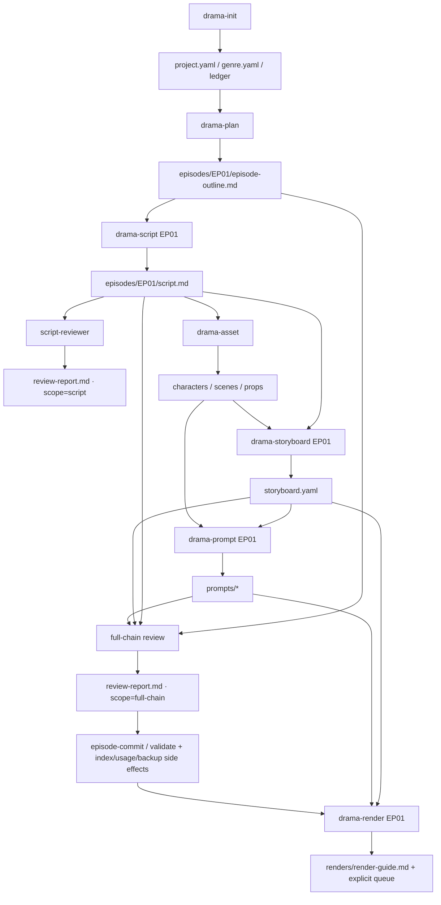
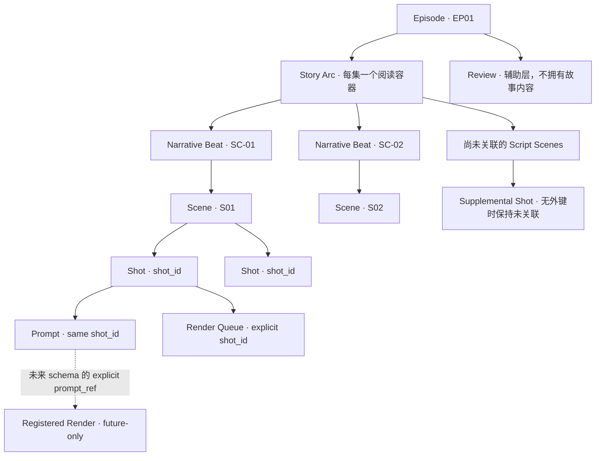
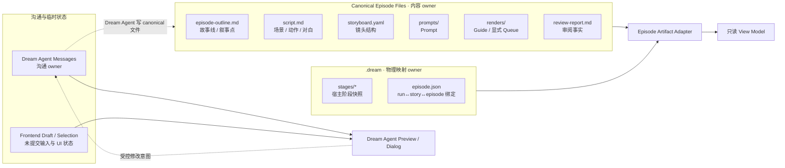
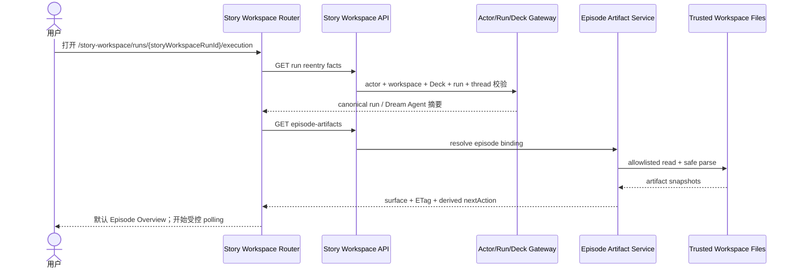
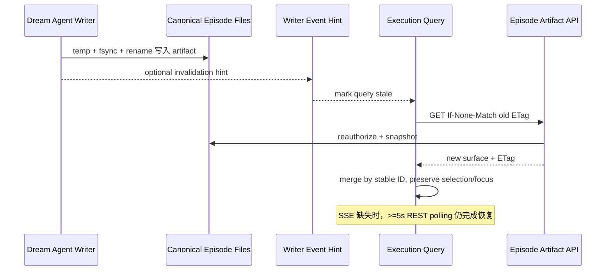
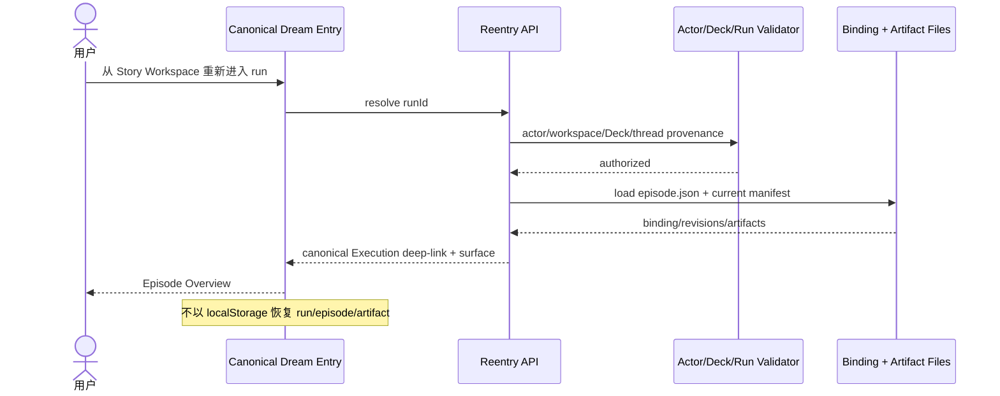
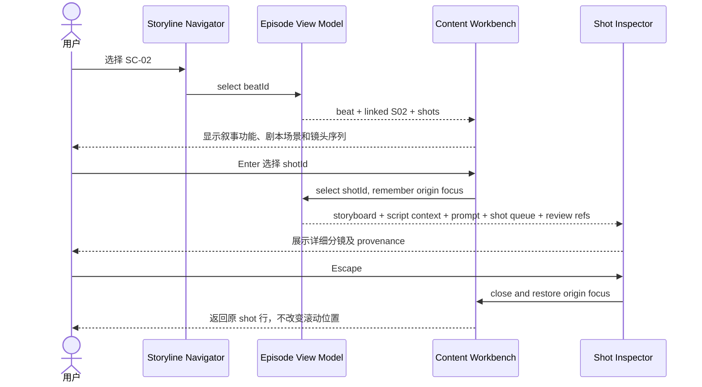
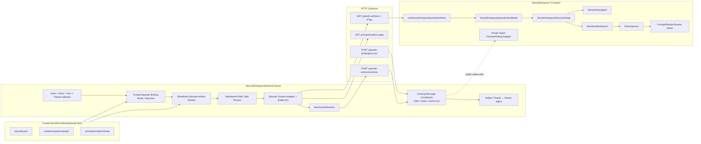

# drama-forge 第一集完整工作流与故事线分镜工作台交互设计

> 编号：design_009  
> 状态：Canonical / 独立评审通过（2026-08-05）
> 日期：2026-08-05  
> 上游裁决：`2026-08-05-drama-forge-ep01-task1-problem-decision-record.md`  
> 适用范围：Story Workspace / Dream / Episode Execution

## 0. Canonical 适用范围与优先级

design_009 是 Episode artifact 工作台的增量 canonical owner，不重写 Dream 初稿确认、Dream Agent 消息或 `.dream` 三 stage 协议。发生冲突时按下表解释：

| 旧设计条款 | design_009 的增量替代 | 继续保留的旧合同 |
| --- | --- | --- |
| `design_004` §5.3/§5.5 的“Execution 无业务操作” | Execution 可派发一个由后端计算的 episode 下一创作阶段 | Execution 仍不承担 artifact 审批、驳回、重试、归档，也不提供通用命令入口 |
| `design_007` §6.5 与 §11.2 的“确认后只读/不追加确认” | canonical 文件保持只读，但允许把“继续生成下一阶段”意图交给同一 Dream Agent | Dream 初稿仍只有一次正式 confirmation；Episode 阶段派发不是第二次 confirmation |
| `design_008` 对上述“无后续操作”的继承 | 仅该引用被本设计替代 | reentry、消息 claim/lease、active-turn、权限和 Dream Agent dialog 合同全部继续有效 |

形式化区分：

- `Dream confirmation`：现有一次性 Dream 初稿确认，仍由原 confirmation owner 持久化。
- `Episode stage dispatch`：用户请求 Dream Agent 执行一个 derived capability，不批准 artifact，不写 confirmation record，不产生新的 Story Workspace 业务状态。
- skill 内部的 Ask/Decide/Approve 是 Dream Agent 的创作对话，不映射为 Story Workspace confirmation 状态。

## 1. 背景、目标和非目标

### 1.1 背景

当前 Dream 已能创建 run，写入 `.dream` 的 characters、scenes、storyboards 三个 stage，并让 Execution 页面逐 revision 展示；但这只是宿主投影，不等于 drama-forge 从零到完整第一集的真实流程。任务一已经证明，vendor 的典型流程在 init 后仍包含 plan、script、review、asset、storyboard、prompt、full-chain review、episode-commit 校验与索引/使用记录/备份更新、render/voice、edit、promote；当前真实 run 则只有三 stage 和一个提前生成的 `storyboard.yaml`（`2026-08-05-drama-forge-ep01-task1-problem-decision-record.md:58-128`）。

### 1.2 目标

1. 让用户在独立的 Episode Execution 工作台理解并推进第一集的真实前期创作链路。
2. 以故事线和叙事点为主层级，把 outline、script、storyboard、prompt、render 和 review 建立成可证明的关系。
3. 让 artifact 分阶段到达时平稳更新；刷新、离开和重新登录后从后端事实恢复。
4. 为 legacy partial run 提供诚实、可继续的降级，而不是假装顺序已经完成。
5. 严格保持唯一 truth owner、actor/Deck/run/story/episode 绑定和受控路径读取。

### 1.3 非目标

- 不把 Dream 或 Execution 改成通用 Chat 页面，不挂载 `ChatView`。
- 不展示隐藏推理、原始命令、工具参数、凭证、敏感路径和调试事件。
- 不做画布式无限编辑器、视频制作、视频剪辑、配音、宣发或通用 Agent 中心。
- 不让前端直接修改 canonical Markdown/YAML；不以 localStorage、消息或 UI draft 恢复业务事实。
- 不引入 vendor 和产品设计未定义的驳回、失败、人工重试或归档业务状态。

## 2. vendor 典型工作流还原

### 2.1 业务阶段

本设计完整保留 README 的 12 步顺序。产品本期只消费现有受审格式的 render guide 和显式 queue；真实媒体必须等待未来受审 schema 提供稳定 artifact ID 与 shot/prompt ref 后才能进入工作台。voice/edit/promote 只标识外部边界，不提供入口。顺序证据、输入输出和规范漂移详见任务一第 2 节（`2026-08-05-drama-forge-ep01-task1-problem-decision-record.md:58-119`）。

```mermaid
flowchart LR
    A["概念与 Deck"] --> B["Dream Agent · drama-init"]
    B --> C["drama-plan · Episode Outline"]
    C --> D["drama-script · Script"]
    D --> E["script-reviewer · Review"]
    E --> F["drama-asset · 可复用资产"]
    F --> G["drama-storyboard · Storyboard"]
    G --> H["drama-prompt · Prompts"]
    H --> I["full-chain review"]
    I --> J["episode-commit · 校验并更新索引/记录/备份"]
    J --> K["drama-render · Guide / 显式 Queue"]
    K -. "本期边界外" .-> L["voice"]
    L -.-> M["edit"]
    M -.-> N["promote"]
```



### 2.2 命令与产物依赖图



### 2.3 工作流推进原则

- 同一 episode 沿用同一 Dream Agent、workflow run 和技术 thread；用户界面只出现 Dream Agent。
- 页面不显示 raw slash command，而显示阶段目的，例如“继续生成剧本”。提交后由服务端把受控 action 翻译为同一 Dream Agent 的指令。
- 每一步是否可继续由 binding、canonical artifact 的存在性、source revision 和 review scope 推导；它是 capability，不是新增业务状态。
- 若已有后序文件但前序文件缺失，显示“早期产物”，下一步仍回到最早缺失依赖；到达相应步骤时必须基于最新上游重新生成，不能仅因文件存在而跳过。
- vendor Ask → Options → Decide → Draft → Approve 的创作暂停点保留在同一 Dream Agent 对话内；它们不是新的 Story Workspace confirmation。页面每次只派发一个可解释阶段，不自动串行到末端。
- `episode-commit` 会先校验，再更新角色索引、场景使用记录和备份；它不提供跨文件事务或失败后的原子回滚保证（`vendor/drama-forge/drama-forge/scripts/dramaforge.py:1003-1154`）。

## 3. Ink-Dream 当前接入差距

| 能力 | 当前事实 | design_009 目标 |
| --- | --- | --- |
| run 投影 | `.dream` 固定 characters/scenes/storyboards | 保留原协议；另建 episode binding，不污染 stage owner |
| workflow | launch 直接 run→characters→scenes→storyboards | next-step resolver 按 vendor 最早缺失依赖推进 |
| Episode 绑定 | 只能从 storyboard source_file 偶然推断 | run-scoped `episode.json` 绑定 story/EP01 |
| Execution | Assets/Outline 扁平列表 | 故事线 master-detail + 场景/镜头工作面 |
| outline/script | 未消费 | 安全 parser + hierarchy view model |
| prompts/renders/review | 未消费 | 有界目录投影 + 辅助视图 |
| 恢复 | 三 stage REST polling | episode ETag/manifest revision + 同一 deep-link |
| 选择稳定 | stage/entity key | episode_uid + explicit source key 的稳定不透明 ID |
| 安全 | stage source path 已有限制 | 复用并加强到 episode allowlist/actor/Deck/run binding |

现状证据见任务一第 3 节（`2026-08-05-drama-forge-ep01-task1-problem-decision-record.md:120-128`）。

## 4. 第一集完整产物模型

### 4.1 EpisodeArtifactManifest

`episode.json` 是 `.dream` 下的 run-scoped 绑定投影，只拥有 identity，不拥有内容。它不能用自身字段证明自身可信，建立时序必须是：

1. actor、workspace、preflight、Deck、run creator、thread owner 和 locked plugin/workspace context 已由既有 reentry/gateway 合同验证；
2. `drama-init` 已写出 canonical project identity；受控 reader 在 locked workspace 的可信 story root 内安全读取并核对该 identity；
3. 本专项的 episode code 由服务端 first-episode policy 固定为 `EP01`，不接受浏览器传入；episode root 由“可信 story root + 固定 EP01”计算，而不是从 binding 自己读取；
4. 在 `drama-plan` 写 EP01 outline **之前**，服务端 writer 依据上述独立事实生成 `episode_uid`，并用首次 CAS 创建 binding；
5. 首次写入后 `workflow_run_id`、`episode_uid`、`story_slug`、`episode_code` 与 episode root identity 不可换绑；后续 revision 只允许更新非身份元数据；
6. 重复的同内容首次请求幂等返回既有 binding；任何换 story、换 episode、换 root 或篡改 run 的请求在目录读取前拒绝；
7. legacy run 若不能从可信 project identity、locked context 和既有 run provenance 共同证明绑定，返回 `bindingAvailability: "unbound"`，只能执行受控补建流程；不得从浏览器参数、文件名或 storyboard source path 猜测。

该顺序继承现有可信范围（`design_008_dream-reentry-and-agent-workbench.md:420-437`）。

legacy reentry 先调用幂等 `resolve_or_repair_binding`：若可信 canonical project identity、locked context 与 run provenance 三者足以证明同一 story，服务端按 first-episode policy 自动 CAS 补建 binding；若证据不足，则保持 unbound，**不读取任何 episode artifact，也不计算 episode nextAction**。自动补建不是从 storyboard 文件名/source path 推断。

```yaml
schema: dream-episode/v1
workflow_run_id: run_...
episode_uid: 9fb7...          # 服务端生成，首次 CAS 后不可变
story_slug: rebirth-gate     # 受控段，不从浏览器输入
episode_code: EP01
episode_root: stories/rebirth-gate/episodes/EP01
revision: 1
updated_at: 2026-08-05T12:00:00Z
```

浏览器响应不得包含 `episode_root`、workspace root 或绝对路径。服务端解析 binding 后返回：

```text
StoryWorkspaceEpisodeArtifactSurface
├── runId / opaqueEpisodeId / manifestRevision / etag
├── bindingAvailability: bound | unbound
├── bindingRecovery: autoRepairAttempted, canDispatch, publicReason
├── workflow: derived nextAction + prerequisites + legacyPartial
├── artifacts[]: relativeKey, availability, contentRevision, mtime, size
│   └── producerAction, consumers[]
├── story: arc, beats[], unlinkedScenes[]
├── scenes[] / shots[] / promptsPage / rendersPage
├── review: scope, sourceRevisions, sections[]
├── associations: totals, linked, missing[], orphan[]
└── diagnostics[]: artifact-scoped technical information
```

manifest 的 `producerAction` 是受控 enum，前端只翻译成业务阶段名，不展示 raw slash command；`consumers[]` 也是受控组件 enum：

| artifact | producerAction | consumers |
| --- | --- | --- |
| `episode-outline.md` | `plan_episode` | `episode_overview`, `storyline_navigator`, `narrative_workbench` |
| `script.md` | `write_script` | `narrative_workbench`, `shot_inspector` |
| `storyboard.yaml` | `regenerate_storyboard` | `narrative_workbench`, `shot_inspector` |
| `prompts/` | `generate_prompts` | `shot_inspector`, `prompt_view` |
| `renders/` | `prepare_render_guide` | `shot_inspector`, `render_view` |
| `review-report.md` | `review_script` 或 `review_full_chain`（取报告声明的实际 producer） | `review_view`, `shot_inspector` |

### 4.2 Artifact availability 与关联状态

`availability` 只描述文件读取/解析事实，不构成业务状态机：

- `not_generated`：allowlisted artifact 不存在，是可恢复的正常事实。
- `available`：读取、大小和 schema 校验通过。
- `invalid`：存在但解析/schema/限额失败。
- `unavailable`：当前授权或受控资源访问失败；不泄漏具体路径。

关系单独使用 entity/link 级 `associationStatus: linked | unlinked | orphan`。因此一个 `available` storyboard 可以同时包含 linked 与 unlinked shots。

`last-good` 仅是当前挂载会话的内存缓存：新 revision invalid 时，本次会话可继续阅读旧内容并清晰标记它不是最新 revision；刷新或重新登录后若 latest artifact 仍 invalid，页面必须诚实显示 invalid。本期不增加跨会话 validated snapshot，避免形成新的内容 owner。

### 4.3 Binding 合同测试矩阵

| 场景 | 预期 |
| --- | --- |
| 可信 init 后首次创建 | 201/成功，身份来自 locked context + canonical project identity |
| 同内容重复创建 | 幂等返回同一 episode_uid/revision |
| 请求换 story | 在任何 episode 目录读取前拒绝 |
| 请求换 episode | 在任何 episode 目录读取前拒绝 |
| 篡改 root/run | 在任何 artifact 探测前拒绝 |
| legacy 无双重证据 | `unbound`，不猜测；仅提供受控补建 capability |

## 5. Episode、故事线、叙事点、场景和镜头的信息架构



主阅读顺序是 Episode → Arc → Beat → Scene → Shot。Prompt、Render 和 Review 只能从上下文进入，不能成为左侧一级主导航。

### 5.1 Episode Overview

从 outline 读取标题、story goals、核心冲突、hook、情绪/节奏摘要；缺少对应 section 就显示“尚未生成”，不从 Agent 消息或文件名推断。

### 5.2 Story Arc

v1 每集只有一个 view-model arc。它帮助页面形成连续阅读感，不是新 canonical 文件实体。内容仍来自 outline。

### 5.3 Narrative Beat

只有 outline 的显式 `SC-NN` section 能成为主叙事点。它显示叙事功能、摘要、场景目标、关键对白节拍和角色弧线引用。真实样例若没有 SC section，页面保留 Episode Overview，并显示“叙事点尚未形成”；script scenes 列在“尚未关联场景”。

### 5.4 Scene 与 Shot

script 的显式 `SNN` 是 scene；storyboard 的 `shot_id` 是 shot。`scene_ref` 默认表示资产场景，不能冒充 script scene。补充 shot 必须有显式 `script_scene_ref` 才进入 scene，否则列入“尚未关联镜头”。

## 6. 产物与 stable ID 规则

### 6.1 稳定 ID

服务端 binding writer 在可信首次绑定时生成持久化 `episode_uid`。adapter 使用 `UUIDv5(episode_uid, kind + ':' + normalizedSourceKey)` 生成不透明 view ID：

| view entity | normalizedSourceKey | revision 是否进入 ID |
| --- | --- | --- |
| Episode | `episode` | 否 |
| Story Arc | `arc` | 否 |
| Narrative Beat | `SC-NN` | 否 |
| Scene | `SNN` | 否 |
| Shot | canonical `shot_id` | 否 |
| Prompt | `shot_id:prompt-kind` | 否 |
| Render Queue Entry | canonical `shot_id` | 否 |
| Registered Render（未来） | schema 提供的 `registered-artifact-id` | 否 |

不得使用数组下标、显示标题、正文 hash、mtime 或 revision 作为长期身份。

### 6.2 关联优先级

1. 新 writer/schema 的显式 `narrative_beat_ref`、`script_scene_ref`、`shot_id`、`prompt_ref`。
2. vendor 模板明确允许的 `SC-NN` ↔ `SNN` 规范化编号。
3. 符合已批准 shot ID schema 的 SNN 前缀可关联 scene。
4. 其余一律 `unlinked`；严禁数组位置、文本相似度、邻近镜头和文件名猜测。

### 6.3 关联质量门

每个响应返回：

```text
beatSceneCoverage = linkedScenes / totalScenes
sceneShotCoverage = linkedShots / totalShots
shotPromptCoverage = shotsWithAtLeastOneLinkedPrompt / totalShots
shotRenderQueueCoverage = shotsWithExplicitQueueEntry / totalShots
totalPrompts / totalQueueEntries / duplicateQueueShotIds
missingLinks[] / orphanArtifacts[]
```

分母为 0 时展示“尚未生成”，不是 0%。本期样例只能证明 `Shot → Render Queue`，不能建立 `Prompt → Render`；一个 shot 有多个 prompt kind 时，绝不通过共享 shot_id 静默挑选 prompt。queue stable ID 为 `UUIDv5(episode_uid, "render-queue:" + shot_id)`；同一 shot_id 出现多个 queue row 时，该 render guide 为 invalid/diagnostic，不用数组位置制造多个身份。未来只有受审 schema 明示 `prompt_ref` 后才启用 `promptRenderCoverage`。质量门只描述关联完整率，不自动改变 workflow capability。

## 7. Episode artifact truth ownership



任何 view-model 字段必须带 `sourceArtifact` 与 `sourceRevision`。Review 只能引用内容，不能覆盖 outline/script/storyboard。前端 draft 不与文件内容双向合并。

## 8. Execution 页面整体布局

### 8.1 桌面结构

页面沿用 Story Workspace 壳层，Execution 内容区只分为两层：主叙事导航和内容工作面。详细 shot inspector 是内容工作面内部状态，不形成固定第三栏。

```text
┌──────────────── Story Workspace / Execution ──────────────────────────────┐
│ EP01 〈雨夜重逢〉  Storyline  Script  Shots  Prompts  Renders  Review      │
│ ──● outline ──● script ──◐ storyboard ──○ prompt ──○ review ──○ render   │
│ [Dream Agent：正在等待你的下一步]                         [继续生成剧本] │
├──────────────────────┬─────────────────────────────────────────────────────┤
│ 故事线               │ EPISODE OVERVIEW / SELECTED BEAT                   │
│                      │                                                     │
│ 序章  核心冲突       │ 核心冲突、目标、hook、情绪弧                       │
│ ─────────────────    │ ─────────────────────────────────────────────       │
│ SC-01 失去控制       │ SC-01 · 失去控制                                   │
│   1 scene · 8 shots  │ 叙事功能 / 摘要 / 场景目标 / 对白节拍              │
│ SC-02 意外相认       │                                                     │
│   尚未关联 2 shots   │ S01 车站外 · 夜                                    │
│ SC-03 做出选择       │  ├ 01 远景  建立雨夜车站                           │
│                      │  ├ 02 中景  主角停步                     [查看]    │
│ 尚未关联             │  └ 03 特写  手机亮起                               │
│   S04 / SUP-E01-03   │                                                     │
│                      │ Prompt · Render · Review 为上下文辅助，不另起卡片   │
└──────────────────────┴─────────────────────────────────────────────────────┘
```

### 8.2 视觉语法

- 背景使用暖纸张 token；主区以排版、留白和 1px 细分隔线分层。
- 页面级仅使用一条主要虚线作为 artifact progression；内部使用实线/留白，不形成“虚线套虚线”。
- Episode、Beat、Scene 不是圆角卡片；hover 只出现极轻暖灰底。
- shot 序列像分镜手稿：序号、景别、动作句和轻量缩略区域形成节奏，不使用后台表头和网格线。
- Prompt/Render/Review 以小型 text tabs 或 disclosure 进入，色彩和字号低于故事线。
- 阴影只用于窄屏临时导航层；静态内容无阴影。

## 9. 故事线与叙事点导航

### 9.1 默认进入

默认选择 Episode Overview，不自动选择 beat/scene/shot。若 outline `not_generated`，左侧仍显示 episode heading 和“故事线尚未生成”；若 outline 有 overview 但无 SC section，显示 overview + “叙事点尚未形成”。

若 binding 为 unbound，页面不渲染 Episode Overview 或 artifact 进度，显示“尚未建立可信的第一集关联”。唯一 CTA 是“恢复第一集关联”；它不要求也不允许用户输入 story、path 或 episode。

### 9.2 左侧导航

- 顶部是 Episode Overview。
- beat 按 outline 的显式顺序显示 SC key、叙事功能、短摘要、关联 scene/shot 数。
- “尚未关联”是末尾辅助分组，只收纳有 canonical identity 但缺少关系的 scene/shot。
- 上下方向键在同级移动；右方向展开 scene；左方向折叠/回父级；Enter/Space 选择。
- 列表实现 roving tabindex，当前项 `aria-current="true"`，层级使用 `tree`/`treeitem` 或同等可访问语义。

### 9.3 选择叙事点

右侧先显示 beat 的叙事目的，再显示相关 script scene 和 shot 序列。用户始终能回答：这一段故事要完成什么、剧本如何写、镜头如何表现、哪些关系仍未证明。

## 10. 详细分镜交互

### 10.1 进入与退出

- 在 shot 行按 Enter、点击“查看”或从 review 定位进入 inspector。
- inspector 替换右侧内容主体，顶部保留 `EP01 / SC-01 / S01 / shot` breadcrumb 和“返回场景”。
- Escape 退出 inspector 并把焦点恢复到原 shot 行；浏览器 Back 不用于局部层级，避免污染 canonical deep-link。

### 10.2 Inspector 内容顺序

1. **镜头意图**：shot_id、景别、机位/运动、构图、动作、情绪、时长。
2. **剧本上下文**：所属 scene heading、前后动作和对白；无显式 scene ref 时显示“尚未关联剧本场景”。
3. **视听连续性**：角色/场景/道具 refs 与前后镜头提示。
4. **Prompt**：positive/negative、allowlisted 创作设置摘要、来源 revision、关联诊断。设置摘要只含镜头创作所需的安全字段；Dream Agent 原始 tool input/output 永不进入 API 或 DOM。
5. **Render**：本期只展示 guide 和按相同 `shot_id` 关联的显式 queue，pending 不渲染为成片，也不声称关联到某个 Prompt；真实媒体属于未来受审 schema。
6. **Review**：只显示明确定位到此 shot 的条目；全文仍在 episode 辅助视图。

字段缺失显示短横或“尚未生成”，不以模型补全。原始 YAML、绝对文件路径和工具参数不展示。

## 11. script、storyboard 和 prompt 的关联展示

### 11.1 Scene 内联合阅读

scene 标题来自 script；shot 顺序和镜头字段来自 storyboard；prompt 只作为每个 shot 的辅助 disclosure。页面不创建合并后的可编辑正文。

### 11.2 Provenance

每个 inspector 底部以低层级文字显示：

```text
来源：Script r5 · Storyboard r3 · Prompt r2
关联：script_scene_ref → S01 · shot_id → S01-E01-SH02
```

只显示逻辑来源名和 revision，不显示磁盘路径。若 storyboard 声称来自旧 script revision，提示“分镜基于较早剧本版本”，next-step resolver 可建议重新生成，但不进入失败状态。

## 12. renders 的渐进展示

Render 辅助层区分已受审事实与未来扩展：

1. `guide`：文字制作指导，可用安全 Markdown section 展示。
2. `queue`：shot 的 pending/running 等 renderer 自有状态；仅当 canonical 文件确实提供时展示，不能由文件名推导。
3. `registered media`：**未来扩展，本期不消费。** 只有经独立设计与 schema 评审后，canonical manifest 明确提供稳定 artifact ID、shot/prompt ref、MIME 和受控资源 identity，工作台才可展示真实媒体；不得从文件名推导。

本期每个 shot 最多接受一个显式 queue entry，其稳定 ID 由 episode_uid + shot_id 生成；重复 row 使该 artifact invalid 并产生 diagnostic。本期 guide/queue 新 revision 只更新对应 shot 的辅助标记，不重排故事线或抢焦点。页面明确写“已生成制作指导，真实画面不在本期受审合同内”。未来同一 shot 可有多个 render attempt，但 `renderId` 必须基于受审 schema 的 artifact identity，并由显式 `prompt_ref` 建立 Prompt 关系。

## 13. review report 的展示和定位

- Review 是页面右上辅助入口，显示 scope（script/full-chain/unknown）、结论、source revisions 和问题数。
- 只有报告显式携带 SC/SNN/shot_id 时才生成定位链接；纯文本相似度不自动关联。
- 点击可定位条目先选中对应 beat/scene/shot，再聚焦 inspector 的 Review section；Escape 按原路径返回。
- scope=script 的报告不把 prompt/render 标为已审；scope 缺失显示“审阅范围未声明”。
- review 只读；“重新审阅”由受控继续操作交给 Dream Agent，不直接编辑报告。

## 14. Dream Agent 状态与内容工作面边界

### 14.1 Dream Agent 条

Episode header 下只有一条轻量状态行：头像/名称、可公开的最近状态摘要、一个上下文 CTA。它不滚动展示消息流，不挤占主叙事区。

### 14.2 对话框

用户触发继续或“请 Dream Agent 修改”时打开现有 Dream Agent dialog adapter：

- 显示阶段目标和将使用的 canonical 输入，不显示 raw command。
- 用户可补充创作要求；提交时带 `expectedManifestRevision` 与 idempotency key。
- Agent 消息到达不修改 local draft；artifact 只有在 REST manifest revision 更新后进入内容面。
- dialog 关闭后焦点回到触发按钮；Escape 先关闭局部 disclosure，再关闭 dialog。

### 14.3 禁止边界

不得挂载 `ChatView`，不得渲染 hidden reasoning/tool args/debug event。技术 thread 只用于后端同一运行上下文，不出现在用户界面。

## 15. 从当前步骤推进后续 drama-forge workflow

### 15.1 BindingRecoveryResolver

- 可证明 legacy：服务端自动幂等补建，响应直接进入 `bound`，无需用户操作。
- 不可证明 legacy：surface 只返回 `bindingAvailability: "unbound"` 和 `bindingRecovery.canDispatch=true`；`workflow`、artifact manifest、opaqueEpisodeId 均为空。
- UI 的“恢复第一集关联”调用独立技术恢复 endpoint：

```http
POST /api/story-workspace/workflow-runs/{runId}/episode-binding/recover

{
  "idempotencyKey": "uuid"
}
```

请求体不接受 story、path、episode、root 或 source file。服务端只依赖已授权 run/thread/locked context，复用同一 message coordinator、claim/lease、active-turn 与 fingerprint 语义，向同一 Dream Agent 派发受控 `recover_first_episode_binding` 意图。该意图只要求恢复/核对 canonical project identity；后续 polling 再由 `resolve_or_repair_binding` 自动补建。证据仍不足时继续 unbound，不开放 artifact 或 episode continue。

### 15.2 NextActionResolver

后端按依赖图寻找“最早缺失或已过期”的步骤，返回受控枚举和解释：

```text
plan_episode
write_script
review_script
refresh_assets
regenerate_storyboard
generate_prompts
review_full_chain
validate_episode
prepare_render_guide
none_in_scope
```

这些是可执行 capability，不是持久化业务状态。raw vendor command 仅存在服务端 adapter。

### 15.3 过期规则

- script 的 declared/generated source 早于 outline → `write_script`。
- storyboard source revision 早于 script/asset → `regenerate_storyboard`。
- prompt source revision 或 shot set 与 storyboard 不一致 → `generate_prompts`。
- full-chain review scope/source revisions 不覆盖当前上游 → `review_full_chain`。
- legacy run 有 storyboard、却没有 outline/script → next action 仍是 `plan_episode`，同时保留早期 storyboard 为“待上游补齐后重新生成”。

不得仅用 mtime 大小比较业务顺序；优先使用 canonical metadata/source revision。缺失 metadata 时返回 `needs_confirmation` diagnostic，由 Dream Agent 解释，不假定完成。

### 15.4 提交合同

```http
POST /api/story-workspace/workflow-runs/{runId}/episode-actions/continue
If-Match: "manifest-etag"

{
  "episodeId": "ep_opaque",
  "action": "write_script",
  "idempotencyKey": "uuid",
  "userGuidance": "保留雨夜车站的克制氛围"
}
```

服务端重新授权并重算 capability；不匹配返回 409 + 最新 surface，不重复派发。响应只确认已交给同一 Dream Agent，文件更新仍由 GET/polling 驱动。

派发必须复用 `design_008` 已有的 Dream Agent message service/coordinator、SQLite claim/lease 和 run/thread active-turn gate（`design_008_dream-reentry-and-agent-workbench.md:449-485,678-693`），不能另建内存队列：

1. 服务端把 action、episode_uid、expected manifest revision 和安全 user guidance 规范化为 action envelope，并生成稳定 message/action ID 与 fingerprint。
2. 同 idempotency key + 同 fingerprint：返回同一持久 message/claim 结果，不重复派发。
3. 同 idempotency key + 不同 fingerprint：409。
4. 不同 key 并发、或同 run/thread 已有 live turn：返回既有 busy/active-turn 技术门禁，不创建第二条 action message。
5. claim owner 崩溃后按既有 lease 到期/恢复语义由 coordinator 接管，仍保持 at-least-once dispatch 与确定性 message identity。
6. coordinator 只把受控阶段指令派发给既有 hidden thread/Dream Agent；artifact 更新不从 action response 或消息正文进入 UI，仍等 REST surface revision。

并发验收必须证明：一个 logical action 只有一条持久 action message、一个有效 claim owner、一个 active dispatch；重复响应可引用同一 identity。

## 16. 文件快照、revision 与增量恢复

### 16.1 Revision 模型

- `contentRevision`：受控读取后的内容摘要 opaque token。
- `manifestRevision`：按 artifact key 排序后，对 availability/contentRevision/关联摘要生成 aggregate token。
- mtime/size 只作诊断和缓存优化，不单独决定 revision。
- HTTP ETag 等于 manifestRevision；客户端使用 `If-None-Match`。
- 目录分页 cursor 绑定 episode_uid、artifact kind、manifestRevision 和最后稳定 key；revision 改变时旧 cursor 返回 409/新 cursor。

### 16.2 合并规则

1. 收到 304：不改变任何 view model/selection。
2. 收到新 surface：按 stable ID 建索引，替换变更实体。
3. 当前 selected ID 仍在：保持 focus/scroll，不自动播报整页。
4. ID 被删除：选择最近存在父级；`aria-live="polite"` 通知“当前镜头已在新版本中移除”。
5. 新增实体：只更新计数和微弱“已更新”标记，不自动滚动。
6. artifact invalid：仅当前挂载会话保留内存 last-good，标明旧 revision；刷新/重新登录后不伪造可用快照。

## 17. 离开、刷新、重新登录后的恢复

### 17.1 首次进入 Execution 页时序图



### 17.2 后续产物渐进到达时序图



### 17.3 离开后重新进入恢复时序图



重新登录后不恢复未提交 local draft；若产品已有安全会话级草稿能力，它仍不得改变 artifact owner。

## 18. 用户选择叙事点并查看详细分镜的交互时序图



## 19. 响应式与无障碍规范

### 19.1 窄屏降级线框

```text
┌──────────────────────────────┐
│ ← Execution          EP01   │
│ 〈雨夜重逢〉                 │
│ ● outline  ● script  ◐ shot │
│ [故事线导航 ▾] [继续下一步] │
├──────────────────────────────┤
│ EP01 / SC-01 / S01           │
│                              │
│ SC-01 · 失去控制             │
│ 叙事功能与摘要               │
│ ───────────────────────────  │
│ S01 车站外 · 夜              │
│ 01 远景 · 建立环境       ›   │
│ 02 中景 · 主角停步       ›   │
│ 03 特写 · 手机亮起       ›   │
│                              │
│ Prompt · Render · Review     │
└──────────────────────────────┘

点击“故事线导航”后：
┌──────────────────────────────┐
│ 故事线导航              [×] │
│ Episode Overview             │
│ SC-01 失去控制               │
│ SC-02 意外相认               │
│ SC-03 做出选择               │
│ 尚未关联                     │
└──────────────────────────────┘
```

- `< 768px` 主区单列；故事线变为顶部 disclosure/sheet，打开时 focus trap，Escape 关闭并返回按钮。
- shot inspector 是内容区 drill-in，不用左右 drawer；顶部 breadcrumb/sticky back action 保持可达。
- 不允许横向滚动；长 shot_id 用中间省略但完整值通过可访问名称提供。
- touch target 至少 44×44 CSS px；文字缩放 200% 后操作仍可达。

### 19.2 键盘和播报

- Tab 只经过主要区域、当前 tree item、当前 scene/shot action 和辅助 tabs。
- Arrow keys 完成 tree/shot list 同层导航；Home/End 到首尾。
- Enter/Space 选择或展开；Escape 遵循“局部 disclosure → inspector → dialog”的最近层级。
- loading 使用 `aria-busy`；artifact 到达/选中实体被移除使用单一 `aria-live="polite"`，不逐 shot 播报。
- 更新标记不能只靠颜色；焦点环使用高对比墨色，不被 sticky header 遮挡。
- `prefers-reduced-motion` 下禁用滚动动画和更新闪烁。

## 20. API、前后端合同与组件边界

### 20.1 边界图



### 20.2 后端合同

- 新合同继续归既有 Story Workspace contract owner；不在 `backend/database.py` 新建表。
- binding 写入使用 `.dream` 受控 writer、临时文件 + fsync + rename + revision CAS，并遵循第 4.1 节的双重可信来源与不可换绑规则。
- reader 在任何目录探测前完成 actor、workspace、Deck、run creator、thread owner、locked context、binding identity 和 root containment 校验。
- 精确 allowlist：episode 顶层四文件；prompts/renders 目录的批准扩展名；逐层拒绝 symlink/NUL/`..`。
- 每类文件有 byte、YAML depth/node、string length、item count 和目录 entry 上限。
- Markdown 转为允许的 section/text AST；不执行 HTML。YAML 用 safe loader。本期没有真实媒体资源 endpoint。
- 缺失 artifact 返回 HTTP 200 + `not_generated`；对于无权 actor 和不存在的 actor/workspace/Deck/run/thread/binding 统一返回既有“不可见”响应，不用 403/404 差异泄露对象是否存在（`design_008_dream-reentry-and-agent-workbench.md:439-443`）。
- continue API 必须进入既有 message coordinator/claim/lease/active-turn，不得从 HTTP handler 直接调用 Agent adapter。

### 20.3 前端合同和组件

- frontend local contract 继续归 Story Workspace contracts owner，所有新符号使用 `StoryWorkspace*` 或 `story-workspace` 前缀。
- hook 以 runId 为 query key，缓存 ETag，>=5s polling；SSE 仅 invalidate。
- parser 拒绝未知 schema/非法枚举/重复 stable ID；未知可选字段可忽略并记录 diagnostic。
- view model 只做展示投影，不重写 owner 字段。
- selection reducer 与 view model 分离，便于多 revision 测试。
- Episode 页面不导入 `ChatView`；Dream Agent 复用既有 preview/dialog adapter。

## 21. 技术异常边界

| 情况 | 页面处理 | 是否改变 next action |
| --- | --- | --- |
| artifact 缺失 | “尚未生成” | 由最早缺失依赖决定 |
| 关系缺失 | “尚未关联”+ coverage | 否；必要时建议上游重生成 |
| 新 revision 解析失败 | 当前挂载会话保留内存 last-good；刷新后诚实显示 latest invalid | 暂停提交，等待可读 revision |
| ETag 冲突 | 拉取最新 surface，保留仍存在选择 | 重新计算 capability |
| actor/Deck/run 不匹配 | access gate，不探测文件 | 不提供操作 |
| 网络中断 | 保留 last-good，退避后 polling | 不产生失败状态 |
| SSE 缺失 | 继续 REST polling | 否 |
| 外部模型/renderer 阻断 | 显示 Dream Agent 可公开状态；记录真实到达阶段 | 不用 mock 冒充成功 |

技术错误不得转换成“剧集失败/驳回/归档”。日志可记录内部 error code，但 UI 不显示绝对路径、原始工具参数或凭证。

## 22. 多 episode 与未来 EP02+ 扩展边界

- v1 一个 run 一个 episode binding；这不是永久业务限制。`episode_uid` 和 opaque ID 已避免把 EP01 路径编码进组件。
- 未来可将 `episode.json` 演进为 `episodes.json` binding list，并在 run 下选择 episode；artifact service、stable ID 和组件无需改变 owner。
- 第 3—9 步按 vendor 对每集重复；资产仍是 story 级共享，不能复制进每集成为第二 owner。
- 本期不实现跨 episode 排程、季级看板、episode 批量状态和通用 Agent 中心。

## 23. 本期不做

除第 1.3 节外，再明确：

- 不根据数组位置、相似文本或文件名静默关联。
- 不把 render guide/pending queue 显示成已完成视频。
- 不让 review 覆盖 outline/script/storyboard owner。
- 不把历史 `storyboard.md`/`prompt_package.yaml` 路径当 canonical。
- 不让浏览器提交 story/episode 相对路径。
- 不扩展 `RunStatus` 驱动 Episode 业务状态。
- 不在 writer event 完整前取消 REST artifact polling。

## 24. 验收标准

### 24.1 工作流与合同

1. 从 README 固化的步骤 fixture 与 next-step resolver 完全一致。
2. 同一 Dream Agent/run/thread 推进；一次 Dream confirmation 与多个 Episode stage dispatch 在持久合同和 UI 文案上可区分，raw 命令和技术 thread 不出现在 UI。
3. actor 只能读取自己 Deck/run binding 的 Episode；错误 actor/Deck/run/story/episode 和路径穿越全部拒绝；unbound 时不探测 artifact，也不返回 episode continue。
4. 缺失 artifact 返回 `not_generated`；无虚构内容。
5. manifest 保存相对 artifact key、revision/mtime/size、受控 `producerAction` 和 `consumers[]`；前后两次可逐项比对，API/DOM 不出现 raw command。

### 24.2 关联和渐进恢复

6. outline 可独立形成 Episode Overview/故事线。
7. script 到达后只有显式 SC/SNN 关系进入 beat；其余显示尚未关联。
8. storyboard 更新按 shot_id 增量合并；Prompt 与 Render Queue 分别以显式 shot_id 关联，样例不得产生 Prompt→Render 关系。
9. review 显示 scope/source revision，不成为内容 owner。
10. 刷新、离开和重新登录从 backend binding/manifest 恢复；localStorage 不是 owner。
11. 新 revision 不重置仍存在的 beat/scene/shot；删除时焦点回到父级并播报。
12. Agent 消息更新不覆盖 artifact 或未提交 draft；文件更新仍由 REST API 驱动。

### 24.3 UI、响应式与无障碍

13. 默认是 Episode Overview；storyline/beat/scene/shot 层级可理解。
14. shot inspector 展示 storyboard、script、prompt、render guide/shot queue、review 的来源字段。
15. 页面保持暖纸张、轻分区、少卡片、克制阴影；辅助视图不抢主层级。
16. 桌面与窄屏无严重遮挡/横向溢出/不可达操作。
17. 键盘可完成 beat/scene/shot 导航；焦点、aria-live、折叠和 Escape 行为符合第 19 节。
18. 源码和运行时均不挂载 `ChatView`，不展示隐藏推理、raw tool args 或未经设计的业务操作。

### 24.4 工程质量门

19. 后端 pytest 覆盖 reader、parser、association、auth、ETag、cursor；binding 必须覆盖首次建立、重复幂等、换 story、换 episode、篡改 root/run、legacy 可证明自动补建、legacy 不可证明 unbound/recovery 且请求无路径参数；continue/recovery 必须覆盖同 key 同内容复用、同 key 异内容 409、不同 key busy、已有 live turn、claim lease 恢复，并证明唯一持久 message/claim owner/active dispatch。
20. 前端沿用 Playwright Node seam 覆盖 parser/view model/selection/layout，不引入 Vitest。
21. `npx tsc -b` 通过；ESLint 覆盖全部改动前端文件。
22. 真实浏览器保存 run/thread/episode、前后 manifest、artifact 清单、revisions、截图、trace 和数据库计数；外部依赖阻断时诚实标明已到达阶段与未验证范围。

## 25. 设计到实现单元映射

| 单元 | design_009 owner 章节 | 主要验证 |
| --- | --- | --- |
| U1 | 4、16、20 | manifest/binding/ETag |
| U2 | 5、6 | outline/script/storyboard adapter |
| U3 | 4、12、13 | prompts/renders/review projection |
| U4 | 20、21 | actor/Deck/run/story/episode/path |
| U5 | 16、17 | polling/reentry |
| U6 | 8、9 | storyline/beat nav |
| U7 | 10、11 | scene/shot inspector |
| U8 | 11、12 | shot→prompt 与 shot→render queue 独立关联 |
| U9 | 13 | review auxiliary view |
| U10 | 2、15 | next workflow action |
| U11 | 6、16 | revision/selection stability |
| U12 | 19、24 | responsive/a11y/browser |
| U13 | 全文 | docs/implementation record |

实现不得改变本设计的 canonical owners；若证据迫使设计变化，必须先更新本设计并重新独立评审，再改生产代码。

## 26. 实施与验收回链

任务三已按第 25 节拆分实施。完整 commit 台账、最终测试、真实 manifests、artifact 文件哈希、真实浏览器截图/trace、workflow `/events` 404 + REST fallback，以及 run 仍 queued/无 agent session/无真实 render media 的诚实遗留，见：

`2026-08-05-drama-forge-ep01-task3-implementation-and-acceptance-record.md`

该实施记录不修改本设计 owner 或流程裁决；它明确区分“Episode artifact 与工作台通过”和“外部 Dream Agent runtime/renderer 全链路未被证明”。
