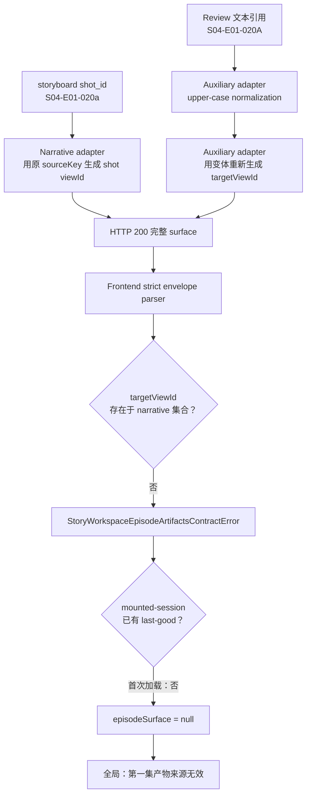
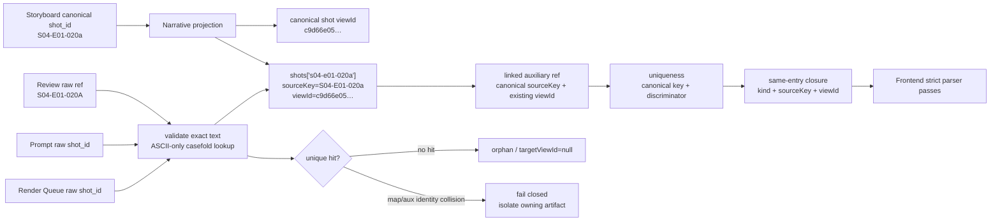
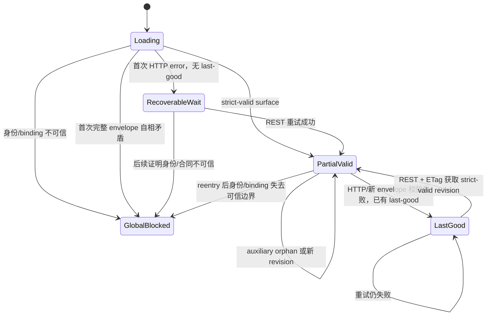
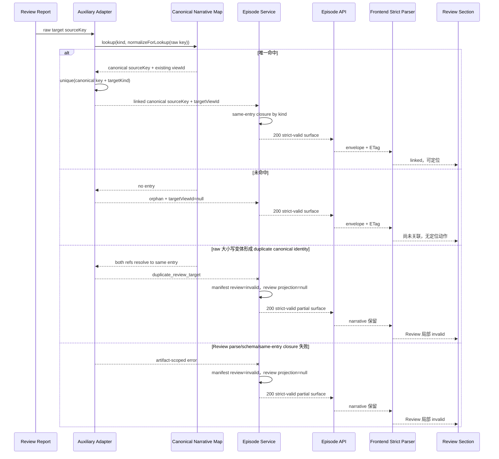
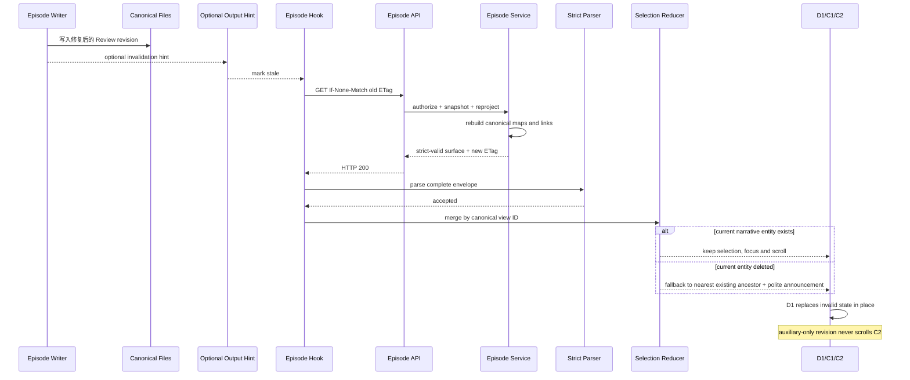

# Episode 产物合同异常隔离与工作台渐进降级交互设计

> 编号：design_010
> 状态：Draft / 待独立评审
> 日期：2026-08-06
> 适用范围：Story Workspace / Dream / Episode Execution
> 上游裁决：`2026-08-06-episode-artifact-invalid-task1-problem-decision-record.md`
> 前序设计：`design_009_drama-forge-first-episode-storyline-storyboard-workbench.md`

**适用性与覆盖关系。** design_010 是 Episode artifact identity、跨产物关联、异常隔离与渐进降级的增量 canonical owner。它明确覆盖 design_009 §6.1 中“`normalizedSourceKey` 直接参与 `UUIDv5`，且各 adapter 可据此生成 beat/scene/shot view ID”的旧解释：从本设计起，**narrative projection 是 beat、scene、shot view ID 的唯一 owner；normalization 只生成 lookup key，不改变 identity，也不重算 view ID**。design_009 §4.2 的 availability/association 双合同、§5 的 Episode → Arc → Beat → Scene → Shot 信息架构、§8 的“主叙事导航 + 内容工作面”两层结构、§19 的响应式与无障碍、§24 的工程质量门及其他不冲突条款继续继承（`design_009_drama-forge-first-episode-storyline-storyboard-workbench.md:183-194,207-242,316-351,626-673,781-815`）。C3 只能是 C2 内容工作面内部的上下文辅助区域；任何把 C3 画成与 C1、C2 并列的固定第三主栏的早期草案表达均由本次返工撤销。

本文是任务二设计目标，不代表修复已实现。凡标注“现状”的内容来自任务一、当前源码或真实浏览器证据；凡标注“目标态”“应”或“任务三”的内容均为待 TDD 实现与验收的合同。

## 1. 背景问题

真实 Execution 页面在 Episode API 已返回 `HTTP 200`、binding 为 `bound`、核心 narrative 已可读时，只因一条 Review cross-link 的 `targetViewId` 不在 narrative ID 集合中，就把标题以下的业务区整体清空并显示“第一集产物来源无效，暂无法读取。”。真实截图中保留了左侧产品壳、页面标题和 Dream Agent 摘要，但暖纸张主区只剩一行全局错误和大面积空白（`2026-08-06-episode-artifact-invalid-task1-problem-decision-record.md:82-97`；`evidence/2026-08-06-episode-artifact-invalid-before.png`）。

这不是“整集不可读”，而是单一 auxiliary 关联越过了后端 artifact 隔离边界，随后触发前端完整 envelope 的 strict gate。当前传播链如下：



对应静态证据为：narrative 使用原 `shot_id` 生成 ID（`backend/services/story_workspace/episode_artifact_adapter.py:527-544,594-618`），auxiliary 先 upper-case 再独立生成 ID（`backend/services/story_workspace/episode_auxiliary_artifact_adapter.py:221-231,590-638,796-804,1499-1507`），strict cross-link 检查拒绝未知 ID（`frontend/src/hooks/story-workspace/contracts.ts:2020-2037`），首次无 last-good 时页面进入全局提示（`frontend/src/hooks/story-workspace/useStoryWorkspaceEpisodeArtifacts.ts:397-444,571-619`; `frontend/src/pages/story-workspace/StoryWorkspaceExecutionPage.tsx:1018-1027`）。

## 2. 真实账户复现

任务一使用真实数据库账户 `dmeck123@suoxya.com` 对指定 run 只读取证；登录表单本身不在该次验证范围。账户、授权、binding 与 API 事实如下（`2026-08-06-episode-artifact-invalid-task1-problem-decision-record.md:22-80`）：

| 复现事实 | 结果 | 对本设计的意义 |
| --- | --- | --- |
| `GET /api/me` | `200`，邮箱为真实账户 | 排除匿名或 mock 页面 |
| workflow run | `200`，legacy status=`queued` | `queued` 不否定 artifact 可读性 |
| run/Deck/story/Episode binding | authority、canonical story、binding 一致 | 排除权限和换绑根因 |
| episode-artifacts | `200`，ETag 存在，`bindingAvailability=bound` | REST surface 已到达浏览器 |
| `episode-outline.md` | `available` | narrative 可建立 Overview/Beat |
| `script.md` | `available` | 4 个 Scene 可读 |
| `storyboard.yaml` | `available` | 22 个 Shot 可读 |
| `review-report.md` | `available` | Review 文件存在，但一条 link 自相矛盾 |
| `prompts/`、`renders/` | `not_generated` | 是正常未生成事实，不是错误 |
| strict parser | `auxiliary.review contains an unknown targetViewId.` | 精确阻断点 |
| `/workflow-runs/{run}/events` | `404` | 独立 transport 遗留，不是 artifact 根因 |

唯一被运行时证实的大小写冲突样本是 storyboard `S04-E01-020a` 与 Review `S04-E01-020A`：两者当时被声明为同一 linked Shot，却得到不同 UUID 前缀；`S04-E01-020b` 未出现在该响应四个 Review target 中，本文不把它虚构成第二个运行时冲突（`2026-08-06-episode-artifact-invalid-task1-problem-decision-record.md:99-110`）。

## 3. 根因与影响范围

### 3.1 根因

根因不是大小写比较本身，而是 **lookup normalization 与 entity identity 混为一体**：

1. narrative adapter 持有 Episode namespace，并以 canonical artifact 中的原始 source key 生成 beat/scene/shot ID（`backend/services/story_workspace/episode_artifact_adapter.py:159-168,261-262`）。
2. auxiliary adapter 也持有同一 namespace 和通用 `_view_id`（`backend/services/story_workspace/episode_auxiliary_artifact_adapter.py:177-195,328-329`）。
3. service 当前只把 `shot_ids`、beat keys、scene keys 传给 auxiliary，而没有传 canonical source key 与既有 view ID 的映射（`backend/services/story_workspace/episode_artifact_service.py:893-925`）。
4. auxiliary 把 key upper-case 后，用变体再次生成 narrative target ID；所以“比较命中”与“identity 命中”发生分叉。
5. backend 已有按 root 捕获 parser 错误并标记 manifest `invalid` 的能力，但跨引用矛盾没有在该层被识别，最终以自相矛盾的 200 envelope 到达 strict parser（`backend/services/story_workspace/episode_artifact_service.py:797-857,953-1031`）。

### 3.2 必须一起修复的范围

- beat、scene、shot 三类 canonical map 的构建与碰撞检测；
- Review target、Prompt item、Render Queue entry 对 narrative 的所有 cross-link；
- linked auxiliary entity 自身 stable identity 中使用的 canonical target key；
- service 的 per-artifact validation/isolation 以及返回前 link-closure assertion；
- API fixture、frontend strict parser 回归、hook last-good、selection/focus/scroll 与组件局部文案；
- 桌面与窄屏真实浏览器验收。

### 3.3 明确不属于根因的范围

- actor/Deck/run/story/Episode 绑定；现有绑定合同和 gateway 三方比对已排除该方向（`backend/story_workspace/contracts.py:1174-1193`; `backend/services/deck/story_workflow_gateway.py:1483-1564`）。
- artifact 文件缺失；真实核心与 Review 文件均存在，Prompts/Renders 是 `not_generated`。
- `WorkflowRun.status=queued`；它是 legacy status，不是 Episode artifact truth。
- 通用 `/events` 404；Episode hook 另走 REST + ETag/poll。

## 4. 目标与非目标

### 4.1 目标

1. 同一个 narrative 实体在 Review/Prompt/Render 的大小写变体引用下仍复用唯一 canonical view ID。
2. 单个 artifact 的解析、schema 或关联异常由 backend 先隔离为对应 manifest `invalid`，并删除该 artifact 的不可信 public projection。
3. 有效 narrative 在 Review、Prompts 或 Renders 异常时持续可读、可选、可滚动。
4. 保留 frontend strict envelope parser；任何返回为 `linked` 的 target 必须能在 narrative 集合中闭合。
5. `not_generated`、`unlinked/orphan`、`invalid`、`unavailable`、HTTP error 与完整 envelope invalid 具有不同的反馈和恢复路径。
6. revision 修复后在原位自动恢复，不重置仍存在的 narrative selection、键盘焦点或阅读滚动。
7. 刷新、离开与重新进入只从 backend binding/manifest/ETag 恢复事实。

### 4.2 非目标

- 不修改真实 storyboard、Review 或数据库事实来掩盖 adapter 缺陷。
- 不删除或放宽 frontend strict cross-link 校验。
- 不以数组位置、文本相似度、相邻 Shot、文件名或“最近项”猜测关联。
- 不把 Execution 改成 Chat 页面，不挂载或修改 `ChatView`。
- 不修通用 `/events` SSE route，不新增临时 transport 分支。
- 不新增跨会话 persisted last-good，不让 localStorage/sessionStorage 成为内容 owner。
- 不重做 design_009 的工作流推进、binding、Dream confirmation/dispatch 或多 Episode 规划。

## 5. Truth ownership

| 事实 | 唯一 owner | 可做 | 禁止 |
| --- | --- | --- | --- |
| Episode 身份与绑定 | trusted binding/gateway | 校验 actor/run/Deck/story/Episode | 浏览器提交路径或猜 story |
| Outline/Beat 内容 | `episode-outline.md` narrative projection | 生成 canonical beat view ID | Review 覆盖正文 |
| Scene 内容 | `script.md` narrative projection | 生成 canonical scene view ID | auxiliary 重算 scene ID |
| Shot 内容 | `storyboard.yaml` narrative projection | 生成 canonical shot view ID，保留原 source key 大小写 | upper-case 变体生成第二个 Shot ID |
| Artifact availability | backend manifest | 表达 `available/not_generated/invalid/unavailable` | Agent 消息或 UI draft 改写 |
| Auxiliary association | auxiliary adapter 对 canonical map 的查找结果 | 返回 linked canonical ref 或 orphan/null | 按位置配对、客户端补链 |
| REST 新鲜度 | ETag/manifest revision | 304、不变；200、重新投影 | mtime 单独冒充 revision |
| 当前阅读选择 | frontend mounted-session selection reducer | 按 canonical view ID 保持/逐祖先回退 | auxiliary revision 重置 narrative |
| last-good | 当前挂载 hook 内存 | 暂时保留曾通过 strict parser 的 fragment | 跨刷新持久化或冒充 latest |
| Dream Agent 消息 | Dream Agent adapter | 展示安全摘要、提供 invalidation hint | 成为 artifact、binding 或 revision owner |

权威链保持 design_009：canonical Episode files 拥有内容，`.dream/episode.json` 拥有绑定，backend 受控 reader/parser/adapter 拥有 public projection，frontend 只消费已验证 view model。Review 只引用，不覆盖 Outline/Script/Storyboard。

## 6. Narrative / Auxiliary 合同

### 6.1 Narrative 合同

- narrative surface 可分别包含 Overview/Beats、Scenes、Shots；每个 root 的 `availability` 独立。
- beat/scene/shot 实体至少提供 `id/viewId`、canonical `sourceKey`、`sourceArtifact`、`sourceRevision` 与 association facts。
- narrative projection 生成实体 ID 后，同时输出只读 canonical reference map；map 是投影结果，不是第二内容 owner。
- public association kind 与 UUID seed token 是两个不同域：`CanonicalTargetKind = narrative-beat | script-scene | shot` 只负责选择 map；现行 seed token 固定为 `beat | scene | shot`，只由 narrative adapter 生成 ID 时使用。map builder 和 auxiliary adapter 均不得把 public kind 字符串拼入 UUID seed。
- narrative root 解析或本类 canonical key 碰撞时，仅该 root 为 `invalid`；服务端移除该 root 的不可信 projection，再重建依赖关系。

### 6.2 Auxiliary 合同

- Review、Prompts、Renders 只能通过对应 kind 的 canonical map 解析目标。
- 唯一命中返回 map 中的 canonical `sourceKey + viewId`；raw 引用只可进入安全诊断，不可覆盖 canonical 字段。
- 未命中是 `unlinked/orphan`，target ID 为 `null`；这是可严格解析的合法状态。
- artifact parser/schema/限额失败时，对应 manifest 为 `invalid`，对应 public projection 为 `null`/空；不得把半解析 items 混入 200 surface。
- Prompt/Render/Review item 自身可以有 artifact-local stable ID，但其 `shotViewId/targetViewId` 必须复用 canonical map；不得调用 narrative kind 的 UUID 生成路径。
- auxiliary 唯一性一律在 lookup 之后按 `canonical target key + artifact-local discriminator` 判断：Prompt discriminator 为规范化后的 `promptKind`，Render Queue discriminator 固定为 `queue`，Review discriminator 为 public `targetKind`。orphan 没有 canonical key 时，以 `orphan + targetKind + asciiCasefold(raw key) + discriminator` 进入同一 collision domain，但仍返回原始安全 key 与 `targetViewId=null`。
- 同一 root 中两个 raw key 仅大小写不同、却解析到同一 canonical target 且 discriminator 相同，是 duplicate identity；整个 `prompts/`、`renders/` 或 `review-report.md` root 分别 `invalid`。不得预先 upper-case 后静默去重，也不得用 section ordinal、文件顺序或数组位置制造第二个实体。

### 6.3 Backend → API → Frontend 边界

```mermaid
flowchart LR
    subgraph B["Backend"]
      NA["Narrative adapter<br/>beat/scene/shot ID owner"]
      CM["Canonical map builder<br/>normalize only for lookup"]
      AA["Auxiliary adapter<br/>Prompt/Render/Review lookup"]
      ISO["Episode service<br/>artifact validation + isolation"]
      CLOSE["Surface same-entry closure<br/>kind + sourceKey + viewId"]
      NA --> CM --> AA --> ISO --> CLOSE
    end
    subgraph H["API"]
      GET["GET episode-artifacts<br/>200 + manifest + ETag"]
    end
    subgraph F["Frontend"]
      STRICT["strict envelope parser<br/>schema + enum + cross-link"]
      HOOK["useStoryWorkspaceEpisodeArtifacts<br/>poll + session last-good"]
      VM["Episode view model + selection reducer"]
      COMP["Narrative workbench<br/>Review / Prompt / Render components"]
      STRICT --> HOOK --> VM --> COMP
    end
    CLOSE --> GET --> STRICT
```



现有 strict cross-link 逻辑必须保留（`frontend/src/hooks/story-workspace/contracts.ts:2020-2037`），并补充 same-entry 防御：ID 仅“存在于同 kind 集合”还不够，canonical source key 与 view ID 必须来自同一 map entry。任务三的生产 truth owner 仍是 backend closure；frontend 只做 wire-contract defense-in-depth，不负责修复或猜测。

## 7. Stable source key 与 view ID

### 7.1 对 design_009 §6.1 的覆盖裁决

design_009 §6.1 的以下语义被 design_010 覆盖：**`normalizedSourceKey` 不再直接参与 beat/scene/shot UUID，也不授权 auxiliary adapter 生成这三类 view ID。** 新规则为：

```text
narrativeViewId = UUIDv5(episode_uid, seedToken + ":" + canonicalSourceKey)
lookupKey       = asciiCasefold(validatedRawOrCanonicalSourceKey)
```

- `canonicalSourceKey` 是 narrative parser 验证后保留原始大小写的 key，例如 `S04-E01-020a`。
- `lookupKey` 只用作 map key，永不进入 narrative view ID 计算。
- `seedToken` 固定映射为 `narrative-beat → beat`、`script-scene → scene`、`shot → shot`；这三个 token 与当前源码 `_view_id("beat"|"scene"|"shot", sourceKey)` 完全一致（`backend/services/story_workspace/episode_artifact_adapter.py:261-262,323-324,451-453,594-597`）。不得改成 `narrative-beat:` 或 `script-scene:`，也不得由 map kind enum 隐式推导新字符串。
- 同一 Episode revision 是否变化不进入 ID；数组下标、标题、正文 hash、mtime 继续禁止。
- Episode/Story Arc 既有稳定 ID 与其他不冲突规则继承 design_009。
- Prompt/Render/Review 的 artifact-local ID 仍需稳定；一旦 linked，其 identity seed 应使用 canonical target key，而非 raw 大小写变体，且 narrative `targetViewId` 必须直接取 map value。

任务三必须固定一组 exact-ID fixture，防止 seed token 在重构中漂移。以 `episode_uid=1234567890abcdef1234567890abcdef` 为 namespace，预期值为：

| CanonicalTargetKind | seedToken + canonicalSourceKey | exact UUIDv5 hex |
| --- | --- | --- |
| `narrative-beat` | `beat:SC-01` | `872aa6e8feae5a3da7fcfe88e0c965c6` |
| `script-scene` | `scene:S01` | `80f6b99c7f365fb6b1729d00d89332c0` |
| `shot` | `shot:S04-E01-020a` | `4512ebd7fd835a32ac52b920851f0559` |

### 7.2 稳定性结果

| 变化 | narrative view ID | auxiliary link | selection |
| --- | --- | --- | --- |
| Review `020A` ↔ Shot `020a` | 不变 | 命中 canonical `020a` | 保持 |
| Review 文案修改、target 不变 | 不变 | target 不变，Review revision 更新 | 保持 |
| auxiliary artifact 新增 | 不变 | 新 item 按 map 关联 | 保持 |
| narrative entity reorder | 不变 | map 不变 | 保持 |
| canonical source key 真正更名 | 新实体 ID | 旧引用 orphan，除非 writer 显式迁移 | 按删除规则逐祖先回退 |
| narrative entity 删除 | 不存在 | 相关 target orphan/null | 逐祖先回退 |

## 8. 大小写规范

1. 所有 canonical 与 auxiliary explicit key 必须先通过同一 identity validator：值必须是非空 `str`，`value == value.strip()`，`value.isascii()`，且完整匹配该 kind 的 ASCII allowlist regex。trim 只用于比较，不产出修正值；只要 trim 后与原值不同就拒绝整个 owning root。
2. 空串、全空白、前后 ASCII space/tab/CR/LF/NBSP、内部空白、控制字符都不是可恢复 key。`" S01"`、`"S01 "`、`"\tS01"`、`"S01\n"` 必须得到 artifact-scoped `invalid_explicit_key`，不能静默 trim 后关联。
3. v1 `asciiCasefold(value)` 只把 ASCII `A-Z` 映射为 `a-z`，其它 code point 不接受也不转换。实现不得调用 Unicode `casefold()`/`upper()` 后再验证，不做 NFC/NFKC、全角转半角、分隔符替换或编号补零。
4. 全角 `Ｓ`、Cyrillic/Greek 同形字、Unicode hyphen/minus、组合字符与其它 confusable 一律在 lookup 前按 non-ASCII 拒绝；例如 `Ｓ04-E01-020a`、`Ѕ04-E01-020a` 不能命中 ASCII `S04-E01-020a`。
5. canonical source key 的原始大小写进入 public surface 和 UI；用户看到 `S04-E01-020a`，不被改写成 Review 的 `020A`。ASCII case variant `S04-E01-020A` 经 lookup 可命中，但返回值必须被 canonicalize 为小写 `a` 的 map entry。
6. beats、scenes、shots 分别建 map，跨 kind 相同文本不构成碰撞；同 kind 内两个不同 canonical key 若 `asciiCasefold` 后相同，map 构建 fail closed。
7. auxiliary 唯一性也使用 lookup 后 canonical key；同一 discriminator 下的大小写变体是 root-level duplicate，不是两个 items。未知 key 返回 `orphan/null`，但两个未知大小写变体仍在 orphan collision domain 内冲突并使 owning root `invalid`。
8. fixtures 必须覆盖：合法 ASCII case variant、空串/blank、四类前后空白、全角与 Cyrillic confusable、Unicode hyphen、canonical map collision，以及 Prompt/Render/Review 三类 case-variant duplicate。

## 9. Canonical map

### 9.1 数据形态

服务端从已投影的 narrative entity 构建三张只读表：

```text
CanonicalNarrativeRef
├── targetKind: narrative-beat | script-scene | shot（只选 map）
├── sourceKey: canonical source key（保留大小写）
└── viewId: narrative projection 已生成的不透明 ID

CanonicalNarrativeMaps
├── beats[asciiCasefold(sourceKey)]  → CanonicalNarrativeRef
├── scenes[asciiCasefold(sourceKey)] → CanonicalNarrativeRef
└── shots[asciiCasefold(sourceKey)]  → CanonicalNarrativeRef

NarrativeUuidSeedTokens（仅 narrative adapter 使用）
├── narrative-beat → beat
├── script-scene   → scene
└── shot           → shot
```

map value 不包含重新计算函数。Episode service 应把 map 作为显式参数传给 auxiliary adapter，替换当前 `shot_ids/narrative_beat_keys/script_scene_keys` 的降格 set 接口（现状调用点：`backend/services/story_workspace/episode_artifact_service.py:893-925,953-1031`）。

### 9.2 修复后的映射



### 9.3 碰撞与 closure

- map 构建应在对应 narrative root 的 isolated validation 中执行；碰撞使拥有这些 keys 的 root `invalid`，该 root projection 被移除。
- service 在组合 public surface 前对 prompts、render queue、review 分别做 same-entry closure。对每个 linked item，先按 public kind 选择 map，再用 public canonical source key 的 `asciiCasefold` 查 entry，并同时要求 `item.sourceKey == entry.sourceKey` 与 `item.targetViewId == entry.viewId`。只验证 target ID“存在于同 kind ID set”不足以防止 cross-wire。
- Prompt 对 `(shotId, shotViewId)`、Render Queue 对 `(shotId, shotViewId)`、Review 对 `(kind, sourceKey, targetViewId)` 执行上述成对校验；`unlinked/orphan` 必须为 `targetViewId=null`。
- 测试必须构造两个都真实存在的 Shot A/B，再把 A 的 canonical source key cross-wire 到 B 的真实 view ID。该 payload 即使通过“ID membership”也必须被 closure 拒绝；可归属到 Review/Prompt/Render 时只把对应 root 变为 `invalid`、移除其 projection，A/B narrative 均保留。frontend strict parser 增加同 fixture 的拒绝回归。
- 可归属到单一 auxiliary root 的 closure 失败，标记该 root `invalid`、删除其 projection，并只对该 root重投影一次；不可归属或服务端仍生成矛盾 envelope 时 fail closed，不能返回“看似 200”的不可信内容。

## 10. 整体可用性

Episode 工作台不是二元“成功/失败”。只要身份/binding 可信，完整 envelope 通过 strict parser，且至少一个 narrative root 可被后端独立验证，就进入部分有效工作台。Review、Prompts、Renders 不拥有整体可用性。



`GlobalBlocked` 不代表业务上的 Episode failed/rejected/archived；它只表示当前浏览器无法建立安全可读边界。已有 mounted-session last-good 时，新响应 HTTP 失败或完整 envelope 校验失败不清空主区，而进入 `LastGood`；刷新后 cache 消失，若首次响应仍矛盾才全局阻断。

## 11. 单 artifact 隔离

backend 必须先隔离，再由 frontend 严格解析。隔离和降级决策如下：

| 输入事实 | Backend manifest / projection | Strict parser | UI 落点 | Narrative | 恢复 |
| --- | --- | --- | --- | --- | --- |
| auxiliary `available` 且 closure 成立 | `available` +可信 projection | 通过 | 对应 D1/D2/D3 | 保留 | revision 正常更新 |
| allowlisted optional root 在首次安全 `os.open` 前返回 `ENOENT` | `not_generated` +空 projection | 通过 | 对应 root 中性空态 | 保留 | 新 revision 自动出现 |
| 合法 key 未命中 map | artifact 仍可 `available`；item=`orphan`, target=`null` | 通过 | 单 item“尚未关联” | 保留 | 后续 revision 重新 lookup |
| 两个 raw auxiliary keys 命中同一 canonical key + discriminator | owning root=`invalid`；删除该 root projection | 通过 | 对应 D1/D2/D3 局部 invalid | 保留 | 修复 duplicate 后新 revision |
| sourceKey 与另一个真实 view ID cross-wire | owning auxiliary root=`invalid`；删除该 root projection | 通过 | 对应 D1/D2/D3 局部 invalid | A/B narrative 均保留 | 修复 closure 后新 revision |
| 单一 auxiliary parse/schema/closure 失败 | 该 root=`invalid`；删除其不可信 projection | 通过 | 该分组局部 invalid | 保留 | 修复 artifact 后自动恢复 |
| root 已安全打开并验证 inode/type 后，内容 `os.read` 或已验证目录 `os.listdir` 命中 `{EAGAIN, EBUSY, EIO, ESTALE}` | 该 root=`unavailable`；projection 为空 | 通过 | 该 root“暂时无法读取” | 保留其他内容 | 下次读取成功 |
| narrative root parse/collision 失败 | 该 root=`invalid`；移除依赖该 root 的 narrative 层级 | 通过 | C1/C2 对应层级说明 | 其他可信 root 保留 | 新 revision 重投影 |
| open/fstat/stat 阶段失败、symlink、非预期类型、路径越界或非 allowlisted errno | `StoryWorkspaceEpisodeArtifactPathError`，不投影局部 manifest | 不接收 | E1/统一不可见 | 不展示 | 安全事实恢复后重新进入 |
| 首次 HTTP error | 无可信最新 surface | 无 payload 可解析 | 可恢复等待态 | 暂不展示 | poll/重试 |
| HTTP error + last-good | 不改 cache | 不重跑旧数据 | B2 同步提示 | 显示 last-good | poll/重试 |
| 首次完整 envelope 自相矛盾 | backend 隔离失败或中间层违约 | 拒绝 | E1 全局阻断 | 不从 payload 挑字段 | 服务端修复后重试 |
| 新 envelope 自相矛盾 + last-good | latest 不进入 cache | 拒绝新 payload | B2“暂时无法验证新版本” | 显示 last-good | 下次 strict-valid 200 |
| 身份/权限/binding 不可信 | 不探测或不返回 artifact | 不展示 | E1 | 不展示 | 重新认证/可信 reentry |

关键不变量：**任何 valid 200 surface 都可被 frontend strict parser 整体接受；任何单 auxiliary invalid 都不能再依赖 frontend partial parse 来“捞回” narrative。**

### 11.1 Backend `unavailable` 唯一实现规则

当前 reader 把所有 `OSError` 统一转换为 `StoryWorkspaceEpisodeArtifactPathError`，而 `_EpisodeReads` 只有 `invalid_revisions`，所以源码现状不会生成 manifest `unavailable`（`backend/services/story_workspace/episode_artifact_service.py:168-175,300-545,638-707,1033-1111`）。任务三若实现该既有 public enum（`backend/story_workspace/contracts.py:850-856`），只能按以下唯一规则分类：

```text
TRANSIENT_ARTIFACT_ERRNOS = {EAGAIN, EBUSY, EIO, ESTALE}

File root:
  optional os.open -> ENOENT                         => not_generated
  os.open / fstat / no-follow stat / type check fail => global PathError
  identity + regular-file type verified
  └─ os.read -> errno in allowlist                   => root unavailable
            -> any other errno                       => global PathError

Directory root:
  optional os.open -> ENOENT                         => not_generated
  open + fstat + no-follow stat + directory verified
  └─ os.listdir -> errno in allowlist                => root unavailable
               -> any other errno                    => global PathError
  entry stat/open/type/allowlist validation fail     => global PathError or root invalid per existing contract rule
  verified child file os.read -> allowlisted errno   => containing directory root unavailable
```

不把 `EACCES/EPERM/ENOENT/ENOTDIR/ELOOP/EINVAL/EBADF` 等错误降级为局部 `unavailable`：它们发生在安全身份尚未确认、表示权限/路径/type/程序不变量问题，或不在本期唯一瞬时集合内。Python 对 `EINTR` 的阻塞 I/O 已按运行时规则自动重试；本合同不把它暴露为 availability。对于 `ESTALE` 不存在的平台，集合仅包含运行时 `errno` 模块实际定义的同名常量，但合同语义不增加其它 errno。

内部读取结果必须扩展为互斥 root facts：

```text
_EpisodeReads
├── outline / script / storyboard: _FileFact | None
├── prompts / renders: _DirectoryFact | None
├── review: _FileFact | None
├── invalid_revisions: Mapping[rootKey, opaqueRevision]
└── unavailable_roots: frozenset[rootKey]
```

- `invalid_revisions.keys()` 与 `unavailable_roots` 必须不相交；不满足即服务端 fail closed。
- `_raw_manifest_facts` 和 `_manifest_entries` 的判定优先级固定为 `invalid → unavailable → available → not_generated`。
- `unavailable` 的 `contentRevision/mtime/size` 均为 `null`，不以 errno、旧 metadata 或内部路径制造 revision；aggregate manifest/ETag 必须包含 availability=`unavailable` 这一事实。
- API 返回仍是 strict-valid 200 partial surface；对应 projection 为空。若当前 mounted session 有该 root 的 last-good，frontend 可显示旧 fragment 并明确标注；刷新后只显示 `unavailable`。
- pytest 必须在 `os.open` 前注入 `ENOENT`、在 identity 验证后的 `os.read`/`os.listdir` 分别注入四个 allowlisted errno，并对 open/fstat/stat 的同 errno 证明仍全局拒绝；还需覆盖 `EACCES`、symlink、directory-as-file、file-as-directory、entry race 和集合互斥。

## 12. Outline / Script / Storyboard 展示

核心阅读继续继承 design_009 §5：Episode → Story Arc → Narrative Beat → Script Scene → Storyboard Shot。它们是下钻关系，不是三个等权后台 tab。

- `episode-outline.md available`：显示 Episode Overview、显式 beat；缺 section 只显示对应“尚未生成”，不从 Agent 消息推断。
- `script.md available`：Scene 以显式 `SNN` 和 narrative relationship 展示；未关联 Scene 保留在辅助分组。
- `storyboard.yaml available`：Shot 保留 canonical `shot_id` 大小写、镜头描述和元数据；只按显式关系进入 Scene。
- Review `invalid`、Prompts/Renders `not_generated` 时，上述三层仍完整可浏览。
- 某一 narrative root `invalid` 时只移除依赖该 root 的层级。例如 storyboard invalid 可保留 Outline 与 Script；不得把整个 Episode 文案改为“来源无效”。
- 页面继续只有两层：C1 Narrative Navigator 与 C2 Content Workbench。C2 内部先渲染 Narrative Reader，再渲染 C3 Contextual Auxiliary；Prompt、Render、Review 不是第三个主栏。只有 C2 自身容器足够宽时，C3 才可作为 C2 的嵌套侧注区与正文并排；否则固定排在正文之后，字号、宽度和标题等级低于 Narrative Reader。

## 13. Review 局部状态

### 13.1 状态与动作

| Review 状态 | 标准文案 | 定位动作 | UI 位置 |
| --- | --- | --- | --- |
| `available + linked` | Review 摘要 + canonical Shot key | 显示“定位到镜头 {key}” | C2 内 C3/D1 item |
| `available + unlinked` | “尚未关联：没有声明可验证的定位目标。” | 无 | C2 内 C3/D1 诊断组 |
| `available + orphan` | “孤立引用：声明的定位目标不存在或不一致。” | 无 | C2 内 C3/D1 诊断组 |
| `invalid` | “Review 内容暂时无效。故事正文仍可浏览，系统会在产物更新后重新校验。” | 可选“重新检查”，不暴露异常 | C2 内 C3/D1 原位 |
| `unavailable` | “Review 暂时无法读取。其它已验证内容不受影响。” | 可重试；有局部 last-good 时只保留已验证动作 | C2 内 C3/D1 原位 |
| 恢复 | “Review 已恢复，保持当前阅读位置。” | 恢复 linked actions | C2 内 C3/D1 原位，`aria-live=polite` 一次 |

现有 Review panel 已区分 `not_generated/invalid/unavailable`，也把 unlinked 与 orphan 放入局部诊断区；任务三应保留并按本设计收敛文案，而不是重建新业务状态（`frontend/src/components/story-workspace/episode/StoryWorkspaceEpisodeReviewPanel.tsx:89-110,345-381`）。

### 13.2 Review 关联失败时序图



canonical map 自身发生碰撞时，不进入上述任一“命中”；map builder 先 fail closed 并隔离拥有冲突 keys 的 narrative root，任何依赖该 kind 的 Review target 都不得被随意配对。

Review parser 不得继续沿用“先 `.upper()` 再静默去重”的 `_ordered_matches` 行为（现状：`backend/services/story_workspace/episode_auxiliary_artifact_adapter.py:588-638,1499-1507`）。它必须保留每个已验证 raw match 到 canonical lookup 完成，再以 `(canonicalSourceKey, targetKind)` 检测唯一性；`020a` 与 `020A` 同时出现使 `review-report.md` invalid。Prompt 使用 `(canonicalSourceKey, normalizedPromptKind)`，Render Queue 使用 `(canonicalSourceKey, queue)`，三类都要有大小写变体 duplicate fixture。

## 14. Prompts / Renders `not_generated`

真实账户中 Prompts 与 Renders 均是 `not_generated`，这说明 allowlisted artifact 尚不存在，不是生成失败、读取失败或 0% 进度（`2026-08-06-episode-artifact-invalid-task1-problem-decision-record.md:56-80`）。

- Prompts：标题“提示词尚未生成”，说明“生成完成后会自动出现在这里。”
- Renders：标题“渲染结果尚未生成”，说明“渲染完成后会自动出现在这里。”
- 使用中性暖灰文字与细虚线，不显示错误图标、红色、假 Prompt、假缩略图或虚构进度。
- 分别保留 D2、D3 的结构位置；不把两个状态合并成“辅助产物缺失”。
- revision 到达且变为 `available` 后原位出现；不得自动改变 Scene/Shot selection、打开分组或滚动正文。
- 未来 Prompts/Renders 的 `shot_id` 大小写变体必须与 Review 使用同一 canonical shot map；未命中保持 orphan，不能默认落到第一 Shot。

## 15. API、解析与关联差异反馈

同样的“看不到内容”可能来自不同层，必须按事实命名：

| 层级事实 | 用户标题 | 说明 | 动作 | 恢复事实 |
| --- | --- | --- | --- | --- |
| `not_generated` | “尚未生成” | 正常不存在 | 无错误操作 | 新 artifact revision |
| `unlinked/orphan` | “尚未关联”/“孤立引用” | 内容存在，但关系未证明 | 不显示定位 | canonical map 后续命中 |
| manifest `invalid` | “内容暂时无效” | 文件存在但 schema/解析/closure 不可信 | 可重新检查 | 修复后的 contentRevision |
| manifest `unavailable` | “暂时无法读取” | root 已确认且安全打开后，内容读取/已验证目录枚举命中第 11.1 节瞬时 errno | 可重试 | 后续 valid 200 manifest |
| HTTP error，无 last-good | “暂时无法同步第一集” | 当前请求未取得可信最新 surface | 重试，自动 poll | GET 成功 |
| HTTP error，有 last-good | “暂时无法同步，正在显示上次已验证内容” | 显示的是 mounted-session cache | 重试 | GET + strict parse 成功 |
| 新 envelope contract invalid + last-good | “暂时无法验证新版本，正在显示上次已验证内容” | 新 payload 未进入 cache | 重试，不展示内部 error | strict-valid envelope |
| 首次 envelope contract invalid | “暂时无法打开这一集” | 无可验证内容边界 | 重试/返回故事工作区 | strict-valid envelope |
| auth/binding 不可信 | “暂时无法打开这一集” | 防止主体枚举，不解释 403/404 差异 | 返回/重新认证 | 可信 reentry |

禁止把内部错误 `auxiliary.review contains an unknown targetViewId.`、UUID、绝对路径、raw YAML/JSON、token 或 tool args 显示在 DOM。`invalid` 与 `unavailable` 不能只出现在顶部总览；归属 artifact 的局部说明才是主反馈。

`unavailable` 不得成为 catch-all：optional root 首次 open 的 `ENOENT` 必须显示“尚未生成”；path/symlink/type/binding/auth 错误不得显示“暂时无法读取”，而是保留全局安全拒绝。API 不公开 errno，只公开 availability enum。

## 16. Revision 自动恢复

REST + ETag/manifest revision 是唯一恢复事实。writer event 只可让 query stale；即使事件缺失，受控 polling 仍应恢复。



304 不改变 view model、selection 或播报；新 revision 只更新变更 fragment。当前 hook 已有 ETag/poll、per-artifact mounted-session cache 与 output-event invalidation seam（`frontend/src/hooks/story-workspace/useStoryWorkspaceEpisodeArtifacts.ts:497-568,647-755`）；任务三应补足 canonical-map 修复下的完整回归，而不是增加第二恢复通道。

## 17. 选择、焦点与滚动稳定

### 17.1 选择

- selection key 是 `{kind, canonical viewId}`，不是数组下标、source key 显示文本或 revision。
- auxiliary revision、availability 或分组展开状态不得触发 narrative default selection。
- 仍存在同一 view ID 时，保持 Beat/Scene/Shot selection。
- 当前 Shot 被删除时回退到该 Shot 在上一已验证 view model 中的 Scene；Scene 也删除时回退到 Beat，再到 Episode Overview。只有实体真实删除才逐祖先回退。
- orphan target 没有 canonical parent，不能回退到“最近 Shot”或第一项。

### 17.2 焦点

- 后台 poll、D1 恢复、D2/D3 到达不抢焦点。
- 用户主动在 C1 选择 narrative item 时，焦点按现有 roving tabindex/controlled transition 规则移动。
- 实体删除触发回退时，把焦点移到新选中的祖先并以单一 `aria-live="polite"` 播报。
- Review linked 定位先调用 canonical `targetViewId` selection，再把目标标题/树项带入可见区域；orphan/invalid/unavailable 不渲染定位动作。

### 17.3 滚动

- auxiliary-only revision 不调用 `scrollIntoView`，不卸载 C2，不把主滚动重置到页首。
- 只有用户主动选择 Shot、点击有效 Review 定位，或当前实体删除后的必要可见性恢复才改变滚动。
- `prefers-reduced-motion` 下使用即时滚动；其他情况也不得让自动动画成为状态正确性的前提。

### 17.4 Review locate 原子交互

一次合法 Review locate 必须按同一个 canonical target 完成以下原子顺序，并有真实 DOM 测试：

1. D1 item 已是 `linked`，且 `(targetKind, canonicalSourceKey, targetViewId)` 通过当前 surface same-entry closure；按钮可访问名称包含 canonical key。
2. click/Enter 只派发一次 `{kind, id: targetViewId}` selection；C1 的 `aria-selected/aria-current` 与 C2 的当前内容在同一次 commit 对齐。
3. commit 后把程序焦点移到 C2 目标标题（`tabindex=-1`），使用 `focus({preventScroll:true})`；不得把焦点留在已折叠、已移出视口的 Review 按钮，也不得聚焦内部 UUID。
4. 随后只滚动 Episode 主滚动容器，使目标标题 `block:start` 可见。`prefers-reduced-motion: reduce` 时 `behavior="auto"`，否则可用 `smooth`；滚动行为差异不得改变 selection/focus 结果。
5. 若 click 与 commit 之间 revision 删除目标，禁止按 source key 或位置找替代 Shot；selection reducer只沿上一可信关系逐祖先回退，焦点落在回退祖先并播报删除。
6. orphan/invalid/unavailable 与 same-entry closure 失败不渲染 locate action，因此 selection、focus、scroll 三者都保持不变。

现有 selection hook 已按 stable ID reconcile，并仅在实体删除时安排父级焦点（`frontend/src/pages/story-workspace/StoryWorkspaceExecutionPage.tsx:178-280`）；现有 Narrative Workbench 具有 focus intent、roving tabindex 与窄屏 focus-return seam（`frontend/src/components/story-workspace/episode/StoryWorkspaceEpisodeNarrativeWorkbench.tsx:540-631,650-703`）。这些是需回归保护的现状能力，不是本设计声称新增的实现。

## 18. 刷新与重入

### 18.1 首次加载时序图

```mermaid
sequenceDiagram
    actor U as 用户
    participant R as Execution Router/Page
    participant H as Episode Hook
    participant API as Story Workspace API
    participant G as Actor/Run/Deck Gateway
    participant S as Episode Service
    participant N as Narrative Adapter
    participant A as Auxiliary Adapter
    participant P as Frontend Strict Parser
    participant C as Components
    U->>R: 打开 canonical run execution URL
    R->>H: query(runId)
    H->>API: GET episode-artifacts
    API->>G: authorize actor/workspace/Deck/run/thread/binding
    G->>S: trusted authority + workspace
    S->>N: safe-read and project roots
    N-->>S: narrative + canonical maps
    S->>A: auxiliary inputs + maps
    A-->>S: linked/orphan projections or artifact error
    S->>S: isolate artifact + assert same-entry closure
    S-->>API: 200 partial-valid surface + ETag
    API-->>H: complete envelope
    H->>P: strict parse
    alt strict-valid
        P-->>H: accepted surface
        H-->>C: Episode Overview/Narrative + local auxiliary states
        C-->>U: readable workbench; start REST polling
    else first envelope contradicts itself
        P--xH: contract error
        H-->>C: no trusted data
        C-->>U: E1 暂时无法打开这一集
    end
```

### 18.2 刷新、离开、重新登录

- mounted-session last-good、selection、expanded group 与 scroll memory 在组件卸载后消失；本期不持久化。
- 刷新后重新执行 gateway authorization、binding resolution、allowlisted snapshot 与 strict parsing；不能先显示旧 local cache 再验证。
- canonical URL 继续为 `/story-workspace/runs/:storyWorkspaceRunId/execution`；Episode 工作台继续位于 Dream 初稿阶段投影之后，不新增 Episode 子路由，不用 CSS order 伪造 DOM 顺序。
- 新登录主体无权访问时不探测 artifact，也不展示前一主体缓存。
- 304 只能在当前 mounted lifecycle 且 ETag 一致时使用；跨 run 切换必须清空 request lifecycle 与 cache。

## 19. Dream Agent 边界

- Dream Agent 消息预览继续位于 A2，最多展示安全文本/状态摘要；不拥有 manifest、artifact availability、association 或 revision。
- Agent 输出事件只能作为“可能有新输出”的 identity-scoped invalidation hint；真实内容仍由 Episode REST 重新读取和严格解析。
- Agent message、tool result、hidden reasoning、raw command、prompt、credential 或内部路径不得进入 Episode projection 或错误文案。
- Episode artifact invalid 不自动打开 Dream Agent dialog；Review 局部恢复也不生成 Agent 成功消息。
- 本期不挂载、不改造 `ChatView`，不改变 Chat 导航、Dream confirmation、Episode stage dispatch、claim/lease/active-turn 合同。
- Agent preview 自身异常时只安静降级 A2，不清空 B1/C1/C2/C3。

现有 Episode hook 已拒绝把普通 assistant message 当 artifact invalidation，且页面源码不以 Chat/browser storage 恢复 Episode（测试入口：`frontend/src/hooks/story-workspace/__tests__/useStoryWorkspaceEpisodeArtifacts.test.ts:1738-1765`; `frontend/src/pages/story-workspace/__tests__/StoryWorkspaceExecutionEpisodeIntegration.test.ts:35-43`）。任务三继续以这些测试为回归门。

## 20. `/events` 404 独立边界

真实浏览器中通用 `/api/story-workspace/workflow-runs/{run}/events` 返回 404，同时 workflow run GET 与 episode-artifacts GET 均为 200。前端明确构造该 URL（`frontend/src/api/storyWorkspaceApi.ts:520-522`），`useWorkflowEvents` 的 EventSource error 会切到 run snapshot polling（`frontend/src/hooks/useWorkflowEvents.ts:57-123`）；backend 当前只有 Dream Agent messages/events route，没有通用 run events route（`backend/routers/story_workspace.py:1453-1504`）。

本设计裁决：

1. `/events` 404 与 unknown `targetViewId` 没有因果关系，不进入 D1、B2 或 E1。
2. 本期不新增 backend route、不修改 EventSource cursor/reconnect 语义，也不移除 fallback。
3. Episode revision 恢复继续只以 GET episode-artifacts + ETag/poll 为完成事实。
4. 任务三浏览器验收应单列该已知 404；不得宣称“零网络诊断”，也不得因它让 stable-ID 修复失败。
5. 修复完成判据是：即使该 404 仍存在，episode-artifacts 的 strict-valid surface 可展示 narrative，页面不再因 Review 大小写变体全局阻断。

## 21. 响应式与无障碍

### 21.1 视觉系统

固定使用：Warm Canvas `#F6EFE5`、Paper Cream `#FFFAF2`、Action Brown `#5F4A36`、Border Paper `#D8C7B3`。主区采用暖纸张编辑出版式语法：少面板、多留白、1px 细分隔线、静态 `box-shadow: none`。错误只以低饱和图标、2px 局部线和短文案表达；不得堆叠红色错误卡、玻璃态、渐变或浮起阴影。页面业务结构只有 C1 导航与 C2 内容工作面两层；C3 是 C2 内部侧注/文末上下文，不参与外层主栅格。

### 21.2 桌面错误状态线框

下图只展开 Episode section；按 design_009 §29，它仍位于既有 Dream 初稿阶段投影之后。

```text
┌──────────────────────┬────────────────────────────────────────────────────────────────────────────────────────────┐
│ A1 全局侧边栏        │ A2 页面标题栏                                                                              │
│ 产品壳               │ Dream / 后续执行 · 故事协作工作台                         Dream Agent 安全摘要              │
│                      ├────────────────────────────────────────────────────────────────────────────────────────────┤
│                      │ Dream 初稿阶段投影（既有 details，默认折叠，DOM 先于 Episode）                              │
│                      ├────────────────────────────────────────────────────────────────────────────────────────────┤
│                      │ B1 第一集 · 标题                                      已是最新 / revision fact            │
│                      ├────────────────────────────────────────────────────────────────────────────────────────────┤
│                      │ B2 同步 / last-good（按需）                                                               │
│                      ├──────────────────────┬─────────────────────────────────────────────────────────────────────┤
│                      │ C1 Narrative         │ C2 Content Workbench【第二层、唯一内容面】                            │
│                      │ ● Outline            │ ┌─────────────────────────────────────┬─────────────────────────────┐ │
│                      │ ▾ Scene 01           │ │ Narrative Reader【主内容】           │ C3 Contextual Auxiliary     │ │
│                      │   Shot 010           │ │ Scene 01 · 场景标题                   │【C2 内嵌套侧注，不是主栏】 │ │
│                      │   Shot 020a          │ │ 动作、台词、段落……                    │ D1 Review                   │ │
│                      │   Shot 030           │ │ Storyboard · S04-E01-020a             │ ! Review 内容暂时无效       │ │
│                      │ ▸ Scene 02           │ │                                     │ 正文仍可浏览。              │ │
│                      │                      │ │ auxiliary revision 不改变 selection、│ D2 Prompt 尚未生成          │ │
│                      │ canonical viewId     │ │ focus 或 scroll。                     │ D3 Render 尚未生成          │ │
│ 主题 / 设置 / 账户   │ 保存选择             │ └─────────────────────────────────────┴─────────────────────────────┘ │
└──────────────────────┴──────────────────────┴─────────────────────────────────────────────────────────────────────┘

注：只有 C2 容器本身 `>=840px` 时才使用图中的嵌套并排；C2 更窄时 C3 整体移到 Narrative Reader 后方，外层仍只有 C1 + C2。
```

### 21.3 窄屏错误状态线框

```text
┌────────────────────────────────────────────────────────────┐
│ A1 [菜单] Ink & Memory                     Dream（当前）   │
├────────────────────────────────────────────────────────────┤
│ A2 Dream / 后续执行                                        │
│ 故事协作工作台                                             │
│ Dream Agent 摘要（第二行截断）                             │
├────────────────────────────────────────────────────────────┤
│ Dream 初稿阶段投影（默认折叠）                             │
├────────────────────────────────────────────────────────────┤
│ B1 第一集 · 标题                              已是最新      │
├────────────────────────────────────────────────────────────┤
│ B2 暂时无法同步，显示上次已验证内容（按需）                │
├────────────────────────────────────────────────────────────┤
│ C1 [Outline] [Scene 01 ▾] [Shot 010] [Shot 020a] →         │
├────────────────────────────────────────────────────────────┤
│ C2 Content Workbench【唯一内容层】                         │
│ ┌─ Narrative Reader【正文先读、占主高度】                 │
│ │ Scene 01 · 场景标题                                      │
│ │ 动作、台词、段落……                                       │
│ │ Storyboard · S04-E01-020a                                │
│ │ 画面描述与镜头元数据……                                   │
│ └──────────────────────────────────────────────────────── │
│ ┌─ C3 Contextual Auxiliary【C2 内、正文之后】             │
│ │ D1 Review：! 内容暂时无效；故事正文仍可浏览。            │
│ │ D2 Prompts（折叠） · 提示词尚未生成                      │
│ │ D3 Renders（折叠） · 渲染结果尚未生成                    │
│ └──────────────────────────────────────────────────────── │
└────────────────────────────────────────────────────────────┘
```

### 21.4 响应式与无障碍规则

- Episode 内部断点只读取实际容器 inline-size（CSS container query 或等价 `ResizeObserver` seam），不得以 `window.innerWidth` 推测；A1 产品壳自身仍可保留既有 viewport breakpoints。
- 外层 `.episode-layout` 只有 `C1 + C2`：容器 `>=760px` 时 C1 为 208–232px、C2 为剩余宽；`<760px` 时 C1 变为 C2 前的顶部 disclosure/横向导航。
- 内层 `.episode-content-layer` 是 C2 的容器：`>=840px` 时 Narrative Reader `minmax(520px,1fr)` 与 C3 `280px` 在 C2 内嵌套并排；`<840px` 时 C3 固定排在 Narrative Reader 后方，不能挤压正文到 520px 以下。
- DOM 顺序始终为 B1 → B2 → C1 → C2（Narrative Reader → C3）；不得以 CSS `order` 把 C3 提升为外层第三栏或反转读屏顺序。
- 不允许整页水平滚动；C1 横向导航自身可滚动并有可见提示。文字缩放 200% 后操作仍可达。
- tree/disclosure/accordion 使用 `aria-current`、`aria-selected`、`aria-expanded`、`aria-controls` 与 roving tabindex；touch target 至少 44×44 CSS px。
- 局部状态不抢焦点；E1 出现时才把程序焦点放到 `tabindex=-1` 的阻断标题。
- `aria-live=polite` 只播报同步失败、恢复和实体删除回退，不逐轮询、逐 item 播报。
- 状态不能只靠颜色；必须有图标、标题和说明。焦点环使用 Action Brown 2px + 3px offset。
- `prefers-reduced-motion` 下禁用淡入、平滑滚动与高度过渡，文字反馈仍保留。

### 21.5 Overall width 几何验收

下表是 100% zoom、无浏览器侧栏的验收下限；数值允许因现有 shell padding 有 ±8px 误差，但必须满足正文最小宽与两层归属。Episode 是否嵌套并排取决于实测 C2 宽度，不以 overall width 写死。

| Overall viewport | A1 预期 | Episode outer container 约 | C1 + C2 | C2 内 C3 |
| --- | ---: | ---: | --- | --- |
| 1440px | 240px | 1128px | `232px + minmax(0,1fr)`，C2 约 895px | C2 `>=840px`，可嵌套 `Narrative >=520px + 24px gap + C3 280px` |
| 1280px | 240px | 976px | `216px + minmax(0,1fr)`，C2 约 759px | C2 `<840px`，C3 排正文后 |
| 1200px | 240px | 904px | `216px + minmax(0,1fr)`，C2 约 687px | C3 排正文后 |
| 1024px | 72px 窄产品栏 | 904px | `208px + minmax(0,1fr)`，C2 约 695px | C3 排正文后 |
| 窄屏 / Episode outer `<760px` | 顶部紧凑壳 | 容器全宽减 40px | C1 顶部 disclosure → C2 | C3 为 C2 文末手风琴 |

Playwright 必须在 1024/1200/1280/1440 与 390px 保存 computed geometry：断言外层 grid 只有两 tracks、C3 是 C2 DOM descendant、Narrative 宽度不小于 520px（窄屏自然全宽例外）、无 `scrollWidth > clientWidth`。1440 下同时证明 C3 即使并排也没有成为外层第三 track。

## 22. 技术异常边界

| 技术异常 | 当前/目标边界 | 是否全局阻断 | 是否可显示 last-good | 公开信息 |
| --- | --- | --- | --- | --- |
| actor/Deck/run/thread/binding 不匹配 | gateway 在文件探测前拒绝 | 是 | 跨主体不得显示 | 统一不可见/暂时无法打开 |
| unsafe path/symlink/root containment | backend 安全边界拒绝 | 是 | 不跨安全错误沿用 | 不显示路径 |
| optional root 首次 `os.open` 为 `ENOENT` | `not_generated`，不是错误 | 否 | 不需要 | “尚未生成” |
| root 身份/type 已验证后 `os.read` 或 root directory `os.listdir` 命中 `{EAGAIN, EBUSY, EIO, ESTALE}` | `_EpisodeReads.unavailable_roots` → manifest `unavailable` | 否 | 可 | 所属 root“暂时无法读取” |
| 其它 errno，或 open/fstat/stat/entry identity 阶段错误 | `StoryWorkspaceEpisodeArtifactPathError` | 是 | 不跨安全边界沿用 | 统一不可见，不公开 errno |
| 单 narrative root parse/schema/limit | service 标记该 root `invalid` 并移除 projection | 否 | 同 root 可用 session fragment 时可标旧 | 对应层级“内容暂时无效” |
| canonical map 同 kind 碰撞 | map builder fail closed；隔离 owning narrative root | 否，若其他 root 可信 | 可 | 不显示冲突 keys |
| auxiliary canonical key + discriminator duplicate（含大小写变体） | manifest owning root `invalid`，删除其 projection | 否 | 可 | 所属分组局部文案 |
| linked sourceKey/viewId cross-wire 到另一真实 entry | 按 kind same-entry closure 失败；owning root `invalid` | 否 | 可 | 所属分组局部文案 |
| 单 auxiliary parse/schema/closure | manifest root `invalid`，删除其 projection | 否 | 可 | 所属分组局部文案 |
| 合法 target 未命中 | `orphan/null` | 否 | 不需要 | “尚未关联/孤立引用” |
| 完整 200 envelope 自相矛盾 | frontend strict parser 拒绝 | 首次是；有 last-good 时保留旧内容 | 有 | 不显示 parser 原文 |
| HTTP 4xx/5xx/network error | hook transport branch | 首次为可恢复等待；非身份错误不写 invalid | 有 | “暂时无法同步” |
| 304/ETag 不一致 | contract error，不提交 cache | 依 first/last-good 规则 | 有 | 不显示 ETag |
| `/events` 404 | 通用 run transport 独立遗留 | 否 | 不适用 | 不进入 artifact UI |
| Agent/renderer 外部阻断 | 只展示安全 Agent 状态；artifact 仍以 REST 为准 | 否 | 依 artifact REST | 不伪造完成 |

任何技术错误都不得转换成“Episode 失败/驳回/归档”。日志可以记录内部 error code、artifact root 和 collision reason，但 DOM/API public diagnostic 不包含敏感路径、原始内容、credentials 或可枚举主体差异。

## 23. 本期不做

- 不改真实 Episode 文件大小写，不迁移真实数据库。
- 不让 auxiliary adapter 继续生成 beat/scene/shot ID，也不在 frontend 重算。
- 不支持模糊匹配、数组位置配对、相邻 Shot 推断或人工在 UI 中绑定 orphan。
- 不新增 canonical source-key alias/migration registry；canonical key 真正改名按删除+新增处理。
- 不新增跨会话 validated snapshot、offline cache 或 localStorage 恢复。
- 不重设计 Dream 初稿投影、Episode 下一步派发、Review 审批或 workflow status。
- 不新增 Episode 子路由、多 Episode selector、EP02+ 排程或通用 Agent 中心。
- 不实现媒体上传、视频渲染、剪辑、配音或 fake render preview。
- 不修 `/workflow-runs/{run}/events` 404，不改变 polling fallback。
- 不修改 Chat、ChatView、Dream Agent dialog 或隐藏 thread 协议。
- 不把本设计中的示例文案、source key 或 UUID 前缀当作生产数据写回。

## 24. 验收标准

### 24.1 合同与 backend

- [ ] AC-01 narrative projection 是 view ID 唯一 owner；public kind 固定为 `narrative-beat/script-scene/shot`，UUID seed token 固定为 `beat/scene/shot`，auxiliary 只接收 canonical maps。
- [ ] AC-02 固定 namespace 下精确回归 ID 为 Beat `872aa6e8feae5a3da7fcfe88e0c965c6`、Scene `80f6b99c7f365fb6b1729d00d89332c0`、Shot `4512ebd7fd835a32ac52b920851f0559`；reorder 不改变 ID。
- [ ] AC-03 Prompts、Render Queue、Review 都复用 kind map；不存在 auxiliary `_view_id(...)` 路径，也不存在 Unicode fold/NFKC/trim 修复。空白、首尾空白、全角字符、西里尔混淆字与 Unicode hyphen 均 fail closed。
- [ ] AC-04 auxiliary identity 以 canonical target key + artifact-local discriminator 唯一；Prompt、Render、Review 各有大小写变体碰撞 fixture，碰撞使 owning root `invalid`，不得 first-win/last-win/按位置配对或泄露原文。
- [ ] AC-05 unknown target 返回 `orphan`/`targetViewId=null`；每个 `linked` 三元组按 kind 满足 sourceKey + viewId 同一 map entry。A 的 key cross-wire 到真实 B ID 时 owning root 局部 `invalid`，A/B narrative 保留。
- [ ] AC-06 单一 auxiliary parser/schema/uniqueness/same-entry closure 失败时，API 仍返回 strict-valid `HTTP 200` partial surface，对应 manifest `invalid`，不可信 projection 被移除，核心 narrative 保留。
- [ ] AC-07 `unavailable` 只可在 root 身份、安全 open 与 type 验证后，由内容 `os.read` 或已验证目录 `os.listdir` 的 `{EAGAIN, EBUSY, EIO, ESTALE}` 产生；optional open `ENOENT` 为 `not_generated`，其余 open/fstat/stat/path/type/binding/auth 错误全局拒绝。
- [ ] AC-08 `_EpisodeReads` 同时记录 `invalid_revisions` 与 `unavailable_roots` 且二者不相交；manifest 优先级为 `invalid → unavailable → available → not_generated`，`unavailable` 的 revision/mtime/size 均为 null，ETag 包含 availability fact。
- [ ] AC-09 actor/run/Deck/story/Episode/path 安全回归全部通过；narrative root invalid 只移除依赖层级，错误主体不探测或读取其它 artifact。

### 24.2 Frontend、交互与恢复

- [ ] AC-10 frontend strict parser 保留 unknown linked ID 拒绝，并拒绝 sourceKey/viewId cross-wire；不得加入宽松 partial parse、客户端 normalization 修复或仅做 ID-set membership。
- [ ] AC-11 首次 strict-valid partial surface 展示 Outline/Script/Storyboard；Review invalid 只在 D1，Prompts/Renders not_generated 分别在 D2/D3。
- [ ] AC-12 `not_generated`、`unlinked/orphan`、`invalid`、`unavailable`、HTTP error、contract invalid 使用第 15 节不同文案与恢复动作。
- [ ] AC-13 HTTP/contract error + mounted-session last-good 保持可信正文；刷新后不从 browser storage 恢复旧内容。
- [ ] AC-14 revision 修复后 Review 在原位恢复；auxiliary-only revision 不重置 Scene/Shot、焦点、滚动或 disclosure。
- [ ] AC-15 canonical ID 仍存在时 selection 保持；实体真实删除时逐 Shot → Scene → Beat → Episode 祖先回退并单次播报。
- [ ] AC-16 orphan/invalid/unavailable item 没有定位动作；linked Review 点击原子完成 canonical targetViewId selection、C2 目标 heading focus（`preventScroll`）与 Episode 容器 scroll，reduced-motion 用 `auto`，否则 `smooth`。
- [ ] AC-17 首次完整 envelope 自相矛盾时 E1 全局阻断且不从 payload 摘字段；有 last-good 时保留旧内容并标注无法验证新版本。
- [ ] AC-18 页面不挂载/修改 ChatView，不展示 hidden reasoning、raw tool args、UUID、凭证、内部路径或 parser 原文。

### 24.3 响应式、浏览器与独立遗留

- [ ] AC-19 1024/1200/1280/1440px 下外层始终只有 C1 + C2；C3 必须是 C2 后代。仅 C2 实测容器 `>=840px` 时 C3 与 Narrative 嵌套并排，且 Narrative `>=520px`。
- [ ] AC-20 Episode outer `<760px` 时顺序为 C1 顶部导航 → C2（Narrative → C3）；无整页水平溢出，操作目标 ≥44×44px，200% 文字缩放可达。
- [ ] AC-21 键盘完成 narrative tree、Review 定位与 disclosure；局部恢复不抢焦点，E1/实体删除焦点规则与 `aria-live` 正确，reduced-motion 生效。
- [ ] AC-22 真实账户复验保存 API status/ETag/manifest、strict parse 结果、桌面和窄屏截图/trace；不修改真实 artifact 或数据库事实。
- [ ] AC-23 `/events` 可继续 404，但 episode-artifacts 必须 200 且 strict parser 通过；该 404 单列为独立遗留，不作为本期修复或“零网络错误”门。
- [ ] AC-24 backend pytest、frontend Playwright Node seam、`npx tsc -b` 与改动文件 ESLint 全部通过；不得引入 Vitest。

### 24.4 设计裁决 → 任务三实现单元 / 测试矩阵

| 实现单元 | 设计裁决 | 主要代码边界（目标，不表示已修改） | TDD / 回归测试 |
| --- | --- | --- | --- |
| T3-B1 Canonical ref/map | narrative 唯一拥有 ID；public kind 与 UUID seed token 分离；只做 ASCII casefold lookup | `backend/services/story_workspace/episode_artifact_adapter.py`; `episode_artifact_service.py` | 精确 UUID fixture；reorder 稳定；首尾空白、全角、西里尔混淆字、Unicode hyphen fail closed；同 kind collision 拒绝 |
| T3-B2 Auxiliary identity | canonical target key + artifact-local discriminator 唯一；unknown 为 orphan/null | `backend/services/story_workspace/episode_auxiliary_artifact_adapter.py:205-245,570-638,796-804,1499-1507` | Prompt/Render/Review 三类 case-variant duplicate 使各自 root invalid；unknown；禁止 `_ordered_matches` 静默去重与位置配对 |
| T3-B3 Service isolation/closure | 单 root error 局部 invalid；linked 必须 sourceKey + viewId 命中同一 entry | `backend/services/story_workspace/episode_artifact_service.py:797-857,875-1031` | 两个真实 ID 的 A-key/B-ID cross-wire fixture；Prompts/Renders/Review 各自隔离；A/B narrative 保留；无法归属才全局拒绝 |
| T3-B4 Reader availability | 仅验证后内容读取的精确瞬时 errno 可局部 unavailable | `backend/services/story_workspace/episode_artifact_service.py:168-175,300-545,638-707,1033-1111` | 对 `os.read`/已验证目录 `os.listdir` 注入四个 allowlist errno；同 errno 在 open/fstat/stat 仍全局拒绝；optional open ENOENT 为 not_generated；其它 errno 全局拒绝；验证 disjoint/优先级/null metadata |
| T3-B5 Public API/ETag | valid partial surface 仍为 200；association 与 availability fact 进入 revision | Episode artifact route/gateway/contracts | API tests：200/304/ETag、wrong actor 404/no probe、unavailable manifest、public payload 不含 errno/raw collision/path |
| T3-F1 Strict parser | 完整 envelope strict；linked 必须 same-entry，不只 ID membership | `frontend/src/hooks/story-workspace/contracts.ts:2020-2037` | canonical ASCII case hit 接受；unknown linked 与 A-key/B-ID cross-wire 均拒绝；orphan/null 接受 |
| T3-F2 Hook/last-good | per-artifact cache 仅 mounted session；HTTP/contract 分流 | `frontend/src/hooks/story-workspace/useStoryWorkspaceEpisodeArtifacts.ts:397-444,497-619,647-769` | 扩展同测试 `:1120-1265`：first invalid、invalid+last-good、review-only invalid、refresh/reset、recovery |
| T3-F3 Local components | D1/D2/D3 分别表达 invalid/not_generated/unavailable；无错误卡堆叠 | `StoryWorkspaceExecutionPage.tsx`; `StoryWorkspaceEpisodeReviewPanel.tsx`; `StoryWorkspaceEpisodeShotAuxiliary.tsx` | 扩展 `StoryWorkspaceEpisodeReviewPanel.test.tsx:238-318` 与 Integration test `:46-97`：文案、无 orphan locate、narrative 仍 mounted |
| T3-F4 Review locate/state | auxiliary revision 不重置；有效 locate 原子提交 selection/focus/scroll；实体删除才逐祖先回退 | `StoryWorkspaceExecutionPage.tsx:178-280`; `StoryWorkspaceEpisodeNarrativeWorkbench.tsx:540-703`; view-model reducer | 真实 DOM 断言 selection；heading focus + `preventScroll`；Episode container scroll；普通模式 smooth、reduced-motion auto；aux-only revision 保持；Shot/Scene 删除链 |
| T3-F5 Responsive/a11y | 外层只 C1+C2；C3 是 C2 后代并按 C2 container breakpoint 重排 | Episode page/component styles | Playwright overall 1440/1280/1200/1024px 与 outer `<760px`：computed geometry/DOM ancestry、Narrative ≥520px、overflow、44px target、keyboard、aria-live、200% zoom |
| T3-X1 真实回归 | 真实 `S04-E01-020a/020A` 复验，不改数据 | 指定真实 run 的只读 API/Browser seam | 保存前后 API/ETag/manifest/strict parser/截图/trace；断言 `/events` 404 独立、page error=0、Episode 主区可读 |
| T3-X2 Dream/Chat guard | Agent 只提示、Chat 不变、REST 是 artifact truth | Episode hook/page + existing Dream adapter | 保留 `useStoryWorkspaceEpisodeArtifacts.test.ts:1738-1765` 与 `StoryWorkspaceExecutionEpisodeIntegration.test.ts:35-43` 的 no Chat/browser-storage/output-payload guards |

### 24.5 独立评审检查单

- [ ] 本文对 design_009 §6.1 的覆盖范围明确，其他兼容合同未被误删。
- [ ] 所有“现状”均有 task1、源码、API 或截图入口；没有把目标态写成已实现。
- [ ] 独立评审的七项收口齐全：same-entry closure、auxiliary uniqueness、精确 `unavailable`、两层布局、固定 UUID seeds、ASCII/空白/混淆字符规则、Review locate selection/focus/scroll/reduced-motion。
- [ ] Mermaid 包含当前错误链、canonical mapping、部分有效状态、首次加载、Review 关联失败、revision 恢复与端到端边界。
- [ ] 桌面/窄屏线框与 Warm Canvas、Paper Cream、Action Brown、Border Paper、少面板、多留白、细线、静态无阴影一致。
- [ ] 任务三矩阵能直接拆成 backend、frontend、browser 的 failing test → minimal implementation → regression 顺序。
