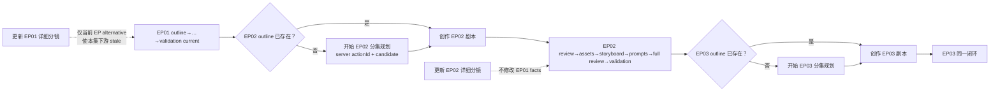
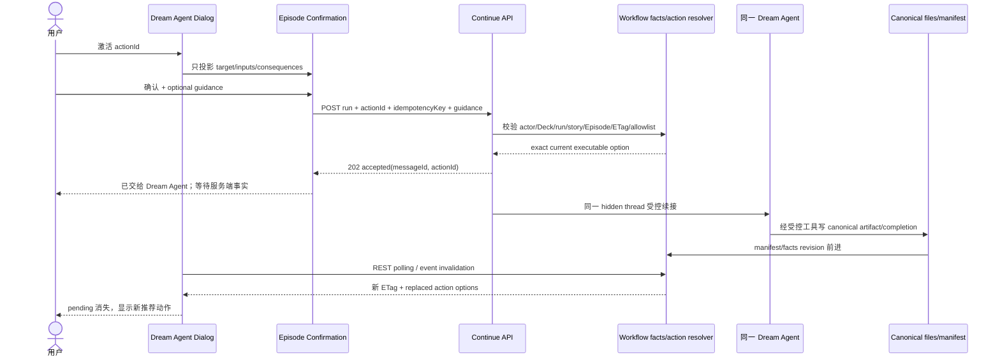
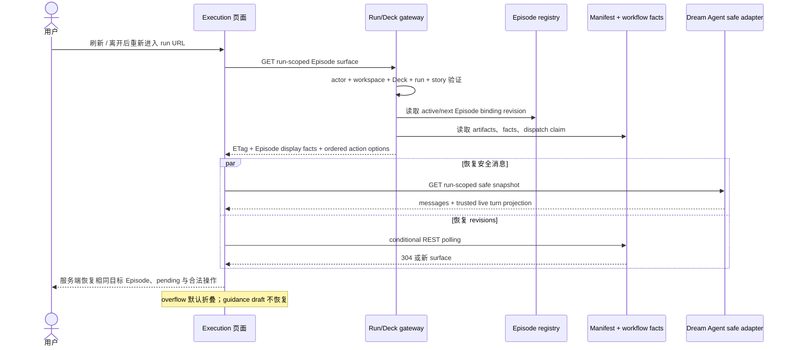
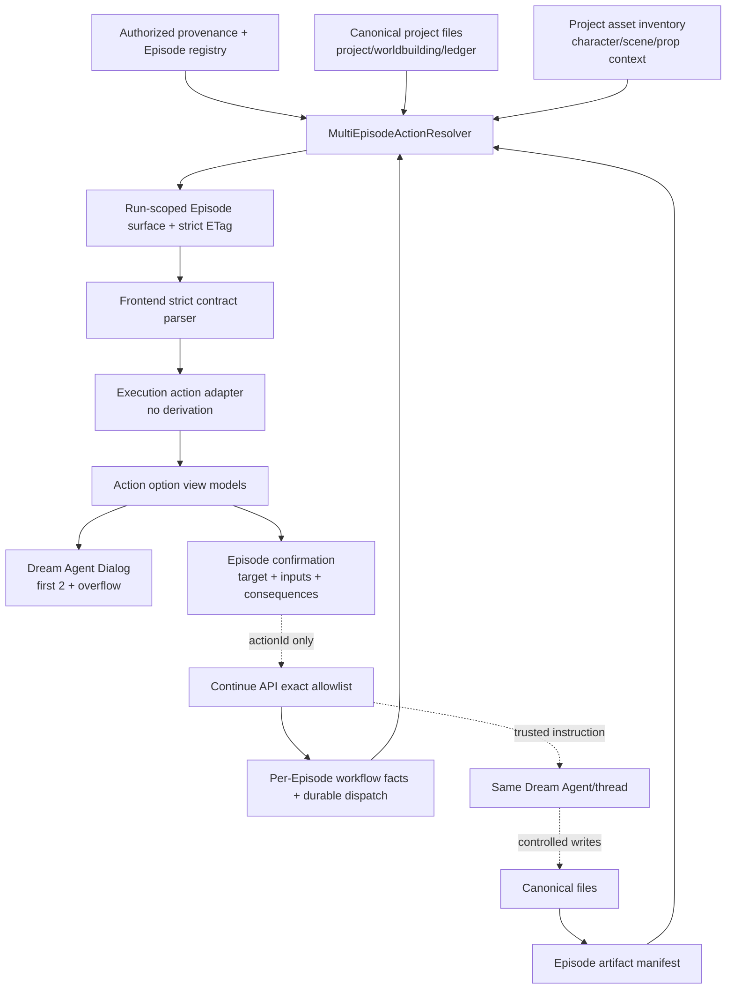
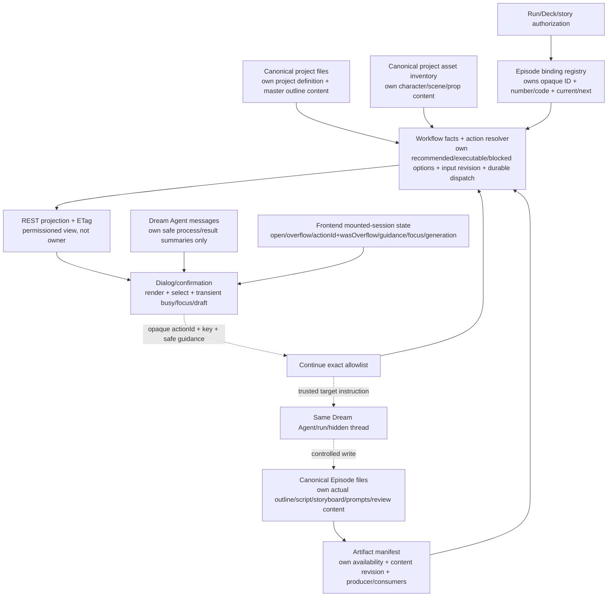
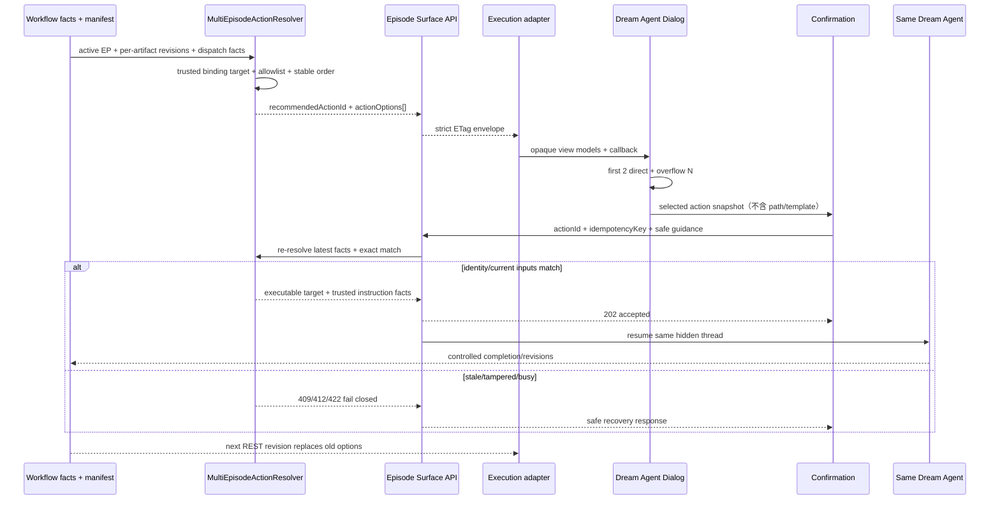

# design_011：drama-forge 多 Episode 工作流操作交互设计

> 日期：2026-08-06
>
> 状态：任务二候选稿，须通过独立评审后才能成为任务三实现输入
>
> 上游产品裁决：`2026-08-06-drama-forge-multi-episode-workflow-actions-task1-problem-decision-record.md`
>
> 增量 owner：仅拥有多 Episode workflow action projection、动作选择与确认交互
>
> 保留 owner：Dream Agent surface 仍属 `design_008`；Episode 内容与第一集工作台仍属 `design_009`；artifact 异常隔离仍属 `design_010`

## 0. 本轮规划前置器

### 0.1 Optimized Prompt

以任务一问题判定记录为唯一产品输入，新增一份独立、可实现、可测试的中文交互设计稿。设计服务端拥有的多 Episode workflow action projection，覆盖 EP01→EP02→EP03：后端以可信 Episode binding、artifact manifest、workflow facts 和 revisions 生成带 opaque actionId、目标 Episode、推荐性、可派发性、禁用原因、canonical inputs 与后果的动作选项；前端只负责显示、默认前两个操作、其余折叠、选择、确认、键盘与焦点状态。严格还原 vendor 的 outline→script→script review→assets→detailed storyboard→prompts→full-chain review→validation/commit，不创建“Outline 分镜”虚构状态。提供完整信息架构、动作文案矩阵、桌面/窄屏线框、依赖图、跨集流程图、端到端时序图、truth ownership 图和刷新/重入恢复图。设计必须符合 Ink & Memory UI Design v2，不覆盖既有 canonical owner，不泄露命令参数、路径、凭证或隐藏推理，并在完成后接受独立证据化评审。

### 0.2 Optional Enhancers

- 把服务端事实、UI 投影和短暂本地交互状态分别标注。
- 对动作的 recommended、alternative、preview、blocked、pending 和 stale 表现逐项定义。
- 在线框标出键盘顺序、焦点回归点和窄屏折行规则。
- 将每个设计字段映射到任务三合同、adapter、view model 与组件测试。
- 独立评审采用 PASS/FAIL 与文件行号；任何 FAIL 先执行返工轮规划前置器。

### 0.3 执行计划

1. 读取任务一、vendor、`design_008`—`design_010`、现有 UI 和 UI Design v2.1。
2. 定义 Episode 身份、动作 DTO、状态、排序、确认、幂等与恢复合同。
3. 完成 20 项设计主题、动作矩阵、7 类图示和桌面/窄屏线框。
4. 将设计拆成可执行的 backend、frontend、browser TDD 单元。
5. 由独立代理只读评审；失败则返工并重新评审。

### 0.4 验收标准

- 本文第 1—20 节覆盖用户要求的 20 项设计内容。
- 单集依赖、EP01→EP03、动作时序、truth ownership、桌面、窄屏和恢复图齐全。
- 每个动作明确目标 Episode、label、description、displayCommand、disabledReason、canonical inputs 和 consequences。
- 默认最多两个直接操作，折叠数严格等于实际 overflow 数量。
- UI 不推导 EP、命令、路径或 workflow 状态；刷新和重入由服务端恢复。
- 独立评审十项质量门全部 PASS；本阶段不修改生产代码。

## 1. 背景、目标和非目标

### 1.1 背景

当前 `StoryWorkspaceDreamAgentDialog` 已从服务端接收线性的 Episode workflow action options，并把前两项直接展示、其余折叠。现行合同仍把 Episode 身份、文案、公开产品操作和文件 root 写死为 EP01，且只有唯一 next action 可以派发。证据见任务一 `§3.1—§3.5`。

本设计解决的不是“多显示两个按钮”，而是把同一 Dream Agent/run/thread 中的当前 Episode、合法重新生成动作与下一 Episode 预览/入口投影为受控操作。

### 1.2 目标

1. 让 EP01、EP02、EP03 以及后续 Episode 使用同一条可信身份和动作规则。
2. 明确展示当前 Episode 的 Prompt、详细分镜更新与下一 Episode 分集规划/实际 next action。
3. 让用户区分推荐、可执行 alternative、未来预览和暂时阻断。
4. 在确认前展示目标 Episode、动作专属 canonical inputs、revisions 和下游影响。
5. 派发后以 REST workflow facts/revisions 恢复，不让消息、localStorage 或晚响应成为 truth。

### 1.3 非目标

- 不新增名为“Outline 分镜”的状态、文件、命令或合并动作。
- 不让浏览器提交任意 EP code、slash command、path、Deck、story 或 thread 身份。
- 不重做 Episode 阅读器、Dream Agent 消息列表、ChatView 或通用工具确认。
- 不设计多 Episode 并行编辑、跨 run 搬运、Episode 删除/重排或批量付费生成。
- 不修改 vendor 文件格式、`backend/database.py` 或引入浏览器持久 workflow 状态。

## 2. vendor 多 Episode 工作流还原

README 的 canonical 顺序为：`init → plan → script → script-reviewer → asset → storyboard → prompt → full-chain review → validate/commit`，每集重复 script 至 validate/commit，资产跨集复用（`vendor/drama-forge/drama-forge/README.md:353-381`）。`/drama-plan` 可以先批量建立多个 `episode-outline.md`，所以“开始下一集”必须先检查下一 Episode 的真实 outline，而不是一律再生成 outline（同文件 `:99-115`；`drama-plan/SKILL.md:102-165`）。

### 2.1 单 Episode 命令与产物依赖图

```mermaid
flowchart LR
    Plan["/drama-plan\n项目规划"] --> Outline["EPxx episode-outline.md\napproved/current"]
    Outline --> Script["/drama-script (EPxx)\nscript.md"]
    Script --> ScriptReview["script-reviewer\nreview-report.md\nscope=script + source revisions"]
    ScriptReview --> Assets["/drama-asset\n角色/场景/道具卡 current"]
    Assets --> Storyboard["/drama-storyboard (EPxx)\nstoryboard.yaml\ngenerated_from script revision"]
    Storyboard --> Prompts["/drama-prompt (EPxx)\nprompts/*"]
    Prompts --> FullReview["script-reviewer\nreview-report.md\nscope=full-chain + source revisions"]
    FullReview --> Validate["validate/commit\n本集闭环 current"]

    Script -. "新 script revision" .-> ScriptReview
    ScriptReview -. "使旧 assets/storyboard/prompts/review/validation stale" .-> Assets
    Storyboard -. "重新生成使 prompts/full review/validation stale" .-> Prompts
```



### 2.2 产物边界

| 名称 | owner/形态 | 不是 | 证据 |
| --- | --- | --- | --- |
| Episode outline | `episodes/EPxx/episode-outline.md` | Dream 初稿 storyboard 摘要 | README `:99-115` |
| Dream storyboard 摘要 | `.dream` stage 投影，display name/summary/source/relations | vendor 八层 detailed storyboard | `backend/story_workspace/contracts.py:662-711` |
| script | `episodes/EPxx/script.md` | outline 或 detailed storyboard | `drama-script/SKILL.md:15-25` |
| review | 同路径 `review-report.md`，scope + source revisions 决定含义 | 永久的“全链路已完成”状态 | `episode_auxiliary_artifact_adapter.py:1539-1569` |
| detailed storyboard | `episodes/EPxx/storyboard.yaml` | outline 直出或 Dream 摘要 | `storyboard-table.md:1-25` |
| Prompt 包 | `episodes/EPxx/prompts/*` | storyboard 的一部分 | README `:160-171` |

## 3. Outline、script、review、storyboard、prompt 的动作边界

### 3.1 合法推进

| 当前事实 | 推荐动作 | 合法 alternative | 仅预览/阻断 |
| --- | --- | --- | --- |
| outline 缺失 | 开始 EPxx 分集规划 | 无 | script 及后续均为 preview |
| outline current、script 缺失/stale | 创作 EPxx 剧本 | 无 | review 及后续为 preview |
| script current、script review 缺失/stale | 审阅 EPxx 剧本 | 重新创作剧本（若产品保留） | assets 及后续为 preview |
| script review APPROVED/current、assets stale | 更新 EPxx 资产引用 | 无 | storyboard 及后续为 preview |
| assets current、storyboard 缺失/stale | 生成/更新 EPxx 详细分镜 | 无 | Prompt 及后续为 preview |
| storyboard current、Prompt 缺失/stale | 生成 EPxx Prompt 包 | 基于最新剧本更新 EPxx 详细分镜 | full-chain review/next Episode 为 preview |
| prompts current、full-chain review 缺失/stale | 审阅 EPxx 完整产物 | 基于最新剧本更新 EPxx 详细分镜 | validation/next Episode 为 preview |
| full-chain APPROVED、validation stale | 校验并提交 EPxx | 基于最新剧本更新 EPxx 详细分镜 | next Episode 为 preview |
| validation current | 有 next：下一 Episode 实际入口；终集：准备当前 EPxx 渲染与配音指引 | 基于最新剧本更新当前 EPxx 详细分镜；有 next 时 render guide 亦可为后续 alternative | render completion current 且无 next 时 options 为空 |

### 3.2 重新生成详细分镜

“基于最新剧本更新 EPxx 详细分镜”只在以下条件同时成立时为 `executable`：

1. target 是已绑定的当前 Episode；
2. script 存在且 script-scoped/full-chain review 对当前 script revision 仍有效；
3. assets completion 对当前 script/review input revision 仍有效；
4. 没有同一 run/thread 的冲突 active dispatch；
5. surface 不是 last-good/contract diagnostic。

确认窗口必须列出将变 stale 的 `Prompt 包、完整产物审阅、校验提交`；它不把旧文件立即删除，也不把 Agent 消息当成 revision 到达。

### 3.3 下一 Episode

- 当前 Episode validation/commit current 前，下一 Episode 只能是 `preview` 或 `blocked`。
- validation current 后，服务端解析/创建下一个可信 binding candidate。
- 若下一 Episode outline 缺失，推荐“开始 EPnext 分集规划”，公开产品入口为 `/drama-plan`。
- 若 outline 已由批次规划产生且 current，直接推荐“创作 EPnext 剧本”，公开产品入口为 `/drama-script (EPnext)`。
- 不允许“一键生成下一 Episode 分镜”；script review 和 assets 依赖不可跨越。

## 4. 当前 action options 缺口

当前 options 是从唯一 next action 开始的线性 vendor 后缀，只有第一项 `isCurrent/canDispatch`（`episode_action_service.py:607-632`；`contracts.py:962-1032`）。Execution 用 `option.action` 作为 DOM/action identity，并统一猜测未来项 disabled reason（`StoryWorkspaceExecutionPage.tsx:900-945`）。因此它无法表达：

- 同 kind 在 EP01、EP02 上的不同目标；
- 推荐 Prompt 与可执行 storyboard regeneration 并存；
- 下一 Episode 的真实 outline 有/无；
- action-specific inputs 与 consequences；
- 服务端持久 pending/accepted 投影；
- 同一 action kind 在 input revision 更新后的新 identity。

现有 dialog 的 `first 2 + overflow` 交互可以保留；需要替换的是后端 option v2 和前端 view model，而不是让前端追加本地按钮。

## 5. EP 编号与稳定身份规则

### 5.1 Episode identity

```text
authorized actor + Deck + run + story provenance
  └── revisioned Episode binding registry
        ├── opaqueEpisodeId         浏览器可见，不可解析
        ├── episodeNumber           服务端正整数，仅服务端参与逻辑
        ├── displayLabel            服务端格式化，如 EP02
        ├── canonicalRoot           只在受控后端内部
        └── relation                current / next（projection，不是用户输入）
```

- 前端只把 `displayLabel` 当文本，不做 `padStart`、数字解析、排序或路径拼接。
- `actionId` 是 server-issued opaque ID；不得包含 slash command、story slug、EP path 或可逆的文件位置。
- 下一 Episode 尚未建立正式 entry 时，服务端可在 option 内使用短期/持久的 opaque `candidateId`；浏览器仍只提交 `actionId`。
- 同 kind、不同 target Episode 或不同 canonical input revision 必须得到不同 actionId。
- legacy EP01 binding 是 registry 首项的兼容输入，不形成第二套 owner。

### 5.2 稳定恢复身份

REST snapshot identity 至少包含：

`actor + Deck + run + story authority revision + Episode registry revision + active Episode ID + workflow facts revision + manifest revision + ordered actionIds`。

idempotency provenance 至少包含：

`actor + Deck + run + story + target Episode/candidate + actionId + canonical input revision + facts revision + aggregate ETag + normalized guidance fingerprint`。

## 6. 当前 Episode 与下一 Episode 动作矩阵

| active | 当前事实 | 第 1 直接操作（recommended） | 第 2 直接操作 | overflow 示例 | 下一集规则 |
| --- | --- | --- | --- | --- | --- |
| EP01 | storyboard current；Prompt 缺失；EP02 outline 缺失 | 生成 EP01 Prompt 包 | 基于最新剧本更新 EP01 详细分镜 | current full review/validation/render + next plan/script | Prompt 优先；EP02 disabled |
| EP01 | validation current；EP02 outline 缺失 | 开始 EP02 分集规划 | 基于最新剧本更新 EP01 详细分镜 | current render + next script preview | actionId target 是 server candidate |
| EP01 | validation current；EP02 outline current | 创作 EP02 剧本 | 基于最新剧本更新 EP01 详细分镜 | current render + next script review preview | 不重复生成 outline |
| EP02 | outline current；script 缺失 | 创作 EP02 剧本 | 审阅 EP02 剧本（disabled preview） | EP02 assets/storyboard/Prompt/full review/validation/render | storyboard current 前不投影 EP03 horizon |
| EP02 | storyboard current；Prompt 缺失；EP03 outline 缺失 | 生成 EP02 Prompt 包 | 基于最新剧本更新 EP02 详细分镜 | current full review/validation/render + next plan/script | EP01 facts 不参与 EP02 input |
| EP02 | validation current；EP03 outline 缺失 | 开始 EP03 分集规划 | 基于最新剧本更新 EP02 详细分镜 | current render + next script preview | 服务端 CAS 建立 EP03 |
| EP03 | assets current；storyboard stale | 基于最新剧本更新 EP03 详细分镜 | 生成 EP03 Prompt 包（disabled preview） | current full review/validation/render previews；无 EP04 | storyboard current 前不开 next horizon |

### 6.1 EP01 → EP02 → EP03 扩展流程图



## 7. Dream Agent Dialog 工作流操作信息架构

动作区位于 Agent 状态/安全消息历史之后、自由留言 composer 之前；工具确认出现时，沿用 `design_008` 的 composer 替换规则，workflow actions 与自由留言一起暂时不显示，避免同时存在两个决策面。

```text
Dream Agent header / status
安全消息历史
────────────────────────
Episode 工作流
  direct action 1
  direct action 2
  更多工作流操作（N）
    overflow actions
────────────────────────
自由留言 textarea / send
```

动作区只消费 `StoryWorkspaceEpisodeActionOptionViewModel[]` 和 `onRequest(actionId)`。它不读取 manifest、ETag、run binding、path、Agent raw events 或 action template。

## 8. 默认显示的两个操作

- 服务端按相关性生成稳定有序列表；前端不排序。
- `direct = actionOptions.slice(0, 2)`；不足两项时按实际数量显示，不补占位。
- 第一项通常是唯一 `isRecommended=true` 的当前推进动作。
- 第二项优先是当前 Episode 合法 re-generation；没有合法 alternative 时，必须是当前 Episode 沿 vendor 顺序最近的 disabled preview，不能跳到更远的下一 Episode。
- 直接展示不等于可派发；`canDispatch=false` 必须为原生 disabled，并在可见正文给出真实原因。
- 稳定排序键为：`recommended → current executable alternatives（storyboard regeneration 优先）→ current 最近后续 preview → next executable → next 最近后续 preview → 其余 vendor-order previews`。同组以固定 capability rank 排序，不使用数组 index、label 或 Episode code 排序。
- 如果服务端返回多个 `isRecommended=true`、重复 actionId、可派发但无 target/canonical inputs 或 recommended 不在第一个，前端 strict parser 拒绝该 workflow projection，保留 last-good 或显示局部恢复提示，不自行修复。

### 8.1 Server-owned option inclusion 与 horizon

resolver 先决定集合，再按上节排序；前端不得裁剪或补项。设 current vendor rank 为：

`plan → script → script review → assets → storyboard → prompts → full review → validation → render guide`。

集合规则：

1. **Current suffix**：current Episode validation 尚未 current 时，纳入从 recommended capability 起到 render guide 的全部 current vendor suffix；已经完成且仍 current 的前序动作不回填。
2. **Storyboard regeneration**：已有 detailed storyboard 且最新 script review/assets 依赖允许更新时，即使该 capability 位于 recommended 之前，也作为唯一 current re-generation alternative 纳入；不得重复加入。
3. **Next horizon gate**：只有 current detailed storyboard current 时才开始投影 next horizon；此前不显示下一 Episode 预览，以免比当前 review/assets 更早占据直接操作。
4. **Next horizon width**：next horizon 只包含下一 Episode 的实际入口 capability（outline 缺失为 plan，outline current 为 script）以及它沿 vendor 顺序紧邻的一个 preview（plan→script，script→script review）。被省略的更远 capability 不改变 vendor 顺序、依赖或授权；它们在更近步骤完成后自然进入 horizon。
5. **Validation current、仍有 next**：next 实际入口为 recommended；current storyboard regeneration 与尚未完成的 render guide 是 current alternatives，next 紧邻 preview 仍保留。
6. **项目最后一集**：validation current 且 render guide 未完成时，`prepare_render_guide` 为 recommended，storyboard regeneration 为 alternative；render guide 已完成后 `NONE_IN_SCOPE`，options 为空，不把 optional regeneration 强行设为 recommended。
7. **上限**：storyboard 尚未 current 时最多是 9 项 current suffix；storyboard current 后 current suffix 最多 4 项，加最多 1 个 regeneration 和 2 个 next horizon，仍最多 7 项。故 `0 ≤ actionOptions.length ≤ 9`、`0 ≤ N ≤ 7`。

确定性快照：

| facts | ordered options | direct/overflow |
| --- | --- | --- |
| EP01 outline 缺失 | current plan, script, script review, assets, storyboard, prompts, full review, validation, render | 2 + 7 |
| EP01 storyboard current、Prompt 缺失、EP02 outline 缺失 | current Prompt, current storyboard update, current full review, current validation, current render, next plan, next script | 2 + 5 |
| EP01 validation current、EP02 outline current | next script, current storyboard update, current render, next script review | 2 + 2 |
| 项目最后一集 validation current、render 未完成 | current render, current storyboard update | 2 + 0 |
| 项目最后一集 render completion current | 空（`NONE_IN_SCOPE`） | 0 + 0 |

## 9. “更多工作流操作（N）”展开与折叠

公式：

```text
directCount = min(actionOptions.length, 2)
overflowCount = max(actionOptions.length - directCount, 0)
N = overflowCount
```

- `N=0` 时 disclosure 不渲染。
- 展开或折叠不改变 N；revision 到达导致列表变更时按新 snapshot 重算。
- 按钮使用 `aria-expanded`、`aria-controls`；overflow 是命名 group，不是菜单角色。
- 第一次 Escape：若 overflow 展开，则只折叠并把焦点还给 disclosure。
- 第二次 Escape：关闭 Dream Agent Dialog 并把焦点还给外部 Agent trigger。
- 如果 overflow 打开时 revision 删除了所有折叠项，自动关闭；若当前焦点随项消失，焦点回 disclosure，不跳到页面顶部。
- overflow 的最大高度允许内部纵向滚动；不得产生整页水平滚动。

## 10. 动作状态与视觉区别

| 状态 | 合同事实 | 视觉/文案 | 交互 |
| --- | --- | --- | --- |
| recommended executable | `isRecommended=true, availability=executable, canDispatch=true` | Action Brown 细线/“推荐 · 可执行”文字 | 可点击、Tab 可达 |
| executable alternative | `isRecommended=false, executable, canDispatch=true` | 普通 Ink 标题/“可执行” | 可点击、Tab 可达 |
| preview | `availability=preview, canDispatch=false` | Muted 文本/“后续预览”+ disabledReason | 原生 disabled，不进 Tab |
| blocked | `availability=blocked, canDispatch=false` | 警示符号+“暂不可用”+具体原因；不只靠颜色 | 原生 disabled |
| pending | server `dispatchState=accepted|dispatching` 或同 action 本地未决提交 | “处理中 · 等待服务端事实更新” | disabled；刷新后由服务端继续投影 |
| dispatched | 技术 claim 已结束，但尚在等待 safe snapshot/facts 收敛 | “本轮已结束，正在检查新产物” | 短暂 disabled；不是 Episode 完成 |
| stale/replaced | actionId/input revision 已被新 snapshot 替换 | 旧项立即退出；新项按新事实出现，polite 播报一次 | 旧回调/晚响应被 generation gate 丢弃 |

不新增“workflow failed/retry”业务状态。网络/contract 异常显示“正在读取最新工作流事实”，不把 blocked 伪装成失败。

UI 采用现有语义 token：Warm Canvas、Paper Cream、Charcoal/Body/Warm Brown、Action Brown、Border Paper；用留白、字重和细线而非卡片/阴影堆叠。依据 `docs/prd/Ink & Memory UI Design v2.pdf` 第 4—5 页和 `StoryWorkspaceDreamPage.css:1-16,404-471`。

## 11. 动作内容合同：label、description、displayCommand、disabledReason

### 11.1 DTO 目标态

```ts
type EpisodeActionAvailability = 'executable' | 'preview' | 'blocked';
type EpisodeActionRelation = 'current' | 'next';
type EpisodeActionDispatchState = 'idle' | 'accepted' | 'dispatching' | 'dispatched';

interface StoryWorkspaceEpisodeActionOptionV2 {
  actionId: string; // opaque, server-issued
  kind: StoryWorkspaceEpisodeActionKind;
  targetEpisode: {
    opaqueEpisodeId: string | null;
    candidateId: string | null;
    displayLabel: string;
    relation: EpisodeActionRelation;
  };
  label: string;
  description: string;
  displayCommand: string;
  availability: EpisodeActionAvailability;
  isRecommended: boolean;
  canDispatch: boolean;
  disabledReason: string | null;
  canonicalInputs: readonly EpisodeActionCanonicalInput[];
  consequences: readonly string[];
  dispatchState: EpisodeActionDispatchState;
}
```

约束：`opaqueEpisodeId` 与 `candidateId` 恰有一个；current 必须有 opaque ID；next 未绑定才可用 candidate；`displayCommand` 仅作后端审定的 vendor 产品入口显示，永不回传。

#### OptionV2 精确状态不变量

| availability | dispatchState | canDispatch | disabledReason | 合法性 |
| --- | --- | --- | --- | --- |
| executable | idle | `true` 或被 run-level busy 临时置为 `false` | `true` 时 null；`false` 时必须非空 | 合法 |
| executable | accepted/dispatching/dispatched | false | 必须是公开技术收敛原因 | 合法 |
| preview | idle | false | 必须非空 | 合法 |
| blocked | idle | false | 必须非空 | 合法 |
| preview/blocked | accepted/dispatching/dispatched | false | 任意 | 非法 |
| preview/blocked | 任意 | true | 任意 | 非法 |
| executable | accepted/dispatching | true | 任意 | 非法 |

- 非空 `actionOptions` 恰有一个 `isRecommended=true`；其 actionId 必须等于 projection 的 `recommendedActionId` 且必须是首项。
- `NONE_IN_SCOPE` 时 options 为空、`recommendedActionId=null`，不会渲染一个“没有步骤”的按钮。
- `accepted/dispatching` 永不可派发；非 idle 只允许曾经 executable、正在技术 claim 中或等待终止收敛的 action。`dispatched` 是技术 claim 终态，不是 Episode 业务状态。服务端/safe snapshot 完成第 15.4 节的收敛后，同一未变化 action 重新投影为 `idle` 并轮换客户端 idempotency key。
- 所有不可派发项都必须有安全、非空、用户可见的 reason；前端只可叠加 Agent busy/last-good 的瞬时原因，不能覆盖 canonical reason。

### 11.2 全量 capability 文案与依赖合同

下表覆盖 `StoryWorkspaceEpisodeAction` 全量 allowlist。EP01 仅为实例；服务端从 target binding 生成 EP02/EP03 文案，浏览器不存在 `.replace('EP01', ...)`。`inputs` 使用第 13 节的公开判别类型。

| capability / intent | label | description | displayCommand | canonical inputs | consequences | disabledReason 示例 |
| --- | --- | --- | --- | --- | --- | --- |
| `plan_episode` current/next missing outline | 开始 EP01 分集规划 | 在当前项目规划中建立或更新 EP01 分集 outline；下一集动作仅在上集 validation current 后可执行。 | `/drama-plan` | project definition/master outline/worldbuilding/character-arc ledger/asset inventory context；next 时加 prior validation fact | 若重规划已存在当前集：script 及下游 stale | 完成上一 Episode 完整产物校验后可用 |
| `write_script` | 创作 EP01 剧本 | 使用已批准的 EP01 outline 和项目角色/场景上下文创作本集剧本。 | `/drama-script (EP01)` | episode outline required；worldbuilding/character-arc ledger/asset inventory context | script review、storyboard、Prompt、full review、validation stale | EP01 outline 尚未批准或已过期 |
| `review_script` | 审阅 EP01 剧本 | 让 script-reviewer 审阅当前 EP01 script revision，并写入 script-scoped report。 | `script-reviewer · EP01 剧本` | episode script、outline context | 旧 assets completion 与下游在 source revision 不匹配时 stale | EP01 剧本尚未生成或已过期 |
| `refresh_assets` | 核对 EP01 资产引用 | 按已审阅剧本核对并补齐跨集角色、场景与道具上下文，记录本集受控 completion。 | `/drama-asset` | episode script + script review；project asset context | 旧 storyboard 及下游在 completion input 改变时 stale | EP01 剧本审阅尚未适用于最新剧本 |
| `regenerate_storyboard` first | 生成 EP01 详细分镜 | 使用当前已审阅剧本与最新资产引用首次生成八层 detailed storyboard。 | `/drama-storyboard (EP01)` | episode script + script review；`refresh_assets` workflow fact；asset context（展示） | Prompt、full review、validation 尚待生成 | 先完成 EP01 剧本审阅和资产引用 |
| `regenerate_storyboard` update | 基于最新剧本更新 EP01 详细分镜 | 重建当前 detailed storyboard；Prompt、完整审阅与校验将需要更新。 | `/drama-storyboard (EP01)` | 同上；已有 storyboard 为 context | prompts、full review、validation stale | 剧本审阅或资产引用尚未适用于最新 revision |
| `generate_prompts` | 生成 EP01 Prompt 包 | 从 EP01 当前 detailed storyboard 生成逐镜头 Prompt 包，并使用同集 script 的情绪上下文与角色/场景锚点。 | `/drama-prompt (EP01)` | episode storyboard required；episode script emotional context；asset anchors context | full review、validation stale | EP01 详细分镜尚未生成或已过期 |
| `review_full_chain` | 审阅 EP01 完整产物 | 审查当前 outline、script、storyboard 与 Prompt revisions，写入 full-chain report。 | `script-reviewer · EP01 完整链路` | episode outline/script/storyboard/prompts | validation stale | EP01 Prompt 包尚未生成或已过期 |
| `validate_episode` | 校验并提交 EP01 | 按当前 full-chain review 与全部 canonical revisions 校验本集闭环。 | `校验并提交 · EP01` | episode outline/script/storyboard/prompts/review；full-chain fact | 无创作文件覆盖；形成 current validation fact | EP01 完整产物审阅尚未批准或已过期 |
| `prepare_render_guide` | 准备 EP01 渲染与配音指引 | 基于已校验的 EP01 storyboard/Prompt 包准备渲染与配音后续指引。 | `/drama-render + /drama-voice · EP01` | episode storyboard/prompts/review；validation fact | 不改变 Episode 创作链 revisions | 先完成 EP01 校验提交 |
| `none_in_scope` | 不进入 action options | 本期范围内没有可派发 capability。 | 不显示 | 无 | 无 | 无；options 必须为空 |

`prepare_render_guide` 保留为同一 allowlist 的当前 Episode 可执行 alternative；按照任务一裁决，validation current 且仍有 next 时，下一 Episode 的实际入口仍可作为 recommended，storyboard update 保持显式 re-generation alternative，render guide 依稳定 capability rank 进入其后位置。项目最后一集没有 next candidate 时，render guide 按 vendor rank 成为 recommended；完成后 options 为空。本设计不宣称 render/voice artifact 已生成，也不把它作为开始下一 Episode 的前置条件。

## 12. 动作确认窗口

### 12.1 打开与层级

- 激活可执行 action 后，Execution parent 记录 `actionId + wasOverflow + current action snapshot identity`，关闭 Dream Agent Dialog，再打开既有 Episode confirmation modal；任一时刻只有一个 `role=dialog`。不得保存已卸载的 DOM element。
- 标题格式：`确认：{label}`；副标题：`目标 Episode：{targetEpisode.displayLabel}`。
- confirmation 只投影选中的 server option snapshot；guidance draft 由 Execution mounted-session state 持有并受控传入。提交前服务端仍重新解析最新 actionId。
- 取消时 parent 重新打开 Dream Agent Dialog，并传入 `initialWorkflowFocus={actionId, wasOverflow}`。Dialog 先按 `wasOverflow` 展开 overflow，再在新挂载的 `Map<actionId, HTMLElement>` ref 中聚焦；若 actionId 已被 revision 替换，焦点回 disclosure（原项在 overflow）或动作区 heading。
- 成功接受后关闭 confirmation，不自动重开 Agent Dialog；焦点回外部 Agent trigger，并以 `role=status` 宣告“已交给 Dream Agent，等待服务端事实更新”。

### 12.2 内容顺序

1. target Episode display label；
2. action label 与 description；
3. `canonicalInputs`（仅本动作依赖，不是所有 manifest 项）；
4. `consequences`（若为空则不渲染）；
5. 可选安全 guidance；
6. 取消 / 确认并交给 Dream Agent。

confirmation 不显示 actionId、opaque Episode ID、ETag、绝对路径、raw slash command 参数、hidden thread、tool args、内部 prompt 或凭证。公开 `displayCommand` 可留在原动作行，不必在确认窗口重复。

409/412 表示所选 action snapshot 已 stale：parent 关闭旧 confirmation、刷新 surface，但保留 mounted-session guidance，并把它绑定到原 `targetEpisode + kind`。用户再次选择同 target/kind 的新 action 时可看到原草稿；切换 target/kind、离开页面或卸载即丢弃。再次确认必须重新执行前端字符限制与后端 guidance validator，绝不自动提交。

## 13. Canonical inputs 与 revisions 展示

canonical inputs 是带 owner 的公开判别联合，不能把 project assets、workflow completion 或 project plan伪装成 Episode manifest artifact：

```ts
type EpisodeActionCanonicalInput =
  | {
      sourceType: 'episode_artifact';
      artifact: 'episode_outline' | 'script' | 'review_report' | 'storyboard' | 'prompts' | 'renders';
      owner: 'episode_artifact_manifest';
      label: string;
      availability: 'available' | 'not_generated' | 'invalid' | 'unavailable';
      publicRevision: string | null;
      revisionKind: 'content';
      requirement: 'required' | 'context';
    }
  | {
      sourceType: 'project_artifact';
      artifact: 'project_definition' | 'master_outline' | 'worldbuilding' | 'character_arc_ledger';
      owner: 'canonical_project_files';
      label: string;
      availability: 'available' | 'not_generated' | 'invalid' | 'unavailable';
      publicRevision: string | null;
      revisionKind: 'content';
      requirement: 'required' | 'context';
    }
  | {
      sourceType: 'asset_context';
      context: 'character_scene_prop_inventory';
      owner: 'canonical_project_asset_inventory';
      label: string;
      availability: 'current' | 'stale' | 'unavailable';
      publicRevision: string | null;
      revisionKind: 'aggregate';
      requirement: 'context';
    }
  | {
      sourceType: 'workflow_fact';
      fact: 'refresh_assets_completion' | 'full_chain_review' | 'validation' | 'prior_episode_validation';
      owner: 'episode_workflow_facts';
      label: string;
      availability: 'current' | 'stale' | 'missing';
      publicRevision: string | null;
      revisionKind: 'input' | 'facts';
      requirement: 'required';
    };
```

- Episode artifact availability/revision 来自 manifest；`assets` 不是 manifest artifact。
- project artifact 的 public revision 由受权后端对 allowlisted canonical project file 计算，不返回路径。
- asset context 只展示受控项目资产 inventory 的聚合状态；storyboard 的强制执行依赖仍是与当前 script/review 绑定的 `refresh_assets_completion` workflow fact，不能用“资产文件存在”替代。
- plan 展示 project definition/master outline，并把 worldbuilding、character-arc ledger 与 character/scene/prop asset inventory 作为 context；next plan 另要求 `prior_episode_validation` fact。
- script 要求目标 Episode outline；worldbuilding、character-arc ledger 与 asset inventory 为可信 context。
- Prompt 只以 current storyboard 为 required artifact；同集 script 情绪上下文与角色/场景 anchors 是 context。context revisions 进入 trusted instruction/idempotency aggregate，但 context unavailable 是否阻断必须由该 capability 的服务端 requirement 判定，不能由 UI猜测。
- `publicRevision` 只作 opaque 比对和展示；`revisionKind` 告知 UI 文案使用“内容 revision”“聚合 revision”“输入 revision”或“事实 revision”，UI 不解释哈希格式。
- 任一 required input 在确认打开后改变，提交得到 409/412；按第 12.2 节保留 mounted-session guidance、刷新 facts，并要求用户显式重新确认。

## 14. 成功提交、处理中与 REST revision 到达



HTTP 202 只表示持久接受，不表示 artifact 成功。writer event 只触发 REST invalidation；内容和动作完成分别由 manifest/facts revision 证明。

## 15. 刷新、离开、重新进入的恢复

### 15.1 状态 owner

- durable：run/Deck/story binding、Episode registry、manifest、workflow facts、dispatch claim/message metadata。
- mounted session only：dialog open、overflow open、selected `actionId+wasOverflow`、`targetEpisode+kind` scoped guidance draft、focus intent、Abort/generation、last-good。
- 不持久化：localStorage/sessionStorage 中的 Episode/action/pending/facts。

### 15.2 恢复时序图



### 15.3 晚响应与 revision 竞争

- 每个 fetch/submit ticket 带 mounted generation + requested snapshot identity。
- 新 ETag/facts/actionIds 到达后提高 generation；旧 202、旧 GET、旧 message settle 均不能覆盖新 action list。
- accepted action 在刷新后只能从服务端 dispatch projection 恢复；没有 durable projection 时 UI 不声称“处理中”，只重新读取事实。
- workflow projection 失败但 mounted last-good 存在时，可继续显示旧项但全部禁用并标记“正在验证最新事实”；刷新后没有 browser cache 可回退。

### 15.4 Agent turn 结束但没有新 artifact 的收敛

`accepted → dispatching → dispatched` 是持久技术 claim，不是 Episode 生命周期。HTTP 202 后 parent 保存 response `messageId`：

1. `accepted/dispatching` 或 Dream snapshot busy 时保持 disabled 并低频读取 REST；时间经过不等于完成。
2. 只有 safe snapshot 中出现同一持久 user `messageId`，同时 `lifecycle=idle`、`activeTurnId=null`、`canSend=true`，才认为技术轮次结束；公共 assistant 文本不是必要条件。
3. 若 Episode ETag、facts、input revision 或 actionId 已变化，按新 surface 正常替换旧 action。
4. 若轮次结束而 Episode/action input identity 未变化，服务端 action projection 将该终止 claim 收敛回 `dispatchState=idle`；前端清除 accepted latch、轮换 idempotency key，提示“本轮结束但尚未检测到新产物”，允许用户再次执行当前服务端授权 action。
5. `dispatched` 最多是终止检测与下一次 REST projection 之间的技术过渡；不得永久显示“处理中”，也不得声称 artifact 成功。

## 16. 多 Episode 扩展规则

1. 同一时刻 action projection 最多覆盖 active current 与它的 next Episode；不把整季全部 Episode 动作塞进 dialog。
2. current Episode 完成 validation 后，next action 可以在当前窗口内可执行；当 next 真正升为新的 active current 后，previous Episode 不再出现在当前 Dialog。需要更新旧集时，必须由服务端另一个受控入口把它重新选为 current，本期 Dialog 不表达 `previous` relation。
3. 同一 run/thread 可以连续处理 Episode，但 facts、manifest input revision 和 action IDs 按 Episode 隔离。
4. 项目 Episode 总数是 server plan fact；到达上限后不显示 next candidate。
5. next binding 创建使用 CAS；并发相同 actionId/idempotency 返回同 accepted，不同 key 也只能有一个 run/thread active dispatch。
6. Episode reorder/delete 本期不做；服务端发现 registry 不连续或 authority 冲突时 fail closed，返回安全 blocked reason，不让 UI重编号。
7. 当前 EP 的 storyboard regeneration 必须明确指定 server actionId；浏览器不能通过切换 display label任意访问 previous/next Episode。

## 17. API、adapter、view model、component 边界

### 17.1 边界图



### 17.2 后端

- binding service：episode identity/registry/CAS/legacy EP01 compatibility。
- artifact service/manifest：target Episode canonical availability/revision；不拥有 recommended action。
- action resolver：生成 ordered options、recommendedActionId、disabled reason、inputs、consequences、dispatch projection。
- gateway/router：run-scoped actor/Deck/story/episode authorization；错误主体统一不可见。
- Continue service：只接受 actionId/key/guidance，按最新 facts exact revalidate。
- instruction template：从服务端 target binding 渲染 EPxx 与 allowlisted action intent，不采用客户端 displayCommand。
- completion writer：校验 trusted action claim、target Episode 和 input revision 后写 facts。

### 17.3 前端

- strict parser：拒绝结构矛盾、重复 ID、多 recommended、target relation 不合法、dispatch/availability 不一致。
- Episode hook：ETag、polling、Abort/generation、session last-good；不从消息恢复动作。
- Execution adapter：透传 option 字段，加 Agent busy/last-good 等短暂 UI gate；不生成业务 disabledReason。
- Dialog：展示、前二/overflow、Escape、重新挂载后的 action ref map/focus；不持有 facts。
- Execution confirmation adapter：拥有 mounted-session selected action intent 与 target/kind-scoped guidance draft；处理提交与 409/412 恢复。Confirmation component 只受控渲染。
- Dream Agent adapter：只展示过程与结果摘要；message settle 可触发刷新，不能完成 action。

## 18. 响应式和键盘交互

### 18.1 桌面

- 保持现有约 420px execution dialog；动作文字允许换行，target EP 必须完整可见。
- action 行最小 44px；description 可以两至三行，displayCommand 使用次级 monospace。
- overflow 最大高约 176px、内部滚动；消息历史与 composer 不被撑出 dialog 最大高度。
- 确认 modal 与 Agent dialog 不同时 mount；背景不新增第二套 Chat surface。

### 18.2 窄屏

- `<768px` 沿用 fixed bottom sheet / 近全屏层：左右 8px、最高 88dvh、背景 inert、锁滚动、modal focus trap。
- action 行单列；label、description、status、displayCommand 自然折行，不横向裁剪 EP label。
- 软键盘出现时确认按钮与 guidance 仍可滚动到达；无整页水平溢出。
- 所有触控目标至少 44×44 CSS px；200% 文本缩放仍可操作。

### 18.3 键盘与播报

- Tab 顺序：收起 → 消息交互 → direct 可执行 action → disclosure → overflow 可执行 action → guidance/free composer → 发送。
- disabled preview 不进入 Tab，但其 label/reason 在 DOM 中可由浏览模式读取。
- Enter/Space 激活动作并进入 confirmation；确认打开后聚焦 guidance 或标题（无 guidance 时）。取消时 parent 以 actionId+wasOverflow 重开 Dialog，Dialog 展开必要 overflow 后用新 ref 聚焦，绝不聚焦已卸载节点。
- Escape 栈：overflow → Dream dialog → external trigger；confirmation Escape → 取消并回原 action。
- revision 替换只 `aria-live=polite` 播报一次“工作流操作已根据最新产物更新”，不抢焦点。
- `prefers-reduced-motion` 关闭平滑位移/高度动画；状态不只靠颜色；焦点环 Action Brown 2px + 3px offset。

## 19. 桌面与窄屏线框

### 19.1 桌面折叠态

```text
Warm Canvas · Execution content                       Paper Cream dialog 420px
┌──────────────────────────────────────────┐   ┌──────────────────────────────────┐
│ Episode workbench                         │   │ DREAM AGENT              [收起] │
│ EP01 · artifact revisions                 │   │ Drama Forge · Run …7A31          │
│                                           │   ├──────────────────────────────────┤
│                                           │   │ 安全消息历史                      │
│                                           │   │ …                                 │
│                                           │   ├──────────────────────────────────┤
│                                           │   │ EPISODE 工作流                    │
│                                           │   │ 生成 EP01 Prompt 包               │ [推荐·可执行]
│                                           │   │ /drama-prompt (EP01)              │
│                                           │   │ 基于最新剧本更新 EP01 详细分镜    │ [可执行]
│                                           │   │ /drama-storyboard (EP01)          │
│                                           │   │ [更多工作流操作（5）]             │◄ focus return
│                                           │   ├──────────────────────────────────┤
│                                           │   │ 给 Dream Agent 留言…       [发送]│
└──────────────────────────────────────────┘   └──────────────────────────────────┘
```

### 19.2 桌面展开态

```text
┌──────────────────────────────────┐
│ EPISODE 工作流                   │
│ 生成 EP01 Prompt 包              │ 推荐 · 可执行
│ 基于最新剧本更新 EP01 详细分镜   │ 可执行
│ [收起工作流操作（5）]            │ aria-expanded=true
│ ┄ overflow scroll region ┄       │
│ 审阅 EP01 完整产物               │ 后续预览
│   先生成 EP01 Prompt 包           │ disabled reason 可见
│ 校验并提交 EP01                  │ 后续预览
│   先完成 EP01 完整产物审阅        │
│ 准备 EP01 渲染与配音指引          │ 后续预览
│   先完成 EP01 校验提交             │
│ 开始 EP02 分集规划               │ 暂不可用
│   完成 EP01 完整产物校验后可用    │
│ 创作 EP02 剧本                   │ 后续预览
└──────────────────────────────────┘
第一次 Escape → 收起并聚焦 disclosure；第二次 Escape → 关闭并聚焦 Agent trigger。
```

### 19.3 窄屏

```text
┌────────────────────────────────────┐
│ Dream Agent                [收起]  │
│ EP01 · 同一 Run                    │
├────────────────────────────────────┤
│ 安全消息历史（可滚动）             │
│                                    │
├────────────────────────────────────┤
│ EPISODE 工作流                     │
│ 生成 EP01 Prompt 包                │
│ 从 EP01 当前详细分镜生成逐镜头…    │
│ /drama-prompt (EP01)  推荐·可执行  │
│────────────────────────────────────│
│ 基于最新剧本更新 EP01 详细分镜     │
│ 会使 Prompt、完整审阅与校验过期…   │
│ /drama-storyboard (EP01)   可执行  │
│ [更多工作流操作（5）]              │
├────────────────────────────────────┤
│ 给 Dream Agent 留言…               │
│                             [发送] │
└────────────────────────────────────┘
8px inset · ≤88dvh · modal focus trap · no horizontal overflow
```

## 20. 本期不做与验收标准

### 20.1 本期不做

- 不让用户手填 EP number、任意命令或路径。
- 不在 UI 中生成或编辑 vendor prompt template。
- 不并行派发两个 Episode，不做跨 Episode 批量 action picker。
- 不新增 ChatView、模型选择、通用 tool trace、推理详情或 archive。
- 不把外部模型/凭证缺失用 mock 冒充真实动作成功。
- 不承诺浏览器刷新后恢复未提交 guidance/overflow/scroll。

### 20.2 产品与合同验收

- [ ] AC-01 EP01/EP02/EP03 label、displayCommand、target identity 正确且不同；actionId 不依赖数组下标或路径。
- [ ] AC-02 服务端 binding 唯一拥有 Episode number/code；前端无 EP 格式化、slash command 拼接或 user path。
- [ ] AC-03 顺序严格为 outline→script→script review→assets→storyboard→prompts→full review→validation。
- [ ] AC-04 storyboard regenerate 只在最新合法上游成立，并声明下游 consequences；Prompt 优先于 next Episode。
- [ ] AC-05 next outline 已存在时直接推荐 script；缺失时才显示“开始 EPnext 分集规划”。
- [ ] AC-06 wrong actor/Deck/run/story/Episode/actionId 在派发前拒绝；allowlist fail closed。
- [ ] AC-07 idempotency 与 durable dispatch 纳入 target Episode 和 input/facts revisions。
- [ ] AC-07a canonical inputs 以 episode/project/asset/fact 判别 owner；assets 不进入 Episode manifest，refresh-assets completion 是 storyboard 强制事实。
- [ ] AC-07b 全量 allowlist 文案、inputs、consequences 与 disabled reason 符合第 11.2 节；none 不进入 options，render guide 不冒充已生成媒体。
- [ ] AC-07c plan/script/Prompt 的 worldbuilding、character-arc ledger、asset inventory 与 script 情绪 context 符合 vendor；required/context freshness 不由 UI猜测。

### 20.3 Dialog、确认与恢复验收

- [ ] AC-08 服务端 order 前两项 direct；其余 overflow；N 始终等于实际折叠项数。
- [ ] AC-08a option inclusion/horizon 严格符合第 8.1 节；初始最多 9 项、Prompt-missing 精确 7 项、next 只预览实际入口及紧邻一步、终集 render 推荐/none 空列表可确定。
- [ ] AC-09 recommended/executable/preview/blocked/pending/stale 视觉和可访问语义可区分；disabled reason 为服务端事实。
- [ ] AC-09a preview/blocked 只能是 idle；任何非 idle preview/blocked、重复 recommended 或 recommendedActionId/首项不一致均 strict fail closed。
- [ ] AC-10 Enter/Space 进入确认；确认显示 target Episode、action-specific canonical inputs/revisions 与 consequences。
- [ ] AC-11 overflow Escape、dialog Escape、confirmation cancel 的焦点恢复符合第 9、12、18 节。
- [ ] AC-12 202 只进入 accepted/pending；REST facts/revisions 到达后才替换 action；旧 pending/晚响应不覆盖新事实。
- [ ] AC-13 刷新/重入从 run-scoped backend 恢复 Episode、options 和 durable pending；不使用 browser storage 或 Agent 文本。
- [ ] AC-14 writer event 不完整/缺失时 REST polling 仍恢复；last-good 动作全部禁用。
- [ ] AC-14a turn dispatched 且无新 revision 时收敛回 idle、轮换 key、显示诚实提示并重新允许当前服务端 action，不永久 pending。

### 20.4 响应式、安全与工程验收

- [ ] AC-15 桌面最多 420px 动作区无严重截断；390px、200% 文本缩放无水平溢出且操作可达。
- [ ] AC-16 所有目标至少 44px；焦点环、aria-live、reduced-motion、disabled 浏览文本符合 v2/a11y。
- [ ] AC-16a confirmation 取消以 actionId+wasOverflow 重建 overflow/ref/focus；409/412 guidance 由 mounted parent 保留并要求重新确认。
- [ ] AC-17 页面不挂载 ChatView，不显示 raw tool args、内部 prompt、绝对路径、凭证、opaque IDs 或 debug events。
- [ ] AC-18 后端 pytest、前端 Playwright Node seam、真实 Episode E2E、`npx tsc -b`、改动前端 ESLint 全部通过。
- [ ] AC-19 真实浏览器默认停在派发前；只有安全、无覆盖/付费且明确授权时才真实派发，否则用确定性 fixture 验证提交后 UI，不能冒充真实成功。

## 21. 动作 truth ownership 图



按钮、Agent 消息和 artifact 文件都不拥有 workflow 状态。REST 是唯一恢复投影；workflow facts/resolver 是“当前可执行动作”owner。

## 22. workflow facts → action options → dialog → confirmation → Dream Agent 时序图



## 23. 设计到任务三 TDD 单元映射

| 单元 | Red 目标 | Green 边界 | 聚焦验收 |
| --- | --- | --- | --- |
| U1 facts/options | 多 target/recommended/alternative/preview、inclusion horizon、状态 truth table 合同先失败 | contracts + resolver projection | AC-03—05、08—09a |
| U2 Episode binding | EP02/03 与并发 next CAS 先失败 | binding/authority registry；不改 database.py | AC-01—02、06 |
| U3 current storyboard/prompt | stale inputs、Prompt 优先、regeneration consequences、script 情绪 context 先失败 | action resolver + typed canonical inputs | AC-03—05、07a—07c |
| U4 next Episode | outline existing/missing、horizon、上限、终集 render recommended、current validation gate 先失败 | next candidate/action rules | AC-05—09a |
| U5 instruction | 篡改 label/command/episode 不影响 trusted prompt 的测试先失败 | server template from action claim/binding | AC-02、06、17 |
| U6 Dialog | first2/N/state/Escape/focus Node seam 先失败 | view model + dialog + CSS | AC-08—09、11、15—16 |
| U7 Confirmation | target/inputs/consequences、actionId-only submit 先失败 | confirmation adapter/component | AC-10、17 |
| U8 recovery | replay、late response、refresh/reentry 先失败 | idempotency/durable dispatch/hook generation | AC-07、12—14 |
| U9 responsive/a11y | 390px、keyboard、200% zoom 先失败 | responsive CSS/focus seam | AC-11、15—16 |
| U10 docs/browser | 派发前真实证据与 fixture 状态缺失 | evidence/implementation record | AC-18—19 |

每个单元必须独立 Red → Green → 聚焦测试 → 权限/并发/恢复复核 → 仅包含本单元文件的 commit。设计/证据若迫使改变 truth owner、Episode identity、vendor 顺序或安全边界，必须先修订本文并重新独立评审。

## 24. 证据索引与现状/目标声明

### 24.1 现状证据

- vendor 顺序与每集重复：`vendor/drama-forge/drama-forge/README.md:353-381`。
- outline 批次规划：同文件 `:99-115`；`drama-plan/SKILL.md:102-165`。
- 当前 EP01 literal：`backend/story_workspace/contracts.py:1174-1193`；`episode_binding_service.py:703-732`。
- 当前 action suffix：`episode_action_service.py:607-632`。
- 当前 direct/overflow/N/Escape：`StoryWorkspaceDreamAgentDialog.tsx:40-47,137-162,303-329`。
- 当前 confirmation 与 canonical inputs：`StoryWorkspaceExecutionPage.tsx:363-470`。
- REST ETag/generation：`useStoryWorkspaceEpisodeArtifacts.ts:310-370,672-675`。
- UI tokens 与动作行：`StoryWorkspaceDreamPage.css:1-16,328-332,404-471,1204-1215`。
- UI Design v2.1：`docs/prd/Ink & Memory UI Design v2.pdf` 第 4—5 页。

### 24.2 目标态声明

本文所有 `OptionV2`、Episode registry、multi-Episode resolver、next candidate、action-specific inputs、consequences 和 durable dispatch projection 均是任务三待实现设计，不得在实现前表述为“已存在”或“已验证”。任务一后端聚焦基线为 `190 passed, 70 subtests passed in 1.92s`；前端相关基线为 13 项通过、1 项因既有 5173 端口冲突未进入产品断言，不计通过。
