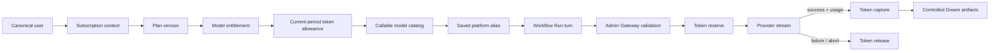
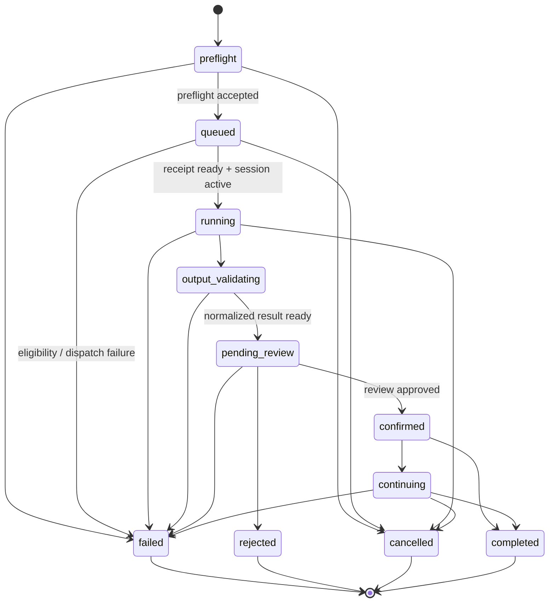
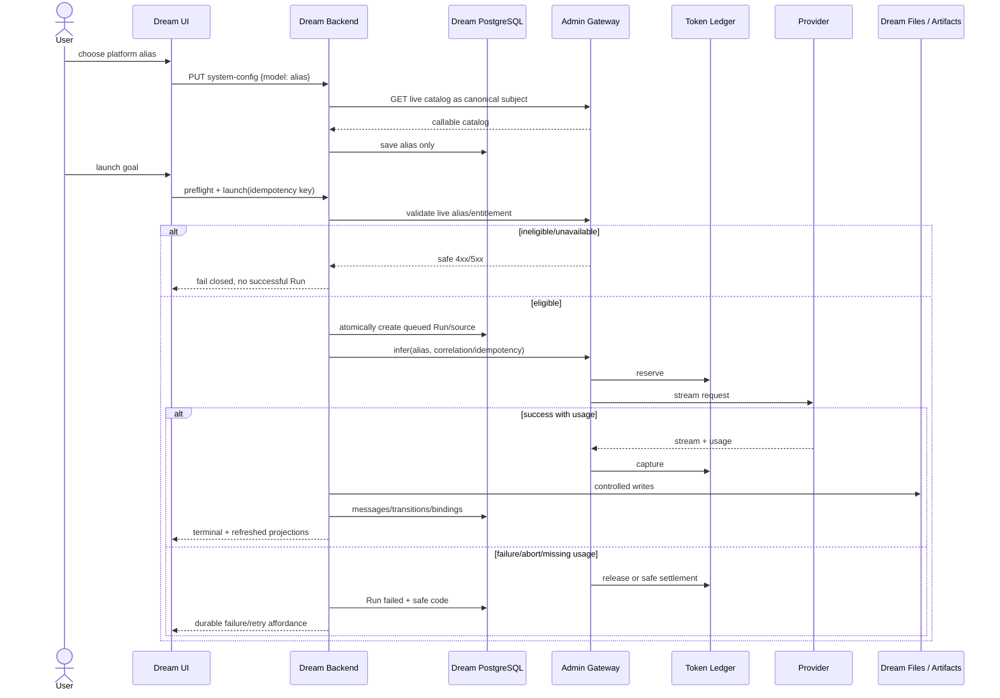

# Design 012：Dream 剧本生产主链完整性

状态：实施基线 / 2026-08-10
关联审计：`2026-08-10-dream-production-main-chain-integrity-audit.md`
替代约束：本设计修正 design_007/design_008 中“忽略 Workflow Run status”的临时策略；旧文档仍是历史证据，不再作为发布口径。

## 1. 背景、目标与非目标

### 背景

Dream 已具备模型目录、订阅 BFF、Workflow Run、Agent、Dream Files、Episode artifacts 等局部能力，但模型选择只在标准 Chat router 生效，Dream 的异步 Agent 错误也没有稳定写回 Run。用户因此可能看到“继续生成”，而服务端已经失败或实际模型未被证明。

### 目标

- 用户从 canonical 登录、订阅资格、模型选择开始，能够创建/重入 Dream Run，完成受控剧本产物并读取 Episode artifacts。
- 每一回合只使用 Admin Gateway 当前确认可调用的平台 alias；Provider、Token Ledger 和 entitlement 对浏览器不可见。
- Workflow Run、Dream Files、Agent messages、Episode binding/artifacts、Action Projection 由各自服务端真值投影，UI 不从 DOM 或按钮反推。
- loading、empty、无权限、余额不足、限流、服务不可用、模型下架、执行失败和恢复均有诚实、可访问、可重入的状态。

### 非目标

- 不在 Dream 复制 Admin 的 plan、entitlement、allowance 或 ledger。
- 不引入静态模型目录、浏览器计费算法、客户端 Provider key 或本地文件作为 Workflow 真值。
- 不绕过 Runtime Load Receipt / Agent Session 将 Run 强行设为 running。
- 本轮不授权真实收费 Provider；Provider canary 需单独审批和预算。

## 2. 当前问题与用户影响

1. Dream launch/message/confirmation/guidance 未携带服务端解析 alias：选择 UI 与实际执行/计费无法闭环。
2. launch 把“创建后台 task”当作 dispatched，忽略 stream error：用户刷新后可能继续看到生成态。
3. Run 通常停在 queued，Dream reentry 用文件和内存 turn 推导另一套生命周期：跨服务事实不一致。
4. 模型目录 refresh 失败清空 last-good：用户无法区分“平台从未返回目录”和“上一次目录可用但本次刷新失败”。
5. system-config GET 失败不显式呈现：设置页可能以默认值冒充持久配置。

## 3. 用户角色与关键任务

| 角色 | 关键任务 | 权限边界 |
|---|---|---|
| Dream 创作者 | 查看资格、选择模型、启动/继续/取消/重试、确认剧本、读取产物 | canonical actor + workspace + story + run + episode |
| Workspace 协作者 | 读取被授权 story/run/episode，按能力执行操作 | 不得越过 workspace/story binding |
| Admin Subscription/Gateway | 解析 plan/version/entitlement/allowance、alias、Provider、ledger | 不向浏览器暴露 provider credential 或内部路由 |
| Dream 后端 | 编排 Run/Agent/Files/Artifacts，保存 alias preference | 不自行计算 allowance，不拥有 Provider usage 真值 |
| QA/运维 | 在隔离环境验证错误、恢复、账本与清理 | 不对共享生产数据写入，不调用未授权收费 Provider |

## 4. 完整用户旅程

1. 页面使用 auth token 请求 Dream BFF；后端解析 canonical actor，校验 active user。
2. Subscription 页面分别读取 context 与 plans；服务端验证响应 subject 等于当前 actor。
3. Settings 请求 Gateway catalog；只展示 live catalog DTO。已加载过时，refresh 失败保留 last-good 并标注陈旧。
4. 用户选择 callable alias；PUT 只发送 `{model: alias}`。服务端重新读 live catalog 后保存 alias。
5. Dream launch 在创建 Run/消息前做 server-side model eligibility precheck；已知失败直接返回安全 4xx/5xx，不创建“成功”事实。
6. Run 经 preflight token 和 idempotency key 原子创建；replay 返回同一 Run，payload drift 返回 409。
7. 每个 Agent turn 在 context assembly 再次解析 alias，抵御保存后下架/资格变化及 TOCTOU；解析失败不调用 Provider。
8. Admin Gateway 解析 alias、验证 entitlement/allowance、reserve token、路由 Provider；成功 capture，失败或流中断 release；幂等重放不重复扣费。
9. Agent 只能通过受控工具写 characters、scenes、storyboards、reviews、prompts、render guide；文件 schema 和 workflowRunId/threadId/episode binding 必须匹配。
10. Dream Files、Agent messages、Episode artifacts 与 Action Projection 分别读取服务端真值；revision/ETag 防止陈旧写和重复投影。
11. 刷新/重入重新请求 Run + reentry + files/messages/artifacts；浏览器缓存只做 last-good，不提升为业务真值。
12. terminal failure 写入 Run/安全错误投影；用户可获得新 preflight 和新 idempotency key 发起 retry，原 Run 保持不可变来源链。

## 5. 模型、订阅、Token 与 Workflow 的关系

规则：alias preference 是 Dream 用户配置；alias 是否可调用、Provider route 和 Token 余额是 Admin 的实时事实；Run 只记录执行生命周期和安全错误码，不复制余额。

## 6. 信息架构与模块职责

| 页面/模块 | 职责 | 不负责 |
|---|---|---|
| Subscription | 当前订阅、用量、plans、变更 preview/execute | 不本地计算资格/余额 |
| Settings / Model | catalog、callable 原因、保存 alias、refresh/last-good | 不显示 Provider ID/secret，不硬编码模型 |
| Dream Start/Reentry | goal、preflight、launch、恢复真实 Run | 不从按钮/DOM 推断 run status |
| Dream Files | canonical stage/readiness/revision | 不拥有 Workflow lifecycle |
| Dream Agent Workbench | messages、SSE、cancel/retry/tool confirmation | 不把 task accepted 当 terminal success |
| Episode Workbench | binding、artifacts、action projection、ETag | 不回写 Dream 文件真值 |
| Workflow detail | status/version/transitions/error code/retry source | 不推导 entitlement 或 token balance |

## 7. 交互状态合同

| 状态 | 展示 | 可操作项 | 禁止行为 |
|---|---|---|---|
| Loading | skeleton/status，保留 last-good 内容但标记刷新中 | 取消导航 | 清空已有成功数据 |
| Empty | “尚无订阅/模型/Run/产物”的领域文案 | 去订阅、刷新、开始创建 | 将 empty 当 404 或成功完成 |
| No permission 401/403 | 登录失效或权限不足 alert | 重新登录/返回授权区 | 展示其他 actor 的任何标识 |
| Allowance exhausted 402 | 本周期 Token 已用完 + Subscription 链接 | 查看用量/套餐 | 自动现金兜底或继续 Provider 调用 |
| Rate limited 429 | 建议稍后重试，保留 last-good | 显式重试 | 无上限自动重试 |
| Unavailable 502/503 | 平台/Provider 暂不可用，显示安全 request state | 重试/返回 | 泄露 upstream body/DSN/路径 |
| Model retired 409 | 已保存模型失效，要求刷新/重选 | 刷新目录、选择 callable alias | 回退静态/Provider 模型名 |
| Run conflict 409 | 版本或幂等冲突 | 刷新 Run，基于新 revision 重做 | 覆盖服务端较新事实 |
| Validation 422 | 精确指向缺失/非法输入 | 修正并重新提交 | 创建部分 Run/产物 |
| Running/recovering | server status + last durable activity | cancel、刷新 | 用本地 spinner 证明执行 |
| Failed | Run error code、失败步骤、可恢复建议 | fresh preflight retry | 将原 Run 改回 queued |
| Completed | 只在 Run terminal + required artifacts 验证通过时展示 | 打开 Episode/导出 | 仅凭文件存在判定完成 |
| Last-good | 明示“上次成功数据/刷新失败” | 重试，必要时继续读 | 隐藏 error 或把缓存写回服务端 |

## 8. 桌面与移动布局

### 1440×1000

- 左侧：Story/Run 导航和阶段列表；主区：Dream 文件/剧本工作台；右侧：Run 状态、模型/Token 摘要链接、Agent activity。
- 失败 alert 位于主标题之后、主要操作之前，保持页面上下文，不使用遮挡式 toast 作为唯一反馈。
- Episode artifact 采用表格/分镜网格，revision 与 action 状态在行级可读。

### 390×844

- 单列顺序：标题和 Run 状态 → failure/eligibility → 主要操作 → stages/files → Agent → artifacts。
- 侧栏改为 dialog/drawer；打开后焦点进入标题/首个控件，Escape 关闭并恢复触发按钮焦点。
- 横向表格改为 card list；alias、错误码和长 ID 允许换行，不造成横向滚动。
- 固定操作栏不得覆盖 alert、输入框或系统键盘区域。

## 9. 键盘、焦点、ARIA 与错误提示

- 所有操作使用原生 button/link/input；radio catalog 有 fieldset/legend，禁用模型仍有可读原因。
- loading 使用 `role=status`/`aria-live=polite`；失败使用 `role=alert`，避免每次轮询重复播报。
- 提交后焦点留在触发控件；字段错误聚焦首个无效字段；全局失败聚焦 alert heading。
- dialog 遵循 focus trap、Escape、返回焦点；切换 viewport 不丢当前服务端 selection。
- 文案只显示安全 code 与可执行下一步，不拼接原始 exception/upstream response。
- 不使用 forced click；不可操作状态应由 disabled/aria-disabled 和清晰原因表达。

## 10. 继续、取消、重试与幂等

- Continue：基于当前 Run revision/confirmation fact 发出新 turn；服务端再次解析模型资格。
- Cancel：写 `queued|running|continuing → cancelled` 合法迁移并终止对应 Agent Session；重复 cancel 返回当前 terminal Run。
- Retry：只允许 failed/rejected/cancelled；必须 fresh preflight + 新 idempotency key；冻结 original source，写 `retryOfRunId`。
- 写请求：launch、confirmation、guidance、tool confirmation、episode action 都携带 idempotency key 或 revision/ETag；服务端对相同 key 同 payload replay，对 payload drift 返回 409。
- 网络超时后的 UI 不直接再次创建；先 GET authoritative state，再决定 replay/新请求。

## 11. 状态机与时序图

### Workflow Run 合法状态机

### 主链时序

## 12. API、DTO、并发与错误合同

| API | 关键请求/响应 | 并发合同 | 安全错误 |
|---|---|---|---|
| `GET /api/gateway/models` | strict catalog, `defaultModelAlias` | no-store/短缓存；UI last-good 仅展示 | 401/402/403/409/429/502/503 |
| `GET/PUT /api/system-config` | public config；PUT model alias only | save 时重新验证 live catalog | 401/403/409/422/5xx |
| Subscription context/plans | canonical subject-scoped DTO | service response subject 必须相等 | 401/403/409/503 |
| Workflow preflight/create | signed preflight token + idempotency key | same key/same payload replay；drift 409 | 403/404/409/422/503 |
| Workflow detail/transitions | status, `statusVersion`, safe error | version monotonic | 403/404 |
| Dream Files | run/thread scoped projection + revision | stale revision 409 | 403/404/409/422/503 |
| Dream Agent messages | safe messages/activity/terminal cursor | message idempotency + claim lease | 403/404/409/422/503 |
| Confirmation/tool confirmation | decision + revision/key | single durable decision；replay safe | 403/404/409/422 |
| Episode artifacts | binding + artifacts + revision/ETag | `If-Match`/ETag；stale 409 | 403/404/409/422/503 |
| Episode action projection | action status, attempt, artifacts | action idempotency + projection revision | 403/404/409/422/503 |

DTO 规则：严格字段集合；datetime 为 UTC ISO 投影但 DB adapter 接受 psycopg native datetime；JSONB 返回 dict/list；boolean 不用字符串/整数推断；nullable 参数必须使用绑定参数而非拼 SQL。

## 13. Truth ownership

| 事实 | 唯一所有者 | 浏览器可保存什么 |
|---|---|---|
| canonical identity | Dream auth / user DB | 短生命周期 auth credential |
| plan/version/entitlement/allowance | Admin Subscription DB | last-good display snapshot |
| callable catalog/default/provider route | Admin Gateway | last-good catalog display；不得自建目录 |
| selected platform alias | Dream system_config（保存前 Gateway 校验） | 当前表单 selection；不得保存 provider id/secret |
| token reserve/capture/release/usage | Admin Token Ledger | 只读用量投影 |
| Run status/version/transitions | Dream Workflow DB | 当前读取快照 |
| Agent stream/live cancellation | Dream Agent runtime；terminal 必须持久化 | rendering buffer，不是 terminal truth |
| canonical characters/scenes/script/storyboards/review/prompts/render guide | scoped Dream workspace files | 编辑草稿仅在明确提交前 |
| story/episode binding、artifact index、action projection | Dream PostgreSQL | ETag/revision |
| UI drawer、tab、focus、pending spinner | 浏览器 session | 仅交互状态，不参与业务推断 |

## 14. 安全、隐私和敏感信息边界

- 浏览器请求/页面/日志不得出现 Gateway service key、Provider key、JWT signing secret、完整 DSN、绝对 workspace 路径或 upstream credential。
- Dream 只向 Admin 使用 server-issued subject token；scope 最小化，subject 必须是 canonical user。
- Gateway 和 Product BFF 使用 allowlist base URL、timeout、响应大小和 strict DTO；未知 upstream body 不透传。
- actor/workspace/run/story/episode 条件必须进入每个 DB 查询和文件路径校验；404/403 不泄露跨账号存在性。
- SSE、console 和 trace 在保存前脱敏；真实 E2E 不把 auth/token 嵌入截图文件名或报告。
- PostgreSQL 测试使用隔离 clone；共享库只 SELECT/rollback；禁止 DROP/TRUNCATE/跨账号重归属。

## 15. E2E 场景—需求—接口—断言追踪

| ID | 需求 | 场景 | 接口 | 主断言 | 代码/测试归属 |
|---|---|---|---|---|---|
| M01 | live catalog | success/empty/refresh 503 last-good | gateway/models | 无静态模型；refresh 失败仍显示上次目录+alert | models BFF / ModelConfigSection / model settings E2E |
| M02 | server model | Dream launch/message/confirmation/guidance | Agent internal turn | Runner 收到保存且 live callable alias | model selection service / backend focused |
| S01 | eligibility | no subscription/no model/402 exhausted | subscription + gateway | safe status；Provider 未调用；无虚假 Run | Admin tests + Dream API/browser |
| R01 | run integrity | create/replay/409/cross actor | workflow runs | source/idempotency/statusVersion 不漂移 | WorkflowRun tests |
| R02 | durable failure | Gateway/Provider/stream abort | launch + run detail | queued→failed 合法 transition；刷新后仍可读 | launch tests + real browser |
| A01 | messages | SSE/cancel/retry/tool confirm | dream-agent/messages | terminal/error、claim、decision 幂等 | service + source/browser |
| F01 | files | stage files/review/prompts/render guide | dream-files | schema/revision/run/thread scope | file tests + browser |
| E01 | episode | binding/artifacts/actions | episode-artifacts/actions | ETag/revision/counts/action projection 一致 | artifact tests + real read-only browser |
| T01 | ledger | success/fail/replay/missing usage | Admin infer/ledger | reserve→capture 或 reserve→release，replay 不重复 | Admin unit + isolated PG E2E |
| P01 | Postgres | native types/conflicts | runtime services | datetime/JSONB/bool/null 正确，rollback 干净 | PG integration |
| U01 | responsive/a11y | 1440×1000 / 390×844 / keyboard | all pages | focus/ARIA/loading/empty/error/last-good | Chromium E2E |
| X01 | diagnostics/security | all scenarios | all | zero unexpected console/pageerror/requestfailed；无 secret/path/DSN | Playwright diagnostic collector |

双向规则：每个发布需求必须至少映射一个断言；每个 E2E 拦截/Mock 必须对应一个明确边界，不允许以“页面可见”替代服务端事实。

## 16. 验收标准

- 内部 Dream 四条回合均通过同一 server model resolver；403/409/5xx fail-closed。
- 模型设置初次失败、空目录、last-good refresh、保存 403/409/5xx 均有确定性测试。
- Run 创建/重入/权限/幂等保持通过；异步失败形成持久安全事实，不显示虚假成功。
- focused backend、Dream/Workflow/Episode 回归、PostgreSQL runtime integration、frontend source contract、Mock Chromium、真实浏览器、ESLint、TypeScript、build、`git diff --check` 有准确计数/结果。
- Mock E2E 与真实 E2E 分别标注；真实收费 Provider 未授权时不得声称已验证。
- 无共享 DB 未授权写入；自有服务、端口、clone、用户和输出资源精确清理。

## 17. 风险、回滚和诚实遗留

### 风险

- 每回合 catalog validation 增加一次 Gateway 延迟；后续可用短 TTL server cache，但 cache key 必须含 canonical subject 且不能越过 entitlement 失效边界。
- launch precheck 与 infer 之间仍存在 TOCTOU，因此 Agent context/Gateway 必须再次验证，不能只校验一次。
- 将失败写入 Run 需要识别安全 error code；未知异常统一为内部安全码，不保存原始 exception。
- 完整 running/completed 迁移依赖 Runtime Receipt/Session 与 stage validation，范围明显大于局部补丁。

### 回滚

- 共享 resolver、Agent context 接入、launch failure persistence、last-good UI 可分别回滚；保留旧 API schema，不删除数据列。
- 回滚不修改已有 Run/ledger/artifact；不通过 SQL 重写历史状态。
- 若新校验导致不可用，回滚到“阻止 Dream 启动并显示 Gateway unavailable”，不能回退到未验证模型或 Provider 直连。

### 诚实遗留 / 发布门禁

1. Dream 尚需正式接入 Runtime Reconcile → Load Receipt → Agent Session，才能合法证明 queued→running 及后续阶段。
2. 同一 Dream turn 与 Admin Token Ledger 的跨服务 correlation 需要隔离 PostgreSQL 联测。
3. 真实收费 Provider 的 usage、流中断与 release 只在获得安全 canary 授权后验证。
4. 旧 SQLite Dream browser spec 必须退役或迁移，不得纳入 PostgreSQL-only 发布证据。

在以上 1、2 未关闭前，发布报告只能声明“模型选择与失败合同已修复、产物读取局部验证”，不能声明 Dream 剧本生产全链完整。
