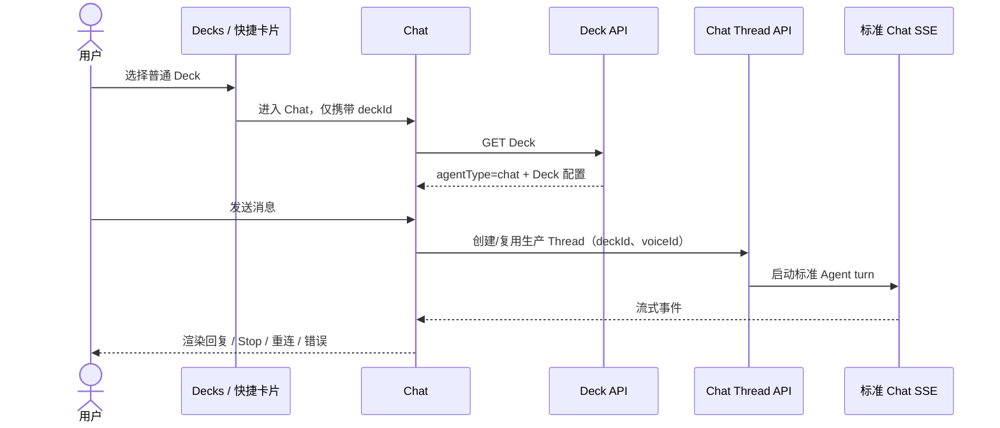
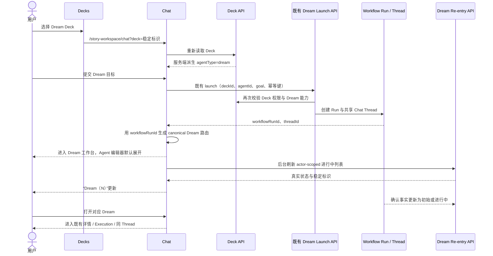

# Dream / Chat Agent Deck 交互设计

> 状态：实现基线
> 更新：2026-08-14
> 依据：`docs/prd/Chat 工作区入口页.md`、`docs/prd/Chat Dashboard.md`、
> `docs/prd/notion-session/resource-connector-ui-design.md`、本目录现行设计与
> `docs/design/dream-agent/`。参考图片只用于理解信息密度，不改变既有 Chat 结构。

## 1. 背景、问题与用户目标

现有 Deck 没有独立的 `agentType` 数据库字段，但 Deck Plugin binding 已能声明并冻结
`story.workspace.propose` 等能力。Dream 首页还维护独立的“创作设置”启动表单，Chat 落地页则在
“聊天历史”旁展示资源连接器，造成 Dream 启动入口重复，且 Deck 的普通对话与 Dream 工作流
语义不清晰。

用户需要：在 Deck 编辑时明确选择普通 Chat Agent 或 Dream Agent；从 Decks 选择 Deck 后进入
Chat；Chat 根据服务端重新读取的 Deck 能力选择标准消息入口或既有 Dream launch 入口。Dream
首页顶部优先恢复进行中的 Dream，社区区承担发现，完整清单承担历史重入。

## 2. 现状判断与属性归属

| 判断项 | 现状与结论 |
|---|---|
| Deck 配置能否直接承载类型 | `decks` 与现有 Deck DTO 没有 `agentType`/`mode`；不得擅自新增共享 Schema 字段 |
| 可复用事实 | active Deck Plugin binding、release manifest 的 `surfaces`/`capabilities` 已表达工作流能力 |
| 属性层级 | 类型是服务端从 Deck 能力声明派生的持久化业务语义，不是 URL 布尔值或仅前端状态 |
| 枚举 | 对外使用两值 `chat | dream`；显示文案与枚举分离 |
| 旧数据 | 没有 Dream 工作流 binding 的既有 Deck 解析为 `chat`；新建 Deck 默认 `chat` |
| Schema capability | 本方案复用已发布的 binding/release capability，不新增表、字段、DDL 或 SQLite fallback |

Dream 类型识别必须集中在服务端：当前 active binding 的 release 具备 Dream surface 或已发布的
Dream workflow capability 时为 `dream`，否则为 `chat`。前端只能展示服务端结果；URL 只传稳定
`deckId`，不能传可信的 `isDream=true`。

## 3. 页面信息架构

### 3.1 Deck 编辑弹窗

基础信息中增加带 `fieldset`/`legend` 的单选组：

- 普通 Chat Agent：默认值；发送输入后调用标准 Chat 生产入口。
- Dream Agent：发送输入后调用既有 Dream launch 生产入口。

选项同时显示名称与说明，不只用颜色区分。编辑时读取服务端派生类型并回显；保存类型失败时保持
弹窗打开并显示错误，不伪造成功。Deck 元数据与类型都成功后才向用户报告完整保存成功。

### 3.2 Chat 主区域

严格保留现有 PRD 的 `ChatInputDock`、快捷操作、`WorkspaceTabBar` 和历史区结构。唯一信息架构
替换发生在原资源连接器的位置：

```text
WorkspaceTabBar
├── 聊天历史
└── Dream（N）            ← 原“资源连接器”同级位置

ActiveDreamTabPanel       ← 原 ResourceConnectorTabPanel 展示区域
```

不在输入框下方另加 Dream 卡片区，不改“聊天历史”的列表、搜索、排序或空状态。资源连接器仅从
Chat 落地页隐藏；Settings 管理页、API、认证、持久化 sources 与底层组件保留。

“Dream（N）”使用 actor-scoped Dream re-entry 数据，N 取可恢复 Run 的真实总数。面板使用单一
横向滚动容器，卡片宽度随可用空间伸缩；数量超出时只在卡片轴上横向滑动，不形成第二个纵向滚动区。
卡片显示可识别标题、`初始状态 / 进行中` 状态、Deck、更新时间和“继续查看”方向提示。整张卡片
是使用服务端 `run.href` 的原生链接，鼠标点击和键盘 Enter 都进入与 Dream 首页相同的工作台。无数据
显示诚实空状态；加载失败提供重试，不回退为固定数量。

### 3.3 Dream 首页

Dream 无选中 Run 时只保留三段：

1. **进行中的 Dream**：复用 actor-scoped re-entry 结果中 `outcome=in_progress` 的真实 Run。
   默认只展示前三条，内容超过时显示“查看更多（N）”，展开后可“收起”。单条只保留 Dream 标题、
   Deck 和“继续”方向提示；生命周期、时间、装饰字母和重复状态不在摘要层展示。整条仍使用 `run.href`。
2. **社区卡组（N）**：真实可收藏 Deck 接口返回“配置指定的活动系统默认 Deck + 其他用户公开
   Deck”。系统默认项显示 `System default Deck` 来源标签，即使其兼容类型仍为 `chat` 也在这里
   展示，安装后继续沿用既有 fork 与 Dream 类型绑定路径。N 为实际结果长度；接口无结果时显示
   空状态，不造假卡片。若本地 PostgreSQL 尚未发布共享系统模板，则使用用户 Deck 接口中服务端
   标记为 `publish_block_reason=default_initialized` 的当前账号默认 Deck 作为展示回退；该项直接
   “在 Chat 中使用”，不 fork 自己，也不根据 Deck 名称推断身份。
3. **我的 Dream**：复用 actor-scoped re-entry 接口和既有详情路由，只展示 Dream 领域真实存在的
   `初始状态 / 进行中` 两态。生成中或等待确认属于初始状态；确认后执行中或最近活动属于进行中。底层 Workflow
   终态不扩展为 Dream 页面中的“完成/失败”业务状态。

原“创作设置”与独立 goal/agent 表单移除。Dream Run 详情、Execution、同 Thread 恢复保持原路由
和生产逻辑。

Dream 首页不创建自己的固定高度或滚动容器。`StoryWorkspaceLayout` 主区域是唯一纵向滚动 owner；
页头、进行中的 Dream、社区卡组和我的 Dream 按自然文档流排列。状态分组内不使用 `overflow-y:auto`，
因此桌面、窄屏和低高度视口都能滚动到最后一个 Run。Deck 卡片在宽屏使用响应式多列，窄屏回落
为单列；Run 使用信息密度更高的整行链接，并直接复用同一个 `run.href`。

首页采用无边框的“稿件索引”视觉：删除页头统计面板、英文重复眉题、section 外框、卡片外框与阴影；
只用字号、对齐和 `68–112px` 的分区留白建立层级。边框只允许出现在确有输入语义的表单控件焦点态，
不得把内容分区重新包装成 dashboard 卡片。

## 4. 模式行为与状态传递

### 4.1 普通 Chat Deck



### 4.2 Dream Deck



刷新或返回导航时，Chat 从 URL 读取 `deckId` 后重新请求 Deck；Deck 不存在、无权限或已删除时
清除无效选择并显示可恢复错误。Deck 类型发生变化时以最新服务端结果为准。提交期间禁用重复提交；
launch 使用既有幂等键。请求成功但 UI 中断时，以 re-entry 接口恢复 Run。同一 Dream 已进行中时
列表提供继续入口，不由前端复制 Run。

## 5. 加载、失败与权限状态

- Deck 类型读取中：禁用发送与类型保存，显示明确加载状态。
- Deck/Run 无权限：服务端拒绝；页面不泄露名称或状态，提供返回可访问列表的操作。
- Dream 类型 capability 不可用：类型保存或 launch fail closed，保留原值并展示可操作错误。
- 进行中的 Dream 为空：说明当前没有进行中 Run，并引导用户前往卡组页选择 Dream Deck。
- 社区卡组为空：说明“暂无公开 Dream Deck”。
- 我的 Dream 为空：提示先从卡组页选择 Deck；不重新放置独立创作表单。
- 列表失败：各分区独立失败和重试，不能用空数组掩盖网络或权限错误。

## 6. 响应式与无障碍

- Chat Dream 卡片在桌面和窄屏都保持横向轴；`grid-auto-columns:minmax(...)` 自适应宽度，
  `overflow-x:auto` 承担溢出，`overflow-y:hidden`，不产生页面级横向溢出。
- Dream 首页使用充分的 section 间距而非外框分区；进行中摘要默认三条，“查看更多”具备
  `aria-expanded`、`aria-controls` 和可见焦点。
- 页面只有 Story Workspace 主内容区一个纵向滚动条；低高度视口不得截断“我的 Dream”。
- Tab 使用现有语义与键盘行为；计数属于可读标签。卡片主操作可聚焦，焦点样式沿用当前 token。
- Agent 类型使用原生 radio 语义、可见 legend 和说明；状态同时有文字，不只依赖色彩或图标。
- 加载、保存失败与 launch 结果使用现有 live-region/toast 机制，避免无提示的状态变化。

## 7. 明确不做

- 不新增全局设计系统、工作流引擎、SSE parser、reducer 或第二套 Dream 状态机。
- 不按部署环境名称切换 Chat/Dream 行为，不在 URL 中信任模式布尔值。
- 不删除资源连接器 Settings/API/认证/数据能力，不新增点赞、排行、分类、动画或假社区数据。
- 不为视觉参考图新增无业务价值的项目区、Skill 条或复杂装饰。
- 不新增共享数据库字段；未来若必须物化类型，先由 Admin Drizzle 发布 capability。

## 8. 实现前复核

- Dream 的开始入口收敛到 Chat；Dream 首页不再维护第二套表单。
- Dream Deck 仍调用既有 launch hook/API，Chat 只做模式分派。
- URL 只携带稳定 Deck ID，刷新后重新读取类型；顶部进行中卡片与完整清单都从服务端恢复。
- 资源连接器只隐藏 Chat UI，底层能力继续存在。
- 社区数量、进行中数量和用户 Dream 都来自真实接口。
- 新增抽象仅限服务端类型派生/更新和复用型展示组件。

## 9. 可验证验收标准

1. 新建 Deck 默认 Chat；编辑两类 Deck 能正确回显与持久化，失败不伪造成功。
2. 普通 Deck 在 Chat 继续走标准 Thread/SSE；Dream Deck 在 Chat 走既有 Dream launch。
   launch 成功后使用响应中的 `workflowRunId` 进入 `/story-workspace/dream?run=...`，右侧
   Dream Agent 编辑器默认展开。
3. 刷新 `/story-workspace/chat?deck=...` 后按服务端 Deck 类型恢复，不信任前端模式。
4. Chat 中原资源连接器同级位置显示“Dream（可恢复 Run 真实数量）”，历史区无额外改版。
5. 资源连接器不再出现在 Chat，但 Settings 与内部能力未被删除。
6. Dream 首页按进行中的 Dream（真实 Run）、社区卡组（真实数量）、我的 Dream 排列，且各自具备加载/空/失败态。
7. Run 卡片只显示服务端派生的“初始状态 / 进行中”，使用真实稳定标识进入既有详情或结果。
8. Dream 首页可从页头连续滚动到最后一个 Run；Chat Dream 列表可横向滑动、卡片宽度自适应，
   整卡进入相同 `run.href`。
9. 重复 Dream 提交被阻止；权限、删除、类型变化、launch 失败均 fail closed。
10. 相关 TypeScript、lint、单元/组件测试、构建、Markdown 路径与可用 E2E 验证通过。
11. 进行中的 Dream 默认最多三条；超过三条出现“查看更多（剩余数量）”，展开/收起不改变数据顺序。
12. Dream 首页不渲染统计概览面板、section/card 边框或阴影；摘要层不重复 lifecycle 和时间。
