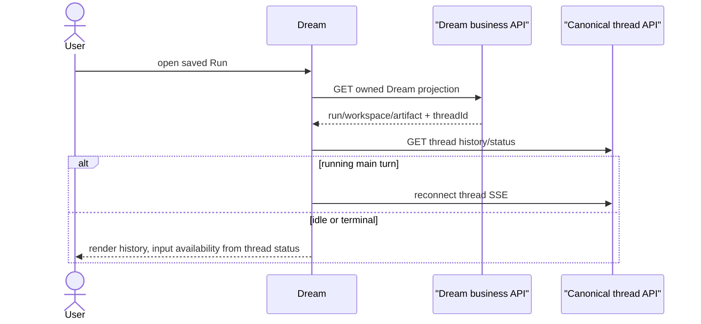
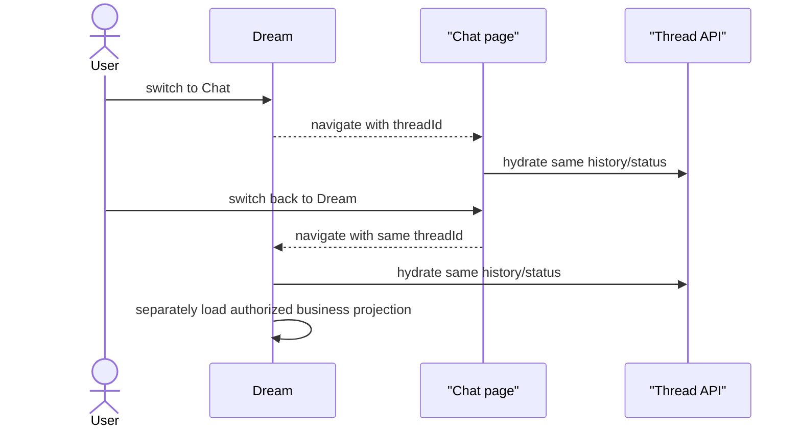

# Dream workspace and re-entry

## Eligible run discovery

Dream lists only actor-owned Workflow Runs that have valid Workspace, source
message, Thread and Deck bindings. It groups active/waiting Runs before recent
terminal Runs and sorts deterministically by business update time and Run ID.

Retry attempts are presented as one chain. The server follows
`retry_of_run_id`, validates frozen provenance and returns the single
unsuperseded leaf. Broken/cyclic graphs or multiple independent leaves fail
closed instead of guessing.

Empty results and technical failure are different states: empty offers launch;
failure keeps recovery controls and does not claim there are no Runs.

## Re-entry contract

Actor-scoped Dream business data returns the canonical `threadId` after
authorization. The page then hydrates the same Chat history/status used by Chat
and reconnects only when that Thread has a current main turn.

GET never schedules work, resumes a pending SDK session or creates a first
message. Refreshing or switching surfaces is therefore safe.

## Dream / Chat switching

No Run context is placed in a Chat request or SSE frame. Dream independently
maps the Thread to its business panels on the server.

## Agent workbench

The Dream Agent region composes the shared Chat panel. Collapsed mode may show
one safe activity summary and unread count; expanded mode shows canonical
history, text deltas, tool cards, AskUserQuestion, confirmation and Stop.

The business surface may show Artifact/workflow progress beside it, but may not:

- replace thread status with workflow status;
- synthesize messages from Observer hints;
- hide an actionable runtime confirmation;
- show Stop for historical subagent transcripts;
- treat SSE EOF as Workflow completion.

## Input state

Input enablement comes from the canonical thread state. A genuinely running main
turn disables duplicate send and exposes Stop. Historical subagent content or a
terminal business Run alone does not block input. Private system command rows
follow Chat visibility rules and never create blank bubbles.
