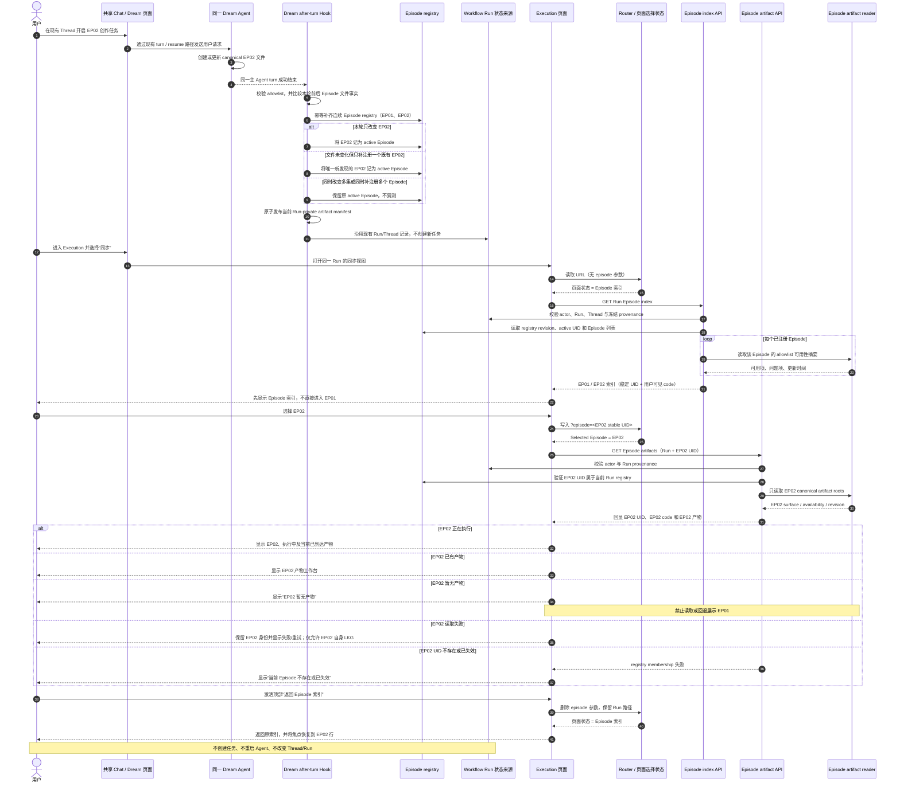

<!-- [Input] Shared Dream Thread, successful after-turn Hook, Workflow Run facts, Episode registry, Execution route selection, and Episode artifact readers. -->
<!-- [Output] Business sequence for EP02 registration, index-first navigation, per-Episode reads, branches, and return behavior. -->
<!-- [Pos] Mermaid sequence companion to episode-sync-index.md. -->
<!-- [Sync] 2026-09-02: cover changed or uniquely discovered EP02 activation through isolated artifact reading without EP01 fallback. -->

# Episode 同步索引业务时序

## 不变量

- Router、index response、artifact request 与 artifact response 必须引用同一个 Episode UID。
- Artifact ETag 与 last-known-good cache 的 identity 是 `Run ID + Episode UID`。
- URL 没有 Episode UID 时只显示索引；无条件数组首项不是合法默认值。
- EP02 不存在、无产物或失败时，页面不得显示 EP01 的标题、状态、正文或镜头。
