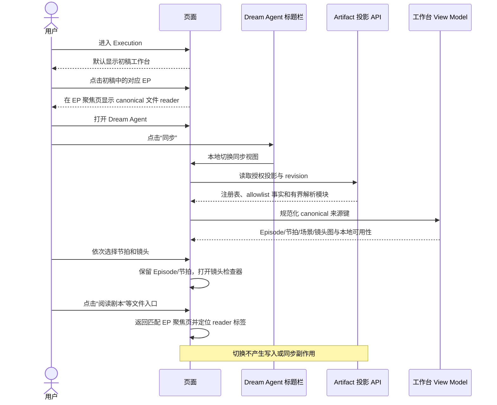

<!-- [Input] Published Project/Episode identities, Dream stage projections, and canonical Episode artifacts. -->
<!-- [Output] Product rules for draft focus, sync coordination, and responsive Episode reading. -->
<!-- [Pos] Story Workspace Project/Episode workbench interaction contract. -->
<!-- [Sync] 2026-08-31: assign the reader to its draft EP and move its overview into the list description. -->
<!-- [Sync] 2026-08-31: define the header-triggered, three-stage creation guide and its read-only future boundary. -->
<!-- [Sync] 2026-08-31: move the Dream guide entry to a run-independent static route. -->

# Project 与 Episode 工作台

## 内容层级

```text
Project
└── Episode（EP01–EP99）
    ├── 概览
    ├── 故事弧
    │   └── 叙事节拍
    │       └── 场景
    │           └── 镜头
    ├── 剧本
    ├── 分集大纲
    ├── 分镜
    └── 审阅报告
```

Episode 导航以已经发布的注册表为准，不通过目录发现推断。选择操作使用稳定的
Project、Episode 和来源键；只用于渲染的 View ID 可以派生，但不能持久化成业务身份。

## 创作阶段指引

### 背景与问题

首次进入故事线的用户需要先理解哪些工作只做一次、哪些工作要按 Episode 循环，以及尚未开放的
制作环节。若把指引混入 EP 索引，会让说明性内容看起来像一条业务产物，并打断 EP01、EP02 的
连续顺序。

### 目标与边界

绑定 Run 的 Dream 页在“创作工作空间”标题下方提供“查看短剧创作阶段指引”入口，跳转到与 Run
和 Execution 均无关的静态 `/story-workspace/creation-guide` 页面；Execution 的 Outline 标题说明
位置保留同名入口，但只在当前页面打开分镜预览式聚焦层。两个入口复用同一只读指引组件，且不
占用故事线索引条目，不建立持久化状态、Agent 调用、Hook 或数据库写入。阶段三仅说明完整制作
方向，不能展示成可执行、可确认或已交付功能。静态页返回操作使用工作台路由已记录的来源历史
回到原“创作工作空间”；Outline 原位入口仍返回当前故事线。
聚焦页只保留中性标题“短剧创作流程”，不叠加英文眉题、宣传口号或重复引导句。桌面端遵循
UI Design v2 的三功能卡结构并在一个视口内横向呈现三个阶段；卡片使用暖纸底色、12px 圆角、
轻边框和零静态阴影。窄屏再转为单列自然阅读。

### 概念与规则

| 阶段 | 业务规则 | 指令说明 |
|---|---|---|
| 阶段一 · 跨集复用 | 角色卡和场景卡首次创建并定稿后，由后续所有 Episode 复用 | `/drama-init` 初始化项目；`/drama-plan` 分集规划；`/drama-asset` 创建并定稿角色卡、场景卡 |
| 阶段二 · 每个 EP 重复 | 每一集都依次完成剧本、分镜、Prompt 包和五维度审查 | `/drama-script (EP01)`；`/drama-storyboard (EP01)`；`/drama-prompt (EP01)`；`/script-reviewer` |
| 阶段三 · 尚未实现 | 只读展示未来的渲染、配音、后期和宣发方向 | `/drama-render + /drama-voice`；`/drama-edit`；`/drama-promote` |

指引页的三段插图只承担“共享资产 → 每集循环 → 尚未开放”的关系解释，不形成第四套流程事实；
页面文本仍是可访问、可检索的权威说明，图片不能替代阶段标题和命令描述。角色身份与识别配件
来自 `docs/prd/Ink & Memory UI Design v2.pdf` 的 Mimo 定义，并按本工作台插图语境转译为“小黑”式
二维黑色手绘形象，不使用 C4D：保留笔形耳、折纸耳、黄色记忆徽章、绿色灵感星和炭棕斜挎包，
但让黑色主体轮廓保持第一识别层。三个阶段复用同一张角色原图的不同画面段，避免独立生成造成
角色走样。

## 阅读交互

进入 Execution 时默认显示“初稿”：人物、场景和分镜 stage 直接占据主工作面，不再包在
“Dream 初稿阶段投影”的折叠层中。Dream Agent 对话框标题栏在 Chat 入口旁提供“初稿 / 同步”
切换：

- 初稿：读取 `dream-files` 的人物、场景、分镜和完整资产正文，是默认视图；点击分镜中的
  对应 Episode 后，在该 Episode 聚焦页读取 canonical 文件 reader；
- 同步：读取 Episode Artifact 的关联/可用性、Story Index、故事线、审阅与辅助产物，
  是按需扩展的协调视图，但不承载文件 reader；
- 两个视图互斥显示，切换只影响当前页面呈现，不写入数据库、不触发 Hook、不改变 thread；
- 刷新或进入另一个 Run 后回到初稿，不把上一次页面选择持久化成业务事实；
- 窄屏在切换后收起 Dream Agent 对话框，立即露出目标工作面。

同步视图选择当前已注册的 Episode，再选择首个可用的叙事条目。模块导航分别显示大纲、
剧本、分镜和审阅报告是否可用。选择节拍会限定中间阅读面；选择镜头会打开详情检查器，同时
保留当前节拍选择。从同步视图点击“阅读分集大纲/剧本/分镜/审阅”时，页面回到初稿中与
canonical Episode code 或关系匹配的分镜条目，并在该 EP 聚焦页定位 reader 对应标签。直接从
初稿点击 EP 时也在同一位置显示 reader，不形成推荐动作或 Episode 状态机。

初稿的分镜索引描述使用 Episode 投影中的镜头数量与组合时长（例如“14 镜、53 秒。”），
不得把 YAML/对象的扁平化正文当作描述展示。该概览只在索引中出现；进入 EP 聚焦页后直接展示
镜头说明和文件 reader，不再重复“分镜概览”区块。



## 编辑

只有明确允许编辑的业务字段显示编辑控件。保存请求携带预期 revision 和稳定身份。用户存在
未保存修改时，新到达的 Agent 更新不能覆盖本地内容；页面显示 revision 冲突并提供比较或
重新加载。保存成功后，页面必须重新读取权威投影才能声明完成。

## 渐进到达

各模块可以独立到达：分镜缺失时剧本仍可阅读；审阅失败不能清除大纲；生成后的渲染资产
不能重新定义分镜身份。当新的 observation revision 到达时，页面保留仍有效的模块和本地
选择；只有所选稳定身份已经不存在时才清除选择。

剧本创作台只显示当前可读的 Project、Episode 和资产事实，不提供“工作空间更新流”、
revision 时间线或来源文件计数。revision 继续作为传输、并发和 last-good 恢复事实存在，
不能形成第二套用户工作流或进度模型。

## 来源信息

UI 可以显示安全的来源类型、Episode code 和 revision，但不能显示绝对路径、thread 目录键、
prompt/system 消息、内部 source message metadata 或凭证。

## 响应式行为

桌面端的切换器与 Chat、收起操作位于同一 Agent 标题栏；对话框保持打开时，背景主工作面可以
立即切换。窄屏点击初稿或同步后先收起模态对话框，再显示目标页面。同步视图保持相同语义
顺序并拆成可导航面板：Episode/模块 → 叙事内容 → 详情。返回操作回到上一个语义选择；焦点
和滚动恢复绑定稳定条目，而不是数组位置。
