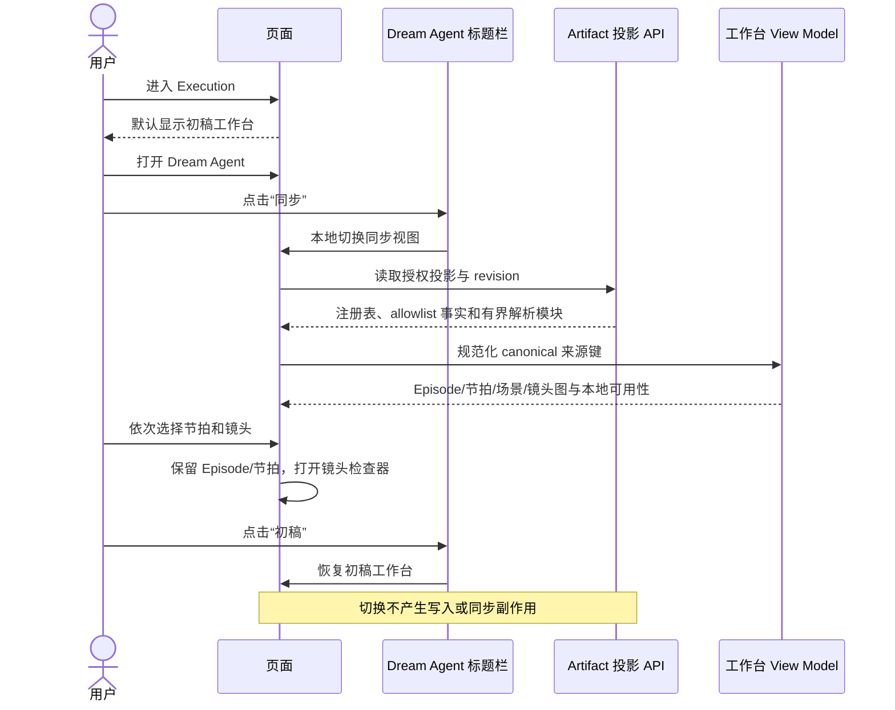

# Project 与 Episode 工作台

## 内容层级

```text
Project
└── Episode（EP01–EP99）
    ├── 概览
    ├── 故事弧
    │   └── 叙事节拍
    │       └── 场景
    │           └── 镜头
    ├── 剧本
    ├── 分集大纲
    ├── 分镜
    └── 审阅报告
```

Episode 导航以已经发布的注册表为准，不通过目录发现推断。选择操作使用稳定的
Project、Episode 和来源键；只用于渲染的 View ID 可以派生，但不能持久化成业务身份。

## 阅读交互

进入 Execution 时默认显示“初稿”：人物、场景和分镜 stage 直接占据主工作面，不再包在
“Dream 初稿阶段投影”的折叠层中。Dream Agent 对话框标题栏在 Chat 入口旁提供“初稿 / 同步”
切换：

- 初稿：读取 `dream-files` 的人物、场景、分镜和完整资产正文，是默认视图；
- 同步：读取 Episode Artifact、文件 reader、Story Index、审阅与辅助产物，是按需扩展视图；
- 两个视图互斥显示，切换只影响当前页面呈现，不写入数据库、不触发 Hook、不改变 thread；
- 刷新或进入另一个 Run 后回到初稿，不把上一次页面选择持久化成业务事实；
- 窄屏在切换后收起 Dream Agent 对话框，立即露出目标工作面。

同步视图选择当前已注册的 Episode，再选择首个可用的叙事条目。模块导航分别显示大纲、
剧本、分镜和审阅报告是否可用。选择节拍会限定中间阅读面；选择镜头会打开详情检查器，同时
保留当前节拍选择。从同步视图点击“阅读分集大纲/剧本/分镜/审阅”时，同一同步工作面内的
文件 reader 定位对应标签；reader 不再嵌入初稿分镜详情，也不形成推荐动作或 Episode 状态机。



## 编辑

只有明确允许编辑的业务字段显示编辑控件。保存请求携带预期 revision 和稳定身份。用户存在
未保存修改时，新到达的 Agent 更新不能覆盖本地内容；页面显示 revision 冲突并提供比较或
重新加载。保存成功后，页面必须重新读取权威投影才能声明完成。

## 渐进到达

各模块可以独立到达：分镜缺失时剧本仍可阅读；审阅失败不能清除大纲；生成后的渲染资产
不能重新定义分镜身份。当新的 observation revision 到达时，页面保留仍有效的模块和本地
选择；只有所选稳定身份已经不存在时才清除选择。

剧本创作台只显示当前可读的 Project、Episode 和资产事实，不提供“工作空间更新流”、
revision 时间线或来源文件计数。revision 继续作为传输、并发和 last-good 恢复事实存在，
不能形成第二套用户工作流或进度模型。

## 来源信息

UI 可以显示安全的来源类型、Episode code 和 revision，但不能显示绝对路径、thread 目录键、
prompt/system 消息、内部 source message metadata 或凭证。

## 响应式行为

桌面端的切换器与 Chat、收起操作位于同一 Agent 标题栏；对话框保持打开时，背景主工作面可以
立即切换。窄屏点击初稿或同步后先收起模态对话框，再显示目标页面。同步视图保持相同语义
顺序并拆成可导航面板：Episode/模块 → 叙事内容 → 详情。返回操作回到上一个语义选择；焦点
和滚动恢复绑定稳定条目，而不是数组位置。
