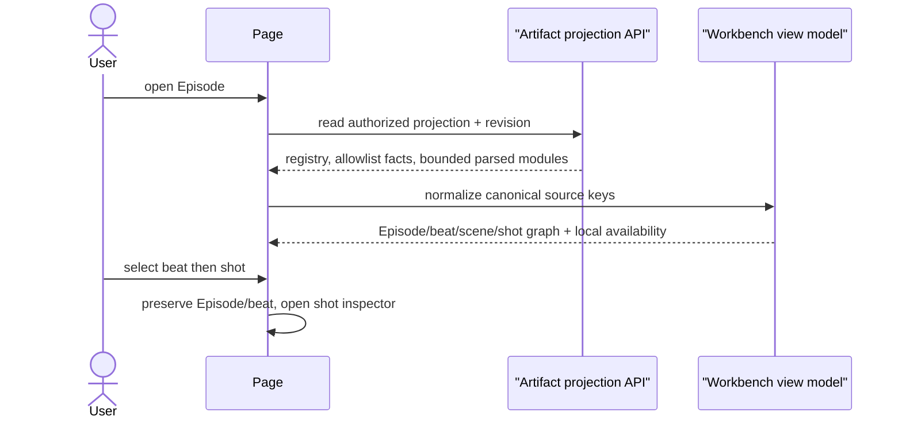

# Project and Episode workbench

## Content hierarchy

```text
Project
└── Episode (EP01–EP99)
    ├── Overview
    ├── Story arc
    │   └── Narrative beat
    │       └── Scene
    │           └── Shot
    ├── Script
    ├── Episode outline
    ├── Storyboard
    └── Review report
```

Episode navigation follows the sealed registry, not directory discovery.
Selection uses stable Project/Episode/source keys; render-only view IDs may be
derived but never persisted as business identity.

## Reading interaction

On entry the workbench selects the active registered Episode, then the first
available narrative item. The module rail shows availability independently for
outline, script, storyboard and review. Selecting a beat scopes the center
reading pane; selecting a shot opens the detail inspector without losing the
beat selection.



## Editing

Only explicitly editable business fields use editor controls. Save requests
carry expected revision and stable identity. An Agent update arriving while the
user has unsaved edits does not overwrite them; the page shows a revision
conflict and offers compare/reload. Successful save refreshes the authoritative
projection before declaring completion.

## Progressive arrival

Modules arrive independently. Script can render while storyboard is missing;
review failure does not erase outline; generated render assets do not redefine
the storyboard identity. The page preserves valid modules and local selection
as a new observation revision arrives, unless the selected identity no longer
exists.

## Provenance

The UI may display safe source type, Episode code and revision. It never shows
absolute paths, Thread directory keys, prompt/system messages, internal source
message metadata or credentials.

## Responsive behavior

Desktop shows rail, content and inspector. Narrow screens expose the same order
as navigable panes: Episode/modules → narrative content → detail. Back returns
to the previous semantic selection. Focus and scroll restoration are scoped to
the stable item, not array position.
