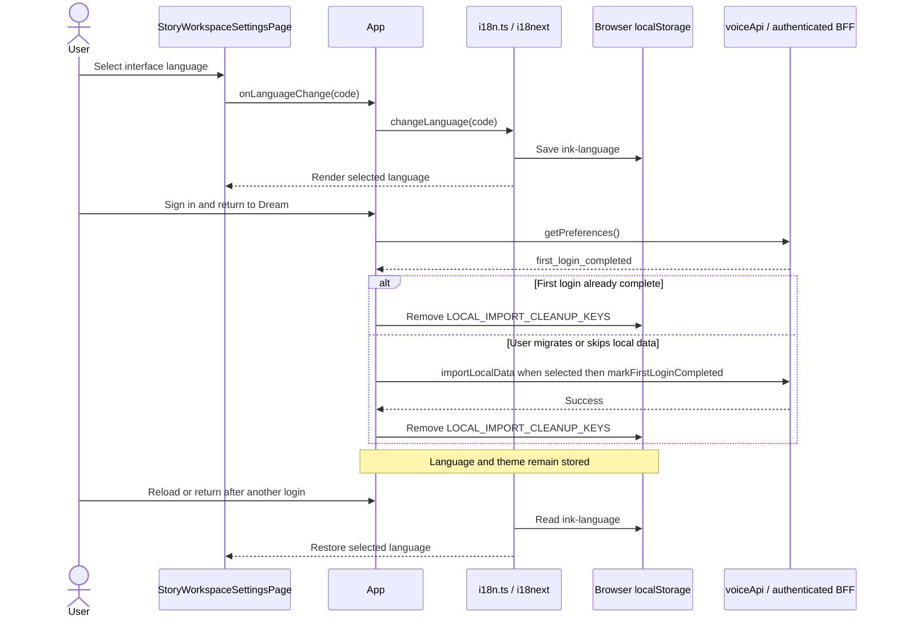
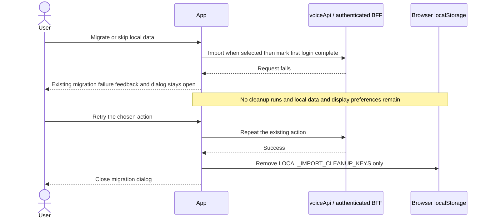

<!-- [Input] StoryWorkspaceSettingsPage, App login/import cleanup, storageKeys and i18n browser persistence. -->
<!-- [Output] Settings navigation, browser preference ownership, recovery and acceptance contracts. -->
<!-- [Pos] Current Story Workspace Settings interaction design. -->
<!-- [Sync] 2026-10-07: preserve interface language and theme across login and local-data migration cleanup. -->

# Settings

## Background and problem

The General language buttons change the interface immediately and `i18n.ts`
saves the selection under `ink-language`. Login previously cleared every key
in `STORAGE_KEYS` after `first_login_completed`, including language and theme.
The mounted interface retained its language, but a later page load read no
selection and returned to English.

## Goals and boundaries

Preserve the existing browser language and theme selections through login,
successful local-data migration and skipping migration. Keep the existing
account-data cleanup and authentication checks. The preference belongs to the
current browser origin; this repair does not add account or device
synchronization, a database field, a save button or a confirmation dialog.

## Concepts and rules

| State | Execution and ownership |
| --- | --- |
| default | `i18n.ts` uses English when the browser has no saved language. |
| desired | The user selects English or Chinese in `StoryWorkspaceSettingsPage`; `App.handleUILanguageChange` calls `i18n.changeLanguage`. |
| effective | i18next renders the selected language and saves it to `ink-language`; a new document restores that value. |
| revision | Browser preferences have no revision or concurrent-save protocol; the latest successful local write is restored. |

`storageKeys.ts` defines `LOCAL_IMPORT_CLEANUP_KEYS` explicitly. `App` uses this
same list for an account whose first login is complete, successful migration,
and skipping migration. The list includes the existing account caches,
importable records, migration marker and retired credential, and excludes
`STORAGE_KEYS.LANGUAGE` and `STORAGE_KEYS.THEME`. Adding a storage key does not
automatically enroll it in cleanup.

```mermaid
stateDiagram-v2
  [*] --> DefaultLanguage: No saved language
  DefaultLanguage --> SelectedLanguage: User selects language; local write succeeds
  DefaultLanguage --> UnsavedLanguage: User selects language; browser rejects write
  SelectedLanguage --> SelectedLanguage: Login or successful migration cleanup
  SelectedLanguage --> SelectedLanguage: Reload restores saved language
  SelectedLanguage --> SelectedLanguage: Migration fails; cleanup does not run
  SelectedLanguage --> UnsavedLanguage: User selects another language; browser rejects write
  UnsavedLanguage --> SelectedLanguage: Reload restores prior saved language
  UnsavedLanguage --> DefaultLanguage: Reload without any saved language
  SelectedLanguage --> DefaultLanguage: User clears browser site data
```

The language buttons retain their existing `aria-pressed` selection and
desktop/narrow layout. A failed import or first-login marker request keeps the
existing error feedback and does not clear local data. If browser storage
rejects a language write, `i18n.ts` logs its existing persistence warning; the
current document can still change language, but a new document cannot restore
an unsaved selection.

## Acceptance

| Requirement | Implementation | Technical regression |
| --- | --- | --- |
| Language survives completed-account login and repeated document loads | Three App cleanup sites use the explicit key list; i18n retains its current persistence path | Select Chinese, reload twice, sign out/in through visible controls, restore Chinese; repeat for English |
| Migration and skip retain browser display preferences | App cleanup runs only after successful existing API calls | Both visible migration actions retain language/theme and remove account cache data |
| Failed migration retains recoverable local data | Existing catch paths precede cleanup | Failed first-login marker leaves migration dialog and local data intact; retry succeeds |

[Browser regression](../../../frontend/e2e/settings-language-persistence.spec.ts)
uses the production Next shell, App, Settings and auth form with intercepted
public API responses. It verifies technical browser behavior without real
account, database or model writes. Markdown/reference/Mermaid checks validate
documentation only.

## Information architecture

Story Workspace settings are a section of the product settings center, not a
second application shell. Entries are grouped by user intent:

- Workspace defaults and display preferences.
- Dream production defaults that do not weaken server policy.
- Deck/plugin selection through the existing authorized Deck model.
- Privacy, data retention and integration visibility.

Runtime model entitlement, sandbox/network policy and trusted plugin paths
remain server-owned and are not represented as arbitrary free-form settings.

## Interaction

- Deep links select a known settings section; unknown sections fall back to the
  section index without writing state.
- Notion and Claude MCP details belong only to Work / Resources. Choosing any
  Settings category clears transient Notion detail state and reconciles Claude
  MCP detail state from the destination URL, so a detail cannot mask another
  category's content.
- Dirty forms prompt before navigation.
- Save uses field-level validation and version/CAS where concurrent changes are
  possible.
- Success is announced without clearing unrelated unsaved sections.
- Authorization or validation errors retain entered safe values and identify
  the owning field.

## Responsive and accessible layout

Desktop uses section navigation and a bounded form pane. At the shared 767px
boundary, narrow screens switch the entire Settings surface to one column: the
search and horizontally scrollable category rail occupy full width above a
full-width content pane. Because Settings hides the global Story Workspace
sidebar, the outer layout must not reserve the compact rail's 72px width.
Labels, descriptions, errors and destructive effects are programmatically
associated. Keyboard focus moves to the first invalid field on submit and back
to the invoking section on exit.
