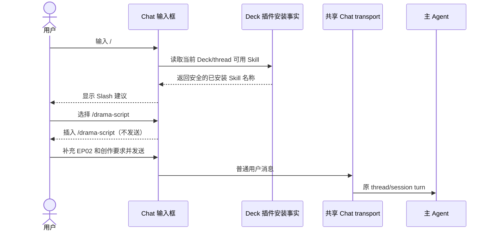
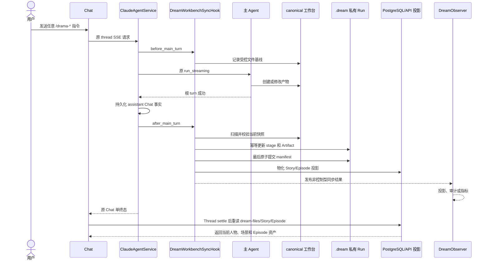
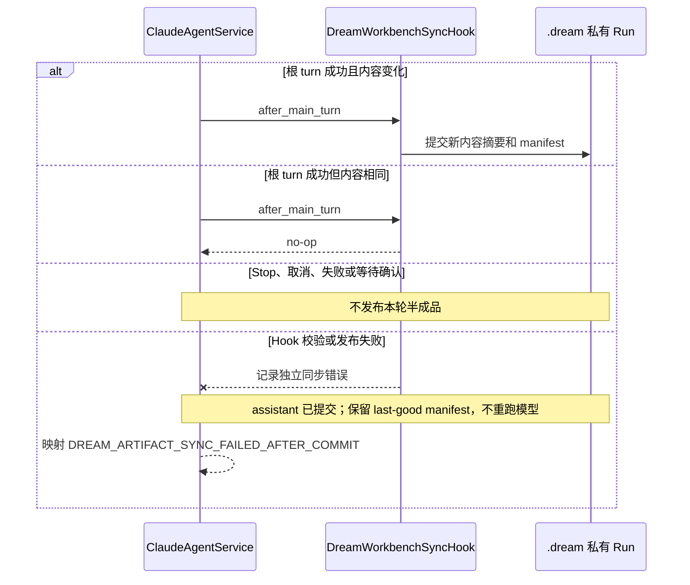

<!-- [Input] Shared Dream Thread turns, canonical Project/Episode assets, after-turn Hook, private publication, PostgreSQL/API projections, and Execution consumers. -->
<!-- [Output] Business contract for free-form Drama Skill use and deterministic post-turn workbench synchronization. -->
<!-- [Pos] Story Workspace source of truth for Skill invocation versus host-owned synchronization. -->
<!-- [Sync] 2026-09-04: preserve committed assistant truth on post-Hook failure and refresh Dream assets whenever the shared Thread settles. -->

# Skill 指令与工作台自动同步

> 本文是当前业务设计。十三个 Drama Skill 是用户可自由调用的能力，不是由页面或服务端推进的阶段状态机。

## 1. 业务目标

首次创建故事空间时，系统默认引导 `/drama-init` 建立 Project。初始化完成后，用户可以在同一 Chat thread 中任意、重复执行已安装的 Skill；系统不根据 Episode 产物、审阅结果或 completion fact 决定“下一步”。

Chat 输入框输入 `/` 时展示当前 Deck 实际安装且可用的 Skill。选择结果只插入普通文本，用户可以继续补充 Episode 和创作要求，再主动发送。

## 2. 十三个业务 Skill

| 指令 | 用途 | 典型产物 |
|---|---|---|
| `/drama-init` | 项目初始化 | `project.yaml`、角色弧光、弧光台账、题材包 |
| `/drama-plan` | 分集规划 | 分集大纲、角色节拍、节奏曲线、伏笔地图 |
| `/drama-script` | 剧本创作 | `script.md` |
| `/drama-asset` | 视觉资产设定 | 角色卡、场景卡、道具卡 |
| `/drama-storyboard` | 分镜设计 | `storyboard.yaml` |
| `/drama-prompt` | Prompt 生成 | Prompt package |
| `/drama-render` | 渲染指引 | 渲染参数、分段拼接方案 |
| `/drama-voice` | 配音 | 配音脚本、声线路由 |
| `/drama-edit` | 后期整合 | 剪辑、字幕、音效、转场清单 |
| `/drama-promote` | 宣发 | 封面、投放文案、数据策略 |
| `/drama-query` | 状态查询 | 项目事实摘要 |
| `/drama-doctor` | 项目体检 | 一致性检查和修复建议 |
| `/drama-payoff` | 爽点规划与审查 | 爽点蓝图、证据审查、债务审计 |

除了首次 `/drama-init`，表格顺序不表示依赖或推荐顺序。系统不得因为某项产物不存在而隐藏或禁用另一个已安装 Skill。

## 3. Slash 菜单

Skill 来源规则：

- 已存在 thread 时，优先尊重其冻结插件加载事实；
- 尚未创建 thread 时，读取当前选中 Deck 的 enabled、ready 插件引用；
- 安装状态、版本和 digest 必须匹配；
- 过滤非法名称、重复项和 `<root>`；
- 服务端 Dream adapter 不属于 Deck 业务 Skill；
- 菜单查询失败时退化为普通输入，不阻止 Chat。

## 4. Hook、Observer 与 MCP

| 组件 | 负责 | 不负责 |
|---|---|---|
| `ClaudeAgentService` | 组装共享 thread/session 上下文并调用原 runner | Dream 专用协议和状态机 |
| 主 Agent before/after Hook | 验证 run/thread/workspace；记录基线；成功后扫描、校验并原子发布产物 | 选择 Skill、生成 next action、修改 Chat 终态 |
| `DreamObserver` | 非控制型业务投影、审计、指标和告警 | Artifact 同步 owner、Agent 控制、第二终态 |
| MCP | Agent 主动检查、预览或显式修复 | 自动同步的必要条件、隐藏工作流推进 |

影响业务正确性的产物同步必须由 Hook 承担，不能放入异常会被隔离的 Observer。Observer 可以观察 Hook 结果，但不能反向决定 Agent 是否成功。

首次 `/drama-init` 是唯一例外：成功后 Hook 在人物、场景、分镜三个初始化页面产物齐全时，
可以记录一次性 `pending_review` readiness，供用户执行“确认并继续”。该状态不用于后续
十三个 Skill 的推荐、禁用、排序或 Episode 完成判断。MCP 不得写入这一生命周期。

## 5. 主 Agent 自动同步

Agent 未调用 MCP 时，上述同步仍必须成立。

## 6. 失败、取消和幂等

canonical 源文件删除后，Hook 必须生成明确空投影或移除对应发布引用，页面不能永久保留旧 stage。

`DREAM_ARTIFACT_SYNC_FAILED_AFTER_COMMIT` 只表示 assistant 已成为持久化 Chat 事实之后的工作台同步失败。ThreadFactory 仍沿用唯一 error + `finish(error)` 终态；前端必须显示“回复已保存，工作台同步未完成”，只读重新加载并禁止暗示用户重发。无论 Hook 成功还是这一已提交同步终态，Execution 都在共享 Thread settle 后重新读取 `dream-files`、Episode 和 Story 投影，避免 completed Run 停止轮询后永久显示旧人物/场景。

## 7. 明确删除的历史设计

- 阶段推荐按钮和“更多工作流操作”；
- `recommendedActionId`、`nextAction` 和 action projection；
- 固定前置步骤与“只允许当前动作”；
- completion fact 驱动的 Skill 流转；
- Episode 下一步确认弹窗与专用 action POST；
- 依赖 Agent 主动调用 MCP 才同步的设计；
- 把 Artifact 同步放入 Observer 的设计。

权限、身份、路径安全、Artifact schema、原子发布和 Project/Episode 关联不是状态机，必须继续保留。

## 8. 设计审查

结论：**修改后接受**，本文件已按审查意见完成修改。

- 没有 Skill DAG、阶段前置条件或推荐排序；
- Slash 菜单只插入普通文本；
- Hook 是同步正确性的 owner，Observer 不是；
- MCP 是可选辅助；
- 不新增 API、DDL、SSE、事件存储或第二 runtime；
- 不修改 Claude runner、报文、thread、session 或 `claude_session_id`；
- 安全与业务授权继续保留。
