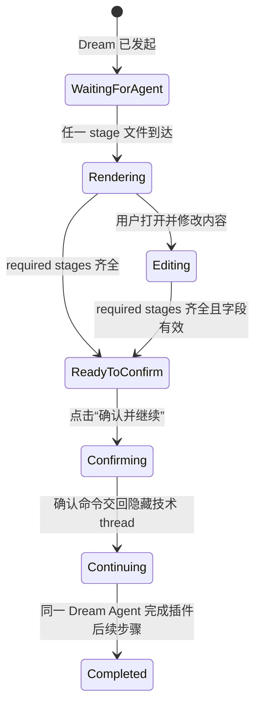
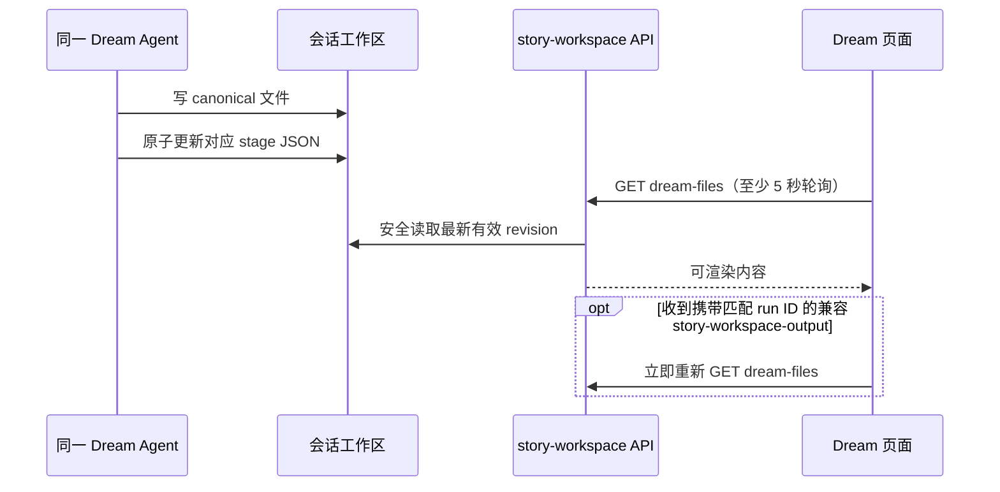
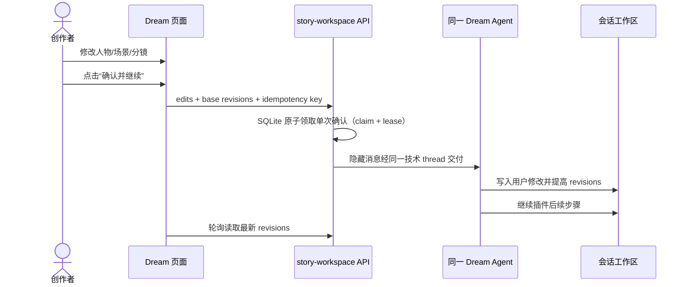

# Story Workspace — Dream 页面布局与交互规范

> **Design ID**：`design_002_story-workspace-layout`
> **状态**：生产主链已实现；丰富执行字段仍为占位
> **最后更新**：2026-08-04
> **适用端**：桌面端
> **业务交互 owner**：[design_007](./design_007_dream-business-module-interaction.md)
> **`.dream` 文件协议 owner**：[design_006](./design_006_dream-protocol-dir-mapping.md)
> **产品 owner**：[story-workspace-prd](./story-workspace-prd.md)

## 1. 设计目标

Dream 页面服务一条主生命周期：

```text
Dream Agent 产出 → 页面渲染 → 用户修改并确认 → 同一 Dream Agent 后续执行
```

布局必须让创作者始终看清三件事：

1. Agent 已在工作空间写入哪些人物、场景和分镜内容；
2. 当前正在查看或修改哪个内容；
3. 整份 Dream 何时可以一次“确认并继续”，以及确认后 Agent 正在继续什么。

确认是整份 Dream 的单次动作，不拆成逐项审批。后续执行只展示同一 Agent 持续写入的工作空间结果。

## 2. 设计依据

### 2.1 Dreem 调研适配

唯一交互调研来源为 [调研Dreem_app平台.pdf](./调研Dreem_app平台.pdf) 第 3～8 页。

| 页码 | 截图中的交互事实 | Dream 布局采用 |
|---|---|---|
| 第 3 页 | Script Review 允许修改，底部只做一次确认，随后 Agent 继续 | 编辑工作面 + 页面级“确认并继续” |
| 第 3 页 | 创作者协作页同时表达内容、任务进度与 Agent 活动 | stage 进度、内容区、Agent 活动区 |
| 第 4 页 | Assets / Outline 分离人物、地点和剧本入口 | 左侧 Assets / Outline 导航 |
| 第 5 页 | 确认后 Agent 自动扩展故事 | 确认后切换为持续执行视图 |
| 第 6 页 | 故事线定位叙事点，镜头文稿可进入聚焦协作 | Outline 索引 → 叙事点 → 聚焦上下文 |
| 第 7 页 | 协作窗口展示人物、主要信息、镜头说明和历史 | 聚焦上下文层 + Agent 活动历史 |
| 第 8 页 | 特殊镜头带结构化决策信息 | 只读结构化元信息，不复制画布控件 |

不复制调研截图中的黑底画布、视频区、上传入口或外部模型控件。

### 2.2 Ink & Memory 视觉约束

视觉唯一规范为 [Ink & Memory UI Design v2.pdf](../../prd/Ink%20%26%20Memory%20UI%20Design%20v2.pdf) 第 4～5 页及 `frontend/src/styles/tokens.css`：

- 页面背景使用 Warm Canvas `#F6EFE5`；
- 工作面使用 Paper Cream `#FFFAF2`；
- 标题使用 Charcoal Brown，正文使用 Body Brown；
- 主操作使用 Action Brown；Memory Yellow / Spark Green 只做小面积状态提示；
- 以留白、细分隔线和轻纸面形成层级，不把每条内容包成卡片；
- 不使用深色控制台、重阴影、玻璃拟态或高饱和渐变。

## 3. 页面信息架构

```text
Dream
├── Workflow Context：Deck、run、Agent 状态
├── Assets
│   ├── 人物
│   └── 场景
├── Outline
│   ├── 故事线
│   ├── 叙事点
│   └── 分镜摘要
├── Content Editor：当前内容查看与修改
├── Dream Confirmation：整份内容一次确认
└── Execution Collaboration
    ├── 工作空间更新索引
    ├── 当前叙事点/镜头结果
    └── 聚焦上下文与 Agent 活动历史
```

路由：

- `/story-workspace/dream?run=<runId>`：Agent 产出、页面渲染、用户修改与确认；
- `/story-workspace/characters?run=<runId>`：人物深链；
- `/story-workspace/scenes?run=<runId>`：场景深链；
- `/story-workspace/runs/<runId>/execution`：确认后的协作执行页。

顶部进入任一 `/story-workspace/*` 路由时均保持 Dream 导航选中。

## 4. 阶段一至三：产出、渲染与修改确认布局

### 4.1 桌面三栏

三栏只服务确认前的内容理解与修改，不承载逐项审批。

```text
┌────────────────────────────────────────────────────────────────────────────┐
│ TopNav / Dream                                                            │
├────────────────────────────────────────────────────────────────────────────┤
│ Workflow Context：Deck · run · Agent 正在写入…                            │
├──────────────┬──────────────────────────────────────┬──────────────────────┤
│ Module Rail  │ Content Workspace                    │ Detail Editor        │
│ 224–240 px   │ min 640 px                           │ 320–384 px           │
│              │                                      │                      │
│ Assets       │ Stage Progress                       │ 当前项标题           │
│ · 人物  ✓    │ 人物 ━━━ 场景 ━━━ 分镜 ┄┄           │ 摘要 / 关系 / 描述   │
│ · 场景  ✓    │                                      │ 可编辑字段           │
│ Outline      │ 人物、场景或 Outline 内容            │ 来源文件 / revision  │
│ · 分镜  …    │ 轻纸面行与分组                       │                      │
│              │                                      │                      │
├──────────────┴──────────────────────────────────────┴──────────────────────┤
│ 已修改 3 项 · revisions 4/2/1                 [确认并继续]                 │
└────────────────────────────────────────────────────────────────────────────┘
```

尺寸规则：

| 区域 | 宽度 | 滚动 | 作用 |
|---|---:|---|---|
| Module Rail | 224～240px | 独立纵向 | Assets / Outline 与 stage 到达状态 |
| Content Workspace | `minmax(640px, 1fr)` | 页面主滚动 | 列表、故事线、叙事点和分镜摘要 |
| Detail Editor | 320～384px | 独立纵向 | 当前项可编辑字段与来源信息 |
| Confirmation Bar | 跨三栏，底部粘性 | 不滚动 | 修改计数、revision 摘要、唯一主操作 |

宽度不足 1180px 时，Detail Editor 以右侧纸面抽屉覆盖 Content Workspace；本期不设计移动端重排。

### 4.2 Workflow Context

上下文条保持单行、轻量，不使用卡片：

```text
Dream / 《雨夜》     Deck：Drama Forge 1.4     Run：…7A31     Agent 正在写入场景
```

展示字段：

- Deck 名称与锁定版本；
- run 的短标识；
- 当前 Agent 活动文案；
- 最近一次工作空间更新时间。

不得展示 secret、绝对文件路径或原始插件配置值。

### 4.3 Module Rail 与 stage 到达状态

模块行只表达文件是否已经由 Agent 写到可渲染状态：

| 状态 | 触发 | 表现 | 是否可打开 |
|---|---|---|---|
| 等待 Agent | 对应 stage 文件尚不存在 | 名称 + 细点线占位 + “等待写入” | 否 |
| 可查看 | stage 文件存在且有效 | 名称 + 数量 + revision | 是 |
| 有本地修改 | 用户改过该模块 | 左侧 2px Action Brown 细线 + 修改点 | 是 |
| 已确认继续 | 整份 Dream 已提交 | 内容只读，显示最新 revision | 是 |

页面不把 Agent 的每个文件写入包装成业务审批状态。

### 4.4 Content Workspace

#### Assets：人物与场景

- 人物按名称分组，以纸面行显示摘要、关系与关联场景；
- 场景按故事顺序显示地点、时间、氛围与关联人物；
- 选中一行时，仅使用 Paper Cream 色差和左侧细线，不浮起整张卡片；
- 新 stage revision 到达时，不覆盖尚未确认的本地修改，先显示“工作空间有更新”。

#### Outline：故事线、叙事点与分镜

```text
故事线 01  雨夜相遇
  01.1  车站等待                  3 个镜头
  01.2  冲突发生                  5 个镜头
  01.3  离开                      2 个镜头
```

- 第一层定位故事线；
- 第二层展开叙事点；
- 第三层显示分镜摘要、人物/场景引用和插件结构化信息；
- 点击条目在右侧打开 Detail Editor，不跳出当前 Dream 上下文。

### 4.5 Detail Editor

右栏是内容编辑器，不是审批面板。它包含：

1. 当前项名称和类型；
2. 可编辑字段；
3. 关联人物、场景或叙事点；
4. source file 相对路径与 stage revision；
5. 本地修改提示和“撤销本项修改”。

字段修改只保存在前端本地草稿。页面在用户点击“确认并继续”前不写工作空间。

### 4.6 Confirmation Bar

确认条是阶段三唯一业务操作区：

```text
3 个本地修改  ·  人物 r4 / 场景 r2 / 分镜 r1      [确认并继续]
```

按钮启用条件：

- `characters`、`scenes`、`storyboards` required stages 全部存在；
- 本地字段格式有效；
- base revisions 与后端最新 revisions 一致；
- 当前没有相同幂等键的提交在进行。

若 revision 已变化，页面读取最新版并要求用户重新核对合并结果；不另建审批流程。

## 5. 阶段四：后续执行协作布局

确认成功后进入独立执行路由。这里对齐 Dreem 创作者协作页的“数据/任务层 → 聚焦上下文层”，而不是继续套用确认前三栏。

### 5.1 第一层：工作空间与叙事执行面

```text
┌────────────────────────────────────────────────────────────────────────────┐
│ Dream / 后续执行      Agent 正在继续 · 最近更新 14:32                     │
├──────────────────┬─────────────────────────────────────────────────────────┤
│ Assets / Outline │ Narrative Execution                                     │
│ 240–280 px       │                                                         │
│                  │ 当前步骤与 Agent 写入摘要                               │
│ 人物             │ ──────────────────────────────────────────────────────  │
│ 场景             │ 故事线 / 叙事点 / 分镜结果                              │
│                  │                                                         │
│ 故事线 01        │ 工作空间更新流                                          │
│  · 叙事点 01.1   │ 14:32 更新镜头 03                                      │
│  · 叙事点 01.2   │ 14:31 写入人物关系                                      │
└──────────────────┴─────────────────────────────────────────────────────────┘
```

- 左侧固定表达 Assets / Outline 上下文；
- 主工作面按故事线和叙事点组织 Agent 后续写入；
- Agent 活动历史使用轻量时间线嵌入主工作面，不使用深色日志控制台；
- 页面以 `dream-files` REST 轮询发现 stage revision；携带匹配 run ID 的兼容事件只用于提前读取。

### 5.2 第二层：聚焦上下文

点击叙事点或分镜摘要后，在主工作面内展开聚焦层：

```text
← 返回故事线

叙事点 01.2 · 冲突发生
人物：林默、苏遥      场景：旧车站

主要信息
……

镜头说明
01 远景 ……
02 中景 ……

Agent 工作空间历史
14:32 storyboard.md revision 5
14:30 checks/continuity.json revision 2
```

聚焦层提供“返回故事线”和上下条目切换，不提供再次确认操作。

### 5.3 后续执行状态

| 页面状态 | 页面表现 |
|---|---|
| `story-workspace-dream-continuing` | Agent 活动文案、stage revision 更新、当前工作空间内容 |
| `story-workspace-dream-completed` | 最终内容、更新时间和只读历史 |

后续执行没有内容审批分支。技术连接短暂中断时沿用最近一次有效内容并重新拉取，不扩展业务生命周期。

## 6. 四阶段页面切换



页面状态只用于展示阶段，不作为第二套内容真相源。stage 是否可渲染以 `.dream/runtime` 文件存在且有效为准。

## 7. 数据刷新与编辑一致性

### 7.1 页面读取

前端通过 actor-scoped `GET /api/story-workspace/workflow-runs/<run_id>/dream-files` 读取：

- run 来源五字段与 `projection_entry`；
- required stages；
- stage revision、source files 和页面字段；
- changed stages 的最新 revision。

浏览器不直接访问工作空间文件系统。

### 7.2 Agent 更新到页面



### 7.3 用户确认到同一 Agent



## 8. 组件边界

目标组件树：

```text
StoryWorkspaceDreamPage
├── StoryWorkspaceWorkflowContextBar
├── StoryWorkspaceDreamModuleRail
├── StoryWorkspaceDreamStageProgress
├── StoryWorkspaceDreamContentWorkspace
│   ├── StoryWorkspaceCharacterList
│   ├── StoryWorkspaceSceneList
│   └── StoryWorkspaceOutline
├── StoryWorkspaceDreamDetailEditor
└── StoryWorkspaceDreamConfirmationBar

StoryWorkspaceExecutionPage
├── StoryWorkspaceExecutionContextBar
├── StoryWorkspaceExecutionIndex
├── StoryWorkspaceExecutionWorkspace
├── StoryWorkspaceExecutionFocus
└── StoryWorkspaceAgentActivityTimeline
```

前端局部合同只归 `frontend/src/hooks/story-workspace/contracts.ts`；新增组件和类型统一使用 `StoryWorkspace*` 前缀。

## 9. 可访问性与交互细节

- 三栏区域使用语义化 `nav`、`main`、`aside`；
- 所有 stage 到达状态同时提供文字，不只依赖颜色；
- Module Rail、Outline 和聚焦条目支持键盘上下移动、Enter 打开、Escape 返回；
- Detail Editor 的字段标签与校验提示可被读屏关联；
- “确认并继续”在提交中禁用并显示明确文案；
- SSE 更新通过 `aria-live="polite"` 播报摘要，不抢占当前焦点；
- 主操作命中区不小于 40px，高对比度遵循现有 token；
- `prefers-reduced-motion` 下不使用位移动画，仅用瞬时色差更新。

## 10. 本期边界

本设计不包含：

- 逐项或批量审批、拒绝式操作、业务异常分支、再次尝试流程或内容归档；
- 确认后的第二次确认；
- 用户手动新建人物、场景或分镜；
- 视频预览、上传、播放器和外部模型选择；
- World Builder、人物三视图、计费积分；
- 故事板、时间线、场景布局或决策控件的可编辑画布；
- 移动端、平板端和多人实时协作。

## 11. 验收清单

### 11.1 布局

- [ ] 确认前桌面端为 Module Rail / Content Workspace / Detail Editor 三栏；
- [ ] 右栏只做当前内容修改，页面级只有一个“确认并继续”；
- [ ] 后续执行为 Assets / Outline 索引与叙事主工作面，选中项进入聚焦上下文层；
- [ ] 页面符合 Warm Canvas、Paper Cream、轻分隔、无卡片视觉规范。

### 11.2 文件驱动交互

- [ ] 人物、场景、分镜 stage 文件分别到达时，对应模块立即可渲染；
- [ ] stage 文件尚未出现时只显示“等待 Agent 写入”；
- [ ] Agent 更新 revision 后页面安全刷新，不覆盖本地未确认修改；
- [ ] 用户确认作为隐藏消息回到同一 Dream 技术 thread；
- [ ] 同一 Dream Agent 写入用户修改并继续后续步骤；
- [ ] 后续执行页没有第二次确认入口。

### 11.3 工程约束

- [ ] 浏览器不直接读写工作空间；
- [ ] UI 不显示 absolute path、secret 或原始插件配置；
- [ ] 合同 owner 与 `design_006`、`design_007`、PRD 一致；
- [ ] 目标实现与 `design_005` 的 G1～G3、G6 现状缺口明确区分。

## 12. 决策记录与修订

| 决策 | 原结论 | 现行解释 |
|---|---|---|
| DEC-001 | 桌面端三栏布局 | 保留在确认前；右栏改为内容编辑器 |
| DEC-003 | 复杂内容使用数据表/结构化列表，不使用复杂画布 | 保留 |
| DEC-006 | 暖纸张、轻纸面、无卡片 | 保留 |
| DEC-007 | 视频与平台制作模块不进入本期 | 保留 |
| DEC-008 | 新符号使用 story-workspace / StoryWorkspace 前缀 | 保留 |
| DEC-018 | Agent 产出后进入用户审阅 | 保留“产出后用户查看修改”的意图；不采用逐项审批模型 |
| DEC-030 | 桌面三栏是唯一支持布局 | 2026-08-04 修订：只约束确认前；执行页按调研改为两层协作深度 |

### 2026-08-04 修订注记

保留以上历史决策原意并追加现行裁决：

1. 页面主生命周期统一为“Dream Agent 产出 → 页面渲染 → 用户修改并确认 → 同一 Dream Agent 后续执行”；
2. 三栏骨架保留在确认前，但右栏从审阅动作区改为内容编辑器；
3. 页面只有整份 Dream 的一次“确认并继续”；
4. 确认后进入对齐 Dreem 创作者协作页的两层执行工作台；
5. 所有页面内容由同一 Dream Agent 通过工作空间文件与 `.dream` stage revision 驱动；隐藏技术 thread 只承担连续性传输，不把 Dream 页面降级为 Chat 页面；
6. 现行业务稿不扩展否定式审批、多分支恢复或内容归档。

## 13. 变更记录

| 日期 | 变更 |
|---|---|
| 2026-08-01 | 初版三栏、结构化列表与 Story Workspace 视觉规范 |
| 2026-08-03 | 增加 Dream 入口、运行上下文与执行页草案 |
| 2026-08-04 | 对齐 Dreem PDF 第 3～8 页，改为 Agent 工作空间文件驱动、用户修改后一次确认、同一 Agent 后续执行；执行页改为数据/任务层与聚焦上下文层 |
| 2026-08-04 | 统一业务主体为 Dream Agent；隐藏技术 thread 只承担连续性传输；校准为 REST 轮询保证刷新、匹配 run 的兼容事件仅作加速 |
