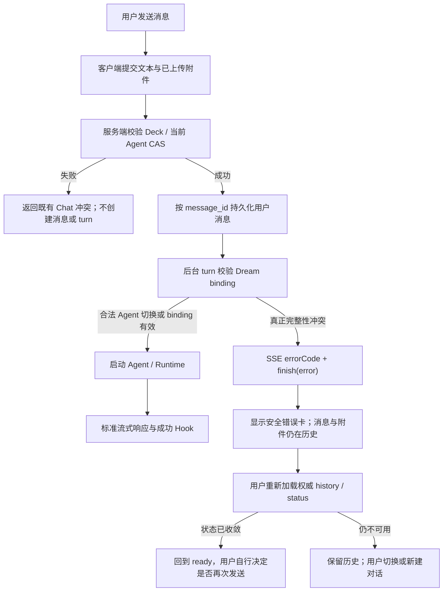

<!-- [Input] Dream launch provenance, mutable Chat next-turn Agent selection, canonical Chat send/SSE persistence, and Story Workspace re-entry authorization. -->
<!-- [Output] Product and protocol contract for legal Agent switching and recoverable presentation of genuine Dream Thread binding conflicts. -->
<!-- [Pos] Cross-surface interaction source of truth for Dream-bound Chat Thread integrity failures. -->
<!-- [Sync] 2026-08-31: define provenance/current-Agent separation, failure persistence, safe copy, reload recovery, and acceptance criteria. -->

# Dream Thread 绑定冲突与恢复交互

## 1. 背景与问题

Dream 与 Chat 共用一个 actor-owned Thread。Dream 发起时，服务端在隐藏启动消息中冻结
Run、Workspace、Deck、插件 binding、runtime snapshot、启动 Agent 和请求指纹；后续每个
Chat turn 再从已认证用户和 Thread 反向解析 Dream authority，浏览器不能选择 Run。

2026-08-31 的真实故障中，用户在同一 Deck 内把 Thread 的“下一轮 Agent”从启动 Agent
切换到另一个已启用 Agent，随后携带附件发送消息。后端把可变的当前 `thread.voice_id`
错误地要求为始终等于不可变的 launch `agentId`，在 context assembly 阶段抛出
`DREAM_THREAD_BINDING_CONFLICT`。SSE 已携带稳定 `errorCode`，但前端只保留
`errorText`，最终直接显示内部错误码。

该故障同时包含两个问题：

1. **绑定逻辑缺陷**：合法的同 Deck Agent 切换被误判为来源篡改，并使 Dream 重入与
   Story Index 授权同步消失。
2. **错误呈现缺口**：真正的绑定完整性冲突没有用户安全说明、状态语义和恢复操作。

截图链路的持久化顺序是：附件先上传并同步到 Thread workspace，用户消息再以客户端
`message_id` 做不可变 CAS 持久化，之后后台 turn 才解析 Dream binding。冲突发生时没有
启动 Claude Runtime、模型请求或新的 Workflow Run，但用户消息和附件已经成为可恢复的
Thread 历史。

## 2. 目标与边界

### 2.1 目标

- 区分“启动来源证明”和“当前下一轮 Agent”：前者不可变，后者允许在同一 Deck 内按
  既有 CAS 规则切换。
- 保留 actor、Thread、Run、Workspace、Deck、binding revision、runtime snapshot、
  source message 与 retry graph 的全部 fail-closed 校验。
- 真正冲突时显示用户可理解、可访问、响应式的消息级错误状态，不暴露内部代码和原因。
- 明确失败时消息、附件、Run、输入区与重试的真实状态，并提供只读的权威状态重新加载。
- 使用结构化 `errorCode` 决定 UI；未知错误进入统一安全兜底。

### 2.2 边界

- 不重构 Chat Thread、Workflow Run、Claude session、SSE、Stop、confirmation 或 Hook。
- 不允许浏览器传 Run ID、binding ID、workspace path 或冲突 reason。
- 不自动改绑、不选择另一个 Run、不吞掉冲突，也不把未执行消息伪装成成功。
- 不新增数据库 schema、修复 migration、runtime DDL 或环境分支。
- 不把“新建对话”描述为修复原 Dream Run；它只是在用户主动选择时开始独立对话。

## 3. 概念与规则

| 概念 | 规则 |
|---|---|
| 启动来源证明 | launch message 的 actor、Run、Thread、Workspace、Deck、launch Agent、goal 与 request fingerprint；创建后不可变。 |
| 当前下一轮 Agent | `chat_thread.voice_id`；只能切换到同一 Deck 内已启用 Agent，发送入口以旧值做 CAS。 |
| Dream runtime context | 服务端从当前 actor-owned Thread 解析；固定 Run/Deck/plugin binding，但 `agent_id` 使用当前下一轮 Agent。 |
| binding revision | Dream Run 冻结的 Deck Plugin Binding revision；是完整性事实，不是页面可编辑的 revision。 |
| 真正绑定冲突 | 无法唯一、安全证明 Run authority，例如重试图分叉、来源篡改、binding/version 不一致、权限或行结构异常。 |
| 用户消息 | 发送入口在后台 turn 前按客户端 message ID 持久化；精确重放是 CAS 幂等，不同 envelope 冲突。 |
| 附件 | 发送前已上传；workspace 同步成功时还会进入消息 parts。绑定冲突不删除对象、工作区文件或历史引用。 |

本场景不是配置应用流程，因此 `default`、`desired`、`effective` 不适用。不得为满足术语
而虚构三套状态。这里只区分不可变 launch provenance、可变 current Agent 和冻结的
binding revision。

## 4. 用户场景

### 4.1 正常发送

用户在 Dream-bound Thread 输入文字或选择已上传附件。服务端验证当前 Agent 属于同一
Deck、完成必要 CAS、持久化消息、解析 binding，然后启动 Agent turn。成功 turn 继续使用
原 Run、Thread、Claude session 与 Hook 发布边界。

### 4.2 合法 Agent 切换

用户在顶部 Deck 上下文中选择同一 Deck 的另一个已启用 Agent。下一次发送更新当前
`thread.voice_id`；launch `agentId` 仍作为历史来源证明保留。两者不同不是冲突，Dream
重入、Story Index 授权和后续 turn 均继续有效。

### 4.3 真正线程绑定冲突

服务端无法证明唯一 authority 时，在 Runtime 和模型请求前终止本 turn，并发送稳定
`errorCode`。页面显示消息级错误卡，说明系统没有开始处理，并保留已经写入的用户消息与
附件。内部 reason 只进入服务端日志。

### 4.4 冲突后刷新或重试

“重新加载对话”只读取 Thread history/status 并清除当前页面的临时错误，不启动 turn、
不修改 binding，也不重发消息。如果外部修复或并发事务已经收敛，用户可基于最新状态
重新决定；若结构冲突仍在，页面不会自动重试。

### 4.5 切换或新建会话

切换到另一个已授权 Thread 只读取其状态。页面既有“新建”入口仍可开始独立对话，但不会
继承或修复原 Dream Run。错误卡不新增高风险确认弹窗。

### 4.6 附件已上传但消息未执行

历史中继续显示文件卡与文本，错误卡明确“本次 Agent 未开始处理”。重新加载不得删除
文件 part。产品不声称附件上传等于 Agent 已读取，也不自动复制附件到新 Run。

### 4.7 并发操作或状态过期

- 当前 Agent CAS 失败使用既有 `CHAT_AGENT_CONFLICT`，发生在消息/Agent turn 前，刷新后
  重新水合服务端 Agent。
- binding resolver 每 turn 读取数据库事实；合法 Agent 切换不得使来源证明失效。
- retry graph、binding revision 或来源消息出现并发不一致时继续 fail closed，不猜测 leaf。

## 5. 状态与交互规则

| 状态 | 权威事实 | 页面表现 | 允许操作 |
|---|---|---|---|
| ready | Thread idle，binding 可证明或普通 Chat | 输入区可用 | 发送、切换 Agent、切换页面 |
| submitting | 客户端已提交，附件可能已上传，消息 CAS 正在完成 | 本轮 busy | Stop 仅在主 turn 确实 running 时出现 |
| validating_binding | 后台 turn 已占用 Thread，Runtime 尚未启动 | 沿用 busy | 无重复发送 |
| running | binding 成功，Agent turn 已启动 | 标准流式响应 | Stop、confirmation、断线重连 |
| binding_conflict | binding 无法安全证明，Thread 已回 idle | 消息级错误卡；原用户消息/附件保留 | 重新加载、切换/新建对话 |
| reloading | GET history/status | 错误卡操作进入忙态 | 不发送、不改绑 |

输入框在冲突后恢复可用，但不自动回填已经持久化的消息，以免用户误认为原消息尚未发送。
保留策略以可见历史为准：文本和附件都必须仍可见。客户端不提供“原地自动重试”，因为
结构冲突不是暂时网络错误；精确 `message_id` CAS 只保证服务端重复写安全，不代表重复
Agent turn 在所有阶段都幂等。

## 6. 错误呈现方案

### 6.1 已识别绑定冲突

- 用户可见标题：**当前对话暂时无法继续创作**
- 用户可见正文：**为避免把内容写入错误的创作任务，本次 Agent 未开始处理。消息和附件已保留在对话记录中。请重新加载对话状态；如果仍无法继续，可从页面顶部新建对话。**
- 主操作：**重新加载对话**
- 次操作：不在错误卡重复放置“新建”；复用页面顶部已有入口。
- 诊断：`DREAM_THREAD_BINDING_CONFLICT` 和内部 reason 只进入结构化 SSE、日志和测试，
  不进入普通用户标题或正文。

### 6.2 未识别错误

- 标题：**消息处理未完成**
- 正文：**请重新加载对话以确认最新状态，再决定是否重新发送。**
- 主操作：**重新加载对话**
- 不显示原始异常、Provider 文本、内部代码或堆栈。

错误卡使用 `role="alert"` 与可见标题，不只依赖红色。它位于失败消息之后、输入区之前，
不覆盖输入区，不使用 modal。

## 7. 推荐文案

| 语言 | 标题 | 正文 | 操作 |
|---|---|---|---|
| 中文 | 当前对话暂时无法继续创作 | 为避免把内容写入错误的创作任务，本次 Agent 未开始处理。消息和附件已保留在对话记录中。请重新加载对话状态；如果仍无法继续，可从页面顶部新建对话。 | 重新加载对话 |
| English | This conversation cannot continue the Dream yet | To avoid writing into the wrong creative task, the Agent did not start. Your message and attachments remain in the conversation. Reload the conversation; if it is still unavailable, start a new conversation from the top bar. | Reload conversation |

不采用“当前对话已关联到其他创作线程”，因为真实冲突还可能是重试图、revision 或来源完整性
问题，且后端不会把另一个资源标识暴露给浏览器。

## 8. 状态流转图



## 9. API / 错误契约

### 9.1 SSE

```json
{
  "type": "error",
  "errorCode": "DREAM_THREAD_BINDING_CONFLICT",
  "errorText": "This conversation's Dream binding is unavailable.",
  "retryable": false
}
```

随后仍发送唯一终态：

```json
{"type":"finish","finishReason":"error"}
```

规则：

- `errorCode` 是 UI 分支的稳定字段；不得解析 `errorText`。
- `errorText` 是向后兼容的安全英文兜底，不包含方括号代码、reason、ID 或路径。
- `retryable=false` 表示客户端不得自动重试 turn；它不禁止只读重新加载。
- 未识别字段由旧客户端忽略；现有 `type:error` / `finishReason:error` 顺序不变。
- HTTP 入站仍只接收 actor token、Thread 和标准 Chat message；不新增 Run/binding selector。

### 9.2 隐私与可观测性

服务端日志可记录有界内部 reason 和已授权 Thread ID，用于定位数据完整性问题；SSE 和页面
不得返回关联 Run、Workspace、Deck binding、其他 Thread 或 actor 标识。真正冲突不得创建
幽灵 Run、assistant message、Gateway 请求或结算。

## 10. 可访问性与响应式要求

- 卡片使用 `role="alert"`，标题与正文以文本表达，不只依赖颜色或图标。
- “重新加载对话”是原生 button，可 Tab 聚焦并通过 Enter/Space 激活。
- 加载期间按钮 `disabled` 且文案变化，避免重复请求；完成后焦点仍留在可理解位置。
- 320px 窄屏下卡片宽度不超过消息列，正文换行，按钮不遮挡 composer。
- 卡片不抢占 modal focus，不改变消息区单一纵向滚动 owner。

## 11. 验收标准

1. **Given** Dream launch Agent A，当前 Thread 已合法切换到同 Deck Agent B，**When** 用户
   发送下一轮，**Then** binding 解析成功，context 使用 Agent B，launch provenance 仍验证 A。
2. **Given** 同一合法切换，**When** 用户刷新 Dream 列表或触发 Story Index 授权，**Then**
   原 Run 仍可见且授权成立。
3. **Given** retry graph 分叉、binding revision 漂移或来源元数据不自洽，**When** 用户发送，
   **Then** Runtime/模型不启动，SSE 返回稳定 code 和唯一 error finish。
4. **Given** 结构化冲突 SSE，**When** 页面消费，**Then** 用户看不到
   `DREAM_THREAD_BINDING_CONFLICT`、内部 reason 或 `Error:` 原文。
5. **Given** 已提交文字与附件后发生冲突，**When** 错误卡出现或重新加载完成，**Then**
   文字和文件卡仍在历史，且页面明确本次 Agent 未处理。
6. **Given** 用户点击“重新加载对话”，**When** GET history/status 完成，**Then** 不创建
   Run、message 或 Agent turn，不自动重试发送。
7. **Given** 未知 SSE/transport 错误，**When** 页面呈现，**Then** 使用统一安全兜底，
   不展示原始异常。
8. **Given** 正常 binding，**When** 用户发送无附件或有附件消息，**Then** 原流式响应、
   confirmation、Stop、恢复和 Hook 语义不变。
9. **Given** 屏幕阅读器或键盘用户，**When** 冲突出现，**Then** alert 可被识别，刷新按钮
   可操作，窄屏无横向溢出且不遮挡输入区。

## 12. 非目标与风险

- 不自动修复真实数据库损坏；此类问题需要运维依据内部 reason 处理。
- 不把新建普通 Chat 绑定到原 Dream Run，不复制附件到新 Run。
- 不为冲突新增第二套 Dream SSE、parser、reducer 或消息表。
- 合法 Agent 切换后，不得用当前 Agent 重写 launch metadata 或 request fingerprint。
- 放宽“launch Agent 必须等于 current Agent”时，必须同时保留 launch top-level/nested
  Agent 自洽与 fingerprint 校验；否则会扩大来源伪造风险。
