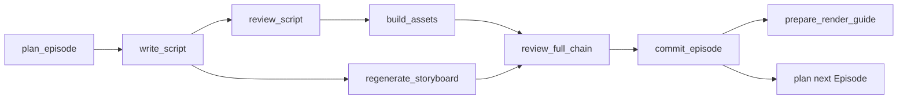
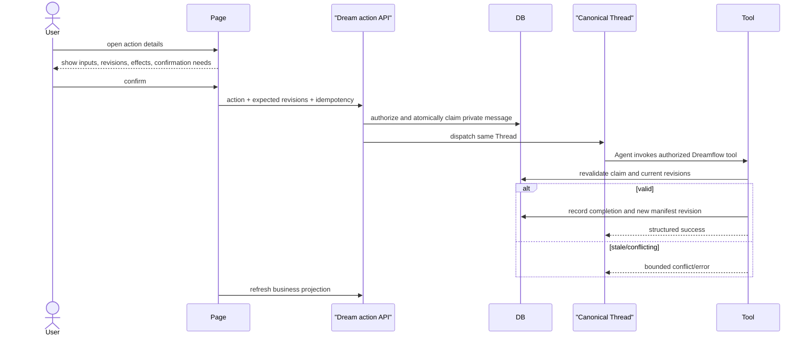

# Workflow actions

## Availability owner

The server derives action options from the sealed Episode registry, action
completion file, allowlist availability, expected revisions and Workflow
authority. The browser renders returned options and may submit only an enabled
option with its opaque command token/expected revision; it cannot invent an
action or path.

## Dependency graph

Regeneration requires the current script and storyboard revisions and does not
create a new Episode. Next Episode is available only when the current registry
and Project rules allow the next contiguous number; EP99 has no successor.

## Option DTO

Each option contains a stable action value, label, description, enabled state,
safe disabled reason, expected input/manifest revision and whether additional
runtime confirmation may occur. Display command is explanatory only and is not
executed by the browser.

The first two recommended enabled actions may be shown directly; remaining
options are grouped under “more actions”. Recommendation order never overrides
dependency validity.

## Submit and settlement

The page shows “submitted” only after the server claim succeeds. Chat terminal
does not prove a new Artifact exists; settlement completes when the refreshed
business projection contains the expected revision or an explicit domain error.

## Multi-Episode rules

- Registry numbers are contiguous and stable.
- A new Episode Run copies the complete current sealed Project snapshot and
  appends exactly one next entry.
- Concurrent successors use predecessor CAS; only one becomes current.
- Earlier Episodes remain readable from the new full snapshot.
- A retry preserves Episode identity and does not append another Episode.

## Stale and late responses

Action options are invalidated by any input revision change. A late success for
an older command cannot replace a newer observation. Reopening or refreshing
reconstructs pending/settled state from private dispatch facts and domain
completion, not local component state.
