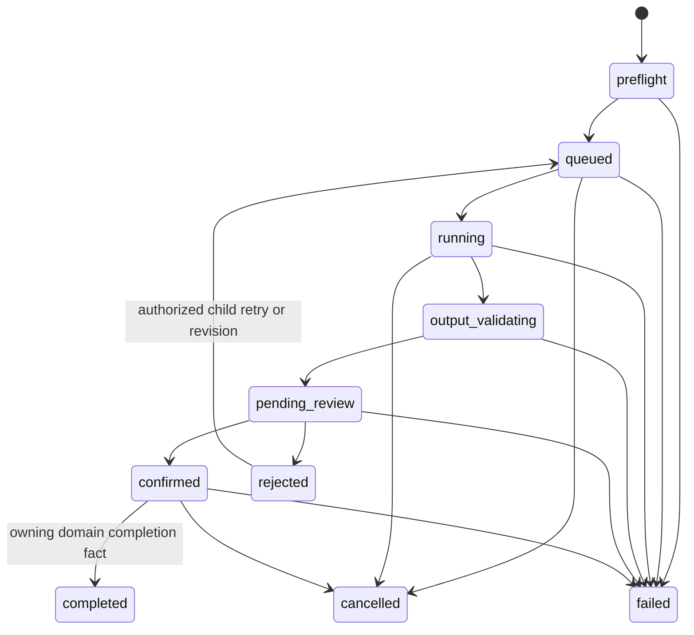

# Workflow execution

## Lifecycle

There is no separate “continue” business state. After confirmation, an Agent
turn may be running in the shared Thread while Workflow remains `confirmed`
until a domain completion/failure/cancellation fact arrives.

`rejected` is terminal for that attempt. An authorized retry/revision creates
a child Workflow Run in `queued`; it never reopens the rejected row.

## State ownership

- `workflow_runs.status` changes only through the Workflow owner and append-only
  transition facts.
- Claude Agent `finish`, SSE disconnect, page state and Observer activity cannot
  directly transition it.
- Artifact availability and Story Index status remain separate.
- A request produces at most one Workflow terminal and one Chat terminal in
  their respective domains.

## Launch

Launch validates subscription/model entitlement, Workspace ownership, frozen
Deck/plugin binding, goal limits and idempotency. It creates the Workflow Run,
source message and Thread binding in an auditable order, then dispatches one
standard thread turn. If dispatch cannot be proven, the durable claim exposes a
recoverable failure; it does not silently create a second message.

## Business confirmation

The user confirms the complete reviewed draft once, with expected version and
idempotency key. Server CAS changes `pending_review` to `confirmed` and enqueues
one private standard-thread command. Runtime tool confirmations that occur
afterward remain canonical Chat confirmations.

## Cancel, Stop and retry

- Stop cancels the active main Agent turn and is shown only while it is
  actually cancellable.
- Workflow cancel is an authorized business command and records `cancelled`.
- Browser disconnect is neither Stop nor cancellation.
- Retry creates a legal child attempt from an allowed failed/rejected/cancelled
  predecessor while preserving frozen source provenance.
- Guidance is permitted only by the owning service for an explicitly eligible
  confirmed or failed Run and uses the same Thread.

## Failures

- Preflight failure: no Agent turn, bounded user-safe reason.
- Failure before output: canonical Chat error + failed terminal; Workflow moves
  only when its owner has a failure fact.
- Failure after partial output: persisted partial assistant content plus the
  same single failed terminal.
- Domain output invalid: `output_validating -> failed` or remains reviewable
  according to explicit validation policy; never inferred from prose.
- Observer failure: logged and isolated, no change to SSE or Workflow truth.
