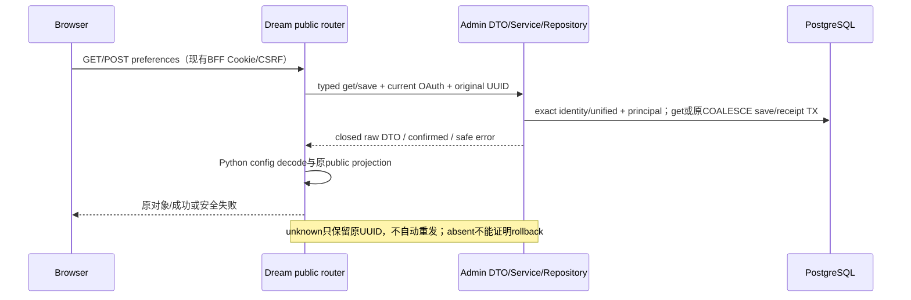

<!-- [Input] Actual Admin user preference contract and the existing public preference/default-voice APIs. -->
<!-- [Output] Current ownership, config/state/failure rules and acceptance for public preference get/save. -->
<!-- [Pos] User preference functional design; Runtime/system policy remains separately owned. -->
<!-- [Sync] 2026-09-15: migrate two public preference operations without changing original partial merge semantics. -->

# 用户偏好现行设计

## 背景与问题

用户保存Voice自定义配置、meta prompt、state配置、选中state与时区。原公开路由直接读写Dream PostgreSQL；Admin现在提供两个用户级领域operation，Dream需保留原公开对象与NULL合并行为。网络超时不能表示回滚，数值也不能经JavaScript重新编码丢失浮点类型、负零或大整数。

## 目标与边界

公开`GET/POST /api/preferences`经当前OAuth→Admin principal→领域Service/Repository/Drizzle，不接受外部user ID或Runtime grant。Dream只做公共输入、闭集DTO和原响应投影，无SQL；Admin校验identity/unified两项exact capability、当前用户与输入，并将save/receipt/audit放在同一事务。

`/api/default-voices`继续读取Dream本地`config.VOICE_ARCHETYPES`。System Config、模型/Workspace/effort/Deck策略、first-login写、import与后台context读取保持独立合同，不能由此preferences接口写入或扩大授权。不增加产品限制、默认值、确认或环境分支。

## 概念与规则

| 配置状态 | 程序行为 |
| --- | --- |
| default | default-voices返回现有配置；未保存preferences时GET返回`{}`，本接口不把default写成用户配置 |
| desired | POST五项optional公共字段；缺失或null转required nullable wire的null，空对象转`"{}"`，空字符串仍写入 |
| effective | GET返回当前已保存配置：raw JSON由Python还原voice_configs/state_config；其它五投影字段保持null/int/ISO时间 |
| revision | 合同没有revision/CAS字段；updated_at仅保存时间，不作版本号或并发比较 |

执行模块[公开路由](../../backend/routers/preferences.py)复用同一显式actor/threadpool调用。公共输入只允许voice_configs/meta_prompt/state_config/selected_state/timezone；配置必须是JSON对象，其余文本可null或string，拒绝user_id/first_login_completed/system_config。wire五字段全部required nullable；JSON原文只做Python object检查，不经JS重编码。first_login_completed只读JSON-safe整数或null，updated_at保持精确ISO微秒与offset。

Admin save执行原COALESCE合并：null保留已存字段，首次保存null允许空记录；空对象与空字符串是明确值。状态为未保存→已保存、已保存→按非null字段更新。Dream仅confirmed `{success:true}`返回成功；错误/unknown不产生另一条自动POST。GET null row返回`{}`，已保存行移除raw字段名、还原原config对象，其它字段保持。Stored raw对象含无法输出标准公共JSON的NaN/Infinity时安全503，不修复数据库或发save。

## 失败、影响范围与验收

公共错误字段/形状在领域I/O前拒绝。偏好路由保留typed OpenAPI，并在同一生产route handler捕获RequestValidationError，返回固定422 detail，不回显正文或校验input；NaN/Infinity/溢出数字、错误顶层形状和malformed JSON均适用。用户scope或OAuth失败拒绝，所有idg不能管理用户偏好。缺capability/hash不符、损坏DTO或stored config返回安全503；save timeout/响应不合法保留原request_id/outcome_unknown，不能把未收到成功当事务回滚。fresh catalog失败后下一次共享认证重新加载，其他领域不沿用空广告。

[实际HTTP技术用例](../../backend/tests/test_admin_preferences_routes.py)走原FastAPI/Auth/DTO与MockTransport，Dream PG fenced，覆盖未保存/partial/null/空对象/空文本、raw float/negative zero/bigint、时间、closed fields、scope、两capability/hash与unknown原UUID/no retry。[完整旧时序](history/pre-admin-user-preferences-20260915/sequence-diagrams.md)单独保存。该批技术结果不表示正常本机账户/Google/模型验收，其它数据库入口仍按[迁移清单](../exec/dream-admin-data-inventory.md)推进。
