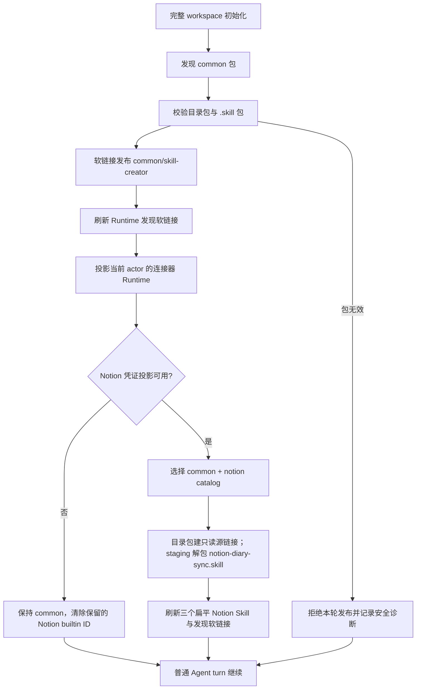
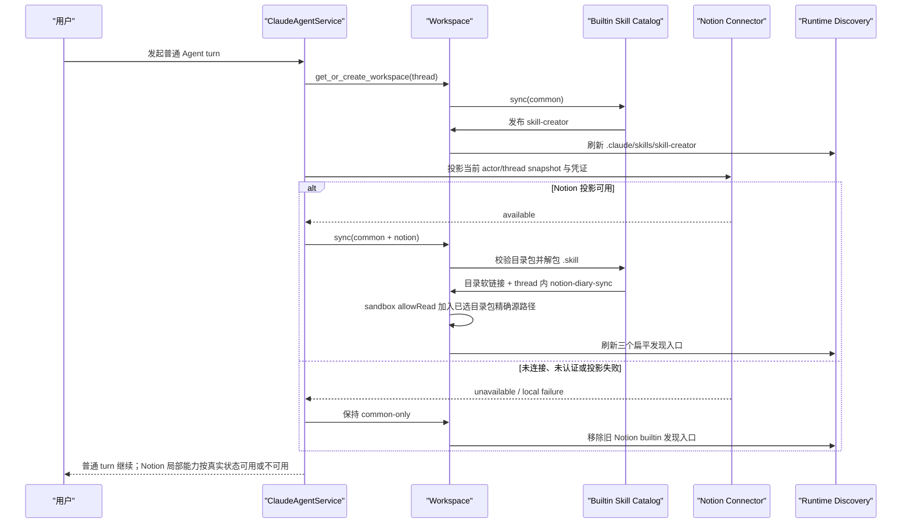

# Builtin Skills 平台目录与同步设计

Status: Accepted for implementation
Updated: 2026-09-01
Scope: `backend/builtin_skills` 的发布目录、`.skill` 解包、平台选择与 Runtime 发现

> [Input] `backend/libs/claude_agent_kit/server/workspace.py`,
> `backend/libs/claude_agent_kit/server/workspace_file_sync.py`,
> `backend/notion/capabilities.py`,
> `backend/claude_agent/service.py`,
> `docs/design/workspace/workspace-skills-flow.md`
> [Output] common/platform builtin Skill 的单一 catalog、同步状态规则、业务时序与验收边界。
> [Pos] workspace Skill 发布架构设计；不定义连接器认证、Notion 数据同步或用户上传文件协议。
> [Sync] 2026-09-01: establish common/platform source namespaces, canonical `.skill` unpacking, connector-bound platform activation, flat Runtime discovery, and reserved-ID cleanup.

## 1. 背景与问题

`backend/builtin_skills` 当前把所有目录视为需要同步到每个完整 thread workspace 的
内置 Skill。这种根目录扁平扫描有两个问题：

1. 无法表达 Skill 属于 Notion、飞书或未来其它平台，平台未启用时仍会进入 Runtime。
2. 扫描器只接受目录，标准 ZIP 形式的 `.skill` 包会被静默跳过。当前
   `notion-diary-sync.skill` 可被识别为合法归档，但真实 `init_workspace()` 回执中没有
   `notion-diary-sync`。

同时，`skill-creator` 是平台无关能力，应在 Workspace Mode 启用的所有 thread 中常驻，
不能依赖任何连接器状态。

## 2. 目标与边界

### 2.1 目标

- 源目录统一为 `backend/builtin_skills/common/` 与
  `backend/builtin_skills/<platform>/`。
- `common` 中的有效 Skill 在每次完整 workspace 初始化时刷新。
- platform Skill 只在当前 actor/thread 已有对应平台的有效 Runtime 投影时刷新。
- 目录包与 `.skill` 包经过同一个 catalog 与 ID 校验；目录包用精确只读软链接发布，
  `.skill` 才在当前 thread 内解包。
- `.skill` 在隔离 staging 中安全解包，成功后以扁平 Skill ID 发布到
  `workspace/skills/<skill-id>`。
- 保持 Claude Runtime 的 `.claude/skills/<skill-id>` 发现协议不变。

### 2.2 非目标

- 不新增数据库表、远程 registry、下载服务、队列或第二套 workspace。
- 不让 builtin Skill 源目录层级进入 Runtime 命令或用户界面。
- 不以部署环境名称决定平台能力。
- 不改变 Notion 认证、snapshot、Read hook、Agent turn、resume、cancel、EventBus 或 SSE。
- 不实现平台开关管理 UI；平台状态继续来自现有连接器与 Runtime 投影。

## 3. 概念与规则

### 3.1 源目录

```text
backend/builtin_skills/
├── common/
│   └── skill-creator/
└── notion/
    ├── notion-session/
    ├── notion-cli/
    └── notion-diary-sync.skill
```

`common` 是保留命名空间，不是平台。其它一级目录均为平台 ID。每个 Skill 可以是：

- 目录包：`<skill-id>/SKILL.md`；
- 归档包：`<skill-id>.skill`，ZIP 内必须只有一个 `<skill-id>/` 顶层包，且包含
  `SKILL.md`。

目录名、归档名和 `SKILL.md` frontmatter 的 `name` 必须一致。被选择命名空间中的 Skill
ID 必须全局唯一；common 与 platform 或两个已启用 platform 发生同名时 fail closed，
不得用隐式覆盖表达优先级。

### 3.2 状态语义

| 状态 | 含义 | 行为 |
|---|---|---|
| packaged | 源目录中存在且包合同有效 | 可被 Settings 元数据读取，不代表已进入某个 thread |
| platform disabled | 当前 actor/thread 没有该平台的有效 Runtime 投影 | 不发布该平台 Skill，并清除该平台保留 ID 的旧 builtin 副本 |
| platform enabled | 现有连接器链路已为当前 actor/thread 生成有效 Runtime 投影 | 发布该平台全部有效 Skill |
| synced | 目录源链接或归档 staging 发布成功，发现软链接已刷新 | Runtime 从 `.claude/skills/<id>` 发现 |
| package invalid | 路径、归档或 manifest 校验失败 | 保留本轮开始前状态并记录不含正文的错误；不影响普通 Agent turn |

对 Notion，`platform enabled` 的判定沿用现有 actor/thread 凭证投影：只有
`project_runtime_credentials()` 返回可用投影时才启用 `notion`。snapshot 暂无内容不会伪造
索引；Notion Skill 自身继续按现有安全错误处理。

### 3.3 发布与所有权

源码按命名空间组织，Runtime 继续扁平发布。目录包不复制到每个 thread，而是创建精确
只读源链接：

```text
backend/builtin_skills/notion/notion-cli/
  -> workspace/skills/notion-cli (symlink)
  -> workspace/.claude/skills/notion-cli
```

Sandbox 的 `allowRead` 只加入本轮已选择目录包的真实源目录；仍不允许写入该源，也不开放
整个 backend 或仓库。`.skill` 解包结果位于当前 workspace 内，不需要额外源目录许可。

所有已知 builtin Skill ID 都是 server-reserved：启用时覆盖陈旧副本，禁用 platform 时清除
其旧 builtin 副本。其它用户或 Agent 安装的 ID 不受影响。

`skill-creator` 只要求完整 Workspace Mode；它不因 Notion 或其它平台未连接而消失。

### 3.4 `.skill` 解包规则

`.skill` 复用现有 workspace 归档安全边界，并增加 Skill 包结构校验；目录包不解包：

- 拒绝绝对路径、`..`、反斜杠路径和 ZIP 符号链接；
- 拒绝多顶层包、空包、缺少 `SKILL.md`、ID 不一致和 frontmatter `name` 不一致；
- 先解到 workspace `skills/` 内的隔离 staging；完整成功后再替换目标；
- Runtime 目标不保留多余的顶层目录，也不保留 `.skill` 文件；
- 失败不发布半成品，不把错误扩散为 Agent turn 失败。

## 4. 正常与失败流程





## 5. 内容与交互边界

本次没有新增页面状态或确认弹窗。用户只通过既有连接器认证和 Agent 结果感知能力：

- 平台未连接时，不向 Runtime 暴露对应 Skill，不生成误导性的可用能力。
- 平台连接成功后的下一次 turn 自动刷新，无需用户手动安装 Skill。
- `.skill` 无效时不展示内部路径、归档条目或正文，只记录安全诊断并保持普通对话。
- `notion-diary-sync` 不携带固定用户数据库 ID、示例账号或一次性环境变量规避；目标库必须
  从当前 thread 的 `.notion/` 选择范围和用户意图解析。

## 6. 兼容、迁移与回滚

- 源目录迁移不改变 `workspace/skills/<id>` 与 `.claude/skills/<id>`，现有 slash command、
  context builder 和 Runtime 发现无需迁移。
- Notion Settings 能力目录通过同一 package catalog 读取目录包或 `.skill`，不要求先写入
  用户 workspace。
- 回滚代码时必须同时恢复根目录扁平源布局；已发布 workspace 副本可由旧刷新器在下一次
  init 修复。
- 不新增持久化 migration；禁用平台后的旧 builtin 副本由已知 server-reserved ID 精确清理。

## 7. 反过度设计评审

| 分类 | 结论 |
|---|---|
| 保留 | 现有 workspace 初始化、用户 Skill 目录、发现软链接、Notion 投影和局部失败边界 |
| 修改 | 源目录发现、平台选择、builtin 刷新和 `.skill` 结构化解包 |
| 删除 | 根目录直接枚举、静默跳过 `.skill`、归档中的固定业务库标识和临时 `unset` 指令 |
| 延期 | 远程 registry、数据库 manifest、下载缓存、平台 UI、版本求解和热更新服务 |

单一 catalog 是必要抽象：workspace 发布和 Notion Settings 都需要读取同一份目录/归档包；
分别实现 ZIP 读取会形成两条漂移路径。除此之外不新增服务或状态存储。

## 8. 验收标准

1. common `skill-creator` 在没有任何平台连接时仍同步并可被 Runtime 发现。
2. Notion 未启用时三个 Notion Skill 均不进入新 workspace，旧 builtin 副本被精确移除。
3. Notion Runtime 投影可用时，两个目录包和 `notion-diary-sync.skill` 都以扁平 ID 同步。
4. `.skill` 不产生 `notion-diary-sync/notion-diary-sync/SKILL.md` 双层嵌套。
5. 路径穿越、ZIP 符号链接、ID 不一致、缺失 manifest 和重复 ID 均 fail closed。
6. Settings 可从真实 Notion platform 包读取三个 Skill 的 metadata/body/file inventory。
7. 目录型 builtin 的 workspace 条目是只读源链接，`.skill` 的 workspace 条目是当前
   thread 内的解包目录；两者均可从 `.claude/skills/<id>` 发现。
8. 用户安装的非 builtin Skill、普通 Chat、Notion snapshot/Read hook 与 turn 语义不变。
9. 同步错误和测试输出不包含凭证、用户正文或固定真实业务 ID。
