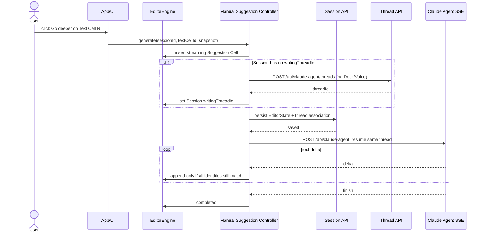

<!-- [Input] Writing editor Cell state, persisted user Session JSON, Claude Agent Thread/SSE contracts, and the three manual-suggestion visual references. -->
<!-- [Output] Product interaction, ownership, lifecycle, recovery, accessibility, and acceptance contract for manual Writing suggestions. -->
<!-- [Pos] Canonical design contract for product-level WritingSuggestionCell behavior in docs/design. -->
<!-- [Sync] 2026-09-01: replace debounced random-Voice inspiration with manual, Session-thread-bound persistent suggestion Cells. -->
<!-- [Sync] 2026-09-01: make the latest suggestion the sole regeneratable Cell while preserving earlier Cells as read-only history. -->

# Writing 手动建议 Cell 交互与实现设计

## 1. 背景与问题

Writing 当前把“建议”实现成编辑器末尾的临时 `InspirationHint`。普通输入先由 `App.tsx` 把 `onInspirationTextChange` 交给 `useTextCells`；`useTextCells.handleTextChange` 在每次 textarea 变化后拼接全部 TextCell；`useInspiration.onTextChange` 再启动 2 秒定时器；定时器到期后调用 `voiceApi.getSuggestion`。因此输入、粘贴、标点、回车产生的 `onChange` 和停止输入都可能间接启动模型请求。

`getSuggestion` 还会从全部 enabled Voice 中执行 `Math.floor(Math.random() * enabledVoices.length)`。建议的标题和系统身份来自随机 Voice，Thread 也属于该 Voice，而不是当前 Writing Session。结果是：同一 Writing Session 可能跨多个 Voice Thread，不同 Writing Session 也可能复用同一 Voice Thread；诸如“投资策略专家”的任意已启用 Voice 会随机出现在写作建议中。

现有实现的完整调用关系如下：

```text
textarea onChange
  → App.handleTextChange
  → useTextCells.handleTextChange
  → 拼接所有 TextCell
  → useInspiration.onTextChange
  → 2 秒 debounce
  → voiceApi.getSuggestion
  → Math.random 选择 enabled Voice
  → ensureVoiceThread（Voice 级 thread_id）
  → chatWithVoiceSSE（POST /api/claude-agent）
  → InspirationHint（EditorState 外的临时 UI）
```

Enter 没有独立提交语义：Writing 的 keydown 仅处理 Escape 和 `@` Agent 入口，textarea 原生行为负责换行。问题不在 Enter handler，而在换行后的 `onChange` 仍进入上述 debounce 链路。新设计必须彻底切断“编辑事件 → 模型请求”的连接，而不是只屏蔽 Enter。

### 1.1 已核实的持久化条件

Writing Session 已把完整 `EditorState` 保存到 `user_sessions.editor_state_json`，Session API 原样保存和恢复 JSON。该能力可以持久化 Session 根级 `writingThreadId` 和独立 Suggestion Cell，不需要数据库 schema 变更。

后端 Session 摘要与聚合只抽取 `cell.type === "text"` 的内容；前端 Weight 也只拼接 TextCell。这是 Suggestion Cell 不进入正文、Weight、Energy、摘要和字数的既有安全边界。实现仍需用测试锁定，防止未来回归。

## 2. 目标与边界

### 2.1 目标

- 模型建议只能由用户点击 `Go deeper / 深入一下` 或建议 Cell 内的重试操作触发。
- 建议是 `EditorState.cells` 中独立、只读、可排序、可保存、可恢复的 `WritingSuggestionCell`。
- 一个 Writing Session 最多绑定一个产品级 Claude Agent Thread；同 Session 的首次生成、后续新建议和重新生成全部复用它。
- 建议使用现有 `/api/claude-agent/threads`、`/api/claude-agent` 和共享 SSE parser，不增加平行 Session runtime 或 parser。
- 请求必须绑定点击时的 Session、目标 Suggestion Cell、请求版本、Thread 和正文快照；正文后续变化不能改变本次请求的写入目标。
- 支持浅色、深色、桌面和移动端，使用现有颜色、边界、背景、焦点和文本 Token。

### 2.2 边界

- 不恢复 `analyze_text`、PolyCLI、`GatewayPolyAgent`、`inference.py` 或图片生成链路。
- 不从 Deck 或 Voice 选择 Agent，不读取 Voice `thread_id`，不使用 Voice 名称、图标、颜色或 Prompt。
- 不改变 `ChatWidgetUI` 的结构、布局、发送、折叠或 Chat 跳转行为。
- 不把建议转为可编辑正文，不提供接受、替换、复制入正文等未定义操作。
- 不新增 Dream HTTP 控制通道、消息队列、restart/kill/shell 控制或数据库 DDL。
- 截图中的 `+` 没有与当前产品一致的通用 Cell 插入语义。现有 `@` 是明确的 Agent Link 插入入口，但不等价于 `+`；本期不添加 `+`。
- Thread 随 Session 删除而自动物理删除不在本期范围。删除 Session 会删除关联引用；已创建的 Chat Thread 继续遵循现有 Chat 历史生命周期，避免隐式破坏用户对话。

## 3. 概念与规则

### 3.1 核心对象

```text
Writing Session 1 ── writingThreadId: Thread A
  ├── Text Cell 1
  ├── Suggestion Cell A（anchor: Text Cell 1）
  ├── Text Cell 2
  └── Suggestion Cell B（anchor: Text Cell 2）

Writing Session 2 ── writingThreadId: Thread B
```

- **Writing Session**：用户可保存和重新打开的一份 `EditorState`，Session ID 是持久化与异步隔离的第一身份。
- **Writing Thread**：Session 根级可选 `writingThreadId`。首次手动请求前不存在；创建成功并持久化后才可开始 Agent turn。
- **Text Cell**：用户正文的唯一来源，继续负责 Weight、Energy、字数、摘要和正文上下文。
- **WritingSuggestionCell**：Agent 对某一个 Text Cell 快照生成的只读建议。它不是 TextCell，也不是通用 Widget。
- **锚点**：至少包含 `textCellId` 和点击时的 `textSnapshot`。生成和重新生成始终使用该不可变快照；用户之后的编辑不会改写历史建议的语义。
- **请求版本**：每次生成或重新生成产生新的 `requestId`。只有 Cell 当前 `requestId` 与回调一致时，delta、finish 或 error 才能写入。
- **最新建议**：当前 Session Cell 序列中位置最后的 WritingSuggestionCell。只有它可以显示 Refresh 或 Retry；更早的建议保留内容和状态，但作为历史记录不可再次触发。

### 3.2 产品规则

1. 页面初始态没有 Suggestion Cell，也没有建议网络请求。
2. 输入、粘贴、IME composition end、回车、标点和停顿只更新正文与本地统计。
3. 非空 Text Cell 且没有以其 `id` 为锚点的 Suggestion Cell 时，在该 Text Cell 下展示手动入口。
4. 点击入口同步插入 `streaming` Suggestion Cell；Thread 创建、Session 保存和 SSE 都发生在插入之后。
5. Suggestion Cell 后必须存在可继续写作的 Text Cell，从而形成正文与建议交替的序列。
6. 同一个 Text Cell 只有一个对应 Suggestion Cell；重新生成复用该 Cell。
7. 同一 Session 同时只允许一个建议 turn；`streaming` 时不显示任何新提交或重试入口，但所有 Text Cell 仍可编辑。
8. 建议内容永远不参与下一次正文快照。后续建议只发送其锚定 Text Cell 的用户正文快照；同 Thread 的历史对话只提供生成连续性，不改变正文统计。
9. Session 根没有已持久化 Thread ID 时不得开始 SSE。Thread 创建或关联保存失败时 fail closed，Cell 进入可重试失败态。
10. Session 切换、新建或组件卸载会 Abort 当前浏览器流；所有晚到回调还必须通过身份校验。
11. 只有序列中最后一个 Suggestion Cell 展示 Refresh 或 Retry。生成后续建议时，所有更早 Suggestion Cell 自动转为无操作的只读历史记录。

## 4. 用户故事

- 作为写作者，我可以自由输入和停顿，不担心模型自动打断我或消耗调用。
- 当我想探索当前段落时，我点击“深入一下”，立即看到一个独立建议区域开始生成。
- 生成期间我可以继续在下一个正文 Cell 写作，建议仍只对应我点击时的段落。
- 我可以保留旧建议，在后续正文后再生成新建议；全部建议保持原顺序。
- 我对最新建议不满意时，可在原 Cell 重新生成，不产生重复卡片或新 Thread；生成后续建议后，更早的建议成为只读历史。
- 刷新或重新打开 Session 后，我仍能看到建议和 Session 的原 Thread 归属。
- 流中断时，我能看到保留的内容、明确错误和重试入口，而不是静默丢失。

## 5. 信息架构与页面结构

```text
Writing Canvas
└── Session Cell Sequence
    ├── TextCell
    │   └── Go deeper（满足条件时）
    ├── WritingSuggestionCell
    │   ├── Suggestion boundary（细竖线）
    │   ├── Streaming / completed / failed content
    │   └── Refresh / Retry（仅序列中的最新建议）
    ├── TextCell
    │   └── Go deeper（有新正文时）
    └── …
```

入口是 Text Cell 的后置操作，不是页面级悬浮按钮。建议 Cell 与其锚点在序列中相邻；编辑器滚动、Session 保存和恢复都消费同一顺序。

## 6. Cell 数据模型

```ts
type WritingSuggestionStatus = 'idle' | 'streaming' | 'completed' | 'failed';

interface WritingSuggestionError {
  code: string;
  message: string;
  retryable: boolean;
}

interface WritingSuggestionAnchor {
  textCellId: string;
  textSnapshot: string;
}

interface WritingSuggestionCell {
  id: string;
  type: 'writing-suggestion';
  content: string;
  status: WritingSuggestionStatus;
  anchor: WritingSuggestionAnchor;
  createdAt: string;
  updatedAt: string;
  error?: WritingSuggestionError;
  requestId?: string;
  previousContent?: string;
}

interface EditorState {
  // existing fields...
  writingThreadId?: string;
  cells: Array<TextCell | WidgetCell | WritingSuggestionCell>;
}
```

`previousContent` 只用于重新生成的平滑替换：开始重试时保留旧完成内容并降低强调；第一个新 delta 到达后展示新内容；重试失败时恢复旧完成内容。Cell 不存自己的 Thread ID，所有请求只引用 Session 根级 `writingThreadId`。

## 7. Thread 生命周期

### 7.1 懒创建与持久化

1. 首次点击先插入 Suggestion Cell。
2. 若当前 Session 已有 `writingThreadId`，直接复用。
3. 若没有，调用既有 `POST /api/claude-agent/threads`，请求不携带 Deck ID 或 Voice ID。
4. 将返回 ID 写入当前 `EditorState.writingThreadId`。
5. 通过既有 Session 保存 API 持久化包含 Thread ID 和 streaming Cell 的 EditorState。
6. 只有保存成功才调用 `/api/claude-agent`；保存失败进入 `WRITING_THREAD_PERSIST_FAILED`，不得继续 SSE。

同一 Session 的并发首次点击共享一个 in-flight Thread Promise。Promise 完成时若当前 Session 已切换，结果不得写入新 Session。

### 7.2 恢复、切换与清理

- **重新打开/刷新**：从 `editor_state_json` 恢复 `writingThreadId` 和 Cell 顺序。遗留 `streaming` Cell 归一为 `failed/WRITING_SSE_INTERRUPTED`，保留已有部分内容并允许重试。
- **切换 Session**：Abort 当前浏览器请求；加载目标 Session 自己的 `writingThreadId`。晚到回调因 Session ID 不匹配被拒绝。
- **新建 Session**：新 EditorState 不带 `writingThreadId`，首次点击创建新 Thread。
- **清空 Session**：显式清空进入新的空文档状态时移除建议和 Thread 引用；不删除 Chat Thread 本体。
- **删除 Session**：Session JSON 与关联引用一起删除；不隐式级联删除 Thread。

## 8. 交互状态机

```mermaid
stateDiagram-v2
    [*] --> NoSuggestion
    NoSuggestion --> Streaming: click Go deeper / insert Cell
    Streaming --> Completed: finish for current request
    Streaming --> Failed: create, persist, SSE or interruption error
    Completed --> Regenerating: latest Cell clicks Refresh / same Cell
    Regenerating --> Completed: finish for newer request
    Regenerating --> Failed: error; restore previous content
    Failed --> Streaming: latest Cell clicks Retry / same Cell
    Streaming --> Streaming: text-delta for current request
    Streaming --> Streaming: stale delta ignored
```



`idle` 是序列化兼容状态：可用于导入或未来显式排队，但当前点击会直接从“无 Cell”创建为 `streaming`，不展示可见 idle 阶段。

## 9. 页面状态说明

### 9.1 初始态

- 空 Text Cell 只显示现有正文 placeholder。
- 不渲染建议 Cell 和 `Go deeper`。
- 不调用 Thread 或 Agent API。

### 9.2 可触发态

- Text Cell `trim()` 后非空，且不存在 `anchor.textCellId === cell.id` 的建议时显示按钮。
- 按钮使用 Sparkles 图标；英文 `Go deeper`，中文 `深入一下`。
- Enter 保持换行；不绑定生成快捷键，避免与输入法和普通写作冲突。

### 9.3 Streaming 态

- Cell 已在正文序列中，左侧细竖线已经可见。
- 尚无 delta 时显示轻量 Sparkles pulse 和“正在深入…”的无障碍状态。
- delta 到达后按顺序追加到同一 Cell，形成真实打字机效果。
- Cell 操作禁用/隐藏，其他 textarea 保持可编辑。

### 9.4 完成态

- 内容为蓝色强调文本，默认只读。
- 左侧细竖线使用现有 action-link Token 的低对比混合色。
- 如果该 Cell 是当前序列中的最新建议，内容下方显示 `Refresh / 重新生成`。
- 生成新的后续建议后，旧 Cell 的内容和状态保持不变，但 Refresh 隐藏；历史建议不再重新打开旧正文锚点。

### 9.5 重新生成态

- 复用原 Cell、锚点快照和 Session Thread。
- 旧内容保留并淡化，避免点击后突然空白。
- 第一个新 delta 到达时切换为新内容；后续 delta 按序追加。
- 新请求使用新的 `requestId`，旧请求的 delta/finish/error 全部失效。

### 9.6 失败与恢复态

- 新生成失败：保留已收到的部分内容；没有内容时显示简短错误。
- 重新生成失败：恢复重试前的完整内容，同时显示错误说明。
- 最新建议的可恢复错误展示 `Retry / 重试`；历史建议即使曾失败也隐藏 Retry。不可恢复错误保留 Cell，但不展示操作。
- 错误信息只展示安全产品文案；保存结构化 `code`，不显示凭证、Prompt、正文请求体或服务堆栈。

### 9.7 继续写作后的新入口

- 插入 Suggestion Cell 时确保其后存在 Text Cell。
- 用户在该 Text Cell 写入有效正文后，显示新的 `Go deeper`。
- 新点击插入新的 Suggestion Cell，复用 Session Thread，只发送新 Text Cell 的锚点快照。

## 10. SSE 数据流



SSE 读取必须调用共享 `consumeClaudeAgentSseStream`。Suggestion 层只订阅 `text-delta`、`finish` 和结构化 `error`；不复制帧切割、CRLF、Unicode 或尾帧处理。

## 11. 并发与过期响应处理

每个请求固定以下身份：

```text
sessionId + suggestionCellId + requestId + writingThreadId + textSnapshot
```

写入前依次验证：

1. 当前 Engine Session ID 仍等于请求 Session ID。
2. Suggestion Cell 仍存在。
3. Cell 当前 `requestId` 等于回调 requestId。
4. Session 当前 `writingThreadId` 仍等于请求 Thread ID。

任一不匹配都无副作用返回。Refresh 先替换 Cell 的 `requestId`，因此旧请求即使晚到也不能覆盖。Session 切换还会 Abort browser reader，身份校验作为第二层保护。

## 12. 历史兼容

- 没有 `writingThreadId` 的历史 Session 正常加载，且不会自动创建 Thread。
- 历史 `text` 和 `widget` Cell 保持原序列和行为。
- `EditorEngine.loadState` 对缺少新可选字段的状态补默认值，不要求数据迁移。
- Suggestion Cell 字段损坏时保留其他合法 Cell；不可安全恢复的建议归一为失败态，而不是伪装为 TextCell。
- Voice 上已有 `thread_id` 不迁移到 Writing Session，因为无法证明它只属于该 Session；首次点击创建新的产品级 Thread。

## 13. 移动端、桌面端与主题

- 桌面内容宽度继续由 Writing canvas 的现有 `maxWidth` 决定；建议不创建横向滚动。
- 移动端按钮触控高度至少 44px，文本和边界占满可用宽度，操作可换行。
- 建议内容允许任意 Unicode 与长单词换行，使用 `overflow-wrap: anywhere`。
- 浅色、深色均只使用 `--color-action-link`、`--color-text-*`、`--color-bg-*`、`--color-border-*`、`--color-state-*` 和 `--color-shadow-*`。
- Sparkles pulse 尊重 `prefers-reduced-motion: reduce`；关闭动画时仍显示静态图标和状态文本。

## 14. 键盘与无障碍

- Enter、Shift+Enter 和 IME Enter 均由 textarea 处理，不触发生成。
- 按钮使用原生 `<button type="button">`，支持 Tab、Enter、Space。
- 触发按钮的 accessible name 与可见 i18n 文案一致。
- Suggestion Cell 使用带标签的只读 region；状态变化通过短 `role="status"` 文案播报，避免每个 token 重复朗读。
- 最新建议上的 Refresh/Retry 具有明确标签；历史建议没有可聚焦操作；streaming 时用 `aria-busy="true"`。
- `:focus-visible` 使用现有 focus Token，不能只靠颜色表达错误或状态。

## 15. i18n 文案

| Key | English | 中文 |
|---|---|---|
| `writingSuggestion.goDeeper` | Go deeper | 深入一下 |
| `writingSuggestion.loading` | Going deeper… | 正在深入… |
| `writingSuggestion.refresh` | Refresh | 重新生成 |
| `writingSuggestion.retry` | Retry | 重试 |
| `writingSuggestion.regionLabel` | Writing suggestion | 写作建议 |
| `writingSuggestion.failed` | The suggestion was interrupted. Your writing is unchanged. | 建议生成中断，你的正文未受影响。 |
| `writingSuggestion.unavailable` | Suggestions are unavailable right now. | 暂时无法生成建议。 |

错误码到文案的映射由前端单一 helper 管理，未知错误统一映射为 `unavailable`。

## 16. 错误反馈

| 错误码 | 含义 | 可恢复 | UI 行为 |
|---|---|---:|---|
| `WRITING_THREAD_CREATE_FAILED` | Thread API 失败 | 是 | 最新 Cell：failed + Retry |
| `WRITING_THREAD_PERSIST_FAILED` | Thread/Cell 关联未保存 | 是 | fail closed，不发 SSE |
| `WRITING_SSE_INTERRUPTED` | 网络中断或无 finish 结束 | 是 | 保留部分/旧内容；最新 Cell 显示 Retry |
| `WRITING_REQUEST_FAILED` | Agent 返回可恢复错误 | 由协议决定 | 最新 Cell 按 retryable 显示操作 |
| `WRITING_REQUEST_STALE` | 请求身份已过期 | 否且不展示 | 静默忽略，不改 Cell |
| `WRITING_ANCHOR_EMPTY` | 锚点正文为空 | 否 | 不插入、不请求 |

## 17. 验收标准

1. 普通输入、粘贴、IME 结束、回车、标点和停止输入超过 2 秒均不创建 Thread、不发送 Agent 请求。
2. 非空且未建议的 Text Cell 下显示 i18n `Go deeper`；空 Cell 和已有建议的锚点不显示。
3. 单次点击同步插入一个 `streaming` Suggestion Cell，重复点击不产生第二个 Cell 或请求。
4. 同一 SSE 的 delta 按到达顺序追加到同一 Cell；finish 后状态为 completed。
5. 最新建议的 Refresh 复用 Cell、锚点和 Session Thread；旧内容按本设计平滑替换。
6. 同一 Session 多个建议使用同一 Thread；新 Session 没有旧 Thread ID。
7. Session 保存/刷新后恢复 Thread、Cell 顺序、内容和 completed/failed 状态。
8. 生成期间编辑任意 Text Cell不会改变当前请求快照或写入目标。
9. Refresh、Session 切换或新请求使旧响应失效；旧 delta/finish/error 不覆盖新状态。
10. Thread 创建、关联保存、SSE 中断和 Agent error 都进入明确可恢复状态。
11. Suggestion 内容不进入 Weight、Energy、Session 首行、正文聚合、字数或下一次正文快照。
12. 源码和可见 UI 不再包含随机 Voice 建议标题；Writing 建议请求不带 Deck/Voice ID。
13. `ChatWidgetUI` 源码布局不发生变化。
14. 浅色、深色、桌面和移动视口无文档级横向溢出，按钮和内容可见可操作。
15. SSE parser 使用共享实现；不存在新的帧切割器。
16. 同一 Session 有多个 Suggestion Cell 时，只有序列中最后一个显示 Refresh 或 Retry；更早 Cell 仍显示其持久内容且没有操作按钮。

## 18. 明确非目标

- Suggestion 接受、应用、转正文、对比版本、复制或删除交互。
- 通用 `+` Cell 菜单。
- 为 Writing 新建专用后端 Session/Thread 表或 API runtime。
- 自动恢复正在后台运行的建议 turn；刷新后的 streaming 状态按中断恢复。
- 自动删除无引用 Thread。
- Deck/Voice persona、模型选择器、Prompt 编辑器或建议长度设置。
- 修改 `ChatWidgetUI`、Comments、Reflections、Timeline 或 Dream Agent 行为。

## 19. 实现归属与变更判断

| 现有单元 | 判断 | 原因 |
|---|---|---|
| `EditorEngine` | 重构/扩展 | 负责 Suggestion Cell 序列、状态变更、迁移和正文统计边界 |
| `useTextCells` | 删除建议回调 | 只保留输入、IME、粘贴、键盘和本地文本职责 |
| `useInspiration` | 删除并替换为纯手动控制器 | 自动 debounce、临时 hint 和 Voice Thread 归属均不再成立 |
| `voiceApi.getSuggestion` | 删除 | 包含随机 Voice、Voice Prompt 和旧临时结果结构 |
| Claude Agent Thread API | 复用 | 已支持无 Deck/Voice 的 actor-owned Thread |
| Claude Agent SSE parser | 复用 | 已处理增量帧、CRLF、Unicode、尾帧和结构化错误 |
| Session JSON API | 复用 | 可持久化根 Thread ID 与新 Cell，无 schema 缺口 |
| `InspirationHint` | 删除 | 临时、页面末尾、Voice 标题的视觉与数据语义错误 |
| `ChatWidgetUI` | 不修改 | 与新 Suggestion Cell 无真实依赖 |
| `WritingSuggestionCell` UI | 新增 | 独立只读数据类型需要独立可访问视觉表达 |

## 20. 风险与可测试边界

- 浏览器 Abort 不等价于停止服务端 turn；正确性依赖 requestId/Session/Thread 校验拒绝晚到事件。
- Thread 创建成功但关联保存失败会留下无引用 Thread。为保证 1:1 语义，当前请求 fail closed 并复用内存中的 ID重试保存，不创建第二个 Thread。
- `editor_state_json` 是现有 capability，不需要 Admin Drizzle migration；若目标环境缺少 `user_sessions` 或 Session API，关联保存失败并 fail closed，不能降级到 Voice/local fake 关联。
- 真实模型措辞质量不是 provider-free 单元测试边界；传输、身份、顺序、错误和 UI 状态可以通过 mocked SSE 确定性验证。
- 视觉验收应覆盖 1440px 桌面、窄移动视口、浅色、深色、初始/streaming/completed/failed/refresh 状态，并断言零文档级横向溢出。
