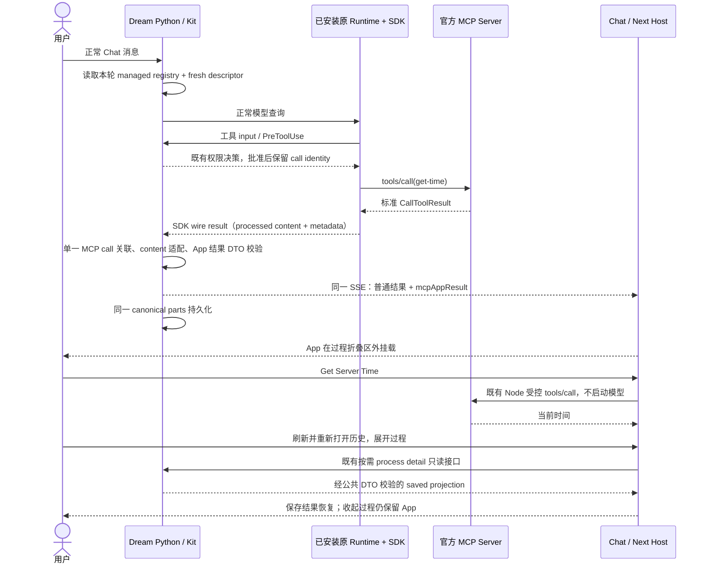

<!-- [Input] Original task receipts, current local service observations and production Next/Browser sandbox owners. -->
<!-- [Output] Minimal dynamic-entry recovery design, review and separate live versus isolated evidence. -->
<!-- [Pos] Local recovery receipt; not production enablement or a second Host design. -->
<!-- [Sync] 2026-09-13: replace fixed-port sandbox configuration with the actual frontend entry and enforced opaque isolation. -->
<!-- [Sync] 2026-09-13: record original Runtime SDK wire-result recovery, approval correlation and live/history verification. -->

# MCP Apps 本机恢复与动态入口

以下动态入口修复为历史回执；已随 Dream PR #54 合并到 `develop`。
本轮后续故障与修复见文末 SDK wire-result 章节，不改写原验收范围。

## 背景与问题

原任务“MCP APP功能新增”（`01a07262-9a8d-7391-ab2c-59c754b5fa08`）
协调“MCP Apps 全阶段实现与验收（Sol）”
（`01a07268-c717-7961-b5fd-e0e8436d674f`）。旧回执覆盖真实 `get-time`
页面、时间按钮、Chat 消息和历史恢复；后续按用户要求停止了任务自有服务。
历史指令仅用于核查过程，不作为本轮操作授权。

本轮失败探测早于官方示例进程启动；重新进入连接详情后发现成功：
1 Tool、1 Resource、0 Prompts，工具 `get-time`，资源
`ui://get-time/mcp-app.html`。真实历史 Host 请求已成功且四项 effective 能力
均 enabled，但沙箱 URL 指向已停止的固定端口，父来源配置也与实际入口别名不符。
用户明确要求沙箱随前端入口动态变化，不能另建固定端口代理。

## 目标与边界

- 恢复真实 Dream→Python 配置→Next Host→官方 MCP→App 页面链路。
- 沙箱 URL 随实际前端协议、主机名、端口变化；正常启动 Next 即提供页面。
- 不另启 Host 或沙箱监听器，不增加代理、数据库 migration、依赖、配置面板或模型调用。
- 保持认证、连接 revision、低风险 positive list、CSP 和两层 iframe 隔离。
- 普通结果始终保留；不修改 SDK／Runtime 版本或 `productionAppsEffective=false`。

## 概念与规则

1. status 返回版本和插件 revision 绑定的根相对路径 `/mcp-apps-sandbox`。
   Browser 以真实入口解析完整 URL，只接受当前 origin 下的该路径；不按端口加一，
   不从环境标签推断入口，也不接受旧独立域名、端口或任意页面路径覆盖。
2. 现有 Next route 提供页面，沿用已验证的 public Host/protocol parser 精确绑定
   父页面来源。浏览器不得提供代理目标；旧 `INK_MCP_APPS_SANDBOX_URL` 与
   `INK_MCP_APPS_PARENT_ORIGINS` 不再决定挂载或父来源。
3. **URL 来源与文档有效来源不同。** 两层 iframe 均仅有 `allow-scripts`，
   外层 HTTP CSP 另强制 `sandbox allow-scripts`。文档实际 origin 为 `null`，
   不能访问父 DOM 或存储；消息仍检查精确 `event.source` 和对应来源。
   外层移除 iframe 属性也不能解除响应 CSP 的限制。Web permissions 与关闭网络的
   resource CSP 不变。
4. 这是 Dream 已有的严格零权限 technical-preview profile，不声明实现标准中
   带 `allow-same-origin` 的通用独立域名宿主模式。未来若增加该 token 或 Web
   capability，必须重新设计独立来源，不能沿用同入口 URL 直接放宽。
5. 工具发现仍为 cache-first。先启动外部 MCP Server，再进入详情；旧失败缓存
   按原 TTL 失效，不新增强制刷新按钮或无限轮询。
6. 通过现有 **Try interactive view again** 重试已降级的 App，不重放历史初始工具。
   App 时间按钮仅局部调用，不启动模型；消息按钮仍是当前 Chat 的新 turn。

## 设计评审

发现、App 结果 DTO 校验、权限与 Host 生命周期已符合目标，不重写。只修改沙箱 URL 组合、
Browser URL 校验、现有 sandbox route 的精确父来源与 CSP，并复用公开请求来源解析。
隔离 harness 改为一个随机前端入口，刻意传入过期配置验证其不能钉死 URL。
无需新启动脚本、第二进程、端口注册或额外部署体系，符合最小修复目标。
README 同时校正已过期的“保存使用策略”说明为当前自动保存。

## 验证记录

- 修复前真实浏览器：匿名连接成功，发现响应 `complete`、无 error；历史 Host
  认证成功且 effective 四项 enabled。普通结果保留，未启动新模型消息。
- 确定性验证：Host policy 5 tests passed；Runtime 39 tests passed；MCP Apps
  及全前端 TypeScript 检查通过。两个需要随机监听端口的测试在允许测试监听后通过。
- 最终检查：本轮 6 个生产源文件 ESLint、两套 TypeScript 和 `git diff --check`
  均 exit 0。双语 README 均 27 个 heading、13 个 fenced block，命令完全一致；
  本轮新增 Markdown 链接目标存在。未将其他旧文档的示例链接纳入本轮修复。
- 隔离 Chrome 回归：官方 1.7.4／1.7.5 协议 smoke、1.7.5 生产 Host 完整生命周期、
  window.im policy downgrade 共 4 tests passed（12.1s）。同前端随机入口挂载成功；
  两层文档 origin 均为 `null`，父 DOM／存储被拒；过期 URL／父来源配置不影响挂载。
  时间按钮、消息回流、历史不重放和标准 DELETE 回归均保留。
- 修复后本机真实页面：已有账户和历史 `get-time` 结果沿生产 Next/后端链路挂载，
  `ready`，无 fallback，单 App 实例。沙箱 URL 使用浏览器当前前端入口。
  点击真实 **Get Server Time**，时间从 `2026-09-06T11:04:40.760Z` 更新为
  `2026-09-13T05:52:46.222Z`；收起历史过程后按钮仍可见。
  未重放历史初始工具、未发送新模型消息；本轮未重验真实 OAuth／消息结算。

修复先在独立工作树验证，再将本轮提交仅本机 fast-forward 到 Dream `develop`。
未推送、发布或重启用户前端／后端／Admin；既有 Next 自动加载源码。
本机 sandbox HTTP 200，响应 CSP 包含 `sandbox allow-scripts`，设备权限仍关闭；
原前端、后端、Admin 和官方示例继续监听，无额外沙箱端口监听。

## 本机操作与隔离回归

沿用已有 Admin、Python 后端与 Next 前端；另启官方 MCP Server。
无需手动清单第五个沙箱进程，详见 [README](../../../README.zh.md#本机预览服务)。
不为测试清理停止用户服务。

```bash
cd frontend
INK_MCP_APPS_OFFICIAL_ARTIFACT_CURRENT=/absolute/path/to/server-basic-vanillajs-1.7.5 \
INK_MCP_APPS_OFFICIAL_ARTIFACT_PREVIOUS=/absolute/path/to/server-basic-vanillajs-1.7.4 \
corepack pnpm exec playwright test \
  e2e/mcp-apps/phase-1/official-phase1-3.spec.ts \
  e2e/mcp-apps/phase-1/window-im-runtime-policy.spec.ts --reporter=line --workers=1
```

路径必须指向已准备的官方制品根目录，沿用安装的本机 Chrome。
该 harness 只证明生产模块技术合同，不证明真实账号、模型、OAuth 或消息结算。

## 2026-09-13 后续：原 Runtime SDK 结果适配

### 背景与问题

真实正常 Chat 的新 `get-time` 调用返回了时间，但没有 App 或降级卡片。
旧动态入口验收复用了已保存的完整结果，未覆盖原结构 Runtime 的新模型工具
调用。最后一轮 AGENTS 只修改 Runtime/SDK 文档，没有改变执行路径。

安装版 Runtime `0.1.9` 与 SDK `0.2.145` 的独立探针复现了差异：
原 `src/services/mcp/client.ts::transformMCPResult` 会把 `structuredContent`
序列化为文本，`queryHelpers.ts` 发出的 SDK `tool_use_result` 可以是文本、
数组，或 `content` 为文本且保留 `structuredContent`/`_meta` 的 envelope。
Dream 先只取 dict，再要求其 `content` 是数组；官方示例实际发出的文本
envelope 因此不能进入App 结果 DTO 生成。初步“只缺数组”假设被安装版结果证伪，
最终方案覆盖实际文本 envelope，而不是只让手造 fixture 通过。

另一个既有缺口是 PreToolUse 的 `approved=True` 分支在执行结果到达前删除
pending tool identity。Git blame 指向 `3ceda3a00`（2026-05-23），不是这次
AGENTS 新引入的错误。该路径让确认后的 MCP 结果缺少tool-use ID 与 pending call 的匹配。

### 目标、规则与影响范围

- 只改 Dream Kit 的 SDK 适配层：单一且 pending MCP call 精确关联时，将 SDK
  原样文本包为 text block、数组包为 content，文本 envelope 保留其他已发出字段。
  完整 envelope 沿用既有路径；不解析文本，不从模型 block/normalized JSON 重建。
- 保留已批准调用的关联至工具结果；拒绝、取消、异常仍按原规则清理。批准不
  等于执行完成，也不新增自动批准。
- 本轮受管 MCP 注册表、fresh descriptor、actor/workspace、错误/敏感字段拒绝仍由
  原应用层负责。普通工具、缺少关联和多 result message 不获得新形状适配。
- 首轮结果只保证 SDK 已发出的字段；不宣称恢复 Runtime 已转掉的上游字节。
  App 内按钮的 Node MCP 路径仍返回标准原始 `CallToolResult`。
- 影响消费者为 Chat/Dream 共用 Runner、SSE、saved parts 和公共 history DTO；
  重点回归普通工具、权限确认、错误结果、身份拒绝及 App 生命周期。
  不改 Runtime 原 `src`、SDK parser、数据库 schema、版本 pin、依赖/锁文件、
  动态沙箱、认证、positive list 或 production-off 状态。

### 交互与业务时序



### 最小方案评审

问题在 SDK wire contract 与批准后的关联生命周期，不在 sandbox 地址。
复用现有 callback、投影、持久化、history 和 Host；不增加新协议、代理、数据库
修复脚本、自动历史工具重放或通用重试。真实刷新后的短暂缺失已通过只读
数据库及公共 DTO 核查为按需加载，不是持久化损坏；没有据此新增历史补丁。
旧记录若只剩 normalized JSON，继续显示普通结果，不伪造缺失 envelope。

### 验证与操作回执

- 修复前新增聚焦技术用例：1 failed / 3 passed；既有 Phase 1 用例 33 passed。
  安装版探针证实实际 raw `content` 为 `str`，且 App projection 缺失。
- 修复后最终 wire/error/correlation 回归：14 passed。Runner、Service、managed
  snapshot 和 Phase 1 最终完整回归：242 passed / 1 skipped / 179 subtests passed。
  完整回执：`/private/tmp/mcp-apps-baseline-20260913-backend-final-full.log`；
  聚焦回执：`/private/tmp/mcp-apps-baseline-20260913-focused-final.log`。
- 安装版独立测试：auto-confirm、manual-confirm、Full Access 共 3 passed；
  真实 SDK raw content 仍为文本，生产 Runner 适配后 live/persisted/public 投影
  一致。Provider 是本机假模型，仅只读访问显式 MCP fixture，不是业务验收。
  最终复跑仍为 3 passed（5.97s），回执：
  `/private/tmp/mcp-apps-final-installed-20260913.log`。
- 共享 fake Provider 默认 Bash 路径的影响回归：原 Runtime 会话恢复与 Notion
  CLI native/config/shadow 合同共 7 passed（31.79s），没有真实 Notion 凭据或
  内容访问；回执：`/private/tmp/mcp-apps-final-shared-fixture-20260913.log`。
  两组安装版测试没有失败或跳过；仅有既知 `CanUseToolShadowedWarning`，
  本轮不扩大为权限规则重构。
- Node 24 Runtime 39 tests passed；MCP Apps TypeScript exit 0；官方 Chrome
  隔离回归 4 passed（14.6s）。最初 Node 26 不支持既有 transform-types 参数，
  属环境前置失败；改用项目要求的 Node 24，未修改生产脚本迁就错误版本。
- 用户明确批准后，通过 VSCode **Restart** 只重启当前 Dream 后端调试会话。
  后端新 PID 19415；前端 PID 21128、官方 MCP PID 86737 保持不变。
- 真实本机正常 Chat 新调用 `get-time`：App 挂载，初始时间
  `2026-09-13T08:06:29.344Z`；App 按钮更新为 `08:06:49.748Z`。
  浏览器沙箱仍为当前前端入口的 `/mcp-apps-sandbox?v=1.0.0&revision=1`。
- 刷新后从历史重新打开并展开过程，App 恢复保存的初始 `08:06:29.344Z`
  而不是重放工具；收起过程后仍可操作，按钮更新为 `08:11:22.780Z`。
  两次 App 按钮操作均没有新增模型消息。只读核查确认该真实消息的 canonical
  parts 和公共 DTO 均保留 output、mcpAppResult 和完成状态。
- 本轮没有重新验收真实 OAuth、消息回流结算或生产 enablement；没有发布 npm/
  PyPI、推送 PR 或改版本。修复位于本机 Dream 工作区，既有服务保留运行。
- 最终 `git diff --check` exit 0；新安装版测试 Ruff exit 0。共享 fixture
  Ruff 检查保留既有非可执行 shebang 的 `EXE001`，其余检查 exit 0；
  未为本轮适配修改该文件已有权限。

安装版技术测试必须单独运行，避免 SDK-stub suite 污染实际 SDK import：

```bash
cd backend
INK_MCP_APPS_RUNTIME_FIXTURE_URL=http://127.0.0.1:3001/mcp \
PYTHONPATH=. uv run --no-sync --with pytest --with pytest-asyncio python -m pytest \
  tests/test_claude_mcp_apps_runtime.py -q -s
```

该 URL 仅为本机只读示例 fixture，必须先确认进程身份；不是生产地址或 fallback。
临时 uv 测试 overlay 不修改正常 `.venv`、pyproject 或锁文件，测试只清理自有
Provider/home/workspace，不停止现有 MCP 服务。
