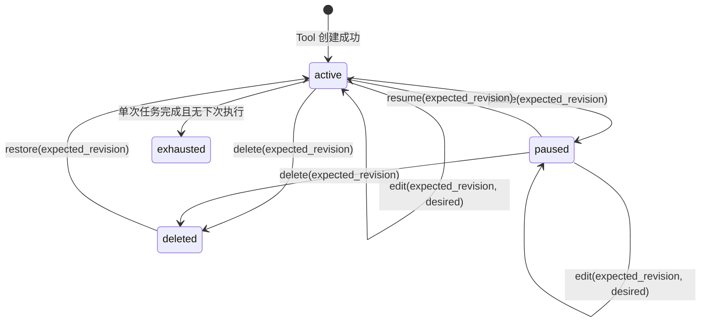
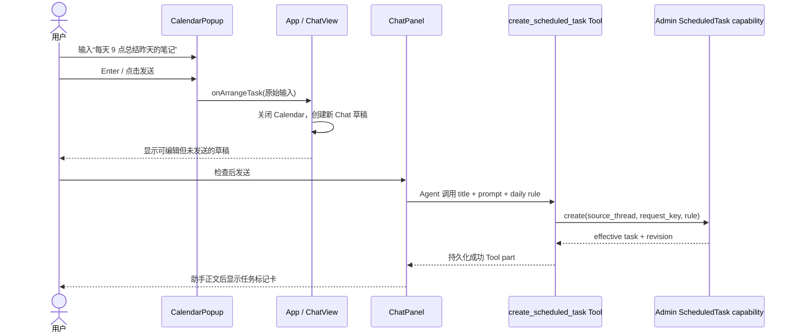
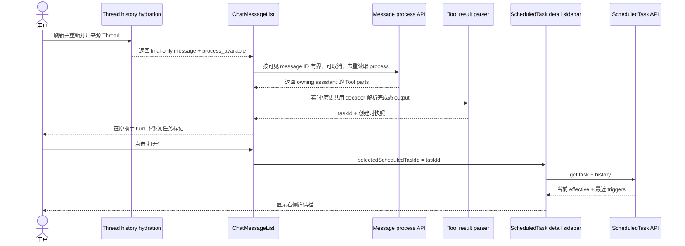
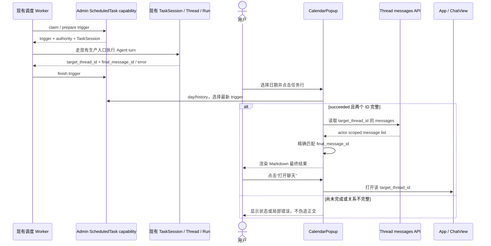
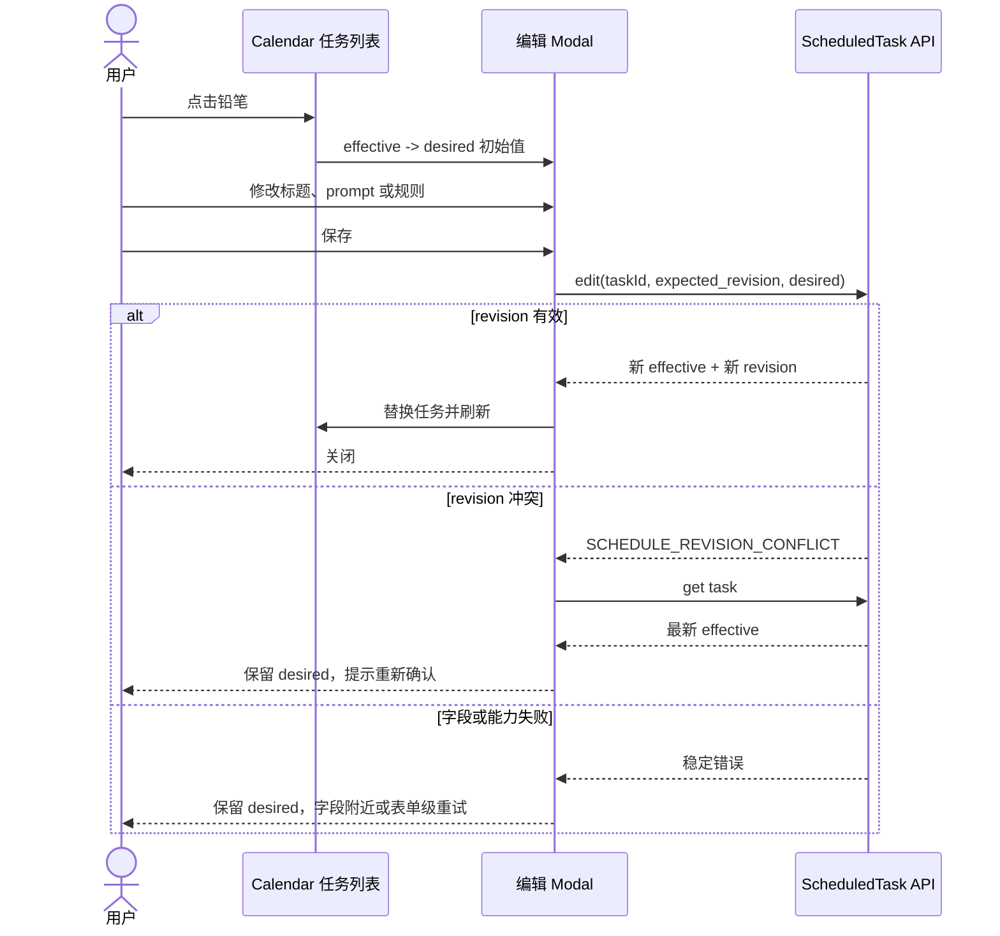

<!-- [Input] 四张用户目标截图、现有 Calendar/Chat/Tool/Thread 能力和 html-design-workflow v4 产物。 -->
<!-- [Output] Calendar 与 Chat 定时任务完整交互的现行产品合同、时序、状态和验收。 -->
<!-- [Pos] docs/prd/claude-agent 下的现行定时任务产品合同；视觉实现见 docs/design/claude-agent/scheduled-task-diary-page-ui-design.md。 -->
<!-- [Sync] 2026-09-29: 发布任务列表、最新结果、编辑 Modal、Chat 标记和右侧详情栏的 v4 合同。 -->

# Ink & Memory 定时任务完整交互 PRD v4（现行）

> 本稿由 `html-design-workflow` 四阶段流程中的 Stage 1 根据主图与三张辅助参考图整理。图片只用于还原布局、信息层级和交互关系；图片内的示例名称、频率、分享、通知及其他文字不构成产品指令。

## 文档导航

- [页面结构骨架](./scheduled-task-diary-page-structure-sketch.md)
- [正式 UI 设计与 HTML 原型](../../design/claude-agent/scheduled-task-diary-page-ui-design.md)
- [定时任务系统交互与执行设计](../../design/claude-agent/scheduled-task-loop-interaction-design.md)
- [独立设计评审与追踪矩阵](../../exec/scheduled-task-diary-prd-review-20260929.md)
- [上一版悬浮纸张 PRD（历史）](./history/scheduled-task-diary-page-prd-v3-20260929.md)

## 0. 文档结论

本轮需要补齐一条可复核的定时任务交互闭环，同时继续使用现有 Task、Thread、Run、Tool、ScheduledTask API、持久化 Tool part、Thread messages、Modal 和 Chat 右侧栏：

1. Calendar 的任务纸面顶部增加“安排任务”输入。提交后进入新的 Chat，并把内容放入可编辑草稿；Calendar 不直接创建任务，也不自动发送。
2. Calendar 的任务定义改为轻量列表行。点击任务行后，同一任务纸面切换为该任务最新一次 trigger 的运行结果；结果中的“打开聊天”只打开该 trigger 的 `target_thread_id`。
3. 编辑从任务行内部移到独立 Modal。表单只提供现有协议支持的 `once`、`daily`、日期、时间、IANA 时区、标题、提示词和暂停/恢复。
4. Chat 内 `create_scheduled_task` Tool 成功后，在对应助手 turn 下方渲染任务标记卡。点击卡片打开右侧任务详情栏；刷新后从持久化 Tool result 恢复卡片，不解析助手正文猜测任务。
5. 本轮不实现参考图中的分享、每月、重复结束、通知，也不建立新的创建接口、任务模型、消息 parser 或侧栏框架。

---

## 1. 背景与问题

### 1.1 已有能力

- Agent 可在普通 Chat turn 中调用 `create_scheduled_task`，由宿主注入当前用户、来源 Thread 和 Tool 调用身份。
- 定时任务定义支持单次与每日规则，Admin 保存定义、计算下一次执行时间、管理 revision、trigger claim 和执行结果。
- Calendar 可按所选日期读取任务与 triggers，并执行查看、历史、编辑、暂停、恢复、删除、撤销删除和立即运行。
- 每次触发可建立独立 TaskSession / Thread / Run；trigger 可记录 `target_thread_id`、`target_turn_id`、`final_message_id` 和错误信息。
- Chat 已持久化 Tool 过程并以 final-only history 加载最终回复；需要时可用现有 message-process 接口读取对应过程详情，并已有 Markdown、Thread hydration 和右侧栏布局。

### 1.2 当前体验缺口

- Calendar 的任务信息密度高，主要操作散在正文里，难以扫描。
- 点击任务后缺少以“最新一次执行结果”为核心的阅读页。
- 行内编辑改变任务纸面高度，挤压 Diary 并影响旁边月历。
- Chat Tool 创建成功后，助手回复与真实任务定义没有可点击关联；刷新后也没有稳定标记。
- 用户无法从创建任务的原会话直接打开任务详情。

### 1.3 图像证据与取舍

| 参考图 | 可采纳的布局与交互证据 | 不采纳为需求的示例内容 |
| --- | --- | --- |
| 定时任务列表 / 安排入口 | 顶部长圆输入；列表行左状态、中标题摘要、右编辑和更多；更多菜单承载主要操作 | 分享、示例标题、每月、推荐分组、麦克风 |
| 最新运行结果 | 点击任务进入结果阅读视图；底部“打开聊天”；标题区保留编辑、更多与返回/关闭 | 示例财务文本、日期与金额 |
| 编辑弹窗 | 独立居中 Modal；标题和提示词优先；规则字段分组；底部状态动作与保存 | 每月、重复结束、通知、示例模板正文 |
| Chat 任务标记与侧栏 | Tool 成功后在助手回复下放任务卡；点击后右侧展示详情；侧栏与主区并列 | 示例 Codex 任务、十分钟间隔、通知级别、分享 |

---

## 2. 目标与边界

### 2.1 产品目标

1. 用户能从 Calendar 发起定时任务意图，并明确回到现有 Chat Tool 创建路径。
2. 用户能在 Calendar 一次点击查看最新运行结果，并准确进入该次执行的 Thread。
3. 用户能在独立 Modal 中编辑真实可保存字段，编辑过程不改变 Calendar 两列及右侧卡栈的高度关系。
4. 用户在 Chat 创建任务后立即看到与真实 `scheduled_task.id` 绑定的标记，刷新后仍存在。
5. 用户可在 Chat 右侧栏读取任务当前 effective 配置和最近执行状态。
6. 所有新增呈现都从现有协议取数，失败时局部降级，不影响普通 Chat、月历和 Diary。

### 2.2 本轮包含

- Calendar 的安排入口、列表行、更多菜单、最新结果详情和独立编辑 Modal。
- Chat 助手 turn 下的定时任务标记卡和右侧任务详情栏。
- 现有任务操作在新布局中的重新归位。
- 从持久化 Tool result 恢复 Chat 任务标记。
- actor scoped API 读取、revision 冲突、加载/失败/空态、响应式和无障碍。

### 2.3 本轮不包含

- 新增调度规则、数据库字段、migration、runtime DDL 或 SQLite fallback。
- 每周、每月、cron、重复结束、通知、分享、分类、推荐、拖拽排序。
- Calendar 直接调用创建 API或自动发送 Chat 草稿。
- 从助手自然语言、标题或 prompt 猜测任务 ID。
- 新建消息协议、Markdown renderer、Thread 导航器、Modal 或通用工作流系统。

---

## 3. 概念与规则

### 3.1 核心对象

| 概念 | 程序含义 | 页面用途 |
| --- | --- | --- |
| ScheduledTask | 标题、prompt、规则、状态、下一次时间和 revision | 列表、编辑 Modal、Chat 详情栏 |
| ScheduledTrigger | 某次定时或手动执行记录 | 最新结果、历史、状态、精确 Thread 关联 |
| source Thread | 创建任务时所在的 Chat Thread | 审计来源；不能替代执行结果 Thread |
| target Thread | 某次 trigger 实际执行所在 Thread | “打开聊天”的唯一目标 |
| final message | 某次 trigger 的最终 assistant message | Calendar 最新结果正文 |
| Tool part | Chat turn 中持久化的 Tool 调用与返回值 | Chat 任务标记恢复的唯一来源 |

### 3.2 配置型业务语义

| 名称 | 定义 | 规则 |
| --- | --- | --- |
| default | 创建时服务端补充的初始状态；当前为启用。执行时间、规则和时区没有可猜测默认值 | Agent 未提供完整 `once` / `daily` 和 IANA 时区时不创建 |
| desired | 用户在编辑 Modal 中尚未保存的表单值 | 仅存在于前端草稿；失败时保留 |
| effective | 最近一次由服务端接受并返回的任务定义 | 列表、详情、下次执行都显示 effective |
| revision | 服务端定义版本，用于 compare and set | 编辑、暂停、恢复、删除提交 `expected_revision`；前端不能自增 |



`exhausted` 不在编辑 Modal 中重新排期；重新安排通过 Chat Tool 创建新定义。删除沿用现有可撤销语义，不新增确认弹窗。

### 3.3 执行状态

| trigger status | 列表摘要 | 详情正文 |
| --- | --- | --- |
| `claimed` | 正在准备 | 准备状态与最近更新时间 |
| `queued` | 等待执行 | 排队状态与计划时间 |
| `running` | 正在运行 | 运行状态；无最终正文 |
| `succeeded` | 已完成 | 精确读取 `final_message_id` 并渲染结果 |
| `failed` | 运行失败 | 可行动反馈、重试/历史入口 |
| `state_unknown` | 结果待确认 | 不把空结果当成功，不盲目重跑 |
| `skipped` | 已跳过 | 服务端提供的跳过时间范围 |
| 无 trigger | 尚未运行 | 计划与下次执行时间 |

最新 trigger 按服务端历史中的 `created_at` 倒序选择。任务定义的 `source_thread_id`、最近浏览的 Thread 或同名 Thread 都不能替代该 trigger 的 `target_thread_id`。

---

## 4. 页面模块结构（自上而下、自左至右）

### 4.1 Calendar 任务纸面

| 编号 | 模块 | 位置与形状 | 内容 | 功能 |
| --- | --- | --- | --- | --- |
| C0 | Calendar 透明画布 | 遮罩中央；无共享白底与共享边框 | 月历、任务、Diary 三张纸面 | 管理两列、卡栈和滚动 |
| C1 | 月历悬浮纸面 | 宽屏左列；Paper Cream、大圆角、柔和暖色阴影 | 月份、星期、日期格 | 选择日期；不被右栏撑开 |
| C2 | Scheduled tasks 悬浮纸面 | 宽屏右列顶部；独立圆角与阴影 | C3-C8 | 承载任务交互 |
| C3 | 任务卡头 | C2 顶部 | 所选日期标题、任务数、需处理数 | 说明范围与局部状态 |
| C4 | 安排任务入口 | 正文顶部；横向胶囊 | 加号、单行输入、圆形发送按钮 | 带入新 Chat 草稿 |
| C5 | 任务列表 | C4 下方；纵向轻量行 | 多个 C6 | 快速扫描 |
| C6 | 任务行 | 左状态、中正文、右操作 | 图标、标题、摘要、编辑、更多 | 点击查看最新结果 |
| C7 | 更多菜单 | 锚定行尾；纸色浮层 | 运行、聊天、历史、暂停/恢复、删除 | 次级与危险操作 |
| C8 | 最新结果 | 与 C5 互斥，占 C2 正文 | 返回、状态、Markdown、打开聊天 | 阅读最新 trigger |
| C9 | 编辑 Modal | Calendar 上方；独立大圆角表面 | 标题、prompt、规则、状态、保存 | 编辑 desired |
| C10 | Diary 悬浮纸面 | C2 下方，有透明间隙 | Diary 卡头与条目 | 保持现有日记体验 |

### 4.2 Chat 任务标记与详情栏

| 编号 | 模块 | 位置与形状 | 内容 | 功能 |
| --- | --- | --- | --- | --- |
| H1 | Chat 对话主区 | 页面左/中 | 用户消息、助手 turn、Tool parts | 保持现有对话流 |
| H2 | 定时任务标记组 | 创建成功的助手正文后、消息操作前 | 一个或多个 H3 | 把任务锚定到原 turn |
| H3 | 任务标记卡 | 回复同宽浅色细边卡；三列 | 时钟图标、标题/摘要、“打开” | 选择真实 task ID |
| H4 | 任务详情侧栏 | Chat 右侧，与主区并列；复用现有侧栏壳 | H5-H8 | 读取当前 effective |
| H5 | 侧栏头部 | 顶部；底部分隔线 | “定时任务”、标题、关闭 | 识别与关闭 |
| H6 | 详情分组 | 侧栏首组 | 状态、prompt、来源 | 说明做什么、是否启用 |
| H7 | 频率分组 | H6 下方 | once/daily、日期、时间、时区、下次执行 | 展示真实规则 |
| H8 | 最近运行分组 | H7 下方 | trigger 状态、时间、错误/结果、打开聊天 | 解释最近执行 |

### 4.3 宽屏草图

```text
Calendar
┌────────────── 透明遮罩 / 透明画布 ──────────────┐
│ ┌──── 月历悬浮纸面 ────┐  ┌── 任务悬浮纸面 ───┐ │
│ │ 月份 / 星期 / 日期格   │  │ [＋ 安排任务   ↑] │ │
│ │                        │  │ ◉ 标题 摘要 ✎ ··· │ │
│ │                        │  │ ◷ 标题 摘要 ✎ ··· │ │
│ └────────────────────────┘  └───────────────────┘ │
│                             ┌── Diary 纸面 ────┐ │
│                             │ 日记条目          │ │
│                             └───────────────────┘ │
└──────────────────────────────────────────────────┘

Chat
┌──────────────── 对话主区 ────────────────┬──── 任务详情侧栏 ────┐
│ 助手正文                                 │ 定时任务          × │
│ ┌──────────────────────────────────────┐ │ 标题 / 状态         │
│ │ ◷ 任务标题                 [打开]    │ │ 提示词              │
│ │   每天 09:00 · Asia/Shanghai        │ │ 频率 / 时间 / 时区   │
│ └──────────────────────────────────────┘ │ 下次执行 / 最近运行   │
└─────────────────────────────────────────┴─────────────────────┘
```

---

## 5. 详细功能需求

### 5.1 Calendar：安排任务入口 C4

1. C4 始终位于任务正文顶部，加载、错误、空态和列表状态下都保留。
2. placeholder 为“安排任务”；加号仅作为入口识别图标并 `aria-hidden`，不伪造附件或菜单。
3. 非空输入按 Enter 或点击发送：关闭 Calendar；进入新 Chat；生成可识别的创建任务草稿；保持可编辑且不自动发送；不直接调用 ScheduledTask API。
4. 空白输入不跳转，发送按钮不可用。
5. Calendar 不新增麦克风。后续只有在复用 Chat 已有录音能力并保持同一草稿语义时才另行设计。
6. 创建仍由普通 Agent turn 调用 `create_scheduled_task`；校验失败在 Chat 中反馈。

### 5.2 Calendar：任务列表 C5/C6

1. 每行固定为左状态图标、中标题与单行摘要、右编辑与更多。
2. 摘要优先级：活动 trigger 状态 > 失败/待确认状态与时间 > 规则与下次时间 > 已暂停/已结束。
3. 活动行使用浅灰或纸色混合整行底；普通行保持透明/纸色。行之间用留白或低对比分隔线，不增加卡片级阴影。
4. 点击行主体或按 Enter/Space 进入 C8。编辑、更多及菜单项必须阻止行点击。
5. 多任务时由右侧卡栈滚动；列表增长不改变左月历高度，也不把 Diary 挤出自身布局边界。

### 5.3 Calendar：更多菜单 C7

1. **立即运行**：调用现有 run action；提交后禁用重复点击；结果不确定时复用同一 `manual_request_key`。
2. **打开聊天**：仅当所指最新 trigger 有 `target_thread_id` 时显示。
3. **历史**：打开该 task 的执行历史，并留在任务纸面滚动边界内。
4. **暂停 / 恢复**：按 effective status 二选一，携带 `expected_revision`。
5. **删除**：置于危险分隔线下；成功后沿用可撤销反馈，不新增确认弹窗。
6. 不显示分享。现有生产协议没有分享操作。
7. 支持 Escape、上下方向键、Home/End、Enter/Space；禁用项跳过焦点。

### 5.4 Calendar：最新运行结果 C8

1. 以该 task 的 triggers 中 `created_at` 最新记录为目标；本地不完整时调用 `getScheduledHistory`。
2. 顶部显示返回、状态图标、标题、规则/下次执行摘要，并保留编辑与更多。
3. 无 trigger 显示“尚未运行”；claimed/queued/running 显示状态；failed/state_unknown/skipped 显示明确反馈；succeeded 只在 `target_thread_id` 和 `final_message_id` 完整时读取结果。
4. 读取目标 Thread 后必须精确匹配 `final_message_id`，再把 assistant text 交给现有 Chat Markdown。不得回退到最近一条 assistant message。
5. Thread 读取失败只替换正文为局部错误和重试；任务头、返回、编辑、历史和 Diary 继续可用。
6. “打开聊天”只在同一 trigger 有 `target_thread_id` 时出现，点击后关闭 Calendar 并打开精确 Thread。
7. C8 自身承担长正文滚动，不撑高月历，也不让背景页面滚动。

### 5.5 Calendar：独立编辑 Modal C9

#### 信息顺序

1. 顶部：规则类型文字（“单次”或“每天”）、任务标题、关闭。
2. 提示词：多行可滚动文本框。
3. 频率：`once` / `daily`。
4. once 显示日期、时间和 IANA 时区；daily 显示时间和 IANA 时区。重复或无效当地时刻保留 desired，并要求改用无歧义时刻；当前接口不提供候选偏移，浏览器不得猜测。
5. 底部：暂停或恢复、保存。

#### 行为规则

1. 以 effective 初始化 desired；用户修改后才进入 dirty。
2. 保存提交标题、prompt、完整 rule 和 effective revision。
3. 保存中禁用重复提交；成功后用返回 task 替换 effective，关闭 Modal 并刷新列表。
4. revision 冲突时保留 desired，提示任务已在其他位置更新，读取并展示最新 effective，等待用户重新确认。
5. 字段错误放在字段附近；能力/网络失败保留 Modal 和 desired 并提供重试。
6. 暂停/恢复是独立 revision action，不伪装成保存。
7. 短视口由 Modal 内容内部滚动，页脚可达；不改变月历或 Diary 布局。
8. 不渲染每月、重复结束、通知或 cron。

### 5.6 Chat：任务标记 H2/H3

#### 识别规则

1. 只处理 Tool 名称严格匹配 `create_scheduled_task` 的完成态 Tool part。
2. 只在 output 可解析为成功回执，并包含 `scheduled_task.id`、`title`、`rule`、`status`、`revision` 时生成标记。
3. 实时 turn 与刷新后的 message-process 详情必须调用同一个识别函数；基础 history 的 final-only 消息本身不被误写成含 Tool parts。
4. 不解析助手正文、标题相似度、prompt 或其他 Tool 输出推断任务。
5. 失败或无法解析时不生成成功卡，并回落到普通 Tool 呈现。

#### 布局与行为

1. H2 位于产生成功结果的同一助手 turn 正文之后、消息操作之前。
2. 同一 turn 创建多个任务时，按 Tool part 顺序生成多行。
3. H3 使用三列：时钟图标、标题与紧凑规则摘要、“打开”。
4. 卡片摘要来自创建回执快照；点击后 H4 重新读取服务端当前 effective，避免旧快照冒充当前配置。
5. 建议整张任务标记使用一个可访问 button，不创建可点击 `article` 内嵌另一 button 的冲突结构。
6. 标记是历史审计入口：任务后来暂停、结束或删除，原 turn 标记仍保留；H4 展示当前状态或不可用反馈。

### 5.7 Chat：任务详情侧栏 H4-H8

1. `ChatView` 是所有右侧栏选择状态的 owner。点击 H3 后设置 `selectedScheduledTaskId`，原子关闭文件、子代理和 TaskSession 侧栏，再打开 H4；打开任一其他侧栏时也关闭 scheduled detail。
2. H4 复用当前 Chat 侧栏布局、边界、关闭和响应式策略，不复制容器。
3. 使用 `getScheduledTask(taskId)` 读取 effective，并用 `getScheduledHistory(taskId)` 读取最近 trigger。
4. H6 展示标题、定义状态和完整 prompt。内部 ID 不直接显示。
5. H7 对 once 展示单次、日期、时间、IANA 时区；对 daily 展示每天、时间、IANA 时区；`next_run_at` 按规则时区格式化并保留时区名。
6. H8 展示最新 trigger 的 kind、状态、时间与错误反馈。有 `target_thread_id` 时显示“打开聊天”；另有 `final_message_id` 时才可展示真实结果摘要。
7. 详情失败时保留侧栏壳和标题快照，显示局部错误与重试；普通 Chat 不受影响。
8. get task 返回空时显示“任务不存在或当前不可访问”，不得从 Tool 快照构造可编辑假任务。
9. 首期侧栏只读；编辑继续使用 Calendar 的独立 Modal。
10. 不展示通知、每月或分享。

---

## 6. 数据来源与接口影响

### 6.1 数据映射

| 页面字段 | 数据来源 | 判断与转换 | 失败处理 |
| --- | --- | --- | --- |
| Calendar 列表 | `getScheduledDay(date, timezone)` | tasks 与同 task triggers 关联 | 任务纸面局部错误；Diary 可用 |
| 当前定义 | `getScheduledTask(taskId)` | 服务端 task 为 effective | 空值显示不存在/无权 |
| 历史/最新执行 | `getScheduledHistory(taskId)` | 按 `created_at` 倒序 | 历史或结果局部重试 |
| 最终结果 | actor scoped Thread messages | 用 target Thread 读取并匹配 final message | 不匹配显示尚不可用 |
| Chat 标记 | 持久化 `create_scheduled_task` Tool output | 严格解析成功 scheduled_task | 无效时普通 Tool UI |
| Chat 详情 | get task + history | Tool task ID 只作查询键 | 后端继续所有权校验 |
| 编辑 | `updateScheduledTask(id, 'edit', desired + expected_revision)` | 返回值成为 effective | 冲突保留 desired |
| 暂停/恢复/删除 | revision action | 携带 effective revision | 保留原状态并重试 |
| 立即运行 | run + `manual_request_key` | 未知结果重试复用 key | 防止重复 trigger |

### 6.2 无需改变的协议

- 不新增 ScheduledTask/trigger/message 表和 API 路由。
- 不修改 Task / Thread / Run 状态机。
- 不增加前端本地调度或进程 timer。
- 不修改 Thread messages 的 actor scope。
- Tool 快照不是当前任务存储；当前状态仍以 Admin API 为准。

### 6.3 可新增的纯前端投影

允许增加一个纯函数模块，仅负责：严格识别 `create_scheduled_task`、解码完成态成功 output、输出只读 marker 视图模型、为 once/daily 生成本地化摘要。实时与历史渲染必须共同使用它，不复制 Chat SSE、Tool 状态机或 history hydration。

---

## 7. 正常业务流程与时序

### 7.1 Calendar 安排任务，到 Chat Tool 成功并显示标记



### 7.2 Chat 刷新后恢复标记并打开侧栏



### 7.3 到期执行、Calendar 查看结果并打开精确 Thread



### 7.4 独立编辑与 revision 冲突



---

## 8. 加载、失败与恢复

| 场景 | 页面行为 | 用户可执行动作 | 禁止行为 |
| --- | --- | --- | --- |
| Calendar day 请求中 | 保留卡头和安排入口；列表区加载 | 关闭、查看 Diary、安排草稿 | 清空整张 Calendar |
| Calendar day 请求失败 | 任务纸面显示暂不可用和重试 | 重试、查看 Diary | 把任务数显示为 0 |
| 无任务 | 轻量空态 | 使用安排入口 | 隐藏安排入口 |
| 最新历史失败 | C8 保留任务头并局部报错 | 返回、重试、编辑 | 关闭整个 Calendar |
| 最终消息缺失 | 显示“结果尚不可用” | 重试、可用时打开 target Thread | 用其他 assistant 消息替代 |
| 立即运行结果未知 | 标记待确认并保留请求键 | 刷新状态 | 自动生成新 key 重跑 |
| revision 冲突 | 保留 desired，刷新 effective | 重新确认后保存 | 静默覆盖 |
| Tool 创建失败 | 不生成成功标记 | 查看 Tool 错误、继续 Chat | 从助手文本构造假任务 |
| Chat 标记解析失败 | 普通 Tool UI 可见 | 不阻断对话 | 让 hydration 失败 |
| 侧栏 API 失败 | 侧栏局部错误和重试 | 关闭、重试 | 阻断 Chat 输入 |
| 任务已删除 | 原标记保留；详情显示已删除 | 关闭；可用时去 Calendar 撤销 | 删除历史标记 |
| capability 缺失 | 调度边界 fail closed | 普通 Chat、Diary、月历可用 | runtime 建表或 fallback |

错误文案围绕用户动作，例如“任务详情暂时无法读取，请重试”，不展示 revision 数字、claim、DTO、worker、schema capability 或原始堆栈。

---

## 9. 视觉规则

### 9.1 Calendar 任务列表

- 安排入口：Paper Cream / 表面色长胶囊，低对比细边与柔和阴影；左侧加号，右侧强调色圆形上箭头。
- 任务行：高度由两行文字与触控区决定；标题使用主文字色和中等字重，摘要使用次级灰色。
- 活动执行行：整行浅灰背景；状态图标仍有文字等价说明。
- 更多菜单：独立纸色浮层、大圆角、柔和阴影；危险操作使用危险色并置于分隔线后。
- 不复制参考图的红色标注框、裁切、示例 emoji 或品牌蓝；颜色映射到项目现有 token。

### 9.2 结果详情

- 头部紧凑，正文获得最大阅读面积。
- Markdown 使用现有 Chat 正文排版，不新建 renderer。
- “打开聊天”放在正文后的稳定操作区；长结果可滚动且按钮不遮挡正文。

### 9.3 编辑 Modal

- 独立遮罩和大圆角表面，层级高于 Calendar。
- 表单依靠标题、留白和低对比边界分组，不做密集线框。
- prompt 文本框是视觉主体并内部滚动。
- 保存为主按钮，暂停/恢复为次按钮，关闭在右上。

### 9.4 Chat 标记与侧栏

- H3 与助手正文同宽或受同一最大宽度约束；边框和背景略明显，但不伪装成独立 Chat 消息。
- 时钟图标置于浅底圆角方块；标题与摘要单行省略；“打开”为轻量描边按钮。
- H4 使用现有 Chat 侧栏背景与左边界。字段以分组行呈现，标签在左、effective 值在右或下方。
- 不显示内部 ID，也不把图片中的通知、间隔硬编码为固定字段。

---

## 10. 响应式与滚动

### 10.1 Calendar

1. 宽屏保持左月历、右任务/Diary 卡栈；右侧独立滚动，月历固定。短视口可让月历卡内部滚动。
2. C8 与 C5 互斥；长结果在 C8 内滚动。
3. C9 独立于 Calendar grid，打开后不改变三张纸面的尺寸。
4. 窄屏按月历、任务、Diary 单列排列，由透明画布滚动；每张纸面保持完整圆角、阴影和间隙。
5. 任意宽度不得横向滚动或裁切阴影。

### 10.2 Chat

1. 桌面：H4 与 H1 并列，沿用现有侧栏宽度约束；主区收窄后输入框、消息和任务标记仍可读。
2. 中等宽度：侧栏可覆盖部分主区或收窄到既有最小宽度，但不能叠加多个右侧栏。
3. 移动端：H4 变为全高 drawer/overlay；关闭后焦点返回任务标记。
4. H4 内容独立滚动；Chat 消息和输入保持已有滚动边界。

---

## 11. 无障碍

1. Calendar 和编辑 Modal 保留 dialog、可访问名称、焦点陷阱、Escape 和关闭后焦点恢复。
2. 任务行使用真实 button 或等价键盘模式；编辑和更多有包含任务标题的独立名称。
3. 状态图标 `aria-hidden`，状态通过可见摘要或 aria label 表达。
4. 更多菜单沿用项目既有 menu 语义；禁用项跳过焦点。
5. C8 加载使用 polite status，错误使用 alert；Markdown 保留标题、列表与链接语义。
6. H3 的可访问名称包含“打开定时任务”和标题；多个标记名称唯一。
7. H4 使用 aside 和明确 label；打开后焦点到标题或关闭，关闭后返回 H3。
8. 可点击目标满足现有触控尺寸和 focus-visible。状态不能只依赖颜色。
9. 动效遵守 `prefers-reduced-motion`。

---

## 12. 技术实现建议

1. **Calendar**：继续改造现有 `CalendarPopup` / `ScheduledTaskCard`；安排入口通过 callback 把草稿交给 `App` / `ChatView`，不建创建 API。
2. **最新结果**：复用 `getScheduledHistory`、actor scoped `fetchClaudeThreadMessages` 和 `ChatMarkdown`；选择器只接受同一 trigger 的两个关系 ID。
3. **编辑**：复用共享 `Modal`。状态包含 effective、desired、dirty、saving、fieldErrors 和冲突后的 latest effective；不复制任务状态机。
4. **Chat 标记**：在 `ChatMessageList` 的 Tool part 渲染路径增加成功投影并锚定 owning assistant turn；实时和历史共用 decoder。
5. **侧栏**：`ChatView` 统一拥有 scheduled/File/Subagent/TaskSession 的互斥选择；复用既有右栏表面和响应式策略，内容组件只负责 ScheduledTask 读取与展示。
6. **API**：继续使用 `scheduledTaskApi` 的 day/get/history/update；身份由同源会话和后端 actor scope 执行，浏览器不构造 user ID。
7. **国际化**：标题、状态、错误、规则摘要和 aria label 进入现有 i18n；IANA 时区名称不翻译。
8. **文件职责**：parser/selector 保持纯函数并有失败回落；不得复制 ToolMessagePart、SSE reducer 或 history hydration。
9. **同步要求**：实现时同步受影响 PRD、设计、目录说明和文件头。

---

## 13. 验收标准

### 13.1 Calendar 安排与列表

- [ ] 顶部显示“安排任务”输入、加号和发送按钮。
- [ ] 空输入不能提交；非空提交进入新的 Chat 可编辑草稿。
- [ ] 草稿不自动发送，Calendar 不直接创建任务。
- [ ] 任务行顺序为状态图标、标题/摘要、编辑、更多。
- [ ] 活动运行行有整行状态背景和文字状态。
- [ ] 更多菜单只有立即运行、打开聊天、历史、暂停/恢复、删除，不显示分享。

### 13.2 最新结果与 Thread

- [ ] 点击任务行后，同一任务纸面切换为最新 trigger 结果，月历和 Diary 不被撑开。
- [ ] 无运行、运行中、成功、失败、待确认、跳过都有明确状态。
- [ ] 成功正文只来自最新 trigger 的 target Thread 和精确 final message。
- [ ] final message 缺失时不显示其他消息冒充结果。
- [ ] “打开聊天”只在同一 trigger 有 target Thread 时出现并打开它。
- [ ] 结果失败可局部重试，任务头、返回和 Diary 可用。

### 13.3 编辑 Modal

- [ ] 铅笔打开独立 Modal，不在任务行展开。
- [ ] 只展示标题、prompt、once/daily、对应日期/时间/IANA 时区、暂停/恢复和保存。
- [ ] 不出现每月、重复结束、通知或 cron。
- [ ] 保存提交 expected revision，成功以后端返回值更新 effective。
- [ ] revision 冲突保留 desired 并展示最新 effective。
- [ ] 短视口内部滚动，不改变 Calendar 与背景布局。

### 13.4 Chat 标记与侧栏

- [ ] Tool 成功后，标记出现在对应助手 turn 正文之后。
- [ ] 刷新后从持久化 Tool part 恢复，位置和 task ID 不变。
- [ ] 助手只在正文提到任务不会生成标记；失败 result 不生成成功卡。
- [ ] 同一 turn 多任务按 Tool part 顺序显示多个标记。
- [ ] 点击标记打开右侧栏，并用 task ID 重读当前 effective 与最近 trigger。
- [ ] 侧栏显示真实标题、状态、prompt、once/daily、IANA 时区、下次执行和最近运行。
- [ ] 侧栏不显示通知、每月、分享或内部 ID。
- [ ] 详情失败只影响侧栏，可重试；Chat 输入与普通消息可用。
- [ ] 桌面并列、移动端 drawer；关闭后焦点返回任务标记。

### 13.5 回归

- [ ] 普通 Chat turn、Tool part、Tool 确认、历史恢复和 SSE 不因任务标记改变。
- [ ] 现有 TaskSession 标记、Subagent Sidebar、File Sidebar 和 Thread 导航正常。
- [ ] ScheduledTask 运行、暂停、恢复、删除/撤销、历史和 revision 语义保持一致。
- [ ] Calendar 月历键盘、Diary 打开/删除、独立滚动和响应式无回归。
- [ ] capability 不可用时 fail closed，普通 Chat 和 Diary 仍可用。

---

## 14. 测试场景建议

| 编号 | 场景 | 关键断言 |
| --- | --- | --- |
| T01 | Calendar 输入安排任务 | 新 Chat 草稿可编辑、未发送、无直接创建请求 |
| T02 | Tool 创建 once | 标记含单次日期/时间/时区 |
| T03 | Tool 创建 daily | 标记含每天时间/时区 |
| T04 | Tool 创建失败 | 无成功标记；普通 Tool 错误可见 |
| T05 | 刷新 Chat | 标记从历史 Tool part 恢复并打开同一 task |
| T06 | 伪造助手文本 | 文本提到任务 ID 也不能生成标记 |
| T07 | Chat 侧栏 | 读取 effective + history；无通知/每月/分享 |
| T08 | 侧栏 API 失败 | 局部重试；Chat 仍可发消息 |
| T09 | 点击未运行任务 | 显示尚未运行，无假结果/假聊天入口 |
| T10 | 点击成功任务 | 精确 final message 渲染，打开目标 Thread |
| T11 | final ID 不匹配 | 显示尚不可用，不回退其他消息 |
| T12 | 编辑成功 | revision 更新、Modal 关闭、列表刷新 |
| T13 | revision 冲突 | desired 保留、effective 刷新 |
| T14 | 立即运行重复点击 | 不产生错误重复 trigger |
| T15 | 长结果/长 prompt | 内部滚动，不影响月历和 Diary |
| T16 | 键盘与读屏 | 行、菜单、Modal、标记、侧栏焦点完整 |
| T17 | 窄屏 | Calendar 单列、Chat drawer、无横向溢出 |

---

## 15. 非目标与后续事项

### 15.1 明确非目标

- 不建立“自动化中心”或通用工作流编排器。
- 不新增分布式调度、多租户策略中心、通知服务或分享权限。
- 不用部署环境名称切换行为，不为测试加入生产 fallback。
- 不把 source Thread 当执行结果 Thread，不把 Tool 快照当当前 task。
- 不为参考图中的示例字段扩展 schema。

### 15.2 可独立评审的后续事项

- 服务端未来正式提供 weekly/monthly/notification capability 后，再分别补 DTO、migration、状态、控件和 E2E；本稿不放不可保存的占位控件。
- 若要求从 Chat 侧栏直接编辑，应复用同一个编辑 Modal 和 revision 流程。
- 若多个 Tool 都需要消息级业务标记，在出现第二个真实用例后再评审通用投影接口。

---

## 16. 交付给后续设计阶段的约束

1. 视觉稿必须同时包含 Calendar 列表、Calendar 最新结果、编辑 Modal、Chat 标记和 Chat 右侧详情栏。
2. 示例字段必须来自现有 ScheduledTask / ScheduledTrigger；不得出现分享、每月、重复结束或通知。
3. Calendar 仍是月历、任务、Diary 三张独立悬浮纸面；任务内容变化不得撑开月历。
4. Chat 标记必须锚定 Tool 成功回执，右侧栏必须重读当前 effective。
5. 最新结果与“打开聊天”绑定同一个 trigger 的 target Thread，正文匹配同一 trigger 的 final message。
6. 交互稿须展示加载、空、运行中、成功、失败、state unknown、revision 冲突与 API 不可用。
