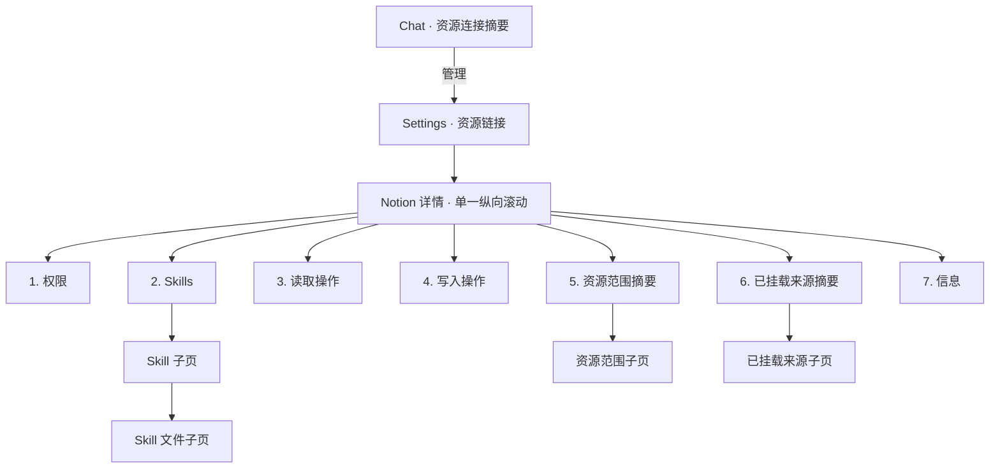

<!-- [Input] Current Notion connector PRD/runtime facts, ConnectorNotionDetailPage, Settings shell, and the reviewed four-stage detail-page redesign. -->
<!-- [Output] Proposed user-visible information architecture, page/subpage interactions, state feedback, responsive, focus, scroll, and accessibility contract. -->
<!-- [Pos] Proposed Notion Resource Connector UI specification in docs/prd/notion-session; runtime behavior remains owned by resource-connector.md and design docs. -->
<!-- [Sync] 2026-08-29: redesign the Notion detail as one warm-paper long page with seven ordered sections and four focused subviews; keep current Read and unimplemented Hosted MCP capabilities truthfully separated. -->
<!-- [Sync] 2026-08-29: retain disabled Feishu/local CLI discovery placeholders without adding configuration, authorization, or runtime paths. -->

# Notion 资源连接器交互方案

- Status: Proposed；本稿尚未实现
- Entry: Settings → 资源链接 → Notion
- Business source: [`resource-connector.md`](./resource-connector.md)
- Structure source: [`连接器具体配置页面结构草图.md`](./连接器具体配置页面结构草图.md)

本稿只定义用户可见界面。当前已实现的业务路径仍是 `notion-session` Skill、轻量索引和 Runtime 受控按需 `Read`；Hosted Notion MCP 的认证、动态工具 inventory、读写执行均未接入。页面不得把 Proposed 设计或官网能力写成当前可用能力。

## 1. 产品结构

- Chat 只展示服务器确认的连接/来源摘要和“管理”，不复制 Settings 表单。
- Notion 详情是唯一配置入口；子页只改变视图归属，不建立第二套 connector state、API 或 Runtime 路径。
- 主详情、Skill、文件、资源范围和来源视图均复用 Settings 内容壳。

## 2. Settings 资源链接列表

Notion 卡片展示连接状态、最近交互、来源数和“管理”入口；读取失败时显示真实错误，不用浏览器缓存伪造成功。

资源发现占位继续保留：

- 远程资源：飞书，禁用，标记“占位 / 暂不可用”；
- 本地资源：CLI 执行器，禁用，标记“占位 / 暂不可用”。

两张占位卡不得发起 API、授权、配置或运行时操作。其他不可用连接器不因为本设计自动增加占位。

## 3. 主详情页

### 3.1 页面壳与滚动

- `.story-workspace-settings__content` 是唯一纵向滚动容器；详情区、来源区和 Skill 正文不再建立第二条纵向滚动条。
- 允许 Markdown 代码块或不可换行结构局部横向滚动，但页面不得横向溢出。
- 页面使用一个 `h1`；七个主段使用连续 `h2`，区内分组使用 `h3`。
- 视觉沿用暖纸令牌：排版、留白、轻纸面和细分隔线优先，不复制参考图的固定黑色面板、蓝色开关或卡片海。

### 3.2 页首

页首不计入七段顺序，包含：

- 返回“资源链接”的文字按钮或链接；
- Notion 图标、`h1`“Notion”和一句用途；
- 未连接、认证中、已连接、同步中、部分可用、已过期、异常等服务器状态；
- 状态说明：发生了什么、现有能力是否安全、系统是否自动恢复、用户下一步；
- “连接 Notion”或“重新连接 Notion”；认证中防重复提交；
- “更多”中的“关闭连接”，或同等级次操作；断开可恢复，不增加确认弹窗；
- 授权、索引、已选范围和最近成功的紧凑服务器摘要。

授权有效但没有成功索引时只能显示“已连接，尚无来源索引”，不得显示“已同步”。

### 3.3 严格七段顺序

桌面、平板和手机都必须为：

1. 权限；
2. Skills；
3. 读取操作；
4. 写入操作；
5. 资源范围；
6. 已挂载来源；
7. 信息。

#### 1. 权限

权限只包含“索引同步策略”：

- 自动同步编辑 `desired.enabled`；
- 频率只取服务器 `allowedIntervalMinutes`；
- 显示 `effective`、最近成功和下次计划；
- 保存后以服务器确认结果为准；保存中禁用重复提交；
- 保存失败说明本次修改未生效且原策略仍安全生效。

本段不得出现 OAuth scope、正文读取权限、Runtime、hook、内部目录、MCP 启用开关或“立即同步”。立即同步属于已挂载来源子页。

#### 2. Skills

当前只显示服务器真实存在的 `notion-session`：

| 字段 | 展示 |
|---|---|
| 名称 | Notion 工作空间助手 |
| 摘要 | 只读搜索和读取当前用户已挂载的 Notion 内容 |
| 来源 | 内置 |
| 状态 | 可用 / 连接后可用 / 信息暂不可用 |
| 行为 | 整行进入 Skill 子页 |

未连接时仍可审阅 Skill 说明。不得虚构参考图中的其他 Skill，不显示安装、卸载、启停、更新或更多菜单；“内置 / 可用”是只读状态。

#### 3. 读取操作

当前真实能力优先于未来能力。

“当前可用读取能力 · 内置 Skill”展示三条产品说明：

| 能力 | 说明 | 可用性 |
|---|---|---|
| 搜索已挂载页面 | 按标题、页面标识或链接在当前轻量索引定位 | 有索引时可用；否则“选择资源后可用” |
| 浏览数据库记录 | 查看已挂载数据库中的页面标识清单 | 至少挂载一个数据库时可用 |
| 读取单个页面 | 回答需要时按需读取已选择页面的当前 Markdown | 授权有效且目标属于当前索引时可用 |

三项来自 `notion-session + Read hook`，不是三个新工具，也不是 MCP；界面不得展示内部调用名、虚拟路径、参数、凭证或执行按钮。

Hosted Notion MCP 当前显示低权重 neutral 说明：

> Notion MCP 读取操作尚未接入。当前轻量索引和内置只读能力不受影响；系统不会在后台自动启用 MCP。你可以查看 Skills 了解当前可用能力。

未来只有服务器基于当前 actor、当前认证和 inventory revision 返回 descriptors 后，才能显示 MCP 行。前端不得内置官网全量工具清单或把远端存在等同于本产品可用。

#### 4. 写入操作

当前只显示：

> 当前连接器为只读，不会修改你的 Notion 页面。Notion MCP 写入操作尚未接入，系统不会自动启用写入。

不得展示工具行、启用开关、授权升级、主按钮、参数、表单或“试一试”。未来即使 inventory 返回写入 descriptor，在执行、actor 授权、确认、审计和幂等经过独立评审前也不能标记为可用。

读取/写入两段都是只读能力清单，不是设置页内的工具执行台。

#### 5. 资源范围

主详情只显示：

- 已选总数、数据库数、独立页面数；
- 空范围：“当前没有 Notion 资源可以进入新对话”；
- 一个“管理资源范围”入口。

搜索、远端资源列表、选择、分页、保存和未保存草稿全部在资源范围子页。

#### 6. 已挂载来源

主详情只显示：

- 来源总数；
- 待同步、同步中、已同步、部分可用、同步失败或自动同步关闭；
- 最近成功和有值时的下次计划；
- 一个“管理已挂载来源”入口。

逐来源列表、立即同步和立即重试全部在已挂载来源子页。

#### 7. 信息

信息固定在自然滚动末端，只显示连接时间和三个官方外链，不重复页首已有的连接名称/状态：

| 标签 | 值/行为 |
|---|---|
| 连接时间 | `connector.createdAt`，按用户 locale 输出含年份的完整日期；无连接为“尚未连接”；解析失败为“暂时无法读取”，不得回退浏览器当前时间 |
| 网站 | `https://developers.notion.com/cli/get-started/overview` |
| 隐私政策 | `https://privacycenter.notion.so/policies` |
| 服务条款 | `https://notion.notion.site/Terms-and-Privacy-28ffdd083dc3473e9c2da6ec011b58ac` |

外链使用真实链接、明确标签和外链图标；新窗口打开时带 `target="_blank" rel="noopener noreferrer"`，可访问名称包含“在新窗口打开”。链接来自集中产品常量或服务器安全配置，不接受用户输入重定向。

## 4. 四个子视图

### 4.1 Skill 子页

同一页面自上而下：

1. 返回 Notion 详情；
2. “Notion 工作空间助手”、摘要、“内置”和真实可用性；无开关；
3. “Skill 说明”：服务器解析 frontmatter 后安全渲染 `SKILL.md` body；
4. “包含的文件”：列相对文件名、MIME、格式化大小和可预览状态。

当前文件清单仅有：

- `references/notion-search.md`；
- `references/notion-page-read.md`；
- `references/notion-db-query.md`。

`SKILL.md` 不重复列出；`.folder.md`、点文件、缓存、评测、构建产物和符号链接不展示。正文和文件清单独立失败，一侧失败时保留另一侧成功内容。

### 4.2 Skill 文件子页

- 通过服务器 stable file ID 请求，不用浏览器相对路径拼服务器路径；
- 仅显示相对路径、MIME、大小和“只读”；
- Markdown 禁止原始 HTML、脚本和远端嵌入，链接协议使用 allowlist；
- `removed_or_revision_changed`、`too_large`、`unsupported_mime`、`denied`、普通错误在内容区就地反馈，不弹窗；
- revision 变化后停止把旧内容显示为最新，并返回最新文件清单。

### 4.3 资源范围子页

完整承接现有资源发现、搜索、数据库/页面标记、分页、选择、已选数量和“保存并首次同步”：

- 选择草稿只属于本视图；服务器确认前不更新详情摘要；
- 保存以完整集合替换旧集合；非空集合触发首个轻量索引；
- 空集合允许保存并 fail closed；
- 保存失败保留草稿，说明服务器有效范围未改变；
- 授权过期停止新发现/保存，但保留当前页草稿并提供重新授权；
- 离开未保存草稿不增加确认弹窗，返回后丢弃页面草稿；
- 长列表随 Settings 内容区滚动，不设内部固定高度滚动。

### 4.4 已挂载来源子页

顶部显示来源总数、聚合状态、最近成功，以及“立即同步 / 立即重试”。逐来源显示标题、类型、状态、最近成功、正数页数和必要的非敏感问题说明。

- 复用现有 `connector.sources` 和同步入口；
- 同步中保持按钮位置并切为 loading/disabled；
- 立即同步只刷新轻量索引，不改变策略、不下载正文；
- 有 LKG 时说明旧索引仍可用；无 LKG 时明确没有可用索引；
- 列表随 Settings 内容区滚动，不设 `max-height + overflow-y:auto`。

## 5. 状态与错误

| 状态 | 规则 |
|---|---|
| Loading | 保留标题和布局骨架，各数据边界独立；不以空态代替 |
| Ready | 只有服务器确认后声明成功 |
| Empty | neutral，说明 0 项的业务含义并给出所属管理入口 |
| Unavailable | 区分未接入、未授权、连接前置和范围前置；无执行控件 |
| Partial | 保留成功数据，问题就地说明，不阻断普通 Chat |
| Error | 只影响所属边界，提供安全重试或下一步 |
| Revision changed | 不继续呈现旧策略、inventory 或文件为最新 |

任何错误依次说明：发生了什么；用户内容、授权或 LKG 是否安全；系统是否自动恢复；用户下一步。错误响应、埋点和页面日志不得包含 Notion 正文、Skill/文件正文、token、服务器路径、thread 标识或上游原始响应。

能力目录失败只降级 Skills/操作，不阻断连接、策略、资源和来源管理。Hosted MCP 状态未知时不能回退成可用。

## 6. 导航、焦点与滚动恢复

- 进入任一子视图后把焦点移动到新视图 `h1`。
- 从 Skill 返回，恢复 Skill 行焦点与详情滚动位置；从文件返回，恢复原文件行。文件已移除时聚焦“包含的文件”。
- 从资源范围/来源返回，恢复各自管理入口；保存/同步后只刷新受影响的服务器摘要。
- 详情返回资源链接列表时，焦点恢复 Notion 卡片的“管理”。
- 滚动位置和触发元素只属于瞬时视图状态，不进入数据库、localStorage 或 connector DTO。
- 主详情不使用 sticky；资源子页保存动作和来源子页同步动作可在不创建新滚动容器、不遮挡末项的前提下使用紧凑 sticky 动作区。

## 7. 响应式与无障碍

- 复用 Settings 现有响应上下文，不新增 Notion 专属业务断点。
- 桌面页首可左右排列，正文始终单列；窄屏七段顺序不变，摘要/操作纵向排列。
- 所有触控目标至少 44px；按钮文字不得退化为纯图标。
- Skill 正文和文件列表串行；长文件名可换行，可访问名称保留完整相对路径。
- 可点击行使用真实 link/button；右箭头和外链图标不单独聚焦。
- `:focus-visible` 使用现有 `--color-border-focus`；不得移除 outline。
- 状态必须有文字，不只依赖颜色、圆点或图标。
- loading 用 `aria-live="polite"`；错误可被程序聚焦，但不得在用户搜索/阅读时抢焦点。
- Markdown 标题重映射到页面标题之后；表格/代码块可键盘横向滚动。
- 遵循 `prefers-reduced-motion`，只使用短促的背景、颜色或透明度过渡。

## 8. 数据合同缺口与实现分期

当前 connector API 已能提供连接状态、`createdAt`、策略、范围、来源和同步；尚不能提供：

- Skill 清单、解析后的 Markdown、文件清单和安全文件内容；
- 当前 Read 能力的服务器描述；
- Hosted MCP inventory、读写安全分类、可用性、不接入原因和 revision。

后续只能在现有 connector service 内增加只读能力投影，或复用经过相同 owner guard、allowlist、路径/MIME/大小/revision 安全验证的通用读取能力；不得新增数据库表、队列、独立服务、第二 connector store 或第二 Runtime 路径。

分期：

1. 只读能力合同：返回一个 `notion-session`、三个 `builtin_read` 和 MCP `not_integrated`；
2. 视图重组：资源与来源完整交互迁入子页，主详情移除长列表和嵌套滚动；
3. 接入 Skill/文件/读写说明/信息、焦点与滚动恢复；
4. 完成组件、API 安全、响应式、键盘、屏幕阅读器和 E2E，再删除无引用旧内嵌视图。

Hosted Notion MCP OAuth、inventory 执行、写入授权/确认/审计/幂等不属于上述实现，必须另行设计和验证。

## 9. 验收标准

1. 页首后严格为“权限 → Skills → 读取操作 → 写入操作 → 资源范围 → 已挂载来源 → 信息”。
2. 权限只含索引同步策略；立即同步只在来源子页。
3. 只有真实 `notion-session`；Skill 页上部 `SKILL.md`、下部三个 reference 文件，无启停开关。
4. 三个当前 Read 能力明确为“内置 Skill / 非 MCP”；Hosted MCP 读写均 truthful unavailable，页面不硬编码官网工具伪清单。
5. 写入区没有执行、启用、授权升级或写入表单。
6. 资源范围和逐来源列表只在各自子页；主详情只有摘要与管理入口。
7. 信息在页面末端，`createdAt` 不回退当前时间，三条 URL 精确且安全打开。
8. Settings 内容区是唯一纵向滚动；桌面/窄屏顺序一致且无页面横向溢出。
9. 返回恢复正确焦点/滚动；revision 变化不继续把旧内容显示为最新。
10. 局部失败不阻断普通 Chat 或其他区块，错误包含状态、安全、恢复和下一步。
11. 飞书和本地 CLI 禁用占位仍只用于能力发现，不产生业务调用。
12. 不新增 schema、队列、服务、环境分支、第二 store/API 或 Agent-visible Notion MCP。

## 10. 本次删除或延期的交互

删除旧详情内嵌的资源搜索、分页、选择、保存、逐来源列表、列表内部滚动、立即同步/重试；删除虚构 Skill、Skill 开关、MCP 静态伪清单、写入伪按钮和重复页面标题。

延期 Hosted Notion MCP 认证与执行、写入确认/审计/幂等、Skill 启停/安装/编辑、二进制预览、深链路由、全文索引、附件、写回和多账号。
