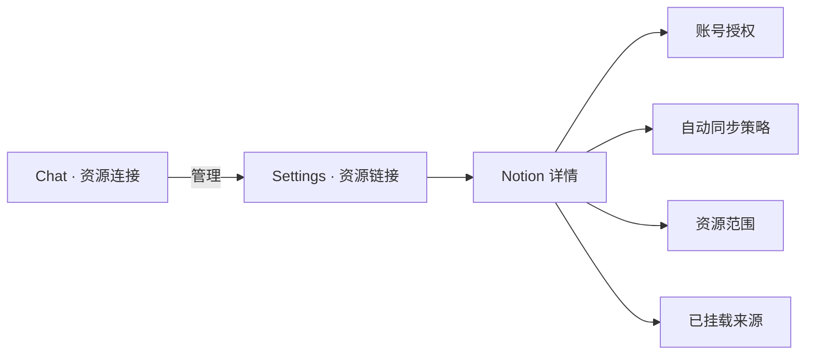

<!-- [Input] Reviewed Notion connector PRD and current Settings/Chat components. -->
<!-- [Output] User-visible information architecture, interaction states, copy, responsive, and accessibility rules. -->
<!-- [Pos] Current Notion Resource Connector interaction specification in docs/prd/notion-session. -->
<!-- [Sync] 2026-08-29: replace obsolete workbench styling notes with the implemented Settings-owned interaction contract. -->

# Notion 资源连接器交互方案

本稿只定义用户可见界面。业务规则以 [`resource-connector.md`](./resource-connector.md) 为准；内部目录、凭证、Runtime 和 API driver 见架构文档。

## 1. 信息架构

- Chat 是只读摘要入口，不承载授权、策略和选择表单。
- Settings 列表只展示真实可用的 Notion 与 MCP 能力，不展示 Feishu 或本地 CLI 占位。
- Notion 详情页是唯一配置入口。

## 2. Chat 资源连接页

### 2.1 空状态

- 标题：尚未连接资源。
- 描述：连接 Notion 后可在对话中使用已选择的资源。
- 主操作：选择连接器，跳转 Settings。
- 不展示不可用平台或技术接入方式。

### 2.2 已连接摘要

每个 Notion 摘要包含：

- 平台名和连接名称；
- 总体状态：健康、部分可用、认证中、已过期、异常；
- 授权状态、同步状态、来源数；
- 最近成功或最近交互时间；
- 已选择来源的紧凑列表；
- 唯一操作“管理”。

状态优先级：授权完全失败 > 认证中 > 部分可用 > 健康 > 未连接。`syncPolicy=error` 或失败重授权保留旧授权时必须显示“部分可用”，不得显示“健康”。没有最近成功索引时，授权成功只能显示“未同步”，不能显示“已同步”。

## 3. Settings 资源链接页

页面描述聚焦用户目标：“管理 Notion 和 MCP 资源连接；Chat 只展示真实状态摘要和管理入口。”

Notion 卡片显示：

- 连接状态；
- 最近交互时间；
- 来源数；
- “管理”入口。

后端读取失败时保留错误提示，不用浏览器缓存伪造旧成功状态。

## 4. Notion 详情页

页面从上到下为：

1. 返回、标题、总体状态；
2. 状态说明与下一步；
3. 授权区；
4. 同步策略区；
5. 资源范围区；
6. 已挂载来源区；
7. 断开连接。

### 4.1 授权区

| 状态 | 内容 | 操作 |
|---|---|---|
| 未连接 | 说明连接用途 | 连接 Notion |
| 认证中 | 验证链接、验证码、等待说明 | 打开 Notion |
| 已连接 | 授权有效 | 重新授权 |
| 部分可用 | 旧授权仍有效，新授权未完成 | 重新授权 |
| 已过期/异常 | Notion 当前不可用和原因 | 重新授权 |

不展示 token、凭证文件、内部路径、命令或环境变量。

### 4.2 同步策略区

- 自动同步开关；
- 后端返回的频率选项；
- 最近成功时间；
- 下次计划时间；
- 当前状态；
- “保存策略”和“立即同步”。

保存中禁用重复提交。失败保留服务器最近状态，提示“未生效”和可执行的重试操作。

### 4.3 资源范围区

- 已授权后才加载资源；
- 支持标题搜索、数据库/页面类型标记、客户端分页；
- 行尾复选标记表示当前选择；
- 保存按钮显示选择数；
- 保存非空范围时文案说明“将更新轻量索引”；
- 保存空范围允许执行，结果是“保持连接，但不允许 Notion 资源进入新对话”。

资源发现为空时显示：“当前 Notion 授权没有返回可选择的数据库或页面。”

### 4.4 已挂载来源

显示来源标题、类型、索引状态、最近成功和页面数（仅在大于 0 时）。来源很多时在列表内部渐进展示，不让整个应用壳失去滚动控制。

### 4.5 断开连接

- 文案：关闭连接；
- 点击后直接执行，按钮进入“关闭中”；
- 不弹确认框，因为操作不删除 Notion 数据且可重新连接恢复；
- 成功回到未连接状态；失败保留现状并显示原因。

## 5. 统一状态文案

| 状态 | 标题 | 说明模板 |
|---|---|---|
| 已连接无索引 | Notion 账号已连接，尚无来源索引 | 选择资源并保存后生成轻量索引 |
| 已同步 | Notion 索引已同步 | 已挂载 N 个来源；正文按需读取 |
| 同步中 | 正在更新 Notion 索引 | 正在更新页面 ID 与元数据，不下载正文 |
| 部分可用：同步 | Notion 已连接，上次索引同步失败 | 最近成功索引仍可用；检查权限后重试 |
| 部分可用：重授权 | Notion 仍已连接，上次重新授权未完成 | 当前授权仍可用；需要新权限时重试 |
| 已过期 | Notion 授权已过期 | 重新授权后恢复 Notion 能力 |
| 未选择 | 尚无来源索引 | 选择允许 Agent 使用的资源 |

任何错误说明必须包含当前状态、影响和下一步，不能只显示内部错误码。

## 6. 加载与失败

- 首次加载：骨架或明确加载状态；不闪现“未连接”。
- 资源加载：只禁用资源区，不阻断授权和策略摘要。
- 保存资源：按钮 loading；成功后以服务器响应刷新全部来源和状态。
- 同步失败：有旧索引时显示部分可用；无旧索引时显示同步失败。
- Skill 或按需读取失败：在 Chat 回答中说明 Notion 局部不可用，普通输入和对话仍可继续。

## 7. 交互约束

- 除真正不可逆或高风险操作外不增加确认弹窗；本流程无此类操作。
- 不复制 Settings 配置到 Chat。
- 不用浏览器 local state 生成认证、同步成功、来源或时间。
- 页面状态更新以后端完整响应为准；失败时不得乐观保留未经服务器确认的选择。
- 正在认证、保存、同步或断开时防止同动作重复提交。

## 8. 响应式与可访问性

- 窄屏下标题、状态和操作可换行，主要操作保持可见；
- 列表保留键盘焦点、可读标签和足够触控面积；
- 状态不只依赖颜色，必须同时有文字；
- 验证码可选择和复制，验证链接可用键盘打开；
- loading、error 和 disabled 状态有可读文案；
- 页面滚动由应用内容区承担，长来源列表可在内部滚动。

## 9. 本次删除的旧交互

- Chat 内完整连接器工作台；
- 数据库树形展开后再单独同步的双步骤；
- Feishu 和本地 CLI 禁用占位；
- “已连接即已同步”的状态；
- 断开确认弹窗；
- 用户可见的 Runtime、CLI、路径和凭证说明。
