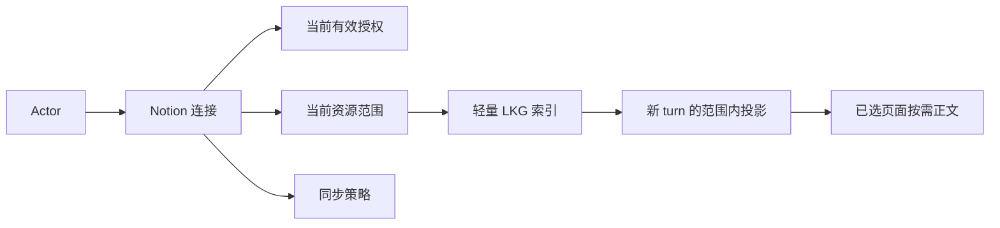
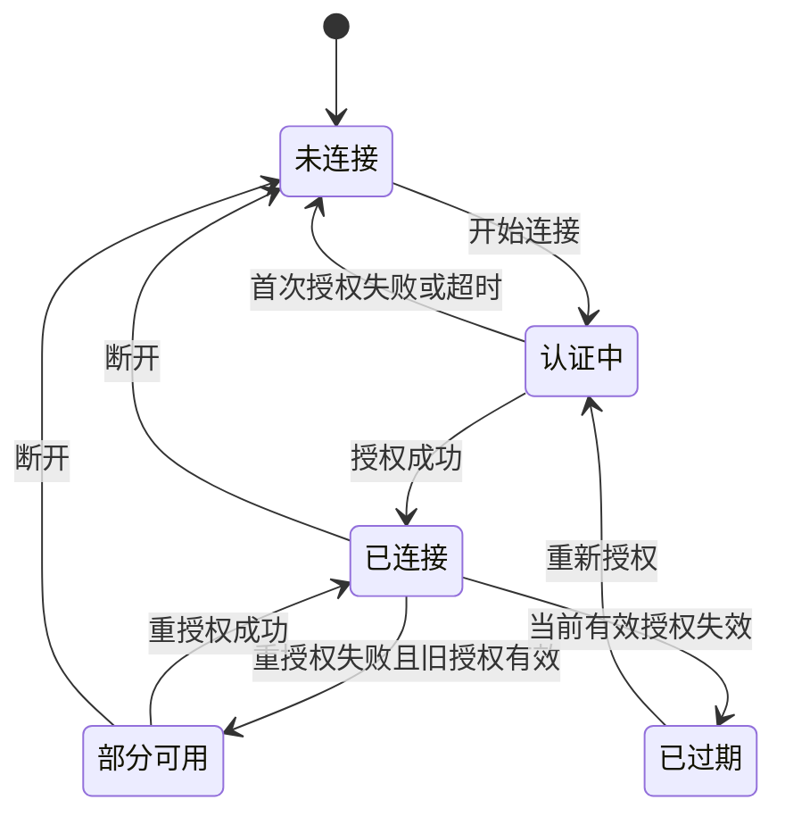

<!-- [Input] Current Notion connector implementation/tests, Settings/Chat interaction, repository product rules, and the reviewed proposed detail-page redesign. -->
<!-- [Output] Evidence-based runtime/data requirements plus implemented UI information architecture, remaining capability gaps, migration, observability, and acceptance criteria. -->
<!-- [Pos] Current Notion Resource Connector product source of truth in docs/prd/notion-session. -->
<!-- [Sync] 2026-08-29: replace the stale frontend-only proposal with the reviewed end-to-end PRD and PRD-code-test decision matrix. -->
<!-- [Sync] 2026-08-29: implement the seven-section Notion detail, safe Skill browsing, and child views while keeping Hosted MCP read/write explicitly not integrated. -->
<!-- [Sync] 2026-08-29: source Skill metadata/files from the installed package and operation rows from the real Read hook/workspace materializer. -->
<!-- [Sync] 2026-08-30: add the ntn installation prerequisite and actor/thread-bound Agent CLI environment as the single notion-cli execution path. -->
<!-- [Sync] 2026-08-30: align the Notion CLI/no-subtitle overview, management-only resource/source rows, and shared dynamic Skill catalog across Settings and workspace. -->

# Notion 资源连接器整体 PRD

- Runtime/data status: Reviewed and implemented
- Detail UI redesign status: Implemented and verified
- Scope: Settings、Chat、服务器连接生命周期、轻量索引、Agent 按需读取和当前详情页信息架构
- Technical source: [`../../design/notion-session/runtime-credential-and-skill-design.md`](../../design/notion-session/runtime-credential-and-skill-design.md)
- Business sequences: [`../../design/notion-session/runtime-credential-and-skill-sequence.md`](../../design/notion-session/runtime-credential-and-skill-sequence.md)

## 1. 背景与问题

用户希望授权 Dream 使用其 Notion 知识，但授权、资源范围、索引刷新和 Agent 正文读取是四个不同的业务动作。旧文档把它们混成“连接后同步内容”，同时保留了已经废弃的工作台、浏览器兜底状态和内部 Runtime 说明，造成以下问题：

- 产品状态无法说明“账号仍可用，但最近一次索引刷新失败”；
- “已连接”被前端误显示成“已同步”；
- 资源取消选择后，旧成功索引可能继续进入新 thread；
- 文档把内部目录、命令行参数和凭证投影写成用户概念；
- 旧文档描述的资源树、同步按钮语义和断开确认与当前页面不一致。

本 PRD 以可运行代码和测试为证据，保留安全且已验证的单一路径，修复范围撤销和状态真实性缺口，并删除不再承担业务职责的历史方案。本轮详情页、Skill 安全浏览和子页组织已经实现；Hosted MCP inventory/执行与 Notion 写入仍未接入，不得宣称为可用。

## 2. 产品目标

1. 用户能在 Settings 完成连接、授权、重新授权、资源选择、策略设置、立即同步和断开。
2. 所有连接、同步和资源状态来自服务器，不由浏览器推测或持久化伪造。
3. 后台只同步用于定位资源的轻量索引；正文仅在 Agent 实际读取已选择页面时获取。
4. 凭证、选择范围、索引、thread 能力和正文读取按 actor 严格隔离。
5. Notion 局部失败给出状态、影响和下一步，但不无理由中断普通 Agent 对话。
6. 同一能力只有一条正式业务路径：`notion-cli` 复用现有 actor/thread projection 并由 `sdk_env` 注入 Agent Bash，不新增第二套认证、Notion MCP 或 Chat 内同步分支。
7. 当前详情页让用户审阅真实 Skill、当前 Read 能力和 MCP 未接入状态，并把大列表管理放在专项子页。

## 3. 非目标

- Notion 写入、评论、附件下载、全文镜像或离线正文仓库；
- 多个 Notion 账号同时生效、连接共享或跨用户授权；
- webhook、增量变更流、跨副本租约或新消息队列；
- 新增数据库表、字段、migration 或运行时 DDL；
- 在产品页面展示内部目录、凭证文件、Runtime hook、CLI 命令或环境变量；
- 替代现有普通 turn、resume、cancel、EventBus 或 SSE 协议。
- 在本轮接入 Hosted Notion MCP OAuth/inventory 执行、Notion 写入，或实现 Skill 启停/编辑。

## 4. 用户角色与核心场景

| 角色 | 场景 | 目标 |
|---|---|---|
| 未连接用户 | 首次进入资源链接 | 理解用途并开始授权 |
| 已连接用户 | 选择数据库或页面 | 明确允许 Agent 使用的范围 |
| 已配置用户 | 查看状态或立即同步 | 判断索引是否可用、是否需要行动 |
| 授权变化用户 | 重新授权 | 更新权限且不破坏仍有效的旧授权 |
| 停止使用用户 | 断开连接 | 撤销 Dream 侧连接、凭证与索引 |
| Chat 用户 | 在对话中引用 Notion | 从已选范围定位并按需读取正文 |

## 5. 核心概念与业务规则

### 5.1 连接

连接表示当前 actor 在 Dream 中拥有一个可管理的 Notion 连接记录。前端只管理一个当前有效连接；历史重复记录的数据库级唯一约束不在本次变更中新增。

### 5.2 授权

授权表示服务器持有当前 actor 的有效 Notion 凭证；新 Agent Runtime 直接接收当前 actor/thread 投影出的 Notion CLI 环境。

重新授权使用独立的待确认授权。只有新授权成功保存后才替换当前有效授权；失败或超时保留旧授权，并显示“部分可用”。

### 5.3 资源范围

- 可选择的资源类型为数据库和独立页面。
- 保存时以完整选择集合替换旧集合，不做隐式并集。
- 空集合是有效配置，含义是“保持连接，但禁止 Notion 资源进入新对话”。系统立即清除当前索引身份。
- 用户只能读取当前选择集合中的独立页面，以及当前选择数据库索引出的页面。
- 从选择中移除的资源在下一次 thread 投影时立即不可读，即使最近一次新索引构建失败。

### 5.4 轻量索引

轻量索引只保存定位页面所需的 ID、标题、链接和更新时间等紧凑元数据，不保存页面正文。成功索引是 last-known-good（LKG）；后台失败时可以保留它，但每次使用必须与当前选择范围求交。

### 5.5 按需正文

Agent 先读取索引定位页面，只在回答确实需要正文时请求一个已允许页面。未选择的页面必须在远程请求前拒绝。

### 5.6 同步策略

| 概念 | 定义 |
|---|---|
| `default` | 服务器提供的默认开关与频率，仅用于初始化和非法配置回退 |
| `desired` | 用户最近保存的目标策略 |
| `effective` | 服务器校验后实际执行的策略 |
| `revision` | 每次成功保存策略时单调递增的版本 |
| `status` | `applied`、`syncing`、`error` 或 `disabled` |

当前策略保存是同步校验：合法时 `desired` 与 `effective` 在同一 revision 生效。频率选项由后端返回，它们是受支持的策略选项，不是用户配额。

### 5.7 Skill、Hook、workspace materializer 与 MCP 能力真相

当前已实现能力必须与延期能力分开：

| 能力 | 当前事实 | 页面规则 |
|---|---|---|
| Notion Skill | `build_notion_capability_catalog` 从服务器发布包组成当前目录；当前返回 `notion-session` 与 `notion-cli` | Settings 逐行消费 `skills[]`；每个包的标题/摘要/body 从自身 `SKILL.md` 读取，相关文件从自身 `references/*.md` 发现；不维护第二份 UI/workspace 清单 |
| 当前读取 | `apply_notion_page_read_redirect` 校验当前 thread 索引后按需读取单页 Markdown | descriptor 与真实 Hook 同模块维护；UI 标“内置 Hook”，不展示内部路径、参数或函数名 |
| workspace materialize | `materialize_workspace_snapshot` 把 connector-owned 轻量索引写入当前 thread workspace；实现位于 `notion/sync.py` 并使用 `notion_snapshot.py` 契约 | 作为 `write` 阶段能力标“工作区”；明确不含正文、不写回 Notion、不提供执行按钮 |
| Hosted Notion MCP | OAuth、inventory 和执行均未接入 | 保留后端 `not_integrated` 事实，不按官网清单伪造工具，也不在正常页增加重复说明块 |
| Skill 浏览 | connector API 提供服务器发布包的解析正文、stable file ID、revision 和安全 reference 文件 DTO | UI 上部展示 `SKILL.md` body、下部展示动态 reference 文件；不从 thread/browser 读取 |

未来 MCP 工具只可从当前 actor、当前认证的服务器 inventory 动态返回，并携带 revision、read/write/unknown 安全分类和可用性。远端官网存在某工具或 descriptor 本身都不足以证明本产品可执行；`unknown` 不得推断为写入。

## 6. 数据对象及关系

产品层只关心上述关系。持久化表、目录和 Runtime 交付方式在架构文档中定义。

## 7. 状态定义

### 7.1 用户可见状态

| 维度 | 状态 | 含义 |
|---|---|---|
| 连接 | 未连接 | 无可用连接记录 |
| 连接 | 认证中 | 等待用户在 Notion 完成授权 |
| 连接 | 已连接 | 授权有效，但可能尚未选择或索引资源 |
| 连接 | 部分可用 | 旧授权或旧索引仍可用，但最近一次重新授权或同步失败 |
| 连接 | 已过期 | 无有效授权，需要重新授权 |
| 连接 | 异常 | 无可用授权且连接操作失败 |
| 同步 | 未同步 | 没有当前索引，通常因为尚未选择资源或已清空范围 |
| 同步 | 同步中 | 正在构建轻量索引 |
| 同步 | 已同步 | 存在最近一次成功索引 |
| 同步 | 同步失败 | 最近一次尝试失败；若有 LKG 则为部分可用 |
| 同步 | 已关闭 | 自动同步关闭；仍可立即同步 |
| 资源 | 未选择 | 不进入新 thread，不允许按需读取 |
| 资源 | 待同步 | 已选择但尚未进入成功索引 |
| 资源 | 已索引 | 已包含在最近一次成功索引中 |
| 资源 | 失败 | 最近一次针对该范围的同步未成功 |

### 7.2 内部诊断状态

授权会话 ID、轮询标记、安全错误码、索引 identity 和调度时间用于诊断与并发控制。页面只将它们转换为业务状态、影响和下一步，不展示内部值。

### 7.3 错误分类

| 分类 | 示例 | 是否影响普通对话 |
|---|---|---|
| 可恢复错误 | API 暂时不可用、索引刷新失败 | 否；Notion 局部能力降级 |
| 需要重新授权 | 当前有效凭证缺失或过期 | 否；Notion 不可用 |
| 范围错误 | 资源未选择、权限不足 | 否；该页面不可读 |
| 局部能力错误 | Skill 或按需读取初始化失败 | 否；继续普通回答 |
| 完全失败 | 无连接且授权无法启动 | Notion 不可用，普通对话仍可继续 |

## 8. 状态转换规则

- 保存非空资源范围后立即启动首次轻量索引。
- 保存空范围后保持“已连接”，同步变为“未同步”，已选来源为 0。
- 同步成功更新 LKG、最近成功时间和精确资源状态。
- 同步失败不推进成功 identity；有 LKG 时显示“部分可用”，无 LKG 时显示“同步失败”。
- 策略关闭只停止定时触发，不删除 LKG，也不禁用立即同步。

## 9. 连接与 OAuth 授权流程

1. 用户在 Settings 进入 Notion 详情页，点击“连接 Notion”。
2. 系统创建或复用当前连接并启动服务器授权会话。
3. 页面展示验证链接、验证码和等待状态。
4. 用户在 Notion 确认授权；页面轮询服务器状态。
5. 成功后显示“已连接”，加载可访问资源。
6. 失败时显示当前状态、Notion 能力影响和“重试授权”操作。

页面不得要求用户粘贴 token、内部路径或重复输入已经安全保存的信息。

## 10. 资源发现与选择

1. 授权成功后，服务器分页读取全部可访问数据库和页面，并过滤系统资源。
2. 页面提供搜索、类型区分、分页和当前选择标记。
3. 用户保存后，服务器原子替换当前选择集合。
4. 非空选择立即构建轻量索引；空选择立即撤销当前索引。
5. 成功后刷新已挂载来源、同步时间和 Chat 摘要。

资源发现 DTO 不携带不可解释的上游原始响应；只传递选择和展示需要的紧凑元数据。

## 11. 同步策略与生效规则

- 页面展示自动同步开关、后端允许的频率、最近成功、下次计划和当前状态。
- 保存合法策略后，`desired` 与 `effective` 进入同一新 revision。
- 非法选项由后端拒绝，前端保留上一次服务器状态并显示错误。
- 后台定时同步独立于 Chat；用户不需要先创建或继续对话。
- 每个连接的失败隔离，不得传播到其他连接或 Agent turn。

## 12. 定时同步与手动刷新

定时同步适合持续更新已选资源的 ID 和元数据。手动“立即同步”适用于：

- 刚在 Notion 修改了页面范围或权限；
- 页面提示最近一次同步失败；
- 用户希望在下一轮自动同步前使用最新索引。

立即同步不下载正文，不改变自动同步策略，也不需要确认弹窗。

## 13. Chat 启动与能力挂载

新 Agent turn 启动时：

1. 服务器读取当前 actor 的有效授权和最近成功索引；
2. 将索引与当前选择范围求交；
3. 只把当前 actor、当前 thread 可用的连接快照交付给 Runtime；
4. workspace materializer 调用 capability catalog，把返回的 Skills、availability、revision、指令入口和 Runtime 发现别名写入 `.notion/README.md`；workspace context 读取同一生成段；
5. 安装或刷新 catalog 返回的标准 Notion Skills；
6. 不访问 Notion，不执行全量同步，不加载正文。

已运行 turn 不热替换凭证或索引；重新授权和新同步从下一 turn 生效。

## 14. Agent 索引定位与按需正文

1. Skill 读取轻量连接摘要和索引。
2. Agent 根据标题或数据库范围定位允许的页面 ID。
3. Agent 请求该页面正文。
4. Runtime 再次验证 actor、thread、路径和当前索引成员关系。
5. 验证通过后只获取该页当前 Markdown；失败返回安全错误和下一步。

Skill 不可用或 Notion 读取失败时，普通对话继续；Agent 应说明未使用到 Notion 信息，不得把失败伪装成成功读取。

## 15. 重新授权与断开

### 15.1 重新授权

- 新授权成功前，当前有效授权继续服务新 turn。
- 新授权失败或超时：状态为“部分可用”，说明旧授权仍有效以及何时需要重试。
- 新授权成功：原子替换有效授权；下一 Runtime 使用新凭证。

### 15.2 断开

断开会删除 Dream 侧连接记录、当前 actor 凭证、索引和已知 thread 投影，但不会删除 Notion 中的数据。该操作可通过重新连接恢复，因此不增加确认弹窗；按钮必须显示进行中和失败状态，防止重复提交。

## 16. 页面状态与反馈

本节的详情页组织已经实现，且未改变前述运行时和数据规则。完整交互见 [`resource-connector-ui-design.md`](./resource-connector-ui-design.md)。

### 16.1 信息架构

页首保留返回、Notion 图标、`Notion CLI` 标题、短状态、连接/重新授权和断开；标题下不放用途小字、实现说明或重复状态摘要。页首之后，桌面与窄屏严格为：

1. 权限：只含索引同步策略；
2. Skills：逐行显示 capability catalog 返回的 Skills；当前制品为可分别进入子页的 `notion-session` 与 `notion-cli`；
3. 读取操作：展示真实 Read Hook 阶段能力；
4. 写入操作：展示真实 workspace snapshot materializer，并明确不写回 Notion；
5. 资源范围：只显示管理入口；
6. 已挂载来源：只显示管理入口；
7. 信息：`connector.createdAt` 和三个官方外链。

Settings 内容区是唯一纵向滚动容器；主详情不再内嵌资源/来源长列表。Chat 仍只显示状态摘要、来源列表和“管理”，不复制授权、策略、Skill 或资源选择表单。

### 16.2 四个子视图

- Skill：按选中的 catalog Skill ID，上部安全渲染对应安装包 `SKILL.md` body，下部动态列该包的 `references/*.md`；无启停开关。
- Skill 文件：使用服务器 stable file ID 读取 allowlist 内安全文本，只显示相对路径、MIME 和大小。
- 资源范围：完整承接现有发现、搜索、分页、完整集合保存、非空首同步和空范围 fail-closed。
- 已挂载来源：完整承接逐来源状态、正数页数和立即同步/重试；有/无 LKG 反馈分开。

子视图只改变视图归属，必须复用同一 connector controller、现有 API 和服务器真相，不创建第二 store、localStorage 成功状态或第二 Runtime 路径。

### 16.3 信息区

信息位于详情页末端，只显示：

- 连接时间：服务器 `connector.createdAt`，按 locale 输出含年份完整日期；无值为“尚未连接”，解析失败为“暂时无法读取”，不得回退浏览器当前时间；
- 网站：`https://developers.notion.com/cli/get-started/overview`；
- 隐私政策：`https://privacycenter.notion.so/policies`；
- 服务条款：`https://notion.notion.site/Terms-and-Privacy-28ffdd083dc3473e9c2da6ec011b58ac`。

外链使用明确标签、外链图标、键盘可达的真实链接和 `target="_blank" rel="noopener noreferrer"`；不接受用户输入重定向。

### 16.4 数据合同状态与缺口

现有 connector API 已提供连接、`createdAt`、策略、范围、来源、同步、从安装包读取的 Skill 标题/摘要/Markdown/reference 文件、stable file ID、MIME、大小、package revision，以及真实 Read Hook/workspace materializer descriptor。

仍未提供 Hosted MCP 动态 inventory、认证来源、read/write/unknown 分类、远端可用性和 inventory revision；当前只返回 `not_integrated` 事实，且不存在执行入口。

后续只可在现有 connector service 内增加只读能力投影，或复用经过相同 owner guard、allowlist、路径越界、符号链接、MIME、大小、revision 和脱敏验证的通用读取能力。不新增 schema、队列、独立服务、第二 connector API 或执行路径。Skill 内容来自服务器发布包，不从 thread workspace 或浏览器缓存读取。

### 16.5 实现分期

1. 已完成能力合同：返回安装包 `notion-session` / `notion-cli`、真实 Read Hook/workspace materializer descriptor 和 MCP `not_integrated`；
2. 已完成视图重组：资源与来源完整交互迁入子页，主详情移除长列表和嵌套滚动；
3. 已完成 Skill/文件/读写说明/信息、焦点与滚动恢复；
4. 已完成 API 安全测试、组件、响应式、键盘语义、provider-free E2E 和宽窄屏视觉复核。

Hosted Notion MCP OAuth/inventory 执行、写入授权/确认/审计/幂等不在上述分期，必须独立设计和验证。

### 16.6 状态反馈

| 页面状态 | 展示 | 主要操作 |
|---|---|---|
| 首次加载 | 各边界独立骨架，不闪现浏览器旧状态 | 无 |
| 未连接 | Notion 用途；Skill 可审阅；MCP 未接入；写入只读 | 连接 |
| 认证中 | 验证链接、验证码、等待说明；不提前声明 inventory 可用 | 打开 Notion |
| 已连接无资源 | “尚无来源索引”；当前 Read 写明范围前置 | 管理资源范围 |
| 同步中 | “正在更新轻量索引”，说明 LKG 是否可用 | 等待；来源子页防重复同步 |
| 成功 | 服务器确认的范围、来源、最近成功和下次计划 | 管理资源/来源 |
| 部分失败 | 保留成功数据，说明失败影响、自动恢复和下一步 | 重试、检查权限或重新授权 |
| 完全失败 | Notion 不可用；Skill 文档/官方外链仍可独立展示 | 重新授权或稍后重试 |

能力目录失败只降级 Skills/读写说明，不阻断策略、资源、来源或普通 Chat；未知状态不得回退成“可用”。

## 17. 错误反馈合同

| 条件 | 当前状态 | 影响 | 用户下一步 |
|---|---|---|---|
| 凭证缺失 | 未连接/已过期 | Notion 不可用 | 连接或重新授权 |
| 重授权失败但旧凭证有效 | 部分可用 | 旧权限继续，新权限未生效 | 需要权限变化时重试 |
| 权限不足 | 已连接，页面读取失败 | 仅该资源不可读 | 在 Notion 授权后立即同步 |
| 未选择资源 | 已连接、未同步 | Agent 不读取任何 Notion 页面 | 选择资源并保存 |
| 索引过期或刷新失败 | 部分可用/同步失败 | 可能使用旧元数据 | 立即同步或等待自动同步 |
| Notion API 异常 | 局部失败 | 本次发现、同步或读取失败 | 稍后重试 |
| Skill 加载失败 | 局部能力不可用 | 本轮不能使用 Notion | 继续普通对话，稍后新 turn 重试 |

错误响应只需返回可操作的连接、安装、权限或同步状态，不把 Runtime 环境绑定包装成用户设置项。

## 18. 多用户隔离、安全与隐私

- 连接、凭证、选择、索引和 thread 投影均以 canonical actor 身份解析。
- actor A 的任何请求不得返回或使用 actor B 的连接、索引、凭证或正文。
- 浏览器、用户环境、workspace 文件和父进程环境不得覆盖服务器拥有的授权来源。
- thread 投影只包含当前选择范围和紧凑连接摘要，不包含用户 ID、内部配置、验证码或授权会话。
- 正文不进入持久索引、错误响应、日志或测试快照。
- 断开后，后续 Notion 读取 fail closed；普通对话继续。

## 19. 兼容、迁移与回滚

- 保持现有 connector API 和 Admin 管理的 PostgreSQL schema，不新增 migration。
- 旧成功索引可以作为 LKG 读取，但投影时强制移除正文、私有连接配置和已取消选择的资源。
- 新同步会自然替换旧索引；不做运行时 DDL 或批量正文回填。
- 删除未被路由引用的旧前端工作台，不继续双路径兼容。
- 当前 UI 已先补只读能力合同再移动视图；回滚只恢复页面组织，不恢复浏览器伪状态、MCP/CLI 或正文同步。
- 回滚应用版本不要求 schema 回滚；不得恢复浏览器伪状态、共享凭证目录或 Agent CLI/MCP fallback。

## 20. 数据指标与可观测性

至少记录不含敏感值的：

- 授权开始、成功、失败和重新授权保留旧授权的计数；
- 资源发现耗时、分页数和结果数；
- 索引成功/失败、耗时、数据库数、页面 ID 数和安全错误码；
- 策略 revision、状态转换、计划触发与手动触发来源；
- 按需读取成功/拒绝/权限/API 失败计数；
- Skill 发现和加载失败计数。
- 待补遥测：能力目录/Skill/文件读取结果、package revision、MCP `not_integrated`/失败分类、资源/来源子页操作和安全文件拒绝计数。

产品指标关注连接完成率、选择完成率、索引成功率、部分失败恢复率和 Notion 读取成功率；`not_integrated` 不记作工具调用失败。

## 21. 验收标准

1. A 无法读取 B 的凭证、索引或正文。
2. 未授权用户无法发现、同步或读取 Notion。
3. 资源发现完整分页，返回紧凑元数据且不含原始响应。
4. 授权后保存非空范围可生成轻量索引；索引不含正文。
5. 清空或缩小范围后，新 thread 立即不能读取已移除页面。
6. thread 只获得当前 actor、当前选择范围的索引摘要。
7. 只有索引允许的页面 ID 能触发按需正文获取。
8. Runtime Bash 收到当前 actor/thread 的四个 `NOTION_*` 变量；HTTP 响应、connector DTO 与 thread 索引不承担该环境绑定。
9. 重授权失败保留有效旧凭证；成功后新 Runtime 使用新凭证。
10. 定时同步不依赖 Chat；Chat 初始化不访问 Notion。
11. Skill 可由标准 Runtime 发现；Skill 失败不影响普通对话。
12. 前端区分已连接、已同步和部分可用，全部状态来自后端。
13. 既有 MCP、其他 Skill、turn/resume/cancel/EventBus/SSE 行为不变。
14. 相关后端测试、前端类型检查与构建通过。

当前 UI 还必须持续满足：

15. 页首后严格为“权限 → Skills → 读取操作 → 写入操作 → 资源范围 → 已挂载来源 → 信息”，且 Settings 内容区是唯一纵向滚动。
16. 权限只含索引同步策略；资源和来源长列表仅存在于各自子页。
17. 主概览只展示 capability catalog 返回的真实 Skills，不硬编码 Skill 行；当前制品为 `notion-session` 与 `notion-cli`。Skill 上部为对应 `SKILL.md`、下部为动态发现的对应 reference 文件，无开关；`notion-cli` 按 ntn 安装状态与连接状态显示“需要安装 / 连接后可用 / 可用”。
18. 读取区绑定真实 `apply_notion_page_read_redirect`，写入区绑定真实 `materialize_workspace_snapshot`；不硬编码官网工具伪清单。
19. workspace materialize 明确不含正文且不写回 Notion；当前页面没有执行、启用、授权升级或远程写入表单。
20. 信息使用服务器 `createdAt` 和三条指定安全外链；无效时间不回退浏览器当前时间。
21. 返回恢复焦点/滚动，revision 变化不继续把旧策略、inventory 或文件显示为最新。
22. Skill/文件/能力目录局部失败不阻断 connector 管理或普通 Chat。

## 22. 本次明确不实现

- 数据库级“每 actor 仅一条 Notion connector”唯一约束及历史重复记录清理；
- 多账号切换、团队共享、细粒度成员权限；
- webhook、增量 cursor、跨副本协调和失败通知中心；
- 全文搜索、附件、写回、批量正文缓存；
- Hosted Notion MCP OAuth、动态 inventory 执行、Notion 写入授权/确认/审计/幂等；
- 内置 Skill 启停、安装、卸载、编辑、版本切换和用户覆盖；
- 飞书与本地 CLI 只保留禁用的能力发现占位，不提供配置、授权或运行路径；其他不可用连接器不展示占位 UI。

## 23. PRD—代码—测试—业务判断矩阵

| 产品主题 | 调查前文档描述 | 调查时代码行为 | 测试证据 | 差异类型 | 正确处理 |
|---|---|---|---|---|---|
| 用户级凭证 | 混有用户目录和 Runtime 参数 | actor 私有保存、待授权原子提升、thread 隔离 | `test_notion_credentials` | 不应产品化的技术细节 | 产品只写隔离规则；细节迁架构 |
| 授权状态 | 认证成功/失败二元描述 | 有独立授权会话和有效凭证 | `test_notion_auth`、router flow | 规则缺失 | 增加连接与授权会话分层 |
| 重新授权 | 未定义失败时旧授权 | 部分分支会把连接误标过期 | 新增失败重授权测试 | 代码缺陷 | 保留旧授权并显示部分可用 |
| 资源发现 | 只描述本地分页，远端 cursor 延期 | 仅取远端第一页 | 新增 pagination/loop tests | 代码缺陷 | 完整分页并拒绝 cursor 循环 |
| 资源 DTO | 保存上游 `raw` | 原始响应进入选择 metadata | normalization tests | 不应产品化的技术细节 | 删除 raw，仅保留紧凑字段 |
| 选择保存 | 选择后另点同步 | 保存接口立即同步 | router happy path | 文档过期 | PRD 改为保存即首同步 |
| 空选择 | 未明确 | 先写空集合再报同步错误，旧 LKG 残留 | 新增 empty-selection test | 代码缺陷/规则缺失 | 定义为保持连接、清除索引 |
| 范围缩小 | 未明确 | 新 turn 直接投影旧 LKG | 新增 projection scope test | 代码缺陷 | 每次投影与当前选择求交 |
| connector 快照 | PRD 展示内部文件字段 | 过宽 connector/config 进入 thread | projection redaction test | 代码缺陷/技术细节 | 最小化公开投影，架构记录格式 |
| 索引内容 | 历史文档存在正文 snapshot | 已为 ID/元数据轻索引、`pages={}` | snapshot contract/runtime tests | 历史设计残留 | 删除正文同步描述，不恢复兼容 |
| 定时同步 | 旧 PRD 称策略占位 | 后端有真实策略和 scheduler | scheduler tests | 文档过期 | 写明 default/desired/effective/revision |
| Chat 初始化 | 文档存在 workspace 同步暗示 | 只投影 LKG，不访问远程 | snapshot store/service tests | 命名或状态语义不一致 | 统一称“能力挂载/投影” |
| Agent 读取 | 历史 CLI/MCP/静态正文并存 | 标准 Skill + 受控按需 Read | runtime integration tests | 历史设计残留 | 只保留文件导航 + 单页按需读取 |
| Skill 详情 | 参考图支持 Skill/文件审阅 | 服务器内置 `notion-session` / `notion-cli` 包和 connector 安全只读 DTO 已接入 | unit/router/API/E2E | 已实现 | stable ID + per-package revision + allowlist；不从 thread/browser 读取 |
| 读写操作 | 用户要求展示系统实际使用的读写阶段 | Read Hook 与 workspace materializer 均已存在；后者只写本地轻量投影 | Runtime/Skill/API/调用链搜索 | 旧 UI 用三条手写 Read 文案且误把 write 等同远程 Notion 写入 | descriptor 与真实入口同模块维护；页面区分 Hook、工作区投影和远程 Notion 写入 |
| 详情层级 | 策略、资源、来源曾平铺同页 | 当前为页首 + 七段，资源/来源在专项子页 | component/E2E/visual QA | 已实现 | 保持单一 Settings 纵向滚动 |
| 连接信息 | 用户要求底部连接时间和官方链接 | 当前信息区使用 `createdAt` 和三条安全外链 | API/E2E | 已实现 | 不伪造更精确 OAuth 时间；无效值不回退当前时间 |
| 前端健康状态 | authenticated 即 healthy/synced | 同步失败被健康状态遮蔽 | 前端构建；后端 policy tests | 代码缺陷 | 增加部分可用，未有时间不称已同步 |
| 断开 | 一次确认并保留来源 | 删除连接、凭证和快照；可重新连接 | router/store/credential tests | 文档过期 | 无确认，清理已知 thread 投影 |
| Settings 占位 | 历史同时展示 Feishu 和 CLI 不可用卡片 | 两者都是用户需要保留的未来能力发现位置，当前均无可调用业务能力 | Settings UI、前端 E2E、路由引用搜索、前端构建 | 产品边界需区分 | 保留两张禁用占位；不新增配置 API、授权流程或第二路径 |
| 普通对话降级 | 局部错误边界零散 | Notion hook/Skill 失败不改变 turn | runtime integration tests | 无需处理的一致实现 | 保留并写入正式 PRD |
| 多用户隔离 | 有原则但状态范围不完整 | DB owner guard + actor provider + hook membership | router/credential/runtime tests | 无需处理的一致实现 | 保留并扩展验收 |
| 单账号 | 文档称强约束 | UI 管理一个当前连接，DB 无唯一约束 | 前端选择逻辑、store tests | 命名或状态语义不一致 | 本次定义 UI 单有效连接；硬约束延期 |

## 24. 反过度设计评审

### 保留

- 现有 connector、actor 凭证 Provider、轻量索引、调度器、thread 投影、按需 Read、标准 Skill 与单一 `ntn` driver；
- 现有 Admin-owned schema、公开 API、EventBus/SSE 与普通 Agent 生命周期；
- 同步失败保留 LKG、局部失败不打断普通对话的边界。

### 修改

- 资源发现完整分页；
- 空选择和范围缩小 fail closed；
- connector/thread 投影最小化；
- 重新授权失败保留有效授权；
- 前端区分已连接、已同步、部分可用；
- 断开清理已知 thread 的凭证与索引投影。
- 详情已改为严格七段；资源/来源已迁入子页；安全 Skill/文件/能力说明与末端信息区已接入。
- Skill 与 reference 清单改为读取安装包；读写操作改为真实 Read Hook/workspace materializer descriptors。
- `sdk_env` 注入当前 thread 的四个 `NOTION_*` 变量；缺少 ntn 时在认证前提示固定安装命令。

### 删除

- 未引用的旧 Resource Connector 工作台；
- 飞书/CLI 的伪可用操作和配置路径；两张禁用能力发现卡继续保留；
- 浏览器或文档中的伪成功、静态正文、Agent CLI/MCP 正式路径；
- 当前 Read 冒充 MCP、静态官网工具伪清单、未实现写入的伪按钮和 Skill 启停开关；
- 可逆断开操作的确认弹窗。

### 迁移到技术文档

- 持久化对象、内部目录、权限模式、CLI/API driver、Runtime hook、虚拟读取路径和安全错误码。

### 延期

- 数据库级单账号约束、历史重复清理；
- webhook/增量、跨副本调度、全文搜索、附件、写回和通用 connector 框架。
- Hosted Notion MCP OAuth/inventory 执行、写入确认/审计/幂等、Skill 启停与二进制文件浏览。

结论：本次只保留一个后台轻索引路径和一个 Runtime 单页按需读取路径；两者职责互补，不新增服务、队列、表、控制通道或环境分支。
