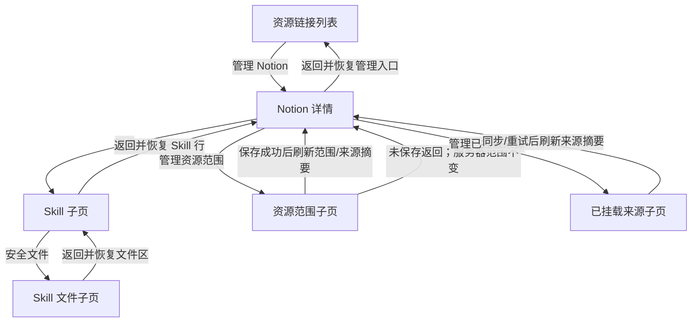

<!-- [Input] Implemented Notion detail UI specification and the reviewed four-stage page redesign. -->
<!-- [Output] Current supporting desktop/mobile skeletons and child-view navigation map for the implemented Notion connector detail. -->
<!-- [Pos] Current Notion connector detail structure sketch in docs/prd/notion-session; product rules are owned by resource-connector.md. -->
<!-- [Sync] 2026-08-29: replace the historical inline resource/source layout and strategy placeholder with the proposed seven-section overview and four focused child views. -->
<!-- [Sync] 2026-08-29: mark the structure implemented after contract tests, Chrome E2E, and wide/narrow visual QA. -->
<!-- [Sync] 2026-08-29: compact the desktop overview into aligned label/content columns and remove redundant normal-state notices and header summaries. -->
<!-- [Sync] 2026-08-29: replace synthetic read/write copy with the real Read-hook and workspace-materializer capability rows. -->
<!-- [Sync] 2026-08-29: restore the reference skeleton's breathing room and remove section subtitles, Skill summaries, resource counts, and recent-sync copy from the overview. -->
<!-- [Sync] 2026-08-30: show notion-session and renamed notion-cli as two real installed Skill rows with independent detail packages. -->
<!-- [Sync] 2026-08-30: name the overview heading Notion CLI while keeping Notion as the provider identity in connector actions. -->

# Notion 连接器详情页面结构草图

- Status: Implemented and verified
- 视觉：沿用 Ink & Memory 暖纸令牌；桌面为紧凑设置清单，窄屏为单列
- 滚动：Settings 内容区是主详情和子页的唯一纵向滚动容器
- 事实：当前安装 `notion-session` 与 `notion-cli`；Read hook 可用，CLI 凭证执行与 Hosted Notion MCP 读写均未接入

## 1. 主详情 · 桌面

```text
┌──────────────────────────── Settings 内容壳 ─────────────────────────────┐
│ ← 资源链接                                                               │
│                                                                          │
│ [Notion] Notion CLI [短状态]                     [连接/重新授权] [更多] │
│          连接用途                                                        │
│──────────────────────────────────────────────────────────────────────────│
│ 权限              │ [自动同步] [服务器频率] [保存策略]                  │
│                   │ effective / 下次计划                                │
│──────────────────────────────────────────────────────────────────────────│
│ Skills            │ [Skill] Notion 工作空间助手  内置 · {状态}       ›  │
│                   │ [Skill] Notion CLI 工作空间数据助手 内置 · 暂不可用 › │
│──────────────────────────────────────────────────────────────────────────│
│ 读取操作          │ 按需读取页面正文        [内置 Hook]       {状态}  │
│                   │ {操作说明}                                           │
│──────────────────────────────────────────────────────────────────────────│
│ 写入操作          │ 挂载工作区轻量索引    [工作区]             {状态}  │
│                   │ {操作说明}                                           │
│──────────────────────────────────────────────────────────────────────────│
│ 资源范围          │ [管理资源范围]                                  ›  │
│──────────────────────────────────────────────────────────────────────────│
│ 已挂载来源        │ [管理已挂载来源]                               ›  │
│──────────────────────────────────────────────────────────────────────────│
│ 信息              │ 连接时间                              {createdAt}  │
│                   │ 网站 / 隐私政策 / 服务条款                     ↗  │
└──────────────────────────────────────────────────────────────────────────┘
```

### 桌面结构规则

- 页首负责身份、短状态、连接、重授权和断开，不计入七段；正常态不显示重复摘要或说明块。
- “权限”只有索引同步策略；没有 OAuth、正文、Runtime 或 MCP 开关。
- 读取操作直接显示当前真实可用能力；未接入能力不伪造成工具。
- 写入操作只说明真实 workspace materialization，没有开关、执行、授权升级或远程写入伪能力。
- 七个分区标题下不显示辅助说明；内容说明属于操作行或子页，而不是重复标题层级。
- Skills 概览只显示名称、来源、可用状态和进入箭头；摘要在 Skill 子页显示。
- 资源范围和来源在概览只显示一个管理入口，不显示数量、范围拆分或最近同步时间。
- 信息位于末端，不 sticky、不折叠进菜单。

## 2. 主详情 · 窄屏

```text
← 资源链接

[Notion] Notion
{真实状态}
连接用途
[连接/重新授权（全宽）] [更多]

权限
索引同步策略
[自动同步]
[频率（全宽）]
effective / 计划
[保存策略（全宽）]

Skills
Notion 工作空间助手
内置 · {状态}                                      ›
Notion CLI 工作空间数据助手
内置 · 暂不可用                                    ›

读取操作
内置 Hook 按需读取已选页面正文
· 按需读取页面正文 · {状态}

写入操作
工作区挂载轻量索引，不写回 Notion
· 挂载工作区轻量索引 · {状态}

资源范围
[管理资源范围（全宽）]                             ›

已挂载来源
[管理已挂载来源（全宽）]                           ›

信息
连接时间
{本地化完整日期}
网站                                                ↗
隐私政策                                            ↗
服务条款                                            ↗
```

- 七段顺序不变；横向信息改为纵向堆叠。
- 触控目标至少 44px，文字按钮不退化成纯图标。
- 状态不能挤掉标题；文件名、来源名和说明允许换行。
- 不使用横向表格或详情内部纵向滚动。

## 3. Skill 子页

```text
┌────────────────────────── Skill 子页 ──────────────────────────┐
│ ← Notion                                                         │
│ Notion 工作空间助手                    [内置] [{真实可用性}]     │
│ 只读搜索和读取当前用户已挂载的 Notion 内容                        │
│ （无启用 / 停用开关）                                             │
│──────────────────────────────────────────────────────────────────│
│ Skill 说明                                                        │
│ {服务器解析 frontmatter 后安全渲染的 SKILL.md body}               │
│ 标题 / 正文 / 列表 / 表格 / 代码块                                │
│──────────────────────────────────────────────────────────────────│
│ 包含的文件                                                        │
│ references/notion-search.md       text/markdown · {大小}       ›  │
│ references/notion-page-read.md    text/markdown · {大小}       ›  │
│ references/notion-db-query.md     text/markdown · {大小}       ›  │
└──────────────────────────────────────────────────────────────────┘
```

- 上部正文、下部文件清单按自然滚动串行，不双栏、不嵌套滚动。
- `SKILL.md` 不在文件清单重复；不列 `.folder.md`、点文件、缓存、评测、构建产物或符号链接。
- 正文和文件清单各自失败时保留另一侧成功内容。

## 4. Skill 文件子页

```text
← 包含的文件
Notion 工作空间助手 / references/notion-search.md

notion-search.md
text/markdown · {大小} · 只读

{安全 Markdown / 纯文本预览}
```

- 内容通过服务器 stable file ID 获取，不把相对路径拼成服务器文件路径。
- 只显示相对路径、MIME 和大小，不显示绝对路径、owner、权限位、thread 或 token。
- revision 变化、移除、超限、MIME 不支持、安全拒绝和普通错误都在正文位置反馈。

## 5. 资源范围子页

```text
┌──────────────────────── 资源范围子页 ──────────────────────────┐
│ ← Notion                                                        │
│ 资源范围                                                        │
│ 选择允许进入轻量索引的数据库和独立页面                          │
│─────────────────────────────────────────────────────────────────│
│ [搜索资源________________]  已选择 N 个  {有未保存更改}          │
│ 共 N 个资源 · 第 x / y 页                                       │
│ [✓] {数据库标题}      [数据库] {正数页数}                       │
│     {非敏感副标题}                                              │
│ [ ] {页面标题}        [页面]                                    │
│ …                                                               │
│ [上一页] [下一页]                                               │
│─────────────────────────────────────────────────────────────────│
│ 服务器当前范围 N 个                       [保存并首次同步]       │
└─────────────────────────────────────────────────────────────────┘
```

- 复用现有发现、搜索、分页、完整集合保存和首同步语义。
- 非空集合保存后建立轻量索引；空集合允许保存并 fail closed。
- 保存失败保留本页草稿，说明服务器范围未改变。
- 授权过期停止发现/保存但保留当前页草稿。
- 返回不新增确认弹窗；未保存草稿离开后丢弃。

## 6. 已挂载来源子页

```text
┌────────────────────── 已挂载来源子页 ──────────────────────────┐
│ ← Notion                                                        │
│ 已挂载来源                                                      │
│ N 个来源 · 聚合状态 · 最近成功 {时间}       [立即同步/立即重试] │
│─────────────────────────────────────────────────────────────────│
│ [数据库] {来源标题}                         [已索引/同步中/失败] │
│          最近成功 {时间}                    {N 页，仅 N>0}      │
│          {必要的非敏感问题说明}                                 │
│ ─────────────────────────────────────────────────────────────── │
│ [页面]   {来源标题}                         [{状态}]             │
│ …                                                               │
└─────────────────────────────────────────────────────────────────┘
```

- 同步中保持按钮位置并切换 loading/disabled，阻止重复提交。
- 立即同步只刷新轻量索引，不改变自动策略、不下载正文。
- 有 LKG 与无 LKG 的失败文案必须分开。
- 页数只在大于 0 时显示；来源列表随 Settings 内容区滚动。

## 7. 页面关系与返回



- 进入子页后焦点移到新视图 `h1`；返回恢复触发行和滚动锚点。
- 滚动位置只属于瞬时视图状态，不写数据库、localStorage 或 connector DTO。
- 保存/同步只刷新受影响的服务器摘要；Skill 局部失败不触发整个 connector 重载。

## 8. Loading / Empty / Error / Unavailable

| 区块 | Empty / Unavailable | Error |
|---|---|---|
| 权限 | 未连接：“连接后可设置” | 原策略仍生效；说明是否自动恢复并重试 |
| Skills | 服务器确认 0 项时说明无内置 Skill | Skill 信息失败不影响连接和索引 |
| 当前 Read | 无索引时逐行写“选择资源后可用” | 描述失败不影响资源管理 |
| MCP 读取/写入 | 当前 `not_integrated`，不生成虚构工具行 | inventory 未知不得标可用 |
| 资源范围 | 0 个说明“不允许资源进入新对话” | 摘要失败不冒充 0 |
| 来源 | 0 个引导管理范围 | 有/无 LKG 分开说明 |
| 信息 | 无 `createdAt` 为“尚未连接” | “暂时无法读取”，不回退当前时间；外链仍可用 |
| Skill 文件 | 无安全文件时说明空清单 | 拒绝不回显服务器路径 |

错误统一回答：发生了什么、用户内容/授权/LKG 是否安全、系统是否自动恢复、用户下一步。

## 9. 结构验收

1. 页首后严格为“权限 → Skills → 读取操作 → 写入操作 → 资源范围 → 已挂载来源 → 信息”，信息在自然滚动末端。
2. 主详情和四个子页只有 Settings 内容区一条纵向滚动。
3. 当前有 `notion-session` 与 `notion-cli` 两个安装包；各 Skill 上方显示自己的正文、下方显示自己的动态 reference 文件，无开关。
4. 读取和写入分别对应真实 Read Hook 与 workspace materializer；后者不写回 Notion。
5. 资源与来源长列表只在子页，主详情只有摘要和管理入口。
6. `createdAt` 和三条外链准确、安全且不泄露内部字段。
7. 桌面/窄屏顺序一致；返回恢复焦点/滚动；各边界局部失败。
