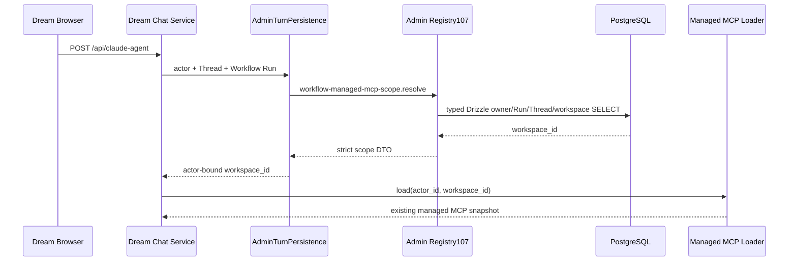

<!-- [Input] Admin Registry107, Dream public Chat turn owner and current dirty-safe DB closure scan. -->
<!-- [Output] Managed MCP workspace scope migration design, implementation boundary and verification receipt. -->
<!-- [Pos] Cross-project stage plan; Runtime activation and internal durable dispatch remain separate pending domains. -->
<!-- [Sync] 2026-09-15: consume Registry107 without moving MCP, Runtime, SSE or filesystem behavior. -->

# Admin Managed MCP Workspace Scope 迁移

## 背景与问题

Dream `ClaudeAgentService` 在加载 managed MCP snapshot 前，原先直接查询 `workflow_runs.workspace_id`。公开 Chat 已携带 Admin 解析的不可变 Workflow context 和续期中的 `server-persistence` grant，因此继续打开 Dream PostgreSQL 会重复权限判断，也违反 Admin 统一数据库访问边界。Registry106 已完成 workspace plugin 元数据迁移；当前刷新扫描仍显示 `service.py` 的 scope、Runtime activation、内部 fallback 和旧 Session helper 等未关闭入口。

## 目标与边界

本阶段新增 Admin Registry107 `workflow-managed-mcp-scope.resolve`，并让 Dream 公开 Chat 通过同一 Thread/Run grant 消费。Admin 执行严格 DTO、主体与实体范围校验、typed Drizzle ORM 查询及 capability gate。Dream 只使用返回的 `workspace_id` 调用既有 managed MCP snapshot loader。

本阶段不迁移 MCP 配置应用、Agent Runtime、SSE、文件系统、Runtime activation 写事务或内部 durable dispatcher 的身份建立。内部 dispatcher 尚未携带可续期的 Admin grant，暂时保留原 provider 并继续列入生产数据库关闭清单；公开路径不能回退到该 provider。

## 概念与规则

- 输入只有 `thread_id` 和 `workflow_run_id`，不接受 actor、workspace、表、列、SQL、路径或 runtime node。
- Admin 从 OAuth 或 opaque delegation 派生 canonical actor。delegation 必须同时匹配 `dream:read`、service、purpose、Thread 与 Run。
- Repository 在一个 read UOW 内同时匹配 Run creator、source Thread、Run workspace 和 Story Workspace owner。
- 输出只有原 `thread_id`、`workflow_run_id` 与 `workspace_id`。Dream 重复比对 actor、Thread 与 Run 后才使用 workspace。
- capability、认证、权限、实体或响应不匹配均失败关闭。公开 Chat 不回退 Dream PostgreSQL。

## 正常业务流程

## 状态转换与失败反馈

这是只读投影，不创建业务状态。普通 Chat 没有 Workflow context 时返回 `None`，继续加载用户级 MCP snapshot。Dream turn 有 context 时，缺少 provider、Admin 超时、capability 缺失、scope 不足、Run/Thread/workspace owner 不匹配或响应 DTO 不一致都会停止本轮 context assembly，并复用既有安全失败提示；不启动查询，不改 Run，不改文件。

## API 契约

- 方法：`POST /api/internal/dream/v1/operations/workflow-managed-mcp-scope.resolve`
- scope：`dream:read`
- 输入：`{thread_id, workflow_run_id}`
- 输出：`{thread_id, workflow_run_id, workspace_id}`
- contract SHA：`c996f3bf5fc2bfcc8fa9a7c3b90ae039800109a56ec2159882cfd921d6f74bdc`
- Registry106 prefix SHA：`f2076b75b446446bbed747c80ea7c7859f6c9ed9b602ef9fd28c332b220ada1a`
- 幂等与重试：纯读取不创建 receipt；`AdminDataClient` 仍使用既有有界请求策略。Dream 不缓存跨 turn 的 workspace 所有权结论。

## 数据模型与迁移

Repository 只读取现有 `workflow_runs` 与 `story_workspace_workspaces`，使用现有 `dream.schema.unified.v1` capability，无新表、字段、索引或 migration。Drizzle 仍由 Admin 唯一管理。

## 页面行为与失败反馈

本阶段不增加页面元素或确认。失败沿用 Chat context assembly 的业务错误帧；页面不展示数据库、内部 operation、grant 或 workspace 物理信息。

## 影响范围与验收

| 范围 | 证据 | 结果 |
|---|---|---|
| 当前源码清单 | dirty-safe AST，533 modules / 80 production entries / 52 SQL modules / 30 DB-import modules / 55 legacy helpers / 123 Admin operations / 0 parse errors | 通过；仅为候选清单 |
| Admin focused | Registry107 DTO/Service/Repository/Handler/registration + affected Registry106-era registration guards | 12 files、76 tests passed |
| Admin full/type/lint | `pnpm test:run`；`pnpm exec tsc --noEmit`；目标 ESLint | 225 files passed / 17 skipped，1852 tests passed / 36 skipped；exit 0 / exit 0 |
| Admin PostgreSQL | 随机命名 loopback cluster、SELECT-only DATA role、owner/Run/Thread/workspace/capability/closed-selector/row-count/cleanup | exit 0，PASS |
| Dream focused | consumer、turn owner、Agent service | 107 tests、9 subtests passed |
| Dream compile | 四个受影响生产模块 | exit 0 |
| Dream public DB fence | provider path执行时 `_db.get_db` 强制失败 | 通过 |

## 发布顺序与回滚条件

先部署包含 Registry107 capability 的 Admin，再部署 Dream consumer。Dream 在 exact hash 未广告时失败关闭。回滚 Dream 后可保留 Admin 只读操作；回滚 Admin 前必须确认没有运行中的 Dream 版本要求 Registry107。内部 dispatcher、Runtime activation 和其他扫描候选完成前，不得宣称 Dream 全生产路径已无 PostgreSQL。

## 本轮 Optimized Prompt

You are the cross-project migration engineer closing one coherent Dream database-read aggregate. Refresh the current dirty-safe source inventory, then implement an append-only Admin contract for managed MCP workspace scope using strict DTO, Service, typed Drizzle Repository and one capability-gated read UOW. Derive actor and entity scope from OAuth or an exact renewable Thread/Run delegation. Return only Run, Thread and workspace identifiers. Wire the Dream public Chat turn owner to consume the operation and prove that its database fallback is unreachable. Preserve MCP loading, Runtime, SSE, shared filesystem, resource policy and turn state behavior. Validate exact registry prefix/hash, focused tests, type/lint/compile, Markdown links and a runner-owned restricted-role PostgreSQL contract. Record internal durable dispatcher and Runtime activation paths as pending rather than claiming all production database access is closed.

USER REQUIREMENT:
继续完成 Admin 统一数据库接口迁移；接口遵从 DTO/ORM，Dream 保留 Runtime 与共享文件系统。
