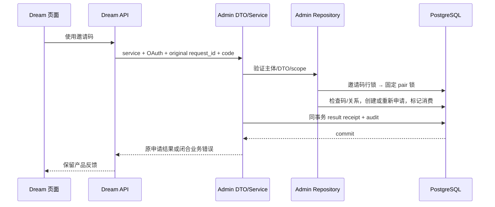

<!-- [Input] Original Dream friend SQL/public routes and Admin-confirmed social domain ownership. -->
<!-- [Output] Nine strict DTO/typed Repository/Drizzle operations with atomic invitation and relationship decisions. -->
<!-- [Pos] Coordinator-owned plan; Admin task owns thin ingress/shared registry/schema and Dream owns consumers. -->
<!-- [Sync] 2026-09-15: execute one Prompt Architect pass before social implementation. -->

# 好友与邀请码数据接口迁移

## 背景与问题

Dream `database.py` 的七个邀请码/好友操作和两个好友图片读取仍访问 PostgreSQL。`routers/friends.py` 保留产品路由。原消费邀请码先读后写，没有行锁；两个客户端可能同时消费同一码。批准与拒绝也可互相覆盖；已拒绝的同方向重新申请会触发现有唯一约束。数据库迁移必须保留领域权限与一次事务，不能改成 Dream 多次通用 CRUD。

## 目标与边界

主协调任务独占 Admin `socialFriendshipDto/Repository/Service.ts`、unit 和公开合同 harness。Admin 任务已确认七操作未开始，并拥有薄 Handler、Registry、Receipt、共享文档/schema；同域发现的两个关系授权图片读取一并定义，不涉及图片写入。Dream 任务随后复用统一 Pydantic 客户端替换九个生产调用，保留公开状态码、提示、缩略图 fallback、姓名 fallback 和 bigint 的原产品输出。

## 概念与规则

- 当前 OAuth 主体是唯一操作者；请求不含 actor/user_id。好友 ID、申请 ID 是实体选择器，需要 Admin 检查关系或接收方。九操作均不接受 Thread/Run/Editor bearer。
- `friend-invite.generate/use`、`friend-request.list/accept/reject`、`friendship.list/remove/timeline/picture-full` 是固定业务操作。Zod strict DTO → Service → typed Repository → Drizzle；没有表名/列名/SQL 输入。
- 原邀请码 alphabet 保持 uppercase ASCII letters+digits。原六字符、七日改由 Admin `DREAM_FRIENDSHIP_POLICY_JSON` 明确提供 `code_length`、`lifetime_seconds`；`generation_attempts` 仅限定碰撞重试的服务端执行预算，耗尽返回503并回滚，不增加用户配额。示例保留原6/604800，配置不进入浏览器。密码学随机数代替原非密码学 random。
- 邀请码消费先锁该码，随后按两个 canonical decimal ID 数值排序取得固定 PostgreSQL transaction advisory pair lock；关系检查、创建/重新申请、消费标记、receipt/audit 同 UOW。碰撞 INSERT ON CONFLICT DO NOTHING，包括过期 PK，不覆盖历史邀请码。
- 已 used_by 或 used_at 的码不重新消费；过期 `<` 判断由 Admin PostgreSQL clock 完成，原精确相等仍可使用。自加、已有 accepted/pending、无效/已使用/过期保留原业务错误文字。
- 关系批准/拒绝先只读取固定双方，再取得 pair lock，重读申请 FOR UPDATE，只允许该接收方将 pending 转 accepted/rejected。并发批准/拒绝只有一项成功；后者返回原 `Request already ...`。删除只删除当前双方 accepted 的两个方向。
- 同方向 rejected 再申请复用既有 row ID，并按新申请刷新 created_at/updated_at；反方向 rejected 历史保留。该改动修复原 unique23505，不新建主体、表或替换主键。
- 好友图片授权与读取在同一 pair-locked UOW；仅 accepted 双方能读取目标用户图片。timeline 优先 thumbnail，按原 date DESC/limit；full 按原 created_at DESC 取最新。没有共享文件系统或 Runtime 变化。
- bigint 以 canonical decimal string 跨接口传递，精确 PG timestamp/NULL 保留。列表不引入产品分页限制；同时间用稳定 ID 排序，nullable 历史时间放末尾，避免原 Python mixed-null sort 抛错。
- 领域拒绝返回 closed `{success:false,error}`，Dream 保持原400/detail；服务认证/权限/capability/存储故障使用现有标准错误。读图片缺少关系返回 null，由 Dream 保持 timeline403/full404。
- 原请求 write receipt 与业务/audit 一起提交；同请求重放返回原结果不重新生成码或申请，不同输入409。超时恢复只查询原 receipt，absent 不代表回滚，不盲目重试非幂等写入；Admin 不可用不回退数据库。

## API 与责任

统一入口 `POST /api/internal/dream/v1/operations/{name}`，body `{request_id,input}`；服务认证加用户 OAuth Bearer，read/write 对应原 dream scope。input/output v1 哈希由实际 Zod 注册表产生；identity+unified0033 exact capability，不新增 migration 或依赖全局 head。

| 操作 | 输入 | 输出 | 事务/权限 |
| --- | --- | --- | --- |
| friend-invite.generate | {} | code, expires_at | 当前用户，码+receipt |
| friend-invite.use | code | 成功申请/邀请者或闭合错误 | 码锁→pair锁，创建+消费+receipt |
| friend-request.list | {} | requests | 当前用户收到的 pending |
| friend-request.accept/reject | request_id | success/error | 接收方/pair/行锁/CAS+receipt |
| friendship.list | {} | friends | 当前用户 accepted 双方向 |
| friendship.remove | friend_id | success/error | 当前双方 accepted DELETE+receipt |
| friendship.timeline | friend_id, limit | pictures/null | accepted 关系锁+目标图片 |
| friendship.picture-full | friend_id, date | image_base64/null | accepted 关系锁+目标图片 |

## 正常流程与状态

生成 unused 码 → 另一用户 use → 新 pending 关系并将码标记 consumed → 接收方 accept/reject → accepted 双方列表及图片可见，或 rejected 可用新码重新申请。相同请求重复返回原结果。无效/过期/已使用/自己/已有关系不改变业务行。remove 只移除 accepted，图片权限随该提交失效。关系锁对所有九操作中的共享关系决策采用同一 key；没有 pair→invite 的反向锁顺序。

## Optimized Prompt:

You are the primary cross-project implementer and own only Admin socialFriendshipDto.ts, socialFriendshipRepository.ts, socialFriendshipService.ts, focused unit tests and a provider-free public contract harness. Admin explicitly transferred seven original invitation/friendship callables and retains thin ingress/registry/receipts/schema/shared docs; include the two discovered relationship-authorized friend picture reads without taking the picture write domain. Read actual repository/folder rules, original Dream database functions and friends routes/frontend code, Drizzle friend_invites/friendships/daily_pictures/users schema, existing canonical principal, exact capability, raw timestamp and same-UOW receipt helpers. Implement nine closed named operations using strict Zod DTOs, verified current OAuth principal, a typed Repository and Drizzle ORM. Preserve exact bigint decimal IDs, timestamp microseconds/NULLs, labels, thumbnail fallback, original success/error DTOs and product routes. Use invitation FOR UPDATE then a canonical ordered transaction pair lock, atomic friendship creation/resend plus invitation consumption, and recipient-only locked pending CAS for approve/reject. Reuse rejected same-direction row IDs to repair unique collisions without deleting history. Preserve fixed public actor ownership, forbid entity bearer grants, arbitrary actors/table/column/SQL, runtime/database fallbacks or new migration. Configure legacy code length/lifetime in Admin only; generation collision budget is execution protection, not a product quota. Every write and original result/receipt/audit commits in one existing transaction; duplicate replay does not touch state and changed input conflicts. Validate source-compatible errors, malformed/expired/self/duplicate/pending/accepted/denied paths, concurrent same-code/reciprocal-pair/approve-reject decisions, original request recovery, private picture permissions and historical precision through meaningful focused tests and primary-prepared proven disposable restricted-role public fixtures. Luna executes bounded deterministic and non-destructive production-entry contracts; primary handles fixtures, fault SQL, migrations and real account/model acceptance. You are not alone; do not revert other tasks or write their shared files. Update headers and provide Admin exact contract hashes, docs and raw command/cwd/exit receipts before Dream consumers close the domain. Keep Runtime/SSE/leases/resource-policy/shared filesystem untouched. No overall completion claim until every original mandatory domain and real acceptance is fulfilled.

USER REQUIREMENT:
数据库访问改造成接口遵从 DTO/ORM 设计，完整迁移好友和邀请码生产入口，保持权限、事务、并发和产品反馈并产出可核验文件及验证。

## 评审、验收与风险

设计满足 Admin 所有 DB、Dream 所有产品交互，无新认证主体/数据库/队列/控制通道；修复三个原并发/唯一约束缺陷已显式记录。验证：定向 pnpm exec vitest、whole `tsc --noEmit --incremental false`、定向 ESLint/diff；主任务证明具名可删除 PostgreSQL 身份与 restricted ACL 后准备最小已有 actor 测试 facts，Luna 从公开 operation/receipt Routes 验证九操作并 SELECT 核对结果。实际命令/退出码/断言数字只在执行后记录。风险是旧 Dream 直接 SQL 与新 pair 锁混用；切换前九旧入口必须同时关闭，不声明 mixed writers 一致。真实 Google/正常现有账户/模型/共享FS业务验收仍另阶段进行。

当前状态：九操作实现与注册69已形成，focused25/wholetype/lint通过；新_social61具名隔离facts准备通过，公开9合同230断言通过，原source22通过。已交付Dream消费；生产入口关闭和正常业务验收仍待后续。

## 实现和公开合同准备

主任务4文件仅写DTO/Repository/Service/unit；最初focused25/lint/diff0，Repository错误从dream导入users导致wholetype2。修从canonical schema导入后wholetype/Repo lint0，原失败保留。文档originalchecker误把已评审exec.folder union当byte镜像且source缺头；只补source头并按先前149规则验证五消费者索引+一Sync之外所有byte必须equal，八doc paths通过。见[初轮真实结果](../exec/admin-auth-data-verification/social-friendship-focused-initial.md)、[type/doc修复后](../exec/admin-auth-data-verification/social-friendship-type-doc-rerun.md)。

Admin共享Registry69和薄OAuth-only ingress/Receipt已注册；[九actual Zod契约](../exec/admin-auth-data-verification/social-friendship-contracts9.json)由真实canonicalContractJson产生，不改变旧60hash。primary新_social61只源于本轮fresh61/zeroidentity隔离模板，最新restrictedACL0；三explicit subjects、11码、4历史picture/null/µs与公开ordinaryThread bearer（仅证明Social拒绝）准备0，私钥不导出/私有0600。公开harness调用实际operation/receipt routes，owner核对仅SELECT；准备与公开验证分别保留回执。见[目标身份](../exec/admin-auth-data-verification/social61-database-proof.json)、[fixtures](../exec/admin-auth-data-verification/social61-fixture-proof.json)。

## 公开验证结果与消费者交付

Luna执行 `python3 /private/tmp/ink-auth-migration-validation/run-social-friendship-contract.py`，工作目录Admin worktree729f，退出0，九操作230断言通过；只调用实际production operation/receipt Routes，owner核对使用SELECT。正常公开写入会改变本轮隔离fixture，不能把此测试称为无数据库写入或盲目重跑。覆盖邀请码生成/消费、pending/批准/拒绝/重新申请/删除、关系授权图片、错误/主体/权限、相同码和互相申请及批准拒绝并发、原receipt重放/冲突和单次audit。见[实际命令回执](../exec/admin-auth-data-verification/social61-public9-command-receipt.json)、[230断言原输出](../exec/admin-auth-data-verification/social-friendship-public9-actual230.md)。

原public harness首次因共享plugin source fixture错误Set类型在wholetype前置退出2，九操作没有执行；Admin修复五个真实typed Set后whole tsc/lint/diff均0，保留[原失败](../exec/admin-auth-data-verification/social-friendship-public9-initial-type-failure.md)和[修复gate](../exec/admin-auth-data-verification/social69-plugin-source-type-gate.md)。主任务仅刷新短时OAuth/ordinaryThread凭据，social三表checksum不变，无reset；见[refresh证明](../exec/admin-auth-data-verification/social61-credential-refresh-proof.json)。未把本轮验证key当真实Provider发token或Google登录。

原未修改Dream函数AST正文在明确依赖注入的source oracle中22例通过，不导入其数据库模块或复制算法；修复并发/唯一约束/used_at等行为没有冒称旧源码已有。见[source22](../exec/admin-auth-data-verification/social-friendship-source-proof22.json)。共享Registry69实际Zod契约[证明旧60逐项和hash不变](../exec/admin-auth-data-verification/social69-contract-parity.json)。九DTO/hash、230与source22已交付两个实际任务，共享注册窗口解冻；Dream按统一Pydantic客户端迁移friends.py九入口，保留公开int/status/detail/微秒。Dream迁移完成前此领域只记录Admin技术验证通过。
