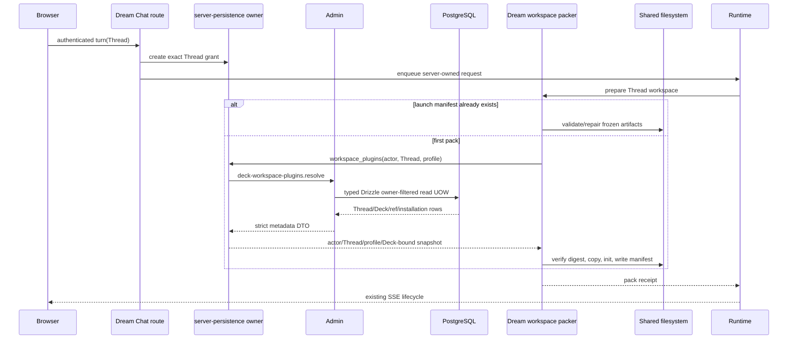

<!-- [Input] Admin Registry106 commit d7ba9c6, Dream public Agent pack path and shared filesystem rules. -->
<!-- [Output] Reviewed DTO/ORM migration contract, state flow, implementation scope and verification gates. -->
<!-- [Pos] Current public workspace plugin metadata migration plan; internal dispatcher closure stays explicit. -->
<!-- [Sync] 2026-09-15: implement Registry106 consumer without moving artifact or Runtime execution to Admin. -->

# Admin workspace plugin 元数据迁移

## 背景与问题

公开 Claude Agent turn 原先在 `backend/claude_agent/service.py` 打开 Dream PostgreSQL，再由 workspace packer 查询 Thread 已绑定 Deck 的 enabled plugin refs 和 Story Workspace server adapter。该路径把数据权限、安装状态读取和 SQL 留在 Dream 生产服务中，与 Admin 统一数据库访问目标冲突。插件 artifact 位于共享文件系统，摘要校验、复制、init profile、Dream surface、freeze/repair 与 launch manifest 属于 Dream 执行能力，不能迁入 Admin。

## 目标与边界

Admin commit `d7ba9c6` 提供 Registry106 `deck-workspace-plugins.resolve`。Admin 通过严格 Zod DTO、Service、typed Drizzle Repository 和一个只读 UOW 派生 actor，校验 Thread/Deck owner，读取 enabled refs，并按服务端配置解析 Story adapter 的 latest/ready 状态。Dream 通过严格 Pydantic DTO 和现有 `AdminDataClient` 消费，使用续期中的 `server-persistence` 精确 Thread grant，不接收浏览器提供的 actor、Deck、package、表、列或路径选择器。

本阶段关闭公开 Chat workspace pack 的数据库读取。未实现 Registry106 provider 的内部 dispatcher 或后台 owner 暂时保留旧 provider，并继续列入全生产入口关闭清单；它不能成为公开路径的失败回退。

## 概念与规则

- `profile=standard`：Admin 返回 Deck refs，`story_workspace_adapter` 必须为 null。
- `profile=story_workspace`：有 Deck 时 Admin 返回 adapter 的 `latest_status` 和首个 ready candidate；配置来源为 Admin `DREAM_WORKSPACE_PLUGIN_POLICY_JSON`。
- Dream 对每个 ref 保留 `installation_status == ready` 规则，继续校验共享 artifact digest 后复制。
- Story adapter 无安装记录时返回 `CLAUDE_PLUGIN_NOT_FOUND`；有记录但无 ready candidate 时返回 `CLAUDE_PLUGIN_NOT_READY`。
- adapter 与 Deck ref 的 `package_spec` 相同时只打包一次。
- 已存在 launch manifest 时先验证并修复冻结内容，不调用 metadata loader，不替换插件版本。
- Admin 超时、权限拒绝、capability/hash 不匹配、DTO 错配或 Thread/Deck 身份不一致时终止 turn；公开路径不得回退 PostgreSQL。

## 正常流程

## 状态转换与失败处理

| 当前状态 | 条件 | 动作 | 结果 |
| --- | --- | --- | --- |
| 无 Deck | Thread DTO 的 `deck_id` 为 null | 不调用 packer metadata | 保持原无插件行为 |
| Fresh workspace | 无 launch manifest | 调用 Registry106，一次加载完整 refs | 验证后写 manifest 与 receipt |
| Frozen workspace | manifest 存在 | 校验/修复固定条目 | 不调用 Admin，不更换版本 |
| Story adapter missing | `latest_status=null, ready=null` | Dream 产生 `CLAUDE_PLUGIN_NOT_FOUND` | Runtime 启动前失败 |
| Story adapter not ready | `latest_status!=null, ready=null` | Dream 产生 `CLAUDE_PLUGIN_NOT_READY` | Runtime 启动前失败 |
| Admin/DTO/identity failure | HTTP、capability、hash、actor、Thread、Deck 任一不匹配 | 终止 pack | 无 PostgreSQL fallback |

## API 契约与数据模型

- 方法与路径：`POST /api/internal/dream/v1/operations/deck-workspace-plugins.resolve`。
- 输入：严格 `{thread_id, profile}`，profile 为 `standard | story_workspace`。
- 输出：`thread_id`、nullable `deck_id`、有序 refs、nullable Story adapter status/candidate。
- 权限：OAuth `dream:read` 或精确 Thread entity grant；Admin 从凭据派生 canonical actor。
- 事务：一个 read-only UOW；无 receipt、重试写入或跨 HTTP 事务。
- contract SHA：`79eca8295a3a1611b2459af26f0a9e05dd01eae97bdd4928d1982e77a524425e`。
- schema：复用现有 Admin Drizzle 表和 capability，无 migration；Dream 不增加 ORM、DDL 或数据库配置。

## 影响范围与验收

实现范围为 Dream `deck_workspace_plugins_data.py`、`request_auth.py`、`turn_persistence.py`、Agent `service.py` 与 `workspace_packer.py`。Runner、ThreadFactory、admission、lease、EventBus、SSE、turn/resume/cancel、资源策略 LKG、`CLAUDE_CODE_TMPDIR`、`0700` 与符号链接限制保持现有行为。

验收要求：严格 DTO/hash 注册；当前 grant 读取；公开路径 `_db.get_db` 封锁；normal/Story adapter 成功、缺失、未就绪与去重；frozen manifest metadata 零调用；Python compile；受影响测试和完整 backend suite 通过。随后重新扫描所有 `_pack_thread_workspace_plugins` 调用，内部 dispatcher fallback 仍显示为未完成项。

## 当前执行回执

| 工作目录 | 命令或检查 | 退出码与关键结果 |
| --- | --- | --- |
| Admin worktree | Registry106 focused Vitest | `0`；5 files、27 tests passed |
| Admin worktree | `pnpm exec tsc --noEmit --incremental false` 与变更范围 ESLint | `0`、`0` |
| Admin worktree | runner-owned restricted PostgreSQL contract | `0`；owner/ref/status/order/scope/capability/UOW/zero-write/cleanup 全部 PASS |
| Admin worktree | `pnpm test:run` | `0`；221 files passed、17 skipped，1840 tests passed、36 skipped |
| Dream worktree | Registry106 + RequestAuth + Chat + Agent + workspace packer affected suite | `0`；232 tests、37 subtests passed |
| Dream worktree | provider 分离后的定向 suite 与 Python compile | `0`；184 tests、37 subtests passed；compile 无输出 |
| Dream worktree | changed Markdown relative-link inventory | `0`；6 files，missing `[]` |
| Dream worktree | 完整 `backend/tests` | `1`；3716 passed、42 skipped、60 failed、815 subtests passed |

完整 suite 的 60 项失败按输出归入既有未闭合范围：旧测试仍 patch 已移除的 `routers.claude_agent.database`；Story/Product 旧鉴权 fixture 返回 401；当前本机 Runtime manifest 未满足 production qualification；旧 SQLite fixture 缺 `history_final_text`；本机 vendor artifact 与旧快照断言不一致。Registry106 新增测试和受影响回归均通过，但在这些全局失败关闭前不能声明完整 backend 自动化通过。

## 评审结论、发布与回滚

设计满足认证与数据库访问归 Admin、业务与共享文件系统执行归 Dream。接口按业务操作设计，没有任意 SQL/CRUD，数据权限和 ORM 查询保留在 Admin。Dream 的 server-persistence grant 已具备 Thread、actor、scope、续期和关闭边界，可复用，无需新增服务、队列或 token authority。

发布顺序为 Admin Registry106 capability → Dream consumer → 公开业务验证。Dream 在 capability/hash 不存在时失败关闭。回滚 Dream consumer 前必须停止依赖 Registry106 的 Dream 版本；回滚 Admin 前必须确认没有运行中的 Dream 版本要求该 capability。冻结 workspace 的既有 manifest 不随回滚改写。
