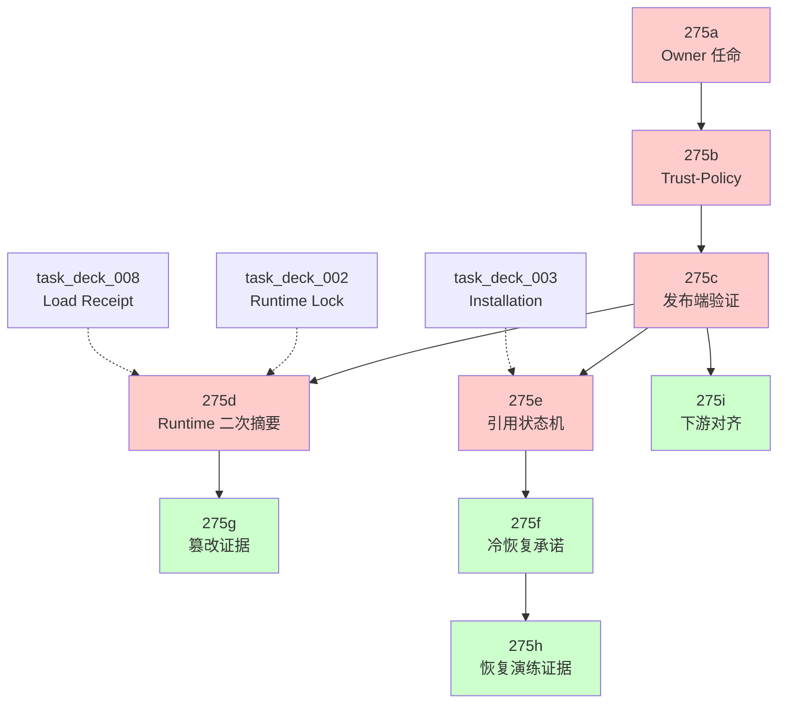

# Stage 计划 — Deck Plugin Stage 4 Supply-Chain 生产 Gate 执行编排

> Stage Issue: [SUO-282](/SUO/issues/SUO-282)
> 父项: [SUO-258](/SUO/issues/SUO-258)
> 设计裁决: [SUO-261](/SUO/issues/SUO-261) `no_design_delta`
> 审批来源: [SUO-255](/SUO/issues/SUO-255) `request_changes` → follow-up
> 设计稿: `docs/design/deck/design_002_deck-plugin-decision-gates.md` §4.2
> 决策状态: `DECK-GATE-DEC-017` = `conditional_frozen`
> Issue 清单: `docs/issue/ISSUES_deck-plugin-stage4-supply-chain.md`
> Task 需求: `docs/task/TASK-REQUIREMENT-task_275_shared_deck-stage4-supply-chain.md`
> Canonical Tasks: `task_275a` ~ `task_275i` (9/9)
> 生成 Agent: StagePlanner
> 生成日期: 2026-08-01

---

## 1. 关联输入

| 输入类型 | 路径 | 状态 |
|---|---|---|
| 设计稿 | `docs/design/deck/design_002_deck-plugin-decision-gates.md` §4.2 | `conditional_frozen` |
| Issue 清单 | `docs/issue/ISSUES_deck-plugin-stage4-supply-chain.md` | 已冻结 |
| Task 需求 | `docs/task/TASK-REQUIREMENT-task_275_shared_deck-stage4-supply-chain.md` | 已冻结 |
| Canonical Tasks | `docs/task/task_275a` ~ `task_275i` | 9/9 已生成 |
| 稳定摘要 | `d9a845497c52b1472277fbe884571f5d3b5f38c4e397884757b08e30a9f1783b` | 已核验 |

**集合 B（superseded / non-canonical）保持隔离，禁止纳入本阶段计划。**

---

## 2. 阶段任务表

| 阶段 | 任务 | 产出 | 依赖 | 风险 |
|---|---|---|---|---|
| **Stage 1** 治理与信任基础 | `task_275a` 具名 Owner 任命与签署 | `owner-signoff-matrix.json/md` + 三方签署记录 | 无 | Owner 缺位导致全链路冻结 |
| **Stage 1** 治理与信任基础 | `task_275b` Trust-Policy 包 | 信任根/identity/算法矩阵/离线 verifier | `task_275a` security owner 签署 | 自行实现密码学；撤销 provider 失联 |
| **Stage 2** 双路径校验核心 | `task_275c` 发布端 SHA-256 + RFC 8785 + 签名验证 | 不可变 release verification row | `task_275b` active policy | RFC 8785 库选择；事务边界 |
| **Stage 2** 双路径校验核心 | `task_275d` Runtime 二次摘要 + Load Receipt | `RuntimeLoadReceipt` 原子提交 | `task_275c`, `task_deck_002`, `task_deck_008` | Cache TOCTOU；大制品冷启动 |
| **Stage 2** 双路径校验核心 | `task_275e` 制品引用状态机 + 90 天隔离 | Retention state machine + purge Gate | `task_275c`, `task_deck_003` | 乱序事件负计数；配置缩短隔离期 |
| **Stage 3** 运营承诺与证据 | `task_275f` 冷恢复可用性 + 运营承诺 | `ColdStorageAdapter` + owner 签署 RTO/RPO | `task_275e` | 第三方 SLA 未明；示例值冒充承诺 |
| **Stage 3** 运营承诺与证据 | `task_275g` 篡改矩阵 + Evidence Pack | 十类篡改 case 全部 deny + reviewer 签署 | `task_275c`, `task_275d` | Fixture 含私钥；报告链接失效 |
| **Stage 3** 运营承诺与证据 | `task_275h` 冷恢复演练 + 引用清理 Evidence | 三摘要一致 + purge matrix + reviewer 签署 | `task_275e`, `task_275f`；entry condition 消费 `task_275d` runtime 接口 | 演练误删生产；热/cache 未真清除 |
| **Stage 4** 下游对齐 | `task_275i` 旧假设扫描 + legacy_unverified | Source-hashed inventory + 跨端阻断 | `task_275c` | UI 禁用但 API 可绕过；全仓越权修订 |

---

## 3. 当前进度

| 阶段 | 任务 | 状态 |
|---|---|---|
| Stage 1 | `task_275a` Owner 任命与签署 | `pending` — 等待 CEOOrchestrator 路由 owner |
| Stage 1 | `task_275b` Trust-Policy 包 | `pending` — 依赖 275a security owner 签署 |
| Stage 2 | `task_275c` 发布端验证 | `pending` — 依赖 275b active policy |
| Stage 2 | `task_275d` Runtime 二次摘要 | `pending` — 依赖 275c + 既有 deck_002/008 |
| Stage 2 | `task_275e` 引用状态机 | `pending` — 依赖 275c + 既有 deck_003 |
| Stage 3 | `task_275f` 冷恢复承诺 | `pending` — 依赖 275e |
| Stage 3 | `task_275g` 篡改证据 | `pending` — 依赖 275c + 275d |
| Stage 3 | `task_275h` 恢复演练证据 | `pending` — 依赖 275e + 275f；entry condition 消费 275d runtime 接口 |
| Stage 4 | `task_275i` 下游对齐 | `pending` — 依赖 275c |

---

## 4. 阶段编排详情

### Stage 1: 治理与信任基础（P0 前置）

**准入条件**: 无前置技术依赖；`DECK-GATE-DEC-017` 设计已冻结。

**串行顺序**: `275a` → `275b`

| 任务 | 并行性 | Freeze Point | Execute Readiness Check |
|---|---|---|---|
| `275a` | 三名 owner 资料收集可并行；最终 hash 冻结后分别签署 | 同一 `contract_sha256` 的三方有效签署 | 三类 principal 可解析、合同 revision 已冻结、证据存储可生成不可变链接 |
| `275b` | 模型/fixtures 可与 owner 资料收集限域并行；active policy 不可 | security owner 签署的 `trust_policy_revision` | 选定验证库/测试向量、数据库 migration 边界、管理员鉴权方式明确 |

**Exit Gate**: `275a` 三方签署完成 + `275b` trust_policy_revision 冻结。

**失败路径**: 任一 owner 缺失/`request_changes`/过期 → 保持 production Gate 阻断；`275b` 可限域实现 deny-by-default 模型，但 active production policy 不得启用。

---

### Stage 2: 双路径校验核心（P0 核心）

**准入条件**: `275b` active trust-policy revision 冻结；既有 `task_deck_002` (Runtime Lock)、`task_deck_003` (Installation Lifecycle)、`task_deck_008` (Reconcile/Load Receipt) 合同可用。

**串行/并行**: `275c` → `{275d, 275e}` 并行

```
275c (发布端验证)
  ├──→ 275d (Runtime 二次摘要) ──→ 275g (篡改证据)
  └──→ 275e (引用状态机) ──→ 275f (冷恢复承诺) ──→ 275h (恢复演练证据)
  └──→ 275i (下游对齐，可与 275f/275g 并行)
```

| 任务 | 并行性 | Freeze Point | Execute Readiness Check |
|---|---|---|---|
| `275c` | fixture/标准向量可提前准备；共享 verifier 合并不可并行 | release verification row 与 lock 引用原子冻结 | trust-policy revision、bundle test vector、RFC8785 库、事务边界已明确 |
| `275d` | 与 `275e` 逻辑并行；共享 `backend/database.py` 时 Stage 串行合并 | required entries 二次摘要一致 + immutable load receipt | runtime 路径、cache 原子操作、receipt transaction 与测试 fixture 明确 |
| `275e` | 与 `275d` 逻辑并行；共享 DB 文件串行合并 | 四类权威引用 + 90 天下限 + 原子 purge recheck | run 引用 owner 接口、固定时钟、hold 权限与物理删除 adapter 明确 |

**Exit Gate**: `275c` release verification 原子冻结 + `275d` receipt 与 loaded 原子提交 + `275e` 引用状态机与 purge Gate 就绪。

**失败路径**: 任一发布验证失败 → 不得进入 `verified`/`published`；runtime mismatch → `ARTIFACT_DIGEST_MISMATCH` + 审计；purge 竞争失败 → `ARTIFACT_PURGE_RACE_DETECTED`。

---

### Stage 3: 运营承诺与测试证据（P1）

**准入条件**: `275c` + `275d` 稳定（用于 275g）；`275e` + `275f` 稳定且 `275d` runtime 接口可用（用于 275h entry condition）。

**并行**: `275g` ∥ `275h` ∥ `275i`（在各自前置满足后）

| 任务 | 并行性 | Freeze Point | Execute Readiness Check |
|---|---|---|---|
| `275f` | fake adapter/模型可准备；production provider 与承诺等待 owner | owner 签署的 provider revision + RTO/RPO + 完整证明链 | provider 选择、凭证注入方式、热/冷 CAS 接口、incident/metrics owner 明确 |
| `275g` | 与 `275f` 可并行；reporter 与 `275h` 单 writer 串行合并 | 全矩阵 deny + immutable evidence + independent reviewer approve | 非生产 fixture、审计查询、CI artifact/permalink、reviewer 已指定 |
| `275h` | 与 `275g` 可执行并行；共享 reporter/CI 串行合并 | cold restore + purge matrix + immutable evidence + reviewer approve | 非生产环境 ID、对象 allowlist、演练权限、CI artifact、reviewer 已具名；**`275d` runtime 接口为 entry condition，非直接 DAG 依赖** |

**Exit Gate**: `275g` 十类篡改全部 deny + reviewer 签署；`275h` 三摘要一致 + purge matrix 全部通过 + reviewer 签署；`275f` owner 签署运营承诺。

**失败路径**: 任一篡改 case 被允许 → fail verdict + Gate 阻断；恢复 digest 不一致 → 告警 + 阻止新运行；purge 在引用存在时成功 → 严重缺陷 + Gate 阻断。

---

### Stage 4: 下游对齐（P1）

**准入条件**: `275c` 权威 verification 结果可用。

| 任务 | 并行性 | Freeze Point | Execute Readiness Check |
|---|---|---|---|
| `275i` | 与 `275f/275g` 后续工作期间并行；共享 release/model 串行合并 | backend deny + frontend disable + classified inventory + issue-stage owner record | API owner/route、管理 UI 宿主、环境策略、测试 harness/agent-browser 方案明确 |

**Exit Gate**: 服务端权威拒绝 + UI 禁用 + inventory 无未分类开放命中 + 外部 issue-stage 对齐记录存在。

---

## 5. 关键路径

```
275a → 275b → 275c → 275d → 275g
         ↓
        275c → 275e → 275f → 275h
         ↓
        275i (可与 275g/275h 并行)
```

**最长路径（时间瓶颈）**: `275a → 275b → 275c → 275e → 275f → 275h`

**关键路径（Gate 证据依赖）**: `275a → 275b → 275c → 275d → 275g`（篡改证据是 Stage 4 首要证据）

---

## 6. 依赖图（Mermaid）



---

## 7. 阶段准入与产出 Checklist

### Stage 1 准入
- [ ] `DECK-GATE-DEC-017` 设计状态 = `conditional_frozen`
- [ ] `task_275a` 合同 revision 已冻结
- [ ] CEOOrchestrator 已路由三类 owner 或记录临时覆盖

### Stage 1 产出
- [ ] `owner-signoff-matrix.json` 可解析、schema 通过
- [ ] 三类 owner 各一条有效记录（principal ID、scope、有效期、签署）
- [ ] `trust_policy_revision` 已冻结、security owner 签署
- [ ] `backend/tests/test_deck_plugin_trust_policy.py` 通过

### Stage 2 准入
- [ ] `275b` trust_policy_revision 冻结且测试通过
- [ ] 既有 `task_deck_002`、`task_deck_003`、`task_deck_008` 合同可访问
- [ ] RFC 8785 库与 bundle test vector 已选定

### Stage 2 产出
- [ ] `artifact_digest` 对实际分发字节、格式严格
- [ ] `deck_plugin_manifest_hash` 使用标准 RFC 8785
- [ ] release verification row 与 lock 原子冻结
- [ ] `RuntimeLoadReceipt` 含 runtime_verified_digest 且与 loaded 原子提交
- [ ] retention state machine 四类引用追踪、90 天下限、purge 原子二次检查
- [ ] 各 task 精确测试模块通过

### Stage 3 准入
- [ ] `275c` + `275d` 稳定输出合同
- [ ] `275e` retention/purge API 可用
- [ ] 非生产演练环境已隔离
- [ ] 独立 reviewer 已具名

### Stage 3 产出
- [ ] 十类篡改 case 全部 deny，每 case 有 run/commit/log/audit/hash
- [ ] 冷恢复三摘要（原始/恢复/runtime）一致
- [ ] purge matrix 四类引用拒绝 + 90 天边界 + 并发竞争通过
- [ ] evidence pack 含 manifest_sha256、可点击链接、reviewer 签署
- [ ] owner 签署 RTO/RPO 运营承诺

### Stage 4 准入
- [ ] `275c` 权威 verification 结果可用
- [ ] 前端测试 harness 或 agent-browser 方案已批准

### Stage 4 产出
- [ ] source-hashed inventory 无未分类开放命中
- [ ] 后端 `ARTIFACT_VERIFICATION_REQUIRED` 拒绝 + 审计
- [ ] 前端 `legacy_unverified` badge + 生产禁用
- [ ] 跨端绕过测试通过
- [ ] 旧 `DECK-017` 对齐由 IssueDispatcher 产物或显式 blocker 记录

---

## 8. 风险与缓冲策略

| 风险 | 影响 | 缓解 |
|---|---|---|
| Owner 缺位或签署延迟 | 全链路冻结 | CEOOrchestrator 可临时覆盖并记录有限 scope/期限；技术实现可限域准备 |
| 自行实现密码学/JSON canonicalizer | 安全缺陷 | 强制使用经批准的依赖库；security owner 审批验证语义 |
| RFC 8785 库与标准向量偏差 | digest 不一致 | 交叉验证 `shasum -a 256`；固定测试向量 |
| Cache TOCTOU | runtime 加载被篡改制品 | 校验与原子发布使用受控文件句柄；加载引用不可变对象 |
| 配置把生产隔离期缩短 | 提前 purge 风险 | 校验生产下限 90 天；非法配置 fail closed |
| 第三方冷存储 SLA 未明 | 恢复承诺不可信 | 只消费 owner 签署数值；示例值禁止冒充承诺 |
| 演练误删生产对象 | 数据丢失 | environment guard、测试 namespace、digest allowlist |
| UI 禁用但 API 可绕过 | 安全控制失效 | 服务端为唯一权威；测试直接调用 API 验证 |
| 独立 reviewer 未具名或 request_changes | Gate 证据不完整 | CEOOrchestrator 提前路由 reviewer；失败意见也是交付 |

---

## 9. Execute Readiness Matrix（CEOOrchestrator 逐 Task 检查用）

> 本矩阵供 CEOOrchestrator 在指派 ExecTaskAgent 前执行独立 readiness check。StagePlanner 不得直接指派 ExecTaskAgent。
> 
> **执行责任路由规则**：
> - `主责 Execute Agent` = 正式执行责任人，只能是 `ExecTaskAgent`（由 CEOOrchestrator 在 readiness 通过后指派）。
> - `CEOOrchestrator` = 负责 owner 路由、readiness 审查、阻塞标记与审计，**不得**兼任 task 执行人。
> - `security owner` / `artifact-platform owner` / `runtime owner` / `incident/metrics owner` = 签署主体，在 `签署 Owner` 列单独表达，不得与 execute assignee 混写。

| Task ID | 源 Issue | Domain | 优先级 | 前置依赖 | 主责 Execute Agent | 签署 Owner | Checkout | 验收条件摘要 | 测试/证据要求 | 回滚要求 | 未满足 Gate |
|---|---|---|---|---|---|---|---|---|---|---|---|
| `task_275a` | DECK-SC-001 | shared | P0 | 无 | `ExecTaskAgent`（CEOOrchestrator 指派） | CEOOrchestrator 路由三类 owner | 需 checkout | 三类 owner 均具名签署 | `owner-signoff-matrix.json` schema 通过、hash 可重算、链接可点击 | 撤销/超期任命记录并恢复 Gate 阻断 | 真实实现、演练、reviewer、复审 |
| `task_275b` | DECK-SC-002 | backend | P0 | `task_275a` | `ExecTaskAgent`（CEOOrchestrator 指派） | security owner 签署 trust policy | 需 checkout | 模型完整、算法矩阵版本化、轮换 30 天、离线 fail-closed | `python -m unittest backend.tests.test_deck_plugin_trust_policy` | 回退到仍有效的旧 revision；不得恢复已撤销 identity | 发布端、runtime、留存、evidence、复审 |
| `task_275c` | DECK-SC-003 | backend | P0 | `task_275b` | `ExecTaskAgent`（CEOOrchestrator 指派） | artifact-platform owner 签署 release verification | 需 checkout | digest 对实际字节、RFC 8785 标准、bundle 绑定三元组、原子冻结 | `python -m unittest backend.tests.test_deck_plugin_publish_verification` + `shasum` 交叉验证 | 暂停新发布；不得把未验证提升为 production-ready | runtime、留存、evidence、owner/reviewer、复审 |
| `task_275d` | DECK-SC-004 | backend | P0 | `task_275c`, `task_deck_002`, `task_deck_008` | `ExecTaskAgent`（CEOOrchestrator 指派） | runtime owner 签署 materialization 路径 | 需 checkout | 物化后重算 SHA-256、cache 重算、receipt 原子、不重新信任 marketplace | `python -m unittest backend.tests.test_runtime_plugin_digest_verification` | 暂停 materialization；保持 fail-closed | 留存、冷恢复、evidence、owner/reviewer、复审 |
| `task_275e` | DECK-SC-005 | backend | P0 | `task_275c`, `task_deck_003` | `ExecTaskAgent`（CEOOrchestrator 指派） | artifact-platform owner 签署 retention/purge adapter | 需 checkout | 四类引用追踪、90 天下限、purge 原子二次检查、revoked 隔离 | `python -m unittest backend.tests.test_deck_plugin_retention` | 关闭 purge API；保持字节 pinned | 冷恢复、evidence、owner/reviewer、复审 |
| `task_275f` | DECK-SC-006 | backend | P1 | `task_275e` | `ExecTaskAgent`（CEOOrchestrator 指派） | incident/metrics owner 签署 RTO/RPO | 需 checkout | owner 签署 RTO/RPO、恢复后 digest 一致、验证链完整、指标可查询 | `python -m unittest backend.tests.test_deck_plugin_cold_recovery` + 承诺 schema/hash | 禁用 provider adapter；保留记录并阻断相关制品 | 演练 evidence、reviewer、复审 |
| `task_275g` | DECK-SC-007 | backend | P1 | `task_275c`, `task_275d` | `ExecTaskAgent`（CEOOrchestrator 指派） | security owner + independent reviewer | 需 checkout | 十类篡改全部 deny、可点击报告、CI 自动触发、reviewer 签署 | `python -m unittest backend.tests.test_deck_plugin_tamper_matrix` + reporter 自测 | 保持 Gate 阻断；保留最近 evidence | recovery/purge evidence、owner 全签、复审 |
| `task_275h` | DECK-SC-008 | backend | P1 | `task_275e`, `task_275f`；entry condition 消费 `task_275d` runtime 接口 | `ExecTaskAgent`（CEOOrchestrator 指派） | incident/metrics owner + independent reviewer | 需 checkout | 冷恢复三摘要一致、purge 矩阵通过、90 天边界、reviewer 签署 | `python -m unittest backend.tests.test_deck_plugin_recovery_purge_e2e` + drill runner | 保持 Gate 阻断；保留最近 evidence | owner 全签、独立总复审 |
| `task_275i` | DECK-SC-009 | shared | P1 | `task_275c` | `ExecTaskAgent`（CEOOrchestrator 指派） | frontend owner + backend owner | 需 checkout | inventory 无未分类、legacy 不伪造、服务端拒绝、UI 禁用、跨端一致 | `python -m unittest backend.tests.test_deck_plugin_legacy_unverified` + 前端 contract/E2E | 前端可隐藏入口但服务端拒绝保留；production Gate 全局关闭 | 其他实现/演练、三方 owner、reviewer、复审 |

### 9.1 允许修改范围汇总（原样承接）

| Task | 允许修改闭集 |
|---|---|
| `task_275a` | `artifacts/deck-plugin-stage4/governance/`、Issue 评论/附件 |
| `task_275b` | `backend/models/deck_plugin_trust.py`、`backend/services/deck_plugin/trust_policy_service.py`、`backend/services/deck_plugin/signature_verifier.py`、`backend/routers/deck_plugin_trust.py`、`backend/database.py`（增量）、`backend/server.py`（仅注册）、`backend/tests/test_deck_plugin_trust_policy.py`、条件修改依赖锁 |
| `task_275c` | `backend/models/deck_plugin.py`（增量）、`backend/services/deck_plugin/artifact_digest.py`、`backend/services/deck_plugin/manifest_normalizer.py`、`backend/services/deck_plugin/signature_verifier.py`（消费）、`backend/services/deck_plugin/release_service.py`、`backend/services/deck_plugin/lock_generator.py`、`backend/database.py`（增量）、`backend/tests/test_deck_plugin_publish_verification.py`、测试 fixture、条件修改依赖锁 |
| `task_275d` | `backend/models/runtime_plugin.py`、`backend/services/runtime_plugin/materialization_manager.py`、`backend/services/runtime_plugin/reconcile_service.py`、`backend/services/runtime_plugin/load_receipt_service.py`、`backend/database.py`（增量）、`backend/tests/test_runtime_plugin_digest_verification.py`、测试 fixture |
| `task_275e` | `backend/models/artifact_retention.py`、`backend/services/deck_plugin/artifact_reference_service.py`、`backend/services/deck_plugin/artifact_retention_service.py`、`backend/routers/deck_plugin_retention.py`、`backend/services/deck_plugin/release_service.py`（仅 reference event）、`backend/services/deck_plugin/installation_service.py`（仅 reference 变更）、`backend/database.py`（增量）、`backend/server.py`（仅注册）、`backend/tests/test_deck_plugin_retention.py` |
| `task_275f` | `backend/models/artifact_recovery.py`、`backend/services/deck_plugin/cold_storage_adapter.py`、`backend/services/deck_plugin/artifact_recovery_service.py`、`backend/routers/deck_plugin_retention.py`（增量）、`backend/database.py`（增量）、`backend/tests/test_deck_plugin_cold_recovery.py`、`artifacts/deck-plugin-stage4/operations/` |
| `task_275g` | `backend/tests/test_deck_plugin_tamper_matrix.py`、测试 fixture、reporter、`.github/workflows/ci-backend.yml`（增量 tamper job）、CI artifact |
| `task_275h` | `backend/tests/test_deck_plugin_recovery_purge_e2e.py`、drill runner、测试 fixture、reporter（增量 schema）、`.github/workflows/ci-backend.yml`（增量 cleanup job）、CI artifact |
| `task_275i` | `backend/models/deck_plugin.py`（增量）、`backend/services/deck_plugin/release_service.py`、`backend/services/deck_plugin/compatibility_service.py`、`backend/routers/deck_plugins.py`、`backend/server.py`（仅注册）、`backend/tests/test_deck_plugin_legacy_unverified.py`、`frontend/src/api/deckPluginApi.ts`、`frontend/src/components/deck-plugin/`（badge/warning）、前端测试、CI artifact |

### 9.2 禁止修改范围汇总（原样承接）

- **全部 task 共同禁止**：`docs/design/`、`docs/issue/`、`docs/task/`、`docs/stage/`、`docs/exec/`、无关 task、依赖锁文件（未经批准）、部署配置、证书私钥、bearer token、完整签名包入日志
- **Backend task 禁止**：前端实现、runtime scheduler/session 迁移、retention 状态机重写（`task_275f` 除外消费）、revocation 策略、云部署配置
- **Shared task 禁止**：`task_275a` 不得创建权限/签名服务；`task_275i` 不得批量改写上游 issue-stage 文档

### 9.3 Production-Ready 阻断声明

- **未满足以下全部条件前，任何 task 不得标记 `production_ready`**：
  1. `task_275a` 三类 owner 有效签署
  2. `task_275b` ~ `task_275e` P0 核心链路全部冻结且测试通过
  3. `task_275g` + `task_275h` evidence pack 齐全且独立 reviewer 签署
  4. `task_275f` owner 签署运营承诺
  5. `task_275i` legacy 对齐完成，inventory 无未分类项
  6. CEOOrchestrator 执行独立 readiness check 通过
  7. 独立复审 Issue 获 CEO 重新裁决 `approve`
- **唯一例外**：显式 `legacy_unverified` 非生产/历史只读路径，只允许开发/测试环境，不得用于 production run/preflight

---

## 10. 完成信号

本 Stage 计划完成（SUO-282 `done`）的信号：

1. 9/9 canonical task 全部映射到本阶段计划，无重复、无集合 B 混入
2. 依赖 DAG、并行策略、entry/exit gate、失败/回退与停止条件明确
3. 每个 task 的范围、验收、测试、证据、owner/lock 信息可供 CEOOrchestrator 独立执行 readiness check
4. 产物路径、变更摘要、未决项和验证方法记录在本 Issue
5. §9 Execute Readiness Matrix 完整，含允许/禁止修改范围汇总和 production-ready 阻断声明

**注意**: Stage 计划完成 ≠ `DECK-GATE-DEC-017` approve ≠ production-ready。生产 Gate 在以下全部满足前保持阻断：
- `task_275a` ~ `task_275i` 全部执行完成
- `275g` + `275h` evidence pack 齐全且独立 reviewer 签署
- CEOOrchestrator 执行独立 readiness check 通过
- CEOOrchestrator 新建独立复审 Issue 并获 CEO 重新裁决 `approve`

---

## 11. 变更记录

| 版本 | 日期 | 变更 | 作者 |
|---|---|---|---|
| v1 | 2026-08-01 | 初始版本：9/9 映射、4 Stage 编排、Mermaid 图、readiness check | StagePlanner |
| v2 | 2026-08-01 | 增量更新：补充 §9 Execute Readiness Matrix（CEOOrchestrator 逐 task 检查用）、允许/禁止修改范围汇总、production-ready 阻断声明；更新完成信号 | StagePlanner |
| v3 | 2026-08-01 | **SUO-287 校准**：(1) readiness matrix 执行责任统一为 `ExecTaskAgent`，`CEOOrchestrator` 仅负责 owner 路由/审计，签署 owner 单独列；(2) `task_275h` 对 `task_275d` 标注为 **entry condition 消费**（非直接 DAG 依赖），同步阶段表/进度表/准入条件/Stage 3 详情；(3) 保留 9/9 映射、四阶段结构、fail-closed 与 production Gate 阻断语义；未引入集合 B | StagePlanner |

- **StagePlanner**: 仅新增/增量更新 `docs/stage/` 下本 Issue 对应产物
- **禁止修改**: `docs/design/`、`docs/issue/`、`docs/task/`、`docs/exec/` 及实现代码
- **ExecTaskAgent**: 本 Stage 计划完成后由 CEOOrchestrator 独立指派，StagePlanner 不得直接指派
- **CEOOrchestrator**: 负责 owner 任命/路由、readiness check、独立复审 Issue 创建
