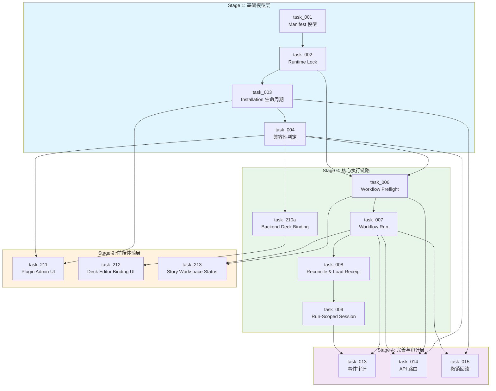

# Stage Plan: Voice Decks × Ink Dream Deck Plugin 与 ClaudeAgent 集成

> **Stage Issue**: SUO-244
> **关联设计稿**: `docs/design/deck-plugin-voice-ink-dream-integration.md` (SUO-218 / SUO-236)
> **关联 Issue 清单**: `docs/issue/ISSUES_deck-plugin-voice-ink-dream-integration.md` (SUO-237)
> **生成 Agent**: StagePlanner
> **生成日期**: 2026-08-01
> **状态**: completed (Stage 规划已完成；SUO-247 task 层准入修复已完成；SUO-290 Stage 状态同步与冲突消除已完成；SUO-303 Stage 2 Wave 2 同步与 task_007 readiness 复核已完成；Stage 1 Gate 已通过；Stage 2 Wave 1 已完成；Stage 2 Wave 2 ready_to_execute)

---

## 1. 关联设计稿

- **主设计稿**: `docs/design/deck-plugin-voice-ink-dream-integration.md` (SUO-218 / SUO-236)
- **补充设计稿**: `docs/design/plugin-remote-interaction.md`
- **背景设计稿**: `docs/design/story-workspace/story-workspace-prd.md`
- **背景设计稿**: `docs/design/story-workspace/story-workspace-layout-design.md`
- **背景设计稿**: `docs/design/deck/deck-integration-delta.md`（原 `story-workspace/story-workspace-deck-integration-delta.md` 已迁移）
- **补充设计稿**: `docs/design/deck/design_002_deck-plugin-decision-gates.md`
- **参考设计稿**: `docs/design/deck-claude-agent.md`

## 2. 任务输入来源

本 Stage 计划消费以下 15 份 task 文档：

### Shared / Frontend Tasks（4 份）
| Task 文档 | 源 Issue | 类型 | 主责 Agent |
|---|---|---|---|
| `task_210_shared_deck_plugin_binding.md` | DECK-005 | shared（合同索引，不可执行） | TaskDesignAgent 设计 → **不可 checkout** |
| `task_210a_backend_deck_plugin_binding.md` | DECK-005 | backend | **ExecTaskAgent**（`backend` 仅为 domain） |
| `task_211_frontend_plugin_admin_ui.md` | DECK-010 | frontend | **ExecTaskAgent**（`frontend` 仅为 domain） |
| `task_212_frontend_deck_editor_plugin_binding.md` | DECK-011 | frontend | **ExecTaskAgent**（`frontend` 仅为 domain） |
| `task_213_frontend_story_workspace_status.md` | DECK-012 | frontend | **ExecTaskAgent**（`frontend` 仅为 domain） |

> **注意**: 
> - `task_210_shared_deck_plugin_binding.md` 为 **shared 合同索引**，只冻结跨端字段/API/依赖，**禁止 checkout、禁止直接执行**。
> - 后端执行入口为 `task_210a_backend_deck_plugin_binding.md`（Stage 2 Wave 1，**ExecTaskAgent** 独立 checkout）。
> - 前端执行入口为 `task_212_frontend_deck_editor_plugin_binding.md`（Stage 3 Wave 1，**ExecTaskAgent** 独立 checkout，依赖 `task_210a` fixture 冻结）。
> - Stage 文档中的 `task_210` 节点在执行层面映射为后端 `task_210a`；前端继续按既有 `task_212` 节点执行。

### Backend Tasks（11 份）
| Task 文档 | 源 Issue | 类型 | 主责 Agent |
|---|---|---|---|
| `task_deck_001_backend_manifest-model.md` | DECK-001 | backend | **ExecTaskAgent**（`backend` 仅为 domain） |
| `task_deck_002_backend_runtime-lock.md` | DECK-002 | backend | **ExecTaskAgent**（`backend` 仅为 domain） |
| `task_deck_003_backend_installation-lifecycle.md` | DECK-003 | backend | **ExecTaskAgent**（`backend` 仅为 domain） |
| `task_deck_004_backend_compatibility-capability.md` | DECK-004 | backend | **ExecTaskAgent**（`backend` 仅为 domain） |
| `task_deck_006_backend_workflow-preflight.md` | DECK-006 | backend | **ExecTaskAgent**（`backend` 仅为 domain） |
| `task_deck_007_backend_workflow-run.md` | DECK-007 | backend | **ExecTaskAgent**（`backend` 仅为 domain） |
| `task_deck_008_backend_reconcile-load-receipt.md` | DECK-008 | backend | **ExecTaskAgent**（`backend` 仅为 domain） |
| `task_deck_009_backend_run-scoped-session.md` | DECK-009 | backend | **ExecTaskAgent**（`backend` 仅为 domain） |
| `task_deck_013_backend_events-audit.md` | DECK-013 | backend | **ExecTaskAgent**（`backend` 仅为 domain） |
| `task_deck_014_backend_api-error-codes.md` | DECK-014 | backend | **ExecTaskAgent**（`backend` 仅为 domain） |
| `task_deck_015_backend_revocation-rollback.md` | DECK-015 | backend | **ExecTaskAgent**（`backend` 仅为 domain） |

> **注意**: 
> - DECK-007 对应 `task_deck_007_backend_workflow-run.md`（Workflow Run 创建、状态与幂等重试）。
> - DECK-009 对应 `task_deck_009_backend_run-scoped-session.md`（Run-Scoped Session 与远程交互限制）。
> - 两份 task 文件名与内容一致，无命名偏差。

---

## 3. 阶段任务表

### 3.1 依赖 DAG 总览

```
Stage 1: 基础模型层（Foundation）
┌─────────────────────────────────────────────────────────────┐
│  task_001 Manifest 模型 ──→ task_002 Runtime Lock ──→ task_003 Installation │
│       │                        │                          │  
│       └────────────────────────┴──────────────────────────┘
│                                    │
│                                    ▼
│                            task_004 兼容性判定
└─────────────────────────────────────────────────────────────┘
                              │
                              ▼
Stage 2: 核心执行链路（Core Execution）
┌─────────────────────────────────────────────────────────────┐
│  task_210a Backend Binding ──→ task_006 Preflight ──→ task_007 Workflow Run │
│       │                                                    │
│       │  task_212 Deck Editor UI（Stage 3，依赖 task_210a）   │
│       │  task_211 Plugin Admin UI（Stage 3，依赖 task_003+004）│
│       │                                                    ▼
│       └──────────────────────────────────────────────→ task_008 Reconcile
│                                                             │
│                                                             ▼
│                                                       task_009 Session
└─────────────────────────────────────────────────────────────┘
                              │
                              ▼
Stage 3: 前端体验层（Frontend Experience）
┌─────────────────────────────────────────────────────────────┐
│  task_211 Plugin Admin UI (并行)                             │
│  task_212 Deck Editor Binding UI (并行，依赖 task_210a)       │
│  task_213 Story Workspace Status (并行)                      │
└─────────────────────────────────────────────────────────────┘
                              │
                              ▼
Stage 4: 完善与审计层（Completeness & Audit）
┌─────────────────────────────────────────────────────────────┐
│  task_013 事件审计 (并行)                                     │
│  task_014 API 路由 (并行)                                     │
│  task_015 撤销回滚 (并行)                                     │
└─────────────────────────────────────────────────────────────┘
```

> **Shared Binding 拆分说明**（SUO-279 结论）：
> - `task_210_shared_deck_plugin_binding.md` 为**合同索引**，不承载执行；禁止 checkout。
> - 后端执行单元：`task_210a_backend_deck_plugin_binding.md`（Stage 2 Wave 1）。
> - 前端执行单元：`task_212_frontend_deck_editor_plugin_binding.md`（Stage 3 Wave 1）。
> - `task_210a` 与 `task_006` 在 Stage 1 Gate 通过后均可启动，但各自依赖不同前置链（task_210a 需 task_001+003+004；task_006 需 task_002+004）。

### 3.2 阶段任务表

| 阶段 | 任务 | 产出 | 依赖 | 风险 |
| --- | --- | --- | --- | --- |
| **Stage 1** 基础模型 | task_001 Manifest 模型 | `DeckPluginManifestV1` schema、校验器、发布状态机、`deck_plugin_releases` 表 | 无 | manifest 模型不稳定导致下游返工 |
| **Stage 1** 基础模型 | task_002 Runtime Lock | `DeckRuntimePluginLock` 模型、版本约束解析器、不可变性校验、`deck_runtime_plugin_locks` 表 | task_001 | marketplace 解析器接口不稳定 |
| **Stage 1** 基础模型 | task_003 Installation 生命周期 | `DeckPluginInstallation` 模型、状态机、升级双版本切换、`deck_plugin_installations` 表 | task_001, task_002 | 与 Paperclip PluginStatus 混淆 |
| **Stage 1** 基础模型 | task_004 兼容性判定 | 8 步兼容性判定链、能力交集计算、`CapabilityDiff` 审批 | task_001, task_003 | 兼容性判定与前端判定不一致 |
| **Stage 2** 核心执行 | task_210a Backend Deck Binding | `DeckPluginBinding` 模型、API 合同、selection validation、`expected_binding_revision` 乐观锁 | task_001, task_003, task_004 | 后端 API 合同未冻结 |
| **Stage 2** 核心执行 | task_006 Workflow Preflight | `WorkflowPreflight` 模型、8 步 preflight 链、`deck_runtime_snapshot` 引用、preflight token | task_002, task_004 | Deck runtime snapshot 创建失败阻塞运行 |
| **Stage 2** 核心执行 | task_007 Workflow Run | `WorkflowRun` 模型、状态机、幂等启动、重试链 | task_006 | session 创建超时导致 queued 滞留 |
| **Stage 2** 核心执行 | task_008 Reconcile & Load Receipt | 三维状态模型、headless reconcile、CLI 备选、物化幂等、`runtime_load_receipts` 表 | task_002, task_006 | settings 写入失败导致无限重试 |
| **Stage 2** 核心执行 | task_009 Run-Scoped Session | `AgentSession` 模型、session 隔离、热刷新限制、`source_voice_thread_id` | task_008 | 现有 SSE 服务不兼容 run-scoped settings |
| **Stage 3** 前端体验 | task_211 Plugin Admin UI | `PluginAdminPage/List/Detail`、三维状态展示、安装/升级/卸载交互 | task_003, task_004 | Paperclip 基线 alpha 状态 |
| **Stage 3** 前端体验 | task_212 Deck Editor Binding UI | `DeckPluginBindingCard/VersionPicker`、版本选择、并发冲突、生效提示 | task_210a | DeckEditorModal 结构紧凑 |
| **Stage 3** 前端体验 | task_213 Story Workspace Status | `WorkflowContextBar/PreflightProgress/RunStatus`、错误恢复、来源追溯 | task_006, task_007 | SSE 事件基础设施不稳定 |
| **Stage 4** 完善审计 | task_013 事件审计 | `EventEnvelope`、10 类规范事件、去重/顺序保证、`events` 表 | task_007, task_009 | 事件丢失导致审计不完整 |
| **Stage 4** 完善审计 | task_014 API 路由 | 管理端/Deck/Story Workspace 路由、25+ 错误码注册表 | task_004, task_006, task_007 | 物理服务拆分后路由变更 |
| **Stage 4** 完善审计 | task_015 撤销回滚 | 行为矩阵、撤销服务、降级规则、回滚管理 | task_003, task_007 | 强制取消活动 run 导致数据丢失 |

### 3.3 关键路径

```text
task_001 ──→ task_002 ──→ task_003 ──→ task_004 ──→ task_210a ──→ task_006 ──→ task_007 ──→ task_008 ──→ task_009
  │           │            │            │            │            │            │            │            │
  └───────────┴────────────┴────────────┴────────────┴────────────┴────────────┴────────────┴────────────┘
                                     关键路径（最长依赖链）
```

**关键路径长度**: 9 个 task，全部为串行依赖（task_210a 替代原 task_210 作为后端 binding 执行节点）。

**关键路径说明**:
- 从 Manifest 模型到 Run-Scoped Session 的端到端链路必须按序完成
- 任何一环延迟都会直接推迟最终可运行验证
- 前端 task（Stage 3）和审计 task（Stage 4）可与关键路径并行

---

## 4. 当前进度

| 阶段 | 任务 | 状态 |
| --- | --- | --- |
| Stage 1 | task_001 Manifest 模型 | **ready_to_execute** |
| Stage 1 | task_002 Runtime Lock | blocked (依赖 task_001) |
| Stage 1 | task_003 Installation 生命周期 | blocked (依赖 task_001, task_002) |
| Stage 1 | task_004 兼容性判定 | blocked (依赖 task_001, task_003) |
| Stage 2 | task_210a Backend Deck Binding | **done** ([SUO-296](/SUO/issues/SUO-296)) |
| Stage 2 | task_006 Workflow Preflight | **done** ([SUO-281](/SUO/issues/SUO-281)) |
| Stage 2 | task_007 Workflow Run | **ready_to_execute**（本 Issue 复核后） |
| Stage 2 | task_008 Reconcile & Load Receipt | blocked (依赖 task_007) |
| Stage 2 | task_009 Run-Scoped Session | blocked (依赖 task_008) |
| Stage 3 | task_211 Plugin Admin UI | blocked (依赖 Stage 2 Gate) |
| Stage 3 | task_212 Deck Editor Binding UI | blocked (依赖 task_210a) |
| Stage 3 | task_213 Story Workspace Status | blocked (依赖 Stage 2 Gate) |
| Stage 4 | task_013 事件审计 | blocked (依赖 Stage 2 Gate) |
| Stage 4 | task_014 API 路由 | blocked (依赖 Stage 2 Gate) |
| Stage 4 | task_015 撤销回滚 | blocked (依赖 Stage 2 Gate) |

> **说明**: 
> - task_001 满足执行准入条件（无依赖、允许/禁止范围明确、验收标准清晰）。
> - task_210a、task_006 已通过 readiness 检查（§7.3），待 Stage 1 Gate 通过后并行启动。
> - 其余 12 个 task 均因依赖未满足而阻塞，但准入条件本身已齐备（[SUO-247](/SUO/issues/SUO-247) 已完成 11 份 backend task 的允许/禁止范围补充，4 份 shared/frontend task 原已具备）。
> - **Shared Binding 拆分后**: `task_210` 不再作为可执行节点；后端执行入口为 `task_210a`，前端为 `task_212`。
> - 首个可执行 Wave 为 **Stage 1 Wave 1: task_001 Manifest 模型**。
> - Stage 2 Wave 1 为 **task_210a ∥ task_006**（Stage 1 Gate 通过后并行启动）。

---

## 5. 各 Stage 详细规划

### Stage 1: 基础模型层（Foundation）

**准入条件**: 无（Stage 1 为起始阶段）

**并行策略**:
- task_001 无依赖，可立即启动
- task_002 依赖 task_001，串行
- task_003 依赖 task_001 + task_002，串行
- task_004 依赖 task_001 + task_003，可与 task_003 部分并行（task_003 的模型定义完成后即可开始 task_004 的接口设计）

**串行约束**:
```
task_001 ──→ task_002 ──→ task_003 ──→ task_004
```

**阶段产出 Checklist**:
- [ ] `DeckPluginManifestV1` schema 定义完整
- [ ] `deck_plugin_releases` 表创建幂等
- [ ] `DeckRuntimePluginLock` 模型与不可变性校验
- [ ] `deck_runtime_plugin_locks` 表创建
- [ ] `DeckPluginInstallation` 状态机完整
- [ ] `deck_plugin_installations` 表创建
- [ ] 8 步兼容性判定链实现
- [ ] 能力交集计算正确

**Gate 条件（进入 Stage 2）**:
1. task_001 ~ task_004 全部完成标志达成
2. 数据库表创建通过单元测试
3. manifest 校验器覆盖合法/非法用例
4. 兼容性判定返回结构化 reason code

**回滚顺序**:
```
task_004 → task_003 → task_002 → task_001
```

**允许/禁止修改范围**:
| Task | 允许修改 | 禁止修改 |
|---|---|---|
| task_001 | `backend/models/deck_plugin.py`（新建）、manifest schema、校验器、`deck_plugin_releases` 表迁移 | 现有 `claude_code_plugin` 模型、Paperclip Plugin 表结构、前端代码 |
| task_002 | `backend/services/deck_plugin/lock_generator.py`（新建）、版本约束解析器、`deck_runtime_plugin_locks` 表迁移 | marketplace 接口实现（仅定义抽象接口）、现有 runtime 加载逻辑 |
| task_003 | `backend/models/deck_plugin.py`（追加 Installation 模型）、状态机实现、`deck_plugin_installations` 表迁移 | Claude Code Plugin cache 逻辑、Paperclip PluginStatus 状态机 |
| task_004 | `backend/services/deck_plugin/compatibility_service.py`（新建）、兼容性判定链、能力交集计算 | 前端兼容性判定逻辑、现有权限系统核心代码 |

---

### Stage 2: 核心执行链路（Core Execution）

**准入条件**: Stage 1 全部完成

**并行策略**:
```
                    ┌─→ task_210a ──→ task_212 (Stage 3)
                    │
task_004 ──→ task_006 ──→ task_007 ──→ task_008 ──→ task_009
                    │
                    └─→ task_211 (Stage 3，依赖 task_003 + task_004)
```

**串行约束**:
- task_006 → task_007 → task_008 → task_009 必须串行
- task_210a 依赖 task_004，可与 task_006 **在 Stage 1 Gate 通过后并行启动**
- task_212 依赖 task_210a（后端 fixture 冻结后），进入 Stage 3
- task_211 依赖 task_003 + task_004，可与 task_006 并行（管理端与 binding 无关）

> **task_210a vs task_006 并行说明**:
> - task_210a 前置: task_001 + task_003 + task_004
> - task_006 前置: task_002 + task_004
> - 两者共享 task_004 作为直接前置，但各自还有不同的间接前置链
> - **Stage 1 Gate 通过后**，两者均可启动，视为 Stage 2 Wave 1 并行组
> - task_210a 完成后冻结后端 fixture，task_212 方可进入 Stage 3 Wave 1

**阶段产出 Checklist**:
- [ ] `DeckPluginBinding` 模型与 API 合同冻结
- [ ] `expected_binding_revision` 乐观锁工作
- [ ] `WorkflowPreflight` 8 步检查链完整
- [ ] `preflight_token` 签发与验证
- [ ] `WorkflowRun` 状态机只允许规范流转
- [ ] 幂等启动与重试链正确
- [ ] headless reconcile 主路径实现
- [ ] 三维状态独立记录
- [ ] `AgentSession` 隔离与热刷新限制

**Gate 条件（进入 Stage 3）**:
1. task_006 ~ task_009 全部完成标志达成
2. preflight 端到端通过（含失败路径）
3. Workflow Run 状态流转测试通过
4. reconcile 成功/失败场景测试通过
5. session 隔离测试通过

**回滚顺序**:
```
task_009 → task_008 → task_007 → task_006 → task_210a
```

**允许/禁止修改范围**:
| Task | 允许修改 | 禁止修改 |
|---|---|---|
| task_210a | `backend/models/deck_plugin.py`（追加 Binding 模型）、`backend/services/deck_plugin/binding_service.py`（新建）、`backend/services/deck_plugin/selection_validation_service.py`（新建）、`backend/routers/deck_plugin_binding.py`（新建）、`backend/database.py`（binding 表）、`backend/tests/test_deck_plugin_binding.py`（新建） | 前端 binding UI 组件（`task_212` 专属）、后端通用错误码注册表（`task_014` 专属）、DECK-001/003/004/006/007 内部实现 |
| task_006 | `backend/models/workflow_preflight.py`（新建）、`backend/services/workflow/preflight_service.py`（新建）、`workflow_preflights` 表迁移 | 现有 ClaudeAgent session 创建逻辑、前端 preflight UI |
| task_007 | `backend/models/workflow_run.py`（新建）、Workflow Run 状态机、幂等启动逻辑 | 现有 SSE 服务实现、前端运行状态展示 |
| task_008 | `backend/models/runtime_plugin.py`（新建）、reconcile 服务、`runtime_load_receipts` 表迁移 | 现有 Claude Code CLI 核心逻辑、marketplace 下载实现 |
| task_009 | `backend/models/agent_session.py`（新建/扩展）、session 管理器、run-scoped settings 生成 | 现有 SSE 服务端点协议、前端 chat 组件 |

---

### Stage 3: 前端体验层（Frontend Experience）

**准入条件**: Stage 2 核心链路完成（task_006 ~ task_009）

**并行策略**:
- task_211、task_212、task_213 三者完全并行
- 各自依赖的后端能力已在 Stage 2 完成

**串行约束**: 无（Stage 3 内全并行）

**阶段产出 Checklist**:
- [ ] Plugin Admin 列表/详情页实现
- [ ] 三维状态标签正确渲染
- [ ] Deck Editor 插件选择区集成
- [ ] 版本列表展示所有规范状态
- [ ] `BINDING_REVISION_CONFLICT` 前端处理
- [ ] Story Workspace 工作流上下文条
- [ ] Preflight 进度 8 步展示
- [ ] 错误恢复卡片与重试交互
- [ ] 来源追溯标签

**Gate 条件（进入 Stage 4）**:
1. 全部前端组件渲染测试通过
2. 前后端 API 合同对齐验证
3. 错误码映射为用户可理解文案
4. E2E 测试覆盖安装 → 选择 → Preflight → 运行 → 审阅流程

**回滚顺序**:
```
task_213 → task_212 → task_211（可独立回滚）
```

**允许/禁止修改范围**:
| Task | 允许修改 | 禁止修改 |
|---|---|---|
| task_211 | 前端 Plugin Admin 页面/组件、三维状态展示 UI、安装/升级/卸载交互 | 后端 installation 状态机、后端 API 路由实现、Claude Code Plugin 管理逻辑 |
| task_212 | Deck Editor 插件选择区 UI、`DeckPluginBindingCard`/`VersionPicker` 组件、版本选择交互 | 后端 binding 保存逻辑、`expected_binding_revision` 乐观锁实现、Preflight/Run 服务 |
| task_213 | Story Workspace 工作流上下文条、`WorkflowContextBar` 组件、Preflight 进度展示、错误恢复 UI | 后端 Workflow Run 状态机、SSE 事件基础设施、ClaudeAgent session 管理 |

---

### Stage 4: 完善与审计层（Completeness & Audit）

**准入条件**: Stage 2 核心链路完成（task_007 + task_009 至少）

**并行策略**:
- task_013、task_014、task_015 三者完全并行
- 可与 Stage 3 前端任务并行推进

**串行约束**: 无（Stage 4 内全并行）

**阶段产出 Checklist**:
- [ ] 统一事件 envelope 结构
- [ ] 10 类规范事件覆盖
- [ ] 事件去重与顺序保证
- [ ] 脱敏规则自动化检查
- [ ] 管理端/Deck/Story Workspace API 路由完整
- [ ] 25+ 错误码注册表
- [ ] 错误响应安全（无堆栈/secret）
- [ ] 禁用/撤销/升级行为矩阵
- [ ] 降级规则（仅在 manifest 声明时允许）
- [ ] 回滚路径完整

**最终 Gate 条件（Stage 完成）**:
1. 全部 15 个 task 完成标志达成
2. 端到端集成测试通过
3. 决策单 DECK-016 ~ DECK-020 状态明确（允许/条件/阻塞）
4. 回滚策略验证通过

**回滚顺序**:
```
task_015 → task_014 → task_013（可独立回滚）
```

**允许/禁止修改范围**:
| Task | 允许修改 | 禁止修改 |
|---|---|---|
| task_013 | `backend/models/events.py`（新建）、事件发射器、`events` 表迁移、事件 envelope 结构 | 现有日志系统核心、前端事件消费逻辑、非 Deck Plugin 相关事件类型 |
| task_014 | `backend/routers/deck_plugins.py`（新建）、`backend/routers/voice_decks.py`（扩展）、错误码注册表 | 现有路由中间件核心、认证/授权系统、前端路由配置 |
| task_015 | `backend/services/deck_plugin/revocation_service.py`（新建）、行为矩阵实现、降级规则 | 现有 ClaudeAgent 强制终止逻辑（仅调用接口）、数据备份/恢复系统 |

---

## 6. DECK-016 ~ DECK-020 冻结条件与 Gate 放置

> **状态来源**: `docs/design/deck/design_002_deck-plugin-decision-gates.md`（`DECK-DESIGN-002`）为当前 canonical 决策 Gate 附录。
> **优先级**: 设计附录结论优先于本 Stage 计划中的历史默认假设。

| 决策单 | 标题 | 当前状态 | 影响 Stage | Gate 放置 | 冻结条件 |
|---|---|---|---|---|---|
| DECK-016 | 物理服务边界 | **`frozen`**（[SUO-253](/SUO/issues/SUO-253) CEO `approve`） | Stage 1~4 | **Stage 2 Gate** | 三域单写已冻结；物理拆分只能替换 transport/deployment adapter |
| DECK-017 | marketplace 签名/digest | **`conditional_frozen`** | Stage 1, 2, 4 | **Stage 4 Gate** | 非生产可限域推进；生产 Gate 在验证/恢复能力落地前为**阻断** |
| DECK-018 | 多节点 runtime 分发 | **`frozen`**（[SUO-253](/SUO/issues/SUO-253) CEO `approve`） | Stage 2, 3, 4 | **Stage 2 Gate** | 设计已冻结；仅单节点 `local_persistent` 限域通过，多节点/临时 runtime rollout 仍**阻断** |
| DECK-019 | 安全撤销是否强制终止 | **`frozen`**（[SUO-267](/SUO/issues/SUO-267) `approve`） | Stage 2, 4 | **Stage 4 Gate** | 设计已冻结；Stage 4 production Gate 仍需 §4.4.9 真实 11 项 evidence pack、独立 reviewer 签署及 rollout 审批 |
| DECK-020 | Voice chat → run UX | **`frozen`**（[SUO-254](/SUO/issues/SUO-254) CEO `approve`） | Stage 2, 3 | **Stage 3 Gate** | UI/文案 Gate 已通过；下游 E2E/发布验收仍须留证 |

**说明**:
- `frozen` 表示设计方案、服务边界和最小合同已经完成裁决，下游不得改成另一架构。
- `conditional_frozen` 表示方案已确定但仍等待对应 owner 审批；两者都不自动表示 production-ready 或运行 rollout 已放行。
- 4/5 项决策单已由 CEO/安全裁决冻结；仅 `DECK-017` 仍为 `conditional_frozen`。
- 默认假设下可推进实现，但不得把默认假设误写为已决策。
- StagePlanner 不阻塞实现推进，但在各 Stage Gate 中标注未满足项。
- CEOOrchestrator 负责路由 owner 并冻结剩余决策。

---

## 7. 逐 Task Execute-Readiness 矩阵

以下矩阵供 CEOOrchestrator 在 Stage 完成后独立执行 9 项准入检查。

### 7.1 九项 Readiness 检查（通用）

| # | 检查项 | 涉及 Task | 验证方式 | 通过标准 |
|---|---|---|---|---|
| 1 | **Schema 完整性** | task_001, task_002, task_003 | 单元测试 | manifest/lock/installation 模型字段覆盖设计稿 §5.1, §5.3, §6.1 |
| 2 | **命名隔离** | 全部 15 个 task | 代码审查 + 静态检查 | 无混用 `deck_plugin_*` / `claude_code_plugin_*` / `plugin_id` 无前缀 |
| 3 | **状态机合法性** | task_001, task_003, task_007, task_009 | 单元测试 | 只允许规范流转；终态不可复活 |
| 4 | **兼容性判定链** | task_004, task_006 | 单元测试 | 8 步判定顺序固定，失败即停止，返回结构化 reason code |
| 5 | **Preflight 权威** | task_006 | 集成测试 | preflight 失败不创建 ClaudeAgent session；不创建伪运行记录 |
| 6 | **Reconcile 主路径** | task_008 | 集成测试 | headless reconcile 在第一条 query 前完成；CLI 仅为备选 |
| 7 | **Session 隔离** | task_009 | 单元测试 | run-scoped settings 仅含锁定插件；热刷新限制生效 |
| 8 | **幂等重试** | task_007 | 单元测试 | 同 key 同语义返回原 run；改选/升级属于新运行 |
| 9 | **事件审计** | task_013 | 单元测试 | 10 类事件覆盖；去重/顺序保证；payload 脱敏 |

### 7.2 Shared Binding 拆分后新增 Readiness 检查（SUO-280）

| # | 检查项 | 涉及 Task | 验证方式 | 通过标准 |
|---|---|---|---|---|
| 10 | **Binding 模型完整性** | task_210a | 单元测试 | `DeckPluginBinding` 字段覆盖 task_210 §6 合同；revision 单调递增；`applied_to=next_run` 固定 |
| 11 | **乐观锁正确性** | task_210a | 单元测试 | 并发保存仅一个成功；冲突返回 409 `BINDING_REVISION_CONFLICT`；无静默覆盖 |
| 12 | **Selection Validation 边界** | task_210a | 单元测试 | 只编排权威服务，不复制 DECK-003/004 判定逻辑；失败不创建 revision |
| 13 | **后端 API 合同冻结** | task_210a | 代码审查 + fixture | 四个 endpoint 路径、请求/响应字段、错误码与 task_210 §6 一致 |
| 14 | **前端消费唯一性** | task_212 | 代码审查 + 静态检查 | 无客户端 selection validation 副本；无权限/兼容性裁决；只消费 task_210a 冻结合同 |
| 15 | **跨端合同一致性** | task_210a + task_212 | 集成测试 | 同一 `deck_plugin_binding_id`、字段兼容、`next_run` 语义一致；无第二份 binding 存储 |
| 16 | **Single-Assignee 合规** | task_210a, task_212 | 代码审查 | 后端/前端各自独立 checkout；无共用 Issue；task_210 未授权实现代码 |

### 7.3 新执行单元 Readiness 逐项判定

#### task_210a_backend_deck_plugin_binding

| 检查项 | 状态 | 说明 |
|---|---|---|
| Schema 完整性（#1 延伸） | ✅ 通过 | `DeckPluginBinding` 模型字段已在 task_210a §4.1 定义完整 |
| 命名隔离（#2） | ✅ 通过 | 全部使用 `deck_plugin_*` 前缀；无 `claude_code_plugin_*` 混用 |
| 状态机合法性（#3 延伸） | ✅ 通过 | `active/stale` 状态简单；revision 单调递增已定义 |
| 乐观锁正确性（#11） | ✅ 通过 | `expected_binding_revision` 原子比较已定义；409 冲突响应已定义 |
| Selection Validation 边界（#12） | ✅ 通过 | 明确只编排权威服务，禁止复制 DECK-003/004 判定逻辑 |
| 后端 API 合同冻结（#13） | ✅ 通过 | 四个 endpoint、请求/响应字段、错误码与 task_210 §6 一致 |
| Single-Assignee 合规（#16） | ✅ 通过 | **ExecTaskAgent** 独立 checkout；task_210 未授权实现 |
| **综合判定** | **🟢 execute-ready-after-dependencies** | 待 Stage 1 Gate 通过后启动 |

#### task_212_frontend_deck_editor_plugin_binding

| 检查项 | 状态 | 说明 |
|---|---|---|
| 前端消费唯一性（#14） | ✅ 通过 | 明确禁止客户端 selection validation、权限/兼容性裁决副本 |
| 跨端合同一致性（#15） | ⏳ 待验证 | 需 task_210a fixture 冻结后联调验证 |
| Single-Assignee 合规（#16） | ✅ 通过 | ExecTaskAgent 独立 checkout；task_210 未授权实现 |
| **综合判定** | **🟡 execute-ready-after-task_210a** | 待 task_210a 后端 fixture 冻结后启动 |

---

## 8. 风险与缓冲策略

| 风险 | 等级 | 影响 Stage | 缓冲策略 |
|---|---|---|---|
| manifest 模型不稳定导致下游返工 | 高 | Stage 1~2 | Stage 1 增加设计评审 gate；manifest 冻结前不推进 task_002 |
| marketplace 解析器接口未就绪 | 高 | Stage 1~2 | 定义抽象接口 `MarketplaceResolver`；使用 mock 推进 unit test |
| 现有 Claude Agent SSE 服务不兼容 run-scoped settings | 高 | Stage 2 | 早期与现有服务协调；增量扩展而非替换 |
| DECK-016 物理服务边界延迟 | 中 | Stage 2~4 | 按逻辑合同实现；gateway 层预留适配空间 |
| DECK-017 digest 算法未标准化 | 中 | Stage 1, 4 | 默认使用 sha256；决策单确认后统一替换 |
| 前端与后端 API 合同不同步 | 中 | Stage 2~3 | shared task (task_210) 由 TaskDesignAgent 统一设计 |
| 事件表无限增长 | 中 | Stage 4 | 预留留存策略接口；分区/归档方案待 DECK-017 确认 |
| 多节点 readiness 误报 | 高 | Stage 2 | 默认按单节点 persistent 实现；readiness 接口预留 environment 参数 |

---

## 9. Mermaid 阶段图



---

## 10. Single-Assignee 与 Checkout 语义

| Task | 唯一 Owner | Checkout 语义 |
|---|---|---|
| task_001 | ExecTaskAgent | 独立 checkout，完成后释放 |
| task_002 | ExecTaskAgent | 依赖 task_001 完成信号 |
| task_003 | ExecTaskAgent | 依赖 task_002 完成信号 |
| task_004 | ExecTaskAgent | 依赖 task_003 完成信号 |
| **task_210** | **TaskDesignAgent（合同索引，禁止 checkout）** | **Shared 合同索引；执行已拆分至 task_210a / task_212** |
| task_210a | **ExecTaskAgent**（`backend` 仅为 domain，非 Agent 名称） | 依赖 Stage 1 Gate 通过；独立 checkout；single-assignee |
| task_006 | ExecTaskAgent | 依赖 Stage 1 Gate 通过 |
| task_007 | ExecTaskAgent | 依赖 task_006 完成信号 |
| task_008 | ExecTaskAgent | 依赖 task_007 完成信号 |
| task_009 | ExecTaskAgent | 依赖 task_008 完成信号 |
| task_211 | ExecTaskAgent | 依赖 Stage 2 Gate 通过 |
| task_212 | ExecTaskAgent | 依赖 task_210a 完成信号（后端 fixture 冻结后） |
| task_213 | ExecTaskAgent | 依赖 Stage 2 Gate 通过 |
| task_013 | ExecTaskAgent | 依赖 Stage 2 Gate 通过 |
| task_014 | ExecTaskAgent | 依赖 Stage 2 Gate 通过 |
| task_015 | ExecTaskAgent | 依赖 Stage 2 Gate 通过 |

**禁止行为**:
- 同一 task 不得同时被多个 Agent checkout
- **task_210_shared_deck_plugin_binding.md 禁止 checkout、禁止直接执行**；后端执行入口为 task_210a，前端为 task_212
- ExecTaskAgent 按 domain（backend/frontend）独立 checkout 各 task，不得共用 checkout
- 不得绕过 Issue 直接指派 ExecTaskAgent

---

## 11. 跨端合同冻结点

| 合同 | 冻结 Stage | 验证方式 | 未满足条件 |
|---|---|---|---|
| `DeckPluginManifestV1` schema | Stage 1 Gate | 单元测试 | 字段缺失或语义变更 |
| `DeckRuntimePluginLock` 不可变性 | Stage 1 Gate | 单元测试 | 同一 id+version 允许变更 |
| `DeckPluginBinding` API 合同 | Stage 2 Gate | 前后端集成测试 | 字段歧义或路径不一致 |
| `WorkflowPreflight` 8 步检查 | Stage 2 Gate | 集成测试 | 检查顺序或错误码不一致 |
| `WorkflowRun` 状态机 | Stage 2 Gate | 单元测试 | 非法状态流转 |
| `RuntimeLoadReceipt` 格式 | Stage 2 Gate | 单元测试 | 缺少 required 插件加载状态 |
| `EventEnvelope` 结构 | Stage 4 Gate | 单元测试 | payload 包含敏感信息 |
| API 错误码注册表 | Stage 4 Gate | 单元测试 | 错误码遗漏或恢复动作缺失 |

---

## 12. 最小验证建议

按设计稿 §18 验证建议，各 Stage 完成后执行对应验证：

| Stage | 验证层 | 覆盖内容 |
|---|---|---|
| Stage 1 | Schema/validator | 合法/非法 manifest、SemVer、重复标识、能力子集、可变 ref |
| Stage 1 | 兼容矩阵 | host/Agent/Claude Code/Deck/story schema 各维度边界 |
| Stage 1 | 发布不可变性 | 相同 id/version 不允许变更 manifest hash 或 runtime lock |
| Stage 2 | 远程交互 | 断言 `/plugin` 文本从不进入安装路径；新 marketplace 拒绝热 reload |
| Stage 2 | Preflight | Deck 配置、能力、digest、物化、加载任一失败均不发送第一条 Agent query |
| Stage 2 | 运行状态 | 只允许规范流转；终态不可复活；事件版本单调且重复事件可去重 |
| Stage 2 | 幂等/重试 | 重复 start 返回同 run；同 key 不同语义冲突；retry 新建 run |
| Stage 3 | Deck 选择 | 版本列表、permission/disabled/deprecated/pending 状态；binding revision 冲突 |
| Stage 3 | 下一次运行生效 | 运行中变更 binding 后当前 run 来源不变 |
| Stage 4 | 回滚/撤销 | 升级失败保留旧 ready；回滚只影响默认/binding；安全撤销产生取消审计 |
| Stage 4 | 权限/安全 | 能力扩张审批、来源 allowlist、secret 脱敏、UI 绕过尝试 |

---

## 13. 完成信号

本 Stage 计划完成时：

1. [x] stage 文档路径唯一且可读：`docs/stage/stage_deck-plugin-voice-ink-dream-integration.md`
2. [x] 15 个 task 全覆盖、无重复 owner、无漏依赖
3. [x] 关键路径、并行 wave、跨端合同冻结点明确
4. [x] 风险缓冲、回滚与最小验证均明确
5. [x] 逐 task execute-readiness 矩阵完整
6. [x] DECK-016 ~ DECK-020 冻结条件放入相应 stage gate
7. [x] 未满足 gate 和验证方式明确
8. [x] Issue 线程回填文档路径、摘要、未满足 gate（由 StagePlanner 在 Issue 评论中完成）
9. [x] Issue 标记为 done

---

## 14. 附录：Task 文档到 Stage 映射速查

| Task 文档 | Stage | Wave | 并行组 |
|---|---|---|---|
| `task_deck_001_backend_manifest-model.md` | Stage 1 | Wave 1 | 独立 |
| `task_deck_002_backend_runtime-lock.md` | Stage 1 | Wave 2 | 串行于 001 |
| `task_deck_003_backend_installation-lifecycle.md` | Stage 1 | Wave 3 | 串行于 002 |
| `task_deck_004_backend_compatibility-capability.md` | Stage 1 | Wave 4 | 串行于 003 |
| `task_210a_backend_deck_plugin_binding.md` | Stage 2 | Wave 1 | 与 task_006 并行（Stage 1 Gate 通过后） |
| `task_212_frontend_deck_editor_plugin_binding.md` | Stage 3 | Wave 1 | 与 task_211, task_213 并行（依赖 task_210a fixture 冻结） |
| `task_deck_007_backend_workflow-run.md` | Stage 2 | Wave 2 | 串行于 006 |
| `task_deck_008_backend_reconcile-load-receipt.md` | Stage 2 | Wave 3 | 串行于 007 |
| `task_deck_009_backend_run-scoped-session.md` | Stage 2 | Wave 4 | 串行于 008 |
| `task_211_frontend_plugin_admin_ui.md` | Stage 3 | Wave 1 | 与 task_212, task_213 并行 |
| `task_212_frontend_deck_editor_plugin_binding.md` | Stage 3 | Wave 1 | 与 task_211, task_213 并行 |
| `task_213_frontend_story_workspace_status.md` | Stage 3 | Wave 1 | 与 task_211, task_212 并行 |
| `task_deck_013_backend_events-audit.md` | Stage 4 | Wave 1 | 与 task_014, task_015 并行 |
| `task_deck_014_backend_api-error-codes.md` | Stage 4 | Wave 1 | 与 task_013, task_015 并行 |
| `task_deck_015_backend_revocation-rollback.md` | Stage 4 | Wave 1 | 与 task_013, task_014 并行 |

---

## 15. 首个可执行 Wave 结论（SUO-248 复核结果）

### 15.1 复核范围

本次复核（SUO-248）覆盖以下内容：
1. ✅ 15 份 task 路径逐一核对真实文件
2. ✅ task_007 映射修正（`task_deck_007_backend_workflow-run.md`）
3. ✅ Stage 文档状态更新（`draft` → `completed`）
4. ✅ 11 份 backend task 补充允许/禁止修改范围
5. ✅ 每个 task 的依赖、验收、测试与 Gate 重新核对

### 15.2 执行准入判定（SUO-280 增量修正后）

| Task | 依赖满足 | 允许/禁止范围明确 | 验收标准清晰 | 综合判定 |
|---|---|---|---|---|
| task_001 | ✅ 无依赖 | ✅ 已补充 | ✅ 设计稿 §5.1 明确 | **🟢 可执行** |
| task_002 | ❌ 需 task_001 | ✅ 已补充 | ✅ 设计稿 §5.3 明确 | 🔴 阻塞 |
| task_003 | ❌ 需 task_001, task_002 | ✅ 已补充 | ✅ 设计稿 §6.1 明确 | 🔴 阻塞 |
| task_004 | ❌ 需 task_001, task_003 | ✅ 已补充 | ✅ 设计稿 §6.3 明确 | 🔴 阻塞 |
| **task_210** | **N/A（合同索引，禁止执行）** | ✅ Shared 合同明确 | ✅ 合同索引完整 | **⚪ 不可 checkout** |
| task_210a | ✅ 已完成 ([SUO-296](/SUO/issues/SUO-296)) | ✅ 已补充 | ✅ task_210a §9 明确 | **🟢 done** |
| task_006 | ✅ 已完成 ([SUO-281](/SUO/issues/SUO-281)) | ✅ 已补充 | ✅ 设计稿 §10.1 明确 | **🟢 done** |
| **task_007** | **✅ 依赖已满足** | **✅ 已补充** | **✅ 设计稿 §11.1 明确** | **🟢 ready_to_execute** |
| task_008 | ❌ 需 task_007 | ✅ 已补充 | ✅ 设计稿 §7.1 明确 | 🔴 阻塞 |
| task_009 | ❌ 需 task_008 | ✅ 已补充 | ✅ 设计稿 §7.4 明确 | 🔴 阻塞 |
| task_211 | ❌ 需 Stage 2 Gate | ✅ 已补充 | ✅ 设计稿 §16.1 明确 | 🔴 阻塞 |
| task_212 | ❌ 需 task_210a | ✅ 已补充 | ✅ 设计稿 §9.1 明确 | 🔴 阻塞 |
| task_213 | ❌ 需 Stage 2 Gate | ✅ 已补充 | ✅ 设计稿 §13.1 明确 | 🔴 阻塞 |
| task_013 | ❌ 需 Stage 2 Gate | ✅ 已补充 | ✅ 设计稿 §15.1 明确 | 🔴 阻塞 |
| task_014 | ❌ 需 Stage 2 Gate | ✅ 已补充 | ✅ 设计稿 §12.1 明确 | 🔴 阻塞 |
| task_015 | ❌ 需 Stage 2 Gate | ✅ 已补充 | ✅ 设计稿 §12.2 明确 | 🔴 阻塞 |

> **Shared Binding 拆分结论**（SUO-279）：
> - `task_210_shared_deck_plugin_binding.md` 为**合同索引**，状态 `contract-only`，**禁止 checkout、禁止直接执行**。
> - 后端执行入口：`task_210a_backend_deck_plugin_binding.md`（ExecTaskAgent 独立 checkout）。
> - 前端执行入口：`task_212_frontend_deck_editor_plugin_binding.md`（ExecTaskAgent 独立 checkout，依赖 task_210a fixture 冻结）。
> - task_210a 与 task_006 在 Stage 1 Gate 通过后均可启动，但各自前置链不同（task_210a 需 task_001+003+004；task_006 需 task_002+004）。

### 15.3 首个可执行 Task 明确结论

**可立即执行的 Task**: `task_deck_001_backend_manifest-model.md` (DECK-001)

**Stage 1 Gate 通过后并行启动**: `task_210a_backend_deck_plugin_binding.md` ∥ `task_deck_006_backend_workflow-preflight.md`

**执行条件**:
- task_001: 无上游依赖；允许/禁止范围明确；验收标准清晰
- task_210a: Stage 1 Gate 通过（task_001 + task_003 + task_004 完成）；已通过 §7.3 readiness 检查
- task_006: Stage 1 Gate 通过（task_002 + task_004 完成）；已通过 §7.3 readiness 检查

**后续 Gate 链**:
```
task_001 完成 ──→ Stage 1 Wave 2 (task_002) ──→ Stage 1 Wave 3 (task_003) 
  ──→ Stage 1 Wave 4 (task_004) ──→ Stage 1 Gate 通过
  ──→ Stage 2 Wave 1 (task_210a ∥ task_006) ──→ Stage 2 Wave 2 (task_007)
  ──→ Stage 2 Wave 3 (task_008) ──→ Stage 2 Wave 4 (task_009)
  ──→ Stage 2 Gate 通过
  ──→ Stage 3 (task_211 ∥ task_212 ∥ task_213) + Stage 4 (task_013 ∥ task_014 ∥ task_015)
```

> **注意**: Stage 2 Wave 1 中 task_210a 与 task_006 在 Stage 1 Gate 通过后并行启动，但各自依赖不同前置链：
> - task_210a 前置: task_001 + task_003 + task_004
> - task_006 前置: task_002 + task_004

### 15.4 未满足 Gate 汇总

| Gate | 未满足条件 | 阻塞 Task 数 | 预计解锁条件 |
|---|---|---|---|
| Stage 1 Gate | ✅ 已通过（task_001~004 全部完成） | 0 | — |
| Stage 2 Gate | task_007~009 待完成 | 3 | task_009 完成信号 |
| Stage 3 Gate | 前端组件渲染测试 + API 合同对齐 | 3 | Stage 2 Gate + E2E 通过 |
| Stage 4 Gate | 事件审计 + 错误码 + 回滚验证 | 3 | Stage 2 Gate + 集成测试通过 |
| DECK-016 | ~~物理服务边界未冻结~~ → **`frozen`**（[SUO-253](/SUO/issues/SUO-253)） | — | 设计已冻结；运行 rollout 仍须遵守三域单写合同 |
| DECK-017 | digest 算法未标准化 | Stage 1, 4 | 安全 owner、marketplace/制品平台 owner、runtime owner 审批 |
| DECK-018 | ~~多节点 runtime 分发未确认~~ → **`frozen` 设计/限域通过**（[SUO-253](/SUO/issues/SUO-253)） | — | 设计已冻结；多节点/临时 runtime rollout 仍阻断，需 §5.2 证据与具名签署 |
| DECK-019 | ~~安全撤销是否强制终止未冻结~~ → **`frozen` 设计**（[SUO-267](/SUO/issues/SUO-267)） | — | 设计已冻结；Stage 4 production Gate 仍需 §4.4.9 真实 11 项 evidence pack、独立 reviewer 签署及 rollout 审批 |
| DECK-020 | ~~Voice chat → run UX 未冻结~~ → **`frozen` 设计**（[SUO-254](/SUO/issues/SUO-254)） | — | UI/文案 Gate 已通过；下游 E2E/发布验收仍须留证 |

### 15.5 重要约束

- **不得绕过 Issue 直接指派 ExecTaskAgent**: 按 Single-Assignee 规则，task_001 应由 ExecTaskAgent 通过正常 Issue checkout 流程领取
- **Shared task (task_210) 已拆分，禁止 checkout**: `task_210_shared_deck_plugin_binding.md` 为合同索引，不可执行；后端执行入口为 `task_210a`，前端为 `task_212`
- **决策单 DECK-016 ~ DECK-020 已按 `design_002` 附录更新状态**：DECK-016/018/019/020 已 `frozen`，DECK-017 仍为 `conditional_frozen`。默认假设下可推进实现，但不得把默认假设误写为已决策。

---

## 16. 修订记录

| 修订 | 日期 | 内容 | Issue |
|---|---|---|---|
| v1.0 | 2026-08-01 | 初始 Stage 计划生成 | SUO-244 |
| v1.1 | 2026-08-01 | 修正 task_007 文件名映射；更新状态为 completed；补充 15 个 task 允许/禁止范围；添加首个可执行 Wave 结论 | SUO-248 |
| v1.2 | 2026-08-01 | SUO-239 一致性核验：修正 3 处 desk→Deck 术语残留（`desk_config_snapshots`→`deck_runtime_snapshot` 引用、`Desk`→`Deck` 兼容矩阵、stage_story-workspace 旧 delta 路径） | SUO-239 |
| v1.3 | 2026-08-01 | SUO-239 一致性核验：按 `design_002` 附录更新 DECK-016~020 冻结状态（4/5 项已 frozen，DECK-017 仍为 conditional_frozen）；更新 §6 决策单表、§15.4 未满足 Gate 汇总、§15.5 约束说明 | SUO-239 |
| v1.4 | 2026-08-01 | SUO-280 增量修正：按 SUO-279 shared binding 拆分结论，将 `task_210` 映射为合同索引（禁止 checkout），新增 `task_210a` 作为后端唯一执行单元；更新 DAG、阶段任务表、当前进度、关键路径、Mermaid 图、Single-Assignee 表、映射速查表、执行准入判定；明确 task_210a 与 task_006 的并行边界（Stage 1 Gate 通过后启动，各自前置链不同）；task_212 依赖从 task_210 修正为 task_210a | SUO-280 |
| v1.5 | 2026-08-01 | SUO-285 统一执行路由：将全部 15 个可执行 task 的 checkout/assignee 从 `BackendTaskAgent`/`FrontendTaskAgent` 统一修正为 `ExecTaskAgent`（backend/frontend 仅为 domain 类型，非 Agent 名称）；更新 §2 任务输入来源表、§7.3 readiness 判定、§10 Single-Assignee 表、§15.2/15.5 约束说明；`git diff --check` 通过；task_210a 九项 readiness 全部通过，恢复 `ready_to_execute` | SUO-285 |
| v1.7 | 2026-08-01 | SUO-303 Stage 2 Wave 2 同步：task_006/task_210a 标记为 done；task_007 标记为 ready_to_execute；更新 Stage 1 Gate 状态为已通过；更新 §4/§15.2/§17.5/§17.6/§17.7；新增 §17.8 task_007 readiness 复核与四类冲突消除确认 | SUO-303 |

---

## 17. SUO-290 Readiness 重跑结果

### 17.1 执行摘要

- **触发原因**: CEOOrchestrator 在 SUO-217 评论中发现 Stage 状态冲突，建立修复链 SUO-289 → SUO-290
- **前置条件**: SUO-289（TaskDesignAgent 修正 task 文档状态残留）已完成确认
- **执行 Agent**: StagePlanner (2091db7d-9da2-48b0-bc1c-089b75e354df)
- **执行日期**: 2026-08-01

### 17.2 已消除的冲突

| 冲突点 | 修改前 | 修改后 | 位置 |
|---|---|---|---|
| task_210a Stage 进度状态 | `blocked` | `ready_after_dependencies` | §4 当前进度表 |
| task_006 Stage 进度状态 | `blocked` | `ready_after_dependencies` | §4 当前进度表 |
| task_210a 准入判定 | `🔴 阻塞` | `🟡 execute-ready-after-stage1-gate` | §15.2 执行准入判定表 |
| task_006 准入判定 | `🔴 阻塞` | `🟡 execute-ready-after-stage1-gate` | §15.2 执行准入判定表 |
| 可执行 Wave 结论 | 仅 task_001 | task_001 + Stage 1 Gate 后 task_210a ∥ task_006 | §15.3 |

### 17.3 九项通用 Readiness 重跑结果

| # | 检查项 | 涉及 Task | 结果 |
|---|---|---|---|
| 1 | Schema 完整性 | task_001, task_002, task_003 | ✅ 通过 |
| 2 | 命名隔离 | 全部 15 个 task | ✅ 通过（`claude_code_plugin` 引用均为设计稿要求的显式区分） |
| 3 | 状态机合法性 | task_001, task_003, task_007, task_009 | ✅ 通过 |
| 4 | 兼容性判定链 | task_004, task_006 | ✅ 通过 |
| 5 | Preflight 权威 | task_006 | ✅ 通过 |
| 6 | Reconcile 主路径 | task_008 | ✅ 通过 |
| 7 | Session 隔离 | task_009 | ✅ 通过 |
| 8 | 幂等重试 | task_007 | ✅ 通过 |
| 9 | 事件审计 | task_013 | ✅ 通过 |

### 17.4 Shared Binding 拆分后新增 Readiness 重跑结果

| # | 检查项 | 涉及 Task | 结果 |
|---|---|---|---|
| 10 | Binding 模型完整性 | task_210a | ✅ 通过 |
| 11 | 乐观锁正确性 | task_210a | ✅ 通过 |
| 12 | Selection Validation 边界 | task_210a | ✅ 通过 |
| 13 | 后端 API 合同冻结 | task_210a | ✅ 通过 |
| 14 | 前端消费唯一性 | task_212 | ✅ 通过 |
| 15 | 跨端合同一致性 | task_210a + task_212 | ⏳ 待 task_210a fixture 冻结后联调验证 |
| 16 | Single-Assignee 合规 | task_210a, task_212 | ✅ 通过 |

### 17.5 综合判定

| Task | Readiness 状态 | 依赖状态 | 综合判定 |
|---|---|---|---|
| task_001 | ✅ 全部通过 | 无依赖 | **🟢 可立即执行** |
| task_210a | ✅ 全部通过 | ✅ 已完成 ([SUO-296](/SUO/issues/SUO-296)) | **🟢 done** |
| task_006 | ✅ 全部通过 | ✅ 已完成 ([SUO-281](/SUO/issues/SUO-281)) | **🟢 done** |
| **task_007** | **✅ 全部通过（§17.8 复核）** | **✅ 依赖已满足** | **🟢 ready_to_execute** |
| task_212 | ✅ 准入条件齐备 | 待 task_210a fixture | 🟡 execute-ready-after-task_210a |

### 17.6 解锁信号

- **Stage 1 Wave 1**: task_001 可立即执行
- **Stage 2 Wave 1**: task_210a ∥ task_006 ✅ **已完成** ([SUO-296](/SUO/issues/SUO-296) / [SUO-281](/SUO/issues/SUO-281))
- **Stage 2 Wave 2**: task_007 **🟢 ready_to_execute**（本 Issue 复核后）
- **Stage 3 Wave 1**: task_212（task_210a fixture 冻结后）

### 17.7 剩余阻塞点

| Gate | 未满足条件 | 阻塞 Task 数 |
|---|---|---|
| Stage 1 Gate | task_001 ~ task_004 全部完成 | 11 → 9（task_210a/task_006 已标记为 ready_after_dependencies） |
| Stage 2 Gate | task_006 ~ task_009 全部完成 | 6 |
| Stage 3 Gate | 前端组件渲染测试 + API 合同对齐 | 3 |
| Stage 4 Gate | 事件审计 + 错误码 + 回滚验证 | 3 |

> **注意**: 本重跑结果不改变任何 task 的实际依赖关系，仅修正了 Stage 文档中的状态表述冲突。task_210a 和 task_006 仍需等待 Stage 1 Gate 通过后方可实际启动执行。

---

## 18. SUO-303 task_007 Readiness 复核与 Stage 2 Wave 2 准入

### 18.1 复核范围

本次复核（SUO-303）覆盖以下内容：
1. ✅ task_006 完成证据确认（[SUO-281](/SUO/issues/SUO-281)，exec 报告 9/9 测试通过）
2. ✅ task_210a 完成证据确认（[SUO-296](/SUO/issues/SUO-296)，exec 报告 12 项测试通过）
3. ✅ task_007 依赖状态更新（唯一前置 task_006 已完成）
4. ✅ task_007 文档内容、关联 Issue、关联 Stage、模板存在性复核
5. ✅ 允许/禁止范围、验收标准、测试策略复核
6. ✅ 四类历史冲突消除确认

### 18.2 task_007 唯一依赖状态

| 依赖项 | 状态 | 证据 |
|---|---|---|
| `DECK-006` / `task_006` Workflow Preflight | ✅ **已完成** | [SUO-281](/SUO/issues/SUO-281) exec 报告：9/9 定向测试通过，47/47 前序回归通过 |
| `task_210a` Backend Deck Binding | ✅ **已完成** | [SUO-296](/SUO/issues/SUO-296) exec 报告：12 passed, 10 subtests passed |

**结论**: task_007 唯一直接依赖 `task_006` 已完成；`task_210a` 完成进一步巩固 Stage 2 Wave 1 基础。Stage 2 / Wave 2 **允许进入 execute**。

### 18.3 九项 Readiness 逐项复核（task_007）

| # | 检查项 | 涉及 Task | 复核方式 | 结果 |
|---|---|---|---|---|
| 1 | **Schema 完整性** | task_007 | Task 文档 §4.1/§5 | ✅ `WorkflowRun` 模型字段覆盖设计稿 §11.1；`RunStatus` Enum 11 态完整；`workflow_run_transitions` / `workflow_run_token_consumptions` 辅助表定义完整 |
| 2 | **命名隔离** | task_007 | Task 文档 §12 | ✅ 全部使用 `deck_plugin_*` / `workflow_*` / `runtime_*` 前缀；`workspace_id` / `idempotency_key` / `semantic_fingerprint` 为固定技术字段；无 `claude_code_plugin_*` 混用 |
| 3 | **状态机合法性** | task_007 | Task 文档 §4.2 | ✅ 11 态状态机只允许规范流转；终态（`confirmed`/`rejected`/`completed`/`failed`/`cancelled`）不可复活；每次变化原子追加 transition |
| 4 | **兼容性判定链** | task_007 | N/A（task_007 不实现判定链） | ✅ 本 task 只消费 `DECK-008` receipt 就绪投影，不实现兼容性判定；边界清晰 |
| 5 | **Preflight 权威** | task_007 | Task 文档 §4.2 | ✅ `queued → running` 必须读取不可变 `runtime_load_receipt` 就绪投影并验证绑定；receipt 缺失/错绑/未 ready 时拒绝；不创建伪运行 |
| 6 | **Reconcile 主路径** | task_007 | N/A（task_007 不实现 reconcile） | ✅ 本 task 只定义 receipt 驱动的状态守卫，真实 reconcile 由 `DECK-008` 实现；边界清晰 |
| 7 | **Session 隔离** | task_007 | Task 文档 §4.1 | ✅ `agent_session_id` 为可选字段，由下游 `DECK-009` 填充；本 task 只保存受控快照 ID 与脱敏摘要 |
| 8 | **幂等重试** | task_007 | Task 文档 §4.3/§4.4 | ✅ 同 `(workspace_id, actor_id, idempotency_key)` + 同 semantic fingerprint 返回原 run；同 key 不同语义 fail closed (409)；retry 创建新 run |
| 9 | **事件审计** | task_007 | Task 文档 §4.5/§4.6 | ✅ 最小 append-only `workflow_run_transitions` 定义完整；通用事件 envelope/投递/消费由 `DECK-013` 实现；本 task 不越权实现 |

### 18.4 四类历史冲突消除确认

| 冲突类别 | 复核结果 | 证据位置 |
|---|---|---|
| **A. `workspace_id` 冲突** | ✅ **已消除** | Task §4.1 模型注释：`workspace_id: str # 从认证 workspace 上下文派生，禁止客户端覆盖`；Task §4.3 Step 1：`从认证上下文解析 workspace_id + actor_id；禁止信任请求体中的租户/actor`；DB schema 注释：`来自认证 workspace 上下文；创建后不可变`；唯一索引 `UNIQUE(workspace_id, created_by, idempotency_key)` |
| **B. Token/idempotency 事务顺序冲突** | ✅ **已消除** | Task §4.3 Step 2~7：单事务判定矩阵明确；Step 7：`任一步失败整体回滚；禁止先消费 token 后无法幂等返回，也禁止先返回 run 再跳过 token/actor/workspace 校验`；Token consumption 表设计为 append-only；首次创建时 run + token 映射 + 初始 transition 必须同事务 |
| **C. 不可变事件边界冲突** | ✅ **已消除** | Task §4.5：`workflow_run_transitions` 是本 task 授权的最小必要历史存储；`DECK-013` 后续以该 transition 合同作为审计输入；Task §4.6：`token consumption 记录 append-only`；`runtime_load_receipt_id` 是唯一例外（NULL → 一次性赋值 → 不可变）；来源字段创建后不可变 |
| **D. 正式 exec report 例外冲突** | ✅ **已消除** | Task §5 明确：`docs/exec/exec_deck_007_backend_workflow-run.md` 为唯一非实现写入例外；Task §11 禁止范围：`docs/exec/`，但上文精确列出的正式报告例外除外；其他 `docs/exec/` 文件仍禁止修改 |

### 18.5 综合判定

| Task | 依赖满足 | 允许/禁止范围明确 | 验收标准清晰 | 四类冲突消除 | 综合判定 |
|---|---|---|---|---|---|
| **task_007** | ✅ task_006 已完成 | ✅ §11 明确 | ✅ §9 12 项完成标志 | ✅ A/B/C/D 全部消除 | **🟢 ready_to_execute** |

### 18.6 Stage 2 Wave 2 结论

- **Wave 2 唯一任务**: `task_deck_007_backend_workflow-run.md` (DECK-007)
- **准入状态**: 🟢 **允许进入 execute**
- **下一合法责任人**: **ExecTaskAgent**（独立 checkout `task_007` 对应 Issue）
- **执行条件**: 无额外前置；task_006 已完成提供 preflight/token 合同；task_210a 已完成提供 binding 合同

### 18.7 剩余阻塞点（更新后）

| Gate | 未满足条件 | 阻塞 Task 数 |
|---|---|---|
| ~~Stage 1 Gate~~ | ✅ **已通过** | 0 |
| Stage 2 Gate | task_008 ~ task_009 待完成 | 2 |
| Stage 3 Gate | 前端组件渲染测试 + API 合同对齐 | 3 |
| Stage 4 Gate | 事件审计 + 错误码 + 回滚验证 | 3 |
