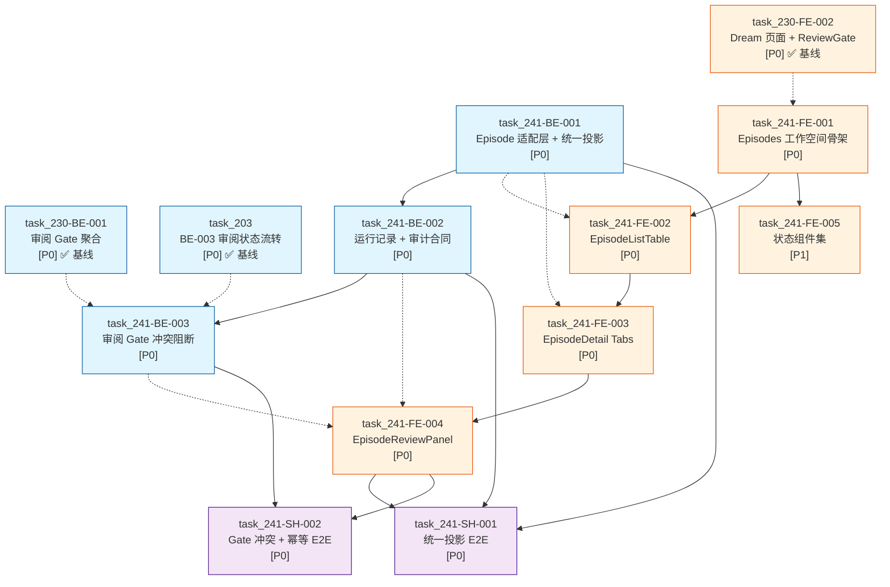
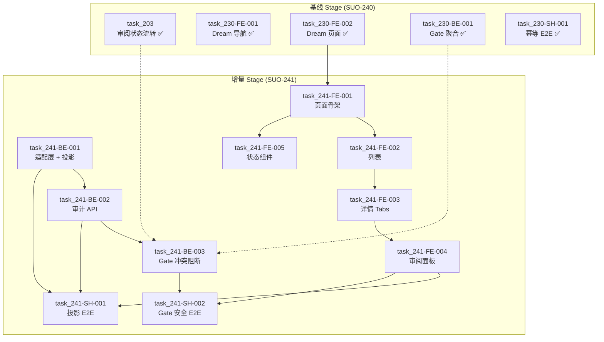

# Story Workspace Episodes 元信息渲染与审阅 Stage 计划

> **Stage ID**: `stage_002_story-workspace-episodes-metadata`  
> **关联 Issue**: [SUO-241](/SUO/issues/SUO-241) / [SUO-246](/SUO/issues/SUO-246)  
> **父 Issue**: [SUO-198](/SUO/issues/SUO-198)  
> **关联设计稿**:
> - `docs/design/story-workspace/design_003_story-workspace-episodes-metadata-review.md` (SUO-241, DEC-020~DEC-025)
> - `docs/design/story-workspace/story-workspace-prd.md` (SUO-199)
> - `docs/design/story-workspace/story-workspace-layout-design.md` (SUO-199)
> **稳定基线 Stage**: `docs/stage/stage_story-workspace.md` (stage_001, SUO-208/SUO-240，含 14 份基线 task + 4 份 SUO-230 增量 task)
> **任务输入来源**:
> - Issue 清单: `docs/issue/ISSUES_story-workspace-suo241-delta.md` (SUO-243)
> - Backend task: `docs/task/task_241_backend_episode-adapter-projection.md` + `task_241_backend_run-record-audit.md` + `task_241_backend_review-gate-conflict.md` (3 份)
> - Frontend task: `docs/task/task_241_frontend_episode-workspace.md` + `task_241_frontend_episode-list-table.md` + `task_241_frontend_episode-detail-tabs.md` + `task_241_frontend_episode-review-panel.md` + `task_241_frontend_episode-states.md` (5 份)
> - Shared task: `docs/task/task_241_shared_episode-projection-e2e.md` + `task_241_shared_review-gate-conflict-e2e.md` (2 份)
> - Task 合同来源: [SUO-246](/SUO/issues/SUO-246) (TaskDesignAgent 统一产出)
> **生成日期**: 2026-08-01  
> **更新日期**: 2026-08-01  
> **生成 Agent**: `StagePlanner`

---

## 1. 阶段总览

本文档基于 design → issue → task 阶段的全部产物，构建 **SUO-241 Episodes 元信息渲染与审阅** 的增量 Stage 计划。核心目标：

1. 将 **3 份 backend + 5 份 frontend + 2 份 shared** 共 10 份 task 编排为可并行的执行批次，明确前后端依赖与关键路径
2. 定义每个 task 的 execute 准入条件、阻塞原因与回滚策略
3. 输出 single-assignee 分配建议与范围冲突检查
4. 明确与基线 Stage (`stage_story-workspace.md`) 的衔接关系——SUO-241 是 SUO-230 的下游增量，不是平行替代
5. 定义 Stage 完成后的 CEOOrchestrator execute readiness check 清单
6. 处理 E2E harness 前置 gate（两份 shared task 均显式声明无现成 harness）

---

## 2. Task 文档映射表

### 2.1 SUO-241 Task ID ↔ 文档路径 ↔ Issue ID 映射（10 份）

| # | Task ID | 文档路径 | 关联 Issue ID | 类型 | 优先级 | 主责 Agent |
|---|---------|----------|---------------|------|--------|-----------|
| 1 | `task_241-BE-001` | `docs/task/task_241_backend_episode-adapter-projection.md` | `SUO-241-BE-001` | backend | P0 | BackendTaskAgent |
| 2 | `task_241-BE-002` | `docs/task/task_241_backend_run-record-audit.md` | `SUO-241-BE-002` | backend | P0 | BackendTaskAgent |
| 3 | `task_241-BE-003` | `docs/task/task_241_backend_review-gate-conflict.md` | `SUO-241-BE-003` | backend | P0 | BackendTaskAgent |
| 4 | `task_241-FE-001` | `docs/task/task_241_frontend_episode-workspace.md` | `SUO-241-FE-001` | frontend | P0 | FrontendTaskAgent |
| 5 | `task_241-FE-002` | `docs/task/task_241_frontend_episode-list-table.md` | `SUO-241-FE-002` | frontend | P0 | FrontendTaskAgent |
| 6 | `task_241-FE-003` | `docs/task/task_241_frontend_episode-detail-tabs.md` | `SUO-241-FE-003` | frontend | P0 | FrontendTaskAgent |
| 7 | `task_241-FE-004` | `docs/task/task_241_frontend_episode-review-panel.md` | `SUO-241-FE-004` | frontend | P0 | FrontendTaskAgent |
| 8 | `task_241-FE-005` | `docs/task/task_241_frontend_episode-states.md` | `SUO-241-FE-005` | frontend | P1 | FrontendTaskAgent |
| 9 | `task_241-SH-001` | `docs/task/task_241_shared_episode-projection-e2e.md` | `SUO-241-SH-001` | shared | P0 | FrontendTaskAgent (主责) + BackendTaskAgent (协作) |
| 10 | `task_241-SH-002` | `docs/task/task_241_shared_review-gate-conflict-e2e.md` | `SUO-241-SH-002` | shared | P0 | FrontendTaskAgent (主责) + BackendTaskAgent (协作) |

> **增量来源**: [SUO-243](/SUO/issues/SUO-243) Issue 拆解 → [SUO-246](/SUO/issues/SUO-246) task 合同 (TaskDesignAgent) → 本 Stage 编排

---

## 3. 依赖拓扑与阶段编排

### 3.1 依赖 DAG（Mermaid）



### 3.2 阶段任务表

| 阶段 | 任务 | 产出 | 依赖 | 风险 |
| --- | --- | --- | --- | --- |
| **Phase 1a**<br/>后端基础 | `task_241-BE-001` Episode 元信息适配层与统一投影 | `StoryWorkspaceEpisodeProjection` 合同 + 五类 artifact 解析器 + 冲突/完整性校验 | `SUO-201-BE-001` (基线 schema)、`SUO-226-BE-001` (workflow binding) | episodes 无统一 manifest/schema；Markdown 半结构化解析不稳定；样本版本天然不一致 |
| **Phase 1a**<br/>后端基础 | `task_241-BE-002` 运行记录与审计最小合同 API | 四类审计对象（Run/Artifact/Review/Gate）+ 查询 API + 不可变约束 | `task_241-BE-001` (投影先冻结) | 审计表与基线 run 模型职责重叠；事件去重与事务边界不一致 |
| **Phase 1b**<br/>前端骨架 | `task_241-FE-001` Dream 页面 Episodes 工作空间骨架 | `StoryWorkspaceEpisodeWorkspacePage` + PromptComposer + RunProgress + 三栏组合 + 规范路由 | `task_230-FE-002` (Dream 页面基线 ✅) | 与 `StoryWorkspaceDreamPage` 基线重复布局；后端合同未就绪造成接口漂移 |
| **Phase 2a**<br/>后端 Gate | `task_241-BE-003` 审阅 Gate 冲突阻断校验 | Gate 聚合读模型 + 阻断矩阵 + 确认/继续合同收紧 + 幂等 | `task_241-BE-002` (审计先稳定)、`task_230-BE-001` (基线 Gate ✅) | hash 输入不稳定；Gate 与页面各自推导规则；并发 TOCTOU |
| **Phase 2b**<br/>前端列表+状态 | `task_241-FE-002` EpisodeListTable 分集列表 | 七组列表格 + Toolbar + 冲突/时长展示 + 状态分离 | `task_241-FE-001` (页面骨架)、`task_241-BE-001` (投影合同；可用 fixture 并行) | 列过多导致中栏拥挤；时长差异阈值未澄清；前端自行推导授权 |
| **Phase 2b**<br/>前端状态 | `task_241-FE-005` Episodes 页面状态组件集 | 七个状态组件 + 状态映射适配器 + 恢复动作语义 | `task_241-FE-001` (页面容器)、`task_241-BE-001/003` (diagnostics；可用 fixture 并行) | 多状态并发导致 UI 抖动；UI 与后端状态枚举漂移 |
| **Phase 3**<br/>前端详情 | `task_241-FE-003` EpisodeDetail 分集详情 Tabs | 七个结构化 Tabs + raw fallback + shot 选择与右栏联动 | `task_241-FE-002` (列表选择上下文)、`task_241-BE-001` (投影合同) | 七个 Tabs 信息量过大；parser 输出随 schema 变化；选择上下文漂移 |
| **Phase 4**<br/>前端审阅 | `task_241-FE-004` EpisodeReviewPanel 分集审阅区 | 固定右栏 + 五类动作 + Gate 合同绑定 + 幂等继续 | `task_241-FE-003` (选择上下文)、`task_241-BE-003` (权威 Gate)、`task_201-FE-004` (基线 Review Panel ✅) | 选中 shot 变化导致误确认；前端规则复制导致与服务端漂移；手工结构化编辑范围未澄清 |
| **Phase 5a**<br/>E2E 投影 | `task_241-SH-001` 统一投影端到端联调 | 两种来源（参考 + 即时生成）无分叉证据 + 列表/详情/右栏/历史一致性 | `task_241-BE-001` (adapter)、`task_241-FE-004` (审阅链)、`task_241-BE-002` (审计查询) | **E2E harness 未配置**；Agent 输出不确定导致 flaky；测试污染源样本 |
| **Phase 5b**<br/>E2E Gate | `task_241-SH-002` 审阅 Gate 冲突与过期联调 | UI 锁定与 API 拒绝同时成立 + 确认三元组 + 防绕过 + 幂等 | `task_241-BE-003` (权威 Gate)、`task_241-FE-004` (右栏动作)、`task_241-BE-002` (审计查询) | **E2E harness 未配置**；只测 UI 导致假安全；并发窗口难稳定复现 |

### 3.3 与基线 Stage 的衔接关系



> **关键约束**: 基线 Stage 中的 `task_230-SH-001` (幂等 E2E) 与增量 Stage 中的 `task_241-SH-001/002` 是**不同层级的 E2E**——前者验证运行级 Gate 幂等，后者验证 episodes 投影一致性和 Gate 安全矩阵。二者可共享 harness，但测试场景不重叠。

---

## 4. 当前进度

| 阶段 | 任务 | 状态 |
| --- | --- | --- |
| Phase 1a | `task_241-BE-001` Episode 适配层 + 统一投影 | ⏳ 待执行 |
| Phase 1a | `task_241-BE-002` 运行记录 + 审计合同 | ⏳ 待执行 |
| Phase 1b | `task_241-FE-001` Episodes 工作空间骨架 | ⏳ 待执行 |
| Phase 2a | `task_241-BE-003` 审阅 Gate 冲突阻断 | ⏳ 待执行 |
| Phase 2b | `task_241-FE-002` EpisodeListTable | ⏳ 待执行 |
| Phase 2b | `task_241-FE-005` 状态组件集 | ⏳ 待执行 |
| Phase 3 | `task_241-FE-003` EpisodeDetail Tabs | ⏳ 待执行 |
| Phase 4 | `task_241-FE-004` EpisodeReviewPanel | ⏳ 待执行 |
| Phase 5a | `task_241-SH-001` 统一投影 E2E | ⏳ 待执行 |
| Phase 5b | `task_241-SH-002` Gate 冲突 + 幂等 E2E | ⏳ 待执行 |

> **基线前置状态**: `task_230-FE-002` (Dream 页面)、`task_230-BE-001` (Gate 聚合)、`task_203` (审阅状态流转) 均已在基线 Stage 中标记为 ✅ 完成或稳定基线。若实际执行中发现基线未完成，增量 Stage 需 blocked 等待。

---

## 5. Execute 准入矩阵

### 5.1 每个 Task 的准入条件与阻塞原因

| Task ID | 是否允许进入 execute | 准入条件 | 阻塞原因 | 建议 single-assignee |
|---------|---------------------|----------|----------|---------------------|
| `task_241-BE-001` (适配层 + 投影) | ✅ 允许 | `SUO-201-BE-001` Schema 基线 ✅；`SUO-226-BE-001` workflow binding 接口已知 | 无 | BackendTaskAgent |
| `task_241-BE-002` (审计 API) | ⚠️ 条件准入 | 需 `task_241-BE-001` (BE-001) 投影合同冻结 | artifact ID/version/hash 未定则审计记录无法引用 | BackendTaskAgent |
| `task_241-FE-001` (页面骨架) | ✅ 允许 | `task_230-FE-002` Dream 页面基线 ✅；三栏布局基线 ✅ | 无 | FrontendTaskAgent |
| `task_241-BE-003` (Gate 冲突阻断) | ⚠️ 条件准入 | 需 `task_241-BE-002` (BE-002) 审计稳定 + `task_230-BE-001` 基线 Gate ✅ | 审计记录不稳定则 Gate 无法校验历史 | BackendTaskAgent |
| `task_241-FE-002` (列表) | ⚠️ 条件准入 | 需 `task_241-FE-001` (FE-001) 页面骨架 + `task_241-BE-001` (BE-001) 投影合同（可用 fixture 并行） | 无页面容器则表格无处挂载；无投影合同则列定义漂移 | FrontendTaskAgent |
| `task_241-FE-005` (状态组件) | ⚠️ 条件准入 | 需 `task_241-FE-001` (FE-001) 页面容器 | 无容器则状态无处投影 | FrontendTaskAgent |
| `task_241-FE-003` (详情 Tabs) | ⚠️ 条件准入 | 需 `task_241-FE-002` (FE-002) 列表选择上下文 | 无列表选择则详情无版本上下文 | FrontendTaskAgent |
| `task_241-FE-004` (审阅面板) | ⚠️ 条件准入 | 需 `task_241-FE-003` (FE-003) 选择上下文 + `task_241-BE-003` (BE-003) 权威 Gate（可用 fixture 并行） | 无选择上下文则审阅目标漂移；无 Gate 则动作无授权 | FrontendTaskAgent |
| `task_241-SH-001` (投影 E2E) | ❌ 阻塞 | 需 `task_241-BE-001` + `task_241-FE-004` + `task_241-BE-002` 均完成；需 E2E harness 选型确定 | 前后端未就绪；无 Playwright/Cypress 配置 | FrontendTaskAgent (主责) + BackendTaskAgent (协作) |
| `task_241-SH-002` (Gate 安全 E2E) | ❌ 阻塞 | 需 `task_241-BE-003` + `task_241-FE-004` + `task_241-BE-002` 均完成；需 E2E harness 选型确定 | 前后端未就绪；无 Playwright/Cypress 配置 | FrontendTaskAgent (主责) + BackendTaskAgent (协作) |

### 5.2 并行执行建议

```
Wave 1（立即启动，前后端并行）:
├── BackendTaskAgent → task_241-BE-001 (适配层 + 统一投影)
└── FrontendTaskAgent → task_241-FE-001 (页面骨架)

Wave 2（Wave 1 完成后启动）:
├── BackendTaskAgent → task_241-BE-002 (审计 API)
├── FrontendTaskAgent → task_241-FE-002 (列表) ──→ task_241-FE-003 (详情 Tabs)
└── FrontendTaskAgent → task_241-FE-005 (状态组件) [可与 FE-002 并行]

Wave 3（Wave 2 后端完成后）:
└── BackendTaskAgent → task_241-BE-003 (Gate 冲突阻断)

Wave 4（Wave 2 前端 + Wave 3 后端完成后）:
└── FrontendTaskAgent → task_241-FE-004 (审阅面板)

Wave 5（Wave 4 完成后）:
├── FrontendTaskAgent (主责) + BackendTaskAgent (协作) → task_241-SH-001 (投影 E2E)
└── FrontendTaskAgent (主责) + BackendTaskAgent (协作) → task_241-SH-002 (Gate 安全 E2E)
  **前置条件**: E2E harness 已配置 或 已批准等价验证方案
```

### 5.3 E2E Harness 前置 Gate（SUO-241-SH-001/002 准入条件）

> **现状**: 仓库当前无既定 Playwright/Cypress 配置。`ls frontend/playwright.config.*` 与 `ls frontend/cypress.config.*` 均无命中；无 `e2e/` 目录。
>
> **StagePlanner 裁决**: 不得在 stage 阶段静默假设 E2E 框架已存在，也不得在 `task_241-SH-001/002` 内引入实现依赖（如安装 Playwright 作为该 task 的「产出」）。

**可审计的 bootstrap/等价验证准入路径**（三选一，由 CEOOrchestrator 在 readiness check 中裁决）：

| 路径 | 说明 | 准入条件 | 验收方式 |
|------|------|----------|----------|
| **A. Playwright bootstrap** | 新建 `e2e/` 目录 + Playwright 配置 + CI 集成 | 由独立 bootstrap task 完成；`task_241-SH-001/002` 仅编写测试用例 | `npx playwright test` 通过 |
| **B. Cypress bootstrap** | 新建 `e2e/` 目录 + Cypress 配置 + CI 集成 | 同上 | `npx cypress run` 通过 |
| **C. agent-browser 等价验证** | 使用 `agent-browser` skill 执行可追溯的手动验证脚本 | 当 A/B 均不可行时作为降级方案；需保留完整操作录屏/截图与断言日志 | 验证报告上传为 issue artifact |

**阻塞规则**:
- `task_241-SH-001/002` 进入 execute 前，必须确认上述路径之一已获批且 bootstrap 完成（路径 A/B）或等价验证方案已记录（路径 C）。
- 若 E2E harness bootstrap 作为独立 task 执行，则 `task_241-SH-001/002` 需 `blockedBy` 该 bootstrap issue。
- **本 stage 文档仅记录缺口与路径，不自行创建 bootstrap task**（超出 StagePlanner 写入边界）。

---

## 6. 关键路径

```
后端关键路径:
task_241-BE-001 (适配层 + 投影) → task_241-BE-002 (审计 API) → task_241-BE-003 (Gate 冲突阻断)
                                                                         ↓
前端关键路径:
task_241-FE-001 (页面骨架) → task_241-FE-002 (列表) → task_241-FE-003 (详情) → task_241-FE-004 (审阅面板)
                                                                                      ↓
E2E 关键路径:
task_241-SH-001 (投影 E2E) + task_241-SH-002 (Gate 安全 E2E)
```

**关键路径长度**: 5 个阶段（Wave 1 → Wave 2 → Wave 3 → Wave 4 → Wave 5）

**后端关键路径**: `task_241-BE-001` → `task_241-BE-002` → `task_241-BE-003` → `task_241-SH-002`
**前端关键路径**: `task_241-FE-001` → `task_241-FE-002` → `task_241-FE-003` → `task_241-FE-004` → `task_241-SH-001/002`

---

## 7. 范围冲突检查

### 7.1 允许/禁止修改范围矩阵

| Task | 允许修改的文件/目录 | 禁止修改的文件/目录 | 冲突检查 |
|------|-------------------|-------------------|----------|
| `task_241-BE-001` (适配层) | `backend/src/services/story-workspace/episode-adapter.ts`, `episode-parser/`, `db/schema/story-workspace/episode-projection.ts`, migrations, tests | `docs/design/`, `docs/issue/`, `docs/stage/`, `docs/exec/`, 前端代码, `output/episodes` 原文 | ✅ 无冲突 |
| `task_241-BE-002` (审计) | `backend/src/routes/story-workspace/runs.ts`, `run-record.service.ts`, `db/schema/story-workspace/run-record.ts`, migrations, tests | `docs/design/`, `docs/issue/`, `docs/stage/`, `docs/exec/`, 前端代码, 既有已确认审计事实 | ✅ 无冲突；与 BE-001 共用 schema 目录但字段不重叠 |
| `task_241-BE-003` (Gate) | `backend/src/routes/story-workspace/review-gate.ts`, `review-gate.service.ts`, `conflict-validator.ts`, tests | `docs/design/`, `docs/issue/`, `docs/stage/`, `docs/exec/`, 前端代码, 基线 Gate 默认拒绝策略 | ✅ 无冲突；在 task_230-BE-001 基础上追加 episodes 校验 |
| `task_241-FE-001` (骨架) | `frontend/src/pages/story-workspace/StoryWorkspaceEpisodeWorkspacePage.tsx`, `PromptComposer.tsx`, `RunProgress.tsx`, router, hooks, services | `docs/design/`, `docs/issue/`, `docs/stage/`, `docs/exec/`, 后端代码, `StoryWorkspaceDreamPage` 基线核心 | ✅ 无冲突；与 Dream 页面为组合关系 |
| `task_241-FE-002` (列表) | `frontend/src/components/story-workspace/episode/StoryWorkspaceEpisodeListTable.tsx`, `Toolbar.tsx`, tests, hooks | `docs/design/`, `docs/issue/`, `docs/stage/`, `docs/exec/`, 后端代码, 通用表格基线核心 | ✅ 无冲突 |
| `task_241-FE-003` (详情) | `frontend/src/components/story-workspace/episode/StoryWorkspaceEpisodeDetail.tsx`, `tabs/`, tests | `docs/design/`, `docs/issue/`, `docs/stage/`, `docs/exec/`, 后端代码, 通用 Tabs 基线核心 | ✅ 无冲突 |
| `task_241-FE-004` (审阅) | `frontend/src/components/story-workspace/episode/StoryWorkspaceEpisodeReviewPanel.tsx`, `review/`, tests, hooks, services | `docs/design/`, `docs/issue/`, `docs/stage/`, `docs/exec/`, 后端 Gate 规则, 基线 Review Panel 核心 | ✅ 无冲突；与 task_202d 为增量适配关系 |
| `task_241-FE-005` (状态) | `frontend/src/components/story-workspace/episode/state/`, tests, hooks | `docs/design/`, `docs/issue/`, `docs/stage/`, `docs/exec/`, 后端状态机, 通用状态基线核心 | ✅ 无冲突 |
| `task_241-SH-001` (E2E) | `e2e/tests/story-workspace/episode-projection.spec.ts`, fixtures, helpers | `docs/design/`, `docs/issue/`, `docs/stage/`, `docs/exec/`, 实现代码修改 | ✅ 无冲突；仅新建测试文件 |
| `task_241-SH-002` (E2E) | `e2e/tests/story-workspace/review-gate-*.spec.ts`, fixtures, helpers | `docs/design/`, `docs/issue/`, `docs/stage/`, `docs/exec/`, 实现代码修改 | ✅ 无冲突；仅新建测试文件 |

### 7.2 Single-Assignee 分配建议

| 执行批次 | 任务 | 建议 Assignee | 理由 |
|----------|------|--------------|------|
| Wave 1 | `task_241-BE-001` | BackendTaskAgent | 后端核心，定义投影合同，后续 backend tasks 均依赖 |
| Wave 1 | `task_241-FE-001` | FrontendTaskAgent | 前端骨架，与基线 Dream 页面组合，独立启动 |
| Wave 2 | `task_241-BE-002` | BackendTaskAgent | 与 BE-001 同一 Agent，审计记录引用投影字段 |
| Wave 2 | `task_241-FE-002` → `task_241-FE-003` | FrontendTaskAgent | 前端核心链路，列表 → 详情 → 审阅面板串行依赖 |
| Wave 2 | `task_241-FE-005` | FrontendTaskAgent | 状态组件可与 FE-002 并行，同一 Agent 保证语义一致 |
| Wave 3 | `task_241-BE-003` | BackendTaskAgent | Gate 安全关键，与审计 API 同一 Agent |
| Wave 4 | `task_241-FE-004` | FrontendTaskAgent | 审阅面板，与前端核心链路同一 Agent |
| Wave 5 | `task_241-SH-001` + `task_241-SH-002` | FrontendTaskAgent (主责) + BackendTaskAgent (协作) | E2E 需双方参与；FrontendTaskAgent 主导 UI 链路验证 |

---

## 8. 验收、测试/验证、回滚与完成信号

### 8.1 每批次验收 Checklist

#### Wave 1 验收
- [ ] `task_241-BE-001`: EP01/EP90 形成投影；五类 artifact 可解析；冲突保留两值；幂等接入
- [ ] `task_241-FE-001`: 三栏组合正确；PromptComposer 可创建 run；路由规范；运行进度显示

#### Wave 2 验收
- [ ] `task_241-BE-002`: 四类审计对象可查询；不可变约束生效；旧 attempt 可比较
- [ ] `task_241-FE-002`: 七组列渲染正确；冲突/时长并列展示；状态不混淆
- [ ] `task_241-FE-005`: 七个状态组件映射正确；恢复语义清晰

#### Wave 3 验收
- [ ] `task_241-BE-003`: Gate 聚合返回 required versions + hash + warnings + blockers；确认/继续合同收紧

#### Wave 4 验收
- [ ] `task_241-FE-004`: 右栏显示明确审阅目标；五类动作齐全；确认携带 run+version+hash

#### Wave 5 验收
- [ ] `task_241-SH-001`: 两种来源无字段/状态/版本分叉；列表/详情/右栏/历史一致性
- [ ] `task_241-SH-002`: 每个阻断场景 UI 锁定 + API 拒绝同时成立；幂等确认/继续

### 8.2 回滚策略

| 层级 | 回滚操作 | 负责人 |
|------|----------|--------|
| 适配层/投影 | 删除 `episode-adapter.ts` 和 `episode-parser/`；恢复基线投影接口 | BackendTaskAgent |
| 审计 API | 删除 `runs.ts` 路由和 `run-record.service.ts`；保留已落库审计记录只读 | BackendTaskAgent |
| Gate 增量 | 删除 `conflict-validator.ts`；恢复 `review-gate.service.ts` 至 task_230-BE-001 基线 | BackendTaskAgent |
| 前端 Episodes | 删除 `frontend/src/components/story-workspace/episode/` 目录；恢复 Dream 页面至基线 | FrontendTaskAgent |
| E2E | 删除 `e2e/tests/story-workspace/episode-*` 和 `review-gate-*.spec.ts` | FrontendTaskAgent |

### 8.3 完成信号

每个 task 完成后：
1. 在对应 Issue 评论区回填完成摘要
2. 更新 task 文档中的完成标志 checklist
3. 标记 Issue 状态为 `done`

Stage 整体完成后：
1. 所有 10 个 execute task 均标记 `done`
2. 在 [SUO-246](/SUO/issues/SUO-246) 评论区回填 task 合同完成摘要
3. 在 [SUO-241](/SUO/issues/SUO-241) 评论区回填增量阶段完成摘要
4. CEOOrchestrator 执行 execute readiness check（见 §9）

---

## 9. CEOOrchestrator Execute Readiness Check 清单

> **注意**: 本 stage 完成后，须由 CEOOrchestrator 独立执行以下 readiness check。未通过不得进入 execute。

| # | 检查项 | 通过标准 | 检查方式 |
|---|--------|----------|----------|
| 1 | 设计稿完整性 | `design_003_story-workspace-episodes-metadata-review.md` 已确认，无未决 `[CLARIFICATION_NEEDED]` 阻塞执行 | 人工审阅设计稿 |
| 2 | Issue 清单完整性 | `docs/issue/ISSUES_story-workspace-suo241-delta.md` 已提交并跟踪 | 检查 git status |
| 3 | Task 文档完整性 | 10 份 task 文档均存在，每份含 10 个标准章节 | 文件系统扫描 |
| 4 | 依赖无循环 | 任务依赖图无环，关键路径清晰 | 拓扑排序验证 |
| 5 | 范围冲突检查 | 无两个 task 同时修改同一文件的冲突 | §7.1 矩阵验证 |
| 6 | 基线前置确认 | `task_230-FE-002`、`task_230-BE-001`、`task_203` 均已完成 | 基线 Stage 状态检查 |
| 7 | 命名规范一致性 | 所有 task 文档使用 `story-workspace` 前缀 | 关键词扫描 |
| 8 | 测试策略完整性 | 每个 task 含测试/验证策略 | 文档审查 |
| 9 | 回滚策略就绪 | Schema/API/前端回滚路径明确 | 文档审查 |
| 10 | Agent 分配明确 | 每个 task 有唯一 single-assignee | §7.2 矩阵验证 |
| 11 | 投影合同冻结 | `task_241-BE-001` 的 `StoryWorkspaceEpisodeProjection` 字段已冻结 | 类型文件比对 |
| 12 | E2E 准入条件 | `task_241-SH-001/002` 的 E2E harness 已配置或已批准等价验证方案 | §5.3 路径确认 |
| 13 | SUO-226 依赖对齐 | `task_241-BE-001/002/003` 的 `workflow_run` 接口已与 SUO-226 完成对齐 | 接口合同比对 |
| 14 | 非阻塞澄清项追踪 | 3 项 `[CLARIFICATION_NEEDED]` 均有 owner 和默认假设 | 设计稿 §12 / task 风险表核对 |

---

## 10. 风险与缓冲策略

### 10.1 高风险项

| 风险 | 影响 | 概率 | 缓解措施 | 缓冲 |
|------|------|------|----------|------|
| **episodes 无统一 manifest/schema** | 适配层解析不稳定 | 高 | 接入 envelope + 未知 schema 保留原文；分层 parser + raw fallback | Wave 1 预留 parser 迭代时间 |
| **Markdown 半结构化解析不稳定** | 字段丢失或误解析 | 高 | 失败回退原文；诊断可见；EP01/EP90 作为固定夹具 | Wave 1 预留 1 轮解析对齐 |
| **样本版本天然不一致** | EP01 script@v5 vs storyboard@v1 冲突 | 高 | 并列保存来源值；Gate 阻断；不静默归一 | 已在设计稿中明确处理 |
| **前后端类型不同步** | E2E 联调阻塞 | 中 | BackendTaskAgent 为唯一规范主责；投影合同冻结后前端消费 | Wave 1 尽早冻结 projection |
| **SUO-226 workflow_run 模型未完成** | `task_241-BE-001/002/003` 无法对接真实数据 | 高 | 使用占位/mock 先行开发；接口确定后切换 | 预留 1 轮接口对齐迭代 |
| **E2E harness 未配置** | `task_241-SH-001/002` 无法自动化执行 | 中 | 明确 bootstrap 路径（Playwright/Cypress/agent-browser）；由 CEOOrchestrator 裁决 | Wave 5 前完成 harness 选型 |
| **Gate 与页面各自推导规则** | 前端禁用但服务端放行，或反之 | 高 | 服务端返回权威 aggregate；前端仅投影，不复制授权逻辑 | `task_241-BE-003` 核心验收项 |
| **客户端绕过风险** | 恶意请求直接调用 continue API | 高 | 所有 continue/结束请求必须经过服务端聚合校验；不信任客户端任何状态标记 | `task_241-BE-003` 核心验收项 |
| **并发 TOCTOU** | 读取 aggregate 后生成新 version，旧确认通过 | 中 | 确认事务内重算 active attempt/version/hash；乐观并发或等价约束 | `task_241-BE-003` 竞态测试 |
| **Agent 输出不确定** | E2E 测试 flaky | 中 | 使用 deterministic fixture/stub；保留真实 smoke 场景 | `task_241-SH-001` 测试设计 |

### 10.2 设计稿 [CLARIFICATION_NEEDED] 项追踪

| 项 | 状态 | 默认假设 | 是否阻塞 execute | 风险等级 | Owner |
|----|------|----------|------------------|----------|-------|
| `requiredArtifactKinds` | 待确认 | 默认 script/storyboard/prompts/review-report；最终以锁定 Deck workflow snapshot 为准 | 否 | 中 | CEOOrchestrator 路由 Deck owner |
| 时长差异阈值 | 待确认 | 默认按百分比；warning/block 阈值由 workflow 规则注入 | 否 | 中 | 产品 owner |
| 手工结构化编辑范围 | 待确认 | 默认仅基线批准字段；保存创建新 artifact version | 否 | 低 | 产品 owner |

### 10.3 追溯项

- 若 execute 阶段发现设计稿与实现冲突，必须回到 Issue 评论区记录澄清，不得静默覆盖。
- 若 execute 阶段需要新增设计决策，必须标记 `[CLARIFICATION_NEEDED]`，由 CEOOrchestrator 判断是否回退到 DesignArchitect。
- 本 Stage 与基线 Stage (`stage_story-workspace.md`) 为增量关系，非替代关系。基线 Stage 中的 Waves 1-8 仍独立执行；本 Stage 的 Waves 1-5 在基线完成后启动。

---

## 11. 明确排除项

以下模块/功能在本期 Episodes 实施中**明确排除**（继承自基线设计稿）：

| 排除项 | 说明 | 后续计划 |
|--------|------|----------|
| **复杂画布编辑器** | 故事板/时间线可视化编辑 | 后续迭代，本期以数据表呈现 |
| **平台视频模块** | 镜头生成、视频预览、播放器 | 明确排除 |
| **移动端/平板端适配** | 任何 < 1280px 的响应式处理 | 明确排除，仅桌面端 |
| **用户手动创建内容** | 用户从零创建故事/角色/场景 | 明确排除，内容仅由 Agent 生成 |
| **实时协作** | 多创作者同时编辑 | 后续迭代 |
| **四视角转面图** | 角色头像仅支持单张 | 后续迭代 |
| **历史版本管理** | 无版本快照（artifact version 不可变，但不是用户可浏览的历史版本树） | 后续迭代 |
| **@提及系统** | 无提及/通知 | 后续迭代 |
| **计费/积分系统** | 无积分消耗 | 后续迭代 |
| **富文本编辑器** | 编辑模式使用纯文本/Markdown | 后续迭代 |
| **外部模型选择** | Prompt Tab 只读展示，不提供模型选择或计费 | 明确排除 |
| **视频生成控件** | render-guide 只展示文本元信息，无生成按钮 | 明确排除 |

---

## 12. 附录

### 12.1 设计决策引用

| 决策 ID | 内容 | 影响任务 |
|---------|------|----------|
| DEC-017 | Dream 为 story-workspace 全局入口；Sidebar 为域内二级导航 | `task_241-FE-001` |
| DEC-018 | ReviewGate 四步进度指示；确认必须带运行 ID 与审阅版本校验；客户端 UI 锁定不能替代服务端校验 | `task_241-BE-003`, `task_241-FE-004`, `task_241-SH-002` |
| DEC-020 | 已有 episodes 参考产物和简单描述触发的新产物必须进入同一 `StoryWorkspaceEpisodeProjection` | `task_241-BE-001`, `task_241-SH-001` |
| DEC-021 | 源文件状态、Agent 审查、用户审阅和后续执行是四个独立状态维度 | `task_241-BE-002`, `task_241-FE-002`, `task_241-FE-005` |
| DEC-022 | Gate 绑定最新活动 run 的明确 required artifact versions 与 aggregate hash | `task_241-BE-003`, `task_241-FE-004` |
| DEC-023 | 再次生成创建不可变新 attempt/version，旧产物永久保留 | `task_241-BE-002`, `task_241-FE-004`, `task_241-SH-001` |
| DEC-024 | 对样本版本、时长、审查范围冲突采取「并列展示并阻断」，不得静默归一 | `task_241-BE-001`, `task_241-FE-002`, `task_241-FE-003`, `task_241-SH-002` |
| DEC-025 | 借用 Dreem 的一句话入口、主从详情、确认和历史模式，但用轻纸面表格替代黑色画布并排除视频 | `task_241-FE-001`, `task_241-FE-003` |

### 12.2 与基线 Stage 的决策继承

| 基线决策 | 本 Stage 继承/扩展 |
|----------|-------------------|
| DEC-001 ~ DEC-008 (SUO-201) | 全部继承；范围外排除项不变 |
| DEC-017 ~ DEC-018 (SUO-230) | 继承并扩展至 episodes 专属字段和 artifact bundle |
| DEC-020 ~ DEC-025 (SUO-241) | 新增，仅影响本 Stage 的 10 份 task |

### 12.3 文档变更记录

| 版本 | 日期 | 变更内容 | 作者 |
|------|------|----------|------|
| v1 | 2026-08-01 | 初始版本：10 份 task 映射、5 阶段编排、准入矩阵、风险追踪、基线衔接关系、E2E harness 前置 gate | StagePlanner |
| v2 | 2026-08-01 | 修正 Issue 关联为 SUO-246；补充 Stage ID 为 stage_002；明确 task 合同来源为 TaskDesignAgent；更新完成信号指向 SUO-246 | StagePlanner |
