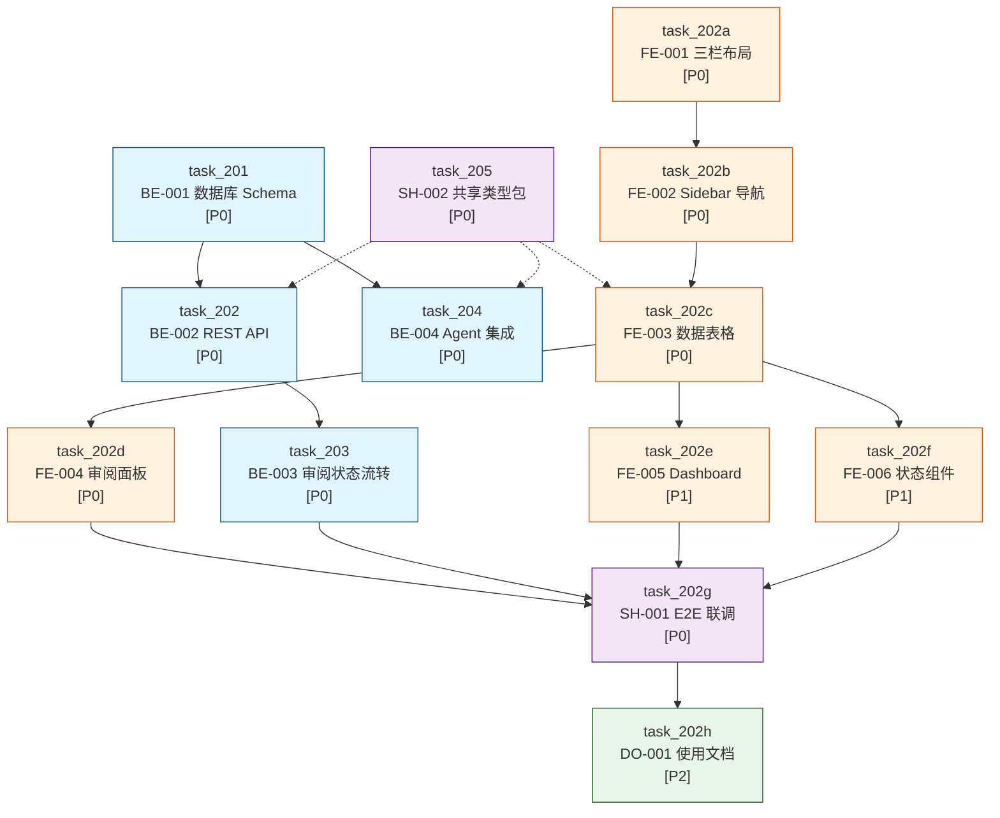
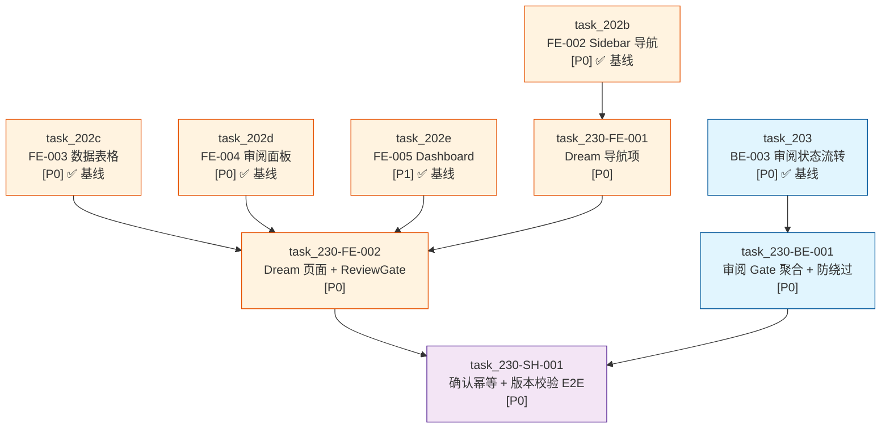

# Story Workspace 实施阶段计划与 Execute 准入矩阵

> **Stage ID**: `stage_001_story-workspace`  
> **关联 Issue**: [SUO-208](/SUO/issues/SUO-208) / [SUO-240](/SUO/issues/SUO-240)  
> **父 Issue**: [SUO-198](/SUO/issues/SUO-198)  
> **关联设计稿**:
> - `docs/design/story-workspace/story-workspace-prd.md` (SUO-199)
> - `docs/design/story-workspace/story-workspace-layout-design.md` (SUO-199)
> - `docs/design/story-workspace/story-workspace-deck-desk-integration-delta.md` (SUO-215)
> **任务输入来源**:
> - Issue 清单: `docs/issue/ISSUES_story-workspace.md` (SUO-201)
> - 前端 task: `docs/task/task_202_frontend_story-workspace-overview.md` + task_202a ~ task_202h (9 份)
> - 后端 task: `docs/task/task_201_backend_story-workspace-schema.md` + task_202_backend_*.md + task_203 ~ task_205 (5 份)
> - **增量 task (SUO-230)**: `docs/task/task_230_frontend_dream-nav-item.md` + task_230_frontend_dream-page-review-gate.md + task_230_backend_review-gate-aggregation.md + task_230_shared_idempotency-e2e.md (4 份)
> - 模板参考: `docs/task/TASK-REQUIREMENT-FORMAT.md` (只读)
> **生成日期**: 2026-08-01  
> **增量更新日期**: 2026-08-01  
> **生成 Agent**: `StagePlanner`

---

## 1. 阶段总览

本文档基于 design → issue → task 阶段的全部产物，构建 story-workspace 模块的可执行阶段计划。核心目标：

1. 将 **14 份基线 task + 4 份增量 task** 编排为可并行的执行批次，明确前后端依赖与关键路径
2. 定义每个 task 的 execute 准入条件、阻塞原因与回滚策略
3. 输出 single-assignee 分配建议与范围冲突检查
4. 明确排除项（复杂画布、平台视频、移动端/平板端、用户手动创建内容）
5. 定义 stage 完成后的 CEOOrchestrator execute readiness check 清单
6. **(SUO-240 增量)** 编排 Dream 导航与审阅 Gate 增量 Stage，明确 E2E harness 前置 gate 与等价验证路径

---

## 2. Task 文档映射表

### 2.1 基线 Task ID ↔ 文档路径 ↔ Issue ID 映射（14 份）

| # | Task ID | 文档路径 | 关联 Issue ID | 类型 | 优先级 | 主责 Agent |
|---|---------|----------|---------------|------|--------|-----------|
| 1 | `task_201` | `docs/task/task_201_backend_story-workspace-schema.md` | `SUO-201-BE-001` | backend | P0 | BackendTaskAgent |
| 2 | `task_202` | `docs/task/task_202_backend_story-workspace-rest-api.md` | `SUO-201-BE-002` | backend | P0 | BackendTaskAgent |
| 3 | `task_203` | `docs/task/task_203_backend_story-workspace-review-workflow.md` | `SUO-201-BE-003` | backend | P0 | BackendTaskAgent |
| 4 | `task_204` | `docs/task/task_204_backend_story-workspace-agent-integration.md` | `SUO-201-BE-004` | backend | P0 | BackendTaskAgent |
| 5 | `task_205` | `docs/task/task_205_backend_story-workspace-shared-types.md` | `SUO-201-SH-002` | shared | P0 | BackendTaskAgent |
| 6 | `task_202a` | `docs/task/task_202a_frontend_three-column-layout.md` | `SUO-201-FE-001` | frontend | P0 | FrontendTaskAgent |
| 7 | `task_202b` | `docs/task/task_202b_frontend_sidebar-navigation.md` | `SUO-201-FE-002` | frontend | P0 | FrontendTaskAgent |
| 8 | `task_202c` | `docs/task/task_202c_frontend_data-table-components.md` | `SUO-201-FE-003` | frontend | P0 | FrontendTaskAgent |
| 9 | `task_202d` | `docs/task/task_202d_frontend_review-panel.md` | `SUO-201-FE-004` | frontend | P0 | FrontendTaskAgent |
| 10 | `task_202e` | `docs/task/task_202e_frontend_dashboard.md` | `SUO-201-FE-005` | frontend | P1 | FrontendTaskAgent |
| 11 | `task_202f` | `docs/task/task_202f_frontend_state-components.md` | `SUO-201-FE-006` | frontend | P1 | FrontendTaskAgent |
| 12 | `task_202g` | `docs/task/task_202g_frontend_e2e-integration.md` | `SUO-201-SH-001` | shared | P0 | FrontendTaskAgent |
| 13 | `task_202h` | `docs/task/task_202h_frontend_user-documentation.md` | `SUO-201-DO-001` | docs | P2 | FrontendTaskAgent |
| 14 | `task_202` | `docs/task/task_202_frontend_story-workspace-overview.md` | `SUO-202` | overview | medium | FrontendTaskAgent |

> **说明**: 第 14 项 `task_202` (overview) 为任务总览文档，自身不进入 execute 阶段，仅作为依赖参考。

### 2.2 增量 Task ID ↔ 文档路径 ↔ Issue ID 映射（4 份，SUO-230）

| # | Task ID | 文档路径 | 关联 Issue ID | 类型 | 优先级 | 主责 Agent | 上游 Issue |
|---|---------|----------|---------------|------|--------|-----------|------------|
| 15 | `task_230-FE-001` | `docs/task/task_230_frontend_dream-nav-item.md` | `SUO-230-FE-001` | frontend | P0 | FrontendTaskAgent | [SUO-230](/SUO/issues/SUO-230) |
| 16 | `task_230-FE-002` | `docs/task/task_230_frontend_dream-page-review-gate.md` | `SUO-230-FE-002` | frontend | P0 | FrontendTaskAgent | [SUO-230](/SUO/issues/SUO-230) |
| 17 | `task_230-BE-001` | `docs/task/task_230_backend_review-gate-aggregation.md` | `SUO-230-BE-001` | backend | P0 | BackendTaskAgent | [SUO-230](/SUO/issues/SUO-230) |
| 18 | `task_230-SH-001` | `docs/task/task_230_shared_idempotency-e2e.md` | `SUO-230-SH-001` | shared | P0 | FrontendTaskAgent (主责) + BackendTaskAgent (协作) | [SUO-230](/SUO/issues/SUO-230) |

> **增量来源**: [SUO-232](/SUO/issues/SUO-232) 传播 → [SUO-234](/SUO/issues/SUO-234) task 合同 → SUO-240 stage 编排

---

## 3. 阶段任务表

### 3.1 执行批次编排



### 3.1b 增量执行批次编排（SUO-230 — Dream 导航与审阅 Gate）



### 3.2 详细阶段任务表

| 阶段 | 任务 | 产出 | 依赖 | 风险 |
| --- | --- | --- | --- | --- |
| **Phase 1**<br/>基础准备 | `task_205` SH-002 命名规范与类型定义共享包 | 后端 Python 类型规范源 + 命名检查清单 + 前端 TS 镜像类型模板 | 无（可与 Schema 并行） | 前后端类型不同步；无 monorepo shared package |
| **Phase 1**<br/>基础准备 | `task_201` BE-001 数据库 Schema 与数据表初始化 | 6 张表 + 索引 + 幂等 Migration + 回滚函数 | 无 | SQLite 方言差异（无 pg_trgm/gin）；无原生 boolean/enum |
| **Phase 1**<br/>基础准备 | `task_202a` FE-001 三栏布局骨架与全局样式 | `StoryWorkspaceLayout` + `StoryWorkspaceReviewPanel` 容器 | `tokens.css` 已存在 | 项目无 react-router，需确认接入方式 |
| **Phase 2**<br/>后端核心 | `task_202` BE-002 REST API 实现 | `backend/routers/story-workspace.py` 完整 CRUD + 分页 | `task_201` (BE-001) | SQLite LIKE 搜索性能；排序字段注入风险 |
| **Phase 2**<br/>后端核心 | `task_204` BE-004 Agent 产出数据接收与存储集成 | `agent_integration.py` + 内部接收端点 + claude-agent 调用 | `task_201` (BE-001) | Agent 输出格式不固定；同一 thread 重复生成去重 |
| **Phase 2**<br/>前端核心 | `task_202b` FE-002 Sidebar 导航与路由配置 | `StoryWorkspaceSidebar` + 路由配置 + 4 个页面骨架 | `task_202a` (FE-001) | 现有项目路由机制不确定（状态切换 vs react-router） |
| **Phase 2**<br/>前端核心 | `task_202c` FE-003 数据表格组件 | 3 个专用表格 + 通用表格行 + 审阅状态标签 + Toolbar + 批量操作栏 + Hooks | `task_202b` (FE-002) | API 尚未实现时需 Mock 数据开发 |
| **Phase 2**<br/>前端核心 | `task_202d` FE-004 审阅面板与审阅操作 | `StoryWorkspaceReviewPanel` 完整实现 + 审阅操作按钮 + 内容展示 + 修改意见输入 | `task_202c` (FE-003) | 审阅 API 尚未实现；编辑模式状态管理复杂 |
| **Phase 3**<br/>后端工作流 | `task_203` BE-003 审阅状态流转与批量操作 API | confirm/reject/archive 端点（故事/角色/场景）+ 批量操作 + 状态流转校验矩阵 | `task_202` (BE-002) | 状态流转非法操作；批量操作竞态条件 |
| **Phase 4**<br/>前端完善 | `task_202e` FE-005 工作台首页 Dashboard | `StoryWorkspaceDashboardPage` + 统计展示 + 快捷入口 + 已确认列表 | `task_202c` (FE-003) | Dashboard 数据需多次 API 调用 |
| **Phase 4**<br/>前端完善 | `task_202f` FE-006 空态/加载/错误/选中态组件 | `StoryWorkspaceEmptyState` + `StoryWorkspaceLoadingState` + `StoryWorkspaceErrorState` | `task_202c` (FE-003) | shimmer 动画性能（低） |
| **Phase 5**<br/>联调验证 | `task_202g` SH-001 前端-后端联调：审阅工作流 E2E | E2E 联调报告 + 问题清单 + 验收通过确认 | `task_202d` (FE-004), `task_203` (BE-003) | 后端 API 未就绪；Agent 生成时序不确定 |
| **Phase 6**<br/>文档 | `task_202h` DO-001 使用文档 | Story Workspace 使用文档（Markdown） | `task_202g` (SH-001) | 文档与最终实现不一致 |
| **Phase 7**<br/>增量前端 (SUO-230) | `task_230-FE-001` Dream 导航项与 canonical 路由 | `StoryWorkspaceDreamNavItem` + TopNavBar 集成 + `/story-workspace/dream` 路由 | `task_202b` (FE-002) ✅ 基线 | 现有路由机制为状态切换而非 react-router；Dashboard 与 Dream 双状态风险 |
| **Phase 7**<br/>增量前端 (SUO-230) | `task_230-FE-002` Dream 页面与 ReviewGate 组件 | `StoryWorkspaceDreamPage` + `StoryWorkspaceReviewGate` + gate 状态管理 + 版本校验 | `task_202d` (FE-004) ✅, `task_202e` (FE-005) ✅, `task_230-FE-001` ⏳ 并行 | `task_226` 工作流上下文条未完成（可用占位）；`SUO-230-BE-001` 服务端聚合未完成（可用 mock） |
| **Phase 7**<br/>增量后端 (SUO-230) | `task_230-BE-001` 审阅 Gate 服务端聚合与防绕过 | 聚合查询 API + 确认版本校验 + 继续/结束幂等 + 防绕过验证 | `task_203` (BE-003) ✅ 基线 | `SUO-226` workflow_run 数据模型尚未完成；聚合查询性能；客户端绕过风险 |
| **Phase 8**<br/>增量联调 (SUO-230) | `task_230-SH-001` 确认幂等与审阅版本校验 E2E | E2E 测试报告：幂等确认 + 版本过期拒绝 + 防绕过 + Gate 解锁 + 失败恢复 | `task_230-FE-002` (FE-002), `task_230-BE-001` (BE-001) | **E2E harness 未配置**（见 §5.3）；`SUO-226` 依赖；Agent 重新生成难以稳定触发 |

### 3.3 增量阶段任务表（SUO-230 — Dream 导航与审阅 Gate）

| 阶段 | 任务 | 产出 | 依赖 | 风险 |
| --- | --- | --- | --- | --- |
| **Phase A**<br/>前端 Dream 导航与页面 | `task_230-FE-001` TopNavBar Dream 导航项与 canonical 路由 | `StoryWorkspaceDreamNavItem` + 路由重定向 (`/story-workspace` → `/story-workspace/dream`) | `task_202b` (FE-002) 基线路由 | Dashboard 与 Dream 双状态风险；需明确 Dashboard 仅重定向 |
| **Phase A**<br/>前端 Dream 页面 | `task_230-FE-002` Dream 页面与 ReviewGate 组件 | `StoryWorkspaceDreamPage` + `StoryWorkspaceReviewGate` (四步进度) + gate 状态管理 | `task_202c`~`task_202e` (FE-003~005) 基线 + `task_230-FE-001` | `task_226` 工作流上下文条未完成；可用占位组件先行 |
| **Phase B**<br/>后端 Gate 聚合 | `task_230-BE-001` 审阅 Gate 服务端聚合与防绕过验证 | `GET /workflow-runs/:id/review-gate` + 增强 confirm (版本校验) + `POST /continue` (幂等) + 防绕过逻辑 | `task_203` (BE-003) 基线审阅流转 + `task_226` run 模型 | `workflow_run` 数据模型尚未完成 (SUO-226)；接口设计需对齐 |
| **Phase C**<br/>增量 E2E 联调 | `task_230-SH-001` 确认幂等 + 审阅版本校验 + 防绕过 E2E | E2E 测试报告 (幂等/版本/绕过/生命周期) + 缺陷记录 | `task_230-FE-002` + `task_230-BE-001` | **E2E harness 未配置**；需 StagePlanner 前置 gate 或等价验证方案 |

> **关键约束**: `task_230-SH-001` 显式声明当前仓库无 Playwright/Cypress 配置，要求 StagePlanner 先安排 E2E harness 选型/引导，或批准等价的 agent-browser 可追溯验证方案。此约束作为准入条件进入 §5.1。

---

## 4. 当前进度

| 阶段 | 任务 | 状态 |
| --- | --- | --- |
| Phase 1 | `task_205` SH-002 共享类型包 | ⏳ 待执行 |
| Phase 1 | `task_201` BE-001 数据库 Schema | ⏳ 待执行 |
| Phase 1 | `task_202a` FE-001 三栏布局 | ⏳ 待执行 |
| Phase 2 | `task_202` BE-002 REST API | ⏳ 待执行 |
| Phase 2 | `task_204` BE-004 Agent 集成 | ⏳ 待执行 |
| Phase 2 | `task_202b` FE-002 Sidebar 导航 | ⏳ 待执行 |
| Phase 2 | `task_202c` FE-003 数据表格 | ⏳ 待执行 |
| Phase 2 | `task_202d` FE-004 审阅面板 | ⏳ 待执行 |
| Phase 3 | `task_203` BE-003 审阅状态流转 | ⏳ 待执行 |
| Phase 4 | `task_202e` FE-005 Dashboard | ⏳ 待执行 |
| Phase 4 | `task_202f` FE-006 状态组件 | ⏳ 待执行 |
| Phase 5 | `task_202g` SH-001 E2E 联调 | ⏳ 待执行 |
| Phase 6 | `task_202h` DO-001 使用文档 | ⏳ 待执行 |
| **Phase 7** | `task_230-FE-001` Dream 导航项 | ⏳ 待执行 |
| **Phase 7** | `task_230-FE-002` Dream 页面 + ReviewGate | ⏳ 待执行 |
| **Phase 7** | `task_230-BE-001` 审阅 Gate 聚合 | ⏳ 待执行 |
| **Phase 8** | `task_230-SH-001` 确认幂等 E2E | ⏳ 待执行 |

> **已完成任务（SUO-211/212/213）**: [SUO-211](/SUO/issues/SUO-211) `task_210` Shared Deck Plugin Binding、 [SUO-212](/SUO/issues/SUO-212) `task_211/212` Frontend Plugin Admin UI & Deck Editor Binding、 [SUO-213](/SUO/issues/SUO-213) `task_213` Frontend Story Workspace Status 均已完成，其产出作为基线被本 Stage 复用。

---

## 5. Execute 准入矩阵

### 5.1 每个 Task 的准入条件与阻塞原因

| Task ID | 是否允许进入 execute | 准入条件 | 阻塞原因 | 建议 single-assignee |
|---------|---------------------|----------|----------|---------------------|
| `task_205` (SH-002) | ✅ 允许 | 无前置依赖；设计稿字段已确定 | 无 | BackendTaskAgent |
| `task_201` (BE-001) | ✅ 允许 | 无前置依赖；现有 `database.py` 模式已知 | 无 | BackendTaskAgent |
| `task_202a` (FE-001) | ✅ 允许 | `tokens.css` 已存在；`TopNavBar` 已存在 | 无 | FrontendTaskAgent |
| `task_202` (BE-002) | ⚠️ 条件准入 | 需 `task_201` (BE-001) Schema 完成 | 数据表不存在则 API 无法测试 | BackendTaskAgent |
| `task_204` (BE-004) | ⚠️ 条件准入 | 需 `task_201` (BE-001) Schema 完成 | 数据表不存在则无法存储 | BackendTaskAgent |
| `task_202b` (FE-002) | ⚠️ 条件准入 | 需 `task_202a` (FE-001) 布局骨架完成 | 无布局容器则 Sidebar 无处挂载 | FrontendTaskAgent |
| `task_202c` (FE-003) | ⚠️ 条件准入 | 需 `task_202b` (FE-002) 路由/页面骨架完成 | 无页面骨架则表格无处渲染 | FrontendTaskAgent |
| `task_202d` (FE-004) | ⚠️ 条件准入 | 需 `task_202c` (FE-003) 表格选中态完成 | 无表格选中则无法触发审阅面板 | FrontendTaskAgent |
| `task_203` (BE-003) | ⚠️ 条件准入 | 需 `task_202` (BE-002) REST API 完成 | 审阅端点追加在现有路由文件中 | BackendTaskAgent |
| `task_202e` (FE-005) | ⚠️ 条件准入 | 需 `task_202c` (FE-003) 数据表格/Hooks 完成 | Dashboard 复用表格数据查询 | FrontendTaskAgent |
| `task_202f` (FE-006) | ⚠️ 条件准入 | 需 `task_202c` (FE-003) 表格骨架完成 | 骨架屏用于表格加载态 | FrontendTaskAgent |
| `task_202g` (SH-001) | ❌ 阻塞 | 需 `task_202d` (FE-004) + `task_203` (BE-003) 均完成 | E2E 需审阅 UI 和审阅 API 均就绪 | FrontendTaskAgent (主责) + BackendTaskAgent (协作) |
| `task_202h` (DO-001) | ❌ 阻塞 | 需 `task_202g` (SH-001) E2E 完成 | 文档需在验证后编写以确保准确性 | FrontendTaskAgent |
| `task_230-FE-001` (Dream 导航) | ✅ **允许** | `task_202b` (FE-002) Sidebar 导航 ✅ 基线稳定；TopNavBar 已存在 | 无（基线已完成） | FrontendTaskAgent |
| `task_230-FE-002` (Dream 页面) | ⚠️ **条件准入** | `task_202d` (FE-004) Review Panel ✅, `task_202e` (FE-005) Dashboard ✅, `task_230-FE-001` ⏳ 并行 | `task_226` 上下文条未完成（可用占位）；`SUO-230-BE-001` 未完成（可用 mock） | FrontendTaskAgent |
| `task_230-BE-001` (Gate 聚合) | ⚠️ **条件准入** | `task_203` (BE-003) 审阅状态流转 ✅ 基线稳定 | `SUO-226` workflow_run 模型未完成；需接口对齐 | BackendTaskAgent |
| `task_230-SH-001` (E2E 联调) | ❌ **阻塞** | 需 `task_230-FE-002` + `task_230-BE-001` 均完成；需 E2E harness 选型确定 | 无 Playwright/Cypress 配置；见 §5.3 | FrontendTaskAgent (主责) + BackendTaskAgent (协作) |

### 5.2 并行执行建议

```
Wave 1（立即启动，三者并行）:
├── BackendTaskAgent → task_205 (SH-002) 共享类型包
├── BackendTaskAgent → task_201 (BE-001) 数据库 Schema
└── FrontendTaskAgent → task_202a (FE-001) 三栏布局

Wave 2（Wave 1 完成后启动，前后端各自并行）:
├── BackendTaskAgent → task_202 (BE-002) REST API
├── BackendTaskAgent → task_204 (BE-004) Agent 集成
└── FrontendTaskAgent → task_202b (FE-002) → task_202c (FE-003) → task_202d (FE-004)

Wave 3（Wave 2 后端完成后）:
└── BackendTaskAgent → task_203 (BE-003) 审阅状态流转

Wave 4（Wave 2 前端完成后，两者并行）:
├── FrontendTaskAgent → task_202e (FE-005) Dashboard
└── FrontendTaskAgent → task_202f (FE-006) 状态组件

Wave 5（Wave 3+4 完成后）:
└── FrontendTaskAgent (主责) + BackendTaskAgent (协作) → task_202g (SH-001) E2E 联调

Wave 6（Wave 5 完成后）:
└── FrontendTaskAgent → task_202h (DO-001) 使用文档

Wave 7（基线 Waves 1-6 完成后，SUO-230 增量启动）:
├── FrontendTaskAgent → task_230-FE-001 (Dream 导航项) ─→ task_230-FE-002 (Dream 页面 + ReviewGate)
└── BackendTaskAgent → task_230-BE-001 (Gate 聚合 + 防绕过)

Wave 8（Wave 7 完成后）:
└── FrontendTaskAgent (主责) + BackendTaskAgent (协作) → task_230-SH-001 (增量 E2E 联调)
  **前置条件**: E2E harness 已配置 或 已批准等价验证方案
```

### 5.3 E2E Harness 前置 Gate（SUO-230-SH-001 准入条件）

> **现状**: 仓库当前无既定 Playwright/Cypress 配置。`ls frontend/playwright.config.*` 与 `ls frontend/cypress.config.*` 均无命中；无 `e2e/` 目录。
>
> **StagePlanner 裁决**: 不得在 stage 阶段静默假设 E2E 框架已存在，也不得在 `task_230-SH-001` 内引入实现依赖（如安装 Playwright 作为该 task 的「产出」）。

**可审计的 bootstrap/等价验证准入路径**（三选一，由 CEOOrchestrator 在 readiness check 中裁决）：

| 路径 | 说明 | 准入条件 | 验收方式 |
|------|------|----------|----------|
| **A. Playwright bootstrap** | 新建 `e2e/` 目录 + Playwright 配置 + CI 集成 | 由独立 bootstrap task 完成；`task_230-SH-001` 仅编写测试用例 | `npx playwright test` 通过 |
| **B. Cypress bootstrap** | 新建 `e2e/` 目录 + Cypress 配置 + CI 集成 | 同上 | `npx cypress run` 通过 |
| **C. agent-browser 等价验证** | 使用 `agent-browser` skill 执行可追溯的手动验证脚本 | 当 A/B 均不可行时作为降级方案；需保留完整操作录屏/截图与断言日志 | 验证报告上传为 issue artifact |

**阻塞规则**:
- `task_230-SH-001` 进入 execute 前，必须确认上述路径之一已获批且 bootstrap 完成（路径 A/B）或等价验证方案已记录（路径 C）。
- 若 E2E harness bootstrap 作为独立 task 执行，则 `task_230-SH-001` 需 `blockedBy` 该 bootstrap issue。
- **本 stage 文档仅记录缺口与路径，不自行创建 bootstrap task**（超出 StagePlanner 写入边界）。

---

## 6. 关键路径

```
task_201 (BE-001 Schema) → task_202 (BE-002 REST API) → task_203 (BE-003 审阅工作流)
                                                               ↓
task_202a (FE-001 布局) → task_202b (FE-002 导航) → task_202c (FE-003 表格) → task_202d (FE-004 审阅面板)
                                                                                  ↓
                                                                    task_202g (SH-001 E2E 联调)
                                                                                  ↓
                                                                    task_202h (DO-001 文档)
```

**关键路径长度**: 8 个阶段（Wave 1 → Wave 2 → Wave 3/4 → Wave 5 → Wave 6 → Wave 7 → Wave 8）

**基线关键路径**: `task_201` → `task_202` → `task_203` → `task_202d` → `task_202g` → `task_202h`

**增量关键路径**: `task_203` → `task_230-BE-001` → `task_230-SH-001`（后端）
**增量关键路径**: `task_202e` → `task_230-FE-001` → `task_230-FE-002` → `task_230-SH-001`（前端）

---

## 7. 范围冲突检查

### 7.1 允许/禁止修改范围矩阵

| Task | 允许修改的文件/目录 | 禁止修改的文件/目录 | 冲突检查 |
|------|-------------------|-------------------|----------|
| `task_201` (BE-001) | `backend/database.py`, `backend/tests/test_database.py` | `docs/design/`, `docs/issue/`, `docs/stage/`, `docs/exec/`, 前端代码 | ✅ 无冲突 |
| `task_202` (BE-002) | `backend/routers/story-workspace.py`, `backend/server.py`, `backend/tests/test_story_workspace_api.py` | `docs/design/`, `docs/issue/`, `docs/stage/`, `docs/exec/`, 前端代码, `backend/database.py` (Schema 部分) | ✅ 无冲突；与 task_203 共用 `story-workspace.py` 但 task_203 为追加 |
| `task_203` (BE-003) | `backend/routers/story-workspace.py` (追加审阅端点), `backend/tests/test_story_workspace_review.py` | `docs/design/`, `docs/issue/`, `docs/stage/`, `docs/exec/`, 前端代码, 现有 CRUD 端点 | ✅ 无冲突；在 task_202 基础上追加端点 |
| `task_204` (BE-004) | `backend/services/story-workspace/agent_integration.py`, `backend/routers/story-workspace.py` (追加内部端点), `backend/claude_agent/service.py` | `docs/design/`, `docs/issue/`, `docs/stage/`, `docs/exec/`, 前端代码, SSE 流核心协议 | ✅ 无冲突；内部端点不与前端正交 |
| `task_205` (SH-002) | `backend/types/story-workspace/`, `frontend/src/types/story-workspace/` (参考模板) | `docs/design/`, `docs/issue/`, `docs/stage/`, `docs/exec/`, 实现代码 | ✅ 无冲突 |
| `task_202a` (FE-001) | `frontend/src/components/story-workspace/layout/`, `frontend/src/styles/tokens.css` (补充), `frontend/src/App.tsx` (接入) | `docs/design/`, `docs/issue/`, `docs/stage/`, `docs/exec/`, 后端代码, 现有全局组件核心逻辑 | ✅ 无冲突 |
| `task_202b` (FE-002) | `frontend/src/components/story-workspace/layout/StoryWorkspaceSidebar.tsx`, `frontend/src/router/story-workspace.tsx`, `frontend/src/pages/story-workspace/` | `docs/design/`, `docs/issue/`, `docs/stage/`, `docs/exec/`, 后端代码, 用户认证核心逻辑 | ✅ 无冲突 |
| `task_202c` (FE-003) | `frontend/src/components/story-workspace/table/`, `frontend/src/components/story-workspace/layout/StoryWorkspaceToolbar.tsx`, `frontend/src/hooks/story-workspace/` | `docs/design/`, `docs/issue/`, `docs/stage/`, `docs/exec/`, 后端代码 | ✅ 无冲突 |
| `task_202d` (FE-004) | `frontend/src/components/story-workspace/review/`, `frontend/src/components/story-workspace/layout/StoryWorkspaceReviewPanel.tsx` | `docs/design/`, `docs/issue/`, `docs/stage/`, `docs/exec/`, 后端代码, API 接口契约 | ✅ 无冲突 |
| `task_202e` (FE-005) | `frontend/src/pages/story-workspace/StoryWorkspaceDashboardPage.tsx` | `docs/design/`, `docs/issue/`, `docs/stage/`, `docs/exec/`, 后端代码, Chat 系统代码 | ✅ 无冲突 |
| `task_202f` (FE-006) | `frontend/src/components/story-workspace/state/` | `docs/design/`, `docs/issue/`, `docs/stage/`, `docs/exec/`, 后端代码, Toast/Modal 核心逻辑 | ✅ 无冲突 |
| `task_202g` (SH-001) | `frontend/src/components/story-workspace/` (修复), `frontend/src/hooks/story-workspace/` (修复) | `docs/design/`, `docs/issue/`, `docs/stage/`, `docs/exec/`, 后端代码 (问题反馈而非修改) | ✅ 无冲突 |
| `task_202h` (DO-001) | `docs/task/story-workspace-user-guide.md` (或等效路径) | `docs/design/`, `docs/issue/`, `docs/stage/`, `docs/exec/`, 实现代码 | ✅ 无冲突 |
| `task_230-FE-001` (Dream 导航) | `frontend/src/components/story-workspace/navigation/StoryWorkspaceDreamNavItem.tsx`, `frontend/src/components/TopNavBar.tsx`, `frontend/src/router/story-workspace.tsx` | `docs/design/`, `docs/issue/`, `docs/stage/`, `docs/exec/`, 后端代码, Sidebar 结构 | ✅ 无冲突；与 task_202b 共用路由配置但为追加 |
| `task_230-FE-002` (Dream 页面) | `frontend/src/pages/story-workspace/StoryWorkspaceDreamPage.tsx`, `frontend/src/components/story-workspace/review/StoryWorkspaceReviewGate.tsx`, Zustand store | `docs/design/`, `docs/issue/`, `docs/stage/`, `docs/exec/`, 后端代码, 表格核心组件 | ✅ 无冲突；与 task_202e 共用 Dashboard 但为组合复用 |
| `task_230-BE-001` (Gate 聚合) | `backend/routers/story_workspace_review_gate.py`, `backend/services/story_workspace/review_gate.py`, 确认端点增强 | `docs/design/`, `docs/issue/`, `docs/stage/`, `docs/exec/`, 前端代码, Schema 定义 | ✅ 无冲突；与 task_202/203 共用路由但为追加 |
| `task_230-SH-001` (E2E) | `e2e/tests/story-workspace/` (新建) | `docs/design/`, `docs/issue/`, `docs/stage/`, `docs/exec/`, 实现代码修改 | ✅ 无冲突；仅新建测试文件 |

### 7.2 Single-Assignee 分配建议

| 执行批次 | 任务 | 建议 Assignee | 理由 |
|----------|------|--------------|------|
| Wave 1 | `task_205` + `task_201` | BackendTaskAgent | 后端基础任务，同一 Agent 连续执行减少上下文切换 |
| Wave 1 | `task_202a` | FrontendTaskAgent | 前端布局骨架，独立启动 |
| Wave 2 | `task_202` + `task_204` | BackendTaskAgent | 后端 API 开发，与 Schema 同一 Agent |
| Wave 2 | `task_202b` → `task_202c` → `task_202d` | FrontendTaskAgent | 前端核心链路，同一 Agent 保证视觉一致性 |
| Wave 3 | `task_203` | BackendTaskAgent | 后端审阅工作流，与 REST API 同一 Agent |
| Wave 4 | `task_202e` + `task_202f` | FrontendTaskAgent | 前端完善，与前段核心链路同一 Agent |
| Wave 5 | `task_202g` | FrontendTaskAgent (主责) + BackendTaskAgent (协作) | E2E 联调需双方参与，FrontendTaskAgent 主导 |
| Wave 6 | `task_202h` | FrontendTaskAgent | 使用文档，前端视角编写 |
| Wave 7 | `task_230-FE-001` → `task_230-FE-002` | FrontendTaskAgent | Dream 导航与页面，同一 Agent 保证视觉一致性 |
| Wave 7 | `task_230-BE-001` | BackendTaskAgent | Gate 聚合与防绕过，后端安全关键任务 |
| Wave 8 | `task_230-SH-001` | FrontendTaskAgent (主责) + BackendTaskAgent (协作) | 增量 E2E 需双方参与；FrontendTaskAgent 主导 |

---

## 8. 验收、测试/验证、回滚与完成信号

### 8.1 每批次验收 Checklist

#### Wave 1 验收
- [ ] `task_205`: 后端类型定义文件可导入；枚举值正确；命名检查清单完整
- [ ] `task_201`: 6 张表存在；索引存在；Migration 幂等；回滚函数可用
- [ ] `task_202a`: 三栏布局渲染正确；无 `@media` 查询；Review Panel 可折叠

#### Wave 2 验收
- [ ] `task_202`: 所有 CRUD 端点返回正确；分页格式标准；搜索/筛选/排序可用；权限控制正常
- [ ] `task_204`: Agent 产出可存入数据库；幂等去重正常；关联关系正确；错误不阻塞 Chat
- [ ] `task_202b`: Sidebar 导航正确；路由切换正常；当前项指示正确
- [ ] `task_202c`: 三个表格渲染正确；审阅状态标记正确；批量操作栏可用
- [ ] `task_202d`: 审阅面板展开正常；确认/驳回/编辑操作完整；状态流转反馈正确

#### Wave 3 验收
- [ ] `task_203`: confirm/reject/archive 端点可用；状态流转矩阵正确；批量操作仅影响 pending 项

#### Wave 4 验收
- [ ] `task_202e`: Dashboard 统计正确；快捷入口可点击；空态引导正确
- [ ] `task_202f`: 各状态组件渲染正确；骨架屏 shimmer 动画流畅；错误态重试可用

#### Wave 5 验收
- [ ] `task_202g`: E2E 工作流完整通过；Agent 生成 → 页面展示 → 审阅确认 端到端可用

#### Wave 6 验收
- [ ] `task_202h`: 文档覆盖所有模块；API 速查准确；FAQ 完整

#### Wave 7 验收（SUO-230 增量）
- [ ] `task_230-FE-001`: Dream 导航项渲染正确；canonical 路由 `/story-workspace/dream` 可用；重定向不创建额外 store
- [ ] `task_230-FE-002`: Dream 页面组合正确；ReviewGate 四步进度指示正确；gate 状态映射完整；确认带版本校验
- [ ] `task_230-BE-001`: Gate 聚合查询正确；confirm 端点版本校验生效；continue 幂等控制可用；防绕过验证生效

#### Wave 8 验收（SUO-230 E2E）
- [ ] `task_230-SH-001`: 幂等确认 E2E 通过；过期版本拒绝 E2E 通过；客户端绕过被拒绝 E2E 通过；继续幂等 E2E 通过

### 8.2 回滚策略

| 层级 | 回滚操作 | 负责人 |
|------|----------|--------|
| 数据库 Schema | 调用 `drop_story_workspace_tables(db)` 删除所有 story-workspace 表 | BackendTaskAgent |
| 后端 API | 从 `server.py` 移除 router 注册；删除 `story-workspace.py` | BackendTaskAgent |
| 前端组件 | 删除 `frontend/src/components/story-workspace/` 目录；从 `App.tsx` 移除路由接入 | FrontendTaskAgent |
| 类型定义 | 删除 `backend/types/story-workspace/` 和 `frontend/src/types/story-workspace/` | BackendTaskAgent + FrontendTaskAgent |
| Agent 集成 | 从 `claude_agent/service.py` 移除集成调用；删除 `agent_integration.py` | BackendTaskAgent |
| Gate 聚合 | 删除 `backend/routers/story_workspace_review_gate.py`；删除 `backend/services/story_workspace/review_gate.py`；恢复 confirm 端点至基线 | BackendTaskAgent |
| Dream 导航/页面 | 删除 `StoryWorkspaceDreamNavItem`；恢复 `TopNavBar` 至基线；删除 `StoryWorkspaceDreamPage` 和 `StoryWorkspaceReviewGate` | FrontendTaskAgent |

### 8.3 完成信号

每个 task 完成后：
1. 在对应 Issue 评论区回填完成摘要
2. 更新 task 文档中的完成标志 checklist
3. 标记 Issue 状态为 `done`

Stage 整体完成后：
1. 所有 13 个基线 execute task + 4 个增量 execute task 均标记 `done`
2. 在 [SUO-208](/SUO/issues/SUO-208) 评论区回填基线阶段完成摘要
3. 在 [SUO-240](/SUO/issues/SUO-240) 评论区回填增量阶段完成摘要
4. 将 [SUO-208](/SUO/issues/SUO-208) 和 [SUO-240](/SUO/issues/SUO-240) 置为 `done`
5. CEOOrchestrator 执行 execute readiness check（见 §9）

---

## 9. CEOOrchestrator Execute Readiness Check 清单

> **注意**: 本 stage 完成后，须由 CEOOrchestrator 独立执行以下 readiness check。未通过不得进入 execute。

| # | 检查项 | 通过标准 | 检查方式 |
|---|--------|----------|----------|
| 1 | 设计稿完整性 | PRD 和 Layout Design 已确认，无未决 `[CLARIFICATION_NEEDED]` 阻塞执行 | 人工审阅设计稿 |
| 2 | Issue 清单完整性 | `docs/issue/ISSUES_story-workspace.md` 已提交并跟踪 | 检查 git status |
| 3 | Task 文档完整性 | 14 份 task 文档均存在，每份含 10 个标准章节 | 文件系统扫描 |
| 4 | 依赖无循环 | 任务依赖图无环，关键路径清晰 | 拓扑排序验证 |
| 5 | 范围冲突检查 | 无两个 task 同时修改同一文件的冲突 | §7.1 矩阵验证 |
| 6 | 排除项确认 | 复杂画布、平台视频、移动端/平板端、用户手动创建内容均明确排除 | 文档审查 |
| 7 | 命名规范一致性 | 所有 task 文档使用 `story-workspace` 前缀 | 关键词扫描 |
| 8 | 测试策略完整性 | 每个 task 含测试/验证策略 | 文档审查 |
| 9 | 回滚策略就绪 | Schema 回滚函数存在；API/前端回滚路径明确 | 代码/文档审查 |
| 10 | Agent 分配明确 | 每个 task 有唯一 single-assignee | §7.2 矩阵验证 |
| 11 | 共享类型就绪 | `task_205` (SH-002) 类型定义冻结，前后端一致 | 类型文件比对 |
| 12 | E2E 准入条件 | `task_202g` (SH-001) 的前置依赖均已完成 | 依赖状态检查 |
| 13 | **增量 Task 文档完整性** | 4 份 `task_230_*` 增量 task 文档均存在，每份含 10 个标准章节 | 文件系统扫描 |
| 14 | **增量依赖无循环** | SUO-230 增量任务依赖图无环，与基线依赖无冲突 | 拓扑排序验证 |
| 15 | **增量范围冲突检查** | 无两个增量 task 同时修改同一文件的冲突；增量与基线无冲突 | §7.1 矩阵验证 |
| 16 | **E2E Harness 前置 Gate** | `task_230-SH-001` 的 E2E harness 已配置或已批准等价验证方案 | §5.3 路径确认 |
| 17 | **SUO-226 依赖对齐** | `task_230-BE-001` 和 `task_230-FE-002` 的 `workflow_run` 接口已与 SUO-226 完成对齐 | 接口合同比对 |

---

## 10. 风险与缓冲策略

### 10.1 高风险项

| 风险 | 影响 | 概率 | 缓解措施 | 缓冲 |
|------|------|------|----------|------|
| **Agent 输出格式不固定** | BE-004 集成失败 | 高 | 定义最小数据契约（仅要求 title）；多余字段忽略 | 预留 1 轮格式对齐迭代 |
| **前后端类型不同步** | E2E 联调阻塞 | 中 | BackendTaskAgent 为唯一规范主责；字段对照表 | 在 Wave 1 尽早冻结类型 |
| **项目无 react-router** | 前端路由实现方式不确定 | 中 | task_202a/b 中已标注两种方案（react-router vs 状态切换） | Wave 1 确认路由机制 |
| **SQLite 搜索性能** | 大数据量时列表查询慢 | 中 | 标题字段 B-tree 索引；per_page 限制 100 | 后续迭代考虑 FTS5 |
| **驳回后重新生成流程未定义** | 用户驳回后无明确反馈 | 中 | 设计稿默认假设：通过同一 Chat 线程重新生成 | 标记为后续迭代需求 |
| **已确认内容下游执行未定义** | 用户确认后无明确反馈 | 中 | 设计稿默认假设：暂存，后续迭代定义 | 标记为后续迭代需求 |
| **SUO-226 workflow_run 模型未完成** | `task_230-BE-001` 和 `task_230-FE-002` 无法对接真实数据 | 高 | 使用占位组件/mock 数据先行开发；接口确定后切换 | 预留 1 轮接口对齐迭代 |
| **E2E harness 未配置** | `task_230-SH-001` 无法自动化执行 | 中 | 明确 bootstrap 路径（Playwright/Cypress/agent-browser）；由 CEOOrchestrator 裁决 | 在 Wave 8 前完成 harness 选型 |
| **Dashboard 与 Dream 双状态风险** | `task_230-FE-001` 重定向与 `task_202e` Dashboard 路由状态冲突 | 中 | 明确 Dashboard 仅重定向，不维护独立 store；`StoryWorkspaceDashboardPage` 保留复用 | Wave 7 前确认路由方案 |
| **客户端绕过风险** | 恶意请求直接调用 continue API 绕过审阅 | 高 | 所有 continue/结束请求必须经过服务端聚合校验；不信任客户端任何状态标记 | `task_230-BE-001` 核心验收项 |

### 10.2 设计稿 [CLARIFICATION_NEEDED] 项追踪

| 项 | 状态 | 默认假设 | 是否阻塞 execute | 风险等级 |
|----|------|----------|------------------|----------|
| 角色头像上传规格 | 待确认 | 本期仅支持单张头像 | 否 | 低 |
| 故事/剧本内容编辑器 | 待确认 | 纯文本/Markdown | 否 | 低 |
| 与 Deck 编辑器的关系 | 待确认 | 本期独立，后续迭代 | 否 | 低 |
| Agent 产出的触发方式 | 待确认 | Chat 中自然语言指令触发 | 否 | 中 |
| 驳回后的重新生成流程 | 待确认 | 通过同一 Chat 线程重新生成 | 否 | 中 |
| 已确认内容的后续执行 | 待确认 | 暂存，后续迭代定义 | 否 | 中 |

### 10.3 追溯项

- `docs/issue/ISSUES_story-workspace.md` 当前为未跟踪文件（`git status` 显示 `??`）。本 stage 文档已显式标注此状态，不代替 IssueDispatcher 修改或提交该文件。
- 若 execute 阶段发现设计稿与实现冲突，必须回到 Issue 评论区记录澄清，不得静默覆盖。
- 若 execute 阶段需要新增设计决策，必须标记 `[CLARIFICATION_NEEDED]`，由 CEOOrchestrator 判断是否回退到 DesignArchitect。

---

## 11. 明确排除项

以下模块/功能在本期 story-workspace 实施中**明确排除**：

| 排除项 | 说明 | 后续计划 |
|--------|------|----------|
| **复杂画布编辑器** | 故事板/时间线可视化编辑 | 后续迭代，本期以数据表呈现 |
| **平台视频模块** | 镜头生成、视频预览 | 明确排除 |
| **移动端/平板端适配** | 任何 < 1280px 的响应式处理 | 明确排除，仅桌面端 |
| **用户手动创建内容** | 用户从零创建故事/角色/场景 | 明确排除，内容仅由 Agent 生成 |
| **实时协作** | 多创作者同时编辑 | 后续迭代 |
| **四视角转面图** | 角色头像仅支持单张 | 后续迭代 |
| **人物三视图维护** | 本期以数据表呈现 | 后续迭代 |
| **历史版本管理** | 无版本快照 | 后续迭代 |
| **@提及系统** | 无提及/通知 | 后续迭代 |
| **计费/积分系统** | 无积分消耗 | 后续迭代 |
| **富文本编辑器** | 编辑模式使用纯文本/Markdown | 后续迭代 |

---

## 12. 附录

### 12.1 设计决策引用

| 决策 ID | 内容 | 影响任务 |
|---------|------|----------|
| DEC-001 | 采用「轻纸面分区」布局，无卡片堆叠 | 所有前端 task |
| DEC-002 | 复杂画布以数据表呈现，不实现可视化编辑 | task_202c (FE-003) |
| DEC-003 | 三栏桌面布局：Sidebar 240px + Main + Review Panel 360px | task_202a (FE-001) |
| DEC-004 | 使用 `story-workspace` 前缀命名所有业务标识 | 所有 task |
| DEC-005 | 排除视频模块 | 所有 task |
| DEC-006 | 仅桌面端设计，排除移动端/平板端 | 所有前端 task |
| DEC-007 | 核心工作流：Agent 产出 → 页面渲染 → 用户审阅确认 → 执行 | task_202d (FE-004), task_203 (BE-003), task_204 (BE-004), task_202g (SH-001) |
| DEC-008 | 用户不手动创建内容，仅审阅 Agent 产出 | task_202c (FE-003), task_202d (FE-004) |
| DEC-017 | Dream 为 story-workspace 全局入口；Sidebar 为域内二级导航；不得维护 Dashboard 与 Dream 双状态 | task_230-FE-001 |
| DEC-018 | ReviewGate 四步进度指示（Agent 产出 → 页面渲染 → 用户审阅 → 继续/结束）；确认必须带运行 ID 与审阅版本校验；客户端 UI 锁定不能替代服务端校验 | task_230-FE-002, task_230-BE-001, task_230-SH-001 |

### 12.2 文档变更记录

| 版本 | 日期 | 变更内容 | 作者 |
|------|------|----------|------|
| v1 | 2026-08-01 | 初始版本：14 份 task 映射、6 阶段编排、准入矩阵、风险追踪 | StagePlanner |
| v2 | 2026-08-01 | SUO-240 增量：补入 4 份 `task_230_*` Task ID/Issue ID 映射；更新 SUO-211/212/213 真实依赖起点；追加 Wave 7~8 增量编排、Mermaid 依赖图、single-assignee 建议、范围冲突检查；输出 4 个增量 task 准入矩阵；明确 E2E harness 前置 gate 与 bootstrap/等价验证路径；追加 DEC-017/DEC-018；更新 Readiness Check 清单（#13~17） | StagePlanner |
