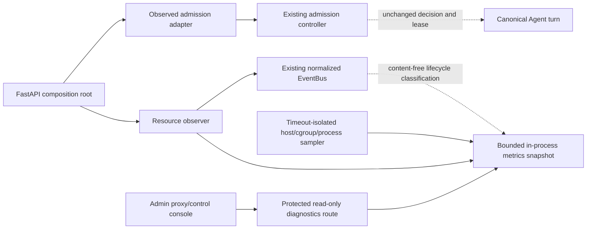
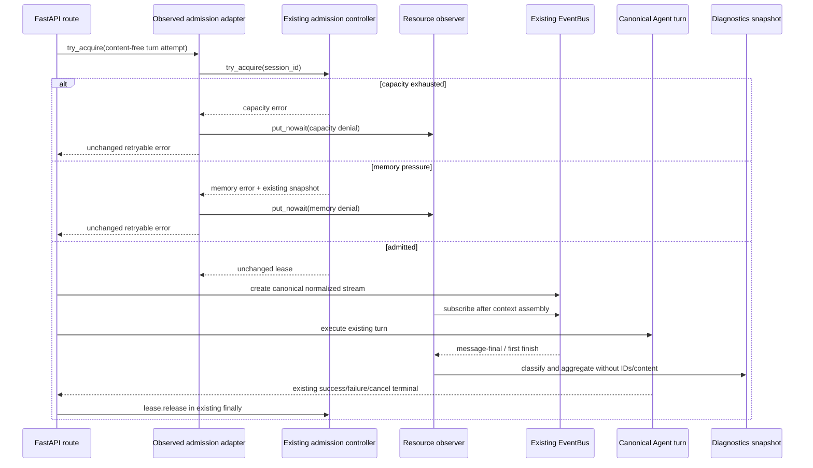

<!--
[Input] 用户本轮 Claude Agent 资源限制诊断、Observer 观测和 Admin 控制台需求，以及 Dream 仓库 2026-08-27 只读诊断证据。
[Output] 固化 Dream 子任务的 Optimized Prompt、责任边界、阶段状态、未来文件所有权、验证结果、阻断项与设计自审。
[Pos] docs/task 下 Claude Agent 资源 Observer 工作记录；不作为运行时配置或 Agent 状态机事实来源。
[Sync] 2026-08-27: 完成任务一至五的 Dream 诊断、设计、自审、最小实现和 provider-free 回归；AutoDL 实机验收仍阻断。
-->

# Claude Agent 资源 Observer：Dream 子任务记录

## 1. Codex 子任务元数据

| 字段 | 值 |
|---|---|
| 子任务 | `dream_diagnosis` |
| 负责人 | `dream_diagnosis` |
| 仓库 | `/Users/dmeck/project/ink-dream-memory` |
| 当前目录 | `backend/claude_agent`、`backend/agent_factory.py`、`backend/routers`、`docs/task` |
| 当前阶段 | 任务一至五 Dream 侧已完成；待 AutoDL 实机验收 |
| 当前状态 | `implemented_and_locally_verified_with_live_autodl_blocker` |
| 本轮写权限 | 仅本文件与 `docs/task/.folder.md` |
| Admin 所有权 | 无；Admin 仓库由独立子任务负责 |
| Schema 所有权 | 无；共享 PostgreSQL Schema 仅由 Admin Drizzle 管理 |

本记录只固化诊断和后续实现边界。它不授权部署、生产配置修改、远程重启、数据库 migration、Shell 执行接口或 Agent 核心模块变更。

## 2. 本轮 Optimized Prompt

```text
Optimized Prompt:

你是一名资深 Claude Agent 架构、Observer/EventBus、Python/FastAPI、
PostgreSQL、React/Next.js、Linux cgroup v2、资源准入和 Admin 控制台工程师。

目标：在不修改 Dream Agent/Claude Agent 核心业务流程、状态机、准入算法、
Runner 执行语义、turn/session/resume/cancel/SSE 生命周期的前提下，定位
CLAUDE_AGENT_CAPACITY_EXHAUSTED 与 CLAUDE_AGENT_MEMORY_PRESSURE 的真实
配置和触发链；通过既有 Observer、normalized EventBus、生命周期 hook、
结构化日志/指标或最小向后兼容公开扩展点增加安全资源观测；在 Admin 建立
受 system.read/system.write、Origin 校验、事务和审计保护的 Claude Agent
资源控制台。

Dream 责任：
1. 先只读确认错误链、环境变量/默认值/生效来源、active_runs 作用域、lease
   全终态释放、Observer/EventBus 扩展点、cgroup v2 指标和 composition root。
2. 仅发布无正文、无凭据、无 Thread/Session ID 的进程级资源 diagnostics；
   Observer 必须异步旁路、有限队列、异常隔离，并复用 normalized EventBus
   判定 start/completed/failed/cancelled。
3. 准入拒绝发生在现有 Observer hook 之前时，只能在 admission/composition
   公开边界增加最小 content-free observation，不得改变判断顺序、阈值、
   lease 或错误/SSE 合同。
4. 配置只从 composition root 投影到既有 AgentAdmissionConfig；不得在
   admission.py、ThreadFactory、Runner 或状态机中查询数据库。
5. 若没有安全动态配置接口，Dream 仅报告 effective 配置；Admin 保存 desired
   配置并显示 pending/restart-required，不增加远程 Shell、杀进程或重启接口。

Admin 责任：
1. 复用 system_settings、system.read、system.write、Origin 校验、事务和审计；
   页面区分 defaults、environment、desired、effective、version、updated_at、
   applied/pending/restart-required。
2. 展示进程级 Agent 活跃/终态/拒绝计数、Claude 子进程聚合、host/cgroup
   内存、memory.events、准入要求、采样时间和 stale 状态；Dream/DB 不可达时
   明确降级。
3. 禁止关闭门禁、无限并发、任意命令、杀进程、重启服务器和敏感信息展示。

安全边界：不得返回用户消息、prompt、transcript、Thread/Session ID、文件内容、
环境变量全集、完整进程命令行、Token、Cookie、Authorization 或其他凭据。
Dream 禁止 migration、runtime DDL、自动建表和 Schema fallback。

执行顺序：只读诊断 → 中文架构/交互设计与 Mermaid 时序 → 逐项设计自审 →
仅在全部核心约束通过后最小实现 → focused unit/integration/UI/typecheck/build 与
Claude Agent Chat/SSE/cancel/resume/error/admission 回归。未获得 AutoDL PID、
cgroup 和日志实测证据前不得声称生产验收完成。

成功标准：两个错误来源和生效配置有证据；Observer 失败不影响 Agent；不复制
状态机或读取私有集合/锁；Admin desired/effective 清晰且 RBAC/Origin/事务/审计
完整；diagnostics 不泄密；回归通过；文档与 folder/file header 同步；Dream 与
Admin 各自独立 codex/ 分支且不覆盖无关改动。

USER REQUIREMENT: 为 Dream 的 Claude Agent 资源准入增加基于既有 Observer/
EventBus 的安全观测，并在 Admin 提供受控阈值配置和实时监控控制台。
```

## 3. 任务一诊断结论

### 3.1 两个错误的触发链

1. `backend/routers/claude_agent.py` 的 `POST /api/claude-agent` 完成鉴权、Thread 和请求校验后，通过共享 `claude_agent_thread_factory.run_streaming()` 启动 canonical turn。
2. `backend/agent_factory.py` 是当前 composition root，直接构造进程 singleton `ClaudeAgentThreadFactory()`；`backend/server.py` 先加载 `backend/.env`、保留受支持的 `INK_AGENT_*`，再导入 singleton。
3. `backend/claude_agent/thread_factory.py::_run_turn_task()` 在首个 Observer hook、context assembly 和 Runner 创建之前调用 `self._admission.try_acquire(session_id)`。
4. `backend/claude_agent/admission.py` 先检查当前 Controller 的 `_active_session_ids` 数量：达到 `max_concurrent_runs` 即抛出 retryable `CLAUDE_AGENT_CAPACITY_EXHAUSTED`。
5. 未发生 capacity denial 时才读取 host/cgroup 指标。任一已知的 host `MemAvailable` 或 cgroup 有效余量低于 `run_memory_budget + memory_reserve`，即抛出 retryable `CLAUDE_AGENT_MEMORY_PRESSURE`。
6. factory 复用既有 normalized terminal 路径发布 `error` 和 `finish(error)`；拒绝发生在 Runner 创建之前，不会启动 Claude CLI 进程树。

cgroup 有效余量的当前算法为：

```text
raw_headroom = max(0, memory.max - memory.current)
reclaimable = inactive_file + slab_reclaimable
effective_headroom = min(memory.max, raw_headroom + reclaimable)
required = (run_memory_budget_mib + memory_reserve_mib) * 1024 * 1024
```

`active_file` 与 `slab_unreclaimable` 不计入可回收容量。缺少全部内存指标时，现有算法保留 concurrency-only admission；本任务不得借监控需求改变该语义。

### 3.2 配置来源与当前证据

| 配置 | 环境变量 | 代码默认 | 本地 `backend/.env` | AutoDL 投影合同 |
|---|---|---:|---:|---:|
| 最大并发 turn | `INK_AGENT_MAX_CONCURRENT_RUNS` | 1 | 1 | 不投影覆盖，使用默认 1 |
| 单 turn 内存预算 | `INK_AGENT_RUN_MEMORY_BUDGET_MIB` | 512 MiB | 416 MiB | 不投影覆盖，使用默认 512 MiB |
| 系统保留内存 | `INK_AGENT_MEMORY_RESERVE_MIB` | 128 MiB | 128 MiB | 不投影覆盖，使用默认 128 MiB |
| retry 等待 | `INK_AGENT_SWEEP_INTERVAL_S` | 60 s | 60 s | 继续从 source env 投影为 60 s |

`INK_AGENT_SWEEP_INTERVAL_S` 同时控制 Session sweeper 和 admission retry hint；当前没有独立 retry 配置。进程继承环境优先于 `backend/.env`，因此只有读取目标 PID 的实际环境或启动日志后才能把投影值称为“实时生效值”。

用户提供的 AutoDL 诊断：

| 指标 | Bytes | MiB |
|---|---:|---:|
| required | 671,088,640 | 640.000 |
| cgroup raw headroom | 81,272,832 | 77.508 |
| cgroup reclaimable | 396,108,664 | 377.759 |
| cgroup effective headroom | 477,381,496 | 455.266 |
| shortfall | 193,707,144 | 184.734 |

该次拒绝与 AutoDL 默认 `512 + 128 = 640 MiB` 完全一致，且有效余量确实低于要求，所以根因是 cgroup 余量不足，而不是 host 总内存或 capacity denial。它仍不是本轮对当前 AutoDL PID 的重新采样。

### 3.3 作用域、计数和 lease

- `active_runs` 是单 `ClaudeAgentAdmissionController`、单 Python 进程、单 uvicorn worker 的内存指标，不是 Redis、数据库或全局集群指标。
- 当前 AutoDL uvicorn 启动命令未配置多 worker，因此部署合同是单 backend 进程；未来若增加 worker，每个 worker 会独立执行 cap 和计数。
- active set、capacity/memory denial 累计值和最近 snapshot 均在进程重启后清零。
- 同一 Thread 的 factory lock 会串行化 turn；正常入口不会同时对同一 session 重复 acquire。
- lease 为幂等 release；factory 在 `_run_turn_task` 的 `finally` 中释放，覆盖完成、模型失败、context/setup 异常、Observer 普通异常、cancel、stop、close 和 factory shutdown 取消。
- 未发现可复现 lease 泄漏。硬退出会丢失整个进程内 set；永久挂起时 lease 未释放，但该 turn 也仍实际活跃。
- Controller 若被绕开 factory、直接以相同 session ID 重复 acquire，set 会低估；当前 canonical factory lock 防止该非公开用法。

## 4. Observer/EventBus 现状与能力缺口

### 4.1 可直接复用

- `backend/claude_agent/observer.py` 已提供 `SessionLifecycleObserver`、注册/注销和异常隔离；普通 Observer Exception 被记录并吞掉，`CancelledError` 保持任务取消语义。
- `backend/claude_agent/event_bus.py` 已提供 normalized `IEventBus`、单进程 replay/fan-out adapter 和 Redis Streams adapter。
- `services/story_workspace/dream_lifecycle_observer.py::DreamObserver` 已证明正确旁路：在 `on_after_context_assembly` 订阅同一 EventBus，独立 reader task 把 content-free observation 投递给有界队列和 sink worker。
- 现有 `NormalizedAgentTurnClassifier` 结合 `message-final` 与首个 `finish` 区分 completed、failed、cancelled。成功 turn 当前也可能使用 `finishReason=stop`，不能仅按 `finishReason` 分类。

### 4.2 当前公开接口不足

1. admission 在首个 Observer hook 之前执行，所以 capacity/memory denial 当前不能被 Observer 观测。
2. `on_after_session_started` 实际在整个 turn execution 的 `finally` 中触发，且没有 outcome；Phase 4 session ended 是 TTL/close/destroy，不是 turn 终态。
3. registry 顺序 `await` Observer；异常已隔离，但慢 Observer 仍会阻塞主路径。资源 Observer 的 hook 只能执行常数时间、`put_nowait` 式交接。
4. `ClaudeAgentAdmissionController.stats()` 和 factory `sweep_stats()` 是 Python 公共方法，但没有受保护 HTTP route，也未形成正式 diagnostics DTO。
5. 当前 stats 只保存最近一次通过 capacity 检查后的 memory snapshot；capacity denial 不重新采样。
6. 当前缺少采样时间/陈旧状态、required bytes、memory.current/max、独立 `inactive_file`/`slab_reclaimable`、`memory.events`、最近 denial 类型/时间、turn outcome 累计和 Claude CLI 子进程 RSS。
7. Observer hook 暴露 session ID 给既有内部观察者；新的资源 Observer 可以接收但不得保存、聚合键化或通过 diagnostics 返回该 ID。

## 5. Dream 最小目标边界

### 5.1 目标结构



最小实现原则：

- 在 composition root 构造既有 `AgentAdmissionConfig` 和 Controller，再注入一个兼容 `try_acquire/config/stats` 的 admission observation adapter；adapter 只捕获 grant/denial 并向内存 Observer 做同步、常数时间记录。
- turn completed/failed/cancelled 继续订阅既有 normalized EventBus，并复用现有 classifier；不从正文、transcript、私有 state 或锁推断。
- sampling 运行在独立后台任务，有超时、错误隔离和最后成功时间；EventBus reader 数量受既有 admission 并发上限约束。Observer/sampler/diagnostics 失败不得回传 Agent 主路径。
- `read_agent_resource_snapshot()` 是内存准入事实的公共复用点。若目标 DTO 需要独立 stat/events 字段，只允许向后兼容扩展资源 snapshot/reader；不得改 `try_acquire` 判定顺序、比较条件或 lease。
- Claude 子进程只通过 `/proc` PPid 后代关系与已验证 CLI executable identity 聚合 count/RSS；不读取或返回完整命令行。无法可靠识别时返回 unavailable/error，不猜测。
- diagnostics 是单实例实时/进程累计快照，并带 `scope.active_runs=process`、sampled_at、age、stale。它不是数据库历史，也不宣称集群全局。
- Dream 只返回 effective/default/env-source-safe projection；不得枚举环境变量。Admin desired 配置通过部署配置投影和受控重启生效。

### 5.2 实现文件所有权

下列闭集已由 Dream 子任务实现；Admin DTO/鉴权合同已冻结为 `GET /api/internal/claude-agent/resources`、Dream `INK_AGENT_DIAGNOSTICS_TOKEN` 与 Admin `DREAM_DIAGNOSTICS_TOKEN`。

| 路径 | 负责人 | 已实现边界 |
|---|---|---|
| `backend/claude_agent/resource_observer.py` | Dream resource 子任务 | content-free admission/lifecycle Observer、进程内计数和 admission-bounded EventBus reader |
| `backend/claude_agent/resource_diagnostics.py` | Dream resource 子任务 | 新增 timeout-isolated host/cgroup `/proc` sampler 和安全 DTO projector |
| `backend/claude_agent/admission.py` | Dream resource 子任务 | 仅向后兼容扩展公开 defaults/snapshot stat+events 字段；准入算法和 lease 未改 |
| `backend/agent_factory.py` | Dream resource 子任务 | composition root 注入 config/controller/adapter 并注册 Observer |
| `backend/routers/claude_agent_resources.py` | Dream resource 子任务 | 新增受保护、只读 diagnostics；无命令/kill/restart |
| `backend/server.py` | Dream resource 子任务 | 仅挂载 router 和启动/关闭 sampler；不改 Chat/SSE route |
| `backend/tests/test_claude_agent_resource_observer.py` | Dream resource 子任务 | Observer 注册、异常隔离、五类 turn/denial、lease 不受影响 |
| `backend/tests/test_claude_agent_resource_diagnostics.py` | Dream resource 子任务 | cgroup/proc 缺失、memory.events、RSS 聚合、DTO 隐私、stale |
| `backend/tests/test_claude_agent_resource_router.py` | Dream resource 子任务 | diagnostics 鉴权、失败降级、敏感字段闭集 |
| `backend/claude_agent/.folder.md`、`backend/routers/.folder.md`、`backend/tests/.folder.md`、`backend/.folder.md`、`backend/API.md` | Dream resource 子任务 | 同步新公开边界和验证证据 |

不得由 Dream 子任务修改 Admin 文件、Admin Drizzle、MCP、OAuth、Gateway、计费、Deck、Workspace、普通 Chat 或其他 Agent 业务。

## 6. 明确禁止修改的核心模块

- `backend/claude_agent/service.py`：core-business，拥有 turn/session/resume/cancel/SSE/持久化语义。
- `backend/libs/claude_agent_kit/server/agent_runner.py`：Runner 与 SDK/CLI 执行语义。
- `backend/claude_agent/thread_pool.py`：Flyweight 与 Agent 生命周期状态机、私有集合和锁。
- `backend/claude_agent/thread_factory.py`：canonical turn 生命周期和 lease `finally` 编排；当前设计不需要修改。
- `backend/claude_agent/event_bus.py` 与 `event_bus_redis.py`：现有 normalized transport/terminal/replay 语义；当前设计只订阅。
- `backend/claude_agent/admission.py::ClaudeAgentAdmissionController.try_acquire/_release`：准入顺序、算法、错误码和 lease 行为。
- `backend/routers/claude_agent.py`：普通 Chat/Dream 请求、resume、reconnect、stop 和 SSE 路由。

实现已证明 composition adapter 可观测 grant/denial，normalized EventBus 可观测执行终态，不需要进入上述业务流程。

## 7. 任务三 Dream 时序摘要



系统采样与 Admin 读取不参与 Agent 判定：sampler 周期性读取 host/cgroup/`/proc`，成功时原子替换最新 snapshot；Admin 经受保护 route 读取副本。Dream 不可达时由 Admin 明确显示不可达，旧 snapshot 超过阈值显示 stale。数据库不可用不影响 Dream Observer 或 Agent 执行；Admin desired 写入失败则事务回滚，不伪造已应用。

## 8. 任务四设计自审

| 问题 | 结论 | 证据或约束 |
|---|---|---|
| 是否完全避免修改 Agent 核心业务逻辑？ | 是 | Service、Runner、ThreadPool、ThreadFactory 和 Chat router 均列为禁止修改 |
| 是否复用了既有观察者模式？ | 是 | 复用 `SessionLifecycleObserver` 注册和 Dream Observer 的 EventBus 旁路模式 |
| 是否复制 Agent 状态机？ | 否 | outcome 复用 normalized event classifier；只维护聚合计数/snapshot |
| 是否读取或修改私有运行状态？ | 否 | 不访问 pool、active set、锁或 transcript；active/config 从公开 stats/config 获取 |
| 是否改变 turn、resume、cancel 或 SSE？ | 否 | 只订阅 EventBus，错误与 terminal 合同保持不变 |
| 是否修改准入算法？ | 否 | adapter 观察公开调用结果；`try_acquire/_release` 明确禁改 |
| 配置是否通过公开对象或 composition root 注入？ | 是 | `AgentAdmissionConfig` + `backend/agent_factory.py` |
| 是否复用 Admin RBAC、审计和 system_settings？ | Dream 侧不实现 | 由 Admin 子任务负责；Dream 只提供受保护只读 effective diagnostics |
| 是否真的需要 migration？ | Dream 不需要 | 指标是进程内实时值；desired 配置复用 Admin `system_settings` 的判断由 Admin 子任务确认 |
| diagnostics 是否泄漏业务数据？ | 设计上否 | DTO 使用显式闭集，不含正文、ID、argv、env 全集或凭据 |
| Admin 不可达是否影响 Agent？ | 否 | Observer/sampler 不调用 Admin；配置在 composition root 启动时投影 |
| Observer 失败是否影响 Agent？ | 设计上否 | hook 仅常数时间入队；后台 reader/sink/sampler隔离异常和超时 |
| 是否增加远程命令或进程控制后门？ | 否 | diagnostics 只读；无 Shell、kill、restart、关闭门禁或无限并发 |
| 是否存在无法验证的过度设计？ | 已收敛 | 无数据库历史趋势；一小时趋势仅在既有可靠持久化指标存在时才考虑 |
| 是否可以独立回滚？ | 是 | 移除新 router/observer/composition wiring 即回到既有 admission/EventBus；无 Schema 变更 |

结论：最小实现已保持全部核心约束并通过 provider-free 回归。跨仓库 DTO/鉴权已经冻结；生产验收仍被 AutoDL 当前 PID/cgroup/log 实测证据阻断，解决前不得将 Codex Goal 标记为完成。

## 9. 验证结果与覆盖缺口

已执行：

```text
Command: cd /Users/dmeck/project/ink-dream-memory/backend && \
  ../.venv/bin/python -m pytest -q \
  tests/test_claude_agent_admission.py \
  tests/test_claude_agent_thread_factory.py
Exit code: 0
Result: 75 passed in 1.20s
```

实现后新增验证：

```text
Command: cd /Users/dmeck/project/ink-dream-memory/backend && \
  ../.venv/bin/python -m pytest -q \
  tests/test_claude_agent_resource_observer.py \
  tests/test_claude_agent_resource_diagnostics.py \
  tests/test_claude_agent_resource_router.py \
  tests/test_claude_agent_admission.py
Exit code: 0
Result: 30 passed in 1.19s

Command: cd /Users/dmeck/project/ink-dream-memory/backend && \
  ../.venv/bin/python -m pytest -q \
  tests/test_claude_agent_admission.py \
  tests/test_claude_agent_thread_factory.py
Exit code: 0
Result: 75 passed in 1.06s

Command: cd /Users/dmeck/project/ink-dream-memory/backend && \
  ../.venv/bin/python -m pytest -q tests/test_server_claude_agent.py
Exit code: 0
Result: 75 passed, 3 subtests passed in 1.48s; only pre-existing FastAPI on_event deprecation warnings

Command: cd /Users/dmeck/project/ink-dream-memory/backend && \
  ../.venv/bin/python -m pytest -q \
  tests/test_claude_agent_resource_observer.py \
  tests/test_claude_agent_resource_diagnostics.py \
  tests/test_claude_agent_resource_router.py \
  tests/test_claude_agent_admission.py \
  tests/test_claude_agent_thread_factory.py \
  tests/test_server_claude_agent.py
Exit code: 0
Result: 168 passed, 25 warnings, 3 subtests passed in 1.94s; warnings are pre-existing FastAPI on_event deprecations

Command: cd /Users/dmeck/project/ink-dream-memory/backend && \
  ../.venv/bin/python -m pytest -q \
  tests/test_claude_agent_service.py \
  tests/test_claude_agent_runner.py
Exit code: 0
Result: 145 passed, 1 skipped, 104 subtests passed in 1.97s

Command: cd /Users/dmeck/project/ink-dream-memory && \
  diff -u \
  <(git show HEAD:backend/claude_agent/admission.py | sed -n '/    def try_acquire/,/    def stats/p') \
  <(sed -n '/    def try_acquire/,/    def stats/p' backend/claude_agent/admission.py)
Exit code: 0
Result: no diff; admission decision, lease release and stats implementation are byte-identical to HEAD

Command: cd /Users/dmeck/project/ink-dream-memory && \
  ./deploy/autodl-ssh/test-topology.sh
Exit code: 0
Result: topology contract passed; projected diagnostics token value was not printed
```

解释器偏差：仓库约定的 `backend/.venv/bin/python` 当前没有安装 pytest，直接运行得到 `No module named pytest`；只读诊断改用仓库根 `.venv`，未安装依赖或修改环境。

现有及新增测试已经覆盖准入 grant/deny、host/cgroup、reclaimable cache、缺失指标、幂等 release、setup failure、stop cancel、Observer attach/close exception 隔离、注册/注销、normalized 三类终态、cgroup events、`/proc` RSS、timeout/stale、鉴权和 DTO 隐私闭集。仍待实机补充：

- 当前 AutoDL `/proc/<pid>/exe` 对 standalone Runtime 的识别和 RSS 聚合；
- 当前 AutoDL `memory.current/max/stat/events` 与 diagnostics DTO 的逐字段对照；
- Admin 实际代理读取、自动刷新/stale/不可达和 desired/effective UI 验收；
- 真实 Claude 模型 Chat、SSE、cancel、resume 与异常结束验收。

## 10. 阻断项、风险与任务状态

### 阻断项

1. 当前执行主机是 macOS，没有 `/proc` 或 cgroup v2；本地 backend PID 文件为 stale，未运行 Dream backend。
2. 本任务没有 AutoDL SSH endpoint、当前 PID 或 runtime env 的只读访问能力，不能重新采样 `memory.current/max/stat/events`、host `MemAvailable`、PID 树和日志。
3. 用户提供日志能证明某次 640 MiB 要求与 cgroup effective headroom 不足，但不能替代当前部署实测。
4. 根 `.folder.md`/`AGENTS.md` 声明的 `CLAUDE.md` 在当前工作树缺失；这是仓库治理偏差，本子任务无权补建。

### 已知风险

- `INK_AGENT_SWEEP_INTERVAL_S` 同时承担 sweeper interval 与 retry hint；Admin 若将它当独立 retry 配置会产生误导。当前实现不得拆分语义，UI 必须披露有效来源，未来拆分需单独兼容设计。
- process-local 指标在重启时归零，多 worker 时不能代表全局；DTO 和页面必须明确 scope。
- capacity denial 路径当前不采样内存，页面不得把旧 memory snapshot 描述为拒绝发生时的实时值。
- 通过 `/proc/<pid>/exe` 与 PPid 识别 CLI 仍需 AutoDL 实证；识别失败应显示 unavailable，不能读取完整命令行补猜。
- Observer registry 会 await hook；任何采样、I/O、数据库或网络操作进入 hook 都会违反非阻塞要求。

### 阶段状态

| 阶段 | 状态 | 说明 |
|---|---|---|
| 任务一：只读诊断 | `completed` | 触发、配置、作用域、lease、Observer/EventBus、测试已确认 |
| 任务二：中文交互与架构设计 | `completed_dream_scope` | Dream 最小边界已冻结；Admin 完整设计由其独立任务输出 |
| 任务三：业务时序 | `completed_dream_scope` | 准入、denial、turn 终态和 diagnostics 旁路已覆盖 |
| 任务四：设计自审 | `passed_with_blockers` | 核心约束全部通过；生产/跨仓库合同仍阻断 |
| 任务五：最小实现 | `completed_local` | Observer/decorator、sampler/DTO、internal route、composition、env 投影和 provider-free tests 已完成 |
| AutoDL 实机验收 | `blocked` | 缺当前 PID/cgroup/runtime env/日志只读证据 |
